# 2026年科目一基础理论知识考试题库

来源：https://www.aijiaxiao.com/tiba/kmy/ ；采集日期：2026-09-23；去重后 1844 题。

## 1. 驾驶机动车在道路上违反道路交通安全法的行为，属于什么行为？

题号：1 · 章节：全部题目、第1章：道路交通安全法律、法规和规章 · [原题](https://www.aijiaxiao.com/tiba/1/)

- A、违章行为
- B、违法行为
- C、过失行为
- D、违规行为

**答案：B**

解析：“违反道路交通安全法”，违反法律法规即为违法行为。官方已无违章/违规的说法。

## 2. 机动车驾驶人违法驾驶造成重大交通事故构成犯罪的，依法追究什么责任？

题号：2 · 章节：全部题目、第1章：道路交通安全法律、法规和规章 · [原题](https://www.aijiaxiao.com/tiba/2/)

- A、刑事责任
- B、民事责任
- C、经济责任
- D、直接责任

**答案：A**

解析：《道路交通安全法》第一百零一条：违反道路交通安全法律、法规的规定，发生重大交通事故，构成犯罪的，依法追究刑事责任，并由公安机关交通管理部门吊销机动车驾驶证。

## 3. 机动车驾驶人造成事故后逃逸构成犯罪的，吊销驾驶证且多长时间不得重新取得驾驶证？

题号：3 · 章节：全部题目、第1章：道路交通安全法律、法规和规章 · [原题](https://www.aijiaxiao.com/tiba/3/)

- A、5年内
- B、10年内
- C、终生
- D、20年内

**答案：C**

解析：《道路交通安全法》第一百零一条：造成交通事故后逃逸的，由公安机关交通管理部门吊销机动车驾驶证，且终生不得重新取得机动车驾驶证。

## 4. 驾驶机动车违反道路交通安全法律法规发生交通事故属于交通违章行为。

题号：4 · 章节：全部题目、第1章：道路交通安全法律、法规和规章 · [原题](https://www.aijiaxiao.com/tiba/4/)

- A、正确
- B、错误

**答案：B**

解析：“违反道路交通安全法”，违反法律法规即为违法行为。官方已无违章/违规的说法。

## 5. 驾驶机动车在道路上违反道路通行规定应当接受相应的处罚。

题号：5 · 章节：全部题目、第1章：道路交通安全法律、法规和规章 · [原题](https://www.aijiaxiao.com/tiba/5/)

- A、正确
- B、错误

**答案：A**

解析：常识题，犯错就得接受相应的处罚。

## 6. 对未取得驾驶证驾驶机动车的，追究其法律责任。

题号：6 · 章节：全部题目、第1章：道路交通安全法律、法规和规章 · [原题](https://www.aijiaxiao.com/tiba/6/)

- A、正确
- B、错误

**答案：A**

解析：《道路交通安全法》第九十九条：未取得机动车驾驶证、机动车驾驶证被吊销或者机动车驾驶证被暂扣期间驾驶机动车的，由公安机关交通管理部门处二百元以上二千元以下罚款，可以并处十五日以下拘留。

## 7. 对违法驾驶发生重大交通事故且构成犯罪的，不追究其刑事责任。

题号：7 · 章节：全部题目、第1章：道路交通安全法律、法规和规章 · [原题](https://www.aijiaxiao.com/tiba/7/)

- A、正确
- B、错误

**答案：B**

解析：《道路交通安全法》第一百零一条：违反道路交通安全法律、法规的规定，发生重大交通事故，构成犯罪的，依法追究刑事责任，并由公安机关交通管理部门吊销机动车驾驶证。

## 8. 造成交通事故后逃逸且构成犯罪的驾驶人,将吊销驾驶证且终生不得重新取得驾驶证。

题号：8 · 章节：全部题目、第1章：道路交通安全法律、法规和规章 · [原题](https://www.aijiaxiao.com/tiba/8/)

- A、正确
- B、错误

**答案：A**

解析：《道路交通安全法》第一百零一条：造成交通事故后逃逸的，由公安机关交通管理部门吊销机动车驾驶证，且终生不得重新取得机动车驾驶证。

## 9. 驾驶机动车在道路上违反交通安全法规的行为属于违法行为。

题号：9 · 章节：全部题目、第1章：道路交通安全法律、法规和规章 · [原题](https://www.aijiaxiao.com/tiba/9/)

- A、正确
- B、错误

**答案：A**

解析：“违反道路交通安全法”，违反法律法规即为违法行为。官方已无违章/违规的说法。

## 10. 驾驶机动车应当随身携带哪种证件？

题号：10 · 章节：全部题目、第1章：道路交通安全法律、法规和规章 · [原题](https://www.aijiaxiao.com/tiba/10/)

- A、工作证
- B、驾驶证
- C、身份证
- D、职业资格证

**答案：B**

解析：《道路交通安全法》第十九条：驾驶人应当按照驾驶证载明的准驾车型驾驶机动车；驾驶机动车时，应当随身携带机动车驾驶证。

## 11. 未取得驾驶证的学员在道路上学习驾驶技能，下列哪种做法是正确的？

题号：11 · 章节：全部题目、第1章：道路交通安全法律、法规和规章 · [原题](https://www.aijiaxiao.com/tiba/11/)

- A、使用所学车型的教练车由教练员随车指导
- B、使用所学车型的教练车单独驾驶学习
- C、使用私家车由教练员随车指导
- D、使用所学车型的教练车由非教练员的驾驶人随车指导

**答案：A**

解析：《公安部令第123号》规定：未取得驾驶证的学员在道路上学习驾驶技能，使用所学车型的教练车由教练员随车指导。

## 12. 机动车驾驶人初次申领驾驶证后的实习期是多长时间？

题号：12 · 章节：全部题目、第1章：道路交通安全法律、法规和规章 · [原题](https://www.aijiaxiao.com/tiba/12/)

- A、6个月
- B、12个月
- C、16个月
- D、18个月

**答案：B**

解析：《公安部令第123号》第六十四条规定：机动车驾驶人初次申请机动车驾驶证和增加准驾车型后的12个月为实习期。

## 13. 在实习期内驾驶机动车的，应当在车身后部粘贴或者悬挂哪种标志？

题号：13 · 章节：全部题目、第1章：道路交通安全法律、法规和规章 · [原题](https://www.aijiaxiao.com/tiba/13/)

- A、注意新手标志
- B、注意避让标志
- C、统一式样的实习标志
- D、注意车距标志

**答案：C**

解析：《公安部令第123号》第六十四条规定：在实习期内驾驶机动车的，应当在车身后部粘贴或者悬挂统一式样的实习标志。

## 14. 以欺骗、贿赂等不正当手段取得驾驶证被依法撤销驾驶许可的，多长时间不得重新申请驾驶许可？

题号：14 · 章节：全部题目、第1章：道路交通安全法律、法规和规章 · [原题](https://www.aijiaxiao.com/tiba/14/)

- A、3年内
- B、终身
- C、1年内
- D、5年内

**答案：A**

解析：《公安部令第123号》第七十八条规定：申请人以欺骗、贿赂等不正当手段取得机动车驾驶证的，公安机关交通管理部门收缴机动车驾驶证，撤销机动车驾驶许可；申请人在三年内不得再次申领机动车驾驶证。吊销机动车证的为二年，撤销机动车证的为三年，以醉酒吊销五年，因逃跑而吊销是终身，叫“吊二撤三醉五逃终身”。

## 15. 驾驶人要按照驾驶证载明的准驾车型驾驶车辆。

题号：15 · 章节：全部题目、第1章：道路交通安全法律、法规和规章 · [原题](https://www.aijiaxiao.com/tiba/15/)

- A、正确
- B、错误

**答案：A**

解析：《公安部令第123号》规定：驾驶与准驾驶车型不符的机动车的违法行为，一次记12分。

## 16. 上路行驶的机动车未随车携带身份证的，交通警察可依法扣留机动车。

题号：16 · 章节：全部题目、第1章：道路交通安全法律、法规和规章 · [原题](https://www.aijiaxiao.com/tiba/16/)

- A、正确
- B、错误

**答案：B**

解析：《道路交通安全法》第九十五条：上道路行驶的机动车未悬挂机动车号牌，未放置检验合格标志、保险标志，或者未随车携带行驶证、驾驶证的，公安机关交通管理部门应当扣留机动车。

## 17. 上路行驶的机动车未放置检验合格标志的，交通警察可依法扣留机动车。

题号：17 · 章节：全部题目、第1章：道路交通安全法律、法规和规章 · [原题](https://www.aijiaxiao.com/tiba/17/)

- A、正确
- B、错误

**答案：A**

解析：《道路交通安全法》第九十五条：上道路行驶的机动车未悬挂机动车号牌，未放置检验合格标志、保险标志，或者未随车携带行驶证、驾驶证的，公安机关交通管理部门应当扣留机动车。

## 18. 伪造、变造机动车驾驶证构成犯罪的将被依法追究刑事责任。

题号：18 · 章节：全部题目、第1章：道路交通安全法律、法规和规章 · [原题](https://www.aijiaxiao.com/tiba/18/)

- A、正确
- B、错误

**答案：A**

解析：《道路交通安全法》第九十六条：伪造、变造或者使用伪造、变造的机动车登记证书、号牌、行驶证、驾驶证的，由公安机关交通管理部门予以收缴，扣留该机动车，处十五日以下拘留，并处二千元以上五千元以下罚款；构成犯罪的，依法追究刑事责任。

## 19. 机动车驾驶人在实习期内驾驶机动车不得牵引挂车。

题号：19 · 章节：全部题目、第1章：道路交通安全法律、法规和规章 · [原题](https://www.aijiaxiao.com/tiba/19/)

- A、正确
- B、错误

**答案：A**

解析：《公安部令第123号》第六十五条规定：机动车驾驶人在实习期内不得驾驶公共汽车、营运客车或者执行任务的警车、消防车、救护车、工程救险车以及载有爆炸物品、易燃易爆化学物品、剧毒或者放射性等危险物品的机动车；驾驶的机动车不得牵引挂车。

## 20. 驾驶拼装机动车上路行驶的驾驶人，除按规定接受罚款外，还要受到哪种处理？

题号：20 · 章节：全部题目、第1章：道路交通安全法律、法规和规章 · [原题](https://www.aijiaxiao.com/tiba/20/)

- A、处10日以下拘留
- B、暂扣驾驶证
- C、吊销驾驶证
- D、追究刑事责任

**答案：C**

解析：《道路交通安全法》第一百条：驾驶拼装的机动车或者已达到报废标准的机动车上道路行驶的，公安机关交通管理部门应当予以收缴，强制报废。对驾驶前款所列机动车上道路行驶的驾驶人，处200元以上2000元以下罚款，并吊销机动车驾驶证。

## 21. 驾驶报废机动车上路行驶的驾驶人，除按规定罚款外，还要受到哪种处理？

题号：21 · 章节：全部题目、第1章：道路交通安全法律、法规和规章 · [原题](https://www.aijiaxiao.com/tiba/21/)

- A、撤销驾驶许可
- B、收缴驾驶证
- C、强制恢复车况
- D、吊销驾驶证

**答案：D**

解析：《道路交通安全法》第一百条：驾驶拼装的机动车或者已达到报废标准的机动车上道路行驶的，公安机关交通管理部门应当予以收缴，强制报废。对驾驶前款所列机动车上道路行驶的驾驶人，处200元以上2000元以下罚款，并吊销机动车驾驶证。

## 22. 对驾驶已达到报废标准的机动车上路行驶的驾驶人，会受到下列哪种处罚？

题号：22 · 章节：全部题目、第1章：道路交通安全法律、法规和规章 · [原题](https://www.aijiaxiao.com/tiba/22/)

- A、处15日以下拘留
- B、吊销机动车驾驶证
- C、处20以上200元以下罚款
- D、追究刑事责任

**答案：B**

解析：《道路交通安全法》第一百条：驾驶拼装的机动车或者已达到报废标准的机动车上道路行驶的，公安机关交通管理部门应当予以收缴，强制报废。对驾驶前款所列机动车上道路行驶的驾驶人，处200元以上2000元以下罚款，并吊销机动车驾驶证。

## 23. 对驾驶拼装机动车上路行驶的驾驶人，会受到下列哪种处罚？

题号：23 · 章节：全部题目、第1章：道路交通安全法律、法规和规章 · [原题](https://www.aijiaxiao.com/tiba/23/)

- A、处15日以下拘留
- B、依法追究刑事责任
- C、处200以上2000元以下罚款
- D、吊销机动车行驶证

**答案：C**

解析：《道路交通安全法》第一百条：驾驶拼装的机动车或者已达到报废标准的机动车上道路行驶的，公安机关交通管理部门应当予以收缴，强制报废。对驾驶前款所列机动车上道路行驶的驾驶人，处200元以上2000元以下罚款，并吊销机动车驾驶证。

## 24. 驾驶机动车上路前应当检查车辆安全技术性能。

题号：24 · 章节：全部题目、第1章：道路交通安全法律、法规和规章 · [原题](https://www.aijiaxiao.com/tiba/24/)

- A、正确
- B、错误

**答案：A**

解析：《道路交通安全法》第二十一条：驾驶人驾驶机动车上道路行驶前，应当对机动车的安全技术性能进行认真检查；不得驾驶安全设施不全或者机件不符合技术标准等具有安全隐患的机动车。

## 25. 不得驾驶具有安全隐患的机动车上道路行驶。

题号：25 · 章节：全部题目、第1章：道路交通安全法律、法规和规章 · [原题](https://www.aijiaxiao.com/tiba/25/)

- A、正确
- B、错误

**答案：A**

解析：《道路交通安全法》第二十一条：驾驶人驾驶机动车上道路行驶前，应当对机动车的安全技术性能进行认真检查；不得驾驶安全设施不全或者机件不符合技术标准等具有安全隐患的机动车。

## 26. 拼装的机动车只要认为安全就可以上路行驶。

题号：26 · 章节：全部题目、第1章：道路交通安全法律、法规和规章 · [原题](https://www.aijiaxiao.com/tiba/26/)

- A、正确
- B、错误

**答案：B**

解析：《道路交通安全法》第一百条：驾驶拼装的机动车或者已达到报废标准的机动车上道路行驶的，公安机关交通管理部门应当予以收缴，强制报废。

## 27. 已经达到报废标准的机动车经大修后可以上路行驶。

题号：27 · 章节：全部题目、第1章：道路交通安全法律、法规和规章 · [原题](https://www.aijiaxiao.com/tiba/27/)

- A、正确
- B、错误

**答案：B**

解析：《道路交通安全法》第一百条：驾驶拼装的机动车或者已达到报废标准的机动车上道路行驶的，公安机关交通管理部门应当予以收缴，强制报废。

## 28. 下列哪种证件是驾驶机动车上路行驶应当随车携带？

题号：28 · 章节：全部题目、第1章：道路交通安全法律、法规和规章 · [原题](https://www.aijiaxiao.com/tiba/28/)

- A、机动车登记证
- B、机动车保险单
- C、机动车行驶证
- D、出厂合格证明

**答案：C**

解析：《道路交通安全法》第十一条：　驾驶机动车上道路行驶，应当悬挂机动车号牌，放置检验合格标志、保险标志，并随车携带机动车行驶证。

## 29. 驾驶这种机动车上路行驶属于什么行为？

题号：29 · 章节：全部题目、第1章：道路交通安全法律、法规和规章 · [原题](https://www.aijiaxiao.com/tiba/29/)

- A、违规行为
- B、违章行为
- C、违法行为
- D、犯罪行为

**答案：C**

解析：《道路交通安全法》第十一条：机动车号牌应当按照规定悬挂并保持清晰、完整，不得故意遮挡、污损。违反《道路交通安全法》即为违法。

## 30. 下列哪种标志是驾驶机动车上路行驶应当在车上放置的标志？

题号：30 · 章节：全部题目、第1章：道路交通安全法律、法规和规章 · [原题](https://www.aijiaxiao.com/tiba/30/)

- A、产品合格标志
- B、保持车距标志
- C、提醒危险标志
- D、检验合格标志

**答案：D**

解析：《道路交通安全法》第十一条：驾驶机动车上道路行驶，应当悬挂机动车号牌，放置检验合格标志、保险标志，并随车携带机动车行驶证。

## 31. 驾驶人在下列哪种情况下不能驾驶机动车？

题号：31 · 章节：全部题目、第1章：道路交通安全法律、法规和规章 · [原题](https://www.aijiaxiao.com/tiba/31/)

- A、饮酒后
- B、喝茶后
- C、喝咖啡后
- D、喝牛奶后

**答案：A**

解析：喝酒后不能开车，酒后驾车违法。

## 32. 这辆在道路上行驶的机动车有下列哪种违法行为？

题号：32 · 章节：全部题目、第1章：道路交通安全法律、法规和规章 · [原题](https://www.aijiaxiao.com/tiba/32/)

- A、逆向行驶
- B、未按规定悬挂号牌
- C、故意遮挡号牌
- D、占用非机动车道

**答案：C**

解析：用光盘遮挡号牌了，现在遮挡号牌的直接扣12分。

## 33. 驾驶机动车上路行驶应当按规定悬挂号牌。

题号：33 · 章节：全部题目、第1章：道路交通安全法律、法规和规章 · [原题](https://www.aijiaxiao.com/tiba/33/)

- A、正确
- B、错误

**答案：A**

解析：《道路交通安全法》第十一条：驾驶机动车上道路行驶，应当悬挂机动车号牌，放置检验合格标志、保险标志，并随车携带机动车行驶证。

## 34. 驾驶这种机动车上路行驶没有违法行为。

题号：34 · 章节：全部题目、第1章：道路交通安全法律、法规和规章 · [原题](https://www.aijiaxiao.com/tiba/34/)

- A、正确
- B、错误

**答案：B**

解析：机动车号牌被遮挡。

## 35. 服用国家管制的精神药品可以短途驾驶机动车。

题号：35 · 章节：全部题目、第1章：道路交通安全法律、法规和规章 · [原题](https://www.aijiaxiao.com/tiba/35/)

- A、正确
- B、错误

**答案：B**

解析：《道路交通安全法》第二十二条：饮酒、服用国家管制的精神药品或者麻醉药品，或者患有妨碍安全驾驶机动车的疾病，或者过度疲劳影响安全驾驶的，不得驾驶机动车。

## 36. 饮酒后只要不影响驾驶操作可以短距离驾驶机动车。

题号：36 · 章节：全部题目、第1章：道路交通安全法律、法规和规章 · [原题](https://www.aijiaxiao.com/tiba/36/)

- A、正确
- B、错误

**答案：B**

解析：《道路交通安全法》第九十一条：饮酒后驾驶机动车的，处暂扣六个月机动车驾驶证，并处一千元以上二千元以下罚款。

## 37. 公安机关交通管理部门对驾驶人的交通违法行为除依法给予行政处罚外,实行下列哪种制度？

题号：37 · 章节：全部题目、第1章：道路交通安全法律、法规和规章 · [原题](https://www.aijiaxiao.com/tiba/37/)

- A、违法登记制度
- B、奖励里程制度
- C、累积记分制度
- D、强制报废制度

**答案：C**

解析：《道路交通安全法》第二十四条：公安机关交通管理部门对机动车驾驶人违反道路交通安全法律、法规的行为，除依法给予行政处罚外，实行累积记分制度。

## 38. 道路交通安全违法行为累积记分的周期是多长时间？

题号：38 · 章节：全部题目、第1章：道路交通安全法律、法规和规章 · [原题](https://www.aijiaxiao.com/tiba/38/)

- A、3个月
- B、6个月
- C、12个月
- D、24个月

**答案：C**

解析：《公安部令第123号》第五十五条：道路交通安全违法行为累积记分周期（即记分周期）为12个月，满分为12分，从机动车驾驶证初次领取之日起计算。

## 39. 公安机关交通管理部门对累积记分达到规定分值的驾驶人怎样处理？

题号：39 · 章节：全部题目、第1章：道路交通安全法律、法规和规章 · [原题](https://www.aijiaxiao.com/tiba/39/)

- A、依法追究刑事责任
- B、处15日以下拘留
- C、终生禁驾
- D、进行法律法规教育，重新考试

**答案：D**

解析：《道路交通安全法》第二十四条：公安机关交通管理部门对累积记分达到规定分值的机动车驾驶人，扣留机动车驾驶证，对其进行道路交通安全法律、法规教育，重新考。

## 40. 驾驶人出现下列哪种情况，不得驾驶机动车？

题号：40 · 章节：全部题目、第1章：道路交通安全法律、法规和规章 · [原题](https://www.aijiaxiao.com/tiba/40/)

- A、驾驶证丢失、损毁
- B、驾驶证接近有效期
- C、记分达到10分
- D、记分达到6分

**答案：A**

解析：驾驶证遗失的、损毁应当向机动车驾驶证核发地车辆管理所申请补发、换证，在此期间不得驾驶机动车。

## 41. 驾驶人在驾驶证丢失后3个月内还可以驾驶机动车。

题号：41 · 章节：全部题目、第1章：道路交通安全法律、法规和规章 · [原题](https://www.aijiaxiao.com/tiba/41/)

- A、正确
- B、错误

**答案：B**

解析：驾驶证遗失的、损毁应当向机动车驾驶证核发地车辆管理所申请补发、换证，在此期间不符合“随身携带驾驶证”，故不得驾驶机动车。

## 42. 驾驶人持超过有效期的驾驶证可以在1年内驾驶机动车。

题号：42 · 章节：全部题目、第1章：道路交通安全法律、法规和规章 · [原题](https://www.aijiaxiao.com/tiba/42/)

- A、正确
- B、错误

**答案：B**

解析：《道路交通安全法实施条例》第二十八条：机动车驾驶人在机动车驾驶证丢失、损毁、超过有效期或者被依法扣留、暂扣期间以及记分达到12分的，不得驾驶机动车。

## 43. 驾驶人的驾驶证损毁后不得驾驶机动车。

题号：43 · 章节：全部题目、第1章：道路交通安全法律、法规和规章 · [原题](https://www.aijiaxiao.com/tiba/43/)

- A、正确
- B、错误

**答案：A**

解析：《道路交通安全法实施条例》第二十八条：机动车驾驶人在机动车驾驶证丢失、损毁、超过有效期或者被依法扣留、暂扣期间以及记分达到12分的，不得驾驶机动车。

## 44. 记分满12分的驾驶人拒不参加学习和考试的将被公告驾驶证停止使用。

题号：44 · 章节：全部题目、第1章：道路交通安全法律、法规和规章 · [原题](https://www.aijiaxiao.com/tiba/44/)

- A、正确
- B、错误

**答案：A**

解析：《道路交通安全法实施条例》第二十五条：机动车驾驶人记分达到12分，拒不参加公安机关交通管理部门通知的学习，也不接受考试的，由公安机关交通管理部门公告其机动车驾驶证停止使用。

## 45. 驾驶人的机动车驾驶证被依法扣留、暂扣的情况下不得驾驶机动车。

题号：45 · 章节：全部题目、第1章：道路交通安全法律、法规和规章 · [原题](https://www.aijiaxiao.com/tiba/45/)

- A、正确
- B、错误

**答案：A**

解析：《道路交通安全法实施条例》第二十八条：机动车驾驶人在机动车驾驶证丢失、损毁、超过有效期或者被依法扣留、暂扣期间以及记分达到12分的，不得驾驶机动车。

## 46. 前方路口这种信号灯亮表示什么意思？

题号：46 · 章节：全部题目、第1章：道路交通安全法律、法规和规章 · [原题](https://www.aijiaxiao.com/tiba/46/)

- A、路口警示
- B、禁止通行
- C、准许通行
- D、提醒注意

**答案：B**

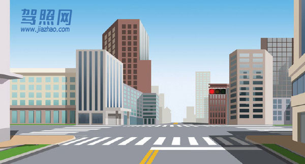

解析：红灯停。但此题不经推敲，像这种情况，右转弯的车子在确认安全后是可以通行的。

## 47. 前方路口这种信号灯亮表示什么意思？

题号：47 · 章节：全部题目、第1章：道路交通安全法律、法规和规章 · [原题](https://www.aijiaxiao.com/tiba/47/)

- A、路口警示
- B、加速直行
- C、加速左转
- D、禁止右转

**答案：A**

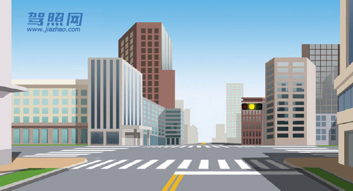

解析：黄灯为警示灯，所以是路口警示。

## 48. 前方路口这种信号灯亮表示什么意思？

题号：48 · 章节：全部题目、第1章：道路交通安全法律、法规和规章 · [原题](https://www.aijiaxiao.com/tiba/48/)

- A、路口警示
- B、禁止通行
- C、准许通行
- D、提醒注意

**答案：C**

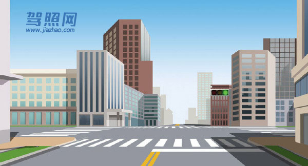

解析：红灯停，绿灯行。

## 49. 交通信号包括交通信号灯、交通标志、交通标线和交通警察的指挥。

题号：49 · 章节：全部题目、第1章：道路交通安全法律、法规和规章 · [原题](https://www.aijiaxiao.com/tiba/49/)

- A、正确
- B、错误

**答案：A**

解析：《公安部令第123号》第二十五条：交通信号包括交通信号灯、交通标志、交通标线和交通警察的指挥。

## 50. 交通标志和交通标线不属于交通信号。

题号：50 · 章节：全部题目、第1章：道路交通安全法律、法规和规章 · [原题](https://www.aijiaxiao.com/tiba/50/)

- A、正确
- B、错误

**答案：B**

解析：《公安部令第123号》第二十五条：交通信号包括交通信号灯、交通标志、交通标线和交通警察的指挥。

## 51. 交通信号灯由红灯、绿灯和黄灯组成。

题号：51 · 章节：全部题目、第1章：道路交通安全法律、法规和规章 · [原题](https://www.aijiaxiao.com/tiba/51/)

- A、正确
- B、错误

**答案：A**

解析：《公安部令第123号》第二十六条：交通信号灯由红灯、绿灯、黄灯组成。红灯表示禁止通行，绿灯表示准许通行，黄灯表示警示。

## 52. 道路交通标线分为指示标线、警告标线、禁止标线。

题号：52 · 章节：全部题目、第1章：道路交通安全法律、法规和规章 · [原题](https://www.aijiaxiao.com/tiba/52/)

- A、正确
- B、错误

**答案：A**

解析：《道路交通安全法实施条例》第三十条交通标志分为：指示标志、警告标志、禁令标志、指路标志、旅游区标志、道路施工安全标志和辅助标志。道路交通标线分为：指示标线、警告标线、禁止标线。

## 53. 驾驶机动车在这种道路上如何通行？

题号：53 · 章节：全部题目、第1章：道路交通安全法律、法规和规章 · [原题](https://www.aijiaxiao.com/tiba/53/)

- A、在道路两边通行
- B、在道路中间通行
- C、实行分道通行
- D、可随意通行

**答案：B**

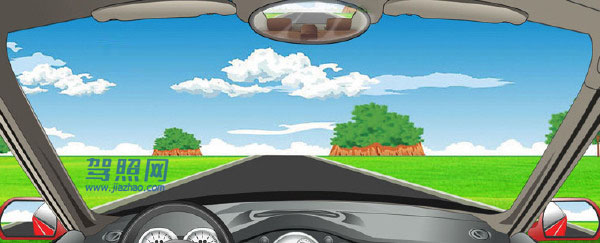

解析：《道路交通安全法》第三十六条：根据道路条件和通行需要，道路划分为机动车道、非机动车道和人行道的，机动车、非机动车、行人实行分道通行。没有划分机动车道、非机动车道和人行道的，机动车在道路中间通行，非机动车和行人在道路两侧通行。

## 54. 道路上划设这种标线的车道内允许下列哪类车辆通行？

题号：54 · 章节：全部题目、第1章：道路交通安全法律、法规和规章 · [原题](https://www.aijiaxiao.com/tiba/54/)

- A、出租车
- B、公务用车
- C、公交车
- D、私家车

**答案：C**

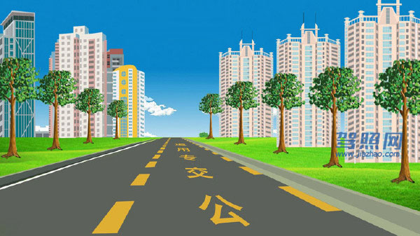

解析：请注意地面的字，公交专用车道。

## 55. 驾驶机动车在路口遇到这种情况如何行驶？

题号：55 · 章节：全部题目、第1章：道路交通安全法律、法规和规章 · [原题](https://www.aijiaxiao.com/tiba/55/)

- A、可以向右转弯
- B、靠右侧直行
- C、遵守交通信号灯
- D、停车等待

**答案：D**

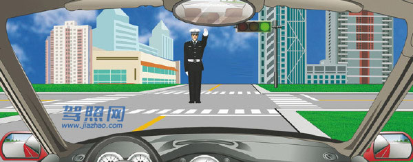

解析：图中警察手势为停止信号，示意：不准前方车辆通行，也就是停车等待。

## 56. 有这种信号灯的路口允许机动车如何行驶？

题号：56 · 章节：全部题目、第1章：道路交通安全法律、法规和规章 · [原题](https://www.aijiaxiao.com/tiba/56/)

- A、向左转弯
- B、直行通过
- C、向右转弯
- D、停车等待

**答案：C**

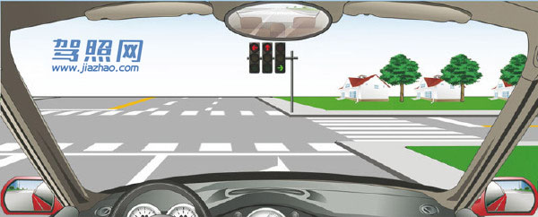

解析：红色信号禁止通行，绿色信号可以通行。只有右转是绿色信号，所以可以向右转弯。

## 57. 遇到这种情况的路口怎样通过？

题号：57 · 章节：全部题目、第1章：道路交通安全法律、法规和规章 · [原题](https://www.aijiaxiao.com/tiba/57/)

- A、左转弯加速通过
- B、加速直行通过
- C、右转弯加速通过
- D、确认安全后通过

**答案：D**

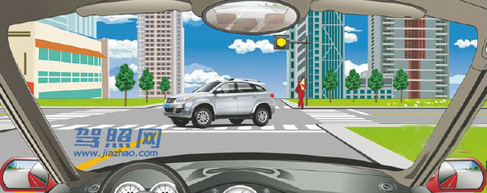

解析：前方是警告性的黄灯，所以此路口是确认安全后通过。

## 58. 这段道路红车所在车道是什么车道？

题号：58 · 章节：全部题目、第1章：道路交通安全法律、法规和规章 · [原题](https://www.aijiaxiao.com/tiba/58/)

- A、快速车道
- B、慢速车道
- C、专用车道
- D、应急车道

**答案：A**

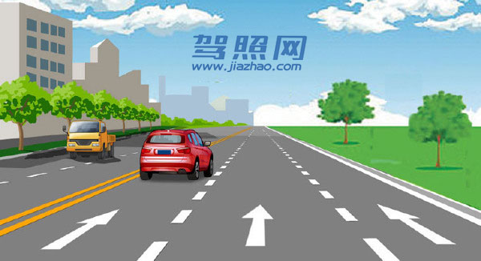

解析：《道路交通安全法实施条例》第四十四条：在道路同方向划有2条以上机动车道的，左侧为快速车道，右侧为慢速车道。

## 59. 机动车在道路上变更车道需要注意什么？

题号：59 · 章节：全部题目、第1章：道路交通安全法律、法规和规章 · [原题](https://www.aijiaxiao.com/tiba/59/)

- A、尽快加速进入左侧车道
- B、不能影响其他车辆正常行驶
- C、进入左侧车道时适当减速
- D、开启转向灯迅速向左转向

**答案：B**

解析：《道路交通安全法实施条例》第四十四条：在道路同方向划有2条以上机动车道的，变更车道的机动车不得影响相关车道内行驶的机动车的正常行驶。

## 60. 在这种情况下可以借右侧公交车道超车。

题号：60 · 章节：全部题目、第1章：道路交通安全法律、法规和规章 · [原题](https://www.aijiaxiao.com/tiba/60/)

- A、正确
- B、错误

**答案：B**

解析：超车只能左侧超，不能右侧超车，且不能占用公交专用车道。

## 61. 在路口遇有交通信号灯和交通警察指挥不一致时，按照交通信号灯通行。

题号：61 · 章节：全部题目、第1章：道路交通安全法律、法规和规章 · [原题](https://www.aijiaxiao.com/tiba/61/)

- A、正确
- B、错误

**答案：B**

解析：《道路交通安全法》第三十八条：车辆、行人应当按照交通信号通行；遇有交通警察现场指挥时，应当按照交通警察的指挥通行；在没有交通信号的道路上，应当在确保安全、畅通的原则下通行。

## 62. 在这种情况下可加速通过交叉路口。

题号：62 · 章节：全部题目、第1章：道路交通安全法律、法规和规章 · [原题](https://www.aijiaxiao.com/tiba/62/)

- A、正确
- B、错误

**答案：B**

解析：黄灯，车身在安全线里边，请停车等待。

## 63. 在路口这个位置时可以加速通过路口。

题号：63 · 章节：全部题目、第1章：道路交通安全法律、法规和规章 · [原题](https://www.aijiaxiao.com/tiba/63/)

- A、正确
- B、错误

**答案：B**

解析：红灯亮表示禁止通行，请停车等待。

## 64. 驾驶机动车不能进入红色叉形灯或者红色箭头灯亮的车道。

题号：64 · 章节：全部题目、第1章：道路交通安全法律、法规和规章 · [原题](https://www.aijiaxiao.com/tiba/64/)

- A、正确
- B、错误

**答案：A**

解析：《道路交通安全法实施条例》第四十条红色叉形灯或者箭头灯亮时，禁止本车道车辆通行。

## 65. 在这段路的最高时速为每小时50公里。

题号：65 · 章节：全部题目、第1章：道路交通安全法律、法规和规章 · [原题](https://www.aijiaxiao.com/tiba/65/)

- A、正确
- B、错误

**答案：B**

解析：红圈白底限制最高速度，蓝底限制最低速度。看右侧的标志，此路段最高车速是80公里每小时，最低车速是50公里每小时。

## 66. 这辆红色轿车变更车道的方法和路线是正确的。

题号：66 · 章节：全部题目、第1章：道路交通安全法律、法规和规章 · [原题](https://www.aijiaxiao.com/tiba/66/)

- A、正确
- B、错误

**答案：B**

解析：红车没有打转向灯，并且红车明显没留出足够安全的行车距离强行并线。

## 67. 驾驶机动车在道路上向左变更车道时如何使用灯光？

题号：67 · 章节：全部题目、第1章：道路交通安全法律、法规和规章 · [原题](https://www.aijiaxiao.com/tiba/67/)

- A、不用开启转向灯
- B、提前开启右转向灯
- C、提前开启左转向灯
- D、提前开启近光灯

**答案：C**

解析：《道路交通安全法实施条例》第五十七条机动车应当按照下列规定使用转向灯：(一)向左转弯、向左变更车道、准备超车、驶离停车地点或者掉头时，应当提前开启左转向灯；(二)向右转弯、向右变更车道、超车完毕驶回原车道、靠路边停车时，应当提前开启右转向灯。

## 68. 驾驶机动车在道路上靠路边停车过程中如何使用灯光？

题号：68 · 章节：全部题目、第1章：道路交通安全法律、法规和规章 · [原题](https://www.aijiaxiao.com/tiba/68/)

- A、变换使用远近光灯
- B、不用指示灯提示
- C、开启危险报警闪光灯
- D、提前开启右转向灯

**答案：D**

解析：《道路交通安全法实施条例》第五十七条机动车应当按照下列规定使用转向灯：(一)向左转弯、向左变更车道、准备超车、驶离停车地点或者掉头时，应当提前开启左转向灯；(二)向右转弯、向右变更车道、超车完毕驶回原车道、靠路边停车时，应当提前开启右转向灯。

## 69. 在这种天气条件下行车如何使用灯光？

题号：69 · 章节：全部题目、第1章：道路交通安全法律、法规和规章 · [原题](https://www.aijiaxiao.com/tiba/69/)

- A、使用近光灯
- B、不使用灯光
- C、使用远光灯
- D、使用雾灯

**答案：A**

解析：《道路交通安全法实施条例》第五十八条：机动车在夜间没有路灯、照明不良或者遇有雾、雨、雪、沙尘、冰雹等低能见度情况下行驶时，应当开启前照灯、示廓灯和后位灯，但同方向行驶的后车与前车近距离行驶时，不得使用远光灯。机动车雾天行驶应当开启雾灯和危险报警闪光灯。

## 70. 在这种天气条件下行车如何使用灯光？

题号：70 · 章节：全部题目、第1章：道路交通安全法律、法规和规章 · [原题](https://www.aijiaxiao.com/tiba/70/)

- A、使用远光灯
- B、使用雾灯
- C、开启右转向灯
- D、不使用灯光

**答案：B**

解析：《道路交通安全法实施条例》第五十八条：机动车在夜间没有路灯、照明不良或者遇有雾、雨、雪、沙尘、冰雹等低能见度情况下行驶时，应当开启前照灯、示廓灯和后位灯，但同方向行驶的后车与前车近距离行驶时，不得使用远光灯。机动车雾天行驶应当开启雾灯和危险报警闪光灯。

## 71. 在这种雨天跟车行驶使用灯光，以下做法正确的是？

题号：71 · 章节：全部题目、第1章：道路交通安全法律、法规和规章 · [原题](https://www.aijiaxiao.com/tiba/71/)

- A、使用远光灯
- B、不能使用近光灯
- C、不能使用远光灯
- D、使用雾灯

**答案：C**

解析：《道路交通安全法实施条例》第五十八条：机动车在夜间没有路灯、照明不良或者遇有雾、雨、雪、沙尘、冰雹等低能见度情况下行驶时，应当开启前照灯、示廓灯和后位灯，但同方向行驶的后车与前车近距离行驶时，不得使用远光灯。机动车雾天行驶应当开启雾灯和危险报警闪光灯。

## 72. 在这种环境下通过路口如何使用灯光？

题号：72 · 章节：全部题目、第1章：道路交通安全法律、法规和规章 · [原题](https://www.aijiaxiao.com/tiba/72/)

- A、关闭远光灯
- B、使用危险报警闪光灯
- C、使用远光灯
- D、交替使用远近光灯

**答案：D**

解析：《道路交通安全法实施条例》第五十九条：机动车在夜间通过急弯、坡路、拱桥、人行横道或者没有交通信号灯控制的路口时，应当交替使用远近光灯示意。

## 73. 在这种路段如何行驶？

题号：73 · 章节：全部题目、第1章：道路交通安全法律、法规和规章 · [原题](https://www.aijiaxiao.com/tiba/73/)

- A、减速鸣喇叭示意
- B、加速鸣喇叭通过
- C、在弯道中心转弯
- D、占对方道路转弯

**答案：A**

解析：《道路交通安全法实施条例》第五十九条：机动车在夜间通过急弯、坡路、拱桥、人行横道或者没有交通信号灯控制的路口时，应当交替使用远近光灯示意。机动车驶近急弯、坡道顶端等影响安全视距的路段以及超车或者遇有紧急情况时，应当减速慢行，并鸣喇叭示意。

## 74. 驾驶机动车在道路上超车时可以不使用转向灯。

题号：74 · 章节：全部题目、第1章：道路交通安全法律、法规和规章 · [原题](https://www.aijiaxiao.com/tiba/74/)

- A、正确
- B、错误

**答案：B**

解析：《道路交通安全法实施条例实施条例》第五十七条：机动车应当按照下列规定使用转向灯：（一）向左转弯、向左变更车道、准备超车、驶离停车地点或者掉头时，应当提前开启左转向灯；（二）向右转弯、向右变更车道、超车完毕驶回原车道、靠路边停车时，应当提前开启右转向灯。

## 75. 驾驶机动车在道路上超车完毕驶回原车道时开启右转向灯。

题号：75 · 章节：全部题目、第1章：道路交通安全法律、法规和规章 · [原题](https://www.aijiaxiao.com/tiba/75/)

- A、正确
- B、错误

**答案：A**

解析：《道路交通安全法实施条例实施条例》第五十七条：机动车应当按照下列规定使用转向灯：（一）向左转弯、向左变更车道、准备超车、驶离停车地点或者掉头时，应当提前开启左转向灯；（二）向右转弯、向右变更车道、超车完毕驶回原车道、靠路边停车时，应当提前开启右转向灯。

## 76. 驾驶机动车在道路上掉头时提前开启左转向灯。

题号：76 · 章节：全部题目、第1章：道路交通安全法律、法规和规章 · [原题](https://www.aijiaxiao.com/tiba/76/)

- A、正确
- B、错误

**答案：A**

解析：《道路交通安全法实施条例实施条例》第五十七条：机动车应当按照下列规定使用转向灯：（一）向左转弯、向左变更车道、准备超车、驶离停车地点或者掉头时，应当提前开启左转向灯；（二）向右转弯、向右变更车道、超车完毕驶回原车道、靠路边停车时，应当提前开启右转向灯。

## 77. 驾驶机动车在道路上向右变更车道可以不使用转向灯。

题号：77 · 章节：全部题目、第1章：道路交通安全法律、法规和规章 · [原题](https://www.aijiaxiao.com/tiba/77/)

- A、正确
- B、错误

**答案：B**

解析：《道路交通安全法实施条例实施条例》第五十七条：机动车应当按照下列规定使用转向灯：（一）向左转弯、向左变更车道、准备超车、驶离停车地点或者掉头时，应当提前开启左转向灯；（二）向右转弯、向右变更车道、超车完毕驶回原车道、靠路边停车时，应当提前开启右转向灯。

## 78. 驾驶机动车在沙尘天气条件下行车不用开启前照灯、示廓灯和后位灯。

题号：78 · 章节：全部题目、第1章：道路交通安全法律、法规和规章 · [原题](https://www.aijiaxiao.com/tiba/78/)

- A、正确
- B、错误

**答案：B**

解析：《道路交通安全法实施条例》第五十八条：机动车在夜间没有路灯、照明不良或者遇有雾、雨、雪、沙尘、冰雹等低能见度情况下行驶时，应当开启前照灯、示廓灯和后位灯，但同方向行驶的后车与前车近距离行驶时，不得使用远光灯。机动车雾天行驶应当开启雾灯和危险报警闪光灯。

## 79. 在这种环境里行车使用近光灯。

题号：79 · 章节：全部题目、第1章：道路交通安全法律、法规和规章 · [原题](https://www.aijiaxiao.com/tiba/79/)

- A、正确
- B、错误

**答案：A**

解析：夜间、前方有行人的情况不能使用远光灯，会影响行人视线。故开启近光灯。

## 80. 驾驶机动车在雾天行车开启雾灯和危险报警闪光灯。

题号：80 · 章节：全部题目、第1章：道路交通安全法律、法规和规章 · [原题](https://www.aijiaxiao.com/tiba/80/)

- A、正确
- B、错误

**答案：A**

解析：《道路交通安全法实施条例》第五十八条：机动车在夜间没有路灯、照明不良或者遇有雾、雨、雪、沙尘、冰雹等低能见度情况下行驶时，应当开启前照灯、示廓灯和后位灯，但同方向行驶的后车与前车近距离行驶时，不得使用远光灯。机动车雾天行驶应当开启雾灯和危险报警闪光灯。

## 81. 在这种急弯道路上行车应交替使用远近光灯。

题号：81 · 章节：全部题目、第1章：道路交通安全法律、法规和规章 · [原题](https://www.aijiaxiao.com/tiba/81/)

- A、正确
- B、错误

**答案：A**

解析：《道路交通安全法实施条例》第五十九条：机动车在夜间通过急弯、坡路、拱桥、人行横道或者没有交通信号灯控制的路口时，应当交替使用远近光灯示意。

## 82. 夜间驾驶机动车通过人行横道时需要交替使用远近光灯。

题号：82 · 章节：全部题目、第1章：道路交通安全法律、法规和规章 · [原题](https://www.aijiaxiao.com/tiba/82/)

- A、正确
- B、错误

**答案：A**

解析：《道路交通安全法实施条例》第五十九条：机动车在夜间通过急弯、坡路、拱桥、人行横道或者没有交通信号灯控制的路口时，应当交替使用远近光灯示意。

## 83. 驾驶机动车上坡时,在将要到达坡道顶端时要加速并鸣喇叭。

题号：83 · 章节：全部题目、第1章：道路交通安全法律、法规和规章 · [原题](https://www.aijiaxiao.com/tiba/83/)

- A、正确
- B、错误

**答案：B**

解析：本题错在“加速”。《道路交通安全法实施条例》第五十九条：机动车在夜间通过急弯、坡路、拱桥、人行横道或者没有交通信号灯控制的路口时，应当交替使用远近光灯示意。机动车驶近急弯、坡道顶端等影响安全视距的路段以及超车或者遇有紧急情况时，应当减速慢行，并鸣喇叭示意。

## 84. 下列哪种行为会受到200元以上2000元以下罚款，并处吊销机动车驾驶证？

题号：84 · 章节：全部题目、第1章：道路交通安全法律、法规和规章 · [原题](https://www.aijiaxiao.com/tiba/84/)

- A、违反道路通行规定
- B、超过规定时速50%
- C、造成交通事故后逃逸
- D、驾车没带驾驶证

**答案：B**

解析：对比题目选项，可知条款四为正确答案，因此选择B。《道路交通安全法》第九十九条：有下列行为之一的，由公安机关交通管理部门处二百元以上二千元以下罚款：（一）未取得机动车驾驶证、机动车驾驶证被吊销或者机动车驾驶证被暂扣期间驾驶机动车的；（二）将机动车交由未取得机动车驾驶证或者机动车驾驶证被吊销、暂扣的人驾驶的；（三）造成交通事故后逃逸，尚不构成犯罪的；（四）机动车行驶超过规定时速百分之五十的；（五）强迫机动车驾驶人违反道路交通安全法律、法规和机动车安全驾驶要求驾驶机动车，造成交通事故，尚不构成犯罪的；（六）违反交通管制的规定强行通行，不听劝阻的；（七）故意损毁、移动、涂改交通设施，造成危害后果，尚不构成犯罪的；（八）非法拦截、扣留机动车辆，不听劝阻，造成交通严重阻塞或者较大财产损失的。

## 85. 在这条高速公路上行驶时的最高速度不能超过多少？

题号：85 · 章节：全部题目、第1章：道路交通安全法律、法规和规章 · [原题](https://www.aijiaxiao.com/tiba/85/)

- A、100公里/小时
- B、110公里/小时
- C、120公里/小时
- D、90公里 /小时

**答案：B**

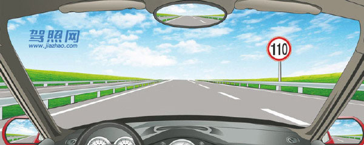

解析：《道路交通安全法实施条例》第七十八条：道路限速标志标明的车速与上述车道行驶车速的规定不一致的，按照道路限速标志标明的车速行驶。红圈白底，限速标志，最高行驶速度不得超过110公里/小时。

## 86. 在这段城市道路上行驶的最高速度不能超过多少？

题号：86 · 章节：全部题目、第1章：道路交通安全法律、法规和规章 · [原题](https://www.aijiaxiao.com/tiba/86/)

- A、30公里/小时
- B、40公里/小时
- C、50公里/小时
- D、70公里/小时

**答案：A**

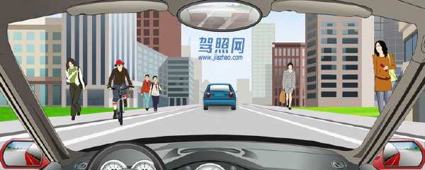

解析：《道路交通安全法实施条例》第四十五条：机动车在道路上行驶不得超过限速标志、标线标明的速度。在没有限速标志、标线的道路上，机动车不得超过下列最高行驶速度：(一)没有道路中心线的道路，城市道路为每小时30公里，公路为每小时40公里；(二)同方向只有1条机动车道的道路，城市道路为每小时50公里，公路为每小时70公里。

## 87. 在这条公路上行驶的最高速度不能超过多少？

题号：87 · 章节：全部题目、第1章：道路交通安全法律、法规和规章 · [原题](https://www.aijiaxiao.com/tiba/87/)

- A、30公里/小时
- B、40公里/小时
- C、50公里/小时
- D、70公里/小时

**答案：B**

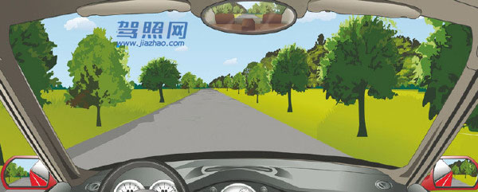

解析：《道路交通安全法实施条例》第四十五条：机动车在道路上行驶不得超过限速标志、标线标明的速度。在没有限速标志、标线的道路上，机动车不得超过下列最高行驶速度：(一)没有道路中心线的道路，城市道路为每小时30公里，公路为每小时40公里；(二)同方向只有1条机动车道的道路，城市道路为每小时50公里，公路为每小时70公里。

## 88. 在这条城市道路上行驶的最高速度不能超过多少？

题号：88 · 章节：全部题目、第1章：道路交通安全法律、法规和规章 · [原题](https://www.aijiaxiao.com/tiba/88/)

- A、30公里/小时
- B、40公里/小时
- C、50公里/小时
- D、70公里/小时

**答案：C**

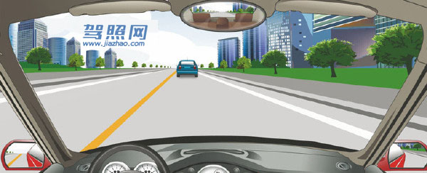

解析：《道路交通安全法实施条例》第四十五条：机动车在道路上行驶不得超过限速标志、标线标明的速度。在没有限速标志、标线的道路上，机动车不得超过下列最高行驶速度：(一)没有道路中心线的道路，城市道路为每小时30公里，公路为每小时40公里；(二)同方向只有1条机动车道的道路，城市道路为每小时50公里，公路为每小时70公里。

## 89. 在这条公路上行驶的最高速度不能超过多少？

题号：89 · 章节：全部题目、第1章：道路交通安全法律、法规和规章 · [原题](https://www.aijiaxiao.com/tiba/89/)

- A、30公里/小时
- B、40公里/小时
- C、50公里/小时
- D、70公里/小时

**答案：D**

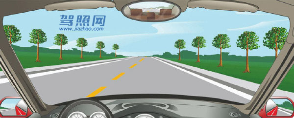

解析：《道路交通安全法实施条例》第四十五条：机动车在道路上行驶不得超过限速标志、标线标明的速度。在没有限速标志、标线的道路上，机动车不得超过下列最高行驶速度：(一)没有道路中心线的道路，城市道路为每小时30公里，公路为每小时40公里；(二)同方向只有1条机动车道的道路，城市道路为每小时50公里，公路为每小时70公里。

## 90. 在这个弯道上行驶时的最高速度不能超过多少？

题号：90 · 章节：全部题目、第1章：道路交通安全法律、法规和规章 · [原题](https://www.aijiaxiao.com/tiba/90/)

- A、30公里/小时
- B、40公里/小时
- C、50公里/小时
- D、70公里/小时

**答案：A**

解析：《道路交通安全法实施条例》第四十六条：机动车行驶中遇有下列情形之一的，最高行驶速度不得超过每小时30公里，其中拖拉机、电瓶车、轮式专用机械车不得超过每小时15公里：(一)进出非机动车道，通过铁路道口、急弯路、窄路、窄桥时；(二)掉头、转弯、下陡坡时；(三)遇雾、雨、雪、沙尘、冰雹，能见度在50米以内时；(四)在冰雪、泥泞的道路上行驶时；(五)牵引发生故障的机动车时。

## 91. 驾驶机动车遇到沙尘、冰雹、雨、雾、结冰等气象条件时应降低行驶速度。

题号：91 · 章节：全部题目、第1章：道路交通安全法律、法规和规章 · [原题](https://www.aijiaxiao.com/tiba/91/)

- A、正确
- B、错误

**答案：A**

解析：《道路交通安全法》第四十二条：夜间行驶或者在容易发生危险的路段行驶，以及遇有沙尘、冰雹、雨、雪、雾、结冰等气象条件时，应当降低行驶速度。

## 92. 驾驶机动车遇雾、雨、雪等能见度在50米以内时，最高速度不能超过多少？

题号：92 · 章节：全部题目、第1章：道路交通安全法律、法规和规章 · [原题](https://www.aijiaxiao.com/tiba/92/)

- A、70公里/小时
- B、50公里/小时
- C、40公里/小时
- D、30公里/小时

**答案：D**

解析：《道路交通安全法实施条例》第四十六条：机动车行驶中遇到雾、雨、雪、沙尘、冰雹，能见度在50米以内时最高行驶速度不得超过每小时30公里。

## 93. 驾驶机动车在进出非机动车道时，最高速度不能超过多少？

题号：93 · 章节：全部题目、第1章：道路交通安全法律、法规和规章 · [原题](https://www.aijiaxiao.com/tiba/93/)

- A、30公里/小时
- B、40公里/小时
- C、50公里/小时
- D、60公里/小时

**答案：A**

解析：《道路交通安全法实施条例》第四十六条：机动车行驶中遇到进出非机动车道，通过铁路道口、急弯路、窄路、窄桥时最高行驶速度不得超过每小时30公里。

## 94. 驾驶机动车通过铁路道口时，最高速度不能超过多少？

题号：94 · 章节：全部题目、第1章：道路交通安全法律、法规和规章 · [原题](https://www.aijiaxiao.com/tiba/94/)

- A、15公里/小时
- B、20公里/小时
- C、30公里/小时
- D、40公里/小时

**答案：C**

解析：《道路交通安全法实施条例》第四十六条：机动车行驶中遇到进出非机动车道，通过铁路道口、急弯路、窄路、窄桥时最高行驶速度不得超过每小时30公里。

## 95. 驾驶机动车通过急弯路时，最高速度不能超过多少？

题号：95 · 章节：全部题目、第1章：道路交通安全法律、法规和规章 · [原题](https://www.aijiaxiao.com/tiba/95/)

- A、20公里/小时
- B、30公里/小时
- C、40公里/小时
- D、50公里/小时

**答案：B**

解析：《道路交通安全法实施条例》第四十六条：机动车行驶中遇到进出非机动车道，通过铁路道口、急弯路、窄路、窄桥时最高行驶速度不得超过每小时30公里。

## 96. 驾驶机动车通过窄路、窄桥时，最高速度不能超过多少？

题号：96 · 章节：全部题目、第1章：道路交通安全法律、法规和规章 · [原题](https://www.aijiaxiao.com/tiba/96/)

- A、60公里/小时
- B、50公里/小时
- C、40公里/小时
- D、30公里/小时

**答案：D**

解析：《道路交通安全法实施条例》第四十六条：机动车行驶中遇到进出非机动车道，通过铁路道口、急弯路、窄路、窄桥时最高行驶速度不得超过每小时30公里。

## 97. 驾驶机动车下陡坡、转弯、掉头时，最高速度不能超过多少？

题号：97 · 章节：全部题目、第1章：道路交通安全法律、法规和规章 · [原题](https://www.aijiaxiao.com/tiba/97/)

- A、30公里/小时
- B、40公里/小时
- C、50公里/小时
- D、60公里/小时

**答案：A**

解析：《道路交通安全法实施条例》第四十六条：机动车行驶中遇到掉头、转弯、下陡坡时最高行驶速度不得超过每小时30公里。

## 98. 驾驶机动车在冰雪道路行驶时，最高速度不能超过多少？

题号：98 · 章节：全部题目、第1章：道路交通安全法律、法规和规章 · [原题](https://www.aijiaxiao.com/tiba/98/)

- A、20公里/小时
- B、30公里/小时
- C、40公里/小时
- D、50公里/小时

**答案：B**

解析：《道路交通安全法实施条例》第四十六条：机动车行驶中在冰雪、泥泞的道路上行驶时最高行驶速度不得超过每小时30公里。

## 99. 驾驶机动车在泥泞道路行驶时，最高速度不能超过多少？

题号：99 · 章节：全部题目、第1章：道路交通安全法律、法规和规章 · [原题](https://www.aijiaxiao.com/tiba/99/)

- A、15公里/小时
- B、20公里/小时
- C、30公里/小时
- D、40公里/小时

**答案：C**

解析：《道路交通安全法实施条例》第四十六条：机动车行驶中在冰雪、泥泞的道路上行驶时最高行驶速度不得超过每小时30公里。

## 100. 驾驶机动车上道路行驶,不允许超过限速标志标明的最高时速。

题号：100 · 章节：全部题目、第1章：道路交通安全法律、法规和规章 · [原题](https://www.aijiaxiao.com/tiba/100/)

- A、正确
- B、错误

**答案：A**

解析：《道路交通安全法》第四十二条：机动车上道路行驶，不得超过限速标志标明的最高时速。在没有限速标志的路段，应当保持安全车速。

## 101. 驾驶机动车在没有中心线的城市道路上，最高速度不能超过每小时50公里。

题号：101 · 章节：全部题目、第1章：道路交通安全法律、法规和规章 · [原题](https://www.aijiaxiao.com/tiba/101/)

- A、正确
- B、错误

**答案：B**

解析：《道路交通安全法实施条例》第四十五条：机动车在道路上行驶不得超过限速标志、标线标明的速度。在没有限速标志、标线的道路上，机动车不得超过下列最高行驶速度：(一)没有道路中心线的道路，城市道路为每小时30公里，公路为每小时40公里；(二)同方向只有1条机动车道的道路，城市道路为每小时50公里，公路为每小时70公里。

## 102. 驾驶机动车在没有中心线的公路上，最高速度不能超过每小时70公里。

题号：102 · 章节：全部题目、第1章：道路交通安全法律、法规和规章 · [原题](https://www.aijiaxiao.com/tiba/102/)

- A、正确
- B、错误

**答案：B**

解析：《道路交通安全法实施条例》第四十五条：机动车在道路上行驶不得超过限速标志、标线标明的速度。在没有限速标志、标线的道路上，机动车不得超过下列最高行驶速度：(一)没有道路中心线的道路，城市道路为每小时30公里，公路为每小时40公里；(二)同方向只有1条机动车道的道路，城市道路为每小时50公里，公路为每小时70公里。

## 103. 车在这种条件的道路上，最高速度不能超过每小时50公里。

题号：103 · 章节：全部题目、第1章：道路交通安全法律、法规和规章 · [原题](https://www.aijiaxiao.com/tiba/103/)

- A、正确
- B、错误

**答案：B**

解析：《道路交通安全法实施条例》第四十六条：机动车行驶中在冰雪、泥泞的道路上行驶时最高行驶速度不得超过每小时30公里。

## 104. 驾驶机动车掉头、转弯、下陡坡时的最高速度不能超过每小时40公里。

题号：104 · 章节：全部题目、第1章：道路交通安全法律、法规和规章 · [原题](https://www.aijiaxiao.com/tiba/104/)

- A、正确
- B、错误

**答案：B**

解析：《道路交通安全法实施条例》第四十六条：机动车行驶中遇到掉头、转弯、下陡坡时最高行驶速度不得超过每小时30公里。

## 105. 驾驶机动车通过窄路、窄桥时的最高速度不能超过每小时30公里。

题号：105 · 章节：全部题目、第1章：道路交通安全法律、法规和规章 · [原题](https://www.aijiaxiao.com/tiba/105/)

- A、正确
- B、错误

**答案：A**

解析：《道路交通安全法实施条例》第四十六条：机动车行驶中遇到进出非机动车道，通过铁路道口、急弯路、窄路、窄桥时最高行驶速度不得超过每小时30公里。

## 106. 这两辆车发生追尾的主要原因是什么？

题号：106 · 章节：全部题目、第1章：道路交通安全法律、法规和规章 · [原题](https://www.aijiaxiao.com/tiba/106/)

- A、后车未与前车保持安全距离
- B、后车超车时距离前车太近
- C、前车采取制动过急
- D、前车采取制动时没看后视镜

**答案：A**

解析：追尾通常是前后车未保持安全距离，而且责任一般为后车。

## 107. 驾驶机动车在下列哪种情形下不能超越前车？

题号：107 · 章节：全部题目、第1章：道路交通安全法律、法规和规章 · [原题](https://www.aijiaxiao.com/tiba/107/)

- A、前车减速让行
- B、前车正在左转弯
- C、前车靠边停车
- D、前车正在右转弯

**答案：B**

解析：《道路交通安全法》第四十三条：同车道行驶的机动车，后车应当与前车保持足以采取紧急制动措施的安全距离。有下列情形之一的，不得超车：（一）前车正在左转弯、掉头、超车的；（二）与对面来车有会车可能的；（三）前车为执行紧急任务的警车、消防车、救护车、工程救险车的；（四）行经铁路道口、交叉路口、窄桥、弯道、陡坡、隧道、人行横道、市区交通流量大的路段等没有超车条件的。

## 108. 在没有中心线的道路上发现后车发出超车信号时，如果条件许可如何行驶？

题号：108 · 章节：全部题目、第1章：道路交通安全法律、法规和规章 · [原题](https://www.aijiaxiao.com/tiba/108/)

- A、保持原状态行驶
- B、加速行驶
- C、迅速停车让行
- D、降速靠右让路

**答案：D**

解析：安全文明驾驶原则，后车条件许可超车，前车那就减速靠右行驶。

## 109. 这种情况超车时，从前车的哪一侧超越？

题号：109 · 章节：全部题目、第1章：道路交通安全法律、法规和规章 · [原题](https://www.aijiaxiao.com/tiba/109/)

- A、从前车的右侧超越
- B、左右两侧均可超越
- C、从前车的左侧超越
- D、从无障碍一侧超越

**答案：C**

解析：根据规定，任何超车都是从左侧超车的。

## 110. 同车道行驶的车辆遇前车有下列哪种情形时不得超车？

题号：110 · 章节：全部题目、第1章：道路交通安全法律、法规和规章 · [原题](https://www.aijiaxiao.com/tiba/110/)

- A、正在停车
- B、减速让行
- C、正常行驶
- D、正在超车

**答案：D**

解析：《道路交通安全法》第四十三条：同车道行驶的机动车，后车应当与前车保持足以采取紧急制动措施的安全距离。有下列情形之一的，不得超车：（一）前车正在左转弯、掉头、超车的；（二）与对面来车有会车可能的；（三）前车为执行紧急任务的警车、消防车、救护车、工程救险车的；（四）行经铁路道口、交叉路口、窄桥、弯道、陡坡、隧道、人行横道、市区交通流量大的路段等没有超车条件的。

## 111. 同车道行驶的车辆遇前车有下列哪种情形时不得超车？

题号：111 · 章节：全部题目、第1章：道路交通安全法律、法规和规章 · [原题](https://www.aijiaxiao.com/tiba/111/)

- A、正在停车
- B、减速让行
- C、正在掉头
- D、正常行驶

**答案：C**

解析：《道路交通安全法》第四十三条：同车道行驶的机动车，后车应当与前车保持足以采取紧急制动措施的安全距离。有下列情形之一的，不得超车：（一）前车正在左转弯、掉头、超车的；（二）与对面来车有会车可能的；（三）前车为执行紧急任务的警车、消防车、救护车、工程救险车的；（四）行经铁路道口、交叉路口、窄桥、弯道、陡坡、隧道、人行横道、市区交通流量大的路段等没有超车条件的。

## 112. 同车道行驶的车辆前方遇到下列哪种车辆不得超车？

题号：112 · 章节：全部题目、第1章：道路交通安全法律、法规和规章 · [原题](https://www.aijiaxiao.com/tiba/112/)

- A、执行任务的警车
- B、大型客货车
- C、出租汽车
- D、城市公交车

**答案：A**

解析：《道路交通安全法》第四十三条：同车道行驶的机动车，后车应当与前车保持足以采取紧急制动措施的安全距离。有下列情形之一的，不得超车：（一）前车正在左转弯、掉头、超车的；（二）与对面来车有会车可能的；（三）前车为执行紧急任务的警车、消防车、救护车、工程救险车的；（四）行经铁路道口、交叉路口、窄桥、弯道、陡坡、隧道、人行横道、市区交通流量大的路段等没有超车条件的。

## 113. 同车道行驶的车辆前方遇到下列哪种车辆不得超车？

题号：113 · 章节：全部题目、第1章：道路交通安全法律、法规和规章 · [原题](https://www.aijiaxiao.com/tiba/113/)

- A、大型客货车
- B、出租汽车
- C、执行任务的救护车
- D、公共汽车

**答案：C**

解析：《道路交通安全法》第四十三条：同车道行驶的机动车，后车应当与前车保持足以采取紧急制动措施的安全距离。有下列情形之一的，不得超车：（一）前车正在左转弯、掉头、超车的；（二）与对面来车有会车可能的；（三）前车为执行紧急任务的警车、消防车、救护车、工程救险车的；（四）行经铁路道口、交叉路口、窄桥、弯道、陡坡、隧道、人行横道、市区交通流量大的路段等没有超车条件的。

## 114. 同车道行驶的车辆前方遇到下列哪种车辆不得超车？

题号：114 · 章节：全部题目、第1章：道路交通安全法律、法规和规章 · [原题](https://www.aijiaxiao.com/tiba/114/)

- A、大型客货车
- B、执行任务的消防车
- C、公共汽车
- D、出租汽车

**答案：B**

解析：《道路交通安全法》第四十三条：同车道行驶的机动车，后车应当与前车保持足以采取紧急制动措施的安全距离。有下列情形之一的，不得超车：（一）前车正在左转弯、掉头、超车的；（二）与对面来车有会车可能的；（三）前车为执行紧急任务的警车、消防车、救护车、工程救险车的；（四）行经铁路道口、交叉路口、窄桥、弯道、陡坡、隧道、人行横道、市区交通流量大的路段等没有超车条件的。

## 115. 驾驶机动车行经市区下列哪种道路时不得超车？

题号：115 · 章节：全部题目、第1章：道路交通安全法律、法规和规章 · [原题](https://www.aijiaxiao.com/tiba/115/)

- A、主要街道
- B、单向行驶路段
- C、单向两条行车道
- D、交通流量大的路段

**答案：D**

解析：《道路交通安全法》第四十三条：同车道行驶的机动车，后车应当与前车保持足以采取紧急制动措施的安全距离。有下列情形之一的，不得超车：（一）前车正在左转弯、掉头、超车的；（二）与对面来车有会车可能的；（三）前车为执行紧急任务的警车、消防车、救护车、工程救险车的；（四）行经铁路道口、交叉路口、窄桥、弯道、陡坡、隧道、人行横道、市区交通流量大的路段等没有超车条件的。

## 116. 驾驶机动车行经下列哪种路段不得超车？

题号：116 · 章节：全部题目、第1章：道路交通安全法律、法规和规章 · [原题](https://www.aijiaxiao.com/tiba/116/)

- A、主要街道
- B、高架路
- C、人行横道
- D、环城高速

**答案：C**

解析：《道路交通安全法》第四十三条：同车道行驶的机动车，后车应当与前车保持足以采取紧急制动措施的安全距离。有下列情形之一的，不得超车：（一）前车正在左转弯、掉头、超车的；（二）与对面来车有会车可能的；（三）前车为执行紧急任务的警车、消防车、救护车、工程救险车的；（四）行经铁路道口、交叉路口、窄桥、弯道、陡坡、隧道、人行横道、市区交通流量大的路段等没有超车条件的。

## 117. 驾驶机动车行经下列哪种路段时不得超车？

题号：117 · 章节：全部题目、第1章：道路交通安全法律、法规和规章 · [原题](https://www.aijiaxiao.com/tiba/117/)

- A、高架路
- B、交叉路口
- C、环城高速
- D、中心街道

**答案：B**

解析：《道路交通安全法》第四十三条：同车道行驶的机动车，后车应当与前车保持足以采取紧急制动措施的安全距离。有下列情形之一的，不得超车：（一）前车正在左转弯、掉头、超车的；（二）与对面来车有会车可能的；（三）前车为执行紧急任务的警车、消防车、救护车、工程救险车的；（四）行经铁路道口、交叉路口、窄桥、弯道、陡坡、隧道、人行横道、市区交通流量大的路段等没有超车条件的。

## 118. 驾驶机动车在下列哪种路段不得超车？

题号：118 · 章节：全部题目、第1章：道路交通安全法律、法规和规章 · [原题](https://www.aijiaxiao.com/tiba/118/)

- A、山区道路
- B、城市高架路
- C、城市快速路
- D、窄桥、弯道

**答案：D**

解析：《道路交通安全法》第四十三条：同车道行驶的机动车，后车应当与前车保持足以采取紧急制动措施的安全距离。有下列情形之一的，不得超车：（一）前车正在左转弯、掉头、超车的；（二）与对面来车有会车可能的；（三）前车为执行紧急任务的警车、消防车、救护车、工程救险车的；（四）行经铁路道口、交叉路口、窄桥、弯道、陡坡、隧道、人行横道、市区交通流量大的路段等没有超车条件的。

## 119. 驾驶机动车在夜间超车时怎样使用灯光？

题号：119 · 章节：全部题目、第1章：道路交通安全法律、法规和规章 · [原题](https://www.aijiaxiao.com/tiba/119/)

- A、变换远、近光灯
- B、开启雾灯
- C、开启远光灯
- D、关闭前大灯

**答案：A**

解析：夜间超车应提前开启左转向灯，并交替使用远、近光灯示意，提醒前车。

## 120. 遇到这种情况不能超车。

题号：120 · 章节：全部题目、第1章：道路交通安全法律、法规和规章 · [原题](https://www.aijiaxiao.com/tiba/120/)

- A、正确
- B、错误

**答案：A**

解析：前车已经在超车了，为了安全不要再超了。

## 121. 驾驶机动车超车应该提前开启左转向灯、变换使用远近光灯或鸣喇叭。

题号：121 · 章节：全部题目、第1章：道路交通安全法律、法规和规章 · [原题](https://www.aijiaxiao.com/tiba/121/)

- A、正确
- B、错误

**答案：A**

解析：《道路交通安全法实施条例》第四十七条：应当提前开启左转向灯、变换使用远、近光灯或者鸣喇叭。

## 122. 驾驶机动车超车后立即开启右转向灯驶回原车道。

题号：122 · 章节：全部题目、第1章：道路交通安全法律、法规和规章 · [原题](https://www.aijiaxiao.com/tiba/122/)

- A、正确
- B、错误

**答案：B**

解析：不能立即，应在与被超车辆拉开必要的安全距离后，开启右转向灯驶回原车道

## 123. 在道路上遇到这种情况可以从两侧超车。

题号：123 · 章节：全部题目、第1章：道路交通安全法律、法规和规章 · [原题](https://www.aijiaxiao.com/tiba/123/)

- A、正确
- B、错误

**答案：B**

解析：前方有警车执行公务，不能超车。而且超车只能从左侧。

## 124. 在这种情况下可以加速通过人行横道。

题号：124 · 章节：全部题目、第1章：道路交通安全法律、法规和规章 · [原题](https://www.aijiaxiao.com/tiba/124/)

- A、正确
- B、错误

**答案：B**

解析：通过人行横道应减速慢行，遇到行人则需停车让行。

## 125. 遇到这种情况下可以从右侧超车。

题号：125 · 章节：全部题目、第1章：道路交通安全法律、法规和规章 · [原题](https://www.aijiaxiao.com/tiba/125/)

- A、正确
- B、错误

**答案：B**

解析：根据规定，任何超车都是从左侧超车的。

## 126. 驾驶机动车行经城市没有列车通过的铁路道口时允许超车。

题号：126 · 章节：全部题目、第1章：道路交通安全法律、法规和规章 · [原题](https://www.aijiaxiao.com/tiba/126/)

- A、正确
- B、错误

**答案：B**

解析：《道路交通安全法》第四十三条：同车道行驶的机动车，后车应当与前车保持足以采取紧急制动措施的安全距离。有下列情形之一的，不得超车：（一）前车正在左转弯、掉头、超车的；（二）与对面来车有会车可能的；（三）前车为执行紧急任务的警车、消防车、救护车、工程救险车的；（四）行经铁路道口、交叉路口、窄桥、弯道、陡坡、隧道、人行横道、市区交通流量大的路段等没有超车条件的。

## 127. 驾驶机动车在隧道、陡坡等特殊路段不得超车。

题号：127 · 章节：全部题目、第1章：道路交通安全法律、法规和规章 · [原题](https://www.aijiaxiao.com/tiba/127/)

- A、正确
- B、错误

**答案：A**

解析：《道路交通安全法》第四十三条：同车道行驶的机动车，后车应当与前车保持足以采取紧急制动措施的安全距离。有下列情形之一的，不得超车：（一）前车正在左转弯、掉头、超车的；（二）与对面来车有会车可能的；（三）前车为执行紧急任务的警车、消防车、救护车、工程救险车的；（四）行经铁路道口、交叉路口、窄桥、弯道、陡坡、隧道、人行横道、市区交通流量大的路段等没有超车条件的。

## 128. 遇到这种情形怎样行驶？

题号：128 · 章节：全部题目、第1章：道路交通安全法律、法规和规章 · [原题](https://www.aijiaxiao.com/tiba/128/)

- A、停车让对方车辆通过
- B、开启左转向灯向左行驶
- C、加速超越障碍后会车
- D、开前照灯告知对方让行

**答案：A**

解析：《道路交通安全法实施条例》第四十八条：在没有中心隔离设施或者没有中心线的道路上，在有障碍的路段，无障碍的一方先行；但有障碍的一方已驶入障碍路段而无障碍的一方未驶入时，有障碍的一方先行。

## 129. 驾驶机动车在没有道路中心线的狭窄山路怎样会车？

题号：129 · 章节：全部题目、第1章：道路交通安全法律、法规和规章 · [原题](https://www.aijiaxiao.com/tiba/129/)

- A、速度慢的先行
- B、重车让空车先行
- C、靠山体的一方先行
- D、不靠山体的一方先行

**答案：D**

解析：《道路交通安全法实施条例》第四十八条：在没有中心隔离设施或者没有中心线的道路上，在狭窄的山路，不靠山体的一方先行。

## 130. 夜间在道路上会车时，距离对向来车多远将远光灯改用近光灯？

题号：130 · 章节：全部题目、第1章：道路交通安全法律、法规和规章 · [原题](https://www.aijiaxiao.com/tiba/130/)

- A、不必变换灯光
- B、150米以外
- C、100米以内
- D、50米以内

**答案：B**

解析：《道路交通安全法实施条例》第四十八条：在没有中心隔离设施或者没有中心线的道路上，夜间会车应当在距相对方向来车150米以外改用近光灯，在窄路、窄桥与非机动车会车时应当使用近光灯。

## 131. 驾驶机动车在没有中心线的道路上遇相对方向来车时怎样行驶？

题号：131 · 章节：全部题目、第1章：道路交通安全法律、法规和规章 · [原题](https://www.aijiaxiao.com/tiba/131/)

- A、减速靠右行驶
- B、借非机动车道行驶
- C、紧靠路边行驶
- D、靠路中心行驶

**答案：A**

解析：《道路交通安全法实施条例》第四十八条：在没有中心隔离设施或者没有中心线的道路上，减速靠右行驶，并与其他车辆、行人保持必要的安全距离。

## 132. 夜间驾驶机动车在窄路、窄桥会车怎样使用灯光？

题号：132 · 章节：全部题目、第1章：道路交通安全法律、法规和规章 · [原题](https://www.aijiaxiao.com/tiba/132/)

- A、关闭所有灯光
- B、开启近光灯
- C、关闭前照灯
- D、开启远光灯

**答案：B**

解析：《道路交通安全法实施条例》第四十八条：在没有中心隔离设施或者没有中心线的道路上，夜间会车应当在距相对方向来车150米以外改用近光灯，在窄路、窄桥与非机动车会车时应当使用近光灯。

## 133. 遇到这种情况可以优先通行。

题号：133 · 章节：全部题目、第1章：道路交通安全法律、法规和规章 · [原题](https://www.aijiaxiao.com/tiba/133/)

- A、正确
- B、错误

**答案：A**

解析：《道路交通安全法实施条例》第四十八条：在没有中心隔离设施或者没有中心线的道路上，在有障碍的路段，无障碍的一方先行；但有障碍的一方已驶入障碍路段而无障碍的一方未驶入时，有障碍的一方先行。

## 134. 未上坡的车辆遇到这种情况让对向下坡车先行。

题号：134 · 章节：全部题目、第1章：道路交通安全法律、法规和规章 · [原题](https://www.aijiaxiao.com/tiba/134/)

- A、正确
- B、错误

**答案：A**

解析：《道路交通安全法实施条例》第四十八条：在狭窄的坡路，上坡的一方先行；但下坡的一方已行至中途而上坡的一方未上坡时，下坡的一方先行。图中下坡的车已经到了中途，可以先行。

## 135. 夜间驾驶机动车在窄路、窄桥会车时正确的做法是使用远光灯。

题号：135 · 章节：全部题目、第1章：道路交通安全法律、法规和规章 · [原题](https://www.aijiaxiao.com/tiba/135/)

- A、正确
- B、错误

**答案：B**

解析：《道路交通安全法实施条例》第四十八条：在没有中心隔离设施或者没有中心线的道路上，夜间会车应当在距相对方向来车150米以外改用近光灯，在窄路、窄桥与非机动车会车时应当使用近光灯。

## 136. 如何通过这种交叉路口？

题号：136 · 章节：全部题目、第1章：道路交通安全法律、法规和规章 · [原题](https://www.aijiaxiao.com/tiba/136/)

- A、鸣笛催促
- B、保持速度通过
- C、减速慢行
- D、加速通过

**答案：C**

解析：路口行人较多，为了安全，应减速慢行。

## 137. 怎样通过这样的路口？

题号：137 · 章节：全部题目、第1章：道路交通安全法律、法规和规章 · [原题](https://www.aijiaxiao.com/tiba/137/)

- A、不减速通过
- B、加速尽快通过
- C、空挡滑行通过
- D、减速或停车观察

**答案：D**

解析：右侧为无人看守的铁路标志，需减速或停车观察。

## 138. 在这个路口左转弯选择哪条车道？

题号：138 · 章节：全部题目、第1章：道路交通安全法律、法规和规章 · [原题](https://www.aijiaxiao.com/tiba/138/)

- A、最左侧车道
- B、中间车道
- C、最右侧车道
- D、不用变道

**答案：A**

解析：看地上的路标，只有最左侧车道有左转的标志，且车所处位置为虚线，虚线是可以变道的。

## 139. 在这个路口怎样左转弯？

题号：139 · 章节：全部题目、第1章：道路交通安全法律、法规和规章 · [原题](https://www.aijiaxiao.com/tiba/139/)

- A、靠路口中心点右侧转弯
- B、靠路口中心点左侧转弯
- C、不能左转弯
- D、骑路口中心点转弯

**答案：B**

解析：如图是中心圈，设在交叉路口的中心，用以区分车辆大、小转弯，及交叉路口车辆左右转弯的指示，车辆不得压线行驶。所以应靠路口中心点左侧转弯。

## 140. 进入这个路口应该怎样做？

题号：140 · 章节：全部题目、第1章：道路交通安全法律、法规和规章 · [原题](https://www.aijiaxiao.com/tiba/140/)

- A、交替变换远近光灯提醒路口内车辆让行
- B、从路口内车辆前迅速插入
- C、让已在路口内的车辆先行
- D、鸣喇叭直接进入路口

**答案：C**

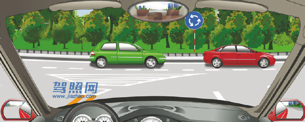

解析：前方标志为环岛行驶，应该让已进入环岛内的车辆通行。当前车辆不能压白色网状区域。

## 141. 在路口右转弯遇同车道前车等候放行信号时如何行驶？

题号：141 · 章节：全部题目、第1章：道路交通安全法律、法规和规章 · [原题](https://www.aijiaxiao.com/tiba/141/)

- A、从前车左侧转弯
- B、从右侧占道转弯
- C、鸣喇叭让前车让路
- D、依次停车等候

**答案：D**

解析：《道路交通安全法实施条例》第五十一条：机动车通过有交通信号灯控制的交叉路口，向右转弯遇有同车道前车正在等候放行信号时，依次停车等候。

## 142. 在这个路口右转弯如何通行？

题号：142 · 章节：全部题目、第1章：道路交通安全法律、法规和规章 · [原题](https://www.aijiaxiao.com/tiba/142/)

- A、先让对面车左转弯
- B、直接向右转弯
- C、抢在对面车前右转弯
- D、鸣喇叭催促

**答案：A**

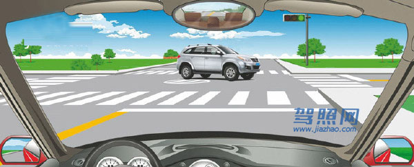

解析：对面左转车辆已到路口中间，本车先让对面左转弯车转弯再右转。

## 143. 在路口直行时,遇这种情形如何通行？

题号：143 · 章节：全部题目、第1章：道路交通安全法律、法规和规章 · [原题](https://www.aijiaxiao.com/tiba/143/)

- A、让左方道路车辆先行
- B、让右方道路车辆先行
- C、直接加速直行通过
- D、开启危险报警闪光灯通行

**答案：B**

解析：三个先行原则：转弯的机动车让直行的车辆先行，右方道路来车先行，右转弯车让左转弯车先行。

## 144. 在路口遇这种情形要减速让行。

题号：144 · 章节：全部题目、第1章：道路交通安全法律、法规和规章 · [原题](https://www.aijiaxiao.com/tiba/144/)

- A、正确
- B、错误

**答案：A**

解析：道路上和右侧有减速让行的标志，应当减速让行，让左侧的车先行。

## 145. 驾驶机动车通过没有交通信号的交叉路口怎样行驶？

题号：145 · 章节：全部题目、第1章：道路交通安全法律、法规和规章 · [原题](https://www.aijiaxiao.com/tiba/145/)

- A、减速慢行
- B、加速通过
- C、大型车先行
- D、左侧车辆先行

**答案：A**

解析：在没有交通信号的交叉路口，应当减速慢行，同时注意观察周围情况，确认可以通过再通过。

## 146. 驾驶机动车通过没有交通信号和管理人员的铁路道口怎样通过？

题号：146 · 章节：全部题目、第1章：道路交通安全法律、法规和规章 · [原题](https://www.aijiaxiao.com/tiba/146/)

- A、适当减速通过
- B、空挡滑行通过
- C、停车确认安全后通过
- D、加速尽快通过

**答案：C**

解析：《道路交通安全法》第四十六条：机动车通过铁路道口时，应当按照交通信号或者管理人员的指挥通行；没有交通信号或者管理人员的，应当减速或者停车，在确认安全后通过。

## 147. 驾驶机动车通过交叉路口要遵守交通信号。

题号：147 · 章节：全部题目、第1章：道路交通安全法律、法规和规章 · [原题](https://www.aijiaxiao.com/tiba/147/)

- A、正确
- B、错误

**答案：A**

解析：《道路交通安全法》第四十四条：机动车通过交叉路口，应当按照交通信号灯、交通标志、交通标线或者交通警察的指挥通过；通过没有交通信号灯、交通标志、交通标线或者交通警察指挥的交叉路口时，应当减速慢行，并让行人和优先通行的车辆先行。

## 148. 驾驶机动车在没有交通信号的路口要尽快通过。

题号：148 · 章节：全部题目、第1章：道路交通安全法律、法规和规章 · [原题](https://www.aijiaxiao.com/tiba/148/)

- A、正确
- B、错误

**答案：B**

解析：《道路交通安全法》第四十四条：通过没有交通信号灯、交通标志、交通标线或者交通警察指挥的交叉路口时，应当减速慢行，并让行人和优先通过的车辆先行。

## 149. 在这种情况的铁路道口要加速通过。

题号：149 · 章节：全部题目、第1章：道路交通安全法律、法规和规章 · [原题](https://www.aijiaxiao.com/tiba/149/)

- A、正确
- B、错误

**答案：B**

解析：《道路交通安全法》第四十四条：机动车通过交叉路口，应当按照交通信号灯、交通标志、交通标线或者交通警察的指挥通过；通过没有交通信号灯、交通标志、交通标线或者交通警察指挥的交叉路口时，应当减速慢行，并让行人和优先通行的车辆先行。

## 150. 行至这种情况的铁路道口要停车观察。

题号：150 · 章节：全部题目、第1章：道路交通安全法律、法规和规章 · [原题](https://www.aijiaxiao.com/tiba/150/)

- A、正确
- B、错误

**答案：A**

解析：《道路交通安全法》第四十六条：机动车通过铁路道口时，应当按照交通信号或者管理人员的指挥通行；没有交通信号或者管理人员的，应当减速或者停车，在确认安全后通过。

## 151. 在这种情况的交叉路口转弯要让直行车先行。

题号：151 · 章节：全部题目、第1章：道路交通安全法律、法规和规章 · [原题](https://www.aijiaxiao.com/tiba/151/)

- A、正确
- B、错误

**答案：A**

解析：三个先行原则：转弯的机动车让直行的车辆先行，右方道路来车先行，右转弯车让左转弯车先行。

## 152. 在交叉路口遇到这种情况享有优先通行权。

题号：152 · 章节：全部题目、第1章：道路交通安全法律、法规和规章 · [原题](https://www.aijiaxiao.com/tiba/152/)

- A、正确
- B、错误

**答案：A**

解析：三个先行原则：转弯的机动车让直行的车辆先行，右方道路来车先行，右转弯车让左转弯车先行。我方为左转，对方右转，故我方优先通过。

## 153. 在交叉路口遇到这种情况享有优先通行权。

题号：153 · 章节：全部题目、第1章：道路交通安全法律、法规和规章 · [原题](https://www.aijiaxiao.com/tiba/153/)

- A、正确
- B、错误

**答案：B**

解析：三个先行原则：转弯的机动车让直行的车辆先行，右方道路来车先行，右转弯车让左转弯车先行。我方为右转，对方左转，故对方优先通过。

## 154. 遇有这种排队等候的情形怎么做？

题号：154 · 章节：全部题目、第1章：道路交通安全法律、法规和规章 · [原题](https://www.aijiaxiao.com/tiba/154/)

- A、依次排队等候
- B、从右侧借道超越
- C、从左侧跨越实线超越
- D、从两侧随意超越

**答案：A**

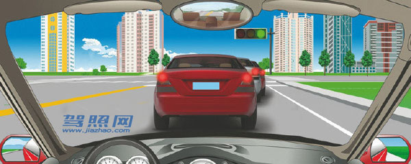

解析：前方拥堵，请耐心等候。

## 155. 遇到前方车辆缓慢行驶时怎样行驶？

题号：155 · 章节：全部题目、第1章：道路交通安全法律、法规和规章 · [原题](https://www.aijiaxiao.com/tiba/155/)

- A、从两侧随意超越
- B、从右侧借道超越
- C、占对向车道超越
- D、依次排队行驶

**答案：D**

解析：黄色单实线不许车辆跨越、超车、压线。不要着急，文明驾驶。

## 156. 在路口遇到这种情形时怎样做？

题号：156 · 章节：全部题目、第1章：道路交通安全法律、法规和规章 · [原题](https://www.aijiaxiao.com/tiba/156/)

- A、停在网状线区域内等待
- B、停在路口以外等待
- C、跟随前车通过路口
- D、停在路口内等待

**答案：B**

解析：《道路交通安全法实施条例》第五十三条：机动车在遇有前方机动车停车排队等候或者缓慢行驶时，应当依次排队，不得从前方车辆两侧穿插或者超越行驶，不得在人行横道、网状线区域内停车等候。

## 157. 驾驶机动车在车道减少的路口，遇到前方车辆依次停车或缓慢行驶时怎么办？

题号：157 · 章节：全部题目、第1章：道路交通安全法律、法规和规章 · [原题](https://www.aijiaxiao.com/tiba/157/)

- A、从前车右侧路肩进入路口
- B、从有空隙一侧进入路口
- C、每车道一辆依次交替驶入路口
- D、向左变道穿插进入路口

**答案：C**

解析：《道路交通安全法实施条例》第五十三条：机动车在车道减少的路口、路段，遇有前方机动车停车排队等候或者缓慢行驶的，应当每车道一辆依次交替驶入车道减少后的路口、路段。

## 158. 驾驶机动车遇到前方车辆停车排队等候或缓慢行驶时怎么办？

题号：158 · 章节：全部题目、第1章：道路交通安全法律、法规和规章 · [原题](https://www.aijiaxiao.com/tiba/158/)

- A、可借道超车
- B、占用对面车道
- C、穿插等候的车辆
- D、依次行驶

**答案：D**

解析：《道路交通安全法》第四十五条：机动车遇有前方车辆停车排队等候或者缓慢行驶时，不得借道超车或者占用对面车道，不得穿插等候的车辆。

## 159. 驾驶机动车遇有前方交叉路口交通阻塞时怎么办？

题号：159 · 章节：全部题目、第1章：道路交通安全法律、法规和规章 · [原题](https://www.aijiaxiao.com/tiba/159/)

- A、依次停在路口外等候
- B、可借对向车道通过
- C、从前车两侧穿插通过
- D、进入路口内等候

**答案：A**

解析：《道路交通安全法实施条例》第五十三条：机动车遇有前方交叉路口交通阻塞时，应当依次停在路口以外等候，不得进入路口。

## 160. 驾驶机动车在没有交通信号的路口遇到前方车辆缓慢行驶时要依次交替通行。

题号：160 · 章节：全部题目、第1章：道路交通安全法律、法规和规章 · [原题](https://www.aijiaxiao.com/tiba/160/)

- A、正确
- B、错误

**答案：A**

解析：《道路交通安全法》第四十五条：在车道减少的路段、路口，或者在没有交通信号灯、交通标志、交通标线或者交通警察指挥的交叉路口遇到停车排队等候或者缓慢行驶时，机动车应当依次交替通行。

## 161. 遇到这种情况时，要加速从红车前变更车道。

题号：161 · 章节：全部题目、第1章：道路交通安全法律、法规和规章 · [原题](https://www.aijiaxiao.com/tiba/161/)

- A、正确
- B、错误

**答案：B**

解析：错在“加速”，只能减速跟在红车后面。

## 162. 在交叉路口遇到这种情况时，要在红灯亮以前加速通过路口。

题号：162 · 章节：全部题目、第1章：道路交通安全法律、法规和规章 · [原题](https://www.aijiaxiao.com/tiba/162/)

- A、正确
- B、错误

**答案：B**

解析：黄灯亮了，车身没过白线，请停车等待。

## 163. 遇到这种情况的路段，可以进入网状线区域内停车等候。

题号：163 · 章节：全部题目、第1章：道路交通安全法律、法规和规章 · [原题](https://www.aijiaxiao.com/tiba/163/)

- A、正确
- B、错误

**答案：B**

解析：《道路交通安全法实施条例》第五十三条：机动车在遇有前方机动车停车排队等候或者缓慢行驶时，应当依次排队，不得从前方车辆两侧穿插或者超越行驶，不得在人行横道、网状线区域内停车等候。

## 164. 这辆小轿车不能在这个位置停车。

题号：164 · 章节：全部题目、第1章：道路交通安全法律、法规和规章 · [原题](https://www.aijiaxiao.com/tiba/164/)

- A、正确
- B、错误

**答案：A**

解析：人行横道禁止停车。

## 165. 驾驶机动车遇到这种桥时首先怎样办？

题号：165 · 章节：全部题目、第1章：道路交通安全法律、法规和规章 · [原题](https://www.aijiaxiao.com/tiba/165/)

- A、保持匀速通过
- B、尽快加速通过
- C、低速缓慢通过
- D、停车察明水情

**答案：D**

解析：《道路交通安全法实施条例》第六十四条：机动车行经漫水路或者漫水桥时，应当停车察明水情，确认安全后，低速通过。

## 166. 驾驶机动车通过漫水路时要加速行驶。

题号：166 · 章节：全部题目、第1章：道路交通安全法律、法规和规章 · [原题](https://www.aijiaxiao.com/tiba/166/)

- A、正确
- B、错误

**答案：B**

解析：《道路交通安全法实施条例》第六十四条：机动车行经漫水路或者漫水桥时，应当停车察明水情，确认安全后，低速通过。

## 167. 驾驶机动车遇到漫水桥时要察明水情确认安全后再低速通过。

题号：167 · 章节：全部题目、第1章：道路交通安全法律、法规和规章 · [原题](https://www.aijiaxiao.com/tiba/167/)

- A、正确
- B、错误

**答案：A**

解析：《道路交通安全法实施条例》第六十四条：机动车行经漫水路或者漫水桥时，应当停车察明水情，确认安全后，低速通过。

## 168. 遇到这种情形时，应怎么办？

题号：168 · 章节：全部题目、第1章：道路交通安全法律、法规和规章 · [原题](https://www.aijiaxiao.com/tiba/168/)

- A、从行人前方绕行
- B、停车让行人先行
- C、鸣喇叭提醒行人
- D、从行人后方绕行

**答案：B**

解析：通过人行横道应减速慢行，遇到行人则需停车让行。

## 169. 行经这种交通标线的路段要加速行驶。

题号：169 · 章节：全部题目、第1章：道路交通安全法律、法规和规章 · [原题](https://www.aijiaxiao.com/tiba/169/)

- A、正确
- B、错误

**答案：B**

解析：要减速通过，看到那个白色的菱形没，那是人行横道预告，所以要减速防止撞到行人。

## 170. 遇到这种情形时要停车避让行人。

题号：170 · 章节：全部题目、第1章：道路交通安全法律、法规和规章 · [原题](https://www.aijiaxiao.com/tiba/170/)

- A、正确
- B、错误

**答案：A**

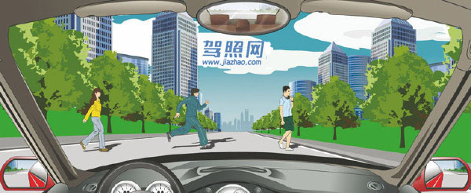

解析：路遇行人横穿马路要停车让行。

## 171. 在这种路口怎样进行掉头？

题号：171 · 章节：全部题目、第1章：道路交通安全法律、法规和规章 · [原题](https://www.aijiaxiao.com/tiba/171/)

- A、在人行横道上掉头
- B、进入路口后掉头
- C、从右侧车道掉头
- D、从中心线虚线处掉头

**答案：D**

解析：虚线位置可以掉头，实线是不能压的。

## 172. 遇到这种情况的路口，以下做法正确的是什么？

题号：172 · 章节：全部题目、第1章：道路交通安全法律、法规和规章 · [原题](https://www.aijiaxiao.com/tiba/172/)

- A、沿左侧车道掉头
- B、该路口不能掉头
- C、选择中间车道掉头
- D、在路口内掉头

**答案：B**

解析：此处有禁止掉头的标志，所以是不可以掉头的。

## 173. 在这个路口可以掉头。

题号：173 · 章节：全部题目、第1章：道路交通安全法律、法规和规章 · [原题](https://www.aijiaxiao.com/tiba/173/)

- A、正确
- B、错误

**答案：B**

解析：《道路交通安全法实施条例》第四十九条：机动车在有禁止掉头或者禁止左转弯标志、标线的地点以及在铁路道口、人行横道、桥梁、急弯、陡坡、隧道或者容易发生危险的路段，不得掉头。

## 174. 在这个路口不能掉头。

题号：174 · 章节：全部题目、第1章：道路交通安全法律、法规和规章 · [原题](https://www.aijiaxiao.com/tiba/174/)

- A、正确
- B、错误

**答案：B**

解析：此处可以掉头有掉头的标志，还有黄色的虚线。

## 175. 在这段道路上不能掉头。

题号：175 · 章节：全部题目、第1章：道路交通安全法律、法规和规章 · [原题](https://www.aijiaxiao.com/tiba/175/)

- A、正确
- B、错误

**答案：A**

解析：《道路交通安全法实施条例》第四十九条：机动车在有禁止掉头或者禁止左转弯标志、标线的地点以及在铁路道口、人行横道、桥梁、急弯、陡坡、隧道或者容易发生危险的路段，不得掉头。

## 176. 驾驶机动车在铁路道口、桥梁、陡坡、隧道或者容易发生危险的路段不能掉头。

题号：176 · 章节：全部题目、第1章：道路交通安全法律、法规和规章 · [原题](https://www.aijiaxiao.com/tiba/176/)

- A、正确
- B、错误

**答案：A**

解析：《道路交通安全法实施条例》第四十九条：机动车在有禁止掉头或者禁止左转弯标志、标线的地点以及在铁路道口、人行横道、桥梁、急弯、陡坡、隧道或者容易发生危险的路段，不得掉头。

## 177. 在这段道路上，只要不影响其他车辆通行的前提下可以掉头。

题号：177 · 章节：全部题目、第1章：道路交通安全法律、法规和规章 · [原题](https://www.aijiaxiao.com/tiba/177/)

- A、正确
- B、错误

**答案：A**

解析：黄色虚线，是可以掉头的，如果是实线就不可以了。

## 178. 这位驾驶人违反法律规定的行为是什么？

题号：178 · 章节：全部题目、第1章：道路交通安全法律、法规和规章 · [原题](https://www.aijiaxiao.com/tiba/178/)

- A、没按规定握转向盘
- B、座椅角度不对
- C、没系安全带
- D、驾驶姿势不正确

**答案：C**

解析：《道路交通安全法》第五十一条：机动车行驶时，驾驶人、乘坐人员应当按规定使用安全带，摩托车驾驶人及乘坐人员应当按规定戴安全头盔。

## 179. 驾驶机动车在上道路行驶前驾驶人要按规定系好安全带。

题号：179 · 章节：全部题目、第1章：道路交通安全法律、法规和规章 · [原题](https://www.aijiaxiao.com/tiba/179/)

- A、正确
- B、错误

**答案：A**

解析：《道路交通安全法》第五十一条：机动车行驶时，驾驶人、乘坐人员应当按规定使用安全带，摩托车驾驶人及乘坐人员应当按规定戴安全头盔。

## 180. 机动车上路行驶时，前排乘车人可不系安全带。

题号：180 · 章节：全部题目、第1章：道路交通安全法律、法规和规章 · [原题](https://www.aijiaxiao.com/tiba/180/)

- A、正确
- B、错误

**答案：B**

解析：《道路交通安全法》第五十一条：机动车行驶时，驾驶人、乘坐人员应当按规定使用安全带，摩托车驾驶人及乘坐人员应当按规定戴安全头盔。

## 181. 机动车行驶中，车上少年儿童可不使用安全带。

题号：181 · 章节：全部题目、第1章：道路交通安全法律、法规和规章 · [原题](https://www.aijiaxiao.com/tiba/181/)

- A、正确
- B、错误

**答案：B**

解析：《道路交通安全法》第五十一条：机动车行驶时，驾驶人、乘坐人员应当按规定使用安全带，摩托车驾驶人及乘坐人员应当按规定戴安全头盔。儿童更应该系安全带。

## 182. 找出这辆故障车有哪种违法行为？

题号：182 · 章节：全部题目、第1章：道路交通安全法律、法规和规章 · [原题](https://www.aijiaxiao.com/tiba/182/)

- A、没有设置警告标志
- B、没有开启危险报警闪光灯
- C、没有将车停到路边
- D、没有立即排除故障

**答案：A**

解析：《道路交通安全法实施条例》第六十条：机动车在道路上发生故障或者发生交通事故，妨碍交通又难以移动的，应当按照规定开启危险报警闪光灯并在车后50米至100米处设置警告标志，夜间还应当同时开启示廓灯和后位灯。

## 183. 机动车在道路上发生故障，需要停车排除时，驾驶人应该怎么办？

题号：183 · 章节：全部题目、第1章：道路交通安全法律、法规和规章 · [原题](https://www.aijiaxiao.com/tiba/183/)

- A、就地停车排除故障
- B、开启近光灯或雾灯
- C、将车停到不妨碍交通的地方
- D、将车停在道路中间

**答案：C**

解析：需要停车排除就说明不是车胎抱死，车还是可以开的，所以要开到不防碍交通的地方。

## 184. 机动车在道路上发生故障，难以移动时下列做法正确的是什么？

题号：184 · 章节：全部题目、第1章：道路交通安全法律、法规和规章 · [原题](https://www.aijiaxiao.com/tiba/184/)

- A、开启危险报警闪光灯
- B、开启车上所有灯光
- C、禁止车上人员下车
- D、在车前方设置警告标志

**答案：A**

解析：《道路交通安全法实施条例》第六十条：机动车在道路上发生故障或者发生交通事故，妨碍交通又难以移动的，应当按照规定开启危险报警闪光灯并在车后50米至100米处设置警告标志，夜间还应当同时开启示廓灯和后位灯。

## 185. 这辆停在路边的机动车没有违法行为。

题号：185 · 章节：全部题目、第1章：道路交通安全法律、法规和规章 · [原题](https://www.aijiaxiao.com/tiba/185/)

- A、正确
- B、错误

**答案：B**

解析：《道路交通安全法实施条例》第六十条：机动车在道路上发生故障或者发生交通事故，妨碍交通又难以移动的，应当按照规定开启危险报警闪光灯并在车后50米至100米处设置警告标志，夜间还应当同时开启示廓灯和后位灯。警告标志与车的距离不足50米。

## 186. 机动车在道路上发生故障难以移动时要在车后50米以内设置警告标志。

题号：186 · 章节：全部题目、第1章：道路交通安全法律、法规和规章 · [原题](https://www.aijiaxiao.com/tiba/186/)

- A、正确
- B、错误

**答案：B**

解析：《道路交通安全法实施条例》第六十条：机动车在道路上发生故障或者发生交通事故，妨碍交通又难以移动的，应当按照规定开启危险报警闪光灯并在车后50米至100米处设置警告标志，夜间还应当同时开启示廓灯和后位灯。

## 187. 机动车在道路上发生轻微交通事故且妨碍交通时，不需移动。

题号：187 · 章节：全部题目、第1章：道路交通安全法律、法规和规章 · [原题](https://www.aijiaxiao.com/tiba/187/)

- A、正确
- B、错误

**答案：B**

解析：如果可以移动，应移动到安全位置，并且不要妨碍交通。

## 188. 机动车在夜间道路上发生故障难以移动时要开启危险报警闪光灯、示廓灯、后位灯。

题号：188 · 章节：全部题目、第1章：道路交通安全法律、法规和规章 · [原题](https://www.aijiaxiao.com/tiba/188/)

- A、正确
- B、错误

**答案：A**

解析：《道路交通安全法实施条例》第六十条：机动车在道路上发生故障或者发生交通事故，妨碍交通又难以移动的，应当按照规定开启危险报警闪光灯并在车后50米至100米处设置警告标志，夜间还应当同时开启示廓灯和后位灯。

## 189. 在这种情形中前车怎样行驶？

题号：189 · 章节：全部题目、第1章：道路交通安全法律、法规和规章 · [原题](https://www.aijiaxiao.com/tiba/189/)

- A、正常行驶
- B、及时让行
- C、开启危险报警闪光灯行驶
- D、不得变更车道

**答案：B**

解析：与警车执行公务，应该及时让行。

## 190. 行车中遇到执行紧急任务的消防车、救护车、工程救险车时要及时让行。

题号：190 · 章节：全部题目、第1章：道路交通安全法律、法规和规章 · [原题](https://www.aijiaxiao.com/tiba/190/)

- A、正确
- B、错误

**答案：A**

解析：题干指明“执行紧急任务”，当然是应当让行啦！

## 191. 行车中遇到正在进行作业的道路养护车辆、工程作业车时要注意避让。

题号：191 · 章节：全部题目、第1章：道路交通安全法律、法规和规章 · [原题](https://www.aijiaxiao.com/tiba/191/)

- A、正确
- B、错误

**答案：A**

解析：他在为人民服务，我们还是要让一让的。

## 192. 这样在路边临时停放机动车有什么违法行为？

题号：192 · 章节：全部题目、第1章：道路交通安全法律、法规和规章 · [原题](https://www.aijiaxiao.com/tiba/192/)

- A、在非机动车道停车
- B、停车占用机动车道
- C、距离路边超过30厘米
- D、在有禁停标线路段停车

**答案：D**

解析：图中右侧路边是黄色的禁止停车标线，所以此处是不能停车的。

## 193. 驾驶机动车需要在路边停车时怎样选择停车地点？

题号：193 · 章节：全部题目、第1章：道路交通安全法律、法规和规章 · [原题](https://www.aijiaxiao.com/tiba/193/)

- A、在人行道上停放
- B、在路边随意停放
- C、在停车泊位内停放
- D、靠左侧路边逆向停放

**答案：C**

解析：停车应该在停车泊位内。

## 194. 这样在路边临时停放机动车有什么违法行为？

题号：194 · 章节：全部题目、第1章：道路交通安全法律、法规和规章 · [原题](https://www.aijiaxiao.com/tiba/194/)

- A、在非机动车道停车
- B、在人行横道上停车
- C、距离路边超过30厘米
- D、在有禁停标线路段停车

**答案：B**

解析：《道路交通安全法实施条例》第六十三条：在设有禁停标志、标线的路段，在机动车道与非机动车道、人行道之间设有隔离设施的路段以及人行横道、施工地段，不得停车。

## 195. 这样临时停放红色轿车有什么违法行为？

题号：195 · 章节：全部题目、第1章：道路交通安全法律、法规和规章 · [原题](https://www.aijiaxiao.com/tiba/195/)

- A、距离加油站不到30米
- B、停车占用非机动车道
- C、距离路边超过30厘米
- D、在有禁停标线路段停车

**答案：A**

解析：《道路交通安全法实施条例》第六十三条：公共汽车站、急救站、加油站、消防栓或者消防队(站)门前以及距离上述地点30米以内的路段，除使用上述设施的以外，不得停车；

## 196. 这样停放机动车什么违法行为？

题号：196 · 章节：全部题目、第1章：道路交通安全法律、法规和规章 · [原题](https://www.aijiaxiao.com/tiba/196/)

- A、停车占用人行道
- B、在公共汽车站停车
- C、在有禁停标志路段停车
- D、在非机动车道停车

**答案：B**

解析：《道路交通安全法实施条例》第六十三条：公共汽车站、急救站、加油站、消防栓或者消防队(站)门前以及距离上述地点30米以内的路段，除使用上述设施的以外，不得停车。

## 197. 在距这段路多少米以内的路段不能停放机动车？

题号：197 · 章节：全部题目、第1章：道路交通安全法律、法规和规章 · [原题](https://www.aijiaxiao.com/tiba/197/)

- A、5米以内
- B、10米以内
- C、30米以内
- D、50米以内

**答案：D**

解析：《道路交通安全法实施条例》第六十三条：交叉路口、铁路道口、急弯路、宽度不足4米的窄路、桥梁、陡坡、隧道以及距离上述地点50米以内的路段，不得停车。

## 198. 在道路上临时停车不得妨碍其他车辆和行人通行。

题号：198 · 章节：全部题目、第1章：道路交通安全法律、法规和规章 · [原题](https://www.aijiaxiao.com/tiba/198/)

- A、正确
- B、错误

**答案：A**

解析：《道路交通安全法》第五十六条：在道路上临时停车的，不得妨碍其他车辆和行人通行。

## 199. 驾驶机动车找不到停车位时可以借人行道停放。

题号：199 · 章节：全部题目、第1章：道路交通安全法律、法规和规章 · [原题](https://www.aijiaxiao.com/tiba/199/)

- A、正确
- B、错误

**答案：B**

解析：停车不得占用人行道。

## 200. 距离交叉路口50米以内的路段不能停车。

题号：200 · 章节：全部题目、第1章：道路交通安全法律、法规和规章 · [原题](https://www.aijiaxiao.com/tiba/200/)

- A、正确
- B、错误

**答案：A**

解析：《道路交通安全法实施条例》第六十三条：交叉路口、铁路道口、急弯路、宽度不足4米的窄路、桥梁、陡坡、隧道以及距离上述地点50米以内的路段，不得停车。

## 201. 这个路段可以在非机动车道上临时停车。

题号：201 · 章节：全部题目、第1章：道路交通安全法律、法规和规章 · [原题](https://www.aijiaxiao.com/tiba/201/)

- A、正确
- B、错误

**答案：B**

解析：这个是非机动车道，不可停车否则会影响非机动车通行。

## 202. 社会车辆距离消防栓或者消防队(站)门前30米以内的路段不能停车。

题号：202 · 章节：全部题目、第1章：道路交通安全法律、法规和规章 · [原题](https://www.aijiaxiao.com/tiba/202/)

- A、正确
- B、错误

**答案：A**

解析：《道路交通安全法实施条例》第六十三条：公共汽车站、急救站、加油站、消防栓或者消防队(站)门前以及距离上述地点30米以内的路段，除使用上述设施的以外，不得停车。

## 203. 距离桥梁、陡坡、隧道50米以内的路段不能停车。

题号：203 · 章节：全部题目、第1章：道路交通安全法律、法规和规章 · [原题](https://www.aijiaxiao.com/tiba/203/)

- A、正确
- B、错误

**答案：A**

解析：《道路交通安全法实施条例》第六十三条：交叉路口、铁路道口、急弯路、宽度不足4米的窄路、桥梁、陡坡、隧道以及距离上述地点50米以内的路段，不得停车。

## 204. 距离宽度不足4米的窄路50米以内的路段不能停车。

题号：204 · 章节：全部题目、第1章：道路交通安全法律、法规和规章 · [原题](https://www.aijiaxiao.com/tiba/204/)

- A、正确
- B、错误

**答案：A**

解析：《道路交通安全法实施条例》第六十三条：交叉路口、铁路道口、急弯路、宽度不足4米的窄路、桥梁、陡坡、隧道以及距离上述地点50米以内的路段，不得停车。

## 205. 机动车停稳前不能开车门和上下人员。

题号：205 · 章节：全部题目、第1章：道路交通安全法律、法规和规章 · [原题](https://www.aijiaxiao.com/tiba/205/)

- A、正确
- B、错误

**答案：A**

解析：停稳后再上下人员，安全第一。

## 206. 打开机动车车门时，不得妨碍其他车辆和行人通行。

题号：206 · 章节：全部题目、第1章：道路交通安全法律、法规和规章 · [原题](https://www.aijiaxiao.com/tiba/206/)

- A、正确
- B、错误

**答案：A**

解析：《道路交通安全法实施条例》第七十七条：乘坐机动车应当遵守下列规定：(一)不得在机动车道上拦乘机动车；(二)在机动车道上不得从机动车左侧上下车；(三)开关车门不得妨碍其他车辆和行人通行；(四)机动车行驶中，不得干扰驾驶，不得将身体任何部分伸出车外，不得跳车；(五)乘坐两轮摩托车应当正向骑坐。

## 207. 在这段高速公路上行驶的最高车速是多少？

题号：207 · 章节：全部题目、第1章：道路交通安全法律、法规和规章 · [原题](https://www.aijiaxiao.com/tiba/207/)

- A、120公里/小时
- B、100公里/小时
- C、90公里/小时
- D、60公里/小时

**答案：A**

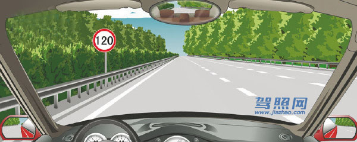

解析：红圈白底限制最高速度，此路段最高车速是120公里每小时。

## 208. 在这段高速公路上行驶的最低车速是多少？

题号：208 · 章节：全部题目、第1章：道路交通安全法律、法规和规章 · [原题](https://www.aijiaxiao.com/tiba/208/)

- A、50公里/小时
- B、60公里/小时
- C、80公里/小时
- D、100公里/小时

**答案：B**

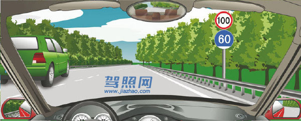

解析：红圈白底限制最高速度，蓝底限制最低速度，此路段最低车速是60公里每小时。

## 209. 在这条车道行驶的最低车速是多少？

题号：209 · 章节：全部题目、第1章：道路交通安全法律、法规和规章 · [原题](https://www.aijiaxiao.com/tiba/209/)

- A、60公里/小时
- B、90公里/小时
- C、100公里/小时
- D、110公里/小时

**答案：C**

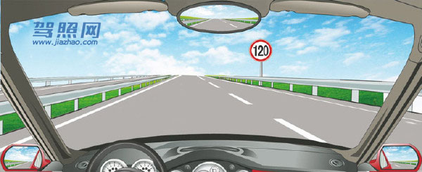

解析：《道路交通安全法实施条例》第七十八条：高速公路应当标明车道的行驶速度，最高车速不得超过每小时120公里，最低车速不得低于每小时60公里。在高速公路上行驶的小型载客汽车最高车速不得超过每小时120公里，其他机动车不得超过每小时100公里，摩托车不得超过每小时80公里。同方向有2条车道的，左侧车道的最低车速为每小时100公里；同方向有3条以上车道的，最左侧车道的最低车速为每小时110公里，中间车道的最低车速为每小时90公里。道路限速标志标明的车速与上述车道行驶车速的规定不一致的，按照道路限速标志标明的车速行驶。图中车在同方向车道为左车道，所以最低车速为每小时100公里。

## 210. 在这条车道行驶的最低车速是多少？

题号：210 · 章节：全部题目、第1章：道路交通安全法律、法规和规章 · [原题](https://www.aijiaxiao.com/tiba/210/)

- A、60公里/小时
- B、90公里/小时
- C、100公里/小时
- D、110公里/小时

**答案：B**

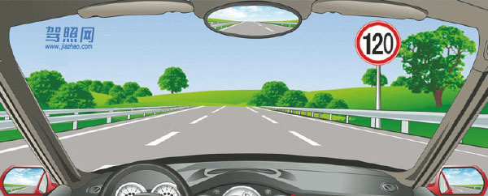

解析：《道路交通安全法实施条例》第七十八条：高速公路应当标明车道的行驶速度，最高车速不得超过每小时120公里，最低车速不得低于每小时60公里。在高速公路上行驶的小型载客汽车最高车速不得超过每小时120公里，其他机动车不得超过每小时100公里，摩托车不得超过每小时80公里。同方向有2条车道的，左侧车道的最低车速为每小时100公里；同方向有3条以上车道的，最左侧车道的最低车速为每小时110公里，中间车道的最低车速为每小时90公里。道路限速标志标明的车速与上述车道行驶车速的规定不一致的，按照道路限速标志标明的车速行驶。图中车在同方向三条车道的中间，所以最低车速为每小时90公里。

## 211. 在这条车道行驶的最高车速是多少？

题号：211 · 章节：全部题目、第1章：道路交通安全法律、法规和规章 · [原题](https://www.aijiaxiao.com/tiba/211/)

- A、120公里/小时
- B、110公里/小时
- C、100公里/小时
- D、90公里/小时

**答案：D**

解析：标志、标线齐全的路段，按标志、标线行驶。所以最高车速是90公里/小时。

## 212. 驾驶小型载客汽车在高速公路行驶的最低车速为90公里/小时。

题号：212 · 章节：全部题目、第1章：道路交通安全法律、法规和规章 · [原题](https://www.aijiaxiao.com/tiba/212/)

- A、正确
- B、错误

**答案：B**

解析：《道路交通安全法实施条例》第七十八条：高速公路应当标明车道的行驶速度，最高车速不得超过每小时120公里，最低车速不得低于每小时60公里。

## 213. 驾驶机动车在高速公路要按照限速标志标明的车速行驶。

题号：213 · 章节：全部题目、第1章：道路交通安全法律、法规和规章 · [原题](https://www.aijiaxiao.com/tiba/213/)

- A、正确
- B、错误

**答案：A**

解析：在高速公路上超速不足50%的，罚款20元到200元（记6分）。超速50%以上的（记12分），处二百元以上二千元以下罚款，并处吊销机动车驾驶证。

## 214. 在这个位置时怎样使用灯光？

题号：214 · 章节：全部题目、第1章：道路交通安全法律、法规和规章 · [原题](https://www.aijiaxiao.com/tiba/214/)

- A、开启左转向灯
- B、开启右转向灯
- C、开启危险报警闪光灯
- D、开启前照灯

**答案：A**

解析：《道路交通安全法实施条例》第七十九条：机动车从匝道驶入高速公路，应当开启左转向灯，在不妨碍已在高速公路内的机动车正常行驶的情况下驶入车道。

## 215. 进入减速车道时怎样使用灯光？

题号：215 · 章节：全部题目、第1章：道路交通安全法律、法规和规章 · [原题](https://www.aijiaxiao.com/tiba/215/)

- A、开启左转向灯
- B、开启右转向灯
- C、开启危险报警闪光灯
- D、开启前照灯

**答案：B**

解析：减速车道在右侧，应该开启右转向灯提醒后车注意减速避让，然后从虚线处进入减速车道。

## 216. 驾驶小型载客汽车在高速公路上时速超过100公里时的跟车距离是多少？

题号：216 · 章节：全部题目、第1章：道路交通安全法律、法规和规章 · [原题](https://www.aijiaxiao.com/tiba/216/)

- A、保持50米以上
- B、保持60米以上
- C、保持80米以上
- D、保持100米以上

**答案：D**

解析：《道路交通安全法实施条例》第八十条：机动车在高速公路上行驶，车速超过每小时100公里时，应当与同车道前车保持100米以上的距离，车速低于每小时100公里时，与同车道前车距离可以适当缩短，但最小距离不得少于50米。

## 217. 驾驶小型载客汽车在高速公路上时速低于100公里时的最小跟车距离是多少？

题号：217 · 章节：全部题目、第1章：道路交通安全法律、法规和规章 · [原题](https://www.aijiaxiao.com/tiba/217/)

- A、不得少于50米
- B、不得少于30米
- C、不得少于20米
- D、不得少于10米

**答案：A**

解析：《道路交通安全法实施条例》第八十条：机动车在高速公路上行驶，车速超过每小时100公里时，应当与同车道前车保持100米以上的距离，车速低于每小时100公里时，与同车道前车距离可以适当缩短，但最小距离不得少于50米。

## 218. 驾驶机动车在高速公路遇到能见度低于200米的气象条件时，最高车速是多少？

题号：218 · 章节：全部题目、第1章：道路交通安全法律、法规和规章 · [原题](https://www.aijiaxiao.com/tiba/218/)

- A、不得超过100公里/小时
- B、不得超过90公里/小时
- C、不得超过80公里/小时
- D、不得超过60公里/小时

**答案：D**

解析：《道路交通安全法实施条例》第八十一条：机动车在高速公路上行驶，遇有雾、雨、雪、沙尘、冰雹等低能见度气象条件时，应当遵守下列规定：(一)能见度小于200米时，开启雾灯、近光灯、示廓灯和前后位灯，车速不得超过每小时60公里，与同车道前车保持100米以上的距离；(二)能见度小于100米时，开启雾灯、近光灯、示廓灯、前后位灯和危险报警闪光灯，车速不得超过每小时40公里，与同车道前车保持50米以上的距离；(三)能见度小于50米时，开启雾灯、近光灯、示廓灯、前后位灯和危险报警闪光灯，车速不得超过每小时20公里，并从最近的出口尽快驶离高速公路。

## 219. 驾驶机动车在高速公路遇到能见度低于100米的气象条件时，最高车速是多少？

题号：219 · 章节：全部题目、第1章：道路交通安全法律、法规和规章 · [原题](https://www.aijiaxiao.com/tiba/219/)

- A、不得超过40公里/小时
- B、不得超过60公里/小时
- C、不得超过80公里/小时
- D、不得超过90公里/小时

**答案：A**

解析：《道路交通安全法实施条例》第八十一条：机动车在高速公路上行驶，遇有雾、雨、雪、沙尘、冰雹等低能见度气象条件时，应当遵守下列规定：(一)能见度小于200米时，开启雾灯、近光灯、示廓灯和前后位灯，车速不得超过每小时60公里，与同车道前车保持100米以上的距离；(二)能见度小于100米时，开启雾灯、近光灯、示廓灯、前后位灯和危险报警闪光灯，车速不得超过每小时40公里，与同车道前车保持50米以上的距离；(三)能见度小于50米时，开启雾灯、近光灯、示廓灯、前后位灯和危险报警闪光灯，车速不得超过每小时20公里，并从最近的出口尽快驶离高速公路。

## 220. 驾驶机动车在高速公路遇到能见度低于50米的气象条件时，车速不得超过20公里/小时，还应怎么做？

题号：220 · 章节：全部题目、第1章：道路交通安全法律、法规和规章 · [原题](https://www.aijiaxiao.com/tiba/220/)

- A、进入应急车道行驶
- B、尽快驶离高速公路
- C、在路肩低速行驶
- D、尽快在路边停车

**答案：B**

解析：《道路交通安全法实施条例》第八十一条：机动车在高速公路上行驶，遇有雾、雨、雪、沙尘、冰雹等低能见度气象条件时，应当遵守下列规定：(一)能见度小于200米时，开启雾灯、近光灯、示廓灯和前后位灯，车速不得超过每小时60公里，与同车道前车保持100米以上的距离；(二)能见度小于100米时，开启雾灯、近光灯、示廓灯、前后位灯和危险报警闪光灯，车速不得超过每小时40公里，与同车道前车保持50米以上的距离；(三)能见度小于50米时，开启雾灯、近光灯、示廓灯、前后位灯和危险报警闪光灯，车速不得超过每小时20公里，并从最近的出口尽快驶离高速公路。

## 221. 驾驶机动车驶离高速公路时，在这个位置怎样行驶？

题号：221 · 章节：全部题目、第1章：道路交通安全法律、法规和规章 · [原题](https://www.aijiaxiao.com/tiba/221/)

- A、继续向前行驶
- B、驶入减速车道
- C、车速保持100公里/小时
- D、车速降到40公里/小时以下

**答案：B**

解析：打开右转向灯，提醒车后注意减速，然后从虚线处进入减速车道。

## 222. 可以从这个位置直接驶入高速公路行车道。

题号：222 · 章节：全部题目、第1章：道路交通安全法律、法规和规章 · [原题](https://www.aijiaxiao.com/tiba/222/)

- A、正确
- B、错误

**答案：B**

解析：《道路交通安全法实施条例》第七十九条：机动车从匝道驶入高速公路，应当开启左转向灯，在不妨碍已在高速公路内的机动车正常行驶的情况下驶入车道。本题中“蓝箭头”虽然往“左”进入高速公路，但是压白线了。

## 223. 驶离高速公路可以从这个位置直接驶入匝道。

题号：223 · 章节：全部题目、第1章：道路交通安全法律、法规和规章 · [原题](https://www.aijiaxiao.com/tiba/223/)

- A、正确
- B、错误

**答案：B**

解析：白色实线不能压，只能继续寻找下一个出口。

## 224. 这辆小型载客汽车进入高速公路行车道的行为是正确的。

题号：224 · 章节：全部题目、第1章：道路交通安全法律、法规和规章 · [原题](https://www.aijiaxiao.com/tiba/224/)

- A、正确
- B、错误

**答案：B**

解析：此车压实线，不按标线要求行车。

## 225. 这辆小型载客汽车驶离高速公路行车道的方法是正确的。

题号：225 · 章节：全部题目、第1章：道路交通安全法律、法规和规章 · [原题](https://www.aijiaxiao.com/tiba/225/)

- A、正确
- B、错误

**答案：A**

解析：开了右转向灯，也是从虚线地方进入减速车道，是正确的做法。

## 226. 这辆在高速公路上临时停放的故障车，警告标志应该设置在车后多远处？

题号：226 · 章节：全部题目、第1章：道路交通安全法律、法规和规章 · [原题](https://www.aijiaxiao.com/tiba/226/)

- A、150米以外
- B、50～150米
- C、50～100米
- D、50米以内

**答案：A**

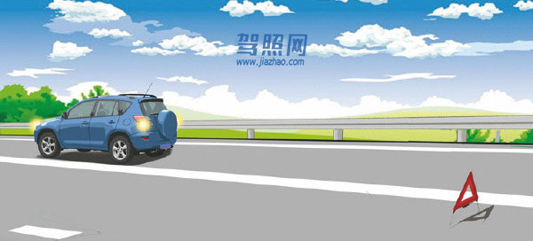

解析：《道路交通安全法》第六十八条：机动车在高速公路上发生故障时，应当依照本法第五十二条的有关规定办理；但是，警告标志应当设置在故障车来车方向一百五十米以外，车上人员应当迅速转移到右侧路肩上或者应急车道内，并且迅速报警。

## 227. 机动车在高速公路上发生故障时错误的做法是什么？

题号：227 · 章节：全部题目、第1章：道路交通安全法律、法规和规章 · [原题](https://www.aijiaxiao.com/tiba/227/)

- A、开启危险报警闪光灯
- B、按规定设置警告标志
- C、车上人员不能下车
- D、迅速报警

**答案：C**

解析：《道路交通安全法》第六十八条：机动车在高速公路上发生故障时，应当依照本法第五十二条的有关规定办理；但是，警告标志应当设置在故障车来车方向一百五十米以外，车上人员应当迅速转移到右侧路肩上或者应急车道内，并且迅速报警。

## 228. 机动车在高速公路上发生故障或交通事故无法正常行驶时由什么车拖曳或牵引？

题号：228 · 章节：全部题目、第1章：道路交通安全法律、法规和规章 · [原题](https://www.aijiaxiao.com/tiba/228/)

- A、过路车
- B、大客车
- C、同行车
- D、清障车

**答案：D**

解析：《道路交通安全法》第六十八条：机动车在高速公路上发生故障时，应当依照本法第五十二条的有关规定办理；但是，警告标志应当设置在故障车来车方向一百五十米以外，车上人员应当迅速转移到右侧路肩上或者应急车道内，并且迅速报警。机动车在高速公路上发生故障或者交通事故，无法正常行驶的，应当由救援车、清障车拖曳、牵引。

## 229. 机动车在高速公路上发生故障时，在来车方向50至100米处设置警告标志。

题号：229 · 章节：全部题目、第1章：道路交通安全法律、法规和规章 · [原题](https://www.aijiaxiao.com/tiba/229/)

- A、正确
- B、错误

**答案：B**

解析：《道路交通安全法》第六十八条：机动车在高速公路上发生故障时，应当依照本法第五十二条的有关规定办理；但是，警告标志应当设置在故障车来车方向一百五十米以外，车上人员应当迅速转移到右侧路肩上或者应急车道内，并且迅速报警。

## 230. 机动车在高速公路上发生故障时，将车上人员迅速转移到右侧路肩上或者应急车道内，并且迅速报警。

题号：230 · 章节：全部题目、第1章：道路交通安全法律、法规和规章 · [原题](https://www.aijiaxiao.com/tiba/230/)

- A、正确
- B、错误

**答案：A**

解析：《道路交通安全法》第六十八条：机动车在高速公路上发生故障时，应当依照本法第五十二条的有关规定办理；但是，警告标志应当设置在故障车来车方向一百五十米以外，车上人员应当迅速转移到右侧路肩上或者应急车道内，并且迅速报警。

## 231. 机动车在高速公路上发生交通事故无法正常行驶时，用救援车、清障车拖曳、牵引。

题号：231 · 章节：全部题目、第1章：道路交通安全法律、法规和规章 · [原题](https://www.aijiaxiao.com/tiba/231/)

- A、正确
- B、错误

**答案：A**

解析：《道路交通安全法》第六十八条：机动车在高速公路上发生故障或者交通事故，无法正常行驶的，应当由救援车、清障车拖曳、牵引。

## 232. 在道路上发生未造成人员伤亡且无争议的轻微交通事故如何处置？

题号：232 · 章节：全部题目、第1章：道路交通安全法律、法规和规章 · [原题](https://www.aijiaxiao.com/tiba/232/)

- A、保护好现场再协商
- B、不要移动车辆
- C、疏导其他车辆绕行
- D、撤离现场自行协商

**答案：D**

解析：《道路交通安全法》第七十条：在道路上发生交通事故，车辆驾驶人应当立即停车，保护现场；造成人身伤亡的，车辆驾驶人应当立即抢救受伤人员，并迅速报告执勤的交通警察或者公安机关交通管理部门。因抢救受伤人员变动现场的，应当标明位置。乘车人、过往车辆驾驶人、过往行人应当予以协助。在道路上发生交通事故，未造成人身伤亡，当事人对事实及成因无争议的，可以即行撤离现场，恢复交通，自行协商处理损害赔偿事宜；不即行撤离现场的，应当迅速报告执勤的交通警察或者公安机关交通管理部门。在道路上发生交通事故，仅造成轻微财产损失，并且基本事实清楚的，当事人应当先撤离现场再进行协商处理。

## 233. 驾驶机动车在道路上发生交通事故要立即将车移到路边。

题号：233 · 章节：全部题目、第1章：道路交通安全法律、法规和规章 · [原题](https://www.aijiaxiao.com/tiba/233/)

- A、正确
- B、错误

**答案：B**

解析：《道路交通安全法》第七十条：在道路上发生交通事故，车辆驾驶人应当立即停车，保护现场；造成人身伤亡的，车辆驾驶人应当立即抢救受伤人员，并迅速报告执勤的交通警察或者公安机关交通管理部门。因抢救受伤人员变动现场的，应当标明位置。乘车人、过往车辆驾驶人、过往行人应当予以协助。在道路上发生交通事故，未造成人身伤亡，当事人对事实及成因无争议的，可以即行撤离现场，恢复交通，自行协商处理损害赔偿事宜；不即行撤离现场的，应当迅速报告执勤的交通警察或者公安机关交通管理部门。在道路上发生交通事故，仅造成轻微财产损失，并且基本事实清楚的，当事人应当先撤离现场再进行协商处理。

## 234. 驾驶人在发生交通事故后因抢救伤员变动现场时要标明位置。

题号：234 · 章节：全部题目、第1章：道路交通安全法律、法规和规章 · [原题](https://www.aijiaxiao.com/tiba/234/)

- A、正确
- B、错误

**答案：A**

解析：《道路交通安全法》第七十条：在道路上发生交通事故，车辆驾驶人应当立即停车，保护现场；造成人身伤亡的，车辆驾驶人应当立即抢救受伤人员，并迅速报告执勤的交通警察或者公安机关交通管理部门。因抢救受伤人员变动现场的，应当标明位置。乘车人、过往车辆驾驶人、过往行人应当予以协助。在道路上发生交通事故，未造成人身伤亡，当事人对事实及成因无争议的，可以即行撤离现场，恢复交通，自行协商处理损害赔偿事宜；不即行撤离现场的，应当迅速报告执勤的交通警察或者公安机关交通管理部门。在道路上发生交通事故，仅造成轻微财产损失，并且基本事实清楚的，当事人应当先撤离现场再进行协商处理。

## 235. 在道路上发生交通事故造成人身伤亡时，要立即抢救受伤人员并迅速报警。

题号：235 · 章节：全部题目、第1章：道路交通安全法律、法规和规章 · [原题](https://www.aijiaxiao.com/tiba/235/)

- A、正确
- B、错误

**答案：A**

解析：《道路交通安全法》第七十条：在道路上发生交通事故，车辆驾驶人应当立即停车，保护现场；造成人身伤亡的，车辆驾驶人应当立即抢救受伤人员，并迅速报告执勤的交通警察或者公安机关交通管理部门。因抢救受伤人员变动现场的，应当标明位置。乘车人、过往车辆驾驶人、过往行人应当予以协助。在道路上发生交通事故，未造成人身伤亡，当事人对事实及成因无争议的，可以即行撤离现场，恢复交通，自行协商处理损害赔偿事宜；不即行撤离现场的，应当迅速报告执勤的交通警察或者公安机关交通管理部门。在道路上发生交通事故，仅造成轻微财产损失，并且基本事实清楚的，当事人应当先撤离现场再进行协商处理。

## 236. 驾驶人连续驾驶不得超过多长时间？

题号：236 · 章节：全部题目、第1章：道路交通安全法律、法规和规章 · [原题](https://www.aijiaxiao.com/tiba/236/)

- A、4小时
- B、6小时
- C、8小时
- D、10小时

**答案：A**

解析：《道路交通安全法实施条例》第六十二条：连续驾驶机动车超过4小时应停车休息，停车休息时间不少于20分钟。

## 237. 驾驶人连续驾驶4小时以上，停车休息的时间不得少于多少？

题号：237 · 章节：全部题目、第1章：道路交通安全法律、法规和规章 · [原题](https://www.aijiaxiao.com/tiba/237/)

- A、5分钟
- B、10分钟
- C、15分钟
- D、20分钟

**答案：D**

解析：《道路交通安全法实施条例》第六十二条：连续驾驶机动车超过4小时应停车休息，停车休息时间不少于20分钟。

## 238. 在什么情况下不得行车？

题号：238 · 章节：全部题目、第1章：道路交通安全法律、法规和规章 · [原题](https://www.aijiaxiao.com/tiba/238/)

- A、车窗没关闭
- B、车门没关闭
- C、音响没关闭
- D、顶窗没关闭

**答案：B**

解析：《道路交通安全法实施条例》第六十二条：驾驶机动车不得在车门、车厢没有关好时行车。

## 239. 驾驶机动车下陡坡时不得有哪些危险行为？

题号：239 · 章节：全部题目、第1章：道路交通安全法律、法规和规章 · [原题](https://www.aijiaxiao.com/tiba/239/)

- A、提前减挡
- B、空挡滑行
- C、低挡行驶
- D、制动减速

**答案：B**

解析：《道路交通安全法实施条例》第六十二条：驾驶机动车不得在下陡坡时熄火或者空挡滑行。

## 240. 在这段道路上一定要减少鸣喇叭的频率。

题号：240 · 章节：全部题目、第1章：道路交通安全法律、法规和规章 · [原题](https://www.aijiaxiao.com/tiba/240/)

- A、正确
- B、错误

**答案：B**

解析：右侧的标志是禁止鸣喇叭。

## 241. 在车门、车厢没有关好时不要驾驶机动车起步。

题号：241 · 章节：全部题目、第1章：道路交通安全法律、法规和规章 · [原题](https://www.aijiaxiao.com/tiba/241/)

- A、正确
- B、错误

**答案：A**

解析：《道路交通安全法实施条例》第六十二条：驾驶机动车不得在车门、车厢没有关好时行车。

## 242. 不要在驾驶室的前后窗范围内悬挂和放置妨碍驾驶人视线的物品。

题号：242 · 章节：全部题目、第1章：道路交通安全法律、法规和规章 · [原题](https://www.aijiaxiao.com/tiba/242/)

- A、正确
- B、错误

**答案：A**

解析：《道路交通安全法实施条例》第六十二条：驾驶机动车不得在机动车驾驶室的前后窗范围内悬挂、放置妨碍驾驶人视线的物品。

## 243. 行车中在道路情况良好的条件下可以观看车载视频。

题号：243 · 章节：全部题目、第1章：道路交通安全法律、法规和规章 · [原题](https://www.aijiaxiao.com/tiba/243/)

- A、正确
- B、错误

**答案：B**

解析：《道路交通安全法实施条例》第六十二条：驾驶机动车不得拨打接听手持电话、观看电视等妨碍安全驾驶的行为。

## 244. 驾驶小型汽车下陡坡时允许熄火滑行。

题号：244 · 章节：全部题目、第1章：道路交通安全法律、法规和规章 · [原题](https://www.aijiaxiao.com/tiba/244/)

- A、正确
- B、错误

**答案：B**

解析：《道路交通安全法实施条例》第六十二条：驾驶机动车不得在下陡坡时熄火或者空挡滑行。

## 245. 驾驶机动车时可以向道路上抛撒物品。

题号：245 · 章节：全部题目、第1章：道路交通安全法律、法规和规章 · [原题](https://www.aijiaxiao.com/tiba/245/)

- A、正确
- B、错误

**答案：B**

解析：《道路交通安全法实施条例》第六十二条：驾驶机动车不得向道路上抛撒物品。

## 246. 初次申领的机动车驾驶证的有效期为多少年？

题号：246 · 章节：全部题目、第1章：道路交通安全法律、法规和规章 · [原题](https://www.aijiaxiao.com/tiba/246/)

- A、3年
- B、5年
- C、6年
- D、12年

**答案：C**

解析：初次申领的机动车驾驶证的有效期为6年，每个记分周期均未达到12分的，换发10年。

## 247. 准驾车型为小型汽车的，可以驾驶下列哪种车辆？

题号：247 · 章节：全部题目、第1章：道路交通安全法律、法规和规章 · [原题](https://www.aijiaxiao.com/tiba/247/)

- A、低速载货汽车
- B、中型客车
- C、三轮摩托车
- D、轮式自行机械

**答案：A**

解析：小型汽车（C1）准驾车型：小型、微型载客汽车以及轻型、微型载货汽车；轻型、微型专项作业车，小型、微型自动挡载客汽车以及轻型、微型自动挡载货汽车，低速载货汽车，三轮汽车。

## 248. 准驾车型为小型自动挡汽车的，可以驾驶以下哪种车型？

题号：248 · 章节：全部题目、第1章：道路交通安全法律、法规和规章 · [原题](https://www.aijiaxiao.com/tiba/248/)

- A、低速载货汽车
- B、小型汽车
- C、二轮摩托车
- D、轻型自动挡载货汽车

**答案：D**

解析：小型自动挡汽车（C2）准驾车型：小型、微型自动挡载客汽车以及轻型、微型自动挡载货汽车。

## 249. 驾驶人在机动车驾驶证的6年有效期内，每个记分周期均未达到12分的，换发10年有效期的机动车驾驶证。

题号：249 · 章节：全部题目、第1章：道路交通安全法律、法规和规章 · [原题](https://www.aijiaxiao.com/tiba/249/)

- A、正确
- B、错误

**答案：A**

解析：《公安部令第123号》第四十七条：机动车驾驶人在机动车驾驶证的六年有效期内，每个记分周期均未记满12分的，换发十年有效期的机动车驾驶证；在机动车驾驶证的十年有效期内，每个记分周期均未记满12分的，换发长期有效的机动车驾驶证。

## 250. 机动车驾驶证有效期分为6年、10年、20年。

题号：250 · 章节：全部题目、第1章：道路交通安全法律、法规和规章 · [原题](https://www.aijiaxiao.com/tiba/250/)

- A、正确
- B、错误

**答案：B**

解析：《公安部令第123号》第十条：机动车驾驶证有效期分为六年、十年和长期。

## 251. 准驾车型为小型汽车的，可以驾驶小型自动挡载客汽车。

题号：251 · 章节：全部题目、第1章：道路交通安全法律、法规和规章 · [原题](https://www.aijiaxiao.com/tiba/251/)

- A、正确
- B、错误

**答案：A**

解析：小型汽车（C1）准驾车型：小型、微型载客汽车以及轻型、微型载货汽车；轻型、微型专项作业车，小型、微型自动挡载客汽车以及轻型、微型自动挡载货汽车，低速载货汽车，三轮汽车。

## 252. 准驾车型为小型自动挡汽车的，可以驾驶低速载货汽车。

题号：252 · 章节：全部题目、第1章：道路交通安全法律、法规和规章 · [原题](https://www.aijiaxiao.com/tiba/252/)

- A、正确
- B、错误

**答案：B**

解析：小型自动挡汽车（C2）准驾车型：小型、微型自动挡载客汽车以及轻型、微型自动挡载货汽车。

## 253. 初次申领的机动车驾驶证的有效期为6年。

题号：253 · 章节：全部题目、第1章：道路交通安全法律、法规和规章 · [原题](https://www.aijiaxiao.com/tiba/253/)

- A、正确
- B、错误

**答案：A**

解析：初次申领的机动车驾驶证的有效期为6年，每个记分周期均未达到12分的，换发10年。

## 254. 初次申领的机动车驾驶证的有效期为4年。

题号：254 · 章节：全部题目、第1章：道路交通安全法律、法规和规章 · [原题](https://www.aijiaxiao.com/tiba/254/)

- A、正确
- B、错误

**答案：B**

解析：初次申领的机动车驾驶证的有效期为6年，每个记分周期均未达到12分的，换发10年。

## 255. 初次申领机动车驾驶证的，可以申请下列哪种准驾车型？

题号：255 · 章节：全部题目、第1章：道路交通安全法律、法规和规章 · [原题](https://www.aijiaxiao.com/tiba/255/)

- A、中型客车
- B、大型客车
- C、普通三轮摩托车
- D、牵引车

**答案：C**

解析：《公安部令第123号》第十三条：初次申领机动车驾驶证的，可以申请准驾车型为城市公交车、大型货车、小型汽车、小型自动挡汽车、低速载货汽车、三轮汽车、残疾人专用小型自动挡载客汽车、普通三轮摩托车、普通二轮摩托车、轻便摩托车、轮式自行机械车、无轨电车、有轨电车的机动车驾驶证。

## 256. 年满20周岁，可以初次申请下列哪种准驾车型？

题号：256 · 章节：全部题目、第1章：道路交通安全法律、法规和规章 · [原题](https://www.aijiaxiao.com/tiba/256/)

- A、大型货车
- B、大型客车
- C、中型客车
- D、牵引车

**答案：A**

解析：申请城市公交车、大型货车、无轨电车或者有轨电车准驾车型的，在20周岁以上，50周岁以下。

## 257. 小型汽车科目二考试内容包括倒车入库、坡道定点停车和起步、侧方停车、曲线行驶、直角转弯。

题号：257 · 章节：全部题目、第1章：道路交通安全法律、法规和规章 · [原题](https://www.aijiaxiao.com/tiba/257/)

- A、正确
- B、错误

**答案：A**

解析：《公安部令第123号》第二十五：条科目二考试内容包括小型汽车、小型自动挡汽车、残疾人专用小型自动挡载客汽车和低速载货汽车考试倒车入库、坡道定点停车和起步、侧方停车、曲线行驶、直角转弯。省级公安机关交通管理部门可以根据实际增加考试内容。

## 258. 科目三考试分为道路驾驶技能考试和安全文明驾驶常识考试两部分。

题号：258 · 章节：全部题目、第1章：道路交通安全法律、法规和规章 · [原题](https://www.aijiaxiao.com/tiba/258/)

- A、正确
- B、错误

**答案：A**

解析：《公安部令第123号》第二十二条：机动车驾驶人考试内容分为道路交通安全法律、法规和相关知识考试科目（以下简称“科目一”）、场地驾驶技能考试科目（以下简称“科目二”）、道路驾驶技能和安全文明驾驶常识考试科目（以下简称“科目三”）。

## 259. 科目三道路驾驶技能和安全文明驾驶常识考试满分分别为100分，成绩分别达到80和90分的为合格。

题号：259 · 章节：全部题目、第1章：道路交通安全法律、法规和规章 · [原题](https://www.aijiaxiao.com/tiba/259/)

- A、正确
- B、错误

**答案：B**

解析：《公安部令第123号》第三十条：科目三道路驾驶技能和安全文明驾驶常识考试满分分别为100分，成绩分别达到90分的为合格。

## 260. 在驾驶技能准考证明的有效期内，科目二和科目三道路驾驶技能考试预约次数不得超过多少次？

题号：260 · 章节：全部题目、第1章：道路交通安全法律、法规和规章 · [原题](https://www.aijiaxiao.com/tiba/260/)

- A、3次
- B、4次
- C、5次
- D、6次

**答案：C**

解析：《公安部令第123号》第三十七条：在驾驶技能准考证明有效期内，科目二和科目三道路驾驶技能考试预约考试的次数不得超过五次。第五次预约考试仍不合格的，已考试合格的其他科目成绩作废。

## 261. 驾驶技能准考证明的有效期是多久？

题号：261 · 章节：全部题目、第1章：道路交通安全法律、法规和规章 · [原题](https://www.aijiaxiao.com/tiba/261/)

- A、1年
- B、2年
- C、3年
- D、4年

**答案：C**

解析：《公安部令第123号》第三十二条：驾驶技能准考证明的有效期为三年，申请人应当在有效期内完成科目二和科目三考试。未在有效期内完成考试的，已考试合格的科目成绩作废。

## 262. 申请人因故不能按照预约时间参加考试的，应当提前一日申请取消预约，对申请人未按照预约考试时间参加考试的，判定该次考试不合格。

题号：262 · 章节：全部题目、第1章：道路交通安全法律、法规和规章 · [原题](https://www.aijiaxiao.com/tiba/262/)

- A、正确
- B、错误

**答案：A**

解析：《公安部令第123号》第三十六条：申请人因故不能按照预约时间参加考试的，应当提前一日申请取消预约。对申请人未按照预约考试时间参加考试的，判定该次考试不合格。

## 263. 机动车驾驶证遗失、损毁无法辨认时，机动车驾驶人应当向机动车驾驶证核发地车辆管理所申请补发。

题号：263 · 章节：全部题目、第1章：道路交通安全法律、法规和规章 · [原题](https://www.aijiaxiao.com/tiba/263/)

- A、正确
- B、错误

**答案：A**

解析：驾驶证遗失、损毁无法辨认时核发地车辆管理所申请补发。

## 264. 有吸食、注射毒品后驾驶驾车行为的机动车驾驶人，不会被注销驾驶证。

题号：264 · 章节：全部题目、第1章：道路交通安全法律、法规和规章 · [原题](https://www.aijiaxiao.com/tiba/264/)

- A、正确
- B、错误

**答案：B**

解析：新交规对吸毒者是零忍耐将注销其驾驶证。

## 265. 正在执行社区戒毒、强制隔离戒毒、社区康复措施，车辆管理所将注销其驾驶证。

题号：265 · 章节：全部题目、第1章：道路交通安全法律、法规和规章 · [原题](https://www.aijiaxiao.com/tiba/265/)

- A、正确
- B、错误

**答案：A**

解析：新交规对吸毒者是零忍耐将注销其驾驶证。

## 266. 机动车登记证书、号牌、行驶证灭失、丢失或者损毁的，机动车所有人应当向哪个部门申请补领、换领。

题号：266 · 章节：全部题目、第1章：道路交通安全法律、法规和规章 · [原题](https://www.aijiaxiao.com/tiba/266/)

- A、住地交警支队车辆管理所
- B、驾驶证核发地车辆管理所
- C、登记地车辆管理所
- D、当地公安局

**答案：C**

解析：登记证书、号牌、行驶证是车辆信息，申领的时候在登记地车辆管理所，补办的时候当然也在登记地车辆管理所。

## 267. 机动车登记证书、号牌、行驶证灭失、丢失或者损毁的，机动车所有人应当向居住地车辆管理所申请补领、换领。

题号：267 · 章节：全部题目、第1章：道路交通安全法律、法规和规章 · [原题](https://www.aijiaxiao.com/tiba/267/)

- A、正确
- B、错误

**答案：B**

解析：登记证书、号牌、行驶证是车辆信息，申领的时候在登记地车辆管理所，补办的时候当然也在登记地车辆管理所。

## 268. 机动车购买后尚未注册登记，需要临时上道路行驶的，可以凭什么临时上道路行驶？

题号：268 · 章节：全部题目、第1章：道路交通安全法律、法规和规章 · [原题](https://www.aijiaxiao.com/tiba/268/)

- A、合法来源凭证
- B、临时行驶车号牌
- C、借用的机动车号牌
- D、法人单位证明

**答案：B**

解析：《道路交通安全法》第八条：国家对机动车实行登记制度。机动车经公安机关交通管理部门登记后，方可上道路行驶。尚未登记的机动车，需要临时上道路行驶的，应当取得临时通行牌证。

## 269. 申请人以欺骗、贿赂等不正当手段取得机动车驾驶证的（被撤销的），申请人在多长时间内不得再次申领机动车驾驶证。

题号：269 · 章节：全部题目、第1章：道路交通安全法律、法规和规章 · [原题](https://www.aijiaxiao.com/tiba/269/)

- A、6个月
- B、1年
- C、2年
- D、3年

**答案：D**

解析：《公安部令第123号》第七十八条：申请人以欺骗、贿赂等不正当手段取得机动车驾驶证的，公安机关交通管理部门收缴机动车驾驶证，撤销机动车驾驶许可；申请人在三年内不得再次申领机动车驾驶证。

## 270. 申请人在考试过程中有贿赂、舞弊行为的，取消考试资格，已经通过考试的其他科目成绩无效。

题号：270 · 章节：全部题目、第1章：道路交通安全法律、法规和规章 · [原题](https://www.aijiaxiao.com/tiba/270/)

- A、正确
- B、错误

**答案：A**

解析：《公安部令第123号》第七十八条：申请人在考试过程中有贿赂、舞弊行为的，取消考试资格，已经通过考试的其他科目成绩无效；申请人在一年内不得再次申领机动车驾驶证。

## 271. 驾驶机动车跨越双实线行驶属于什么行为？

题号：271 · 章节：全部题目、第1章：道路交通安全法律、法规和规章 · [原题](https://www.aijiaxiao.com/tiba/271/)

- A、违章行为
- B、违法行为
- C、过失行为
- D、违规行为

**答案：B**

解析：驾驶机动车跨越双实线行驶属于违反《交通安全法》，是违法行为，容易发生交通事故。

## 272. 驾驶机动车在人行横道上临时停车属于违法行为。

题号：272 · 章节：全部题目、第1章：道路交通安全法律、法规和规章 · [原题](https://www.aijiaxiao.com/tiba/272/)

- A、正确
- B、错误

**答案：A**

解析：在人行横道上临时停车属于违法行为。

## 273. 这个标志是何含义？

题号：273 · 章节：全部题目、第1章：道路交通安全法律、法规和规章 · [原题](https://www.aijiaxiao.com/tiba/273/)

- A、提醒车辆驾驶人前方道路沿水库、湖泊、河流
- B、提醒车辆驾驶人前方有向上的陡坡路段
- C、提醒车辆驾驶人前方有两个及以上的连续上坡路段
- D、提醒车辆驾驶人前方有向下的陡坡路段

**答案：B**

解析：警告标志前方有向上的陡坡路段，行车注意安全。

## 274. 驾驶人违反交通运输管理法规发生重大事故致人重伤、死亡，可能会受到什么刑罚？

题号：274 · 章节：全部题目、第1章：道路交通安全法律、法规和规章 · [原题](https://www.aijiaxiao.com/tiba/274/)

- A、处3年以下徒刑或者拘役
- B、处3年以上7年以下徒刑
- C、处5年以上徒刑
- D、处7年以上徒刑

**答案：A**

解析：《中华人民共和国刑法》第一百三十三条：违反交通运输管理法规，因而发生重大事故，致人重伤、死亡或者使公私财产遭受重大损失的，处三年以下有期徒刑或者拘役；交通运输肇事后逃逸或者有其他特别恶劣情节的，处三年以上七年以下有期徒刑；因逃逸致人死亡的，处七年以上有期徒刑。在道路上驾驶机动车追逐竞驶，情节恶劣的，或者在道路上醉酒驾驶机动车的，处拘役，并处罚金。有前款行为，同时构成其他犯罪的，依照处罚较重的规定定罪处罚。

## 275. 驾驶人违反交通运输管理法规发生重大事故使公私财产遭受重大损失，可能会受到什么刑罚？

题号：275 · 章节：全部题目、第1章：道路交通安全法律、法规和规章 · [原题](https://www.aijiaxiao.com/tiba/275/)

- A、处5年以上徒刑
- B、处3年以下徒刑或者拘役
- C、处3年以上徒刑
- D、处3年以上7年以下徒刑

**答案：B**

解析：《中华人民共和国刑法》第一百三十三条：违反交通运输管理法规，因而发生重大事故，致人重伤、死亡或者使公私财产遭受重大损失的，处三年以下有期徒刑或者拘役；交通运输肇事后逃逸或者有其他特别恶劣情节的，处三年以上七年以下有期徒刑；因逃逸致人死亡的，处七年以上有期徒刑。在道路上驾驶机动车追逐竞驶，情节恶劣的，或者在道路上醉酒驾驶机动车的，处拘役，并处罚金。有前款行为，同时构成其他犯罪的，依照处罚较重的规定定罪处罚。

## 276. 驾驶人违反交通运输管理法规发生重大事故致人重伤的可能判处3年以下徒刑或拘役。

题号：276 · 章节：全部题目、第1章：道路交通安全法律、法规和规章 · [原题](https://www.aijiaxiao.com/tiba/276/)

- A、正确
- B、错误

**答案：A**

解析：《中华人民共和国刑法》第一百三十三条：违反交通运输管理法规，因而发生重大事故，致人重伤、死亡或者使公私财产遭受重大损失的，处三年以下有期徒刑或者拘役；交通运输肇事后逃逸或者有其他特别恶劣情节的，处三年以上七年以下有期徒刑；因逃逸致人死亡的，处七年以上有期徒刑。在道路上驾驶机动车追逐竞驶，情节恶劣的，或者在道路上醉酒驾驶机动车的，处拘役，并处罚金。有前款行为，同时构成其他犯罪的，依照处罚较重的规定定罪处罚。

## 277. 驾驶人违反交通运输管理法规发生重大事故致人死亡的处3年以上有期徒刑。

题号：277 · 章节：全部题目、第1章：道路交通安全法律、法规和规章 · [原题](https://www.aijiaxiao.com/tiba/277/)

- A、正确
- B、错误

**答案：B**

解析：《中华人民共和国刑法》第一百三十三条：违反交通运输管理法规，因而发生重大事故，致人重伤、死亡或者使公私财产遭受重大损失的，处三年以下有期徒刑或者拘役；交通运输肇事后逃逸或者有其他特别恶劣情节的，处三年以上七年以下有期徒刑；因逃逸致人死亡的，处七年以上有期徒刑。在道路上驾驶机动车追逐竞驶，情节恶劣的，或者在道路上醉酒驾驶机动车的，处拘役，并处罚金。有前款行为，同时构成其他犯罪的，依照处罚较重的规定定罪处罚。

## 278. 驾驶人违反交通运输管理法规发生重大事故使公私财产遭受重大损失的可能处3年以下徒刑或拘役。

题号：278 · 章节：全部题目、第1章：道路交通安全法律、法规和规章 · [原题](https://www.aijiaxiao.com/tiba/278/)

- A、正确
- B、错误

**答案：A**

解析：《中华人民共和国刑法》第一百三十三条：违反交通运输管理法规，因而发生重大事故，致人重伤、死亡或者使公私财产遭受重大损失的，处三年以下有期徒刑或者拘役；交通运输肇事后逃逸或者有其他特别恶劣情节的，处三年以上七年以下有期徒刑；因逃逸致人死亡的，处七年以上有期徒刑。在道路上驾驶机动车追逐竞驶，情节恶劣的，或者在道路上醉酒驾驶机动车的，处拘役，并处罚金。有前款行为，同时构成其他犯罪的，依照处罚较重的规定定罪处罚。

## 279. 驾驶人违反交通运输管理法规发生重大事故致人死亡且逃逸的，处多少年有期徒刑？

题号：279 · 章节：全部题目、第1章：道路交通安全法律、法规和规章 · [原题](https://www.aijiaxiao.com/tiba/279/)

- A、7年以上
- B、3年以下
- C、3年以上7年以下
- D、10年以上

**答案：C**

解析：《中华人民共和国刑法》第一百三十三条：违反交通运输管理法规，因而发生重大事故，致人重伤、死亡或者使公私财产遭受重大损失的，处三年以下有期徒刑或者拘役；交通运输肇事后逃逸或者有其他特别恶劣情节的，处三年以上七年以下有期徒刑；因逃逸致人死亡的，处七年以上有期徒刑。在道路上驾驶机动车追逐竞驶，情节恶劣的，或者在道路上醉酒驾驶机动车的，处拘役，并处罚金。有前款行为，同时构成其他犯罪的，依照处罚较重的规定定罪处罚。

## 280. 驾驶人违反交通运输管理法规发生重大事故后，因逃逸致人死亡的，处多少年有期徒刑？

题号：280 · 章节：全部题目、第1章：道路交通安全法律、法规和规章 · [原题](https://www.aijiaxiao.com/tiba/280/)

- A、2年以下
- B、3年以下
- C、7年以下
- D、7年以上

**答案：D**

解析：《中华人民共和国刑法》第一百三十三条：违反交通运输管理法规，因而发生重大事故，致人重伤、死亡或者使公私财产遭受重大损失的，处三年以下有期徒刑或者拘役；交通运输肇事后逃逸或者有其他特别恶劣情节的，处三年以上七年以下有期徒刑；因逃逸致人死亡的，处七年以上有期徒刑。在道路上驾驶机动车追逐竞驶，情节恶劣的，或者在道路上醉酒驾驶机动车的，处拘役，并处罚金。有前款行为，同时构成其他犯罪的，依照处罚较重的规定定罪处罚。

## 281. 驾驶人违反交通运输管理法规发生重大事故后，逃逸或者有其他特别恶劣情节的，处7年以上有期徒刑。

题号：281 · 章节：全部题目、第1章：道路交通安全法律、法规和规章 · [原题](https://www.aijiaxiao.com/tiba/281/)

- A、正确
- B、错误

**答案：B**

解析：《中华人民共和国刑法》第一百三十三条：违反交通运输管理法规，因而发生重大事故，致人重伤、死亡或者使公私财产遭受重大损失的，处三年以下有期徒刑或者拘役；交通运输肇事后逃逸或者有其他特别恶劣情节的，处三年以上七年以下有期徒刑；因逃逸致人死亡的，处七年以上有期徒刑。在道路上驾驶机动车追逐竞驶，情节恶劣的，或者在道路上醉酒驾驶机动车的，处拘役，并处罚金。有前款行为，同时构成其他犯罪的，依照处罚较重的规定定罪处罚。

## 282. 驾驶人违反交通运输管理法规发生重大事故后，因逃逸致人死亡的，处3年以上7年以下有期徒刑。

题号：282 · 章节：全部题目、第1章：道路交通安全法律、法规和规章 · [原题](https://www.aijiaxiao.com/tiba/282/)

- A、正确
- B、错误

**答案：B**

解析：《中华人民共和国刑法》第一百三十三条：违反交通运输管理法规，因而发生重大事故，致人重伤、死亡或者使公私财产遭受重大损失的，处三年以下有期徒刑或者拘役；交通运输肇事后逃逸或者有其他特别恶劣情节的，处三年以上七年以下有期徒刑；因逃逸致人死亡的，处七年以上有期徒刑。看清题目是因逃逸致人死亡的，不是先死亡再逃逸的，所以应该是7年以上。在道路上驾驶机动车追逐竞驶，情节恶劣的，或者在道路上醉酒驾驶机动车的，处拘役，并处罚金。有前款行为，同时构成其他犯罪的，依照处罚较重的规定定罪处罚。

## 283. 驾驶机动车在道路上追逐竞驶，情节恶劣，会受到什么处罚？

题号：283 · 章节：全部题目、第1章：道路交通安全法律、法规和规章 · [原题](https://www.aijiaxiao.com/tiba/283/)

- A、处拘役，并处罚金
- B、处管制，并处罚金
- C、处1年以上徒刑
- D、处6个月徒刑

**答案：A**

解析：2011年《中华人民共和国刑法修正案（八）》第二十二条：在刑法第一百三十三条后增加一条，作为第一百三十三条之一：“在道路上驾驶机动车追逐竞驶，情节恶劣的，或者在道路上醉酒驾驶机动车的，处拘役，并处罚金。”

## 284. 驾驶人在道路上驾驶机动车追逐竞驶，情节恶劣的处3年以下有期徒刑。

题号：284 · 章节：全部题目、第1章：道路交通安全法律、法规和规章 · [原题](https://www.aijiaxiao.com/tiba/284/)

- A、正确
- B、错误

**答案：B**

解析：《中华人民共和国刑法修正案（八）》第二十二、在刑法第一百三十三条后增加一条，作为第一百三十三条之一：“在道路上驾驶机动车追逐竞驶，情节恶劣的，或者在道路上醉酒驾驶机动车的，处拘役，并处罚金”。

## 285. 醉酒驾驶机动车在道路上行驶会受到什么处罚？

题号：285 · 章节：全部题目、第1章：道路交通安全法律、法规和规章 · [原题](https://www.aijiaxiao.com/tiba/285/)

- A、处2年以下徒刑
- B、处拘役，并处罚金
- C、处2年以上徒刑
- D、处管制，并处罚金

**答案：B**

解析：《道路交通安全法》第九十一条：饮酒后驾驶机动车的，处暂扣六个月机动车驾驶证，并处一千元以上二千元以下罚款。因饮酒后驾驶机动车被处罚，再次饮酒后驾驶机动车的，处十日以下拘留，并处一千元以上二千元以下罚款，吊销机动车驾驶证。醉酒驾驶机动车的，由公安机关交通管理部门约束至酒醒，吊销机动车驾驶证，依法追究刑事责任；五年内不得重新取得机动车驾驶证。饮酒后驾驶营运机动车的，处十五日拘留，并处五千元罚款，吊销机动车驾驶证，五年内不得重新取得机动车驾驶证。醉酒驾驶营运机动车的，由公安机关交通管理部门约束至酒醒，吊销机动车驾驶证，依法追究刑事责任；十年内不得重新取得机动车驾驶证，重新取得机动车驾驶证后，不得驾驶营运机动车。饮酒后或者醉酒驾驶机动车发生重大交通事故，构成犯罪的，依法追究刑事责任，并由公安机关交通管理部门吊销机动车驾驶证，终生不得重新取得机动车驾驶证。

## 286. 驾驶人在道路上醉酒驾驶机动车的处3年以上有期徒刑。

题号：286 · 章节：全部题目、第1章：道路交通安全法律、法规和规章 · [原题](https://www.aijiaxiao.com/tiba/286/)

- A、正确
- B、错误

**答案：B**

解析：《道路交通安全法》第九十一条：饮酒后驾驶机动车的，处暂扣六个月机动车驾驶证，并处一千元以上二千元以下罚款。因饮酒后驾驶机动车被处罚，再次饮酒后驾驶机动车的，处十日以下拘留，并处一千元以上二千元以下罚款，吊销机动车驾驶证。醉酒驾驶机动车的，由公安机关交通管理部门约束至酒醒，吊销机动车驾驶证，依法追究刑事责任；五年内不得重新取得机动车驾驶证。饮酒后驾驶营运机动车的，处十五日拘留，并处五千元罚款，吊销机动车驾驶证，五年内不得重新取得机动车驾驶证。醉酒驾驶营运机动车的，由公安机关交通管理部门约束至酒醒，吊销机动车驾驶证，依法追究刑事责任；十年内不得重新取得机动车驾驶证，重新取得机动车驾驶证后，不得驾驶营运机动车。饮酒后或者醉酒驾驶机动车发生重大交通事故，构成犯罪的，依法追究刑事责任，并由公安机关交通管理部门吊销机动车驾驶证，终生不得重新取得机动车驾驶证。饮酒后或者醉酒驾驶机动车发生重大交通事故，构成犯罪的，依法追究刑事责任，并由公安机关交通管理部门吊销机动车驾驶证，终生不得重新取得机动车驾驶证。

## 287. 上道路行驶的机动车有哪种情形交通警察可依法扣留车辆？

题号：287 · 章节：全部题目、第1章：道路交通安全法律、法规和规章 · [原题](https://www.aijiaxiao.com/tiba/287/)

- A、未悬挂机动车号牌
- B、未携带身份证
- C、未携带保险合同
- D、未放置城市环保标志

**答案：A**

解析：《道路交通安全法》第九十五条：上道路行驶的机动车未悬挂机动车号牌，未放置检验合格标志、保险标志，或者未随车携带行驶证、驾驶证的，公安机关交通管理部门应当扣留机动车，通知当事人提供相应的牌证、标志或者补办相应手续，并可以依照本法第九十条的规定予以处罚。当事人提供相应的牌证、标志或者补办相应手续的，应当及时退还机动车。故意遮挡、污损或者不按规定安装机动车号牌的，依照本法第九十条的规定予以处罚。

## 288. 上道路行驶的机动车有哪种情形交通警察可依法扣留车辆？

题号：288 · 章节：全部题目、第1章：道路交通安全法律、法规和规章 · [原题](https://www.aijiaxiao.com/tiba/288/)

- A、未携带身份证
- B、未放置检验合格标志
- C、未放置城市环保标志
- D、未携带机动车登记证书

**答案：B**

解析：《道路交通安全法》第九十五条：上道路行驶的机动车未悬挂机动车号牌，未放置检验合格标志、保险标志，或者未随车携带行驶证、驾驶证的，公安机关交通管理部门应当扣留机动车，通知当事人提供相应的牌证、标志或者补办相应手续，并可以依照本法第九十条的规定予以处罚。当事人提供相应的牌证、标志或者补办相应手续的，应当及时退还机动车。故意遮挡、污损或者不按规定安装机动车号牌的，依照本法第九十条的规定予以处罚。

## 289. 上道路行驶的机动车有哪种情形交通警察可依法扣留车辆？

题号：289 · 章节：全部题目、第1章：道路交通安全法律、法规和规章 · [原题](https://www.aijiaxiao.com/tiba/289/)

- A、未携带机动车登记证书
- B、未携带保险合同
- C、未放置保险标志
- D、未放置城市环保标志

**答案：C**

解析：《道路交通安全法》第九十五条：上道路行驶的机动车未悬挂机动车号牌，未放置检验合格标志、保险标志，或者未随车携带行驶证、驾驶证的，公安机关交通管理部门应当扣留机动车，通知当事人提供相应的牌证、标志或者补办相应手续，并可以依照本法第九十条的规定予以处罚。当事人提供相应的牌证、标志或者补办相应手续的，应当及时退还机动车。故意遮挡、污损或者不按规定安装机动车号牌的，依照本法第九十条的规定予以处罚。

## 290. 驾驶人未携带哪种证件驾驶机动车上路，交通警察可依法扣留车辆？

题号：290 · 章节：全部题目、第1章：道路交通安全法律、法规和规章 · [原题](https://www.aijiaxiao.com/tiba/290/)

- A、机动车驾驶证
- B、居民身份证
- C、从业资格证
- D、机动车通行证

**答案：A**

解析：《道路交通安全法》第九十五条：上道路行驶的机动车未悬挂机动车号牌，未放置检验合格标志、保险标志，或者未随车携带行驶证、驾驶证的，公安机关交通管理部门应当扣留机动车，通知当事人提供相应的牌证、标志或者补办相应手续，并可以依照本法第九十条的规定予以处罚。当事人提供相应的牌证、标志或者补办相应手续的，应当及时退还机动车。故意遮挡、污损或者不按规定安装机动车号牌的，依照本法第九十条的规定予以处罚。

## 291. 驾驶人未携带哪种证件驾驶机动车上路，交通警察可依法扣留车辆？

题号：291 · 章节：全部题目、第1章：道路交通安全法律、法规和规章 · [原题](https://www.aijiaxiao.com/tiba/291/)

- A、机动车通行证
- B、居民身份证
- C、从业资格证
- D、机动车行驶证

**答案：D**

解析：《道路交通安全法》第九十五条：上道路行驶的机动车未悬挂机动车号牌，未放置检验合格标志、保险标志，或者未随车携带行驶证、驾驶证的，公安机关交通管理部门应当扣留机动车，通知当事人提供相应的牌证、标志或者补办相应手续，并可以依照本法第九十条的规定予以处罚。当事人提供相应的牌证、标志或者补办相应手续的，应当及时退还机动车。故意遮挡、污损或者不按规定安装机动车号牌的，依照本法第九十条的规定予以处罚。

## 292. 对未放置检验合格标志上道路行驶的车辆，交通警察可依法予以扣留。

题号：292 · 章节：全部题目、第1章：道路交通安全法律、法规和规章 · [原题](https://www.aijiaxiao.com/tiba/292/)

- A、正确
- B、错误

**答案：A**

解析：《道路交通安全法》第九十五条：上道路行驶的机动车未悬挂机动车号牌，未放置检验合格标志、保险标志，或者未随车携带行驶证、驾驶证的，公安机关交通管理部门应当扣留机动车，通知当事人提供相应的牌证、标志或者补办相应手续，并可以依照本法第九十条的规定予以处罚。当事人提供相应的牌证、标志或者补办相应手续的，应当及时退还机动车。故意遮挡、污损或者不按规定安装机动车号牌的，依照本法第九十条的规定予以处罚。

## 293. 交通警察对未放置保险标志上道路行驶的车辆可依法扣留行驶证。

题号：293 · 章节：全部题目、第1章：道路交通安全法律、法规和规章 · [原题](https://www.aijiaxiao.com/tiba/293/)

- A、正确
- B、错误

**答案：B**

解析：《道路交通安全法》第九十五条：上道路行驶的机动车未悬挂机动车号牌，未放置检验合格标志、保险标志，或者未随车携带行驶证、驾驶证的，公安机关交通管理部门应当扣留机动车，通知当事人提供相应的牌证、标志或者补办相应手续，并可以依照本法第九十条的规定予以处罚。当事人提供相应的牌证、标志或者补办相应手续的，应当及时退还机动车。故意遮挡、污损或者不按规定安装机动车号牌的，依照本法第九十条的规定予以处罚。

## 294. 对有伪造或变造号牌、行驶证嫌疑的车辆，交通警察可依法予以扣留

题号：294 · 章节：全部题目、第1章：道路交通安全法律、法规和规章 · [原题](https://www.aijiaxiao.com/tiba/294/)

- A、正确
- B、错误

**答案：A**

解析：《道路交通安全法》第九十六条：伪造、变造或者使用伪造、变造的机动车登记证书、号牌、行驶证、驾驶证的，由公安机关交通管理部门予以收缴，扣留该机动车，处十五日以下拘留，并处二千元以上五千元以下罚款；构成犯罪的，依法追究刑事责任。

## 295. 对有使用伪造或变造检验合格标志嫌疑的车辆，交通警察只进行罚款处罚。

题号：295 · 章节：全部题目、第1章：道路交通安全法律、法规和规章 · [原题](https://www.aijiaxiao.com/tiba/295/)

- A、正确
- B、错误

**答案：B**

解析：《道路交通安全法》第九十六条：伪造、变造或者使用伪造、变造的检验合格标志、保险标志的，由公安机关交通管理部门予以收缴，扣留该机动车，处十日以下拘留，并处一千元以上三千元以下罚款；构成犯罪的，依法追究刑事责任。

## 296. 对使用其他车辆号牌、行驶证的车辆，交通警察可依法予以扣留。

题号：296 · 章节：全部题目、第1章：道路交通安全法律、法规和规章 · [原题](https://www.aijiaxiao.com/tiba/296/)

- A、正确
- B、错误

**答案：A**

解析：《道路交通安全法》第九十六条：使用其他车辆的机动车登记证书、号牌、行驶证、检验合格标志、保险标志的，由公安机关交通管理部门予以收缴，扣留该机动车，处二千元以上五千元以下罚款。

## 297. 对未按照国家规定投保交强险的车辆，交通警察可依法予以扣留。

题号：297 · 章节：全部题目、第1章：道路交通安全法律、法规和规章 · [原题](https://www.aijiaxiao.com/tiba/297/)

- A、正确
- B、错误

**答案：A**

解析：《道路交通安全法》第九十八条：机动车所有人、管理人未按照国家规定投保机动车第三者责任强制保险的，由公安机关交通管理部门扣留车辆至依照规定投保后，并处依照规定投保最低责任限额应缴纳的保险费的二倍罚款。

## 298. 对发生道路交通事故需要收集证据的事故车，交通警察可以依法扣留。

题号：298 · 章节：全部题目、第1章：道路交通安全法律、法规和规章 · [原题](https://www.aijiaxiao.com/tiba/298/)

- A、正确
- B、错误

**答案：A**

解析：《道路交通安全违法行为处理程序规定》第二十五条规定：有下列情形之一的，依法扣留车辆：对发生道路交通事故，因收集证据需要的，可以依法扣留事故车辆。

## 299. 驾驶人有使用其他车辆号牌、行驶证嫌疑的，交通警察可依法扣留车辆。

题号：299 · 章节：全部题目、第1章：道路交通安全法律、法规和规章 · [原题](https://www.aijiaxiao.com/tiba/299/)

- A、正确
- B、错误

**答案：A**

解析：使用其他车辆的机动车登记证书、号牌、行驶证、检验合格标志、保险标志的，由公安机关交通管理部门予以收缴，扣留该机动车，处二千元以上五千元以下罚款。

## 300. 驾驶人有使用其他车辆检验合格标志嫌疑的，交通警察可依法扣留车辆。

题号：300 · 章节：全部题目、第1章：道路交通安全法律、法规和规章 · [原题](https://www.aijiaxiao.com/tiba/300/)

- A、正确
- B、错误

**答案：A**

解析：交通警察可依法扣留车辆，等他们查清楚车的来由，当场教导让其车在指定时间内接受车辆检验并放行。

## 301. 驾驶人有使用其他车辆保险标志嫌疑的，交通警察可依法扣留车辆。

题号：301 · 章节：全部题目、第1章：道路交通安全法律、法规和规章 · [原题](https://www.aijiaxiao.com/tiba/301/)

- A、正确
- B、错误

**答案：A**

解析：交通警察可依法扣留车辆，等他们查清楚车的来由，当场教导让其车在指定时间内接受车辆检验并放行。

## 302. 驾驶人有哪种情形，交通警察可依法扣留机动车驾驶证？

题号：302 · 章节：全部题目、第1章：道路交通安全法律、法规和规章 · [原题](https://www.aijiaxiao.com/tiba/302/)

- A、饮酒后驾驶机动车
- B、超过规定速度10%
- C、疲劳后驾驶机动车
- D、行车中未系安全带

**答案：A**

解析：饮酒、醉酒后驾车的，可扣留驾驶证。

## 303. 驾驶人将机动车交由什么样的人驾驶的，交通警察可依法扣留机动车驾驶证？

题号：303 · 章节：全部题目、第1章：道路交通安全法律、法规和规章 · [原题](https://www.aijiaxiao.com/tiba/303/)

- A、实习期驾驶人
- B、取得驾驶证的人
- C、驾驶证被吊销的人
- D、驾驶证记分达到6分的人

**答案：C**

解析：《道路交通安全法》第九十九条：将机动车交由未取得机动车驾驶证或者机动车驾驶证被吊销、暂扣的人驾驶的，由公安机关交通管理部门处二百元以上二千元以下罚款，并处吊销机动车驾驶证。

## 304. 驾驶人将机动车交给驾驶证被吊销的人驾驶的，交通警察依法扣留驾驶证。

题号：304 · 章节：全部题目、第1章：道路交通安全法律、法规和规章 · [原题](https://www.aijiaxiao.com/tiba/304/)

- A、正确
- B、错误

**答案：A**

解析：《道路交通安全法》第九十九条：将机动车交由未取得机动车驾驶证或者机动车驾驶证被吊销、暂扣的人驾驶的，由公安机关交通管理部门处二百元以上二千元以下罚款，可以并处吊销机动车驾驶证。

## 305. 驾驶人将机动车交给驾驶证被暂扣的人驾驶的，交通警察给予口头警告。

题号：305 · 章节：全部题目、第1章：道路交通安全法律、法规和规章 · [原题](https://www.aijiaxiao.com/tiba/305/)

- A、正确
- B、错误

**答案：B**

解析：《道路交通安全法》第九十九条：将机动车交由未取得机动车驾驶证或者机动车驾驶证被吊销、暂扣的人驾驶的，由公安机关交通管理部门处二百元以上二千元以下罚款，可以并处吊销机动车驾驶证。

## 306. 驾驶人驾驶有达到报废标准嫌疑机动车上路的，交通警察依法予以拘留。

题号：306 · 章节：全部题目、第1章：道路交通安全法律、法规和规章 · [原题](https://www.aijiaxiao.com/tiba/306/)

- A、正确
- B、错误

**答案：B**

解析：交警只能扣留车辆，还没达到拘留的地步。

## 307. 机动车驾驶人在一个记分周期内累积记分达到12分，拒不参加学习和考试的，将被公安机关交通管理部门公告其驾驶证停止使用。

题号：307 · 章节：全部题目、第1章：道路交通安全法律、法规和规章 · [原题](https://www.aijiaxiao.com/tiba/307/)

- A、正确
- B、错误

**答案：A**

解析：正确的，所以要及时去处理扣分。

## 308. 驾驶机动车碰撞建筑物、公共设施后可即行撤离现场。

题号：308 · 章节：全部题目、第1章：道路交通安全法律、法规和规章 · [原题](https://www.aijiaxiao.com/tiba/308/)

- A、正确
- B、错误

**答案：B**

解析：当事人应当保护现场并立即报警。

## 309. 发生交通事故造成人员受伤时，要保护现场并立即报警。

题号：309 · 章节：全部题目、第1章：道路交通安全法律、法规和规章 · [原题](https://www.aijiaxiao.com/tiba/309/)

- A、正确
- B、错误

**答案：A**

解析：《道路交通事故处理程序规定》第八条：发生交通事故造成人员受伤时，要保护现场并立即报警。

## 310. 道路交通事故中，驾驶人有饮酒、醉酒嫌疑时，要保护现场并立即报警。

题号：310 · 章节：全部题目、第1章：道路交通安全法律、法规和规章 · [原题](https://www.aijiaxiao.com/tiba/310/)

- A、正确
- B、错误

**答案：A**

解析：《道路交通事故处理程序规定》第八条：发生交通事故驾驶人有饮酒、醉酒嫌疑时，要保护现场并立即报警。

## 311. 道路交通事故中，机动车无号牌、检验合格标志、保险标志时，要保护现场并立即报警。

题号：311 · 章节：全部题目、第1章：道路交通安全法律、法规和规章 · [原题](https://www.aijiaxiao.com/tiba/311/)

- A、正确
- B、错误

**答案：A**

解析：《道路交通事故处理程序规定》第八条：发生交通事故机动车无号牌、检验合格标志、保险标志时，要保护现场并立即报警。

## 312. 驾驶机动车发生财产损失交通事故，当事人对事实及成因无争议的可先撤离现场。

题号：312 · 章节：全部题目、第1章：道路交通安全法律、法规和规章 · [原题](https://www.aijiaxiao.com/tiba/312/)

- A、正确
- B、错误

**答案：A**

解析：《道路交通事故处理程序规定》第十三条：机动车与机动车、机动车与非机动车发生财产损失事故，当事人对事实及成因无争议的，可以自行协商处理损害赔偿事宜。车辆可以移动的，当事人应当在确保安全的原则下对现场拍照或者标划事故车辆现场位置后，立即撤离现场，将车辆移至不妨碍交通的地点，再进行协商。非机动车与非机动车或者行人发生财产损失事故，基本事实及成因清楚的，当事人应当先撤离现场，再协商处理损害赔偿事宜。

## 313. 驾驶机动车发生财产损失交通事故后，当事人对事实及成因无争议移动车辆时需要对现场拍照或者标划停车位置。

题号：313 · 章节：全部题目、第1章：道路交通安全法律、法规和规章 · [原题](https://www.aijiaxiao.com/tiba/313/)

- A、正确
- B、错误

**答案：A**

解析：《道路交通事故处理程序规定》第十三条：机动车与机动车、机动车与非机动车发生财产损失事故，当事人对事实及成因无争议的，可以自行协商处理损害赔偿事宜。车辆可以移动的，当事人应当在确保安全的原则下对现场拍照或者标划事故车辆现场位置后，立即撤离现场，将车辆移至不妨碍交通的地点，再进行协商。非机动车与非机动车或者行人发生财产损失事故，基本事实及成因清楚的，当事人应当先撤离现场，再协商处理损害赔偿事宜。

## 314. 机动车发生财产损失交通事故，对应当自行撤离现场而未撤离的，交通警察不可以责令当事人撤离现场。

题号：314 · 章节：全部题目、第1章：道路交通安全法律、法规和规章 · [原题](https://www.aijiaxiao.com/tiba/314/)

- A、正确
- B、错误

**答案：B**

解析：《道路交通事故处理程序规定》第十三条：对应当自行撤离现场而未撤离的，交通警察应当责令当事人撤离现场；造成交通堵塞的，对驾驶人处以200元罚款；驾驶人有其他道路交通安全违法行为的，依法一并处罚。

## 315. 机动车发生财产损失交通事故，对应当自行撤离现场而未撤离造成交通堵塞的，可以对驾驶人处以200元罚款。

题号：315 · 章节：全部题目、第1章：道路交通安全法律、法规和规章 · [原题](https://www.aijiaxiao.com/tiba/315/)

- A、正确
- B、错误

**答案：A**

解析：《道路交通事故处理程序规定》第十三条：对应当自行撤离现场而未撤离的，交通警察应当责令当事人撤离现场；造成交通堵塞的，对驾驶人处以200元罚款；驾驶人有其他道路交通安全违法行为的，依法一并处罚。

## 316. 申请小型汽车准驾车型驾驶证的人年龄条件是多少？

题号：316 · 章节：全部题目、第1章：道路交通安全法律、法规和规章 · [原题](https://www.aijiaxiao.com/tiba/316/)

- A、18周岁以上60周岁以下
- B、18周岁以上70周岁以下
- C、21周岁以上50周岁以下
- D、24周岁以上70周岁以下

**答案：B**

解析：《公安部令第123号》第十一条：申请小型汽车、小型自动挡汽车、残疾人专用小型自动挡载客汽车、轻便摩托车准驾车型的，在18周岁以上、70周岁以下。

## 317. 3年内有下列哪种行为的人不得申请机动车驾驶证？

题号：317 · 章节：全部题目、第1章：道路交通安全法律、法规和规章 · [原题](https://www.aijiaxiao.com/tiba/317/)

- A、吸烟成瘾
- B、注射毒品
- C、注射胰岛素
- D、酒醉经历

**答案：B**

解析：《公安部令第123号》第十二条：三年内有吸食、注射毒品行为或者解除强制隔离戒毒措施未满三年，或者长期服用依赖性精神药品成瘾尚未戒除的。

## 318. 申请小型汽车汽车驾驶证的，年龄应在18周岁以上70周岁以下。

题号：318 · 章节：全部题目、第1章：道路交通安全法律、法规和规章 · [原题](https://www.aijiaxiao.com/tiba/318/)

- A、正确
- B、错误

**答案：A**

解析：《公安部令第123号》第十一条：1、申请小型汽车等准驾车型在18周岁以上、70周岁以下；2、申请低速载货汽车、三轮汽车等准驾车型的，在18周岁以上，60周岁以下。此题正确。本题车管所已经修正。

## 319. 酒后驾驶发生重大交通事故被依法追究刑事责任的人不能申请机动车驾驶证。

题号：319 · 章节：全部题目、第1章：道路交通安全法律、法规和规章 · [原题](https://www.aijiaxiao.com/tiba/319/)

- A、正确
- B、错误

**答案：A**

解析：饮酒后或者醉酒驾驶机动车发生重大交通事故，构成犯罪的，依法追究刑事责任，并由公安机关交通管理部门吊销机动车驾驶证，终生不得重新取得机动车驾驶证。

## 320. 造成交通事故后逃逸构成犯罪的人不能申请机动车驾驶证。

题号：320 · 章节：全部题目、第1章：道路交通安全法律、法规和规章 · [原题](https://www.aijiaxiao.com/tiba/320/)

- A、正确
- B、错误

**答案：A**

解析：吊销机动车证的为二年，撤消机动车证的为三年，以醉酒吊销五年，因逃跑而吊销是终身，简称“吊二撤三醉五逃终身”。

## 321. 驾驶人在驾驶证有效期满前多长时间申请换证？

题号：321 · 章节：全部题目、第1章：道路交通安全法律、法规和规章 · [原题](https://www.aijiaxiao.com/tiba/321/)

- A、30日内
- B、60日内
- C、90日内
- D、6个月内

**答案：C**

解析：《公安部令第123号》第四十八条：机动车驾驶人应当于机动车驾驶证有效期满前九十日内，向机动车驾驶证核发地车辆管理所申请换证。

## 322. 驾驶人户籍迁出原车辆管理所需要向什么地方的车辆管理所提出申请？

题号：322 · 章节：全部题目、第1章：道路交通安全法律、法规和规章 · [原题](https://www.aijiaxiao.com/tiba/322/)

- A、迁出地
- B、居住地
- C、所在地
- D、迁入地

**答案：D**

解析：《公安部令第123号》第四十九条：机动车驾驶人户籍迁出原车辆管理所管辖区的，应当向迁入地车辆管理所申请换证。

## 323. 驾驶证记载的驾驶人信息发生变化的要在多长时间内申请换证？

题号：323 · 章节：全部题目、第1章：道路交通安全法律、法规和规章 · [原题](https://www.aijiaxiao.com/tiba/323/)

- A、60日
- B、50日
- C、40日
- D、30日

**答案：D**

解析：《公安部令第123号》第五十一条：具有下列情形之一的，机动车驾驶人应当在三十日内到机动车驾驶证核发地车辆管理所申请换证：（一）在车辆管理所管辖区域内，机动车驾驶证记载的机动车驾驶人信息发生变化的；（二）机动车驾驶证损毁无法辨认的。

## 324. 驾驶人在驾驶证核发地车辆管理所管辖区以外居住的，可以向居住地车辆管理所申请换证。

题号：324 · 章节：全部题目、第1章：道路交通安全法律、法规和规章 · [原题](https://www.aijiaxiao.com/tiba/324/)

- A、正确
- B、错误

**答案：A**

解析：《公安部令第123号》第四十九条：机动车驾驶人户籍迁出原车辆管理所管辖区的，应当向迁入地车辆管理所申请换证。机动车驾驶人在核发地车辆管理所管辖区以外居住的，可以向居住地车辆管理所申请换证。申请时应当填写申请表，并提交第四十八条：规定的证明、凭证。

## 325. 道路交通违法行为累积记分周期是多长时间？

题号：325 · 章节：全部题目、第1章：道路交通安全法律、法规和规章 · [原题](https://www.aijiaxiao.com/tiba/325/)

- A、14个月
- B、12个月
- C、10个月
- D、6个月

**答案：B**

解析：《公安部令第123号》第五十五条：道路交通安全违法行为累积记分周期（即记分周期）为12个月，满分为12分，从机动车驾驶证初次领取之日起计算。

## 326. 道路交通安全违法行为累积记分一个周期满分为12分。

题号：326 · 章节：全部题目、第1章：道路交通安全法律、法规和规章 · [原题](https://www.aijiaxiao.com/tiba/326/)

- A、正确
- B、错误

**答案：A**

解析：《公安部令第123号》第五十五条：道路交通安全违法行为累积记分周期（即记分周期）为12个月，满分为12分，从机动车驾驶证初次领取之日起计算。

## 327. 驾驶人记分没有达到满分，有罚款尚未缴纳的，记分转入下一记分周期。

题号：327 · 章节：全部题目、第1章：道路交通安全法律、法规和规章 · [原题](https://www.aijiaxiao.com/tiba/327/)

- A、正确
- B、错误

**答案：A**

解析：《道路交通安全法实施条条例》第二十四条：机动车驾驶人在一个记分周期内记分未达到12分，所处罚款已经缴纳的，记分予以清除；记分虽未达到12分，但尚有罚款未缴纳的，记分转入下一记分周期。

## 328. 持小型汽车驾驶证的驾驶人在下列哪种情况下需要接受审验？

题号：328 · 章节：全部题目、第1章：道路交通安全法律、法规和规章 · [原题](https://www.aijiaxiao.com/tiba/328/)

- A、有效期满换发驾驶证时
- B、一个记分周期末
- C、记分周期未满分
- D、记分周期满12分

**答案：A**

解析：换发驾驶证的时候才接受审验，积分周期满12分的接受理论一科目再教育。

## 329. 驾驶人因服兵役、出国（境）等原因无法办理审验时，延期审验期限最长不超过多长时间？

题号：329 · 章节：全部题目、第1章：道路交通安全法律、法规和规章 · [原题](https://www.aijiaxiao.com/tiba/329/)

- A、1年
- B、2年
- C、3年
- D、5年

**答案：C**

解析：《公安部令第123号》第六十三条：机动车驾驶人因服兵役、出国（境）等原因，无法在规定时间内办理驾驶证期满换证、审验、提交身体条：件证明的，可以向机动车驾驶证核发地车辆管理所申请延期办理。申请时应当填写申请表，并提交机动车驾驶人的身份证明、机动车驾驶证和延期事由证明。延期期限最长不超过三年。延期期间机动车驾驶人不得驾驶机动车。

## 330. 小型汽车驾驶人发生交通事故造成人员死亡，承担同等以上责任未被吊销驾驶证的，应当在记分周期结束后30日内接受审验。

题号：330 · 章节：全部题目、第1章：道路交通安全法律、法规和规章 · [原题](https://www.aijiaxiao.com/tiba/330/)

- A、正确
- B、错误

**答案：A**

解析：《公安部令第123号》第六十条：持有本条：第三款规定以外准驾车型驾驶证的驾驶人，发生交通事故造成人员死亡承担同等以上责任未被吊销机动车驾驶证的，应当在本记分周期结束后三十日内到公安机关交通管理部门接受审验。

## 331. 驾驶人因服兵役、出国（境）等原因延期审验期间不得驾驶机动车。

题号：331 · 章节：全部题目、第1章：道路交通安全法律、法规和规章 · [原题](https://www.aijiaxiao.com/tiba/331/)

- A、正确
- B、错误

**答案：A**

解析：没审验不能开车。

## 332. 年龄在60周岁以上的驾驶人多长时间提交一次身体条件证明？

题号：332 · 章节：全部题目、第1章：道路交通安全法律、法规和规章 · [原题](https://www.aijiaxiao.com/tiba/332/)

- A、每3年
- B、每2年
- C、每1年
- D、每6个月

**答案：C**

解析：《公安部令第123号》第六十二条：年龄在60周岁以上的机动车驾驶人，应当每年进行一次身体检查，在记分周期结束后三十日内，提交县级或者部队团级以上医疗机构出具的有关身体条件的证明。

## 333. 大型客车、牵引车、城市公交车、中型客车、大型货车驾驶人应当每两年提交一次身体条件证明。

题号：333 · 章节：全部题目、第1章：道路交通安全法律、法规和规章 · [原题](https://www.aijiaxiao.com/tiba/333/)

- A、正确
- B、错误

**答案：B**

解析：2013年1月1日起施行的公安部123号令，已明确规定，大、中型客货车驾驶人每年参加审验，审验时自己申报身体条件情况。

## 334. 机动车驾驶人初次申请机动车驾驶证和增加准驾车型后的多长时间为实习期？

题号：334 · 章节：全部题目、第1章：道路交通安全法律、法规和规章 · [原题](https://www.aijiaxiao.com/tiba/334/)

- A、6个月
- B、12个月
- C、3个月
- D、2年

**答案：B**

解析：《公安部令第123号》第六十四条：机动车驾驶人初次申请机动车驾驶证和增加准驾车型后的12个月为实习期。

## 335. 初次申领驾驶证的驾驶人在实习期内可以单独驾驶机动车上高速公路行驶。

题号：335 · 章节：全部题目、第1章：道路交通安全法律、法规和规章 · [原题](https://www.aijiaxiao.com/tiba/335/)

- A、正确
- B、错误

**答案：B**

解析：《公安部令第123号》第六十五条：驾驶人在实习期内驾驶机动车上高速公路行驶，应当由持相应或者更高准驾车型驾驶证三年以上的驾驶人陪同。其中，驾驶残疾人专用小型自动挡载客汽车的，可以由持有小型自动挡载客汽车以上准驾车型驾驶证的驾驶人陪同。

## 336. 驾驶人在实习期内驾驶机动车时，应当在车身后部粘贴或者悬挂统一式样的实习标志。

题号：336 · 章节：全部题目、第1章：道路交通安全法律、法规和规章 · [原题](https://www.aijiaxiao.com/tiba/336/)

- A、正确
- B、错误

**答案：A**

解析：《公安部令第123号》第六十四条：在实习期内驾驶机动车的，应当在车身后部粘贴或者悬挂统一式样的实习标志。

## 337. 机动车驾驶人在实习期内有记满12分记录的，注销其实习的准驾车型驾驶资格。

题号：337 · 章节：全部题目、第1章：道路交通安全法律、法规和规章 · [原题](https://www.aijiaxiao.com/tiba/337/)

- A、正确
- B、错误

**答案：A**

解析：《公安部令第123号》第六十九条：机动车驾驶人在实习期内有记满12分记录的，注销其实习的准驾车型驾驶资格。

## 338. 提供虚假材料申领驾驶证的申请人会承担下列哪种法律责任？

题号：338 · 章节：全部题目、第1章：道路交通安全法律、法规和规章 · [原题](https://www.aijiaxiao.com/tiba/338/)

- A、处20元以上200元以下罚款
- B、取消申领驾驶证资格
- C、1年内不得再次申领驾驶证
- D、2年内不能再次申领驾驶证

**答案：C**

解析：《公安部令第123号》第七十八条：隐瞒有关情况或者提供虚假材料申领机动车驾驶证的，申请人在一年内不得再次申领机动车驾驶证。

## 339. 伪造、变造或者使用伪造、变造驾驶证的驾驶人构成犯罪的，将依法追究刑事责任。

题号：339 · 章节：全部题目、第1章：道路交通安全法律、法规和规章 · [原题](https://www.aijiaxiao.com/tiba/339/)

- A、正确
- B、错误

**答案：A**

解析：《道路交通安全法》第九十六条：伪造、变造或者使用伪造、变造的机动车登记证书、号牌、行驶证、驾驶证的，由公安机关交通管理部门予以收缴，扣留该机动车，处十五日以下拘留，并处二千元以上五千元以下罚款；构成犯罪的，依法追究刑事责任。

## 340. 驾驶人有下列哪种违法行为一次记12分？

题号：340 · 章节：全部题目、第1章：道路交通安全法律、法规和规章 · [原题](https://www.aijiaxiao.com/tiba/340/)

- A、违反交通信号灯
- B、使用伪造机动车号牌
- C、违反禁令标志指示
- D、拨打、接听手机的

**答案：B**

解析：《公安部令第123号》附件2，机动车驾驶人使用伪造、变造的机动车号牌、行驶证、驾驶证、校车标牌或者使用其他机动车号牌、行驶证的，一次记12分。

## 341. 驾驶与准驾车型不符的机动车一次记几分？

题号：341 · 章节：全部题目、第1章：道路交通安全法律、法规和规章 · [原题](https://www.aijiaxiao.com/tiba/341/)

- A、12分
- B、6分
- C、3分
- D、2分

**答案：A**

解析：《公安部令第123号》附件2，驾驶与准驾车型不符的机动车的，一次记12分。

## 342. 饮酒后驾驶机动车一次记几分？

题号：342 · 章节：全部题目、第1章：道路交通安全法律、法规和规章 · [原题](https://www.aijiaxiao.com/tiba/342/)

- A、2分
- B、3分
- C、6分
- D、12分

**答案：D**

解析：酒驾12分，5年内不得再考取驾照。

## 343. 造成交通事故后逃逸，尚不构成犯罪的一次记几分？

题号：343 · 章节：全部题目、第1章：道路交通安全法律、法规和规章 · [原题](https://www.aijiaxiao.com/tiba/343/)

- A、12分
- B、6分
- C、3分
- D、2分

**答案：A**

解析：《公安部令第123号》附件2，造成交通事故后逃逸，尚不构成犯罪的，一次记12分。

## 344. 上道路行驶的机动车未悬挂机动车号牌的一次记几分？

题号：344 · 章节：全部题目、第1章：道路交通安全法律、法规和规章 · [原题](https://www.aijiaxiao.com/tiba/344/)

- A、2分
- B、3分
- C、6分
- D、12分

**答案：D**

解析：《公安部令第123号》附件2，上道路行驶的机动车未悬挂机动车号牌的，或者故意遮挡、污损、不按规定安装机动车号牌的，一次记12分。

## 345. 上道路行驶的机动车故意遮挡、污损、不按规定安装机动车号牌的一次记几分？

题号：345 · 章节：全部题目、第1章：道路交通安全法律、法规和规章 · [原题](https://www.aijiaxiao.com/tiba/345/)

- A、12分
- B、6分
- C、3分
- D、2分

**答案：A**

解析：《公安部令第123号》附件2，上道路行驶的机动车未悬挂机动车号牌的，或者故意遮挡、污损、不按规定安装机动车号牌的，一次记12分。

## 346. 使用伪造、变造的机动车号牌一次记几分？

题号：346 · 章节：全部题目、第1章：道路交通安全法律、法规和规章 · [原题](https://www.aijiaxiao.com/tiba/346/)

- A、2分
- B、3分
- C、6分
- D、12分

**答案：D**

解析：《公安部令第123号》附件2，使用伪造、变造的机动车号牌、行驶证、驾驶证、校车标牌或者使用其他机动车号牌、行驶证的，一次记12分。

## 347. 使用伪造、变造的行驶证一次记几分？

题号：347 · 章节：全部题目、第1章：道路交通安全法律、法规和规章 · [原题](https://www.aijiaxiao.com/tiba/347/)

- A、12分
- B、6分
- C、3分
- D、2分

**答案：A**

解析：《公安部令第123号》附件2，使用伪造、变造的机动车号牌、行驶证、驾驶证、校车标牌或者使用其他机动车号牌、行驶证的，一次记12分。

## 348. 驾驶人有下列哪种违法行为一次记6分？

题号：348 · 章节：全部题目、第1章：道路交通安全法律、法规和规章 · [原题](https://www.aijiaxiao.com/tiba/348/)

- A、饮酒后驾驶机动车
- B、使用其他车辆行驶证
- C、车速超过规定时速50%以上
- D、违法占用应急车道行驶

**答案：D**

解析：《公安部令第123号》附件2，驾驶机动车在高速公路或者城市快速路上违法占用应急车道行驶的，一次记6分。

## 349. 驾驶人驾驶机动车违反道路交通信号灯通行一次记多少分?

题号：349 · 章节：全部题目、第1章：道路交通安全法律、法规和规章 · [原题](https://www.aijiaxiao.com/tiba/349/)

- A、2分
- B、3分
- C、6分
- D、12分

**答案：C**

解析：《公安部令第123号》附件2，驾驶机动车违反道路交通信号灯通行的，一次记6分。

## 350. 有下列哪种违法行为的机动车驾驶人将被一次记6分？

题号：350 · 章节：全部题目、第1章：道路交通安全法律、法规和规章 · [原题](https://www.aijiaxiao.com/tiba/350/)

- A、驾驶与准驾车型不符的机动车
- B、饮酒后驾驶机动车
- C、驾驶机动车违反道路交通信号灯
- D、未取得校车驾驶资格驾驶校车

**答案：C**

解析：《公安部令第123号》附件2，驾驶机动车违反道路交通信号灯通行的，一次记6分。

## 351. 有下列哪种违法行为的机动车驾驶人将被一次记12分？

题号：351 · 章节：全部题目、第1章：道路交通安全法律、法规和规章 · [原题](https://www.aijiaxiao.com/tiba/351/)

- A、驾驶故意污损号牌的机动车上道路行驶
- B、机动车驾驶证被暂扣期间驾驶机动车的
- C、以隐瞒、欺骗手段补领机动车驾驶证的
- D、驾驶机动车不按照规定避让校车的

**答案：A**

解析：《公安部令第123号》附件2，上道路行驶的机动车未悬挂机动车号牌的，或者故意遮挡、污损、不按规定安装机动车号牌的，一次记12分。其余均为6分。

## 352. 造成交通事故后逃逸，尚不构成犯罪的一次记12分。

题号：352 · 章节：全部题目、第1章：道路交通安全法律、法规和规章 · [原题](https://www.aijiaxiao.com/tiba/352/)

- A、正确
- B、错误

**答案：A**

解析：《公安部令第123号》附件2，造成交通事故后逃逸，尚不构成犯罪的，一次记12分。凡是逃逸的均为12分。

## 353. 饮酒后驾驶机动车的一次记12分。

题号：353 · 章节：全部题目、第1章：道路交通安全法律、法规和规章 · [原题](https://www.aijiaxiao.com/tiba/353/)

- A、正确
- B、错误

**答案：A**

解析：酒后驾车扣12分，醉驾吊销驾照5年内不得考驾照。

## 354. 使用伪造、变造的驾驶证一次记12分。

题号：354 · 章节：全部题目、第1章：道路交通安全法律、法规和规章 · [原题](https://www.aijiaxiao.com/tiba/354/)

- A、正确
- B、错误

**答案：A**

解析：《公安部令第123号》附件2，使用伪造、变造的机动车号牌、行驶证、驾驶证、校车标牌或者使用其他机动车号牌、行驶证的，一次记12分。

## 355. 使用其他机动车号牌、行驶证的一次记3分。

题号：355 · 章节：全部题目、第1章：道路交通安全法律、法规和规章 · [原题](https://www.aijiaxiao.com/tiba/355/)

- A、正确
- B、错误

**答案：B**

解析：《公安部令第123号》附件2，使用伪造、变造的机动车号牌、行驶证、驾驶证、校车标牌或者使用其他机动车号牌、行驶证的，一次记12分。

## 356. 驾驶机动车在高速公路上倒车、逆行、穿越中央分隔带掉头的一次记6分。

题号：356 · 章节：全部题目、第1章：道路交通安全法律、法规和规章 · [原题](https://www.aijiaxiao.com/tiba/356/)

- A、正确
- B、错误

**答案：B**

解析：《公安部令第123号》附件2，驾驶机动车在高速公路上倒车、逆行、穿越中央分隔带掉头的，一次记12分。

## 357. 违反交通信号灯通行的一次记6分。

题号：357 · 章节：全部题目、第1章：道路交通安全法律、法规和规章 · [原题](https://www.aijiaxiao.com/tiba/357/)

- A、正确
- B、错误

**答案：A**

解析：《公安部令第123号》附件2，驾驶机动车违反道路交通信号灯通行的，一次记6分。

## 358. 车速超过规定时速50%以上的一次记12分。

题号：358 · 章节：全部题目、第1章：道路交通安全法律、法规和规章 · [原题](https://www.aijiaxiao.com/tiba/358/)

- A、正确
- B、错误

**答案：A**

解析：《公安部令第123号》附件2，驾驶中型以上载客载货汽车、校车、危险物品运输车辆在高速公路、城市快速路上行驶超过规定时速20％以上或者在高速公路、城市快速路以外的道路上行驶超过规定时速50％以上，以及驾驶其他机动车行驶超过规定时速50%以上的，一次记12分。

## 359. 车速超过规定时速达到50%的一次记3分。

题号：359 · 章节：全部题目、第1章：道路交通安全法律、法规和规章 · [原题](https://www.aijiaxiao.com/tiba/359/)

- A、正确
- B、错误

**答案：B**

解析：《公安部令第123号》附件2，驾驶中型以上载客载货汽车、校车、危险物品运输车辆在高速公路、城市快速路上行驶超过规定时速20％以上或者在高速公路、城市快速路以外的道路上行驶超过规定时速50％以上，以及驾驶其他机动车行驶超过规定时速50%以上的，一次记12分。

## 360. 驾驶机动车在高速公路违法占用应急车道行驶的一次记6分。

题号：360 · 章节：全部题目、第1章：道路交通安全法律、法规和规章 · [原题](https://www.aijiaxiao.com/tiba/360/)

- A、正确
- B、错误

**答案：A**

解析：《公安部令第123号》附件2，驾驶机动车在高速公路或者城市快速路上违法占用应急车道行驶的，一次记6分。

## 361. 驾驶机动车不按照规定避让校车的，一次记6分。

题号：361 · 章节：全部题目、第1章：道路交通安全法律、法规和规章 · [原题](https://www.aijiaxiao.com/tiba/361/)

- A、正确
- B、错误

**答案：A**

解析：《公安部令第123号》附件2，驾驶机动车不按照规定避让校车的，一次记6分。

## 362. 已注册登记的小型载客汽车有下列哪种情形，所有人不需要办理变更登记？

题号：362 · 章节：全部题目、第1章：道路交通安全法律、法规和规章 · [原题](https://www.aijiaxiao.com/tiba/362/)

- A、机动车更换发动机
- B、加装前后防撞装置
- C、改变车身颜色
- D、更换车身或者车架

**答案：B**

解析：《道路交通安全法实施条例》第六条已注册登记的机动车有下列情形之一的，机动车所有人应当向登记该机动车的公安机关交通管理部门申请变更登记：(一)改变机动车车身颜色的；(二)更换发动机的；(三)更换车身或者车架的；(四)因质量有问题，制造厂更换整车的；(五)营运机动车改为非营运机动车或者非营运机动车改为营运机动车的；(六)机动车所有人的住所迁出或者迁入公安机关交通管理部门管辖区域的。

## 363. 机动车达到国家规定的强制报废标准的不能办理注册登记。

题号：363 · 章节：全部题目、第1章：道路交通安全法律、法规和规章 · [原题](https://www.aijiaxiao.com/tiba/363/)

- A、正确
- B、错误

**答案：A**

解析：《道路交通安全法》第十四条：应当报废的机动车必须及时办理注销登记，所以不可办理注册登记。

## 364. 机动车行驶证灭失、丢失，机动车所有人要向登记地车辆管理所申请补领、换领。

题号：364 · 章节：全部题目、第1章：道路交通安全法律、法规和规章 · [原题](https://www.aijiaxiao.com/tiba/364/)

- A、正确
- B、错误

**答案：A**

解析：机动车号牌、行驶证灭失、丢失或者损毁的，机动车所有人应当向登记地车辆管理所申请补领、换领。申请时，机动车所有人应当填写申请表并提交身份证明。

## 365. 机动车号牌损毁，机动车所有人要向登记地车辆管理所申请补领、换领。

题号：365 · 章节：全部题目、第1章：道路交通安全法律、法规和规章 · [原题](https://www.aijiaxiao.com/tiba/365/)

- A、正确
- B、错误

**答案：A**

解析：机动车号牌、行驶证灭失、丢失或者损毁的，机动车所有人应当向登记地车辆管理所申请补领、换领。申请时，机动车所有人应当填写申请表并提交身份证明。

## 366. 大雾天行车，多鸣喇叭是为了什么？

题号：366 · 章节：全部题目、第1章：道路交通安全法律、法规和规章 · [原题](https://www.aijiaxiao.com/tiba/366/)

- A、引起对方注意，避免发生危险
- B、催促前车提速，避免发生追尾
- C、准备超越前车
- D、催促前车让行

**答案：A**

解析：大雾天能见度低，鸣喇叭是为了提醒对方，这边有车，能避免发生交通事故。

## 367. 如图所示，在这种情况下通过路口，交替使用远近光灯的目的是什么？

题号：367 · 章节：全部题目、第1章：道路交通安全法律、法规和规章 · [原题](https://www.aijiaxiao.com/tiba/367/)

- A、提示其他交通参与者注意来车
- B、检查灯光是否能正常使用
- C、准备变更车道
- D、超车前提示前车

**答案：A**

解析：如图所示，在没有交通信号灯控制的路口，应当交替使用远近光灯示意，提示其他交通参与者。

## 368. 机动车向左转弯、向左变更车道，驶离停车地点及掉头时，提前开启左转向灯是为了什么？

题号：368 · 章节：全部题目、第1章：道路交通安全法律、法规和规章 · [原题](https://www.aijiaxiao.com/tiba/368/)

- A、提示前车，将要向左变更行驶路线
- B、提示前车，将要向右变更行驶路线
- C、提示后车，将要向左变更行驶路线
- D、提示后车，将要向右变更行驶路线

**答案：C**

解析：开启左转向灯，主要是为了提醒后车，开启左转向灯，当然是向左变更车道了。

## 369. 机动车驶近急弯、坡道顶端等影响安全视距的路段时，减速慢行并鸣喇叭示意是为了什么?

题号：369 · 章节：全部题目、第1章：道路交通安全法律、法规和规章 · [原题](https://www.aijiaxiao.com/tiba/369/)

- A、提示前车后方车辆准备超车
- B、提示对向交通参与者我方有来车
- C、避免行至坡道顶端车辆动力不足
- D、测试喇叭是否能正常使用

**答案：B**

解析：视线受阻，彼此看不到，所以就要靠喇叭来提醒，路上的行人或者车辆，我方有来车需要注意安全！

## 370. 路口转弯过程中，持续开启转向灯，主要是因为什么?

题号：370 · 章节：全部题目、第1章：道路交通安全法律、法规和规章 · [原题](https://www.aijiaxiao.com/tiba/370/)

- A、完成转弯动作前，关闭转向灯是习惯动作
- B、让其他驾驶人知道您正在转弯
- C、让其他驾驶人知道您正在超车
- D、完成转弯动作前，关闭转向灯会对车辆造成损害

**答案：B**

解析：要让道路上的行人或者车辆，你在转弯，注意安全！

## 371. 如图所示，在这种情况下跟车行驶，不能使用远光灯的原因是什么?

题号：371 · 章节：全部题目、第1章：道路交通安全法律、法规和规章 · [原题](https://www.aijiaxiao.com/tiba/371/)

- A、不利于看清远方的路况
- B、不利于看清车前的路况
- C、会影响前车驾驶人的视线
- D、会影响自己的视线

**答案：C**

解析：当开启远光灯之后，由于远光灯的光束十分集中且亮度较高，前车的司机在看左右后视镜时，往往会受刺眼的强光影响，形成局部的“盲区”甚至短暂“失明”，无法看清车身两侧的路面情况。尤其在需要并线或者转弯时，一个不留神就极其容易发生交通意外。其实这个道理很简单，无论是迎面驶来的车辆，还是行驶在正前方的车辆，一旦司机的视线受到强光的影响，视力至少需要几秒钟才能完全恢复。就这短短的几秒，足以影响司机对路况的判断和反应。万一前车突然来一个急刹车，又或者造成迎面而来的车辆失控，有把握能保证“全身而退”吗？

## 372. 关于机动车灯光的使用，以下说法正确的是什么?

题号：372 · 章节：全部题目、第1章：道路交通安全法律、法规和规章 · [原题](https://www.aijiaxiao.com/tiba/372/)

- A、机动车灯光的作用仅仅是为了在夜间照明
- B、机动车灯光一个重要的作用是提示其他机动车驾驶人和行人
- C、夜间驾驶机动车在照明条件良好的路段可以不使用灯光
- D、夜间驾驶机动车在照明条件良好的路段必须使用远光灯

**答案：B**

解析：车辆的灯光不仅仅是在光线不足的情况下提供照明，而更重要的是起到警示作用，即使在白天，人们也会首先注意到亮着灯的车辆，不管是行人还是其他车辆的司机。

## 373. 如图所示，当车辆驶近这样的路口时，以下说法错误的是什么?

题号：373 · 章节：全部题目、第1章：道路交通安全法律、法规和规章 · [原题](https://www.aijiaxiao.com/tiba/373/)

- A、右前方路口视野受阻，如有突然冲出车辆，容易引发事故
- B、为避免车辆从路口突然冲出引发危险，应适当降低车速
- C、因为视野受阻，应鸣喇叭提醒侧方道路来车
- D、本车有优先通行权，可加速通过

**答案：D**

解析：安全驾驶，减速慢行。要看清题目，选择“错误”的说法。

## 374. 下列哪个指示灯亮表示车辆在使用近光灯?(图9a. 9b. 9c. 9d)

题号：374 · 章节：全部题目、第1章：道路交通安全法律、法规和规章 · [原题](https://www.aijiaxiao.com/tiba/374/)

- A、9a
- B、9b
- C、9c
- D、9d

**答案：C**

解析：9a是车廓灯，9b是前后雾灯，9c是近光灯，9d制动系统出现异常或故障。

## 375. 下列哪个指示灯亮表示车辆在使用远光灯?(图10a. 10b. 10c. 10d)

题号：375 · 章节：全部题目、第1章：道路交通安全法律、法规和规章 · [原题](https://www.aijiaxiao.com/tiba/375/)

- A、10a
- B、10b
- C、10c
- D、10d

**答案：D**

解析：10a：车灯总开关；10b：前后雾灯；10c：驻车制动器处于制动状态；10d：远光灯。

## 376. 牵引故障车时，牵引与被牵引的机动车，在行驶中都要开启危险报警闪光灯。

题号：376 · 章节：全部题目、第1章：道路交通安全法律、法规和规章 · [原题](https://www.aijiaxiao.com/tiba/376/)

- A、正确
- B、错误

**答案：A**

解析：《道路交通安全法实施条例》第六十一条：牵引故障机动车应当遵守下列规定：(五)牵引车和被牵引车均应当开启危险报警闪光灯。

## 377. 夜间行车，需要超车时，变换远近光灯示意是为了提示前车。

题号：377 · 章节：全部题目、第1章：道路交通安全法律、法规和规章 · [原题](https://www.aijiaxiao.com/tiba/377/)

- A、正确
- B、错误

**答案：A**

解析：在确保安全和不违规的情况下都可以超车。变换远近灯光是为了提醒前方车辆的注意，虽然只是一个动作，但对于保证安全来说却是很重要的。

## 378. 雾天行车为了提高能见度，应该开启远光灯。

题号：378 · 章节：全部题目、第1章：道路交通安全法律、法规和规章 · [原题](https://www.aijiaxiao.com/tiba/378/)

- A、正确
- B、错误

**答案：B**

解析：在行驶中应该打开雾灯、尾灯、示廓灯和前照灯(近光)，不能使用远光灯。因远光灯光轴偏上，射出的光线被雾气漫反射，在车前形成白茫茫一片，如同隔着磨砂玻璃一样，反而什么都看不见。雾天行车可以靠路面车道标线以及前车的红色尾灯来行车。

## 379. 雾天行车听到对方鸣喇叭，也应该鸣喇叭回应，以提示对方车辆。

题号：379 · 章节：全部题目、第1章：道路交通安全法律、法规和规章 · [原题](https://www.aijiaxiao.com/tiba/379/)

- A、正确
- B、错误

**答案：A**

解析：雾天能见度低，眼睛看不到，靠声音传递信息。对方鸣喇叭提示，应该鸣喇叭回复。

## 380. 如图所示，在这种雾天情况下，通过交叉路口时必须开灯、鸣喇叭，加速通过，以免造成交通拥堵。

题号：380 · 章节：全部题目、第1章：道路交通安全法律、法规和规章 · [原题](https://www.aijiaxiao.com/tiba/380/)

- A、正确
- B、错误

**答案：B**

解析：雾天视野不好，应该减速慢行

## 381. 如图所示，A车在这种情况下应适当减速。

题号：381 · 章节：全部题目、第1章：道路交通安全法律、法规和规章 · [原题](https://www.aijiaxiao.com/tiba/381/)

- A、正确
- B、错误

**答案：A**

解析：如图所示，A车在B车后，B车开启了右转向灯，减速右转，紧跟B车的A车需要减速，以保持安全距离。

## 382. 如图所示，在同向三车道高速公路上行车，车速每小时115公里应在哪条行车道上行驶?

题号：382 · 章节：全部题目、第1章：道路交通安全法律、法规和规章 · [原题](https://www.aijiaxiao.com/tiba/382/)

- A、最左侧行车道
- B、中间行车道
- C、最右侧行车道
- D、哪条都行

**答案：A**

解析：如图上面的绿色标志，左侧限速在100-120，中间是80-100，右侧是60-80，车速每小时115公里，当然在左侧车道了。

## 383. 机动车、非机动车和行人实行分道行驶，是为了规范交通秩序，提高通行效率。

题号：383 · 章节：全部题目、第1章：道路交通安全法律、法规和规章 · [原题](https://www.aijiaxiao.com/tiba/383/)

- A、正确
- B、错误

**答案：A**

解析：行人、非机动车、机动车速度都是不一样的，分开以后肯定是能提高通行效率的，当然交通秩序当也能更好地规范。

## 384. 其他车辆不准进入专用车道行驶，其目的是为了不影响专用车的正常通行。

题号：384 · 章节：全部题目、第1章：道路交通安全法律、法规和规章 · [原题](https://www.aijiaxiao.com/tiba/384/)

- A、正确
- B、错误

**答案：A**

解析：其他车辆进入专用车道可能影响专用车道的正常通行，专用，就是专门使用。

## 385. 专用车道规定的专用使用时间之外，其他车辆可以进入专用车道行驶。

题号：385 · 章节：全部题目、第1章：道路交通安全法律、法规和规章 · [原题](https://www.aijiaxiao.com/tiba/385/)

- A、正确
- B、错误

**答案：A**

解析：在规定时间内，道路划设为专用车道的，在专用车道内，只准许规定的车辆通行，其他车辆不得进入专用车道内行驶。在规定时间之外，其他车辆可以行使。

## 386. 如图所示，机动车在这种道路上行驶，在道路中间通行的原因是什么?

题号：386 · 章节：全部题目、第1章：道路交通安全法律、法规和规章 · [原题](https://www.aijiaxiao.com/tiba/386/)

- A、在道路中间通行速度快
- B、在道路中间通行视线好
- C、给两侧的非机动车和行人留有充足的通行空间
- D、防止车辆冲出路外

**答案：C**

解析：图中是没有中心线的道路，在中间行驶是为了给两侧的非机动车和行人流出充足的通行空间。

## 387. 如图所示，机动车在这样的城市道路上行驶，最高的行驶速度不得超过50公里/小时。

题号：387 · 章节：全部题目、第1章：道路交通安全法律、法规和规章 · [原题](https://www.aijiaxiao.com/tiba/387/)

- A、正确
- B、错误

**答案：B**

解析：从图中可以行出，是没有中心线的道路，按照规定，机动车在道路上行驶不得超过限速标志、标线标明的速度。在没有限速标志、标线的道路上，没有道路中心线的道路，城市道路为每小时30公里，公路为每小时40公里。

## 388. 如图所示，在这种道路上行驶，应在道路中通行的主要原因是在道路中间通行速度快。

题号：388 · 章节：全部题目、第1章：道路交通安全法律、法规和规章 · [原题](https://www.aijiaxiao.com/tiba/388/)

- A、正确
- B、错误

**答案：B**

解析：实际中，有划分车道的，分道通行。没有划分车道的，在遵循右侧通行前提下，混合通行。行人在最右侧通行，非机动车在靠右侧，机动车在中间偏右的位置通行。因为对向来车也是如此，所以对整条路而言，就是机动车在中间，非机动车在两边。给两侧的非机动车和行人留有充足的通行空间，相对来讲，本身也是最安全的！

## 389. 驾驶机动车在没有道路中心线的道路上行驶，应该在道路的左侧通行。

题号：389 · 章节：全部题目、第1章：道路交通安全法律、法规和规章 · [原题](https://www.aijiaxiao.com/tiba/389/)

- A、正确
- B、错误

**答案：B**

解析：《道路交通安全法》第三十六条：根据道路条件和通行需要，道路划分为机动车道、非机动车道和人行道的，机动车、非机动车、行人实行分道通行。没有划分机动车道、非机动车道和人行道的，机动车在道路中间通行，非机动车和行人在道路两侧通行。

## 390. 如图所示，在这种情况下驶近路口，车辆可以怎么行驶?

题号：390 · 章节：全部题目、第1章：道路交通安全法律、法规和规章 · [原题](https://www.aijiaxiao.com/tiba/390/)

- A、只能直行
- B、左转或者直行
- C、左转或右转
- D、直行或右转

**答案：B**

解析：注意看图！地面图示直行或者左转弯箭头！只有这两种行驶路线！

## 391. 如图所示，在这种情况下通过前方路口，应该怎么行驶?

题号：391 · 章节：全部题目、第1章：道路交通安全法律、法规和规章 · [原题](https://www.aijiaxiao.com/tiba/391/)

- A、减速或停车避让行人
- B、加速通过
- C、赶在行人前通过
- D、靠左侧行驶

**答案：A**

解析：前方有行人，有路口，安全第一，一定要减速或者停车避让行人！

## 392. 遇到前方车辆停车排队或者缓慢行驶时，强行穿插，以下说法正确的是什么?

题号：392 · 章节：全部题目、第1章：道路交通安全法律、法规和规章 · [原题](https://www.aijiaxiao.com/tiba/392/)

- A、允许，因为可以省油
- B、允许，因为可以快速的通过拥堵区
- C、禁止，因为这样扰乱车流，加重拥堵
- D、禁止，因为这样不利于省油

**答案：C**

解析：机动车遇有前方车辆停车排队等候或者缓慢行驶时，不得借道超车或者占用对面车道，不得穿插等候的车辆，应当依次排队。

## 393. 当您即将通过交叉路口的时候，才意识到要左转而不是向前，以下说法正确的是什么?

题号：393 · 章节：全部题目、第1章：道路交通安全法律、法规和规章 · [原题](https://www.aijiaxiao.com/tiba/393/)

- A、停在交叉路口，等待安全时左转
- B、继续向前行驶
- C、在确保安全的情况下，倒车然后左转
- D、原地掉头后，右转

**答案：B**

解析：按规定，交叉路口，不可以停车，不可以倒车，只能继续向前行驶。

## 394. 如图所示，当A车后方有执行任务的救护车驶来时，以下做法正确的是什么?

题号：394 · 章节：全部题目、第1章：道路交通安全法律、法规和规章 · [原题](https://www.aijiaxiao.com/tiba/394/)

- A、立即停车让路
- B、向左转弯让路
- C、靠右减速让路
- D、不必理会，继续行驶

**答案：C**

解析：行车中遇到执行任务的消防车、救护车、工程救险车时要及时让行。

## 395. 如图所示，通过有这个标志的路口时无需减速。

题号：395 · 章节：全部题目、第1章：道路交通安全法律、法规和规章 · [原题](https://www.aijiaxiao.com/tiba/395/)

- A、正确
- B、错误

**答案：B**

解析：如图所示，前方标志为减速让行标志。

## 396. 如图所示，通过有这个标志的路口时应该减速让行。

题号：396 · 章节：全部题目、第1章：道路交通安全法律、法规和规章 · [原题](https://www.aijiaxiao.com/tiba/396/)

- A、正确
- B、错误

**答案：B**

解析：这个是停车让行的标志，光减速是不够的。另外提示一下，三角的是减速让行，八角的是停车让行。

## 397. 如图所示，A车具有优先通行权。

题号：397 · 章节：全部题目、第1章：道路交通安全法律、法规和规章 · [原题](https://www.aijiaxiao.com/tiba/397/)

- A、正确
- B、错误

**答案：A**

解析：左转让直行！右转让左转！

## 398. 如图所示，B车具有优先通行权。

题号：398 · 章节：全部题目、第1章：道路交通安全法律、法规和规章 · [原题](https://www.aijiaxiao.com/tiba/398/)

- A、正确
- B、错误

**答案：B**

解析：右转让左转，转弯让直行。如图所示，A车直行而B车右转，明显是A车先行，B车避让。

## 399. 如图所示，A车具有优先通行权。

题号：399 · 章节：全部题目、第1章：道路交通安全法律、法规和规章 · [原题](https://www.aijiaxiao.com/tiba/399/)

- A、正确
- B、错误

**答案：B**

解析：左转让直行！右转让左转！

## 400. 驾驶机动车向右变更车道前应仔细观察右侧车道车流情况的原因是什么?

题号：400 · 章节：全部题目、第1章：道路交通安全法律、法规和规章 · [原题](https://www.aijiaxiao.com/tiba/400/)

- A、准备抢行
- B、判断有无变更车道的条件
- C、迅速变更车道
- D、准备迅速停车

**答案：B**

解析：观察当然是为了判断有无变更车道的条件了。

## 401. 驾驶机动车变更车道为什么要提前开启转向灯?

题号：401 · 章节：全部题目、第1章：道路交通安全法律、法规和规章 · [原题](https://www.aijiaxiao.com/tiba/401/)

- A、提示前车让行
- B、提示行人让行
- C、开阔视野，便于观察路面情况
- D、提示其他车辆我方准备变更车道

**答案：D**

解析：转向灯其实就相当于一个信号，传达自己车辆动向的信息。

## 402. 如图所示，在高速公路最左侧车道行驶，想驶离高速公路，以下说法正确的是什么?

题号：402 · 章节：全部题目、第1章：道路交通安全法律、法规和规章 · [原题](https://www.aijiaxiao.com/tiba/402/)

- A、立即减速后右变更车道
- B、找准机会一次变更到最右侧车道
- C、每次变更一条车道，直到最右侧车道
- D、为了快速变更车道，可以加速超越右侧车辆后变更车道

**答案：C**

解析：变更车道，每次只能变更一条车道，变更之后需行驶一段距离，再变道。不可以连续变更车道。

## 403. 如图所示，A车在此时进入左侧车道是因为进入实线区不得变更车道。

题号：403 · 章节：全部题目、第1章：道路交通安全法律、法规和规章 · [原题](https://www.aijiaxiao.com/tiba/403/)

- A、正确
- B、错误

**答案：A**

解析：白实线是用来规分同方向车道的，实线是表示同方向行驶，不能越线到另一同方向车道行驶。白虚线是虚线同方向车道的，可以越线到另一同方向车道行驶。所以在白虚线进行变道。

## 404. 驾驶机动车变更车道前应仔细观察，目的是判断有无变更车道的条件。

题号：404 · 章节：全部题目、第1章：道路交通安全法律、法规和规章 · [原题](https://www.aijiaxiao.com/tiba/404/)

- A、正确
- B、错误

**答案：A**

解析：先观察与判断汽车侧后方的交通情况，然后打开转向灯；再次确认两侧道路没有车辆超越，并保持准备驶入的车道留有安全距离；平稳转向，再驶往所需车道，完成后关闭转向灯即可。

## 405. 变更车道时只需开启转向灯，并迅速转向驶入相应的车道，以不妨碍同车道机动车正常行驶。

题号：405 · 章节：全部题目、第1章：道路交通安全法律、法规和规章 · [原题](https://www.aijiaxiao.com/tiba/405/)

- A、正确
- B、错误

**答案：B**

解析：经常跟大家说，看到“只需”等太绝对的词，及“迅速”等不利安全的词，基本上都选错误。

## 406. 如图所示，A车要在前方掉头行驶，可以在此处变换车道，进入左侧车道准备掉头。

题号：406 · 章节：全部题目、第1章：道路交通安全法律、法规和规章 · [原题](https://www.aijiaxiao.com/tiba/406/)

- A、正确
- B、错误

**答案：B**

解析：白实线是用来规分同方向车道的，实线是表示同方向行驶，不能越线到另一同方向车道行驶。白虚线是虚线同方向车道的，可以越线到另一同方向车道行驶。

## 407. 如图所示，在这种情况下，A车可以向左变更车道。

题号：407 · 章节：全部题目、第1章：道路交通安全法律、法规和规章 · [原题](https://www.aijiaxiao.com/tiba/407/)

- A、正确
- B、错误

**答案：B**

解析：白虚线是虚线同方向车道的，可以越线到另一同方向车道行驶。但右侧刚好有车，为了安全，这个时候不能变道。

## 408. 驾驶机动车正在被其他车辆超越时，被超车辆减速靠右侧行驶的目的是什么?

题号：408 · 章节：全部题目、第1章：道路交通安全法律、法规和规章 · [原题](https://www.aijiaxiao.com/tiba/408/)

- A、以便随时停车
- B、给该车让出足够的超车空间
- C、避让行人与非机动车
- D、提醒其他交通参与者注意避让

**答案：B**

解析："《道路交通安全法实施条例》第四十七条：机动车超车时，应当提前开启左转向灯、变换使用远、近光灯或者鸣喇叭。在没有道路中心线或者同方向只有1条机动车道的道路上，前车遇后车发出超车信号时，在条件许可的情况下，应当降低速度、靠右让路。后车应当在确认有充足的安全距离后，从前车的左侧超越，在与被超车辆拉开必要的安全距离后，开启右转向灯，驶回原车道。"

## 409. 如图所示，在超车过程中，遇对向有来车时要放弃超车是因为什么?

题号：409 · 章节：全部题目、第1章：道路交通安全法律、法规和规章 · [原题](https://www.aijiaxiao.com/tiba/409/)

- A、如继续超车，易与对面机动车发生刮擦、相撞
- B、前车车速快
- C、对向来车车速快
- D、我方车辆提速太慢

**答案：A**

解析：如图所示，对向车道有来车，前方车辆左侧没有足够的安全距离，应放弃超车，避免与对面车辆发生刮擦、相撞。

## 410. 如图所示，在这种情况下不能够超车的原因是什么?

题号：410 · 章节：全部题目、第1章：道路交通安全法律、法规和规章 · [原题](https://www.aijiaxiao.com/tiba/410/)

- A、前车速度过快
- B、我方车速不足以超越前车
- C、路中心为黄线
- D、前车正在超车

**答案：D**

解析：如图所示，很明显前面蓝色的车正在超车这个时候我们是不能超车的。

## 411. 超车需从前车左侧超越，以下说法正确的是什么?

题号：411 · 章节：全部题目、第1章：道路交通安全法律、法规和规章 · [原题](https://www.aijiaxiao.com/tiba/411/)

- A、便于观察，有利于安全
- B、右侧为快速车道
- C、左侧为慢速车道
- D、我国实行左侧通行原则

**答案：A**

解析：除了“便于观察，有利于安全”其他选项表述均错。

## 412. 在超越前车时，提前开启左转向灯，变换使用远、近光灯或者鸣喇叭是为了什么?

题号：412 · 章节：全部题目、第1章：道路交通安全法律、法规和规章 · [原题](https://www.aijiaxiao.com/tiba/412/)

- A、仅提醒前车
- B、仅提醒后车
- C、提醒后车以及前车
- D、提醒行人

**答案：C**

解析：超车时使用变换远、近光灯是提醒前车和后车的意思。

## 413. 如图所示，在这种情况下通过交叉路口时，不得超车的原因是什么?

题号：413 · 章节：全部题目、第1章：道路交通安全法律、法规和规章 · [原题](https://www.aijiaxiao.com/tiba/413/)

- A、路口有交通监控设备
- B、路口设有信号灯
- C、路口内交通情况复杂，易发生交通事故
- D、机动车速度慢，不足以超越前车

**答案：C**

解析：技照规定，交叉路口不能超车.因为交叉路口车流大，行车条件十分复杂，这个时候超车。很容易造成事故。

## 414. 夜间行车，可选择下列哪个地段超车?

题号：414 · 章节：全部题目、第1章：道路交通安全法律、法规和规章 · [原题](https://www.aijiaxiao.com/tiba/414/)

- A、交叉路口
- B、窄路窄桥
- C、路宽车少
- D、弯道陡坡

**答案：C**

解析：超车前，应选择视线良好、平直宽阔、左右均无障碍且前方路段200米范围内没有来车的道路，在保证安全的前提下方能超车。千万不要盲目超车。几个选项中，当然是选路宽车少的路段了。

## 415. 如图所示，以下哪种情况可以超车?(图50a.50b. 50c. 50d)

题号：415 · 章节：全部题目、第1章：道路交通安全法律、法规和规章 · [原题](https://www.aijiaxiao.com/tiba/415/)

- A、50a
- B、50b
- C、50c
- D、50d

**答案：C**

解析：大家都知道的，实线一侧是不可以跨越的，只有虑线的一侧才可以，所以只有50c具备超车条件。

## 416. 如图所示，以下哪种情况可以超车?(图51a.51b. 51c. 51d)

题号：416 · 章节：全部题目、第1章：道路交通安全法律、法规和规章 · [原题](https://www.aijiaxiao.com/tiba/416/)

- A、51a
- B、51b
- C、51c
- D、51d

**答案：A**

解析：如图所示，能够超车的必须满足两个条件：一是必须在虚线的一侧，而是对向没有来车。满足这个两个条件的就只有51a了。

## 417. 在行驶过程中，机动车驾驶人要注意与前车保持安全距离。

题号：417 · 章节：全部题目、第1章：道路交通安全法律、法规和规章 · [原题](https://www.aijiaxiao.com/tiba/417/)

- A、正确
- B、错误

**答案：A**

解析：追尾都是后车责任，因为没有足够的安全距离。

## 418. 超车时，如果无法保证与被超车辆的安全间距，应主动放弃超车。

题号：418 · 章节：全部题目、第1章：道路交通安全法律、法规和规章 · [原题](https://www.aijiaxiao.com/tiba/418/)

- A、正确
- B、错误

**答案：A**

解析：当前方或后方有情况发生时，情况不允许，应放弃超车，等待时机。

## 419. 超车时应从前车的左侧超越，是因为左侧超车便于观察，有利于安全。

题号：419 · 章节：全部题目、第1章：道路交通安全法律、法规和规章 · [原题](https://www.aijiaxiao.com/tiba/419/)

- A、正确
- B、错误

**答案：A**

解析：左侧更便于观察前后方的情况，有利于安全。

## 420. 遇后车超车时，在条件许可的情况下应减速靠右让路，是为了给后车留出超车空间。

题号：420 · 章节：全部题目、第1章：道路交通安全法律、法规和规章 · [原题](https://www.aijiaxiao.com/tiba/420/)

- A、正确
- B、错误

**答案：A**

解析：安全驾驶，礼貌让行。

## 421. 如图所示，在这种情况下遇右侧车辆变更车道，应减速保持间距，注意避让。

题号：421 · 章节：全部题目、第1章：道路交通安全法律、法规和规章 · [原题](https://www.aijiaxiao.com/tiba/421/)

- A、正确
- B、错误

**答案：A**

解析：大家懂的，安全文明第一。

## 422. 牵引发生故障的机动车时，最高车速不得超过多少?

题号：422 · 章节：全部题目、第1章：道路交通安全法律、法规和规章 · [原题](https://www.aijiaxiao.com/tiba/422/)

- A、20公里/小时
- B、30公里/小时
- C、40公里/小时
- D、50公里/小时

**答案：B**

解析：《道路交通安全法实施条例》第四十六条：机动车行驶中遇有下列情形之一的，最高行驶速度不得超过每小时30公里，其中拖拉机、电瓶车、轮式专用机械车不得超过每小时15公里：(一)进出非机动车道，通过铁路道口、急弯路、窄路、窄桥时；(二)掉头、转弯、下陡坡时；(三)遇雾、雨、雪、沙尘、冰雹，能见度在50米以内时；(四)在冰雪、泥泞的道路上行驶时；(五)牵引发生故障的机动车时。

## 423. 如图所示，在高速公路同方向三条机动车道最左侧车道行驶，应保持什么车速?

题号：423 · 章节：全部题目、第1章：道路交通安全法律、法规和规章 · [原题](https://www.aijiaxiao.com/tiba/423/)

- A、110 公里/小时～120公里/小时
- B、100 公里/小时～120公里/小时
- C、90 公里/小时～110公里/小时
- D、60 公里/小时～120公里 /小时

**答案：A**

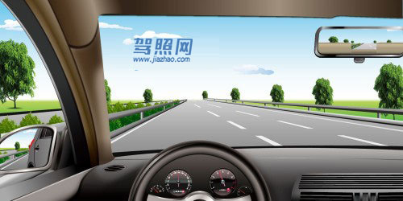

解析：《道路交通安全法实施条例》第七十八条：同方向有2条车道的，左侧车道的最低车速为每小时100公里；同方向有3条以上车道的，最左侧车道的最低车速为每小时110公里，中间车道的最低车速为每小时90公里。道路限速标志标明的车速与上述车道行驶车速的规定不一致的，技照道路限速标志标明的车速行驶。

## 424. 如图所示，在高速公路同方向两条机动车道左侧车道行驶，应保持什么车速?

题号：424 · 章节：全部题目、第1章：道路交通安全法律、法规和规章 · [原题](https://www.aijiaxiao.com/tiba/424/)

- A、110公里/小时～130公里/小时
- B、100 公里/小时～120公里/小时
- C、90 公里/小时～110公里/小时
- D、60 公里/小时～120公里/小时

**答案：B**

解析：《道路交通安全法实施条例》第七十八条：同方向有2条车道的，左侧车道的最低车速为每小时100公里；同方向有3条以上车道的，最左侧车道的最低车速为每小时110公里，中间车道的最低车速为每小时90公里。道路限速标志标明的车速与上述车道行驶车速的规定不一致的，技照道路限速标志标明的车速行驶。

## 425. 如图所示，在高速公路同方向三条机动车道中间车道行驶，车速不能低于多少?

题号：425 · 章节：全部题目、第1章：道路交通安全法律、法规和规章 · [原题](https://www.aijiaxiao.com/tiba/425/)

- A、100公里/小时
- B、90公里/小时
- C、110公里/小时
- D、60公里/小时

**答案：B**

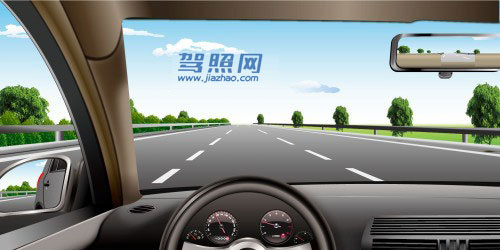

解析：《道路交通安全法实施条例》第七十八条：同方向有2条车道的，左侧车道的最低车速为每小时100公里；同方向有3条以上车道的，最左侧车道的最低车速为每小时110公里，中间车道的最低车速为每小时90公里。道路限速标志标明的车速与上述车道行驶车速的规定不一致的，技照道路限速标志标明的车速行驶。

## 426. 如图所示，在高速公路同方向三条机动车道右侧车道行驶，车速不能低于多少?

题号：426 · 章节：全部题目、第1章：道路交通安全法律、法规和规章 · [原题](https://www.aijiaxiao.com/tiba/426/)

- A、80公里/小时
- B、100公里/小时
- C、110公里/小时
- D、60 公里/小时

**答案：D**

解析：《道路交通安全法实施条例》第七十八条:高速公路应当标明车道的行驶速度，最高车速不得超过每小时120公里，最低车速不得低于每小时60公里。

## 427. 如图所示，当您车速为95km/h时，您可以在哪条车道内行驶?

题号：427 · 章节：全部题目、第1章：道路交通安全法律、法规和规章 · [原题](https://www.aijiaxiao.com/tiba/427/)

- A、车道A
- B、车道B
- C、车道C
- D、车道D

**答案：B**

解析：如图所示，道路限速标志标明车道B最高限速100KM/h，所以选择车道B。同方向3条车道的，最左侧车速为每小时110公里，中间车道最低车速为90公里。道路限速标志标明车速的车速与上述车道行驶车速规定不一样的，按照道路限速标志标明的车速行驶。

## 428. 如图所示，在这种情况下，您应该轻踩制动踏板减速。

题号：428 · 章节：全部题目、第1章：道路交通安全法律、法规和规章 · [原题](https://www.aijiaxiao.com/tiba/428/)

- A、正确
- B、错误

**答案：A**

解析：如图所示，前方道路限速60公里，当车速大于或等于限速时需要踩制动踏板减速。

## 429. 夜间会车规定150米以内使用近光灯的原因是什么?

题号：429 · 章节：全部题目、第1章：道路交通安全法律、法规和规章 · [原题](https://www.aijiaxiao.com/tiba/429/)

- A、驾驶人的操作习惯行为
- B、使用远光灯会造成驾驶人出现眩目，易引发危险
- C、两车之间相互提示
- D、提示后方车辆

**答案：B**

解析：在夜间会车时开远光灯，容易造成对方驾驶员10米左右出现盲区，这种视线受阻一般可持续四五秒，而这四五秒极有可能酿成车祸。冬天冰雪路面光滑，会车时如果再开远光灯更容易造成事故。

## 430. 在狭窄的山路会车，规定不靠山体的一方优先行驶的原因是什么?

题号：430 · 章节：全部题目、第1章：道路交通安全法律、法规和规章 · [原题](https://www.aijiaxiao.com/tiba/430/)

- A、靠山体的一方相对安全
- B、不靠山体的一方车速较快
- C、靠山体的一方视野宽阔
- D、B和C都正确

**答案：A**

解析：不靠山体的一方是悬崖，更危险，所以先行。反过来靠山体的一方是相对安全的。

## 431. 为什么规定辅路车让主路车先行?

题号：431 · 章节：全部题目、第1章：道路交通安全法律、法规和规章 · [原题](https://www.aijiaxiao.com/tiba/431/)

- A、主路车流量大、速度快
- B、辅路车便于观察
- C、主路车流量小、速度快
- D、辅路车速度快

**答案：A**

解析：正因为车流最大才成为主路的吧，所以别犹豫，选“主路车流最大、速度快”。

## 432. 如图所示，在这种情形下，对方车辆具有先行权。

题号：432 · 章节：全部题目、第1章：道路交通安全法律、法规和规章 · [原题](https://www.aijiaxiao.com/tiba/432/)

- A、正确
- B、错误

**答案：A**

解析：有障碍的让无障碍的一方先行；但有障碍的一方已经驶入有障碍路段而无障碍一方未驶入的，有障碍的一方先行。本题中，本车前方有障碍，且未进入障碍路段，对方先行。

## 433. 如图所示，当您超越右侧车辆时，应该尽快超越，减少并行时间。

题号：433 · 章节：全部题目、第1章：道路交通安全法律、法规和规章 · [原题](https://www.aijiaxiao.com/tiba/433/)

- A、正确
- B、错误

**答案：A**

解析：超车时应尽且提高辆车速度差，以减少超车距离和时间。超越时间加长，危险性也会增大；并行容易引起车祸。

## 434. 如图所示，在这种情况下，会车时必须减速靠右通过。

题号：434 · 章节：全部题目、第1章：道路交通安全法律、法规和规章 · [原题](https://www.aijiaxiao.com/tiba/434/)

- A、正确
- B、错误

**答案：A**

解析：会车时减速靠右行驶是常识。

## 435. 在划有道路中心线的道路上会车时，应做到保持安全车速、不越线行驶。

题号：435 · 章节：全部题目、第1章：道路交通安全法律、法规和规章 · [原题](https://www.aijiaxiao.com/tiba/435/)

- A、正确
- B、错误

**答案：A**

解析：会车时要放慢车速，临近交会时条件不良，更应控制车速，不能盲目交会，必要时应该先停车，以达到两车顺利交会的目的。

## 436. 如图所示，直行车辆遇到前方路口堵塞，以下说法正确的是什么?

题号：436 · 章节：全部题目、第1章：道路交通安全法律、法规和规章 · [原题](https://www.aijiaxiao.com/tiba/436/)

- A、可以直接驶入路口内等待通行
- B、等前方道路疏通后，且信号灯为绿灯时方可继续行驶
- C、只要信号灯为绿灯，就可通过
- D、等有其他机动车进入路口时跟随行驶

**答案：B**

解析：《道路交通安全法实施条例》第五十三条：机动车遇有前方交叉路口交通阻塞时，应当依次停在路口以外等候，不得进入路口。

## 437. 如图所示，车辆在拥挤路段排队行驶时，遇有其他车辆强行穿插行驶，以下说法正确的是什么?

题号：437 · 章节：全部题目、第1章：道路交通安全法律、法规和规章 · [原题](https://www.aijiaxiao.com/tiba/437/)

- A、迅速提高车速不让其穿插
- B、持续鸣喇叭警告
- C、迅速左转躲避
- D、减速或停车让行

**答案：D**

解析：减速停车让行，文明才是王道。

## 438. 遇前方路段车道减少，车辆行驶缓慢，为保证安全有序应该怎样做?

题号：438 · 章节：全部题目、第1章：道路交通安全法律、法规和规章 · [原题](https://www.aijiaxiao.com/tiba/438/)

- A、依次交替通行
- B、穿插到前方排队车辆中通过
- C、加速从前车左右超越
- D、借对向车道迅速通过

**答案：A**

解析：《道路交通安全法实施条例》第五十三条：机动车在车道减少的路口、路段，遇有前方机动车停车排队等候或者缓慢行驶的，应当每车道一辆依次交替驶入车道减少后的路口、路段。

## 439. 遇前方路段车道减少，车辆行驶缓慢，为保证道路通畅，应借对向车道迅速通过。

题号：439 · 章节：全部题目、第1章：道路交通安全法律、法规和规章 · [原题](https://www.aijiaxiao.com/tiba/439/)

- A、正确
- B、错误

**答案：B**

解析：《道路交通安全法实施条例》第五十三条：机动车在车道减少的路口、路段，遇有前方机动车停车排队等候或者缓慢行驶的，应当每车道一辆依次交替驶入车道减少后的路口、路段。

## 440. 如图所示，驾驶机动车遇到没有行人通过的人行横道时不用减速慢行。

题号：440 · 章节：全部题目、第1章：道路交通安全法律、法规和规章 · [原题](https://www.aijiaxiao.com/tiba/440/)

- A、正确
- B、错误

**答案：B**

解析：按规定，驾驶机动车遇到人行横道必须减速让行，必要时停车让行。行人的流动很随意，需要谨慎减速慢行。

## 441. 如图所示，当越过停在人行横道前的A车时，B车应减速，准备停车让行。

题号：441 · 章节：全部题目、第1章：道路交通安全法律、法规和规章 · [原题](https://www.aijiaxiao.com/tiba/441/)

- A、正确
- B、错误

**答案：A**

解析：如图所示，红车B前方是人行横道，应当减速行驶，当B车越过A车后，若有行人通过，必要时停车让行。

## 442. 如图所示，机动车遇行人正在通过人行横道时，要停车让行，是因为行人享有优先通行权。

题号：442 · 章节：全部题目、第1章：道路交通安全法律、法规和规章 · [原题](https://www.aijiaxiao.com/tiba/442/)

- A、正确
- B、错误

**答案：A**

解析：《道路交通安全法》第四十七条：机动车行经人行横道时，应当减速行驶；遇行人正在通过人行横道，应当停车让行。机动车行经没有交通信号的道路时，遇行人横过道路，应当避让。

## 443. 如图所示，驾驶机动车遇到这种情况能够加速通过，是因为人行横道没有行人通过。

题号：443 · 章节：全部题目、第1章：道路交通安全法律、法规和规章 · [原题](https://www.aijiaxiao.com/tiba/443/)

- A、正确
- B、错误

**答案：B**

解析：按规定，驾驶机动车遇到人行横道时必须减速让行，必要时需要停车让行。因为行人有很大的随意性，需要谨慎减速慢行。

## 444. 如图所示，在这种情况下，驾驶机动车要停车让行。

题号：444 · 章节：全部题目、第1章：道路交通安全法律、法规和规章 · [原题](https://www.aijiaxiao.com/tiba/444/)

- A、正确
- B、错误

**答案：A**

解析：人行横道是生命的保护线，人行横道正有行人通行，要停车让行，这体现对生命的尊重！

## 445. 在没有交通信号指示的交叉路口，转弯的机动车让直行的车辆和行人先行。

题号：445 · 章节：全部题目、第1章：道路交通安全法律、法规和规章 · [原题](https://www.aijiaxiao.com/tiba/445/)

- A、正确
- B、错误

**答案：A**

解析：右转让左转，转弯让直行。

## 446. 行至漫水路时，应当怎样做?

题号：446 · 章节：全部题目、第1章：道路交通安全法律、法规和规章 · [原题](https://www.aijiaxiao.com/tiba/446/)

- A、空挡滑行
- B、低速通过涉水路段
- C、高速通过，减少涉水时间
- D、高挡位低速通过

**答案：B**

解析：《道路交通安全法实施条例》第六十四条：机动车行经漫水路或者漫水桥时，应当停车察明水情，确认安全后，低速通过。

## 447. 在涉水路段跟车行驶时，应当怎样做?

题号：447 · 章节：全部题目、第1章：道路交通安全法律、法规和规章 · [原题](https://www.aijiaxiao.com/tiba/447/)

- A、紧跟其后
- B、并行通过
- C、适当增加车距
- D、超越前车，抢先通过

**答案：C**

解析：适当增加车距才是安全文明的做法，大家懂的。

## 448. 通过漫水路时要谨慎慢行，不得空挡滑行。

题号：448 · 章节：全部题目、第1章：道路交通安全法律、法规和规章 · [原题](https://www.aijiaxiao.com/tiba/448/)

- A、正确
- B、错误

**答案：A**

解析：机动车行经漫水桥路段时，应当停车察明水情，确认安全后，低速通过。

## 449. 如图所示，在这种情况下遇到红灯交替闪烁时，要尽快通过道口。

题号：449 · 章节：全部题目、第1章：道路交通安全法律、法规和规章 · [原题](https://www.aijiaxiao.com/tiba/449/)

- A、正确
- B、错误

**答案：B**

解析：红灯停。

## 450. 如图所示，铁路道口设置这个标志，是提示驾驶人前方路口有单股铁道。

题号：450 · 章节：全部题目、第1章：道路交通安全法律、法规和规章 · [原题](https://www.aijiaxiao.com/tiba/450/)

- A、正确
- B、错误

**答案：B**

解析：叉行符号：多股铁路与道路相交。

## 451. 如图所示，这个标志设置在有人看守的铁路道口，提示驾驶人距有人看守的铁路道口的距离还有100米。

题号：451 · 章节：全部题目、第1章：道路交通安全法律、法规和规章 · [原题](https://www.aijiaxiao.com/tiba/451/)

- A、正确
- B、错误

**答案：B**

解析：火车表示无人看守，栅栏表示有人看管！一条红杠杠表示50米，以此类推两条100米、无人看守！

## 452. 如图所示，在这种情况下准备进入环形路口时，为了保证车后车流的通畅，应加速超越红车进入路口。

题号：452 · 章节：全部题目、第1章：道路交通安全法律、法规和规章 · [原题](https://www.aijiaxiao.com/tiba/452/)

- A、正确
- B、错误

**答案：B**

解析：准备进入环形路口的让已在路口内的机动车先行。

## 453. 人行横道上禁止掉头的原因是什么?

题号：453 · 章节：全部题目、第1章：道路交通安全法律、法规和规章 · [原题](https://www.aijiaxiao.com/tiba/453/)

- A、路段有监控设备
- B、人行横道禁止停车
- C、人行横道禁止车辆通行
- D、避免妨碍行人正常通行，确保行人安全

**答案：D**

解析：人行横道禁止掉头。虽然设有交通隔离护栏路段的人行横道不设禁止掉头交通标志，但规定严禁在人行横道掉头，这主要是为了保护人行横道上行人的安全。因为行人具有优先通行权，人行横道就视同“禁止性标志”。

## 454. 如图所示，铁路道口禁止掉头的原因是什么?

题号：454 · 章节：全部题目、第1章：道路交通安全法律、法规和规章 · [原题](https://www.aijiaxiao.com/tiba/454/)

- A、有铁路道口标志
- B、有铁路道口信号灯
- C、铁路道口车流量大
- D、容易引发事故

**答案：D**

解析：铁道路口行车条件比较复杂，掉头容易引发事故。

## 455. 交叉路口不得倒车的原因是什么?

题号：455 · 章节：全部题目、第1章：道路交通安全法律、法规和规章 · [原题](https://www.aijiaxiao.com/tiba/455/)

- A、交通情况复杂，容易造成交通堵塞甚至引发事故
- B、交通监控设备多
- C、交通警察多
- D、车道数量少

**答案：A**

解析：交叉路口车流最多，情况很复杂，极易造车拥堵，易发事故，当然是不允许倒车的。

## 456. 在以下路段不能倒车的是什么?

题号：456 · 章节：全部题目、第1章：道路交通安全法律、法规和规章 · [原题](https://www.aijiaxiao.com/tiba/456/)

- A、交叉路口
- B、隧道
- C、急弯
- D、以上皆是

**答案：D**

解析：《道路交通安全法实施条例》第五十条机动车倒车时，应当察明车后情况，确认安全后倒车。不得在铁路道口、交叉路口、单行路、桥梁、急弯、陡坡或者隧道中倒车。

## 457. 如图所示，在前方路口可以掉头。

题号：457 · 章节：全部题目、第1章：道路交通安全法律、法规和规章 · [原题](https://www.aijiaxiao.com/tiba/457/)

- A、正确
- B、错误

**答案：B**

解析：如图所示，前方是铁道路口，根据法规，铁道路口不能掉头。

## 458. 如图所示，在这种情况下只要后方没有来车，可以倒车。

题号：458 · 章节：全部题目、第1章：道路交通安全法律、法规和规章 · [原题](https://www.aijiaxiao.com/tiba/458/)

- A、正确
- B、错误

**答案：B**

解析：箭头框子是矩形，表示单行路；单行道是不准倒车的。

## 459. 在后方无来车的情况下，在隧道中倒车应靠边行驶。

题号：459 · 章节：全部题目、第1章：道路交通安全法律、法规和规章 · [原题](https://www.aijiaxiao.com/tiba/459/)

- A、正确
- B、错误

**答案：B**

解析：隧道不允许倒车。

## 460. 如图所示，在这种情况下只要后方、对向无来车，可以掉头。

题号：460 · 章节：全部题目、第1章：道路交通安全法律、法规和规章 · [原题](https://www.aijiaxiao.com/tiba/460/)

- A、正确
- B、错误

**答案：B**

解析：黄色的实线是不能压的，掉头必须要穿过黄线，所以，有黄色的实线是不能掉头的。

## 461. 如图所示，这这种情况下只要后方、对向无来车，可以掉头。

题号：461 · 章节：全部题目、第1章：道路交通安全法律、法规和规章 · [原题](https://www.aijiaxiao.com/tiba/461/)

- A、正确
- B、错误

**答案：A**

解析：简单来说：黄线是用来画分来回车道的，黄实线是禁止越线行驶。黄虚线是在对面没车来的情况下，可以在黄虚线越过转弯或者是掉头。白实线是用来规分同方向车道的，实线是表示同方向行驶，不能越线到另一同方向车道行驶。白虚线是虚线同方向车道的，可以越线到另一同方向车道行驶。

## 462. 交通肇事致一人以上重伤，负事故全部或者主要责任，并具有下列哪种行为的，构成交通肇事罪?

题号：462 · 章节：全部题目、第1章：道路交通安全法律、法规和规章 · [原题](https://www.aijiaxiao.com/tiba/462/)

- A、未带驾驶证
- B、酒后、吸食毒品后驾驶机动车辆的
- C、未报警
- D、未抢救受伤人员

**答案：B**

解析：交通肇事致一人以上重伤，负事故全部或者主要责任，并具有下列情形之一的，以交通肇事罪定罪处罚：（一）酒后、吸食毒品后驾驶机动车辆的；（二）无驾驶资格驾驶机动车辆的；（三）明知是安全装置不全或者安全机件失灵的机动车辆而驾驶的；（四）明知是无牌证或者已报废的机动车辆而驾驶的；（五）严重超载驾驶的；（六）为逃避法律追究逃离事故现场的。由以上条例可知，本题应选择酒后、吸食毒品后驾驶机动车辆的行为。

## 463. 交通肇事致一人以上重伤，负事故全部或者主要责任，并具有下列哪种行为的，构成交通肇事罪?

题号：463 · 章节：全部题目、第1章：道路交通安全法律、法规和规章 · [原题](https://www.aijiaxiao.com/tiba/463/)

- A、未带驾驶证
- B、未报警
- C、无驾驶资格驾驶机动车辆的
- D、未抢救受伤人员

**答案：C**

解析：交通肇事致一人以上重伤，负事故全部或者主要责任，并具有下列情形之一的，以交通肇事罪定罪处罚：（一）酒后、吸食毒品后驾驶机动车辆的；（二）无驾驶资格驾驶机动车辆的；（三）明知是安全装置不全或者安全机件失灵的机动车辆而驾驶的；（四）明知是无牌证或者已报废的机动车辆而驾驶的；（五）严重超载驾驶的；（六）为逃避法律追究逃离事故现场的。由以上条例可知，本题应选择无驾驶资格驾驶机动车辆的行为。

## 464. 交通肇事致一人以上重伤，负事故全部或者主要责任，并具有下列哪种行为的，构成交通肇事罪?

题号：464 · 章节：全部题目、第1章：道路交通安全法律、法规和规章 · [原题](https://www.aijiaxiao.com/tiba/464/)

- A、未带驾驶证
- B、未及时报警
- C、严重超载驾驶的
- D、未抢救受伤人员

**答案：C**

解析：交通肇事致一人以上重伤，负事故全部或者主要责任，并具有下列情形之一的，以交通肇事罪定罪处罚：（一）酒后、吸食毒品后驾驶机动车辆的；（二）无驾驶资格驾驶机动车辆的；（三）明知是安全装置不全或者安全机件失灵的机动车辆而驾驶的；（四）明知是无牌证或者已报废的机动车辆而驾驶的；（五）严重超载驾驶的；（六）为逃避法律追究逃离事故现场的。由以上条例可知，本题应选择严重超载的行为。

## 465. 交通肇事致一人以上重伤，负事故全部或者主要责任，并具有下列哪种行为的，构成交通肇事罪?

题号：465 · 章节：全部题目、第1章：道路交通安全法律、法规和规章 · [原题](https://www.aijiaxiao.com/tiba/465/)

- A、未带驾驶证
- B、未报警
- C、为逃避法律追究逃离事故现场的
- D、未抢救受伤人员

**答案：C**

解析：交通肇事致一人以上重伤，负事故全部或者主要责任，并具有下列情形之一的，以交通肇事罪定罪处罚：（一）酒后、吸食毒品后驾驶机动车辆的；（二）无驾驶资格驾驶机动车辆的；（三）明知是安全装置不全或者安全机件失灵的机动车辆而驾驶的；（四）明知是无牌证或者已报废的机动车辆而驾驶的；（五）严重超载驾驶的；（六）为逃避法律追究逃离事故现场的。由以上条例可知，本题应选择为逃避法律追究而逃离事故现场的行为。

## 466. 年龄在60周岁以上，在一个记分周期结束后一年内未提交身体条件证明的，其机动车驾驶证将会被车辆管理所注销。

题号：466 · 章节：全部题目、第1章：道路交通安全法律、法规和规章 · [原题](https://www.aijiaxiao.com/tiba/466/)

- A、正确
- B、错误

**答案：A**

解析：根据《机动车驾驶证申领和使用规定》第42条第6项：年龄在60周岁以上，在一个记分周期结束后一年内未提交身体条件证明的；或者持有大型客车、牵引车、城市公交车、中型客车、大型货车、无轨电车、有轨电车准驾车型，在两个记分周期结束后一年内未提交身体条件证明的；或者持有残疾人专用小型自动挡载客汽车准驾车型，在三个记分周期结束后一年内未提交身体条件证明的，车辆管理所应当注销其机动车驾驶证。被注销机动车驾驶证未超过两年的，机动车驾驶人考试科目一合格后，可以恢复驾驶资格。

## 467. 持有大型客车、牵引车、城市公交车、中型客车、大型货车驾驶证的驾驶人从业单位等信息发生变化的，应当在信息变更后三十日内，向驾驶证核发地车辆管理所备案。

题号：467 · 章节：全部题目、第1章：道路交通安全法律、法规和规章 · [原题](https://www.aijiaxiao.com/tiba/467/)

- A、正确
- B、错误

**答案：A**

解析：公安部123号令规定：“机动车驾驶人联系电话、联系地址等信息发生变化，以及持有大型客车、牵引车、城市公交车、中型客车、大型货车准驾车型驾驶证的驾驶人从业单位等信息发生变化，应在信息变更后三十日内，向驾驶证核发地车辆管理所备案”。

## 468. 持有小型汽车驾驶证的驾驶人，发生交通事故造成人员死亡承担同等以上责任未被吊销机动车驾驶证的，应当在本记分周期结束后三十日内到公安机关交通管理部门接受审验，同时应当申报身体条件情况。

题号：468 · 章节：全部题目、第1章：道路交通安全法律、法规和规章 · [原题](https://www.aijiaxiao.com/tiba/468/)

- A、正确
- B、错误

**答案：A**

解析：《公安部令第123号》第六十条持有本条第三款规定以外准驾车型驾驶证的驾驶人，发生交通事故造成人员死亡承担同等以上责任未被吊销机动车驾驶证的，应当在本记分周期结束后三十日内到公安机关交通管理部门接受审验。

## 469. 发动机号码、车辆识别代号因磨损、锈蚀、事故等原因辨认不清或者损坏的，可以向登记地车辆管理所申请备案。

题号：469 · 章节：全部题目、第1章：道路交通安全法律、法规和规章 · [原题](https://www.aijiaxiao.com/tiba/469/)

- A、正确
- B、错误

**答案：A**

解析：《机动车登记规定》：发动机号码、车辆识别代号因磨损、锈蚀、事故等原因辨认不清或者损坏的，可以向登记地车辆管理所申请备案。

## 470. 机动车登记证书丢失后应及时补办，避免被不法分子利用。

题号：470 · 章节：全部题目、第1章：道路交通安全法律、法规和规章 · [原题](https://www.aijiaxiao.com/tiba/470/)

- A、正确
- B、错误

**答案：A**

解析：机动车登记证书丢失后应尽快补办，是正确的。

## 471. 驾驶机动车发生交通事故未造成人身伤亡的，责任明确双方无争议时，应当如何处置？

题号：471 · 章节：全部题目、第1章：道路交通安全法律、法规和规章 · [原题](https://www.aijiaxiao.com/tiba/471/)

- A、保护好现场再协商
- B、不要移动车辆
- C、疏导其他车辆绕行
- D、撤离现场自行协商

**答案：D**

解析：《中华人民共和国道路交通安全法》第七十条明确规定在道路上发生交通事故，未造成人身伤亡，当事人对事实及成因无争议的，可以即行撤离现场，恢复交通，自行协商处理损害赔偿事宜；不即行撤离现场的，应当迅速报告执勤的交通警察或者公安机关交通管理部门。

## 472. 驾驶机动车发生交通事故后当事人故意破坏、伪造现场、毁灭证据的，应当承担什么责任？

题号：472 · 章节：全部题目、第1章：道路交通安全法律、法规和规章 · [原题](https://www.aijiaxiao.com/tiba/472/)

- A、主要责任
- B、次要责任
- C、同等责任
- D、全部责任

**答案：D**

解析：发生交通事故后当事人逃逸的，故意破坏、伪造现场、毁灭证据的，均承担全部责任。

## 473. 非机动车驾驶人、行人故意碰撞机动车造成交通事故的，机动车一方不承担赔偿责任。

题号：473 · 章节：全部题目、第1章：道路交通安全法律、法规和规章 · [原题](https://www.aijiaxiao.com/tiba/473/)

- A、正确
- B、错误

**答案：A**

解析：《中华人民共和国道路交通安全法》第七十六条明确规定交通事故的损失是由非机动车驾驶人、行人故意碰撞机动车造成的，机动车一方不承担赔偿责任。

## 474. 如图所示，红圈中标记车辆使用灯光的方法是正确的。

题号：474 · 章节：全部题目、第1章：道路交通安全法律、法规和规章 · [原题](https://www.aijiaxiao.com/tiba/474/)

- A、正确
- B、错误

**答案：B**

解析：《中华人民共和国道路交通安全法》第四十八条规定：在没有中心隔离设施或者没有中心线的道路上，夜间会车应当在距相对方向来车150米以外改用近光灯。

## 475. 驾驶机动车超车时，可以鸣喇叭替代开启转向灯。

题号：475 · 章节：全部题目、第1章：道路交通安全法律、法规和规章 · [原题](https://www.aijiaxiao.com/tiba/475/)

- A、正确
- B、错误

**答案：B**

解析：机动车超车时，应当提前开启左转向灯、变换使用远、近光灯。

## 476. 驾驶机动车变更车道时，以下做法正确的是什么？

题号：476 · 章节：全部题目、第1章：道路交通安全法律、法规和规章 · [原题](https://www.aijiaxiao.com/tiba/476/)

- A、开启转向灯的同时变更车道
- B、在道路同方向划有2条以上机动车道的，不得影响相关车道内行驶的机动车的正常行驶
- C、在车辆较少路段，可以随意变更车道
- D、遇前方道路拥堵，可以向应急车道变更

**答案：B**

解析：驾驶机动车变更车道时，在道路同方向划有2条以上机动车道的，不得影响相关车道内行驶的机动车的正常行驶。

## 477. 驾驶机动车应在变更车道的同时开启转向灯。

题号：477 · 章节：全部题目、第1章：道路交通安全法律、法规和规章 · [原题](https://www.aijiaxiao.com/tiba/477/)

- A、正确
- B、错误

**答案：B**

解析：机动车超车时，应当提前开启左转向灯、变换使用远、近光灯或者鸣喇叭。

## 478. 如图所示，A车可以从左侧超越B车。

题号：478 · 章节：全部题目、第1章：道路交通安全法律、法规和规章 · [原题](https://www.aijiaxiao.com/tiba/478/)

- A、正确
- B、错误

**答案：B**

解析：B车的左边为实线，B车不能压过实线超车。

## 479. 如图所示，驾驶机动车行驶至桥梁涵洞时，以下做法正确的是什么？

题号：479 · 章节：全部题目、第1章：道路交通安全法律、法规和规章 · [原题](https://www.aijiaxiao.com/tiba/479/)

- A、加速，在对向车到达前通过
- B、减速靠右通过
- C、保持原速继续正常行驶
- D、鸣喇叭后加速通过

**答案：B**

解析：驾驶机动车行驶至桥梁涵洞时，做法正确的是：减速靠右通过。

## 480. 如图所示，驾驶机动车遇到这种情况，以下做法正确的是什么？

题号：480 · 章节：全部题目、第1章：道路交通安全法律、法规和规章 · [原题](https://www.aijiaxiao.com/tiba/480/)

- A、减速慢行、鸣喇叭示意
- B、为拓宽视野，临时占用左侧车道行驶
- C、加速行驶
- D、停车观察

**答案：A**

解析：驾驶机动车遇到这种情况，应该：减速慢行、鸣喇叭示意。

## 481. 驾驶机动车在隧道内行驶时，可以临时停车。

题号：481 · 章节：全部题目、第1章：道路交通安全法律、法规和规章 · [原题](https://www.aijiaxiao.com/tiba/481/)

- A、正确
- B、错误

**答案：B**

解析：机动车在交叉路口、铁路道口、急弯路、宽度不足4米的窄路、桥梁、陡坡、隧道以及距离上述地点50米以内的路段，不得停车。

## 482. 发生交通事故后，当事人故意破坏、伪造现场、毁灭证据的，承担全部责任。

题号：482 · 章节：全部题目、第1章：道路交通安全法律、法规和规章 · [原题](https://www.aijiaxiao.com/tiba/482/)

- A、正确
- B、错误

**答案：A**

解析：发生交通事故后当事人逃逸的，故意破坏、伪造现场、毁灭证据的，均承担全部责任。

## 483. 机动车驾驶证补领后，以下说法正确的是什么？

题号：483 · 章节：全部题目、第1章：道路交通安全法律、法规和规章 · [原题](https://www.aijiaxiao.com/tiba/483/)

- A、原驾驶证继续使用
- B、原驾驶证作废，不得继续使用
- C、原驾驶证特殊情况下使用
- D、替换使用

**答案：B**

解析：《机动车驾驶证申领和使用规定》机动车驾驶人补领机动车驾驶证后，原机动车驾驶证作废，不得继续使用。

## 484. 机动车驾驶人补领机动车驾驶证后，原机动车驾驶证作废，不得继续使用。

题号：484 · 章节：全部题目、第1章：道路交通安全法律、法规和规章 · [原题](https://www.aijiaxiao.com/tiba/484/)

- A、正确
- B、错误

**答案：A**

解析：《机动车驾驶证申领和使用规定》机动车驾驶人补领机动车驾驶证后，原机动车驾驶证作废，不得继续使用。

## 485. 超过机动车驾驶证有效期一年以上未换证被注销，但未超过2年的，机动车驾驶人应当如何恢复驾驶资格？

题号：485 · 章节：全部题目、第1章：道路交通安全法律、法规和规章 · [原题](https://www.aijiaxiao.com/tiba/485/)

- A、参加道路交通安全法律、法规和相关知识考试合格后
- B、参加场地考试合格后
- C、参加道路驾驶技能考试合格后
- D、参加安全文明驾驶常识考试合格后

**答案：A**

解析：《机动车驾驶证申领和使用规定》被注销机动车驾驶证未超过两年的，机动车驾驶人考试科目一合格后，可以恢复驾驶资格。

## 486. 已注册登记的机动车达到国家规定的强制报废标准的，应当向登记地车辆管理所申请注销登记。

题号：486 · 章节：全部题目、第1章：道路交通安全法律、法规和规章 · [原题](https://www.aijiaxiao.com/tiba/486/)

- A、正确
- B、错误

**答案：A**

解析：《中华人民共和国道路交通安全法》第二章第十四条规定:应当报废的机动车必须及时办理注销登记。达到报废标准的机动车不得上道路行驶。报废的大型客、货车及其他营运车辆应当在公安机关交通管理部门的监督下解体。

## 487. 存在以下哪种行为的申请人在一年内不得再次申领机动车驾驶证？

题号：487 · 章节：全部题目、第1章：道路交通安全法律、法规和规章 · [原题](https://www.aijiaxiao.com/tiba/487/)

- A、在考试过程中出现身体不适
- B、在考试过程中有舞弊行为
- C、不能按照教学大纲认真练习驾驶技能
- D、未参加理论培训

**答案：B**

解析：《机动车驾驶证申领和使用规定》第六章，法律责任，第七十八条，隐瞒有关情况或者提供虚假材料申领机动车驾驶证的，申请人在一年内不得再次申领机动车驾驶证。申请人在考试过程中有贿赂、舞弊行为的，取消考试资格，已经通过考试的其他科目成绩无效；申请人在一年内不得再次申领机动车驾驶证。

## 488. 驾驶人在核发地车辆管理所管辖区以外居住的，可以向居住地车辆管理所申请换证。

题号：488 · 章节：全部题目、第1章：道路交通安全法律、法规和规章 · [原题](https://www.aijiaxiao.com/tiba/488/)

- A、正确
- B、错误

**答案：A**

解析：《公安部令第123号》第四十九条：机动车驾驶人户籍迁出原车辆管理所管辖区的，应当向迁入地车辆管理所申请换证。机动车驾驶人在核发地车辆管理所管辖区以外居住的，可以向居住地车辆管理所申请换证。申请时应当填写申请表，并提交第四十八条：规定的证明、凭证。

## 489. 持有大型客车、牵引车、城市公交车、中型客车、大型货车驾驶证的驾驶人，记分周期内有记分的，应当在记分周期结束后三十日内到公安机关交通管理部门接受审验，同时还应当申报身体条件情况。

题号：489 · 章节：全部题目、第1章：道路交通安全法律、法规和规章 · [原题](https://www.aijiaxiao.com/tiba/489/)

- A、正确
- B、错误

**答案：A**

解析：《公安部令第123号》第六十条：持有大型客车、牵引车、城市公交车、中型客车、大型货车驾驶证的驾驶人，应当在每个记分周期结束后三十日内到公安机关交通管理部门接受审验。但在一个记分周期内没有记分记录的，免予本记分周期审验。

## 490. 如图所示，夜间驾驶机动车遇对方使用远光灯，无法看清前方路况时，以下做法正确的是什么？

题号：490 · 章节：全部题目、第1章：道路交通安全法律、法规和规章 · [原题](https://www.aijiaxiao.com/tiba/490/)

- A、保持行驶方向和车速不变
- B、自己也打开远光灯行驶
- C、降低车速，谨慎会车
- D、加速通过，尽快摆脱眩目光线

**答案：C**

解析：夜间驾驶机动车遇对方使用远光灯，无法看清前方路况时，降低车速，谨慎会车，以免发生车祸、危险。

## 491. 如图所示，驾驶机动车经过这种道路时，如果前方没有其他交通参与者，可在道路上随意通行。

题号：491 · 章节：全部题目、第1章：道路交通安全法律、法规和规章 · [原题](https://www.aijiaxiao.com/tiba/491/)

- A、正确
- B、错误

**答案：B**

解析：驾驶机动车经过这种道路时，如果前方没有其他交通参与者，也不可在道路上随意通行，安全第一。

## 492. 如图所示，驾驶机动车直行遇前方道路堵塞时，车辆可以在黄色网格线区域临时停车等待，但不得在人行横道停车。

题号：492 · 章节：全部题目、第1章：道路交通安全法律、法规和规章 · [原题](https://www.aijiaxiao.com/tiba/492/)

- A、正确
- B、错误

**答案：B**

解析：驾驶机动车直行遇前方道路堵塞时，车辆不可在黄色网格线区域临时停车等待，也不可在人行横道停车。

## 493. 如图所示，驾驶机动车在路口遇到这种交通信号时，右转弯的车辆在不妨碍被放行的车辆、行人的情况下，可以通行。

题号：493 · 章节：全部题目、第1章：道路交通安全法律、法规和规章 · [原题](https://www.aijiaxiao.com/tiba/493/)

- A、正确
- B、错误

**答案：A**

解析：驾驶机动车在路口遇到这种交通信号时，右转弯的车辆在不妨碍被放行的车辆、行人的情况下，可以通行。

## 494. 如图所示，驾驶机动车遇到右侧车辆强行变道，应减速慢行，让右前方车辆顺利变道。

题号：494 · 章节：全部题目、第1章：道路交通安全法律、法规和规章 · [原题](https://www.aijiaxiao.com/tiba/494/)

- A、正确
- B、错误

**答案：A**

解析：驾驶机动车遇到右侧车辆强行变道，应减速慢行，让右前方车辆顺利变道。

## 495. 驾驶机动车行经漫水路或者漫水桥时，应当停车察明水情。

题号：495 · 章节：全部题目、第1章：道路交通安全法律、法规和规章 · [原题](https://www.aijiaxiao.com/tiba/495/)

- A、正确
- B、错误

**答案：A**

解析：机动车行经漫水路或者漫水桥时，应当停车察明水情，确认安全后，低速通过。

## 496. 如图所示，驾驶机动车遇到这种情况，以下做法正确的是什么？

题号：496 · 章节：全部题目、第1章：道路交通安全法律、法规和规章 · [原题](https://www.aijiaxiao.com/tiba/496/)

- A、长鸣喇叭催促行人快速通过
- B、开启远光灯警示行人有车辆驶近
- C、降低行驶速度，避让行人
- D、适当加速从行人前方绕行

**答案：C**

解析：驾驶机动车遇到图中这种情况，应当降低行驶速度，避让行人。

## 497. 当驾驶人的血液中酒精含量为100毫克/100毫升时，属于醉酒驾驶。

题号：497 · 章节：全部题目、第1章：道路交通安全法律、法规和规章 · [原题](https://www.aijiaxiao.com/tiba/497/)

- A、正确
- B、错误

**答案：A**

解析：醉酒驾驶是指车辆驾驶人员血液中的酒精含量大于或者等于80mg/100mL的驾驶行为。

## 498. 驾驶机动车在道路上发生交通事故，任何情况下都应标明现场位置后，先行撤离现场。

题号：498 · 章节：全部题目、第1章：道路交通安全法律、法规和规章 · [原题](https://www.aijiaxiao.com/tiba/498/)

- A、正确
- B、错误

**答案：B**

解析：因为根据交通安全法的规定，如果机动车在道路上面发生了事故，那么必须要马上停车保护现场，如果有人员伤亡的情况，驾驶人应该马上去抢救受伤人员。并且报告执勤的交警或交通管理部门。如果因为抢救伤员而而变动了现场的话，就要表明位置。路人或过往的车辆驾驶人或乘客都应该协助帮忙。如果在道路上发生交通事故，没有造成人员伤亡的，当事人没有对事故有任何争议的，可以撤离现场恢复交通次序，双方自行协商处理损害赔偿就行了。如果说有争议的话，那么不要撤离现场，需要马上报个相关的交警来处理。

## 499. 申请人有下列哪种行为，三年内不得再次申领机动车驾驶证？

题号：499 · 章节：全部题目、第1章：道路交通安全法律、法规和规章 · [原题](https://www.aijiaxiao.com/tiba/499/)

- A、实习期记满12分，注销驾驶证的
- B、申请人在考试过程中有舞弊行为的
- C、申请人以欺骗、贿赂等不正当手段取得机动车驾驶证的
- D、申请人未能在培训过程中认真练习的

**答案：C**

解析：《机动车驾驶证申领和使用规定》第十二条有下列情形之一的，不得申请机动车驾驶证:(一)有器质性心脏病、癫痫病、美尼尔氏症、眩晕症、癔病、震颤麻痹、精神病、痴呆以及影响肢体活动的神经系统疾病等妨碍安全驾驶疾病的;(二)三年内有吸食、注射毒品行为或者解除强制隔离戒毒措施未满三年，或者长期服用依赖性精神药品成瘾尚未戒除的;(三)造成交通事故后逃逸构成犯罪的;（四）申请人以欺骗、贿赂等不正当手段取得机动车驾驶证的；(五)醉酒驾驶营运机动车依法被吊销机动车驾驶证未满十年的。

## 500. 申请人患有精神病的，可以申领机动车驾驶证，但是在发病期间不得驾驶机动车。

题号：500 · 章节：全部题目、第1章：道路交通安全法律、法规和规章 · [原题](https://www.aijiaxiao.com/tiba/500/)

- A、正确
- B、错误

**答案：B**

解析：《机动车驾驶证申领和使用规定》第十二条有下列情形之一的，不得申请机动车驾驶证:(一)有器质性心脏病、癫痫病、美尼尔氏症、眩晕症、癔病、震颤麻痹、精神病、痴呆以及影响肢体活动的神经系统疾病等妨碍安全驾驶疾病的;(二)三年内有吸食、注射毒品行为或者解除强制隔离戒毒措施未满三年，或者长期服用依赖性精神药品成瘾尚未戒除的;(三)造成交通事故后逃逸构成犯罪的;（四）申请人以欺骗、贿赂等不正当手段取得机动车驾驶证的；(五)醉酒驾驶营运机动车依法被吊销机动车驾驶证未满十年的。

## 501. 在暂住地初次申领机动车驾驶证的，不能直接申领大型货车驾驶证。

题号：501 · 章节：全部题目、第1章：道路交通安全法律、法规和规章 · [原题](https://www.aijiaxiao.com/tiba/501/)

- A、正确
- B、错误

**答案：A**

解析：在暂住地初次申领机动车驾驶证的，可以申请准驾车型为小型汽车、小型自动挡汽车、低速载货汽车、三轮汽车、残疾人专用小型自动挡载客汽车、普通三轮摩托车、普通二轮摩托车、轻便摩托车的机动车驾驶证。

## 502. 机动车驾驶证有效期超过一年以上未换证的，驾驶证将被注销。

题号：502 · 章节：全部题目、第1章：道路交通安全法律、法规和规章 · [原题](https://www.aijiaxiao.com/tiba/502/)

- A、正确
- B、错误

**答案：A**

解析：《机动车驾驶证申领和使用规定》第四十二条机动车驾驶人具有下列情形之一的，车辆管理所应当注销其机动车驾驶证:(一)死亡的;(二)身体条件不适合驾驶机动车的;(三)提出注销申请的;(四)丧失民事行为能力，监护人提出注销申请的;(五)超过机动车驾驶证有效期一年以上未换证的。

## 503. 驾驶证审验内容不包括以下哪一项？

题号：503 · 章节：全部题目、第1章：道路交通安全法律、法规和规章 · [原题](https://www.aijiaxiao.com/tiba/503/)

- A、道路交通安全违法行为、交通事故处理情况
- B、身体条件情况
- C、道路交通安全违法行为记分及记满12分后参加学习和考试情况
- D、机动车检验情况

**答案：D**

解析：驾驶证审验内容包括：道路交通安全违法行为、交通事故处理情况；身体条件情况；道路交通安全违法行为记分及记满12分后参加学习和考试情况。

## 504. 驾驶机动车在道路上发生交通事故，当事人不能自行移动车辆的，应当保护现场并立即报警。

题号：504 · 章节：全部题目、第1章：道路交通安全法律、法规和规章 · [原题](https://www.aijiaxiao.com/tiba/504/)

- A、正确
- B、错误

**答案：A**

解析：《中华人民共和国道路交通安全法》中第七十条第一款规定，在道路上发生交通事故，车辆驾驶人应当立即停车，保护现场。也就是说，司机发生交通事故，不论损失大小，首先必须要停车，保护现场。然后根据损失的大小确定下一步应当做什么。

## 505. 在交叉路口、隧道内均不能倒车。

题号：505 · 章节：全部题目、第1章：道路交通安全法律、法规和规章 · [原题](https://www.aijiaxiao.com/tiba/505/)

- A、正确
- B、错误

**答案：A**

解析：根据交通法，机动车在交叉路口、隧道内均不能倒车。

## 506. 驾驶机动车发生以下交通事故，哪种情况适用自行协商解决？

题号：506 · 章节：全部题目、第1章：道路交通安全法律、法规和规章 · [原题](https://www.aijiaxiao.com/tiba/506/)

- A、对方饮酒的
- B、对事实及成因有争议的
- C、未造成人身伤亡，对事实及成因无争议的
- D、造成人身伤亡的

**答案：C**

解析：《中华人民共和国道路交通安全法实施条例》第八十六条规定:“机动车与机动车、机动车与非机动车在道路上发生未造成人身伤亡的交通事故，当事人对事实及成因无争议的，在记录交通事故的时间、地点、对方当事人的姓名和联系方式、机动车牌号、驾驶证号、保险凭证号、碰撞部位，并共同签名后，撤离现场，自行协商损害赔偿事宜。当事人对交通事故事实及成因有争议的，应当迅速报警。”

## 507. 夜间驾驶机动车在没有中心隔离设施或者没有中心线的道路上行驶，以下哪种情况下应当改用近光灯？

题号：507 · 章节：全部题目、第1章：道路交通安全法律、法规和规章 · [原题](https://www.aijiaxiao.com/tiba/507/)

- A、接近没有交通信号灯控制的交叉路口时
- B、与对向机动车会车时
- C、接近人行横道时
- D、城市道路照明条件不良时

**答案：B**

解析：记住，只有在没有路灯或者没有照明的情况下才能用远光灯，一般都用近光灯。窄路窄桥，你若用远光灯，会让对方完全看不清，掉到桥下去的。夜间驾驶机动车遇到对向来车未关闭远光灯时，变换使用远近光灯提示。

## 508. 如图所示，驾驶机动车遇前方车流行驶缓慢时，借用公交专用道超车是正确的。

题号：508 · 章节：全部题目、第1章：道路交通安全法律、法规和规章 · [原题](https://www.aijiaxiao.com/tiba/508/)

- A、正确
- B、错误

**答案：B**

解析：机动车不得借用公交专用道行驶或超车。

## 509. 如图所示，驾驶机动车行驶至车道减少的路段时，遇前方机动车排队等候或行驶缓慢时，以下做法正确的是什么？

题号：509 · 章节：全部题目、第1章：道路交通安全法律、法规和规章 · [原题](https://www.aijiaxiao.com/tiba/509/)

- A、右侧车让左侧车先行
- B、每车道一辆依次交替驶入左侧车道
- C、左侧车让右侧车先行
- D、右侧车寻找空隙提前进入左侧车道

**答案：B**

解析：驾驶机动车行驶至车道减少的路段时，前方机动车排队等候或行驶缓慢时，应当每车道一辆依次交替驶入左侧车道。

## 510. 机动车驾驶证遗失的，机动车驾驶人应当向哪里的车辆管理所申请补发？

题号：510 · 章节：全部题目、第1章：道路交通安全法律、法规和规章 · [原题](https://www.aijiaxiao.com/tiba/510/)

- A、核发地
- B、暂住地
- C、居住地
- D、户籍地

**答案：A**

解析：驾驶证遗失、损毁无法辨认时驾驶员应当向驾驶证核发地车辆管理所申请补发。

## 511. 机动车驾驶证被依法扣押、扣留、暂扣期间能否申请补发？

题号：511 · 章节：全部题目、第1章：道路交通安全法律、法规和规章 · [原题](https://www.aijiaxiao.com/tiba/511/)

- A、可以申请
- B、扣留期间可以临时申请
- C、暂扣期间可以临时申请
- D、不得申请补发

**答案：D**

解析：机动车驾驶证被依法扣押、扣留或者暂扣期间，机动车驾驶人不得申请补发。

## 512. 驾驶证丢失后,驾驶人可以继续驾驶机动车。

题号：512 · 章节：全部题目、第1章：道路交通安全法律、法规和规章 · [原题](https://www.aijiaxiao.com/tiba/512/)

- A、正确
- B、错误

**答案：B**

解析：驾驶证丢失后，驾驶人不可继续驾驶机动车，应该向核发地车辆管理所申请补发。

## 513. 已注册登记的机动车，改变机动车车身颜色的应到公安交通管理部门申请变更登记。

题号：513 · 章节：全部题目、第1章：道路交通安全法律、法规和规章 · [原题](https://www.aijiaxiao.com/tiba/513/)

- A、正确
- B、错误

**答案：A**

解析：《中华人民共和国道路运输条例》说明，已注册登记的机动车，改变机动车车身颜色的应到公安交通管理部门申请变更登记。

## 514. 如图所示，驾驶机动车经过这种道路时，应降低车速在道路中间通行。

题号：514 · 章节：全部题目、第1章：道路交通安全法律、法规和规章 · [原题](https://www.aijiaxiao.com/tiba/514/)

- A、正确
- B、错误

**答案：A**

解析：图中道路两侧都有行人，驾驶机动车经过这种道路时，需要降低车速在道路中间通行。

## 515. 如图所示，驾驶机动车遇到这种情况，可以轻按喇叭提醒前方非机动车和行人后方有来车。

题号：515 · 章节：全部题目、第1章：道路交通安全法律、法规和规章 · [原题](https://www.aijiaxiao.com/tiba/515/)

- A、正确
- B、错误

**答案：A**

解析：前方有行人和自行车，道路较窄，驾驶机动车遇到这种情况，可以轻按喇叭提醒前方非机动车和行人后方有来车，这样更加安全。

## 516. 驾驶机动车通过未设置交通信号灯的交叉路口时，下列说法错误的是什么？

题号：516 · 章节：全部题目、第1章：道路交通安全法律、法规和规章 · [原题](https://www.aijiaxiao.com/tiba/516/)

- A、转弯的机动车让直行的车辆、行人先行
- B、没有交通标志、标线控制时，在进入路口前停瞭望，让右方道路的来车先行
- C、相对方向行驶的右转弯机动车让左转弯的车辆先行
- D、相对方向行驶的左转弯机动车让右转弯的车辆先行

**答案：D**

解析：驾驶机动车通过未设置交通信号灯的交叉路口时，转弯的机动车应当让直行的车辆、行人先行；没有交通标志、标线控制时，在进入路口前停车瞭望，让右方道路的来车先行；相对方向行驶的右转弯机动车让左转弯的车辆先行。

## 517. 如图所示，驾驶机动车遇到这种情况时，以下做法正确的是什么？

题号：517 · 章节：全部题目、第1章：道路交通安全法律、法规和规章 · [原题](https://www.aijiaxiao.com/tiba/517/)

- A、应停车察明水情，确认安全后，低速通过
- B、应停车察明水情，确认安全后，快速通过
- C、应减速观察水情，然后加速行驶通过
- D、可随意通行

**答案：A**

解析：图中所示，河水已经漫过路面，驾驶机动车遇到这种情况时，应停车察明水情，确认安全后，低速通过；不可随意通行。

## 518. 以下哪项行为可构成危险驾驶罪？

题号：518 · 章节：全部题目、第1章：道路交通安全法律、法规和规章 · [原题](https://www.aijiaxiao.com/tiba/518/)

- A、闯红灯
- B、无证驾驶
- C、疲劳驾驶
- D、醉驾

**答案：D**

解析：危险驾驶罪是指在道路上醉酒驾驶机动车或者在道路上驾驶机动车追逐竞驶，情节恶劣的行为。

## 519. 机动车发生轻微财产损失的交通事故，对应当自行撤离现场而未撤离的，交通警察有权责令当事人撤离现场。

题号：519 · 章节：全部题目、第1章：道路交通安全法律、法规和规章 · [原题](https://www.aijiaxiao.com/tiba/519/)

- A、正确
- B、错误

**答案：A**

解析：《中华人民共和国道路交通安全法》中第七十条第二、三款规定，在道路上发生交通事故，未造成人身伤亡，当事人对事实及成因无争议的，可以即行撤离现场，恢复交通，自行协商处理损害赔偿事宜;不即行撤离现场的，应当迅速报告执勤的交通警察或者公安机关交通管理部门。在道路上发生交通事故，仅造成轻微财产损失，并且基本事实清楚的，当事人应当先撤离现场再进行协商处理。根据《中华人民共和国道路交通安全法》的有关规定精神，仅造成车物损失或者人体伤情轻微的交通事故，可由一名交通警察按照简易程序处理。

## 520. 实习期驾驶人驾驶机动车上高速公路行驶，以下做法正确的是什么？

题号：520 · 章节：全部题目、第1章：道路交通安全法律、法规和规章 · [原题](https://www.aijiaxiao.com/tiba/520/)

- A、任何情况下都不允许上高速
- B、不需要其他人员陪同
- C、需要持有相应或者更高准驾车型驾驶证三年以上的驾驶人陪同
- D、需要持有相应或者更高准驾车型驾驶证、同在实习期内的驾驶人陪同

**答案：C**

解析：相关法律规定，实习期驾驶人驾驶机动车上高速公路行驶，应当由持相应或者更高准驾车型驾驶证三年以上的驾驶人陪同。

## 521. 年龄在60周岁以上的机动车驾驶人，应当每年进行一次身体检查的目的是什么？

题号：521 · 章节：全部题目、第1章：道路交通安全法律、法规和规章 · [原题](https://www.aijiaxiao.com/tiba/521/)

- A、体现对老年人的关心
- B、例行程序仅供参考
- C、检查是否患有老年常见病
- D、检查是否患有妨碍安全驾驶的疾病

**答案：D**

解析：根据《机动车驾驶证申领使用规定》第四十八条规定年龄在60周岁以上或者持有大型客车、牵引车、城市公交车、中型客车、大型货车、无轨电车、有轨电车准驾车型的机动车驾驶人，应当每年进行一次身体检查，在记分周期结束后十五日内，提交县级或者部队团级以上医疗机构出具的有关身体条件的证明，检查是否患有妨碍安全驾驶的疾病。

## 522. 年龄在50周岁以上的机动车驾驶人，应当每年进行一次身体检查，并向公安机关交通管理部门申报身体条件情况。

题号：522 · 章节：全部题目、第1章：道路交通安全法律、法规和规章 · [原题](https://www.aijiaxiao.com/tiba/522/)

- A、正确
- B、错误

**答案：B**

解析：根据《机动车驾驶证申领使用规定》第四十八条规定年龄在60周岁以上或者持有大型客车、牵引车、城市公交车、中型客车、大型货车、无轨电车、有轨电车准驾车型的机动车驾驶人，应当每年进行一次身体检查，在记分周期结束后十五日内，提交县级或者部队团级以上医疗机构出具的有关身体条件的证明。

## 523. 机动车驾驶人联系电话、联系地址等信息发生变化，应当在信息变更后三十日内，向驾驶证核发地车辆管理所备案。

题号：523 · 章节：全部题目、第1章：道路交通安全法律、法规和规章 · [原题](https://www.aijiaxiao.com/tiba/523/)

- A、正确
- B、错误

**答案：A**

解析：持有大型客车、牵引车、城市公交车、中型客车、大型货车驾驶证的驾驶人联系电话、从业单位等信息发生变化未及时申报变更信息的，公安机关交通管理部门处二十元以上二百元以下罚款。机动车驾驶人联系电话、联系地址等信息发生变化，应当在信息变更后三十日内，向驾驶证核发地车辆管理所备案。

## 524. 持有大型客车、牵引车、城市公交车、中型客车、大型货车驾驶证的驾驶人联系电话、从业单位等信息发生变化未及时申报变更信息的，公安机关交通管理部门处二十元以上二百元以下罚款。

题号：524 · 章节：全部题目、第1章：道路交通安全法律、法规和规章 · [原题](https://www.aijiaxiao.com/tiba/524/)

- A、正确
- B、错误

**答案：A**

解析：持有大型客车、牵引车、城市公交车、中型客车、大型货车驾驶证的驾驶人联系电话、从业单位等信息发生变化未及时申报变更信息的，公安机关交通管理部门处二十元以上二百元以下罚款。机动车驾驶人联系电话、联系地址等信息发生变化，应当在信息变更后三十日内，向驾驶证核发地车辆管理所备案。

## 525. 机动车参加安全技术检验的主要目的是检查车辆各项性能系数，及时消除车辆安全隐患，减少事故发生。

题号：525 · 章节：全部题目、第1章：道路交通安全法律、法规和规章 · [原题](https://www.aijiaxiao.com/tiba/525/)

- A、正确
- B、错误

**答案：A**

解析：机动车参加安全技术检验的主要目的，都是为了降低交通安全隐患，减少交通事故。

## 526. 已注册登记的机动车，机动车所有人住所在车辆管理所管辖区域内迁移或者机动车所有人姓名（单位名称）、联系方式变更的，应当向登记地车辆管理所备案。

题号：526 · 章节：全部题目、第1章：道路交通安全法律、法规和规章 · [原题](https://www.aijiaxiao.com/tiba/526/)

- A、正确
- B、错误

**答案：A**

解析：修订后的《机动车登记规定》已经2008年4月21日公安部部长办公会议通过，自2008年10月1日起施行。第十七条规定：已注册登记的机动车，机动车所有人住所在车辆管理所管辖区域内迁移或者机动车所有人姓名(单位名称)、联系方式变更的，应当向登记地车辆管理所备案。

## 527. 驾驶机动车发生交通事故，仅造成财产损失的，但是对交通事故事实及成因有争议的，应当怎么处理？

题号：527 · 章节：全部题目、第1章：道路交通安全法律、法规和规章 · [原题](https://www.aijiaxiao.com/tiba/527/)

- A、迅速报警
- B、占道继续和对方争辩
- C、找中间人帮忙解决
- D、自行协商损害赔偿事宜

**答案：A**

解析：对于事故成因不明的交通事故，应及时报警。

## 528. 如图所示，驾驶机动车驶出这个路口时应当怎样使用灯光?

题号：528 · 章节：全部题目、第1章：道路交通安全法律、法规和规章 · [原题](https://www.aijiaxiao.com/tiba/528/)

- A、开启右转向灯
- B、开启危险报警闪光灯
- C、不用开启转向灯
- D、开启左转向灯

**答案：A**

解析：驶入开左转向灯，驶出开右转向灯。

## 529. 驾驶机动车在道路上掉头时，应当提前开启左转向灯。

题号：529 · 章节：全部题目、第1章：道路交通安全法律、法规和规章 · [原题](https://www.aijiaxiao.com/tiba/529/)

- A、正确
- B、错误

**答案：A**

解析：《中华人民共和国道路交通安全法实施条例》第五十七条机动车应当按照下列规定使用转向灯：（一）向左转弯、向左变更车道、准备超车、驶离停车地点或者掉头时，应当提前开启左转向灯；（二）向右转弯、向右变更车道、超车完毕驶回原车道、靠路边停车时，应当提前开启右转向灯。

## 530. 驾驶机动车在交叉路口前变更车道时，应在进入实线区后，开启转向灯，变更车道。

题号：530 · 章节：全部题目、第1章：道路交通安全法律、法规和规章 · [原题](https://www.aijiaxiao.com/tiba/530/)

- A、正确
- B、错误

**答案：B**

解析：在虚线区就要完成车道变更选择而并更车道要提前开启转向灯的，实线区才开转向灯就不能做到提前开启转向灯的要求了，而且实线区禁止变更车道。

## 531. 如图所示，A车具有优先通行权。

题号：531 · 章节：全部题目、第1章：道路交通安全法律、法规和规章 · [原题](https://www.aijiaxiao.com/tiba/531/)

- A、正确
- B、错误

**答案：A**

解析：直行先行，但若让A车等待B车，则时间更长，所以都是直行的情况下，A车先行。

## 532. 如图所示，驾驶机动车在路口前遇到这种情况时，A车具有优先通行权。

题号：532 · 章节：全部题目、第1章：道路交通安全法律、法规和规章 · [原题](https://www.aijiaxiao.com/tiba/532/)

- A、正确
- B、错误

**答案：A**

解析：直行优先。

## 533. 驾驶机动车遇前方交叉路口交通阻塞时，路口内无网状线的，可停在路口内等候。

题号：533 · 章节：全部题目、第1章：道路交通安全法律、法规和规章 · [原题](https://www.aijiaxiao.com/tiba/533/)

- A、正确
- B、错误

**答案：B**

解析：《中华人民共和国道路交通安全法实施条例》第五十三条：机动车遇有前方交叉路口交通阻塞时，应当依次停在路口以外等候，不得进入路口。

## 534. 驾驶机动车在高速公路上行驶，错过出口时，如果确认后方无来车，可以倒回出口驶离高速公路。

题号：534 · 章节：全部题目、第1章：道路交通安全法律、法规和规章 · [原题](https://www.aijiaxiao.com/tiba/534/)

- A、正确
- B、错误

**答案：B**

解析：错过出口时，应在下一个出口出去，不能倒回。

## 535. 发生交通事故时，下列哪种情况下当事人应当保护现场并立即报警？

题号：535 · 章节：全部题目、第1章：道路交通安全法律、法规和规章 · [原题](https://www.aijiaxiao.com/tiba/535/)

- A、未造成人员伤亡的
- B、未发生财产损失事故
- C、未损害公共设施及建筑物的
- D、驾驶人有酒后驾驶嫌疑的

**答案：D**

解析：酒后驾驶属违法行为，应及时报警。

## 536. 下列哪种情况可以向机动车驾驶证核发地车辆管理所申请补发?

题号：536 · 章节：全部题目、第1章：道路交通安全法律、法规和规章 · [原题](https://www.aijiaxiao.com/tiba/536/)

- A、驾驶证被扣押
- B、驾驶证被扣留
- C、驾驶证遗失
- D、驾驶证被暂扣

**答案：C**

解析：驾驶证被扣留、扣押及暂扣都可再次取回，机动车驾驶证遗失、损毁无法辨认时，机动车驾驶人应当向机动车驾驶证核发地车辆管理所申请补发。

## 537. 机动车驾驶人补领机动车驾驶证后，使用原机动车驾驶证驾驶的，除由公安机关交通管理部门收回原机动车驾驶证外，还应当受到何种处罚？

题号：537 · 章节：全部题目、第1章：道路交通安全法律、法规和规章 · [原题](https://www.aijiaxiao.com/tiba/537/)

- A、吊销驾驶证
- B、拘留驾驶人
- C、警告
- D、罚款

**答案：D**

解析：机动车驾驶人补领机动车驾驶证后，继续使用原机动车驾驶证的,公安机关交通管理部门可处二十元以上二百元以下罚款。

## 538. 机动车在抵押登记、质押备案期间不可以办理转移登记。

题号：538 · 章节：全部题目、第1章：道路交通安全法律、法规和规章 · [原题](https://www.aijiaxiao.com/tiba/538/)

- A、正确
- B、错误

**答案：A**

解析：第二十条有下列情形之一的，不予办理转移登记：(一)机动车与该车档案记载内容不一致的；(二)属于海关监管的机动车，海关未解除监管或者批准转让的；(三)机动车在抵押登记、质押备案期间的；(四)有本规定第九条第(一)项、第(二)项、第(七)项、第(八)项、第(九)项规定情形的。

## 539. 机动车所有人申请转移登记前，应当将涉及该车的道路交通安全违法行为和交通事故处理完毕。

题号：539 · 章节：全部题目、第1章：道路交通安全法律、法规和规章 · [原题](https://www.aijiaxiao.com/tiba/539/)

- A、正确
- B、错误

**答案：A**

解析：第十八条已注册登记的机动车所有权发生转移的，现机动车所有人应当自机动车交付之日起三十日内向登记地车辆管理所申请转移登记。机动车所有人申请转移登记前，应当将涉及该车的道路交通安全违法行为和交通事故处理完毕。

## 540. 经购买、调拨、赠予等方式获得机动车后尚未注册登记的，向车辆管理所申领临时行驶车号牌后，方可临时上道路行驶。

题号：540 · 章节：全部题目、第1章：道路交通安全法律、法规和规章 · [原题](https://www.aijiaxiao.com/tiba/540/)

- A、正确
- B、错误

**答案：A**

解析：经购买、调拨、赠予等方式获得机动车后尚未注册登记的，向车辆管理所申领临时行驶车号牌后，方可临时上道路行驶。

## 541. 驾驶机动车与行人之间发生交通事故造成人身伤亡、财产损失的，机动车一方没有过错的，不承担赔偿责任。

题号：541 · 章节：全部题目、第1章：道路交通安全法律、法规和规章 · [原题](https://www.aijiaxiao.com/tiba/541/)

- A、正确
- B、错误

**答案：B**

解析：非机动车之间、非机动车与行人之间发生交通事故造成人身伤亡、财产损失的，当事人对造成损害都没有过错的，可以根据实际情况，由当事人分担赔偿责任。

## 542. 如图所示，驾驶机动车行驶至此位置时，以下做法正确的是什么？

题号：542 · 章节：全部题目、第1章：道路交通安全法律、法规和规章 · [原题](https://www.aijiaxiao.com/tiba/542/)

- A、观察左侧无车后，可以左转
- B、从该处直接左转
- C、不得左转，应当直行
- D、倒车退到虚线处换到左转车道

**答案：C**

解析：驾驶机动车行驶至此位置时，以下做法正确的是：不得左转，应当直行。

## 543. 发生无人员伤亡的、财产轻微损失的交通事故后，以下做法正确的是什么？

题号：543 · 章节：全部题目、第1章：道路交通安全法律、法规和规章 · [原题](https://www.aijiaxiao.com/tiba/543/)

- A、必须报警，等候警察处理
- B、开车离开现场
- C、确保安全的情况下，对现场拍照，然后将车辆移至路边等不妨碍交通的地点
- D、停在现场保持不动

**答案：C**

解析：《中华人民共和国道路交通安全法实施条例》第八十六条规定:“机动车与机动车、机动车与非机动车在道路上发生未造成人身伤亡的交通事故，当事人对事实及成因无争议的，在记录交通事故的时间、地点、对方当事人的姓名和联系方式、机动车牌号、驾驶证号、保险凭证号、碰撞部位，并共同签名后，撤离现场，自行协商损害赔偿事宜。当事人对交通事故事实及成因有争议的，应当迅速报警。”

## 544. 以下不属于机动车驾驶证审验内容的是什么？

题号：544 · 章节：全部题目、第1章：道路交通安全法律、法规和规章 · [原题](https://www.aijiaxiao.com/tiba/544/)

- A、道路交通安全违法行为、交通事故处理情况
- B、驾驶人身体条件
- C、记满12分后参加学习和考试情况
- D、驾驶车辆累计行驶里程

**答案：D**

解析：机动车驾驶证审验内容：（一）道路交通安全违法行为、交通事故处理情况；（二）身体条件情况；（三）道路交通安全违法行为记分及记满12分后参加学习和考试情况。对交通违法行为或者交通事故未处理完毕的、身体条件不符合驾驶许可条件的、未按照规定参加学习、教育和考试的，不予通过审验。

## 545. 已注册登记的机动车，改变车身颜色，机动车所有人不需要向登记地车辆管理所申请变更登记。

题号：545 · 章节：全部题目、第1章：道路交通安全法律、法规和规章 · [原题](https://www.aijiaxiao.com/tiba/545/)

- A、正确
- B、错误

**答案：B**

解析：《中华人民共和国道路运输条例》说明，已注册登记的机动车，改变机动车车身颜色的应到公安交通管理部门申请变更登记。

## 546. 驾驶机动车在高速公路上行驶，遇低能见度气象条件时，能见度在200米以下，车速不得超过每小时多少公里，与同车道前车至少保持多少米的距离？

题号：546 · 章节：全部题目、第1章：道路交通安全法律、法规和规章 · [原题](https://www.aijiaxiao.com/tiba/546/)

- A、60，100
- B、70，100
- C、40，80
- D、30，80

**答案：A**

解析：驾驶机动车在高速公路上行驶，遇低能见度气象条件时，能见度在200米以下，车速不得超过60公里/小时，与同车道前车至少保持100米的车距以保证安全。

## 547. 如图所示，驾驶机动车遇左侧车道有车辆正在超车时，可以迅速变道，伺机反超。

题号：547 · 章节：全部题目、第1章：道路交通安全法律、法规和规章 · [原题](https://www.aijiaxiao.com/tiba/547/)

- A、正确
- B、错误

**答案：B**

解析：遇到左侧车辆超车，应当减速慢行，靠右边行，以保障行车安全。

## 548. 如图所示，驾驶机动车遇到这种情况，不仅要控制车辆留出会车空间，而且要注意与右侧的儿童保持足够的安全距离。

题号：548 · 章节：全部题目、第1章：道路交通安全法律、法规和规章 · [原题](https://www.aijiaxiao.com/tiba/548/)

- A、正确
- B、错误

**答案：A**

解析：窄路路边有儿童，这种情况应该控制车速为会车留出足够的空间，同时注意与右侧的儿童保持足够的安全距离。

## 549. 机动车驾驶人血液中酒精含量大于或者等于多少可认定为醉驾？

题号：549 · 章节：全部题目、第1章：道路交通安全法律、法规和规章 · [原题](https://www.aijiaxiao.com/tiba/549/)

- A、20毫克/100毫升
- B、60毫克/100毫升
- C、80毫克/100毫升
- D、50毫克/100毫升

**答案：C**

解析：机动车驾驶人血液中酒精含量大于或者等于80毫克/100毫升会被判定为醉驾。

## 550. 如图所示，驾驶机动车在这种情况下，当C车减速让超车时，A车应该如何行驶？

题号：550 · 章节：全部题目、第1章：道路交通安全法律、法规和规章 · [原题](https://www.aijiaxiao.com/tiba/550/)

- A、放弃超越C车
- B、加速超越C车
- C、鸣喇叭示意B车让行后超车
- D、直接向左变更车道，迫使B车让行

**答案：A**

解析：因为C车减速让超车的同时又来向B车进行会车，此时继续超车容易造成危险，所以应当放弃超越C车。

## 551. 如图所示，夜间驾驶机动车与同方向行驶的前车距离较近时，以下做法正确的是什么？

题号：551 · 章节：全部题目、第1章：道路交通安全法律、法规和规章 · [原题](https://www.aijiaxiao.com/tiba/551/)

- A、使用远光灯，有利于观察路面情况
- B、禁止使用远光灯，避免灯光照射至前车后视镜造成前车驾驶人眩目
- C、使用远光灯，有利于告知前方驾驶人后方有来车
- D、禁止使用远光灯，避免灯光照射至前车后视镜造成自己眩目

**答案：B**

解析：夜间驾驶机动车与同方向行驶的前车距离较近时，禁止使用远光灯，避免灯光照射至前车后视镜造成前车驾驶人眩目。

## 552. 道路没有划分机动车道、非机动车道和人行道的，以下说法正确的是什么？

题号：552 · 章节：全部题目、第1章：道路交通安全法律、法规和规章 · [原题](https://www.aijiaxiao.com/tiba/552/)

- A、机动车在道路左侧通行，非机动车和行人随意通行
- B、机动车在道路左侧通行，非机动车和行人在道路两侧通行
- C、机动车在道路中间通行，非机动车和行人在道路两侧通行
- D、机动车、非机动车和行人可随意通行

**答案：C**

解析：驾驶机动车经过无划分车道的道路时，机动车在道路中间通行，非机动车和行人在道路两侧通行。

## 553. 驾驶机动车经过无划分车道的道路时，可以随意通行。

题号：553 · 章节：全部题目、第1章：道路交通安全法律、法规和规章 · [原题](https://www.aijiaxiao.com/tiba/553/)

- A、正确
- B、错误

**答案：B**

解析：驾驶机动车经过无划分车道的道路时，机动车在道路中间通行，非机动车和行人在道路两侧通行。

## 554. 驾驶机动车在路口右转弯时，应提前开启右转向灯，不受信号灯限制，不受车速限制，迅速通过，防止路口堵塞。

题号：554 · 章节：全部题目、第1章：道路交通安全法律、法规和规章 · [原题](https://www.aijiaxiao.com/tiba/554/)

- A、正确
- B、错误

**答案：B**

解析：驾驶机动车在路口右转弯时，应提前开启右转向灯，不受信号灯限制，必须限制车速，注意观察行人及来往车辆，安全通过。

## 555. 驾驶机动车遇到前方道路拥堵时，可以借用无人通行的非机动车道行驶。

题号：555 · 章节：全部题目、第1章：道路交通安全法律、法规和规章 · [原题](https://www.aijiaxiao.com/tiba/555/)

- A、正确
- B、错误

**答案：B**

解析：机动车不得借用非机动车道行驶。

## 556. 如图所示，红圈标注的深色车辆的做法是违法的。

题号：556 · 章节：全部题目、第1章：道路交通安全法律、法规和规章 · [原题](https://www.aijiaxiao.com/tiba/556/)

- A、正确
- B、错误

**答案：A**

解析：白色实线不允许便道，深色车辆在白色实线上变更车道，属于违法行驶。

## 557. 如图所示，驾驶机动车遇到这种情况时，以下做法正确的是什么？

题号：557 · 章节：全部题目、第1章：道路交通安全法律、法规和规章 · [原题](https://www.aijiaxiao.com/tiba/557/)

- A、应减速观察水情，然后加速行驶通过
- B、应停车察明水情，确认安全后，低速通过
- C、应停车察明水情，确认安全后，快速通过
- D、可随意通行

**答案：B**

解析：机动车在有积水较深的桥下通过行车时，应当停车察明水情，确认安全后，低速通过。

## 558. 驾驶机动车行经漫水路或者漫水桥时，应当停车察明水情，快速通过。

题号：558 · 章节：全部题目、第1章：道路交通安全法律、法规和规章 · [原题](https://www.aijiaxiao.com/tiba/558/)

- A、正确
- B、错误

**答案：B**

解析：《中华人民共和国道路交通管理条例》的第四十六条规定：车辆行经漫水路或漫水桥时,必须停车察明水情,确认安全后,低速通过。

## 559. 关于醉酒驾驶机动车的处罚，以下说法错误的是什么？

题号：559 · 章节：全部题目、第1章：道路交通安全法律、法规和规章 · [原题](https://www.aijiaxiao.com/tiba/559/)

- A、公安机关交通管理部门约束至酒醒
- B、吊销驾驶证
- C、五年内不得重新取得机动车驾驶证
- D、记6分

**答案：D**

解析：醉酒驾驶机动车的，由公安机关交通管理部门约束至酒醒，吊销机动车驾驶证，依法追究刑事责任；五年内不得重新取得机动车驾驶证。

## 560. 驾驶机动车在道路上发生交通事故造成人身伤亡的，驾驶人必须报警。

题号：560 · 章节：全部题目、第1章：道路交通安全法律、法规和规章 · [原题](https://www.aijiaxiao.com/tiba/560/)

- A、正确
- B、错误

**答案：A**

解析：《中华人民共和国道路交通安全法》第七十条规定：在道路上发生交通事故，车辆驾驶人应当立即停车，保护现场；造成人身伤亡的，车辆驾驶人应当立即抢救受伤人员，并迅速报告执勤的交通警察或者公安机关交通管理部门。因抢救受伤人员变动现场的，应当标明位置。乘车人、过往车辆驾驶人、过往行人应当予以协助。

## 561. 两辆机动车发生轻微碰擦事故后，为保证理赔，必须等保险公司人员到场鉴定后才能撤离现场。

题号：561 · 章节：全部题目、第1章：道路交通安全法律、法规和规章 · [原题](https://www.aijiaxiao.com/tiba/561/)

- A、正确
- B、错误

**答案：B**

解析：《中华人民共和国道路交通安全法》中第七十条第二、三款规定，在道路上发生交通事故，未造成人身伤亡，当事人对事实及成因无争议的，可以即行撤离现场，恢复交通，自行协商处理损害赔偿事宜;不即行撤离现场的，应当迅速报告执勤的交通警察或者公安机关交通管理部门。在道路上发生交通事故，仅造成轻微财产损失，并且基本事实清楚的，当事人应当先撤离现场再进行协商处理。

## 562. 以下哪种身体条件，不可以申请机动车驾驶证?

题号：562 · 章节：全部题目、第1章：道路交通安全法律、法规和规章 · [原题](https://www.aijiaxiao.com/tiba/562/)

- A、糖尿病
- B、红绿色盲
- C、高血压
- D、怀孕

**答案：B**

解析：红绿色盲会影响观察红绿灯，不可以申请机动车驾驶证。

## 563. 申请人患有癫痫病的，可以申领机动车驾驶证，但是驾驶时必须有人陪同。

题号：563 · 章节：全部题目、第1章：道路交通安全法律、法规和规章 · [原题](https://www.aijiaxiao.com/tiba/563/)

- A、正确
- B、错误

**答案：B**

解析：申请人患有癫痫病的，不可以申领机动车驾驶证。

## 564. 自愿降级的驾驶人需要到车辆管理所申请换领驾驶证。

题号：564 · 章节：全部题目、第1章：道路交通安全法律、法规和规章 · [原题](https://www.aijiaxiao.com/tiba/564/)

- A、正确
- B、错误

**答案：A**

解析：自愿降级的驾驶人，由本人带驾驶证、身份证去车管所提出申请，并换领驾驶证。

## 565. 补领机动车驾驶证应到以下哪个地方办理？

题号：565 · 章节：全部题目、第1章：道路交通安全法律、法规和规章 · [原题](https://www.aijiaxiao.com/tiba/565/)

- A、所学驾校
- B、驾驶证核发地车辆管理所
- C、派出所
- D、全国任何地方公安机关交通管理部门

**答案：B**

解析：如果出现驾驶证丢失需补办的情况，需要到驾驶证核发地车辆管理所补领机动车驾驶证。

## 566. 机动车驾驶人驾驶证有效期满换领驾驶证时，须提交县级以上医疗机构出具的身体条件证明。

题号：566 · 章节：全部题目、第1章：道路交通安全法律、法规和规章 · [原题](https://www.aijiaxiao.com/tiba/566/)

- A、正确
- B、错误

**答案：A**

解析：《道路运输从业人员管理规定》规定：机动车驾驶人驾驶证有效期满换领驾驶证时，须提交县级以上医疗机构出具的身体条件证明。

## 567. 年龄在60周岁以上的机动车驾驶人，应当每年进行一次身体检查。

题号：567 · 章节：全部题目、第1章：道路交通安全法律、法规和规章 · [原题](https://www.aijiaxiao.com/tiba/567/)

- A、正确
- B、错误

**答案：A**

解析：年龄在60周岁以上的机动车驾驶人，应当每年进行一次身体检查，以保证行车安全。

## 568. 驾驶人吸食或注射毒品后驾驶机动车的，一经查获，其驾驶证将被注销。

题号：568 · 章节：全部题目、第1章：道路交通安全法律、法规和规章 · [原题](https://www.aijiaxiao.com/tiba/568/)

- A、正确
- B、错误

**答案：A**

解析：严禁机动车驾驶员酒驾或者毒驾，驾驶人吸食或注射毒品后驾驶机动车的，一经查获，将注销其驾驶证。

## 569. 驾驶机动车在路口直行遇到这种信号灯应该怎样行驶？

题号：569 · 章节：全部题目、第2章：交通信号 · [原题](https://www.aijiaxiao.com/tiba/569/)

- A、不得越过停止线
- B、加速直行通过
- C、左转弯行驶
- D、进入路口等待

**答案：A**

解析：红灯请停在停止线内。

## 570. 驾驶机动车行驶到这个位置时，如果车前轮已越过停止线可以继续通过。

题号：570 · 章节：全部题目、第2章：交通信号 · [原题](https://www.aijiaxiao.com/tiba/570/)

- A、正确
- B、错误

**答案：B**

解析：应该是车全部越过停车线才可以继续通过，前轮刚过线就红灯必须停下来，不然闯红灯。

## 571. 驾驶机动车在这种信号灯亮的路口，可以右转弯。

题号：571 · 章节：全部题目、第2章：交通信号 · [原题](https://www.aijiaxiao.com/tiba/571/)

- A、正确
- B、错误

**答案：A**

解析：没有问题，在红灯为圆圈，而不是方向箭头和红叉时候，右转弯的车辆只要安全的情况下就可以右转。

## 572. 驾驶机动车在路口遇到这种信号灯禁止通行。

题号：572 · 章节：全部题目、第2章：交通信号 · [原题](https://www.aijiaxiao.com/tiba/572/)

- A、正确
- B、错误

**答案：B**

解析：请看清题目。题目说遇到这种信号灯，而不是遇到这种情况。遇到绿灯肯定是可以通行的。因此本题错误。

## 573. 绿灯亮表示前方路口允许机动车通行。

题号：573 · 章节：全部题目、第2章：交通信号 · [原题](https://www.aijiaxiao.com/tiba/573/)

- A、正确
- B、错误

**答案：A**

解析：红灯停，绿灯行。

## 574. 驾驶机动车在路口遇到这种信号灯亮时，要在停止线前停车瞭望。

题号：574 · 章节：全部题目、第2章：交通信号 · [原题](https://www.aijiaxiao.com/tiba/574/)

- A、正确
- B、错误

**答案：B**

解析：绿灯，可放心行驶，如磨蹭变成黄灯就真需要停车观望。

## 575. 驾驶机动车在路口遇到这种信号灯亮时，不能右转弯。

题号：575 · 章节：全部题目、第2章：交通信号 · [原题](https://www.aijiaxiao.com/tiba/575/)

- A、正确
- B、错误

**答案：B**

解析：首先，这是圆形灯，即使是红灯亮了也可以在不拥堵的情况下右转但是不能直行。再者，单向只有一个车道，绿灯就亮直行和右转都可以。

## 576. 驾驶机动车遇到这种信号灯，可在对面直行车前直接向左转弯。

题号：576 · 章节：全部题目、第2章：交通信号 · [原题](https://www.aijiaxiao.com/tiba/576/)

- A、正确
- B、错误

**答案：B**

解析：对面车为直行，左转让直行。

## 577. 驾驶机动车在路口遇到这种信号灯表示什么意思？

题号：577 · 章节：全部题目、第2章：交通信号 · [原题](https://www.aijiaxiao.com/tiba/577/)

- A、路口警示
- B、禁止右转
- C、准许直行
- D、加速通过

**答案：A**

解析：路口黄灯持续闪烁，警示驾驶人要注意瞭望，确认安全通过。

## 578. 驾驶机动车在路口看到这种信号灯亮时，要加速通过。

题号：578 · 章节：全部题目、第2章：交通信号 · [原题](https://www.aijiaxiao.com/tiba/578/)

- A、正确
- B、错误

**答案：B**

解析：《道路交通安全法实施条例》第三十八条：黄灯亮时，已越过停止线的车辆可以继续通行；未经过停止线的则禁止继续通行。

## 579. 驾驶机动车在前方路口不能右转弯。

题号：579 · 章节：全部题目、第2章：交通信号 · [原题](https://www.aijiaxiao.com/tiba/579/)

- A、正确
- B、错误

**答案：B**

解析：没有指示牌和带箭头的交通灯时，红灯亦可右转。但遇到有指示牌（红灯不能右转）或交通灯右向箭头系红灯时，则不能右转！

## 580. 驾驶机动车遇到这种信号灯亮时，如果已越过停止线，可以继续通行。

题号：580 · 章节：全部题目、第2章：交通信号 · [原题](https://www.aijiaxiao.com/tiba/580/)

- A、正确
- B、错误

**答案：A**

解析：《道路交通安全法实施条例》第三十八条：黄灯亮时，已越过停止线的车辆可以继续通行；未经过停止线的则禁止继续通行。

## 581. 遇到这种情况时怎样行驶？

题号：581 · 章节：全部题目、第2章：交通信号 · [原题](https://www.aijiaxiao.com/tiba/581/)

- A、禁止车辆在两侧车道通行
- B、减速进入两侧车道行驶
- C、进入右侧车道行驶
- D、加速进入两侧车道行驶

**答案：A**

解析：俩侧车道都是红灯都不可以通行，因此是禁止车辆在两侧车道通行。

## 582. 遇到这种情况时，中间车道不允许车辆通行。

题号：582 · 章节：全部题目、第2章：交通信号 · [原题](https://www.aijiaxiao.com/tiba/582/)

- A、正确
- B、错误

**答案：A**

解析：中间车道是红灯故不允许车辆通行。

## 583. 这辆红色轿车可以在该车道行驶。

题号：583 · 章节：全部题目、第2章：交通信号 · [原题](https://www.aijiaxiao.com/tiba/583/)

- A、正确
- B、错误

**答案：B**

解析：仔细看，中间车道红灯，此车道禁止通行！

## 584. 驾驶机动车要选择绿色箭头灯亮的车道行驶。

题号：584 · 章节：全部题目、第2章：交通信号 · [原题](https://www.aijiaxiao.com/tiba/584/)

- A、正确
- B、错误

**答案：A**

解析：绿灯行，没有问题。

## 585. 这个路口允许车辆怎样行驶？

题号：585 · 章节：全部题目、第2章：交通信号 · [原题](https://www.aijiaxiao.com/tiba/585/)

- A、向左、向右转弯
- B、直行或向左转弯
- C、向左转弯
- D、直行或向右转弯

**答案：D**

解析：请看灯，直行和右转灯是绿的。

## 586. 这个路口允许车辆怎样行驶？

题号：586 · 章节：全部题目、第2章：交通信号 · [原题](https://www.aijiaxiao.com/tiba/586/)

- A、向左转弯
- B、直行
- C、直行或向右转弯
- D、向右转弯

**答案：A**

解析：直行是红灯，不能直行。左转的灯是绿色，所以可以向左转弯；

## 587. 这个路口允许车辆怎样行驶？

题号：587 · 章节：全部题目、第2章：交通信号 · [原题](https://www.aijiaxiao.com/tiba/587/)

- A、直行
- B、向右转弯
- C、直行或向左转弯
- D、向左转弯

**答案：B**

解析：直行与左转都是红灯，只有右转是绿灯，所以只能向右转弯。

## 588. 驾驶机动车在这种情况下不能左转弯。

题号：588 · 章节：全部题目、第2章：交通信号 · [原题](https://www.aijiaxiao.com/tiba/588/)

- A、正确
- B、错误

**答案：A**

解析：左转红灯，所以不能左转，正确。

## 589. 驾驶机动车在这种情况下可以右转弯。

题号：589 · 章节：全部题目、第2章：交通信号 · [原题](https://www.aijiaxiao.com/tiba/589/)

- A、正确
- B、错误

**答案：B**

解析：中间的黄色实线，红绿灯有三个表示所在的车道上有三个车道，车子在最左边，表示所在的是绿灯下面的车道，也就是只能左转，不能右转，假如车子是在最右边的车道且最右边的灯形状是圆圈且右边路况允许的情况下才可以右转的。

## 590. 驾驶机动车在这种情况下不能直行和左转弯

题号：590 · 章节：全部题目、第2章：交通信号 · [原题](https://www.aijiaxiao.com/tiba/590/)

- A、正确
- B、错误

**答案：A**

解析：直行和左转都是红灯，所以不能直行和左转。

## 591. 驾驶机动车遇到这种信号灯不断闪烁时怎样行驶？

题号：591 · 章节：全部题目、第2章：交通信号 · [原题](https://www.aijiaxiao.com/tiba/591/)

- A、尽快加速通过
- B、靠边停车等待
- C、注意瞭望安全通过
- D、紧急制动

**答案：C**

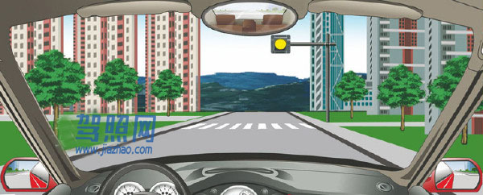

解析：黄灯闪烁提示车辆注意减速，确认安全后缓慢通过。

## 592. 路口黄灯持续闪烁，警示驾驶人要注意瞭望，确认安全通过。

题号：592 · 章节：全部题目、第2章：交通信号 · [原题](https://www.aijiaxiao.com/tiba/592/)

- A、正确
- B、错误

**答案：A**

解析：题中是持续闪烁，应该是指只有一个黄灯的路口，不是指红绿灯中的黄灯。

## 593. 黄灯持续闪烁，表示机动车可以加速通过。

题号：593 · 章节：全部题目、第2章：交通信号 · [原题](https://www.aijiaxiao.com/tiba/593/)

- A、正确
- B、错误

**答案：B**

解析：黄灯持续闪烁的意思是，通过持续闪光的黄灯题型机动车、非机动车、行人注意安全通过，这种信号灯往往设置在车流不大的路口或是夜间等车流平峰时段。遇到此类黄灯时，需减速慢行。

## 594. 驾驶机动车在铁路道口看到这种信号灯时怎样行驶？

题号：594 · 章节：全部题目、第2章：交通信号 · [原题](https://www.aijiaxiao.com/tiba/594/)

- A、边观察边缓慢通过
- B、不换挡加速通过
- C、在火车到来前通过
- D、不得越过停止线

**答案：D**

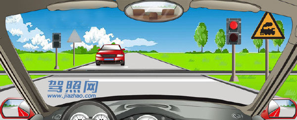

解析：红灯停。

## 595. 在铁路道口遇到两个红灯交替闪烁时要停车等待。

题号：595 · 章节：全部题目、第2章：交通信号 · [原题](https://www.aijiaxiao.com/tiba/595/)

- A、正确
- B、错误

**答案：A**

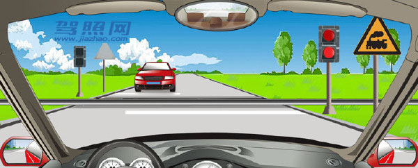

解析：交通标志中红色代表危险，两个红灯交替闪烁时表示火车要经过了，赶紧停车等待。

## 596. 在道路与铁路道口遇到一个红灯亮时要尽快通过道口。

题号：596 · 章节：全部题目、第2章：交通信号 · [原题](https://www.aijiaxiao.com/tiba/596/)

- A、正确
- B、错误

**答案：B**

解析：红灯停。

## 597. 这属于哪一种标志？

题号：597 · 章节：全部题目、第2章：交通信号 · [原题](https://www.aijiaxiao.com/tiba/597/)

- A、警告标志
- B、指路标志
- C、指示标志
- D、禁令标志

**答案：A**

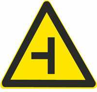

解析：警告标志的颜色为黄色、黑边、黑图案，形状为等边三角形，顶角朝上。

## 598. 这个标志是何含义？

题号：598 · 章节：全部题目、第2章：交通信号 · [原题](https://www.aijiaxiao.com/tiba/598/)

- A、T型交叉路口
- B、Y型交叉路口
- C、十字交叉路口
- D、环行交叉路口

**答案：C**

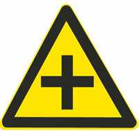

解析：十字交叉路口：除了基本形十字路口外，还有部分变异的十字路口，如：五路交叉路口、变形十字路口、变形五路交叉路口等。五路以上的路口均按十字路口对待。

## 599. 这个标志是何含义？

题号：599 · 章节：全部题目、第2章：交通信号 · [原题](https://www.aijiaxiao.com/tiba/599/)

- A、T型交叉路口
- B、Y型交叉路口
- C、十字交叉路口
- D、环行交叉路口

**答案：A**

解析：T型交叉路口：丁字形标志原则上设在与交叉口形状相符的道路上。右侧丁字路口，此标志设在进入T字路口以前的适当位置。

## 600. 这个标志是何含义？

题号：600 · 章节：全部题目、第2章：交通信号 · [原题](https://www.aijiaxiao.com/tiba/600/)

- A、向左急转弯
- B、向右急转弯
- C、向右绕行
- D、连续弯路

**答案：B**

解析：向右急转弯：向右急弯路标志，设在右急转弯的道路前方适当位置。

## 601. 这个标志是何含义？

题号：601 · 章节：全部题目、第2章：交通信号 · [原题](https://www.aijiaxiao.com/tiba/601/)

- A、向左急转弯
- B、向右急转弯
- C、向左绕行
- D、连续弯路

**答案：A**

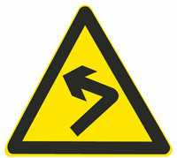

解析：向左急转弯：向左急弯路标志设在左急转弯的道路前方适当位置。

## 602. 这是什么交通标志？

题号：602 · 章节：全部题目、第2章：交通信号 · [原题](https://www.aijiaxiao.com/tiba/602/)

- A、易滑路段
- B、急转弯路
- C、反向弯路
- D、连续弯路

**答案：C**

解析：此标志表示反向弯路。警告标志，提醒车辆与行人注意。

## 603. 这是什么交通标志？

题号：603 · 章节：全部题目、第2章：交通信号 · [原题](https://www.aijiaxiao.com/tiba/603/)

- A、易滑路段
- B、急转弯路
- C、反向弯路
- D、连续弯路

**答案：D**

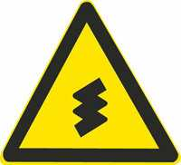

解析：连续转弯，警告标志。

## 604. 这个标志是何含义？

题号：604 · 章节：全部题目、第2章：交通信号 · [原题](https://www.aijiaxiao.com/tiba/604/)

- A、堤坝路
- B、上陡坡
- C、连续上坡
- D、下陡坡

**答案：B**

解析：上陡坡：用以提醒车辆驾驶人小心驾驶。

## 605. 这个标志是何含义？

题号：605 · 章节：全部题目、第2章：交通信号 · [原题](https://www.aijiaxiao.com/tiba/605/)

- A、堤坝路
- B、上陡坡
- C、下陡坡
- D、连续上坡

**答案：C**

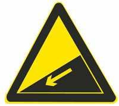

解析：下陡坡：用以提醒车辆驾驶人小心驾驶。

## 606. 这个标志是何含义？

题号：606 · 章节：全部题目、第2章：交通信号 · [原题](https://www.aijiaxiao.com/tiba/606/)

- A、连续上坡
- B、上陡坡
- C、下陡坡
- D、连续下坡

**答案：D**

解析：连续下坡：用以提醒车辆驾驶人小心驾驶。当连续下坡总长大于3km后，应重复设置。

## 607. 这是什么交通标志？

题号：607 · 章节：全部题目、第2章：交通信号 · [原题](https://www.aijiaxiao.com/tiba/607/)

- A、两侧变窄
- B、右侧变窄
- C、左侧变窄
- D、桥面变窄

**答案：A**

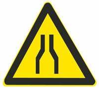

解析：此标志表示两侧变窄，内部有两条线向内变窄。

## 608. 这是什么交通标志？

题号：608 · 章节：全部题目、第2章：交通信号 · [原题](https://www.aijiaxiao.com/tiba/608/)

- A、两侧变窄
- B、右侧变窄
- C、左侧变窄
- D、桥面变窄

**答案：B**

解析：右侧变窄：用以警告车辆驾驶人注意前方车行道或路面狭窄情况，遇有来车应予减速避让。设在双车道路面宽度缩减为6m以下的路段起点前方。

## 609. 这是什么交通标志？

题号：609 · 章节：全部题目、第2章：交通信号 · [原题](https://www.aijiaxiao.com/tiba/609/)

- A、两侧变窄
- B、右侧变窄
- C、左侧变窄
- D、桥面变窄

**答案：C**

解析：警告标志，左侧变窄。

## 610. 这个标志是何含义？

题号：610 · 章节：全部题目、第2章：交通信号 · [原题](https://www.aijiaxiao.com/tiba/610/)

- A、窄路
- B、右侧变窄
- C、左侧变窄
- D、窄桥

**答案：D**

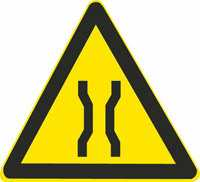

解析：窄路和窄桥的区别是：窄路图标没有上面放宽的那块，窄路是行道变窄，窄桥是一段变窄，然后路又变宽。

## 611. 这个标志是何含义？

题号：611 · 章节：全部题目、第2章：交通信号 · [原题](https://www.aijiaxiao.com/tiba/611/)

- A、双向交通
- B、分离式道路
- C、潮汐车道
- D、减速让行

**答案：A**

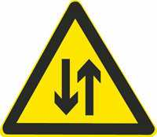

解析：双向交通：用以提醒车辆驾驶人注意会车。设在由双向分离行驶，因某种原因出现临时性或永久性的不分离双向行驶的路段，或由单向行驶进入双向行驶的路段以前适当位置。

## 612. 这个标志是何含义？

题号：612 · 章节：全部题目、第2章：交通信号 · [原题](https://www.aijiaxiao.com/tiba/612/)

- A、人行横道
- B、注意行人
- C、注意儿童
- D、学校区域

**答案：B**

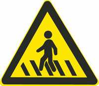

解析：看清楚标志牌的颜色，黄色的为注意行人标志，蓝色底的为人行横道。

## 613. 这个标志是何含义？

题号：613 · 章节：全部题目、第2章：交通信号 · [原题](https://www.aijiaxiao.com/tiba/613/)

- A、注意行人
- B、人行横道
- C、注意儿童
- D、学校区域

**答案：C**

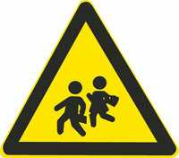

解析：注意儿童：用以警告车辆驾驶人减速慢行，注意儿童。设在小学、幼儿园、少年宫等儿童经常出入地点前适当位置。

## 614. 这个标志是何含义？

题号：614 · 章节：全部题目、第2章：交通信号 · [原题](https://www.aijiaxiao.com/tiba/614/)

- A、大型畜牧场
- B、野生动物保护区
- C、注意野生动物
- D、注意牲畜

**答案：D**

解析：牛是牲畜，鹿是野生动物。此标志表示注意牲畜。

## 615. 这个标志是何含义？

题号：615 · 章节：全部题目、第2章：交通信号 · [原题](https://www.aijiaxiao.com/tiba/615/)

- A、注意野生动物
- B、注意牲畜
- C、动物公园
- D、开放的牧区

**答案：A**

解析：黄底是警告；牛是牲畜，鹿是野生动物。

## 616. 这个标志是何含义？

题号：616 · 章节：全部题目、第2章：交通信号 · [原题](https://www.aijiaxiao.com/tiba/616/)

- A、交叉路口
- B、注意信号灯
- C、注意行人
- D、人行横道灯

**答案：B**

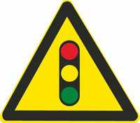

解析：注意信号灯：用以警告车辆驾驶人注意前方路段设有信号灯，应依信号灯指示行车。

## 617. 这个标志是何含义？

题号：617 · 章节：全部题目、第2章：交通信号 · [原题](https://www.aijiaxiao.com/tiba/617/)

- A、傍山险路
- B、悬崖路段
- C、注意落石
- D、危险路段

**答案：C**

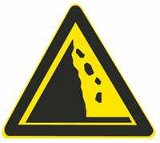

解析：注意落石：此标志设在左侧有落石危险的傍山路段之前适当位置。

## 618. 这个标志是何含义？

题号：618 · 章节：全部题目、第2章：交通信号 · [原题](https://www.aijiaxiao.com/tiba/618/)

- A、注意横风
- B、风向标
- C、隧道入口
- D、气象台

**答案：A**

解析：注意横风：此标志设在经常有很强的侧风并有必要引起注意的路段前适当位置。

## 619. 这个标志是何含义？

题号：619 · 章节：全部题目、第2章：交通信号 · [原题](https://www.aijiaxiao.com/tiba/619/)

- A、急转弯路
- B、易滑路段
- C、试车路段
- D、曲线路段

**答案：B**

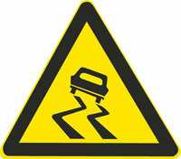

解析：易滑路段：此标志设在路面的摩擦系数不能满足相应行驶速度下要求紧急刹车距离的路段前适当位置。行驶至此路段必须减速慢行。

## 620. 这个标志是何含义？

题号：620 · 章节：全部题目、第2章：交通信号 · [原题](https://www.aijiaxiao.com/tiba/620/)

- A、临崖路
- B、堤坝路
- C、傍山险路
- D、落石路

**答案：C**

解析：傍山险路：用以提醒车辆驾驶人小心驾驶。设在傍山险路路段以前适当位置。

## 621. 这个标志是何含义？

题号：621 · 章节：全部题目、第2章：交通信号 · [原题](https://www.aijiaxiao.com/tiba/621/)

- A、堤坝路
- B、临崖路
- C、易滑路
- D、傍水路

**答案：A**

解析：堤坝路：用以提醒车辆驾驶人小心驾驶，设在沿水库、湖泊、河流等堤坝道路以前适当位置。

## 622. 这个标志是何含义？

题号：622 · 章节：全部题目、第2章：交通信号 · [原题](https://www.aijiaxiao.com/tiba/622/)

- A、注意行人
- B、有人行横道
- C、村庄或集镇
- D、有小学校

**答案：C**

解析：村庄：用以提醒车辆驾驶人小心驾驶。设在紧靠村庄、集镇且视线不良的路段以前适当位置。

## 623. 这个标志是何含义？

题号：623 · 章节：全部题目、第2章：交通信号 · [原题](https://www.aijiaxiao.com/tiba/623/)

- A、涵洞
- B、水渠
- C、桥梁
- D、隧道

**答案：D**

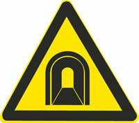

解析：隧道：用以提醒车辆驾驶人注意慢行。设在双向行驶并且照明不好的隧道口前适当位置。

## 624. 这个标志是何含义？

题号：624 · 章节：全部题目、第2章：交通信号 · [原题](https://www.aijiaxiao.com/tiba/624/)

- A、过水路面
- B、漫水桥
- C、渡口
- D、船用码头

**答案：C**

解析：渡口：用以提醒车辆驾驶人谨慎驾驶。设在车辆渡口以前适当位置。

## 625. 这个标志是何含义？

题号：625 · 章节：全部题目、第2章：交通信号 · [原题](https://www.aijiaxiao.com/tiba/625/)

- A、不平路面
- B、驼峰桥
- C、路面高突
- D、路面低洼

**答案：B**

解析：驼峰桥：用以提醒车辆驾驶人谨慎驾驶。设在拱度很大，影响视距的驼峰桥以前适当位置。

## 626. 这个标志是何含义？

题号：626 · 章节：全部题目、第2章：交通信号 · [原题](https://www.aijiaxiao.com/tiba/626/)

- A、路面低洼
- B、驼峰桥
- C、路面不平
- D、路面高突

**答案：C**

解析：一个坡是高突，一个坑是低洼，一个凸中间有空间是驼峰桥，两个凸肯定是不平。

## 627. 这个标志是何含义？

题号：627 · 章节：全部题目、第2章：交通信号 · [原题](https://www.aijiaxiao.com/tiba/627/)

- A、路面低洼
- B、驼峰桥
- C、路面不平
- D、路面高突

**答案：D**

解析：一个坡是高突，一个坑是低洼，一个凸中间有空间是驼峰桥，两个凸肯定是不平。

## 628. 这个标志是何含义？

题号：628 · 章节：全部题目、第2章：交通信号 · [原题](https://www.aijiaxiao.com/tiba/628/)

- A、路面高突
- B、有驼峰桥
- C、路面不平
- D、路面低洼

**答案：D**

解析：一个坡是高突，一个坑是低洼，一个凸中间有空间是驼峰桥，两个凸肯定是不平。

## 629. 这个标志是何含义？

题号：629 · 章节：全部题目、第2章：交通信号 · [原题](https://www.aijiaxiao.com/tiba/629/)

- A、过水路面
- B、渡口
- C、泥泞道路
- D、低洼路面

**答案：A**

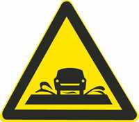

解析：过水路面指的是：通过平时无水或流水很少的宽浅河流，而修筑的在洪水期间容许水流浸过的路面。

## 630. 这个标志是何含义？

题号：630 · 章节：全部题目、第2章：交通信号 · [原题](https://www.aijiaxiao.com/tiba/630/)

- A、无人看守铁路道口
- B、有人看守铁路道口
- C、多股铁路与道路相交
- D、立交式的铁路道口

**答案：B**

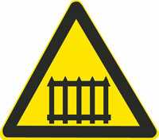

解析：有火车形状的，为无人看守的铁路口，此图为有人看守的铁路口。

## 631. 这个标志是何含义？

题号：631 · 章节：全部题目、第2章：交通信号 · [原题](https://www.aijiaxiao.com/tiba/631/)

- A、多股铁路与道路相交
- B、有人看守铁路道口
- C、无人看守铁路道口
- D、注意长时鸣喇叭

**答案：C**

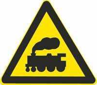

解析：有火车形状的，为无人看守的铁路口，还有一个栅栏形式的图片为有人看守的铁路口。

## 632. 这个标志是何含义？

题号：632 · 章节：全部题目、第2章：交通信号 · [原题](https://www.aijiaxiao.com/tiba/632/)

- A、注意避让火车
- B、有人看守铁路道口
- C、无人看守铁路道口
- D、多股铁路与道路相交

**答案：D**

解析：多股铁路与道路相交，则应在铁路道口标志上方设置叉形符号。叉形符号交叉点到警告标志三角形顶点的距离为40cm。

## 633. 这个标志是何含义？

题号：633 · 章节：全部题目、第2章：交通信号 · [原题](https://www.aijiaxiao.com/tiba/633/)

- A、距无人看守铁路道口50米
- B、距有人看守铁路道口50米
- C、距无人看守铁路道口100米
- D、距有人看守铁路道口100米

**答案：A**

解析：先看上面的三角形，里面有栅栏就是有人看守，里面有车就是无人看守；再看下面的长方形，一条红杠杠代表50米，两条100米、、、依此类推。

## 634. 这个标志是何含义？

题号：634 · 章节：全部题目、第2章：交通信号 · [原题](https://www.aijiaxiao.com/tiba/634/)

- A、距无人看守铁路道口50米
- B、距有人看守铁路道口50米
- C、距无人看守铁路道口100米
- D、距有人看守铁路道口100米

**答案：C**

解析：先看上面的三角形，里面有栅栏就是有人看守，里面有车就是无人看守；再看下面的长方形，一条红杠杠代表50米，两条100米、、、依此类推。

## 635. 这个标志是何含义？

题号：635 · 章节：全部题目、第2章：交通信号 · [原题](https://www.aijiaxiao.com/tiba/635/)

- A、距有人看守铁路道口150米
- B、距无人看守铁路道口150米
- C、距无人看守铁路道口100米
- D、距有人看守铁路道口100米

**答案：B**

解析：先看上面的三角形，里面有栅栏就是有人看守，里面有车就是无人看守；再看下面的长方形，一条红杠杠代表50米，两条100米、、、依此类推。

## 636. 这个标志是何含义？

题号：636 · 章节：全部题目、第2章：交通信号 · [原题](https://www.aijiaxiao.com/tiba/636/)

- A、避让非机动车
- B、非机动车道
- C、禁止非机动车通行
- D、注意非机动车

**答案：D**

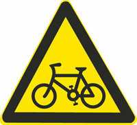

解析：黄底标志为警告标志，自行车是非机动车所以答案是注意非机动车。

## 637. 这个标志是何含义？

题号：637 · 章节：全部题目、第2章：交通信号 · [原题](https://www.aijiaxiao.com/tiba/637/)

- A、注意残疾人
- B、残疾人出入口
- C、残疾人休息处
- D、残疾人专用通道

**答案：A**

解析：黄底标志为警告标志，所以是注意残疾人。

## 638. 这个标志是何含义？

题号：638 · 章节：全部题目、第2章：交通信号 · [原题](https://www.aijiaxiao.com/tiba/638/)

- A、施工路段
- B、事故易发路段
- C、减速慢行路段
- D、拥堵路段

**答案：B**

解析：此标志表示事故易发路段。用以告示前方道路为事故易发路段，谨慎驾驶。此标志设在交通事故易发路段以前适当位置。

## 639. 这个标志是何含义？

题号：639 · 章节：全部题目、第2章：交通信号 · [原题](https://www.aijiaxiao.com/tiba/639/)

- A、施工路段
- B、车多路段
- C、慢行
- D、拥堵路段

**答案：C**

解析：此标志表示慢行，用以提醒车辆驾驶人减速慢行。此标志设在前方需要减速慢行的路段以前适当位置。

## 640. 这个标志是何含义？

题号：640 · 章节：全部题目、第2章：交通信号 · [原题](https://www.aijiaxiao.com/tiba/640/)

- A、施工路段绕行
- B、双向交通
- C、注意危险
- D、左右绕行

**答案：D**

解析：此标志表示左右绕行：用以告示前方道路有障碍物，车辆应按标志指示减速慢行，绕行通过。

## 641. 这个标志是何含义？

题号：641 · 章节：全部题目、第2章：交通信号 · [原题](https://www.aijiaxiao.com/tiba/641/)

- A、左侧绕行
- B、单向通行
- C、注意危险
- D、右侧绕行

**答案：A**

解析：此标志表示左侧绕行，用以告示前方道路有障碍物，车辆应按标志指示减速慢行，左侧绕行通过。

## 642. 这个标志是何含义？

题号：642 · 章节：全部题目、第2章：交通信号 · [原题](https://www.aijiaxiao.com/tiba/642/)

- A、单向通行
- B、右侧绕行
- C、注意危险
- D、左侧绕行

**答案：B**

解析：此标志表示右侧绕行，用以告示前方道路有障碍物，车辆应按标志指示减速慢行，右侧绕行通过。

## 643. 这个标志是何含义？

题号：643 · 章节：全部题目、第2章：交通信号 · [原题](https://www.aijiaxiao.com/tiba/643/)

- A、事故多发路段
- B、减速慢行
- C、注意危险
- D、拥堵路段

**答案：C**

解析：注意危险：用以促使车辆驾驶员谨慎慢行。

## 644. 这个标志是何含义？

题号：644 · 章节：全部题目、第2章：交通信号 · [原题](https://www.aijiaxiao.com/tiba/644/)

- A、塌方路段
- B、施工路段
- C、前方工厂
- D、道路堵塞

**答案：B**

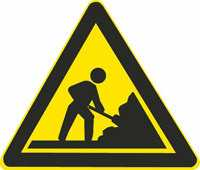

解析：此标志表示施工路段，用以告示前方道路施工，车辆应减速慢行或绕道行驶。

## 645. 这个标志是何含义？

题号：645 · 章节：全部题目、第2章：交通信号 · [原题](https://www.aijiaxiao.com/tiba/645/)

- A、建议速度
- B、最低速度
- C、最高速度
- D、限制速度

**答案：A**

解析：此标志表示建议减速。用以提醒车辆驾驶人建议的速度行驶，设在弯道、出口、匝道的适当位置。

## 646. 这个标志是何含义？

题号：646 · 章节：全部题目、第2章：交通信号 · [原题](https://www.aijiaxiao.com/tiba/646/)

- A、隧道开远光灯
- B、隧道减速
- C、隧道开灯
- D、隧道开示宽灯

**答案：C**

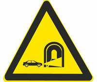

解析：隧道是不允许开远光灯的，此标志是用以警告车辆驾驶人进入隧道打开前照明灯，注意行驶。

## 647. 这个标志是何含义？

题号：647 · 章节：全部题目、第2章：交通信号 · [原题](https://www.aijiaxiao.com/tiba/647/)

- A、注意双向行驶
- B、靠两侧行驶
- C、可变车道
- D、注意潮汐车道

**答案：D**

解析：此标志为注意潮汐车道。用以警告车辆驾驶人注意前方为潮汐车道。“潮汐车道”是指根据早晚交通流量不同情况，对有条件的道路，试点开辟潮汐车道，通过车道灯的指示方向变化，控制主干道车道行驶方向，来调整车道数。

## 648. 这个标志是何含义？

题号：648 · 章节：全部题目、第2章：交通信号 · [原题](https://www.aijiaxiao.com/tiba/648/)

- A、注意保持车距
- B、车距确认路段
- C、车速测试路段
- D、两侧变窄路段

**答案：A**

解析：典型的警告标志，此标志表示注意保持车距。用以警告车辆驾驶人注意和前车保持安全距离。

## 649. 这个标志是何含义？

题号：649 · 章节：全部题目、第2章：交通信号 · [原题](https://www.aijiaxiao.com/tiba/649/)

- A、注意交互式道路
- B、注意分离式道路
- C、平面交叉路口
- D、环行平面交叉

**答案：B**

解析：此标志表示注意分离式道路。用以警告车辆驾驶人注意前方交叉的被交道路是分离式道路。

## 650. 这个标志是何含义？

题号：650 · 章节：全部题目、第2章：交通信号 · [原题](https://www.aijiaxiao.com/tiba/650/)

- A、Y型交叉口
- B、主路让行
- C、注意分流
- D、注意合流

**答案：D**

解析：黄底为警告标志，此标志表示注意合流。用以警告车辆驾驶人注意前方有车辆汇合进来。

## 651. 这个标志是何含义？

题号：651 · 章节：全部题目、第2章：交通信号 · [原题](https://www.aijiaxiao.com/tiba/651/)

- A、避险车道
- B、应急车道
- C、路肩
- D、急弯道

**答案：A**

解析：此标志表示避险车道。避险车道是指：在长陡下坡路段行车道外侧，增设的供速度失控车辆驶，离正线安全减速的专用车道。

## 652. 这属于哪一种标志？

题号：652 · 章节：全部题目、第2章：交通信号 · [原题](https://www.aijiaxiao.com/tiba/652/)

- A、警告标志
- B、禁令标志
- C、指示标志
- D、指路标志

**答案：B**

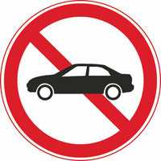

解析：此标志是禁令标志，禁止小型客车驶入。

## 653. 禁令标志的作用是什么？

题号：653 · 章节：全部题目、第2章：交通信号 · [原题](https://www.aijiaxiao.com/tiba/653/)

- A、禁止或限制行为
- B、告知方向信息
- C、指示车辆行进
- D、警告前方危险

**答案：A**

解析：禁令标志是交通标志中主要标志的一种，对车辆加以禁止或限制的标志，如禁止通行、禁止停车、禁止左转弯、禁止鸣喇叭、限制速度、限制重量等。

## 654. 这个标志是何含义？

题号：654 · 章节：全部题目、第2章：交通信号 · [原题](https://www.aijiaxiao.com/tiba/654/)

- A、不准车辆驶入
- B、不准长时间停车
- C、停车让行
- D、不准临时停车

**答案：C**

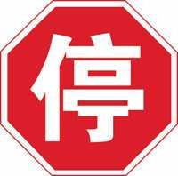

解析：停车让行：表示车辆必须在停止线以外停车瞭望，确认安全后，才准许通行。停车让行标志在下列情况下设置：(1)与交通流量较大的干路平交的支路路口；(2)无人看守的铁路道口；(3)其他需要设置的地方。

## 655. 这个标志是何含义？

题号：655 · 章节：全部题目、第2章：交通信号 · [原题](https://www.aijiaxiao.com/tiba/655/)

- A、不准让行
- B、会车让行
- C、停车让行
- D、减速让行

**答案：D**

解析：三角形的是减速让行，八角形的是停车让行，此标志表示减速让行，车辆应该减速让行，告示车辆驾驶人应慢行或停车，观察干道行车情况，在确保干道车辆优先，确保安全的前提下，方可进入路口。

## 656. 这个标志是何含义？

题号：656 · 章节：全部题目、第2章：交通信号 · [原题](https://www.aijiaxiao.com/tiba/656/)

- A、会车时停车让对方车先行
- B、前方是双向通行路段
- C、右侧道路禁止车通行
- D、会车时停车让右侧车先行

**答案：A**

解析：哪个箭头粗哪边先行，此标志表示会车让车，会车时停车让对方先行。

## 657. 这个标志是何含义？

题号：657 · 章节：全部题目、第2章：交通信号 · [原题](https://www.aijiaxiao.com/tiba/657/)

- A、禁止驶入
- B、禁止通行
- C、减速行驶
- D、限时进入

**答案：B**

解析：此标志表示禁止通行，禁止一切车辆和行人通行。

## 658. 这个标志提示哪种车型禁止通行？

题号：658 · 章节：全部题目、第2章：交通信号 · [原题](https://www.aijiaxiao.com/tiba/658/)

- A、中型客车
- B、小型货车
- C、各种车辆
- D、小型客车

**答案：D**

解析：此标志表示禁止小型客车驶入。轿车属于小型客车。

## 659. 这个标志是何含义？

题号：659 · 章节：全部题目、第2章：交通信号 · [原题](https://www.aijiaxiao.com/tiba/659/)

- A、禁止向左转弯
- B、禁止驶入左车道
- C、禁止车辆掉头
- D、禁止向左变道

**答案：A**

解析：禁止向左转弯：表示前方路口禁止一切车辆向左转弯。此标志设在禁止向左转弯的路口前适当位置。

## 660. 这个标志是何含义？

题号：660 · 章节：全部题目、第2章：交通信号 · [原题](https://www.aijiaxiao.com/tiba/660/)

- A、禁止驶入路口
- B、禁止向右转弯
- C、禁止车辆掉头
- D、禁止变更车道

**答案：B**

解析：禁止向右转弯：表示前方路口禁止一切车辆向右转弯。此标志设在禁止向右转弯的路口前适当位置。

## 661. 这个标志是何含义？

题号：661 · 章节：全部题目、第2章：交通信号 · [原题](https://www.aijiaxiao.com/tiba/661/)

- A、禁止掉头
- B、禁止向右转弯
- C、禁止直行
- D、禁止向左转弯

**答案：C**

解析：禁止直行：表示前方路口禁止一切车辆直行。此标志设在禁止直行的路口前适当位置。

## 662. 这个标志是何含义？

题号：662 · 章节：全部题目、第2章：交通信号 · [原题](https://www.aijiaxiao.com/tiba/662/)

- A、禁止在路口掉头
- B、禁止向左向右变道
- C、禁止车辆直行
- D、禁止向左向右转弯

**答案：D**

解析：禁止向左向右转弯：表示前方路口禁止一切车辆向左向右转弯。此标志设在禁止向左向右转弯的路口前适当位置。

## 663. 这个标志是何含义？

题号：663 · 章节：全部题目、第2章：交通信号 · [原题](https://www.aijiaxiao.com/tiba/663/)

- A、禁止直行和向左转弯
- B、禁止直行和向左变道
- C、允许直行和向左变道
- D、禁止直行和向右转弯

**答案：A**

解析：禁止直行和向左转弯，表示前方路口禁止一切车辆直行和向左转弯。此标志设在禁止直行和向左转弯的路口前适当位置。

## 664. 这个标志是何含义？

题号：664 · 章节：全部题目、第2章：交通信号 · [原题](https://www.aijiaxiao.com/tiba/664/)

- A、禁止直行和向左转弯
- B、禁止直行和向左变道
- C、允许直行和向左变道
- D、禁止直行和向右转弯

**答案：D**

解析：禁止直行和向右转弯：表示前方路口禁止一切车辆直行和向右转弯。此标志设在禁止直行和向右转弯的路口前适当位置。

## 665. 这个标志是何含义？

题号：665 · 章节：全部题目、第2章：交通信号 · [原题](https://www.aijiaxiao.com/tiba/665/)

- A、禁止直行
- B、禁止掉头
- C、禁止变道
- D、禁止左转

**答案：B**

解析：禁止掉头：表示前方路口禁止一切车辆掉头。此标志设在禁止掉头的路口前适当位置。

## 666. 这个标志是何含义？

题号：666 · 章节：全部题目、第2章：交通信号 · [原题](https://www.aijiaxiao.com/tiba/666/)

- A、禁止借道
- B、禁止变道
- C、禁止超车
- D、禁止掉头

**答案：C**

解析：禁止超车：表示该标志至前方解除禁止超车标志的路段内，不准机动车超车。此标志设在禁止超车的起点。

## 667. 这个标志是何含义？

题号：667 · 章节：全部题目、第2章：交通信号 · [原题](https://www.aijiaxiao.com/tiba/667/)

- A、解除禁止借道
- B、解除禁止变道
- C、准许变道行驶
- D、解除禁止超车

**答案：D**

解析：解除禁止超车：表示禁止超车路段结束。此标志设在禁止超车的终点。

## 668. 这个标志是何含义？

题号：668 · 章节：全部题目、第2章：交通信号 · [原题](https://www.aijiaxiao.com/tiba/668/)

- A、允许长时停车
- B、允许临时停车
- C、禁止长时停车
- D、禁止停放车辆

**答案：D**

解析：禁止停放车辆：表示在限定的范围内，禁止一切车辆临时或长时停放。此标志设在禁止车辆停放的地方。禁止车辆停放的时间、车种和范围可用辅助标志说明。

## 669. 这个标志是何含义？

题号：669 · 章节：全部题目、第2章：交通信号 · [原题](https://www.aijiaxiao.com/tiba/669/)

- A、允许长时停车
- B、禁止临时停车
- C、禁止长时停车
- D、禁止停放车辆

**答案：C**

解析：禁止长时停车：禁止车辆长时停放，临时停放不受限制。禁止车辆停放的时间、车种和范围可用辅助标志说明。

## 670. 这个标志是何含义？

题号：670 · 章节：全部题目、第2章：交通信号 · [原题](https://www.aijiaxiao.com/tiba/670/)

- A、禁止长时鸣喇叭
- B、断续鸣喇叭
- C、禁止鸣喇叭
- D、减速鸣喇叭

**答案：C**

解析：禁止鸣喇叭：表示禁止鸣喇叭。此标志设在需要禁止鸣喇叭的地方。禁止鸣喇叭的时间和范围可用辅助标志说明。

## 671. 这个标志是何含义？

题号：671 · 章节：全部题目、第2章：交通信号 · [原题](https://www.aijiaxiao.com/tiba/671/)

- A、解除3米限宽
- B、限制高度为3米
- C、预告宽度为3米
- D、限制宽度为3米

**答案：D**

解析：限制宽度为3米：表示禁止装载宽度超过标志所示数值的车辆通行。此标志设在最大允许宽度受限制的地方。以图为例：装载宽度不得超过3米

## 672. 这个标志是何含义？

题号：672 · 章节：全部题目、第2章：交通信号 · [原题](https://www.aijiaxiao.com/tiba/672/)

- A、限制高度为3.5米
- B、限制宽度为3.5米
- C、解除3.5米限高
- D、限制车距为3.5米

**答案：A**

解析：限制高度为3.5米：表示禁止装载高度超过标志所示数值的车辆通行。此标志设在最大允许高度受限制的地方。以图为例：装载高度不得超过3.5米。

## 673. 这个标志是何含义？

题号：673 · 章节：全部题目、第2章：交通信号 · [原题](https://www.aijiaxiao.com/tiba/673/)

- A、限制40吨轴重
- B、限制最高时速40公里
- C、前方40米减速
- D、最低时速40公里

**答案：B**

解析：限制最高时速40公里：表示该标志至前方限制速度标志的路段内，机动车行驶速度不得超过标志所示数值。此标志设在需要限制车辆速度的路段的起点。以图为例：限制行驶时速不得超过40公里。

## 674. 这个标志是何含义？

题号：674 · 章节：全部题目、第2章：交通信号 · [原题](https://www.aijiaxiao.com/tiba/674/)

- A、40米减速行驶路段
- B、最低时速40公里
- C、解除时速40公里限制
- D、最高时速40公里

**答案：C**

解析：解除时速40公里限制：表示限制速度路段结束。此标志设在限制车辆速度路段的终点。

## 675. 这个标志是何含义？

题号：675 · 章节：全部题目、第2章：交通信号 · [原题](https://www.aijiaxiao.com/tiba/675/)

- A、边防检查
- B、禁止通行
- C、海关检查
- D、停车检查

**答案：D**

解析：停车检查：表示机动车必须停车接受检查。此标志设在关卡将近处，以便要求车辆接受检查或缴费等手续。标志中可加注说明检查事项。

## 676. 这个标志是何含义？

题号：676 · 章节：全部题目、第2章：交通信号 · [原题](https://www.aijiaxiao.com/tiba/676/)

- A、海关
- B、国界
- C、边防
- D、边界

**答案：A**

解析：海关那俩个大字那么清晰你再不选A，A得有多伤心。

## 677. 这属于哪一种标志？

题号：677 · 章节：全部题目、第2章：交通信号 · [原题](https://www.aijiaxiao.com/tiba/677/)

- A、警告标志
- B、禁令标志
- C、指示标志
- D、指路标志

**答案：C**

解析：指示标志的颜色为蓝底、白图案；形状分为圆形、长方形和正方形。此标志是指示标志，标志该道路只供机动车行驶。

## 678. 指示标志的作用是什么？

题号：678 · 章节：全部题目、第2章：交通信号 · [原题](https://www.aijiaxiao.com/tiba/678/)

- A、限制车辆、行人通行
- B、指示车辆、行人行进
- C、告知方向信息
- D、警告前方危险

**答案：B**

解析：指示标志是交通标志中主要标志的一种，用以指示车辆和行人按规定方向、地点行驶。指示标志的颜色为蓝底、白图案；形状分为圆形、长方形和正方形。

## 679. 这个标志是何含义？

题号：679 · 章节：全部题目、第2章：交通信号 · [原题](https://www.aijiaxiao.com/tiba/679/)

- A、直行车道
- B、只准直行
- C、单行路
- D、禁止直行

**答案：B**

解析：此标志表示一切车辆只准直行。

## 680. 这个标志是何含义？

题号：680 · 章节：全部题目、第2章：交通信号 · [原题](https://www.aijiaxiao.com/tiba/680/)

- A、直行车道
- B、单行路
- C、向左转弯
- D、禁止直行

**答案：C**

解析：向左转弯：表示只准一切车辆向左转弯。此标志设在车辆必须向左转弯的路口以前适当位置。

## 681. 这个标志是何含义？

题号：681 · 章节：全部题目、第2章：交通信号 · [原题](https://www.aijiaxiao.com/tiba/681/)

- A、直行车道
- B、只准直行
- C、单行路
- D、向右转弯

**答案：D**

解析：向右转弯：表示只准一切车辆向右转弯。此标志设在车辆必须向右转弯的路口以前适当位置。

## 682. 这个标志是何含义？

题号：682 · 章节：全部题目、第2章：交通信号 · [原题](https://www.aijiaxiao.com/tiba/682/)

- A、直行和向右转弯
- B、直行和向左转弯
- C、禁止直行和向右转弯
- D、只准向左和向右转弯

**答案：A**

解析：直行和向右转弯：表示只准一切车辆直行和向右转弯。此标志设在车辆必须直行和向右转弯）的路口以前适当位置。

## 683. 这个标志是何含义？

题号：683 · 章节：全部题目、第2章：交通信号 · [原题](https://www.aijiaxiao.com/tiba/683/)

- A、直行和向右转弯
- B、直行和向左转弯
- C、禁止直行和向左转弯
- D、只准向右和向左转弯

**答案：B**

解析：直行和向左转弯：表示只准一切车辆直行和向左转弯。此标志设在车辆必须直行和向左转弯的路口以前适当位置。

## 684. 这个标志是何含义？

题号：684 · 章节：全部题目、第2章：交通信号 · [原题](https://www.aijiaxiao.com/tiba/684/)

- A、禁止向右转弯
- B、禁止向左转弯
- C、向左和向右转弯
- D、禁止向左右转弯

**答案：C**

解析：向左和向右转弯：表示只准一切车辆向左和向右转弯。此标志设在车辆必须向左和向右转弯的路口以前适当位置。

## 685. 这个标志是何含义？

题号：685 · 章节：全部题目、第2章：交通信号 · [原题](https://www.aijiaxiao.com/tiba/685/)

- A、靠道路右侧停车
- B、只准向右转弯
- C、右侧是下坡路段
- D、靠右侧道路行驶

**答案：D**

解析：靠右侧道路行驶：表示只准一切车辆靠右侧道路行驶。此标志设在车辆必须靠右侧行驶的路口以前适当位置。

## 686. 这个标志是何含义？

题号：686 · 章节：全部题目、第2章：交通信号 · [原题](https://www.aijiaxiao.com/tiba/686/)

- A、靠左侧道路行驶
- B、只准向左转弯
- C、左侧是下坡路段
- D、靠道路左侧停车

**答案：A**

解析：靠左侧道路行驶：表示只准一切车辆靠左侧道路行驶。此标志设在车辆必须靠左侧行驶的路口以前适当位置。

## 687. 这个标志是何含义？

题号：687 · 章节：全部题目、第2章：交通信号 · [原题](https://www.aijiaxiao.com/tiba/687/)

- A、立体交叉直行和右转弯行驶
- B、立体交叉直行和左转弯行驶
- C、直行和左转弯行驶
- D、直行和右转弯行驶

**答案：B**

解析：立体交叉直行和左转弯行驶：表示车辆在立交处可以直行和按图示路线左转弯行驶。此标志设在立交左转弯出口处适当位置。

## 688. 这个标志是何含义？

题号：688 · 章节：全部题目、第2章：交通信号 · [原题](https://www.aijiaxiao.com/tiba/688/)

- A、直行和左转弯行驶
- B、直行和右转弯行驶
- C、立体交叉直行和右转弯行驶
- D、立体交叉直行和左转弯行驶

**答案：C**

解析：立体交叉直行和右转弯行驶：表示车辆在立交处可以直行和按图示路线右转弯行驶。此标志设在立交右转弯出口处适当位置。

## 689. 这个标志是何含义？

题号：689 · 章节：全部题目、第2章：交通信号 · [原题](https://www.aijiaxiao.com/tiba/689/)

- A、右侧通行
- B、左侧通行
- C、向右行驶
- D、环岛行驶

**答案：D**

解析：环岛行驶：表示只准车辆靠右环行。此标志设在环岛面向路口来车方向适当位置。

## 690. 这个标志是何含义？

题号：690 · 章节：全部题目、第2章：交通信号 · [原题](https://www.aijiaxiao.com/tiba/690/)

- A、向左单行路
- B、向右单行路
- C、直行单行路
- D、左转让行

**答案：A**

解析：此标志表示该道路为单向行驶，已进入车辆应该按标志指示方向行车，图中为向左。

## 691. 这个标志是何含义？

题号：691 · 章节：全部题目、第2章：交通信号 · [原题](https://www.aijiaxiao.com/tiba/691/)

- A、向左单行路
- B、向右单行路
- C、直行单行路
- D、右转让行

**答案：B**

解析：此标志表示该道路为单向行驶，已进入车辆应该按标志指示方向行车，图中为向右。

## 692. 这个标志是何含义？

题号：692 · 章节：全部题目、第2章：交通信号 · [原题](https://www.aijiaxiao.com/tiba/692/)

- A、靠右侧行驶
- B、不允许直行
- C、直行单行路
- D、直行车让行

**答案：C**

解析：此标志表示该道路为单向行驶，已进入车辆应该按标志指示方向行车，图中为直行。

## 693. 这个标志是何含义？

题号：693 · 章节：全部题目、第2章：交通信号 · [原题](https://www.aijiaxiao.com/tiba/693/)

- A、低速行驶
- B、注意行人
- C、行人先行
- D、步行

**答案：D**

解析：此标志表示该道路只供步行，任何车辆不准进入。

## 694. 这个标志是何含义？

题号：694 · 章节：全部题目、第2章：交通信号 · [原题](https://www.aijiaxiao.com/tiba/694/)

- A、应当鸣喇叭
- B、禁止鸣喇叭
- C、禁止鸣高音喇叭
- D、禁止鸣低音喇叭

**答案：A**

解析：此标志表示机动车行至该标志处应鸣喇叭，以提醒对面车辆驾驶人注意并减速慢行。一般在公路的急转弯处，陡坡等视野不良路段的起点。

## 695. 这个标志是何含义？

题号：695 · 章节：全部题目、第2章：交通信号 · [原题](https://www.aijiaxiao.com/tiba/695/)

- A、人行横道
- B、学生通道
- C、儿童通道
- D、注意行人

**答案：A**

解析：此标志表示该处为人行横道。里面白色，外面蓝色正方形包围是人行横道。“注意行人”是三角形黄色框包围的！

## 696. 这个标志是何含义？

题号：696 · 章节：全部题目、第2章：交通信号 · [原题](https://www.aijiaxiao.com/tiba/696/)

- A、高度限速50公里/小时
- B、最低限速50公里/小时
- C、水平高度50米
- D、海拔高度50米

**答案：B**

解析：表示机动车驶入前方道路之最低时速限制。此标志设在高速公路或其他道路限速路段的起点。高度限速标志是白底红字。

## 697. 这个标志是何含义？

题号：697 · 章节：全部题目、第2章：交通信号 · [原题](https://www.aijiaxiao.com/tiba/697/)

- A、单行路
- B、停车让行
- C、干路先行
- D、两侧街道

**答案：C**

解析：表示干路先行，此标志设在车道以前适当位置。答题技巧：记住哥一句话，谁粗谁先行。

## 698. 这个标志是何含义？

题号：698 · 章节：全部题目、第2章：交通信号 · [原题](https://www.aijiaxiao.com/tiba/698/)

- A、对向先行
- B、停车让行
- C、单行路
- D、会车先行

**答案：D**

解析：此标志表示车辆在会车时享有优先通行权利。谁粗谁先行，你的箭头比他大就会车先行，你的比他小就是会车让行。

## 699. 这个标志是何含义？

题号：699 · 章节：全部题目、第2章：交通信号 · [原题](https://www.aijiaxiao.com/tiba/699/)

- A、分向车道
- B、右转车道
- C、掉头车道
- D、左转车道

**答案：B**

解析：此标志表示车道的行驶方向，图中向右，表示只准一切车辆向右转弯。

## 700. 这个标志是何含义？

题号：700 · 章节：全部题目、第2章：交通信号 · [原题](https://www.aijiaxiao.com/tiba/700/)

- A、分向车道
- B、右转车道
- C、掉头车道
- D、左转车道

**答案：D**

解析：此标志表示车道的行驶方向，图中向左，表示只准一切车辆向左转弯。

## 701. 这个标志是何含义？

题号：701 · 章节：全部题目、第2章：交通信号 · [原题](https://www.aijiaxiao.com/tiba/701/)

- A、直行车道
- B、右转车道
- C、掉头车道
- D、左转车道

**答案：A**

解析：此标志表示直行车道，表示只准一切车辆直行。

## 702. 这个标志是何含义？

题号：702 · 章节：全部题目、第2章：交通信号 · [原题](https://www.aijiaxiao.com/tiba/702/)

- A、直行和左转车道
- B、直行和辅路出口车道
- C、直行和右转合用车道
- D、分向行驶车道

**答案：C**

解析：此标志表示直行和右转合用车道，表示只准一切车辆直行和向右转弯。

## 703. 这个标志是何含义？

题号：703 · 章节：全部题目、第2章：交通信号 · [原题](https://www.aijiaxiao.com/tiba/703/)

- A、直行和左转合用车道
- B、直行和掉头合用车道
- C、直行和右转车道
- D、分向行驶车道

**答案：A**

解析：此标志表示直行和左转合用车道，表示只准一切车辆直行和向左转弯。

## 704. 这个标志是何含义？

题号：704 · 章节：全部题目、第2章：交通信号 · [原题](https://www.aijiaxiao.com/tiba/704/)

- A、左转车道
- B、掉头车道
- C、绕行车道
- D、分向车道

**答案：B**

解析：此标志表示该车道为掉头车道。

## 705. 这个标志是何含义？

题号：705 · 章节：全部题目、第2章：交通信号 · [原题](https://www.aijiaxiao.com/tiba/705/)

- A、直行和左转合用车道
- B、禁止左转和掉头车道
- C、掉头和左转合用车道
- D、分向行驶车道

**答案：C**

解析：左转和掉头合并在一个标志里，你应该能看到的。

## 706. 这个标志是何含义？

题号：706 · 章节：全部题目、第2章：交通信号 · [原题](https://www.aijiaxiao.com/tiba/706/)

- A、直线行驶车道
- B、左转行驶车道
- C、右转行驶车道
- D、分向行驶车道

**答案：D**

解析：此标志表示分向行驶车道。同向多车道的公路一般都设计了分向行驶车道，正常行驶过程中可以变更车道，当你行驶至路口时要变换到你要行驶的车道。例如要左转弯时要提前变更车道至左转弯车道；要右转弯时要提前变更车道至右转弯车道，不能占用他人行车道，以最大限度的保障通行。

## 707. 这个标志是何含义？

题号：707 · 章节：全部题目、第2章：交通信号 · [原题](https://www.aijiaxiao.com/tiba/707/)

- A、公交线路专用车道
- B、大型客车专用车道
- C、快速公交系统专用车道
- D、多乘员车辆专用车道

**答案：A**

解析：此为公交线路专用车道，与快速公交系统专用车道的区别是少了“快速公交”四个字。

## 708. 这个标志是何含义？

题号：708 · 章节：全部题目、第2章：交通信号 · [原题](https://www.aijiaxiao.com/tiba/708/)

- A、禁止小型车行驶
- B、机动车行驶
- C、只准小型车行驶
- D、不准小型车通行

**答案：B**

解析：此标志表示该道路只供机动车行驶。看到小汽车你应该想到的是机动车行驶。

## 709. 这个标志是何含义？

题号：709 · 章节：全部题目、第2章：交通信号 · [原题](https://www.aijiaxiao.com/tiba/709/)

- A、小型车车道
- B、小型车专用车道
- C、机动车车道
- D、多乘员车辆专用车道

**答案：C**

解析：此标志表示该车道只供机动车行驶。比多乘员车辆专用车道少俩人。

## 710. 这个标志是何含义？

题号：710 · 章节：全部题目、第2章：交通信号 · [原题](https://www.aijiaxiao.com/tiba/710/)

- A、非机动车停车位
- B、电动自行车行驶
- C、非机动车停放区
- D、非机动车行驶

**答案：D**

解析：此标志表示该道路只供非机动车行驶。行驶的标志是用圆圈表示，而停车位是用矩形。

## 711. 这个标志是何含义？

题号：711 · 章节：全部题目、第2章：交通信号 · [原题](https://www.aijiaxiao.com/tiba/711/)

- A、非机动车车道
- B、禁止自行车通行车道
- C、自行车专用车道
- D、停放自行车路段

**答案：A**

解析：此图为非机动车车道，别误以为自行车专用车道，没有自行车专用车道这一说。

## 712. 这个标志是何含义？

题号：712 · 章节：全部题目、第2章：交通信号 · [原题](https://www.aijiaxiao.com/tiba/712/)

- A、公交车专用车道
- B、BRT车辆专用车道
- C、大型客车专用车道
- D、多乘员车专用车道

**答案：B**

解析：此图为BRT车辆专用车道，与公交车专用车道的区别是多了“快速公交”四个字。（快速公交，是英文BusRapidTransit的词义翻译（简称：BRT），这是一种高质量的，快速舒适、低成本、灵活便捷的新型城市公交交通方式。它介于轨道交通与常规公交之间，利用现代技术使传统的公交系统达到轨道交通的服务水平。）

## 713. 这个标志是何含义？

题号：713 · 章节：全部题目、第2章：交通信号 · [原题](https://www.aijiaxiao.com/tiba/713/)

- A、小型汽车专用车道
- B、机动车专用车道
- C、多乘员车辆专用车道
- D、出租汽车专用车道

**答案：C**

解析：此标志为多乘员车辆专用车道，比机动车专用车道标志上的小车多了2个小人，所以它是多乘员车辆专用车道。

## 714. 这个标志是何含义？

题号：714 · 章节：全部题目、第2章：交通信号 · [原题](https://www.aijiaxiao.com/tiba/714/)

- A、掉头
- B、倒车
- C、左转
- D、绕行

**答案：A**

解析：此标志表示允许掉头。

## 715. 这属于哪一类标志？

题号：715 · 章节：全部题目、第2章：交通信号 · [原题](https://www.aijiaxiao.com/tiba/715/)

- A、警告标志
- B、禁令标志
- C、指示标志
- D、指路标志

**答案：D**

解析：此标属于指路标志，是路径指引标志。表示四车道及以上公路交叉路口预告。指示标志都没有文字，有文字的都是指路标志。

## 716. 指路标志的作用是什么？

题号：716 · 章节：全部题目、第2章：交通信号 · [原题](https://www.aijiaxiao.com/tiba/716/)

- A、限制车辆通行
- B、提示限速信息
- C、提供方向信息
- D、警告前方危险

**答案：C**

解析：指路标志是传递道路方向，地点，距离信息的标志。

## 717. 这个标志是何含义？

题号：717 · 章节：全部题目、第2章：交通信号 · [原题](https://www.aijiaxiao.com/tiba/717/)

- A、交叉路口预告
- B、车道方向预告
- C、分道信息预告
- D、分岔处预告

**答案：A**

解析：此标志表示大交通量的四车道以上公路交叉路口预告。分向行驶车道边上是虚线，下面没有距离标志。交叉路口标志是这个，有距离的数字。

## 718. 这个标志是何含义？

题号：718 · 章节：全部题目、第2章：交通信号 · [原题](https://www.aijiaxiao.com/tiba/718/)

- A、地点和距离预告
- B、十字交叉路口预告
- C、分道信息预告
- D、道路分岔处预告

**答案：B**

解析：图中十字很清晰。

## 719. 这个标志是何含义？

题号：719 · 章节：全部题目、第2章：交通信号 · [原题](https://www.aijiaxiao.com/tiba/719/)

- A、Y型交叉路口预告
- B、十字交叉路口预告
- C、丁字交叉路口预告
- D、道路分叉处预告

**答案：C**

解析：你看它长的多像丁字。

## 720. 这个标志是何含义？

题号：720 · 章节：全部题目、第2章：交通信号 · [原题](https://www.aijiaxiao.com/tiba/720/)

- A、环行交叉路口预告
- B、十字交叉路口预告
- C、丁字交叉路口预告
- D、Y型交叉路口预告

**答案：D**

解析：两个箭头加上你来的道路形成一个Y字。

## 721. 这个标志是何含义？

题号：721 · 章节：全部题目、第2章：交通信号 · [原题](https://www.aijiaxiao.com/tiba/721/)

- A、环行交叉路口预告
- B、十字交叉路口预告
- C、互通立体交叉预告
- D、Y型交叉路口预告

**答案：A**

解析：互通式的是全连。环行交叉路口有个空格。

## 722. 这个标志是何含义？

题号：722 · 章节：全部题目、第2章：交通信号 · [原题](https://www.aijiaxiao.com/tiba/722/)

- A、十字交叉路口预告
- B、互通式立体交叉预告
- C、Y型交叉路口预告
- D、环行交叉路口预告

**答案：B**

解析：此标志表示互通式立体交叉。互通式立体交叉由直行车道、匝道、匝道连接部、立体交叉跨线桥和其他交通设施等组成。可分为一般互通式立体交叉和枢纽互通式立体交叉。可分为三岔交叉、四岔交叉和多岔交叉。

## 723. 这个标志是何含义？

题号：723 · 章节：全部题目、第2章：交通信号 · [原题](https://www.aijiaxiao.com/tiba/723/)

- A、国道编号
- B、省道编号
- C、县道编号
- D、乡道编号

**答案：A**

解析：此标志表示国道。乡道是白底Y字开头的，县道是白底X开头的，省道是黄底的，国道是红底的。

## 724. 这个标志是何含义？

题号：724 · 章节：全部题目、第2章：交通信号 · [原题](https://www.aijiaxiao.com/tiba/724/)

- A、国道编号
- B、省道编号
- C、县道编号
- D、乡道编号

**答案：B**

解析：此标志表示省道。乡道是白底Y字开头的，县道是白底X开头的，省道是黄底的，国道是红底的。

## 725. 这个标志是何含义？

题号：725 · 章节：全部题目、第2章：交通信号 · [原题](https://www.aijiaxiao.com/tiba/725/)

- A、国道编号
- B、省道编号
- C、县道编号
- D、乡道编号

**答案：C**

解析：此标志表示县道。乡道是白底Y字开头的，县道是白底X开头的，省道是黄底的，国道是红底的。

## 726. 这个标志是何含义？

题号：726 · 章节：全部题目、第2章：交通信号 · [原题](https://www.aijiaxiao.com/tiba/726/)

- A、国道编号
- B、省道编号
- C、县道编号
- D、乡道编号

**答案：D**

解析：此标志表示乡道。乡道是白底Y字开头的，县道是白底X开头的，省道是黄底的，国道是红底的。

## 727. 这个标志是何含义？

题号：727 · 章节：全部题目、第2章：交通信号 · [原题](https://www.aijiaxiao.com/tiba/727/)

- A、地点距离
- B、行驶路线
- C、行驶方向
- D、终点地名

**答案：A**

解析：此标志表示地点距离。地点名和KM公里多明显，所以本题的答案是地点距离。如果有箭头的一般是行驶方向。

## 728. 这个标志是何含义？

题号：728 · 章节：全部题目、第2章：交通信号 · [原题](https://www.aijiaxiao.com/tiba/728/)

- A、室内停车场
- B、露天停车场
- C、专用停车场
- D、内部停车场

**答案：B**

解析：此标志表示露天停车场。P字上边没有遮挡就是露天停车场。

## 729. 这个标志是何含义？

题号：729 · 章节：全部题目、第2章：交通信号 · [原题](https://www.aijiaxiao.com/tiba/729/)

- A、专用停车场
- B、露天停车场
- C、室内停车场
- D、内部停车场

**答案：C**

解析：此标志表示室内停车场。P字上边有遮挡就是室内停车场。

## 730. 这个标志是何含义？

题号：730 · 章节：全部题目、第2章：交通信号 · [原题](https://www.aijiaxiao.com/tiba/730/)

- A、紧急停车带
- B、露天停车场
- C、停车位
- D、错车道

**答案：D**

解析：中间有标线的就是紧急停车带，无标线的就是错车道。错车道指的是在单车道道路上，可通视的一定距离内，供车辆交错避让用的一段加宽车道。

## 731. 这个标志是何含义？

题号：731 · 章节：全部题目、第2章：交通信号 · [原题](https://www.aijiaxiao.com/tiba/731/)

- A、观景台
- B、停车场
- C、休息区
- D、停车位

**答案：A**

解析：观景台那三个字多明显，你再不选它，叫它情何以堪。

## 732. 这个标志是何含义？

题号：732 · 章节：全部题目、第2章：交通信号 · [原题](https://www.aijiaxiao.com/tiba/732/)

- A、横过道路设施
- B、应急避难场所
- C、生活服务区
- D、行人专用通道

**答案：B**

解析：你看他的动作时在跑，所以是紧急的情况，所以答案是应急避难场所。应急避难场所是应对突发公共事件的一项灾民安置措施，是现代化大城市用于民众躲避火灾、爆炸、洪水、地震、疫情等重大突发公共事件的安全避难场所。

## 733. 这个标志是何含义？

题号：733 · 章节：全部题目、第2章：交通信号 · [原题](https://www.aijiaxiao.com/tiba/733/)

- A、停车场
- B、观景台
- C、休息区
- D、服务区

**答案：C**

解析：这个是休息区，服务区是有加油，通车，吃饭的组合标志，停车场就是一个P，图中没有加油站和吃饭的，所以它只是一个休息区。

## 734. 这个标志是何含义？

题号：734 · 章节：全部题目、第2章：交通信号 · [原题](https://www.aijiaxiao.com/tiba/734/)

- A、禁止左转
- B、此路不通
- C、禁止通行
- D、超高绕行

**答案：D**

解析：先看箭头不是从中间直行，而是向右绕行。再看红色的圈，是限高4米。结合起来就是，超过4米需按箭头指示路线绕行，所以是超高绕行。

## 735. 这个标志是何含义？

题号：735 · 章节：全部题目、第2章：交通信号 · [原题](https://www.aijiaxiao.com/tiba/735/)

- A、此路不通
- B、T型路口
- C、分流路口
- D、减速通行

**答案：A**

解析：用以指示前方道路为死胡同，无出口、不能通行。该标志为蓝底白色街区红色图案。

## 736. 这个标志是何含义？

题号：736 · 章节：全部题目、第2章：交通信号 · [原题](https://www.aijiaxiao.com/tiba/736/)

- A、向左变道
- B、车道数变少
- C、合流处
- D、应急车道

**答案：B**

解析：三车道变成二车道故车道数变少，故车道变少。

## 737. 这个标志是何含义？

题号：737 · 章节：全部题目、第2章：交通信号 · [原题](https://www.aijiaxiao.com/tiba/737/)

- A、向右变道
- B、分流处
- C、车道数增加
- D、路面变宽

**答案：C**

解析：俩个车道变成三个，表示车道数增加。

## 738. 这个标志是何含义？

题号：738 · 章节：全部题目、第2章：交通信号 · [原题](https://www.aijiaxiao.com/tiba/738/)

- A、减速拍照区
- B、道路流量监测
- C、全路段抓拍
- D、交通监控设备

**答案：D**

解析：交通监控设备标志属于指路标志，蓝底、白图形、白边框、蓝色衬边。用于告知机动车驾驶人该区域设置有固定式交通监控设备。

## 739. 这个标志是何含义？

题号：739 · 章节：全部题目、第2章：交通信号 · [原题](https://www.aijiaxiao.com/tiba/739/)

- A、隧道出口距离
- B、隧道入口距离
- C、隧道跟车距离
- D、隧道总长度

**答案：A**

解析：用于指示到前方隧道出口的距离。该标志一般设置在隧道侧壁上。

## 740. 这个标志是何含义？

题号：740 · 章节：全部题目、第2章：交通信号 · [原题](https://www.aijiaxiao.com/tiba/740/)

- A、转弯诱导标志
- B、线形诱导标志
- C、合流诱导标志
- D、分流诱导标志

**答案：B**

解析：此标志是线形诱导标志，表示基本单元组合使用，用于引导车辆驾驶人改变行驶方向，促使安全运行。

## 741. 这个标志是何含义？

题号：741 · 章节：全部题目、第2章：交通信号 · [原题](https://www.aijiaxiao.com/tiba/741/)

- A、左侧通行
- B、右侧通行
- C、两侧通行
- D、不准通行

**答案：C**

解析：∧表示俩侧通行，/这个方向的表示左侧通行，这个方向表示右侧通行。

## 742. 这个标志是何含义？

题号：742 · 章节：全部题目、第2章：交通信号 · [原题](https://www.aijiaxiao.com/tiba/742/)

- A、左侧通行
- B、不准通行
- C、两侧通行
- D、右侧通行

**答案：D**

解析：∧表示俩侧通行，/这个方向的表示左侧通行，这个方向表示右侧通行。此题记忆方法，顺着如图方向标记了红色代表不通，只能从另外一侧通行。

## 743. 这个标志是何含义？

题号：743 · 章节：全部题目、第2章：交通信号 · [原题](https://www.aijiaxiao.com/tiba/743/)

- A、左侧通行
- B、不准通行
- C、两侧通行
- D、右侧通行

**答案：A**

解析：∧表示俩侧通行，/这个方向的表示左侧通行，这个方向表示右侧通行。

## 744. 这个标志是何含义？

题号：744 · 章节：全部题目、第2章：交通信号 · [原题](https://www.aijiaxiao.com/tiba/744/)

- A、高速公路终点预告
- B、高速公路入口预告
- C、高速公路起点预告
- D、高速公路出口预告

**答案：B**

解析：图片上有写“入口”。

## 745. 这个标志是何含义？

题号：745 · 章节：全部题目、第2章：交通信号 · [原题](https://www.aijiaxiao.com/tiba/745/)

- A、高速公路右侧出口预告
- B、高速公路下一出口预告
- C、高速公路地点、方向预告
- D、高速公路左侧出口预告

**答案：C**

解析：图标的意思应该是在下一个高速路口沿右行驶是去济南的高速公路，沿走方向行驶是去天津的高速公路，这个就是进入高速路口收费站后选择目的地的方向行驶指示。

## 746. 这个标志是何含义？

题号：746 · 章节：全部题目、第2章：交通信号 · [原题](https://www.aijiaxiao.com/tiba/746/)

- A、高速公路终点地名预告
- B、高速公路行驶路线预告
- C、高速公路行驶方向预告
- D、高速公路地点距离预告

**答案：D**

解析：此标志的含义是距离G2高速公路还有17KM的距离，预告了地点距离。

## 747. 这个标志是何含义？

题号：747 · 章节：全部题目、第2章：交通信号 · [原题](https://www.aijiaxiao.com/tiba/747/)

- A、高速公路界牌编号
- B、高速公路里程编号
- C、高速公路命名编号
- D、高速公路路段编号

**答案：C**

解析：国家高速公路公路网的命名规则，编号由字母标识符汉语拼音“G”和阿拉伯数字编号组成。G2为京沪国家高速。

## 748. 这个标志是何含义？

题号：748 · 章节：全部题目、第2章：交通信号 · [原题](https://www.aijiaxiao.com/tiba/748/)

- A、高速公路下一出口预告
- B、高速公路右侧出口预告
- C、高速公路目的地预告
- D、高速公路左侧出口预告

**答案：A**

解析：下一高速公路出口预告，还有4公里，预告了下一个高速公路的出口和距离，所以选择“高速公路下一出口预告”。

## 749. 这个标志是何含义？

题号：749 · 章节：全部题目、第2章：交通信号 · [原题](https://www.aijiaxiao.com/tiba/749/)

- A、高速公路下一出口预告
- B、高速公路右侧出口预告
- C、高速公路目的地预告
- D、高速公路左侧出口预告

**答案：B**

解析：此标志表示前方右侧高速出口预告。

## 750. 这个标志是何含义？

题号：750 · 章节：全部题目、第2章：交通信号 · [原题](https://www.aijiaxiao.com/tiba/750/)

- A、高速公路下一出口预告
- B、高速公路右侧出口预告
- C、高速公路目的地预告
- D、高速公路左侧出口预告

**答案：D**

解析：绿色是高速，出口方向与箭头方向保持一致。

## 751. 这个标志是何含义？

题号：751 · 章节：全部题目、第2章：交通信号 · [原题](https://www.aijiaxiao.com/tiba/751/)

- A、高速公路起点
- B、高速公路出口
- C、高速公路入口
- D、高速公路终点

**答案：A**

解析：此标志表示高速公路起点。

## 752. 这个标志是何含义？

题号：752 · 章节：全部题目、第2章：交通信号 · [原题](https://www.aijiaxiao.com/tiba/752/)

- A、高速公路起点预告
- B、高速公路出口预告
- C、高速公路入口预告
- D、高速公路终点预告

**答案：D**

解析：G15高速公路到头了，表示终点预告。

## 753. 这个标志是何含义？

题号：753 · 章节：全部题目、第2章：交通信号 · [原题](https://www.aijiaxiao.com/tiba/753/)

- A、高速公路报警电话号码
- B、高速公路交通广播频率
- C、高速公路救援电话号码
- D、高速公路服务电话号码

**答案：B**

解析：此标志表示高速公路交通广播频率。有很多有价值的信息。

## 754. 这个标志是何含义？

题号：754 · 章节：全部题目、第2章：交通信号 · [原题](https://www.aijiaxiao.com/tiba/754/)

- A、停车领卡
- B、停车缴费
- C、停车检查
- D、ETC通道

**答案：A**

解析：此图片表示开到窗口边停车，领卡通行。

## 755. 这个标志是何含义？

题号：755 · 章节：全部题目、第2章：交通信号 · [原题](https://www.aijiaxiao.com/tiba/755/)

- A、高速公路领卡处
- B、高速公路收费处
- C、高速公路检查站
- D、设有ETC的收费站

**答案：D**

解析：图中很明显标有ETC。ETC，即电子不停车收费系统。是指车辆在通过收费站时，通过车载设备实现车辆识别、信息写入（入口）并自动从预先绑定的IC卡或银行帐户上扣除相应资金（出口），是国际上正在努力开发并推广普及的一种用于道路、大桥和隧道的电子收费系统。

## 756. 这个标志是何含义？

题号：756 · 章节：全部题目、第2章：交通信号 · [原题](https://www.aijiaxiao.com/tiba/756/)

- A、高速公路ETC车道
- B、高速公路缴费车道
- C、高速公路检查车道
- D、高速公路领卡车道

**答案：A**

解析：图中很明显标有ETC。ETC，即电子不停车收费系统。是指车辆在通过收费站时，通过车载设备实现车辆识别、信息写入（入口）并自动从预先绑定的IC卡或银行帐户上扣除相应资金（出口），是国际上正在努力开发并推广普及的一种用于道路、大桥和隧道的电子收费系统。

## 757. 这个标志是何含义？

题号：757 · 章节：全部题目、第2章：交通信号 · [原题](https://www.aijiaxiao.com/tiba/757/)

- A、高速公路特殊天气最高速度
- B、高速公路特殊天气建议速度
- C、高速公路特殊天气最低速度
- D、高速公路特殊天气平均速度

**答案：B**

解析：此标志表示高速公路特殊天气建议速度。黄数字限最高速度，白数字限最低数度，黑数字是建议速度。

## 758. 这个标志是何含义？

题号：758 · 章节：全部题目、第2章：交通信号 · [原题](https://www.aijiaxiao.com/tiba/758/)

- A、高速公路公用电话
- B、高速公路报警电话
- C、高速公路紧急电话
- D、高速公路救援电话

**答案：C**

解析：此标志表示高速公路紧急电话，要与高速公路救援电话区分，救援电话有“救援”两字。

## 759. 这个标志是何含义？

题号：759 · 章节：全部题目、第2章：交通信号 · [原题](https://www.aijiaxiao.com/tiba/759/)

- A、高速公路公用电话
- B、高速公路报警电话
- C、高速公路紧急电话
- D、高速公路救援电话

**答案：D**

解析：一个电话加上救援二字，此标志表示高速公路救援电话。

## 760. 这个标志是何含义？

题号：760 · 章节：全部题目、第2章：交通信号 · [原题](https://www.aijiaxiao.com/tiba/760/)

- A、高速公路紧急停车带
- B、高速公路避让处所
- C、高速公路停车区
- D、高速公路客车站

**答案：A**

解析：黑色部分是紧急停车带，此图高速专用。

## 761. 这个标志是何含义？

题号：761 · 章节：全部题目、第2章：交通信号 · [原题](https://www.aijiaxiao.com/tiba/761/)

- A、高速公路服务区
- B、高速公路加油站
- C、高速公路休息区
- D、高速公路客车站

**答案：B**

解析：此图表示高速加油站。

## 762. 这个标志是何含义？

题号：762 · 章节：全部题目、第2章：交通信号 · [原题](https://www.aijiaxiao.com/tiba/762/)

- A、高速公路收费站预告
- B、高速公路服务区预告
- C、高速公路避险处预告
- D、高速公路客车站预告

**答案：B**

解析：此标志列出各种服务的图片，因此为服务区。

## 763. 这个标志是何含义？

题号：763 · 章节：全部题目、第2章：交通信号 · [原题](https://www.aijiaxiao.com/tiba/763/)

- A、高速公路停车区预告
- B、高速公路避险处预告
- C、高速公路服务区预告
- D、高速公路停车场预告

**答案：A**

解析：图中P为停车地方，上网喝茶为服务区，停车服务区简称停车区。停车场没有喝茶上网的。因此为“高速公路停车区预告”。

## 764. 这个标志预告什么？

题号：764 · 章节：全部题目、第2章：交通信号 · [原题](https://www.aijiaxiao.com/tiba/764/)

- A、高速公路服务区预告
- B、高速公路避险处预告
- C、高速公路客车站预告
- D、高速公路停车场预告

**答案：D**

解析：P为停车场。

## 765. 这属于哪一种标志？

题号：765 · 章节：全部题目、第2章：交通信号 · [原题](https://www.aijiaxiao.com/tiba/765/)

- A、旅游区标志
- B、作业区标志
- C、告示标志
- D、高速公路标志

**答案：A**

解析：旅游区标志：设在通往旅游区各连接道路的交叉口处。

## 766. 这个标志是何含义？

题号：766 · 章节：全部题目、第2章：交通信号 · [原题](https://www.aijiaxiao.com/tiba/766/)

- A、旅游区类别
- B、旅游区距离
- C、旅游区方向
- D、旅游区符号

**答案：B**

解析：遇此类标志是指旅游区的距离还有多远。

## 767. 这个标志是何含义？

题号：767 · 章节：全部题目、第2章：交通信号 · [原题](https://www.aijiaxiao.com/tiba/767/)

- A、旅游区类别
- B、旅游区距离
- C、旅游区方向
- D、旅游区符号

**答案：C**

解析：快到云居寺了，箭头指的是方向。

## 768. 这个标志是何含义？

题号：768 · 章节：全部题目、第2章：交通信号 · [原题](https://www.aijiaxiao.com/tiba/768/)

- A、提醒车辆驾驶人前方道路沿水库、湖泊、河流
- B、提醒车辆驾驶人前方有向上的陡坡路段
- C、提醒车辆驾驶人前方有向下的陡坡路段
- D、提醒车辆驾驶人前方有两个及以上的连续上坡路段

**答案：C**

解析：警告标志，提醒车辆驾驶人前方有向下的陡坡路段。

## 769. 这个标志是何含义？

题号：769 · 章节：全部题目、第2章：交通信号 · [原题](https://www.aijiaxiao.com/tiba/769/)

- A、提醒车辆驾驶人前方有两个及以上的连续上坡路段
- B、提醒车辆驾驶人前方有向上的陡坡路段
- C、提醒车辆驾驶人前方有向下的陡坡路段
- D、提醒车辆驾驶人前方有两个及以上的连续下坡路段

**答案：D**

解析：警告标志，前方有两个及以上的连续下坡路段。

## 770. 这种标志的作用是警告车辆驾驶人前方有危险，谨慎通行。

题号：770 · 章节：全部题目、第2章：交通信号 · [原题](https://www.aijiaxiao.com/tiba/770/)

- A、正确
- B、错误

**答案：A**

解析：三个警告标志，警告车辆驾驶人前方有危险，谨慎通行。

## 771. 这个标志的作用是用以警告车辆驾驶人谨慎慢行，注意横向来车。

题号：771 · 章节：全部题目、第2章：交通信号 · [原题](https://www.aijiaxiao.com/tiba/771/)

- A、正确
- B、错误

**答案：A**

解析：警告标志十字路口，驾驶人谨慎慢行，注意横向来车。

## 772. 这个标志的含义是前方即将行驶至Y型交叉路口。

题号：772 · 章节：全部题目、第2章：交通信号 · [原题](https://www.aijiaxiao.com/tiba/772/)

- A、正确
- B、错误

**答案：B**

解析：警告标志T型交叉路口。用以警告车辆驾驶人谨慎慢行，注意横向来车。设在平面交叉路口驶入路段的适当位置。

## 773. 这个标志的含义是警告前方道路有障碍物，车辆减速绕行。

题号：773 · 章节：全部题目、第2章：交通信号 · [原题](https://www.aijiaxiao.com/tiba/773/)

- A、正确
- B、错误

**答案：B**

解析：警告标志向右急转弯。用以警告车辆驾驶人减速慢行。设置位置为曲线起点的外面，但不应进入相邻的圆曲线内。

## 774. 这个标志的含义是警告前方出现向左的急转弯路。

题号：774 · 章节：全部题目、第2章：交通信号 · [原题](https://www.aijiaxiao.com/tiba/774/)

- A、正确
- B、错误

**答案：A**

解析：警告标志向左急转弯，行车注意安全。用以警告车辆驾驶人减速慢行。设置位置为曲线起点的外面，但不应进入相邻的圆曲线内。

## 775. 这个标志的含义是警告前方道路易滑，注意慢行。

题号：775 · 章节：全部题目、第2章：交通信号 · [原题](https://www.aijiaxiao.com/tiba/775/)

- A、正确
- B、错误

**答案：B**

解析：警告标志反向弯路。用以警告车辆驾驶人减速慢行。设置位置为两反向圆曲线起点的外面，但不应进入相邻的圆曲线内。

## 776. 这个标志的含义是警告前方有两个相邻的反向转弯道路。

题号：776 · 章节：全部题目、第2章：交通信号 · [原题](https://www.aijiaxiao.com/tiba/776/)

- A、正确
- B、错误

**答案：B**

解析：警告标志连续弯路。用以警告车辆驾驶人减速慢行。设置位置为连续弯路起点的外面，当连续弯路总长度大于500m时，应重复设置。

## 777. 这个标志的含义是提醒前方桥面宽度变窄。

题号：777 · 章节：全部题目、第2章：交通信号 · [原题](https://www.aijiaxiao.com/tiba/777/)

- A、正确
- B、错误

**答案：B**

解析：警告标志两侧变窄。用以警告车辆驾驶人注意前方车行道或路面狭窄情况，遇有来车应予减速避让。设在双车道路面宽度缩减为6m以下的路段起点前方。

## 778. 这个标志的含义是提醒前方右侧行车道或路面变窄。

题号：778 · 章节：全部题目、第2章：交通信号 · [原题](https://www.aijiaxiao.com/tiba/778/)

- A、正确
- B、错误

**答案：A**

解析：警告标志右侧变窄，行车注意安全。用以警告车辆驾驶人注意前方车行道或路面狭窄情况，遇有来车应予减速避让。设在双车道路面宽度缩减为6m以下的路段起点前方。

## 779. 这个标志的含义是提醒前方左侧行车道或路面变窄。

题号：779 · 章节：全部题目、第2章：交通信号 · [原题](https://www.aijiaxiao.com/tiba/779/)

- A、正确
- B、错误

**答案：A**

解析：警告标志左侧变窄，行车注意安全。用以警告车辆驾驶人注意前方车行道或路面狭窄情况，遇有来车应予减速避让。设在双车道路面宽度缩减为6m以下的路段起点前方。

## 780. 这个标志的含义是提醒前方两侧行车道或路面变窄。

题号：780 · 章节：全部题目、第2章：交通信号 · [原题](https://www.aijiaxiao.com/tiba/780/)

- A、正确
- B、错误

**答案：B**

解析：警告标志窄桥。用以警告车辆驾驶人注意前方桥面宽度变窄，应谨慎驾驶。设在桥面净宽较两端路面宽度变窄，且桥的净宽小于6m的桥梁以前适当位置。

## 781. 这个标志的含义是提醒前方道路变为不分离双向行驶路段。

题号：781 · 章节：全部题目、第2章：交通信号 · [原题](https://www.aijiaxiao.com/tiba/781/)

- A、正确
- B、错误

**答案：A**

解析：警告标志注意双向交通。用以提醒车辆驾驶人注意会车。设在由双向分离行驶，因某种原因出现临时性或永久性的不分离双向行驶的路段，或由单向行驶进人双向行驶的路段以前适当位置。

## 782. 这个标志的含义是警告车辆驾驶人前方是人行横道。

题号：782 · 章节：全部题目、第2章：交通信号 · [原题](https://www.aijiaxiao.com/tiba/782/)

- A、正确
- B、错误

**答案：B**

解析：警告标志注意行人。用以警告车辆驾驶人减速慢行，注意行人。设在行人密集，或不易被驾驶员发现的人行横道线以前适当位置。

## 783. 这个标志的含义是警告车辆驾驶人前方是学校区域。

题号：783 · 章节：全部题目、第2章：交通信号 · [原题](https://www.aijiaxiao.com/tiba/783/)

- A、正确
- B、错误

**答案：B**

解析：警告标志注意儿童。用以警告车辆驾驶人减速慢行，注意儿童。设在小学、幼儿园、少年宫等儿童经常出入地点前适当位置。

## 784. 这个标志的含义是警告车辆驾驶人注意前方设有信号灯。

题号：784 · 章节：全部题目、第2章：交通信号 · [原题](https://www.aijiaxiao.com/tiba/784/)

- A、正确
- B、错误

**答案：A**

解析：警告标志警告车辆驾驶人注意前方设有信号灯。用以警告车辆驾驶人注意前方路段设有信号灯，应依信号灯指示行车。

## 785. 这个标志的含义是提醒车辆驾驶人前方是傍山险路路段。

题号：785 · 章节：全部题目、第2章：交通信号 · [原题](https://www.aijiaxiao.com/tiba/785/)

- A、正确
- B、错误

**答案：B**

解析：警告标志注意落石。用以提醒车辆驾驶人注意落石。设在有落石危险的傍山路段以前适当位置。

## 786. 这个标志的含义是提醒车辆驾驶人前方有很强的侧向风。

题号：786 · 章节：全部题目、第2章：交通信号 · [原题](https://www.aijiaxiao.com/tiba/786/)

- A、正确
- B、错误

**答案：A**

解析：警告标志注意横风标志，在山涧隧道出口处有很强的侧向风。用以提醒车辆驾驶人小心驾驶。设在经常有很强的侧向风的路段以前适当位置。

## 787. 这个标志的含义是提醒车辆驾驶人前方是急转弯路段。

题号：787 · 章节：全部题目、第2章：交通信号 · [原题](https://www.aijiaxiao.com/tiba/787/)

- A、正确
- B、错误

**答案：B**

解析：警告标志易滑路面。用以促使车辆驾驶人注意慢行。设在路滑容易发生事故的路段以前适当位置。

## 788. 这个标志的含义是提醒车辆驾驶人前方是堤坝路段。

题号：788 · 章节：全部题目、第2章：交通信号 · [原题](https://www.aijiaxiao.com/tiba/788/)

- A、正确
- B、错误

**答案：B**

解析：警告标志傍山险路。用以提醒车辆驾驶人小心驾驶。设在傍山险路路段以前适当位置。

## 789. 这个标志的含义是提醒车辆驾驶人前方路段通过村庄或集镇。

题号：789 · 章节：全部题目、第2章：交通信号 · [原题](https://www.aijiaxiao.com/tiba/789/)

- A、正确
- B、错误

**答案：A**

解析：警告标志注意村庄，注意行车安全。用以提醒车辆驾驶人小心驾驶。设在紧靠村庄、集镇且视线不良的路段以前适当位置。

## 790. 这个标志的含义是提醒车辆驾驶人前方是单向行驶并且照明不好的涵洞。

题号：790 · 章节：全部题目、第2章：交通信号 · [原题](https://www.aijiaxiao.com/tiba/790/)

- A、正确
- B、错误

**答案：B**

解析：警告标志注意隧道。用以提醒车辆驾驶人注意慢行。设在双向行驶并且照明不好的隧道口前适当位置。

## 791. 这个标志的含义是提醒车辆驾驶人前方是车辆渡口。

题号：791 · 章节：全部题目、第2章：交通信号 · [原题](https://www.aijiaxiao.com/tiba/791/)

- A、正确
- B、错误

**答案：A**

解析：警告标志渡口。用以提醒车辆驾驶人谨慎驾驶。设在车辆渡口以前适当位置。

## 792. 这个标志的含义是提醒车辆驾驶人前方是桥头跳车较严重的路段。

题号：792 · 章节：全部题目、第2章：交通信号 · [原题](https://www.aijiaxiao.com/tiba/792/)

- A、正确
- B、错误

**答案：B**

解析：警告标志驼峰桥。用以提醒车辆驾驶人谨慎驾驶。设在拱度很大，影响视距的驼峰桥以前适当位置。

## 793. 这个标志的含义是提醒车辆驾驶人前方路面颠簸或有桥头跳车现象。

题号：793 · 章节：全部题目、第2章：交通信号 · [原题](https://www.aijiaxiao.com/tiba/793/)

- A、正确
- B、错误

**答案：A**

解析：警告标志路面不平，提醒车辆驾驶人减速慢行。

## 794. 这个标志的含义是提醒车辆驾驶人前方是过水路面或漫水桥路段。

题号：794 · 章节：全部题目、第2章：交通信号 · [原题](https://www.aijiaxiao.com/tiba/794/)

- A、正确
- B、错误

**答案：A**

解析：警告标志过水路面，应当减速慢行。用以提醒车辆驾驶人谨慎慢行。设在过水路面或漫水桥路段以前适当位置。

## 795. 这个标志的含义是提醒车辆驾驶人前方是无人看守铁路道口。

题号：795 · 章节：全部题目、第2章：交通信号 · [原题](https://www.aijiaxiao.com/tiba/795/)

- A、正确
- B、错误

**答案：B**

解析：警告标志有人看守铁道口。用以警告车辆驾驶人注意慢行或及时停车。设在车辆驾驶人不易发现的道口以前适当位置。

## 796. 这个标志的含义是提醒车辆驾驶人前方是无人看守铁路道口。

题号：796 · 章节：全部题目、第2章：交通信号 · [原题](https://www.aijiaxiao.com/tiba/796/)

- A、正确
- B、错误

**答案：A**

解析：警告标志无人看守铁道口，要一停，二慢，三通过。用以警告车辆驾驶人注意慢行或及时停车。设在无人看守铁路道口以前适当位置。

## 797. 这个标志的含义是提醒车辆驾驶人前方是非机动车道。

题号：797 · 章节：全部题目、第2章：交通信号 · [原题](https://www.aijiaxiao.com/tiba/797/)

- A、正确
- B、错误

**答案：B**

解析：警告标志注意非机动车。用以提醒车辆驾驶人注意慢行。设在经常有非机动车横穿、出入的地点前适当位置。

## 798. 这个标志的含义是告示前方是拥堵路段，注意减速慢行。

题号：798 · 章节：全部题目、第2章：交通信号 · [原题](https://www.aijiaxiao.com/tiba/798/)

- A、正确
- B、错误

**答案：B**

解析：警告标志事故易发地点。用以告示前方道路为事故易发路段，谨慎驾驶。设在交通事故易发路段以前适当位置。

## 799. 这个标志的含义是告示前方道路施工，车辆左右绕行。

题号：799 · 章节：全部题目、第2章：交通信号 · [原题](https://www.aijiaxiao.com/tiba/799/)

- A、正确
- B、错误

**答案：B**

解析：警告标志左右绕行。用以告示前方道路有障碍物，车辆应按标志指示减速慢行。设在道路障碍物前适当位置。

## 800. 这个标志的含义是告示前方道路有障碍物，车辆左侧绕行。

题号：800 · 章节：全部题目、第2章：交通信号 · [原题](https://www.aijiaxiao.com/tiba/800/)

- A、正确
- B、错误

**答案：A**

解析：警告标志左侧绕行，注意安全。用以告示前方道路有障碍物，车辆应按标志指示减速慢行。设在道路障碍物前适当位置。

## 801. 这个标志的含义是告示前方道路是单向通行路段。

题号：801 · 章节：全部题目、第2章：交通信号 · [原题](https://www.aijiaxiao.com/tiba/801/)

- A、正确
- B、错误

**答案：B**

解析：警告标志右侧绕行。用以告示前方道路有障碍物，车辆应按标志指示减速慢行。设在道路障碍物前适当位置。

## 802. 这个标志的含义是告示前方是塌方路段，车辆应绕道行驶。

题号：802 · 章节：全部题目、第2章：交通信号 · [原题](https://www.aijiaxiao.com/tiba/802/)

- A、正确
- B、错误

**答案：B**

解析：警告标志注意施工。用以告示前方道路施工，车辆应减速慢行或绕道行驶。该标志可以作为临时标志支设在施工路段以前适当位置。

## 803. 这个标志的含义是告示车辆驾驶人应慢行或停车，确保干道车辆优先。

题号：803 · 章节：全部题目、第2章：交通信号 · [原题](https://www.aijiaxiao.com/tiba/803/)

- A、正确
- B、错误

**答案：A**

解析：警告标志告示车辆驾驶人应慢行或停车，确保干道车辆优先。

## 804. 这个标志的含义是表示车辆会车时，对方车辆应停车让行。

题号：804 · 章节：全部题目、第2章：交通信号 · [原题](https://www.aijiaxiao.com/tiba/804/)

- A、正确
- B、错误

**答案：B**

解析：禁令标志，会车让行。箭头粗的方向先行。

## 805. 这个标志的含义是指示此处设有室内停车场

题号：805 · 章节：全部题目、第2章：交通信号 · [原题](https://www.aijiaxiao.com/tiba/805/)

- A、正确
- B、错误

**答案：B**

解析：P字上边没有遮挡，说明是露天停车场，如果P字上边有遮挡就是室内停车场了。

## 806. 这个标志的含义是指示此处设有室内停车场。

题号：806 · 章节：全部题目、第2章：交通信号 · [原题](https://www.aijiaxiao.com/tiba/806/)

- A、正确
- B、错误

**答案：A**

解析：P字上边有遮挡就是室内停车场了。

## 807. 路中心黄色虚线的含义是分隔对向交通流，在保证安全的前提下，可越线超车或转弯。

题号：807 · 章节：全部题目、第2章：交通信号 · [原题](https://www.aijiaxiao.com/tiba/807/)

- A、正确
- B、错误

**答案：A**

解析：黄色虚线是中心线，可以跨越转弯、超车；黄色单实线就已经不能跨越了；黄色双实线是严格禁止压线或者跨越。

## 808. 这个地面标记的含义是预告前方设有交叉路口。

题号：808 · 章节：全部题目、第2章：交通信号 · [原题](https://www.aijiaxiao.com/tiba/808/)

- A、正确
- B、错误

**答案：B**

解析：指示标线，人行横道预警棱形图标。

## 809. 路中心的双黄实线作用是分隔对向交通流，在保证安全的前提下，可越线超车或转弯。

题号：809 · 章节：全部题目、第2章：交通信号 · [原题](https://www.aijiaxiao.com/tiba/809/)

- A、正确
- B、错误

**答案：B**

解析：禁止标线，禁止车辆越线超车或转弯。

## 810. 驾驶的车辆正在被其他车辆超越时，若此时后方有跟随行驶的车辆，应怎样做？

题号：810 · 章节：全部题目、第2章：交通信号 · [原题](https://www.aijiaxiao.com/tiba/810/)

- A、继续加速行驶
- B、稍向右侧行驶，保证横向安全距离
- C、靠道路中心行驶
- D、加速向右侧让路

**答案：B**

解析：驾驶的车辆正在被其他车辆超越时，稍向右侧行驶，保证横向安全距离。

## 811. 路中心黄色虚线属于哪一类标线？

题号：811 · 章节：全部题目、第2章：交通信号 · [原题](https://www.aijiaxiao.com/tiba/811/)

- A、指示标线
- B、禁止标线
- C、警告标志
- D、辅助标线

**答案：A**

解析：黄色虚线，用于分割对向行驶的交通流为指示标线。

## 812. 指示标线的作用是什么？

题号：812 · 章节：全部题目、第2章：交通信号 · [原题](https://www.aijiaxiao.com/tiba/812/)

- A、禁止通行
- B、指示通行
- C、限制通行
- D、警告提醒

**答案：B**

解析：指示标线主要就是引导你正确的行驶，安全守法。

## 813. 路中白色虚线是什么标线？

题号：813 · 章节：全部题目、第2章：交通信号 · [原题](https://www.aijiaxiao.com/tiba/813/)

- A、禁止跨越对向车道中心线
- B、限制跨越对向车道中心线
- C、可跨越同向车道中心线
- D、单向行驶车道分界中心线

**答案：C**

解析：同向两车道之间的标线，没线怕乱开。

## 814. 路中黄色分界线的作用是什么？

题号：814 · 章节：全部题目、第2章：交通信号 · [原题](https://www.aijiaxiao.com/tiba/814/)

- A、分隔同向行驶的交通流
- B、禁止跨越对向行车道
- C、允许在左侧车道行驶
- D、分隔对向行驶的交通流

**答案：D**

解析：分隔相向车道的分界线。

## 815. 路中两条双黄色虚线是什么标线？

题号：815 · 章节：全部题目、第2章：交通信号 · [原题](https://www.aijiaxiao.com/tiba/815/)

- A、单向分道线
- B、可跨越分道线
- C、潮汐车道线
- D、双向分道线

**答案：C**

解析：“潮汐车道”是指根据早晚交通流量不同情况，对有条件的道路，试点开辟潮汐车道，通过车道灯的指示方向变化，控制主干道车道行驶方向，来调整车道数，提高车道使用效率。

## 816. 路两侧的车行道边缘白色实线是什么含义？

题号：816 · 章节：全部题目、第2章：交通信号 · [原题](https://www.aijiaxiao.com/tiba/816/)

- A、机动车可临时跨越
- B、非机动车可临时跨越
- C、车辆可临时跨越
- D、禁止车辆跨越

**答案：D**

解析：白色实现不可跨越。

## 817. 路右侧车行道边缘白色虚线是什么含义？

题号：817 · 章节：全部题目、第2章：交通信号 · [原题](https://www.aijiaxiao.com/tiba/817/)

- A、车辆可临时越线行驶
- B、车辆禁止越线行驶
- C、应急车道分界线
- D、人行横道分界线

**答案：A**

解析：实线是边沿线，禁止越线行驶，虚线是可临时越线行驶。

## 818. 图中圈内两条白色虚线是什么标线？

题号：818 · 章节：全部题目、第2章：交通信号 · [原题](https://www.aijiaxiao.com/tiba/818/)

- A、小型车转弯线
- B、掉头引导线
- C、左弯待转区线
- D、交叉路停车线

**答案：C**

解析：直行灯变绿后，要左转的可以行驶进白色虚线内，等灯变成左转时就可以通行了。

## 819. 图中圈内白色虚线是什么标线？

题号：819 · 章节：全部题目、第2章：交通信号 · [原题](https://www.aijiaxiao.com/tiba/819/)

- A、小型车转弯线
- B、车道连接线
- C、非机动车引导线
- D、路口导向线

**答案：D**

解析：黄色白色都是路口导向线，黄色与黄实线相延续，白色与白实线相延续。

## 820. 图中圈内黄色虚线是什么标线？

题号：820 · 章节：全部题目、第2章：交通信号 · [原题](https://www.aijiaxiao.com/tiba/820/)

- A、路口导向线
- B、非机动车引导线
- C、车道连接线
- D、小型车转弯线

**答案：A**

解析：转向时按黄虚线行驶。

## 821. 图中圈内白色实线是什么标线？

题号：821 · 章节：全部题目、第2章：交通信号 · [原题](https://www.aijiaxiao.com/tiba/821/)

- A、可变导向车道线
- B、导向车道线
- C、方向引导线
- D、单向行驶线

**答案：B**

解析：具有固定行驶方向的导向车道线。

## 822. 图中圈内的锯齿状白色实线是什么标线？

题号：822 · 章节：全部题目、第2章：交通信号 · [原题](https://www.aijiaxiao.com/tiba/822/)

- A、导向车道线
- B、方向引导线
- C、可变导向车道线
- D、单向行驶线

**答案：C**

解析：这道儿左转右转还是直行都是可以的，关键看信号灯或者路面上的指标牌。

## 823. 图中圈内的路面标记是什么标线？

题号：823 · 章节：全部题目、第2章：交通信号 · [原题](https://www.aijiaxiao.com/tiba/823/)

- A、路口示意线
- B、停车让行线
- C、减速让行线
- D、人行横道线

**答案：D**

解析：人行横道。

## 824. 这个地面标记是什么标线？

题号：824 · 章节：全部题目、第2章：交通信号 · [原题](https://www.aijiaxiao.com/tiba/824/)

- A、人行横道预告
- B、交叉路口预告
- C、减速让行预告
- D、停车让行预告

**答案：A**

解析：这种标线在到达人行横道前的道路30-50米处设置，它的作用是用来提示驾驶员，前方已接近人行横道，应减速慢行，并须注意行人横过马路。

## 825. 图中圈内的白色折线是什么标线？

题号：825 · 章节：全部题目、第2章：交通信号 · [原题](https://www.aijiaxiao.com/tiba/825/)

- A、减速行驶线
- B、车距确认线
- C、车速确认线
- D、路口减速线

**答案：B**

解析：一个箭头是注意车距、两个箭头是车距确认。

## 826. 图中圈内的白色半圆状标记是什么标线？

题号：826 · 章节：全部题目、第2章：交通信号 · [原题](https://www.aijiaxiao.com/tiba/826/)

- A、减速行驶线
- B、车速确认线
- C、车距确认线
- D、路口减速线

**答案：C**

解析：当驾驶人所驾驶的车辆与路肩处在不安全的横向距离情况下行驶时会发出尖锐的声音。提醒驾驶人与路肩保持安全的横向距离，以免出轨。

## 827. 路面由白色虚线和三角地带标线组成的是什么标线？

题号：827 · 章节：全部题目、第2章：交通信号 · [原题](https://www.aijiaxiao.com/tiba/827/)

- A、道路入口标线
- B、可跨越式分道线
- C、道路出口减速线
- D、道路出口标线

**答案：D**

解析：道路出口标线为白色虚线，主要用于高速公路和其他采用立体交叉道路。该标线作用为，高速公路出入口横向标线或三角地带标线是为驶入或驶出匝道车辆提供安全交汇引导，减少与突出部缘石碰撞。

## 828. 路面上白色虚线和三角地带标线组成的是什么标线？

题号：828 · 章节：全部题目、第2章：交通信号 · [原题](https://www.aijiaxiao.com/tiba/828/)

- A、道路入口标线
- B、可跨越式分道线
- C、道路入口减速线
- D、道路出口标线

**答案：A**

解析：从支路进入主路所以是入口标线，如果箭头方向是朝向支路的就是从主路出去进入支路的话是出口标线。

## 829. 这种白色矩形标线框含义是什么？

题号：829 · 章节：全部题目、第2章：交通信号 · [原题](https://www.aijiaxiao.com/tiba/829/)

- A、出租车专用上下客停车位
- B、平行式停车位
- C、倾斜式停车位
- D、垂直式停车位

**答案：B**

解析：依道路平行停车都是平行停车位。

## 830. 这种停车标线含义是什么？

题号：830 · 章节：全部题目、第2章：交通信号 · [原题](https://www.aijiaxiao.com/tiba/830/)

- A、专用待客停车位
- B、专用上下客停车位
- C、固定停车方向停车位
- D、机动车限时停车位

**答案：C**

解析：这是停车位，车头要按箭头位置。

## 831. 这种白色矩形标线框含义是什么？

题号：831 · 章节：全部题目、第2章：交通信号 · [原题](https://www.aijiaxiao.com/tiba/831/)

- A、长时停车位
- B、限时停车位
- C、专用停车位
- D、免费停车位

**答案：B**

解析：很好记：有数字虚线（限），就选限时的。

## 832. 红色圆圈内标线含义是什么？

题号：832 · 章节：全部题目、第2章：交通信号 · [原题](https://www.aijiaxiao.com/tiba/832/)

- A、临时停靠站
- B、港湾式停靠站
- C、应急停车带
- D、公交车停靠站

**答案：B**

解析：实线是港湾，虚线是公交车。

## 833. 红色圆圈内标线含义是什么？

题号：833 · 章节：全部题目、第2章：交通信号 · [原题](https://www.aijiaxiao.com/tiba/833/)

- A、临时停靠站
- B、大客车停靠站
- C、公交车停靠站
- D、应急停车带

**答案：C**

解析：图中已写出公交车。

## 834. 这个导向箭头是何含义？

题号：834 · 章节：全部题目、第2章：交通信号 · [原题](https://www.aijiaxiao.com/tiba/834/)

- A、指示车道
- B、指示禁行
- C、指示合流
- D、指示直行

**答案：D**

解析：竖向箭头指示直行。

## 835. 这个导向箭头是何含义？

题号：835 · 章节：全部题目、第2章：交通信号 · [原题](https://www.aijiaxiao.com/tiba/835/)

- A、指示向左转弯或掉头
- B、指示直行或向左变道
- C、指示直行或左转弯
- D、指示直行或掉头

**答案：C**

解析：指示直行或左转弯。

## 836. 这个导向箭头是何含义？

题号：836 · 章节：全部题目、第2章：交通信号 · [原题](https://www.aijiaxiao.com/tiba/836/)

- A、指示向右转弯或掉头
- B、指示直行或右转弯
- C、指示直行或向右变道
- D、指示直行或掉头

**答案：B**

解析：指示直行或右转。

## 837. 这个导向箭头是何含义？

题号：837 · 章节：全部题目、第2章：交通信号 · [原题](https://www.aijiaxiao.com/tiba/837/)

- A、指示前方右转弯
- B、指示向左变道
- C、指示前方直行
- D、指示前方左转弯

**答案：D**

解析：指示左转弯。

## 838. 这个导向箭头是何含义？

题号：838 · 章节：全部题目、第2章：交通信号 · [原题](https://www.aijiaxiao.com/tiba/838/)

- A、指示前方右转弯
- B、指示前方掉头
- C、指示前方直行
- D、指示向左变道

**答案：A**

解析：指示右转弯。

## 839. 这个导向箭头是何含义？

题号：839 · 章节：全部题目、第2章：交通信号 · [原题](https://www.aijiaxiao.com/tiba/839/)

- A、指示前方右转
- B、指示前方掉头
- C、指示前方直行
- D、指示向左变道

**答案：B**

解析：图中为掉头标志。

## 840. 这个导向箭头是何含义？

题号：840 · 章节：全部题目、第2章：交通信号 · [原题](https://www.aijiaxiao.com/tiba/840/)

- A、指示前方可左转或掉头
- B、指示前方可直行或左转
- C、指示前方可直行或掉头
- D、指示前方直行向左变道

**答案：C**

解析：直行或者掉头都可以

## 841. 这个导向箭头是何含义？

题号：841 · 章节：全部题目、第2章：交通信号 · [原题](https://www.aijiaxiao.com/tiba/841/)

- A、指示前方可直行或向左变道
- B、指示前方可直行或左转
- C、指示前方可直行或掉头
- D、指示前方可左转或掉头

**答案：D**

解析：左转+掉头的综合体。

## 842. 这个导向箭头是何含义？

题号：842 · 章节：全部题目、第2章：交通信号 · [原题](https://www.aijiaxiao.com/tiba/842/)

- A、提示前方有左弯或需向左合流
- B、提示前方有右弯或需向右合流
- C、提示前方右侧有障碍需向左合流
- D、提示前方有左弯或或许向左绕行

**答案：A**

解析：按图箭头意思就是要向左小转变，可能是道路左转，可能是两个不同的车道要汇合。

## 843. 路面上导向箭头是何含义？

题号：843 · 章节：全部题目、第2章：交通信号 · [原题](https://www.aijiaxiao.com/tiba/843/)

- A、提示前方有左弯或需向左合流
- B、提示前方有右弯或需向右合流
- C、提示前方有障碍需向左合流
- D、提示前方有左弯或需向左绕行

**答案：B**

解析：按图箭头意思就是要向右小转变，可能是道路右转，可能是两个不同的车道要汇合。

## 844. 路面上导向箭头是何含义？

题号：844 · 章节：全部题目、第2章：交通信号 · [原题](https://www.aijiaxiao.com/tiba/844/)

- A、指示前方道路是Y型交叉口
- B、指示前方道路是分离式道路
- C、指示前方道路仅可左右转弯
- D、指示前方道路需向左右合流

**答案：C**

解析：可以左转弯或右转弯，不能直行，直行没有路；Y型路口是Y型路口，不带箭头的，看清楚！

## 845. 这个路面数字标记是何含义？

题号：845 · 章节：全部题目、第2章：交通信号 · [原题](https://www.aijiaxiao.com/tiba/845/)

- A、保持车距标记
- B、最小间距标记
- C、速度限制标记
- D、道路编号标记

**答案：C**

解析：图中的意思是最低60，最高80，用来提醒速度应该限制在什么范围内。

## 846. 这个路面标记是何含义？

题号：846 · 章节：全部题目、第2章：交通信号 · [原题](https://www.aijiaxiao.com/tiba/846/)

- A、最低限速为100公里/小时
- B、平均速度为100公里/小时
- C、解除100公里/小时限速
- D、最高限速为100公里/小时

**答案：D**

解析：黄色是警示，不可超速。

## 847. 这个路面标记是何含义？

题号：847 · 章节：全部题目、第2章：交通信号 · [原题](https://www.aijiaxiao.com/tiba/847/)

- A、最低限速为80公里/小时
- B、平均速度为80公里/小时
- C、解除80公里/小时限速
- D、最高限速为80公里/小时

**答案：A**

解析：白色的是最低限速，黄色的是最高限速。

## 848. 这个路面标记是何含义？

题号：848 · 章节：全部题目、第2章：交通信号 · [原题](https://www.aijiaxiao.com/tiba/848/)

- A、自行车专用道
- B、非机动车道
- C、摩托车专用道
- D、电瓶车专用道

**答案：B**

解析：非机动车（就是不烧油的），禁止机动车占道通行。

## 849. 路中心的双黄实线属于哪一类标线？

题号：849 · 章节：全部题目、第2章：交通信号 · [原题](https://www.aijiaxiao.com/tiba/849/)

- A、指示标线
- B、辅助标线
- C、警告标志
- D、禁止标线

**答案：D**

解析：双黄实线的确是禁止标线。双黄色其中有一条是虚线的、单实线的都是禁止标线。单黄色虚线的就是指示标线。

## 850. 路中心双黄实线是何含义？

题号：850 · 章节：全部题目、第2章：交通信号 · [原题](https://www.aijiaxiao.com/tiba/850/)

- A、可跨越对向车道分界线
- B、禁止跨越对向车行道分界线
- C、双侧可跨越同向车道分界线
- D、单向行驶车道分界线

**答案：B**

解析：双黄实线表示禁止跨越。

## 851. 路中心黄色虚实线是何含义？

题号：851 · 章节：全部题目、第2章：交通信号 · [原题](https://www.aijiaxiao.com/tiba/851/)

- A、实线一侧禁止越线
- B、虚线一侧禁止越线
- C、实线一侧允许越线
- D、两侧均可越线行驶

**答案：A**

解析：虚线可压，实线不可压，黄色是引起你注意，如图就是实线一侧禁止越线。

## 852. 路中心的黄色斜线填充是何含义？

题号：852 · 章节：全部题目、第2章：交通信号 · [原题](https://www.aijiaxiao.com/tiba/852/)

- A、可跨越对向车道分界线
- B、双侧可跨越同向车道分界线
- C、禁止跨越对向车行道分界线
- D、单向行驶车道分界线

**答案：C**

解析：其实这个跟双黄线是一样的。如果两条双黄线之间的距离过宽，很容易让人误解成两条单的黄线，所以就在距离超过50cm的双黄线中加了斜线。

## 853. 路中心白色实线是何含义？

题号：853 · 章节：全部题目、第2章：交通信号 · [原题](https://www.aijiaxiao.com/tiba/853/)

- A、禁止跨越对向车行道分界线
- B、双侧可跨越同向车道分界线
- C、禁止跨越同向车行道分界线
- D、单侧可跨越同向车道分界线

**答案：C**

解析：实线不能压，如果两个同向车道之间有虚线就可以换道，如果是实线则规规矩矩的别跑偏了。

## 854. 路缘石上的黄色虚线是何含义？

题号：854 · 章节：全部题目、第2章：交通信号 · [原题](https://www.aijiaxiao.com/tiba/854/)

- A、禁止临时停车
- B、禁止上下人员
- C、禁止长时停车
- D、禁止装卸货物

**答案：C**

解析：虚线禁止长时停车；实线禁止停车。

## 855. 路缘石上的黄色实线是何含义？

题号：855 · 章节：全部题目、第2章：交通信号 · [原题](https://www.aijiaxiao.com/tiba/855/)

- A、仅允许上下人员
- B、仅允许装卸货物
- C、禁止长时间停车
- D、禁止停放车辆

**答案：D**

解析：虚线禁止长时停车；实线禁止停车。

## 856. 图中圈内白色横实线是何含义？

题号：856 · 章节：全部题目、第2章：交通信号 · [原题](https://www.aijiaxiao.com/tiba/856/)

- A、停止线
- B、让行线
- C、减速线
- D、待转线

**答案：A**

解析：红绿灯前的停止线。

## 857. 路口最前端的双白实线是什么含义？

题号：857 · 章节：全部题目、第2章：交通信号 · [原题](https://www.aijiaxiao.com/tiba/857/)

- A、等候放行线
- B、停车让行线
- C、减速让行线
- D、左弯待转线

**答案：B**

解析：停车让行线是在没有信号灯状态下。停止线是遇有信号灯红灯时表示车辆等候放行信号的位置,不能超越或压此线。

## 858. 路口最前端的双白虚线是什么含义？

题号：858 · 章节：全部题目、第2章：交通信号 · [原题](https://www.aijiaxiao.com/tiba/858/)

- A、等候放行线
- B、停车让行线
- C、减速让行线
- D、左弯待转线

**答案：C**

解析：虚线可以压线，就是可以过去，边上有倒三角“让”字，所以是减速让行。

## 859. 图中圈内三角填充区域是什么标线？

题号：859 · 章节：全部题目、第2章：交通信号 · [原题](https://www.aijiaxiao.com/tiba/859/)

- A、网状线
- B、停车线
- C、减速线
- D、导流线

**答案：D**

解析：导流线的形式主要为一个或几个根据路口地形设置的白色V形线或斜纹线区域，表示车辆必须按规定的路线行驶，不得压线或越线行驶。主要用于过宽、不规则或行驶条件比较复杂的交叉路口,立体交叉的匝道口或其他特殊地点。

## 860. 这个路面标记是什么标线？

题号：860 · 章节：全部题目、第2章：交通信号 · [原题](https://www.aijiaxiao.com/tiba/860/)

- A、禁驶区
- B、网状线
- C、导流线
- D、中心圈

**答案：D**

解析：中心圈，设置在交叉路口中心的白色圆形或菱形区域，用以区分车辆大、小转弯，及交叉路口车辆左右转弯的指示，车辆不得压线行驶。机动车向左转弯时，必须紧靠中心圈小转弯。

## 861. 这个路面标记是什么标线？

题号：861 · 章节：全部题目、第2章：交通信号 · [原题](https://www.aijiaxiao.com/tiba/861/)

- A、禁驶区
- B、网状线
- C、中心圈
- D、导流线

**答案：C**

解析：中心圈，设置在交叉路口中心的白色圆形或菱形区域，用以区分车辆大、小转弯，及交叉路口车辆左右转弯的指示，车辆不得压线行驶。机动车向左转弯时，必须紧靠中心圈小转弯。

## 862. 图中路口中央黄色路面标记是什么标线？

题号：862 · 章节：全部题目、第2章：交通信号 · [原题](https://www.aijiaxiao.com/tiba/862/)

- A、中心圈
- B、导流线
- C、网状线
- D、停车区

**答案：C**

解析：路面黄色网状线表示严格禁止一切车辆长时或临时停车，防止交通阻塞。当黄色网状线前方有车辆停驶时，后车必须在黄色网状线外等候，直到确认黄色网状线前方有足够空间停驶本车时，方可驶过黄色网状线。另有黄色网状线是施画在重要国家机关、军队、大型企事业单位和公交枢纽门前，确保车辆进出时不致被门前拥堵车辆堵住的措施。网状线是黄色线，停车时禁止占用。

## 863. 图中圈内两条黄色虚线间的区域是何含义？

题号：863 · 章节：全部题目、第2章：交通信号 · [原题](https://www.aijiaxiao.com/tiba/863/)

- A、大客车专用车道
- B、营运客车专用车道
- C、出租车专用车道
- D、公交专用车道

**答案：D**

解析：黄色虚线中的车道里有写字，黄色虚线是想突出引起驾驶员注意的。

## 864. 道路最左侧白色虚线区域是何含义？

题号：864 · 章节：全部题目、第2章：交通信号 · [原题](https://www.aijiaxiao.com/tiba/864/)

- A、多乘员车辆专用车道
- B、小型客车专用车道
- C、未载客出租车专用车道
- D、大型客车专用车道

**答案：A**

解析：图上有字，“多乘员专用”。

## 865. 路面上的黄色标记是何含义？

题号：865 · 章节：全部题目、第2章：交通信号 · [原题](https://www.aijiaxiao.com/tiba/865/)

- A、禁止转弯
- B、禁止掉头
- C、允许掉头
- D、禁止直行

**答案：B**

解析：一个X加上一个向回掉头的标记，加一起就是禁止掉头。

## 866. 路面上的黄色标记是何含义？

题号：866 · 章节：全部题目、第2章：交通信号 · [原题](https://www.aijiaxiao.com/tiba/866/)

- A、禁止左转
- B、禁止掉头
- C、禁止右转
- D、禁止直行

**答案：C**

解析：一个X加上一个右转，加一起就是禁止右转。

## 867. 路面上的白色标线是何含义？

题号：867 · 章节：全部题目、第2章：交通信号 · [原题](https://www.aijiaxiao.com/tiba/867/)

- A、车行道横向减速标线
- B、道路施工提示标线
- C、车行道纵向减速标线
- D、车道变少提示标线

**答案：A**

解析：车行道减速标线设置于弯路、坡路、隧道洞口前、长下坡路段及其他需要减速的路段前或路段中的机动车行车道内，分为车行道横向减速标线和车行道纵向减速标线，可用振动标线的形式。车行道横向减速标线为一组垂直于车道中心线的白色标线。车行道纵向减速标线为一组平行于车行道分界线的菱形块虚线。

## 868. 路面上的黄色标线是何含义？

题号：868 · 章节：全部题目、第2章：交通信号 · [原题](https://www.aijiaxiao.com/tiba/868/)

- A、车行道变多标线
- B、路面宽度渐变标线
- C、接近障碍物标线
- D、施工路段提示线

**答案：B**

解析：该标志为路面宽度渐变标线。

## 869. 路面上的黄色填充标线是何含义？

题号：869 · 章节：全部题目、第2章：交通信号 · [原题](https://www.aijiaxiao.com/tiba/869/)

- A、接近移动障碍物标线
- B、远离狭窄路面标线
- C、接近障碍物标线
- D、接近狭窄路面标线

**答案：C**

解析：双黄线就是警告注意越界，“打叉的物体”就是不可移动障碍物。因此选接近障碍物标线。

## 870. 这种黄黑相间的倾斜线条是什么标记？

题号：870 · 章节：全部题目、第2章：交通信号 · [原题](https://www.aijiaxiao.com/tiba/870/)

- A、减速标记
- B、实体标记
- C、突起标记
- D、立面标记

**答案：D**

解析：立面标志的作用是提醒驾驶人注意，在行车道或近旁有高出路面的构造物，以防止发生碰撞。

## 871. 路面上的菱形块虚线是何含义？

题号：871 · 章节：全部题目、第2章：交通信号 · [原题](https://www.aijiaxiao.com/tiba/871/)

- A、车行道纵向减速标线
- B、道路施工提示标线
- C、车行道横向减速标线
- D、车道变少提示标线

**答案：A**

解析：车行道纵向减速标线为一组平行于车行道分界线的菱形块虚线。在车行道纵向减速标线的起始位置，设置30m的渐变段，菱形块虚线由窄变宽。

## 872. 这一组交通警察手势是什么信号？

题号：872 · 章节：全部题目、第2章：交通信号 · [原题](https://www.aijiaxiao.com/tiba/872/)

- A、左转弯信号
- B、停止信号
- C、右转弯信号
- D、靠边停车信号

**答案：B**

解析：举手朝向您，无其他动作时是让停止。

## 873. 这一组交通警察手势是什么信号？

题号：873 · 章节：全部题目、第2章：交通信号 · [原题](https://www.aijiaxiao.com/tiba/873/)

- A、直行信号
- B、转弯信号
- C、停止信号
- D、靠边停车信号

**答案：A**

解析：右手方向和左手方向是在一条线上的，右手做动作朝向左手的方向，是直行。

## 874. 这一组交通警察手势是什么信号？

题号：874 · 章节：全部题目、第2章：交通信号 · [原题](https://www.aijiaxiao.com/tiba/874/)

- A、靠边停车信号
- B、左转弯待转信号
- C、左转弯信号
- D、右转弯信号

**答案：C**

解析：交警左手摆动就是左转弯，右手摆动就是右转弯。

## 875. 这一组交通警察手势是什么信号？

题号：875 · 章节：全部题目、第2章：交通信号 · [原题](https://www.aijiaxiao.com/tiba/875/)

- A、靠边停车信号
- B、左转弯待转信号
- C、减速慢行信号
- D、左转弯信号

**答案：D**

解析：交警的面部对着哪个方向就是在指挥哪个方向的车，所以对于这张图片来说，就是在指示交警面部对着的那个方向的车左转。

## 876. 这一组交通警察手势是什么信号？

题号：876 · 章节：全部题目、第2章：交通信号 · [原题](https://www.aijiaxiao.com/tiba/876/)

- A、左转弯待转信号
- B、左转弯信号
- C、减速慢行信号
- D、右转弯信号

**答案：A**

解析：交警的面部对着哪个方向就是在指挥哪个方向的车，减速慢行是右手，左转弯待转是左手。

## 877. 这一组交通警察手势是什么信号？

题号：877 · 章节：全部题目、第2章：交通信号 · [原题](https://www.aijiaxiao.com/tiba/877/)

- A、靠边停车信号
- B、减速慢行信号
- C、停止信号
- D、右转弯信号

**答案：D**

解析：交警的面部对着哪个方向就是在指挥哪个方向的车，注意其右手，明显的往我们的右方摆动，请牢记。

## 878. 这一组交通警察手势是什么信号？

题号：878 · 章节：全部题目、第2章：交通信号 · [原题](https://www.aijiaxiao.com/tiba/878/)

- A、右转弯信号
- B、减速慢行信号
- C、左转弯待转信号
- D、靠边停车信号

**答案：A**

解析：交警的面部对着哪个方向就是在指挥哪个方向的车，伸右手向左拐弯，伸左手向右拐弯。

## 879. 这一组交通警察手势是什么信号？

题号：879 · 章节：全部题目、第2章：交通信号 · [原题](https://www.aijiaxiao.com/tiba/879/)

- A、右转弯信号
- B、减速慢行信号
- C、变道信号
- D、靠边停车信号

**答案：C**

解析：交警的面部对着哪个方向就是在指挥哪个方向的车，你们要看清交警手势，他本来是手臂平直，接着他手臂轻轻压低，摆动。这是变道。手臂降低到腰部摆动，那是转弯。

## 880. 这一组交通警察手势是什么信号？

题号：880 · 章节：全部题目、第2章：交通信号 · [原题](https://www.aijiaxiao.com/tiba/880/)

- A、靠边停车信号
- B、减速慢行信号
- C、变道信号
- D、右转弯信号

**答案：B**

解析：如果看到别人发火，我们会做由上往下压的动作让他压压火别爆发，同理，由下往下压是让你减速慢行。

## 881. 雨天对安全行车的主要影响是什么？

题号：881 · 章节：全部题目、第3章：安全行车、文明驾驶基础知识 · [原题](https://www.aijiaxiao.com/tiba/881/)

- A、电器设备易受潮短路
- B、路面湿滑，视线受阻
- C、发动机易熄火
- D、行驶阻力增大

**答案：B**

解析：1、雨水影响视线，要开适度的雨刮频次；2、空气潮湿容易在车的前档内表面形成雾气，要注意除雾；3、雨天路面易打滑，要保持安全的低速；4、特殊情况下，紧急制动时，务必保持方向稳定，防止侧翻；5、雨水易形成路面沟、洞表面积水，易造成驾驶员判断失误，谨慎避开。

## 882. 下雨后路面湿滑，车辆行驶中紧急制动时，容易导致什么？

题号：882 · 章节：全部题目、第3章：安全行车、文明驾驶基础知识 · [原题](https://www.aijiaxiao.com/tiba/882/)

- A、引起发动机熄火
- B、不被其他车辆驾驶人发现
- C、因视线模糊而撞车
- D、发生侧滑、引发交通事故

**答案：D**

解析：下雨时路面湿，轮胎与路面之间的滑动摩擦因素小，相应的摩擦力也要变小。所以紧急制动时，汽车轮胎停止滚动，而向前滑动。或者说滑动摩擦力不能有效减慢汽车速度导致汽车还要向前滑出很大段距离。因此天雨路滑,宜减速行驶。

## 883. 雾天对安全行车的主要影响是什么？

题号：883 · 章节：全部题目、第3章：安全行车、文明驾驶基础知识 · [原题](https://www.aijiaxiao.com/tiba/883/)

- A、发动机易熄火
- B、易发生侧滑
- C、行驶阻力增大
- D、能见度低，视线不清

**答案：D**

解析：雾天的能见度很低，容易造成视野不良。

## 884. 行人参与道路交通的主要特点是什么？

题号：884 · 章节：全部题目、第3章：安全行车、文明驾驶基础知识 · [原题](https://www.aijiaxiao.com/tiba/884/)

- A、行动迟缓
- B、喜欢聚集、围观
- C、行走随意性大，方向多变
- D、以上都是

**答案：C**

解析：“行走随意性大，方向多变”对驾车不利。（编者注：本题存在争议，小编在书本中查到此题答案为C，另有学员在另一教材中看到答案为D。为保险起见，请询问当地教练，也请考试遇到此题的学员，将正确答案反馈给我们，方便其他学员。谢谢）

## 885. 夜间道路环境对安全行车的主要影响是什么？

题号：885 · 章节：全部题目、第3章：安全行车、文明驾驶基础知识 · [原题](https://www.aijiaxiao.com/tiba/885/)

- A、能见度低、不利于观察道路交通情况
- B、路面复杂多变
- C、驾驶人体力下降
- D、驾驶人易产生冲动、幻觉

**答案：A**

解析：夜间行车视线差，在没有照明的路段，驾驶人视线普遍受到影响，不能清楚看到前方事物，或者不能看清和判断前方事物的距离，尤其是在会车的情况下，由于受对向车辆灯光的影响，会产生视觉的盲点，导致看不清或看不见事物，夜间特大道路交通事故明显高于白天。

## 886. 夜间驾驶人对物体的观察明显比白天差，视距会有什么变化？

题号：886 · 章节：全部题目、第3章：安全行车、文明驾驶基础知识 · [原题](https://www.aijiaxiao.com/tiba/886/)

- A、变长
- B、变短
- C、不变
- D、无规律

**答案：B**

解析：夜晚，在路上行车，由于车灯作用，看到的是黑色背景中的亮色物体，所以亮色物体偏大，而眼睛依旧以近大远小的感觉判断，故视距减小。

## 887. 冰雪道路对安全行车的主要影响是什么？

题号：887 · 章节：全部题目、第3章：安全行车、文明驾驶基础知识 · [原题](https://www.aijiaxiao.com/tiba/887/)

- A、电器设备易受潮短路
- B、能见度降低，视野模糊
- C、行驶阻力增大
- D、制动性能差，方向易跑偏

**答案：D**

解析：因汽车轮胎与路面的摩擦系数减小、附着力大大降低，汽车驱动轮很容易打滑或空转，尤其是上坡、起步、停车时还会出现后溜车的现象；车辆在行驶中如果突然加速或减速，很容易造成侧滑及方向跑偏现象；遇情况紧急制动时，制动距离会大大延长。

## 888. 冰雪路行车时应注意什么？

题号：888 · 章节：全部题目、第3章：安全行车、文明驾驶基础知识 · [原题](https://www.aijiaxiao.com/tiba/888/)

- A、制动距离延长
- B、抗滑能力变大
- C、路面附着力增大
- D、制动性能没有变化

**答案：A**

解析：车辆在冰雪路面上行驶，因汽车轮胎与路面的摩擦系数减小、附着力大大降低，所以遇有冰雪路面，车辆在行驶中最重要的是车辆制动问题，要采取点刹、并和前后车保持车距离。遇情况紧急制动时，制动距离会大大延长。

## 889. 泥泞道路对安全行车的主要影响是什么？

题号：889 · 章节：全部题目、第3章：安全行车、文明驾驶基础知识 · [原题](https://www.aijiaxiao.com/tiba/889/)

- A、行驶阻力变小
- B、车轮极易滑转和侧滑
- C、能见度低，视野模糊
- D、路面附着力增大

**答案：B**

解析：泥泞路面特别松软和粘稠，车辆行驶阻力大，附着力减小，车轮极易划转和侧滑。

## 890. 水淹路面影响行车安全，不易通行的原因是什么？

题号：890 · 章节：全部题目、第3章：安全行车、文明驾驶基础知识 · [原题](https://www.aijiaxiao.com/tiba/890/)

- A、无法观察到暗坑和凸起的路面
- B、路面附着力增大
- C、能见度低，视野模糊
- D、日光反射阻挡视线

**答案：A**

解析：水把路给淹了，看不到路面情况，这个是很危险的；有些没有窨井盖，有些有大石头凸起，都看不到。

## 891. 山区道路对安全行车的主要影响是什么？

题号：891 · 章节：全部题目、第3章：安全行车、文明驾驶基础知识 · [原题](https://www.aijiaxiao.com/tiba/891/)

- A、道路标志少
- B、交通情况单一
- C、坡长弯急，视距不足
- D、车流密度大

**答案：C**

解析：最关键的一点是山区道路行驶时不容易掌握周围情况，也就是所谓视距不足。

## 892. 行车中突遇对方车辆强行超车，占据自己车道，正确的做法是什么？

题号：892 · 章节：全部题目、第3章：安全行车、文明驾驶基础知识 · [原题](https://www.aijiaxiao.com/tiba/892/)

- A、加速行驶
- B、尽可能减速避让、直至停车
- C、保持原车速行驶
- D、挡住其去路

**答案：B**

解析：做文明开车人，不要抱怨太多，安全才重要，“宁停三分，不抢一秒”！

## 893. 夜间行车，驾驶人视距变短，影响观察，同时注意力高度集中，易产生疲劳。

题号：893 · 章节：全部题目、第3章：安全行车、文明驾驶基础知识 · [原题](https://www.aijiaxiao.com/tiba/893/)

- A、正确
- B、错误

**答案：A**

解析：高度集中注意力，很费神的，久了就会疲倦。

## 894. 冰雪道路行车，由于积雪对光线的反射，极易造成驾驶人目眩而产生错觉。

题号：894 · 章节：全部题目、第3章：安全行车、文明驾驶基础知识 · [原题](https://www.aijiaxiao.com/tiba/894/)

- A、正确
- B、错误

**答案：A**

解析：因为太阳光通过冰的折射到人的眼睛里，冰在太阳光下就好像一面镜子。

## 895. 在冰雪道路上行车时，车辆的稳定性降低，加速过急时车轮极易空转或溜滑。

题号：895 · 章节：全部题目、第3章：安全行车、文明驾驶基础知识 · [原题](https://www.aijiaxiao.com/tiba/895/)

- A、正确
- B、错误

**答案：A**

解析：轮胎与地面的摩擦系数降低，轮胎不易附着在地面上，只要一加速，就极易空转或溜滑。

## 896. 在泥泞路上制动时,车轮易发生侧滑或甩尾，导致交通事故。

题号：896 · 章节：全部题目、第3章：安全行车、文明驾驶基础知识 · [原题](https://www.aijiaxiao.com/tiba/896/)

- A、正确
- B、错误

**答案：A**

解析：泥泞路摩擦系数低，制动时极易产生侧滑。

## 897. 漫水道路行车时，应挂高速档，快速通过。

题号：897 · 章节：全部题目、第3章：安全行车、文明驾驶基础知识 · [原题](https://www.aijiaxiao.com/tiba/897/)

- A、正确
- B、错误

**答案：B**

解析：不应该挂高速挡，应选用低速挡，以保证汽车有足够的驱动力；入水时应平稳，以防溅起的水花落入电器设备，造成电器短路；发动机中速运转，保持车速，中途不得停车、换挡和急转转向盘。

## 898. 行车中突遇对向车辆强行超车，占据自己车道时，可不予避让，迫使对方让路。

题号：898 · 章节：全部题目、第3章：安全行车、文明驾驶基础知识 · [原题](https://www.aijiaxiao.com/tiba/898/)

- A、正确
- B、错误

**答案：B**

解析：开车一般是以安全为主，文明行驶，礼貌让行。

## 899. 行车中遇有前方发生交通事故，需要帮助时，应怎样做？

题号：899 · 章节：全部题目、第3章：安全行车、文明驾驶基础知识 · [原题](https://www.aijiaxiao.com/tiba/899/)

- A、尽量绕道躲避
- B、立即报警，停车观望
- C、协助保护现场，并立即报警
- D、加速通过，不予理睬

**答案：C**

解析：请伸出您的援手，文明与温暖需要传递。

## 900. 行车中遇交通事故受伤者需要抢救时，应怎样做？

题号：900 · 章节：全部题目、第3章：安全行车、文明驾驶基础知识 · [原题](https://www.aijiaxiao.com/tiba/900/)

- A、及时将伤者送医院抢救或拨打急救电话
- B、尽量避开，少惹麻烦
- C、绕过现场行驶
- D、借故避开现场

**答案：A**

解析：要尽可能地将伤害降到最低，及时送伤者去医院。

## 901. 行车中遇到对向来车占道行驶，应怎样做？

题号：901 · 章节：全部题目、第3章：安全行车、文明驾驶基础知识 · [原题](https://www.aijiaxiao.com/tiba/901/)

- A、紧靠道路中心行驶
- B、主动给对方让行
- C、用大灯警示对方
- D、逼对方靠右行驶

**答案：B**

解析：记住文明驾驶，礼貌让行。

## 902. 行车中发现前方道路拥堵时，应怎样做？

题号：902 · 章节：全部题目、第3章：安全行车、文明驾驶基础知识 · [原题](https://www.aijiaxiao.com/tiba/902/)

- A、寻找机会超越前车
- B、从车辆空间穿插通过
- C、减速停车，依次排队等候
- D、鸣喇叭催促

**答案：C**

解析：减速停车依次排队，文明驾驶。

## 903. 会车中遇到对方来车行进有困难需借道时，应怎样做？

题号：903 · 章节：全部题目、第3章：安全行车、文明驾驶基础知识 · [原题](https://www.aijiaxiao.com/tiba/903/)

- A、不侵占对方道路，正常行驶
- B、示意对方停车让行
- C、靠右侧加速行驶
- D、尽量礼让对方先行

**答案：D**

解析：文明礼让，我们也会遇到这样的困难。

## 904. 行车中遇到后方车辆要求超车时，应怎样做？

题号：904 · 章节：全部题目、第3章：安全行车、文明驾驶基础知识 · [原题](https://www.aijiaxiao.com/tiba/904/)

- A、及时减速、观察后靠右行驶让行
- B、保持原有车速行驶
- C、靠右侧加速行驶
- D、不让行

**答案：A**

解析：基于安全和和谐的因素，所以要及时减速让行。

## 905. 驾驶人在超车时，前方车辆不减速、不让道，应怎样做？

题号：905 · 章节：全部题目、第3章：安全行车、文明驾驶基础知识 · [原题](https://www.aijiaxiao.com/tiba/905/)

- A、连续鸣喇叭加速超越
- B、加速继续超越
- C、停止继续超车
- D、紧跟其后，伺机再超

**答案：C**

解析：不让超车，就别超了，安全第一。

## 906. 驾驶人在行车中经过积水路面时，应怎样做？

题号：906 · 章节：全部题目、第3章：安全行车、文明驾驶基础知识 · [原题](https://www.aijiaxiao.com/tiba/906/)

- A、减速慢行
- B、保持正常车速通过
- C、空挡滑行通过
- D、加速通过

**答案：A**

解析：过积水路面应低速通行。

## 907. 发现前方道路堵塞，正确的做法是什么？

题号：907 · 章节：全部题目、第3章：安全行车、文明驾驶基础知识 · [原题](https://www.aijiaxiao.com/tiba/907/)

- A、继续穿插绕行
- B、选择空当逐车超越
- C、鸣喇叭示意前方车辆快速行驶
- D、按顺序停车等候

**答案：D**

解析：文明行车，礼让行车。

## 908. 车辆在拥挤路段低速行驶时，遇其他车辆强行插队，应怎样做？

题号：908 · 章节：全部题目、第3章：安全行车、文明驾驶基础知识 · [原题](https://www.aijiaxiao.com/tiba/908/)

- A、鸣喇叭警告，不得进入
- B、加速行驶，紧跟前车，不让其进入
- C、主动礼让，确保行车安全
- D、挤靠“加塞”车辆，逼其离开

**答案：C**

解析：文明行车，礼让行车。

## 909. 当驾驶车辆行经两侧有行人且有积水的路面时，应怎样做？

题号：909 · 章节：全部题目、第3章：安全行车、文明驾驶基础知识 · [原题](https://www.aijiaxiao.com/tiba/909/)

- A、加速通过
- B、正常行驶
- C、减速慢行
- D、连续鸣喇叭

**答案：C**

解析：减速可以防止溅水，按喇叭有提醒的作用，但不能防止溅水。

## 910. 当驾驶车辆行经两侧有非机动车行驶且有积水的路面时，应怎样做？

题号：910 · 章节：全部题目、第3章：安全行车、文明驾驶基础知识 · [原题](https://www.aijiaxiao.com/tiba/910/)

- A、减速慢行
- B、正常行驶
- C、加速通过
- D、连续鸣喇叭

**答案：A**

解析：减速可以防止溅水，按喇叭有提醒的作用，但不能防止溅水。

## 911. 一个合格的驾驶人，不仅表现在技术的娴熟上，更重要的是应该具有良好的驾驶行为习惯和道德修养。

题号：911 · 章节：全部题目、第3章：安全行车、文明驾驶基础知识 · [原题](https://www.aijiaxiao.com/tiba/911/)

- A、正确
- B、错误

**答案：A**

解析：此题道德修养就是说明要遵守交通规则！

## 912. 驾驶车辆在道路上行驶时，应当按照规定的速度安全行驶。

题号：912 · 章节：全部题目、第3章：安全行车、文明驾驶基础知识 · [原题](https://www.aijiaxiao.com/tiba/912/)

- A、正确
- B、错误

**答案：A**

解析：注意“安全行驶”四个字。有安全两个字就不会错了。

## 913. 驾驶人一边驾车，一边打手持电话是违法行为。

题号：913 · 章节：全部题目、第3章：安全行车、文明驾驶基础知识 · [原题](https://www.aijiaxiao.com/tiba/913/)

- A、正确
- B、错误

**答案：A**

解析：以前所有驾车违规行为简称“违章”行为，2004年5月1日，上升为道路交通安全法。所有“违章“行为变成“违法”行为。

## 914. 在道路上超车时，应尽量加大横向距离，必要时可越实线超车。

题号：914 · 章节：全部题目、第3章：安全行车、文明驾驶基础知识 · [原题](https://www.aijiaxiao.com/tiba/914/)

- A、正确
- B、错误

**答案：B**

解析：不能越实线超车，因此本题错误。

## 915. 在道路上跟车行驶时，跟车距离不是主要的，只须保持与前车相等的速度，即可防止发生追尾事故。

题号：915 · 章节：全部题目、第3章：安全行车、文明驾驶基础知识 · [原题](https://www.aijiaxiao.com/tiba/915/)

- A、正确
- B、错误

**答案：B**

解析：举个例子：以100km/h速度前进，只隔了1米，前面猛的刹车，你觉得你能在1米内刹住车吗？明显不能，所以此题错了！

## 916. 谨慎驾驶的三原则是集中注意力、仔细观察和提前预防。

题号：916 · 章节：全部题目、第3章：安全行车、文明驾驶基础知识 · [原题](https://www.aijiaxiao.com/tiba/916/)

- A、正确
- B、错误

**答案：A**

解析：谨慎驾驶的三原则是集中注意力、仔细观察和提前预防。

## 917. 遇到路口情况复杂时，应做到“宁停三分，不抢一秒”。

题号：917 · 章节：全部题目、第3章：安全行车、文明驾驶基础知识 · [原题](https://www.aijiaxiao.com/tiba/917/)

- A、正确
- B、错误

**答案：A**

解析：这个没有问题，安全第一。

## 918. 行车中要文明驾驶，礼让行车，做到不开英雄车、冒险车、赌气车和带病车。

题号：918 · 章节：全部题目、第3章：安全行车、文明驾驶基础知识 · [原题](https://www.aijiaxiao.com/tiba/918/)

- A、正确
- B、错误

**答案：A**

解析：基本常识，安全第一。

## 919. 驾驶人在观察后方无来车的情况下，未开转向灯就变更车道也是合理的。

题号：919 · 章节：全部题目、第3章：安全行车、文明驾驶基础知识 · [原题](https://www.aijiaxiao.com/tiba/919/)

- A、正确
- B、错误

**答案：B**

解析：安全驾驶，安全第一，要严格按照变道的步骤执行。

## 920. 女驾驶人穿高跟鞋驾驶车辆，不利于安全行车。

题号：920 · 章节：全部题目、第3章：安全行车、文明驾驶基础知识 · [原题](https://www.aijiaxiao.com/tiba/920/)

- A、正确
- B、错误

**答案：A**

解析：穿高跟鞋踏制动踏板危险。

## 921. 驾驶车辆时，长时间左臂搭在车门窗上，或者长时间右手抓住变速器操纵杆，是一种驾驶陋习。

题号：921 · 章节：全部题目、第3章：安全行车、文明驾驶基础知识 · [原题](https://www.aijiaxiao.com/tiba/921/)

- A、正确
- B、错误

**答案：A**

解析：这是一种陋习，但还算不上是违法。因为这样久了，会导致血脉不通，手臂麻木，容易出事！

## 922. 驾驶人一边驾车，一边吸烟对安全行车无影响。

题号：922 · 章节：全部题目、第3章：安全行车、文明驾驶基础知识 · [原题](https://www.aijiaxiao.com/tiba/922/)

- A、正确
- B、错误

**答案：B**

解析：驾驶车辆吸烟对车上乘客有害，烟雾会使驾驶员视线模糊，所以对安全行车是有影响的。

## 923. 在狭窄的路段会车时，应做到礼让三先：先慢、先让、先停。

题号：923 · 章节：全部题目、第3章：安全行车、文明驾驶基础知识 · [原题](https://www.aijiaxiao.com/tiba/923/)

- A、正确
- B、错误

**答案：A**

解析：安全行车，安全第一。

## 924. 行车中需要借道绕过前方障碍物，但对向来车已接近障碍物时，应怎样做？

题号：924 · 章节：全部题目、第3章：安全行车、文明驾驶基础知识 · [原题](https://www.aijiaxiao.com/tiba/924/)

- A、降低速度或停车，让对向来车优先通行
- B、加速提前抢过
- C、鸣喇叭示意对向车辆让道
- D、迅速占用车道，迫使对向来车停车让道

**答案：A**

解析：请注意题干“对向来车已接近障碍物时”对方的车比我们接近,所以对方车优先通行。

## 925. 驾驶车辆在交叉路口前变更车道时，应怎样驶入要变更的车道？

题号：925 · 章节：全部题目、第3章：安全行车、文明驾驶基础知识 · [原题](https://www.aijiaxiao.com/tiba/925/)

- A、在路口前实线区内根据需要
- B、进入路口实线区内
- C、在虚线区按导向箭头指示
- D、在路口停止线前

**答案：C**

解析：在未到人行道前按导向标识了，若到人行道边上了，无法改变车道。

## 926. 车辆驶近人行横道时，应怎样做？

题号：926 · 章节：全部题目、第3章：安全行车、文明驾驶基础知识 · [原题](https://www.aijiaxiao.com/tiba/926/)

- A、加速通过
- B、立即停车
- C、鸣喇叭示意行人让道
- D、先减速注意观察行人、非机动车动态，确认安全后再通过

**答案：D**

解析：安全第一，文明驾驶。

## 927. 车辆临时靠边停车后准备起步时，应先怎样做？

题号：927 · 章节：全部题目、第3章：安全行车、文明驾驶基础知识 · [原题](https://www.aijiaxiao.com/tiba/927/)

- A、加油起步
- B、鸣喇叭
- C、观察周围交通情况
- D、提高发动机转速

**答案：C**

解析：先观察，后喇叭。

## 928. 行驶车道绿灯亮时，但车辆前方人行横道仍有行人行走，应怎样做？

题号：928 · 章节：全部题目、第3章：安全行车、文明驾驶基础知识 · [原题](https://www.aijiaxiao.com/tiba/928/)

- A、直接起步通过
- B、起步后从行人后方绕过
- C、起步后从行人前方绕过
- D、等行人通过后再起步

**答案：D**

解析：以人为本，安全第一，礼让行人。

## 929. 在一般道路倒车时，若发现有过往车辆通过，应怎样做？

题号：929 · 章节：全部题目、第3章：安全行车、文明驾驶基础知识 · [原题](https://www.aijiaxiao.com/tiba/929/)

- A、继续倒车
- B、鸣喇叭示意
- C、主动停车避让
- D、加速倒车

**答案：C**

解析：文明驾驶，礼貌让行。

## 930. 会车前选择的交会位置不理想时，应怎样做？

题号：930 · 章节：全部题目、第3章：安全行车、文明驾驶基础知识 · [原题](https://www.aijiaxiao.com/tiba/930/)

- A、加速选择理想位置
- B、减速、低速会车或停车让行
- C、向左占道，让对方减速让行
- D、打开前照灯，示意对方停车让行

**答案：B**

解析：发现交会位置不理想，应减速或停车让行，以寻找下一个理想的会车位置。

## 931. 进入左侧道路超车，无法保证与正常行驶前车的横向安全间距时，应怎样做？

题号：931 · 章节：全部题目、第3章：安全行车、文明驾驶基础知识 · [原题](https://www.aijiaxiao.com/tiba/931/)

- A、加速超越
- B、并行一段距离后再超越
- C、放弃超车
- D、谨慎超越

**答案：C**

解析：安全第一，不能保证横向安全间距就不要超车。

## 932. 驾驶的车辆正在被其他车辆超越时，应怎样做？

题号：932 · 章节：全部题目、第3章：安全行车、文明驾驶基础知识 · [原题](https://www.aijiaxiao.com/tiba/932/)

- A、继续加速行驶
- B、减速，靠右侧行驶
- C、靠道路中心行驶
- D、加速让路

**答案：B**

解析：文明驾驶，礼貌让行。

## 933. 遇后车发出超车信号后，只要具备让超条件应怎样做？

题号：933 · 章节：全部题目、第3章：安全行车、文明驾驶基础知识 · [原题](https://www.aijiaxiao.com/tiba/933/)

- A、迅速减速或紧急制动
- B、让出适当空间加速行驶
- C、主动减速并靠右侧行驶
- D、靠道路右侧加速行驶

**答案：C**

解析：文明驾驶，礼貌让行。

## 934. 驾驶车辆行至道路急转弯处，应怎样做？

题号：934 · 章节：全部题目、第3章：安全行车、文明驾驶基础知识 · [原题](https://www.aijiaxiao.com/tiba/934/)

- A、借对向车道行驶
- B、急剧制动低速通过
- C、靠弯道外侧行驶
- D、充分减速并靠右侧行驶

**答案：D**

解析：安全第一。

## 935. 山区道路车辆进入弯道前，在对面没有来车的情况下，应怎样做？

题号：935 · 章节：全部题目、第3章：安全行车、文明驾驶基础知识 · [原题](https://www.aijiaxiao.com/tiba/935/)

- A、应“减速、鸣喇叭、靠右行”
- B、可靠弯道外侧行驶
- C、可短时间借用对方的车道
- D、可加速沿弯道切线方向通过

**答案：A**

解析：题目是驶入弯道前，必须鸣笛，因为不确定是否有车辆，减速是必须的，避免有车相撞。

## 936. 在堵车的交叉路口绿灯亮时，车辆应怎样做？

题号：936 · 章节：全部题目、第3章：安全行车、文明驾驶基础知识 · [原题](https://www.aijiaxiao.com/tiba/936/)

- A、可直接驶入交叉路口
- B、不能驶入交叉路口
- C、在保证安全的情况下驶入交叉路口
- D、可借对向车道通过路口

**答案：B**

解析：已经堵车，因此不能驶入。

## 937. 驾驶车辆通过无人看守的铁路道口时，应怎样做？

题号：937 · 章节：全部题目、第3章：安全行车、文明驾驶基础知识 · [原题](https://www.aijiaxiao.com/tiba/937/)

- A、加速通过
- B、减速通过
- C、匀速通过
- D、一停、二看、三通过

**答案：D**

解析：一停，是停在未到铁道前，不是停在铁路上。二看，是在铁道前观察是否有火车要经过。三通过，才是安全通过。

## 938. 驾驶车辆驶入铁路道口前减速降挡，进入道口后应怎样做？

题号：938 · 章节：全部题目、第3章：安全行车、文明驾驶基础知识 · [原题](https://www.aijiaxiao.com/tiba/938/)

- A、不能变换挡位
- B、可以变换挡位
- C、可换为高挡
- D、停车观察

**答案：A**

解析：进入道口后不能变档，变档容易导致熄火。

## 939. 行车中超越右侧停放的车辆时，为预防其突然起步或开启车门，应怎样做？

题号：939 · 章节：全部题目、第3章：安全行车、文明驾驶基础知识 · [原题](https://www.aijiaxiao.com/tiba/939/)

- A、预留出横向安全距离，减速行驶
- B、保持正常速度行驶
- C、长鸣喇叭
- D、加速通过

**答案：A**

解析：留出安全距离、并减速，万一右侧车辆启动才有足够的空间和时间避让！

## 940. 驶近没有人行横道的交叉路口时，发现有人横穿道路，应怎样做？

题号：940 · 章节：全部题目、第3章：安全行车、文明驾驶基础知识 · [原题](https://www.aijiaxiao.com/tiba/940/)

- A、减速或停车让行
- B、鸣喇叭示意其让道
- C、抢在行人之前通过
- D、立即变道绕过行人

**答案：A**

解析：安全第一，以人为本。

## 941. 行车中遇有非机动车准备绕过停放的车辆时，应怎样做？

题号：941 · 章节：全部题目、第3章：安全行车、文明驾驶基础知识 · [原题](https://www.aijiaxiao.com/tiba/941/)

- A、鸣喇叭示意其让道
- B、让其先行
- C、加速绕过
- D、紧随其后鸣喇叭

**答案：B**

解析：文明驾驶，礼貌让行。

## 942. 行车中，遇非机动车抢行时，应怎样做？

题号：942 · 章节：全部题目、第3章：安全行车、文明驾驶基础知识 · [原题](https://www.aijiaxiao.com/tiba/942/)

- A、鸣喇叭警告
- B、加速通过
- C、减速让行
- D、临近时突然加速

**答案：C**

解析：文明驾驶，礼貌让行。

## 943. 行车中遇抢救伤员的救护车从本车道逆向驶来时，应怎样做？

题号：943 · 章节：全部题目、第3章：安全行车、文明驾驶基础知识 · [原题](https://www.aijiaxiao.com/tiba/943/)

- A、靠边减速或停车让行
- B、占用其他车道行驶
- C、加速变更车道避让
- D、在原车道内继续行驶

**答案：A**

解析：遇到正在执行任务的特种车辆，应当予以让行。

## 944. 行车中遇儿童时，应怎样做？

题号：944 · 章节：全部题目、第3章：安全行车、文明驾驶基础知识 · [原题](https://www.aijiaxiao.com/tiba/944/)

- A、长鸣喇叭催促
- B、减速慢行，必要时停车避让
- C、迅速从一侧通过
- D、加速绕行

**答案：B**

解析：安全驾驶，礼貌让行。

## 945. 行车中遇列队横过道路的学生时，应怎样做？

题号：945 · 章节：全部题目、第3章：安全行车、文明驾驶基础知识 · [原题](https://www.aijiaxiao.com/tiba/945/)

- A、提前加速抢行
- B、停车让行
- C、降低车速、缓慢通过
- D、连续鸣喇叭催促

**答案：B**

解析：请看清题目“列队横过道路的学生”，是列队不是单人。所以应该停车让行。

## 946. 车辆通过凹凸路面时，应怎样做？

题号：946 · 章节：全部题目、第3章：安全行车、文明驾驶基础知识 · [原题](https://www.aijiaxiao.com/tiba/946/)

- A、低速缓慢平稳通过
- B、依靠惯性加速冲过
- C、挂空挡滑行驶过
- D、保持原速通过

**答案：A**

解析：凹凸不平的路面减速慢行不仅对车有好处而且不会因颠簸影响驾驶。

## 947. 行车中超越同向行驶的自行车时，应怎样做？

题号：947 · 章节：全部题目、第3章：安全行车、文明驾驶基础知识 · [原题](https://www.aijiaxiao.com/tiba/947/)

- A、让自行车先行
- B、注意观察动态，减速慢行，留有足够的安全距离
- C、连续鸣喇叭提醒其让路
- D、持续鸣喇叭并加速超越

**答案：B**

解析：安全第一，不抢一秒。

## 948. 夜间驾驶车辆遇自行车对向驶来时，应怎样做？

题号：948 · 章节：全部题目、第3章：安全行车、文明驾驶基础知识 · [原题](https://www.aijiaxiao.com/tiba/948/)

- A、连续变换远、近光灯
- B、不断鸣喇叭
- C、使用远光灯
- D、使用近光灯，减速或停车避让

**答案：D**

解析：安全第一。使用远光灯会使对方看不清，变换远近光灯也是一样，不断鸣喇叭会使对方产生抵触情绪，结果适得其反。

## 949. 车辆在主干道上行驶，驶近主支干道交汇处时，为防止与从支路突然驶入的车辆相撞，应怎样做？

题号：949 · 章节：全部题目、第3章：安全行车、文明驾驶基础知识 · [原题](https://www.aijiaxiao.com/tiba/949/)

- A、提前减速、观察，谨慎驾驶
- B、保持正常速度行驶
- C、鸣喇叭，迅速通过
- D、提前加速通过

**答案：A**

解析：安全第一，文明驾驶。

## 950. 车辆在交叉路口有优先通行权的，遇有车辆抢行时，应怎样做？

题号：950 · 章节：全部题目、第3章：安全行车、文明驾驶基础知识 · [原题](https://www.aijiaxiao.com/tiba/950/)

- A、抢行通过
- B、提前加速通过
- C、按优先权规定正常行驶不予避让
- D、减速避让，必要时停车让行

**答案：D**

解析：安全驾驶，礼貌让行。

## 951. 机动车在道路边临时停车时，应怎样做？

题号：951 · 章节：全部题目、第3章：安全行车、文明驾驶基础知识 · [原题](https://www.aijiaxiao.com/tiba/951/)

- A、可逆向停放
- B、可并列停放
- C、不得逆向或并列停放
- D、只要出去方便，可随意停放

**答案：C**

解析：在路边临时停车时应遵循“不影响正常交通”的原则，因此除了要靠路边之外，还要尽可能留出空间便于其他车辆通行。

## 952. 车辆在雨天临时停车时，应开启什么灯？

题号：952 · 章节：全部题目、第3章：安全行车、文明驾驶基础知识 · [原题](https://www.aijiaxiao.com/tiba/952/)

- A、前后雾灯
- B、危险报警闪光灯
- C、前大灯
- D、倒车灯

**答案：B**

解析：下雨天开车视线不清，因此要临时停车，应当开启危险报警闪光灯，提醒其他车辆注意。

## 953. 车辆在雪天临时停车时，应开启什么灯？

题号：953 · 章节：全部题目、第3章：安全行车、文明驾驶基础知识 · [原题](https://www.aijiaxiao.com/tiba/953/)

- A、前后雾灯
- B、倒车灯
- C、前大灯
- D、危险报警闪光灯

**答案：D**

解析：下雪天开车危险，因此要临时停车，应当开启危险报警闪光灯，提醒其他车辆注意。

## 954. 驾驶人行车中看到注意儿童标志的时候，应怎样做？

题号：954 · 章节：全部题目、第3章：安全行车、文明驾驶基础知识 · [原题](https://www.aijiaxiao.com/tiba/954/)

- A、加速行驶
- B、绕道行驶
- C、谨慎选择行车速度
- D、保持正常车速行驶

**答案：C**

解析：看到注意儿童标志的时候说明附近可能是幼儿园一类，因此要谨慎选择行车速度避免撞到孩子。

## 955. 车辆驶近停在车站的公交车辆时，为预防公交车突然起步或行人从车前穿出，应怎样做？

题号：955 · 章节：全部题目、第3章：安全行车、文明驾驶基础知识 · [原题](https://www.aijiaxiao.com/tiba/955/)

- A、减速，保持足够间距，随时准备停车
- B、保持正常车速行驶
- C、随时准备紧急制动
- D、鸣喇叭提醒，加速通过

**答案：A**

解析：安全第一，以人为本。

## 956. 雨天行车，遇撑雨伞和穿雨衣的行人在公路上行走时，应怎样做？

题号：956 · 章节：全部题目、第3章：安全行车、文明驾驶基础知识 · [原题](https://www.aijiaxiao.com/tiba/956/)

- A、以正常速度行驶
- B、持续鸣喇叭示意其让道
- C、加速绕行
- D、提前鸣喇叭，并适当降低车速

**答案：D**

解析：遇到撑雨伞和穿雨衣会使视线受阻碍，所以要鸣喇叭，雨天路滑所以要减速。

## 957. 车辆行至交叉路口，遇有转弯的车辆抢行，应怎样做？

题号：957 · 章节：全部题目、第3章：安全行车、文明驾驶基础知识 · [原题](https://www.aijiaxiao.com/tiba/957/)

- A、停车避让
- B、保持正常车速行驶
- C、提高车速抢先通过
- D、鸣喇叭抢先通过

**答案：A**

解析：文明驾驶，礼貌让行。

## 958. 驾驶车辆变更车道时，应提前开启转向灯，注意观察，保持安全距离，驶入要变更的车道。

题号：958 · 章节：全部题目、第3章：安全行车、文明驾驶基础知识 · [原题](https://www.aijiaxiao.com/tiba/958/)

- A、正确
- B、错误

**答案：A**

解析：安全第一。

## 959. 驾驶车辆向右变更车道时，应提前开启右转向灯，注意观察，在确保安全的情况下，驶入要变更的车道。

题号：959 · 章节：全部题目、第3章：安全行车、文明驾驶基础知识 · [原题](https://www.aijiaxiao.com/tiba/959/)

- A、正确
- B、错误

**答案：A**

解析：开启转向灯，并观察周围情况，确保安全。

## 960. 变更车道时只需开启转向灯，便可迅速转向驶入相应的行车道。

题号：960 · 章节：全部题目、第3章：安全行车、文明驾驶基础知识 · [原题](https://www.aijiaxiao.com/tiba/960/)

- A、正确
- B、错误

**答案：B**

解析：先开转向灯后观察才可以使入车道。

## 961. 驾驶车辆汇入车流时，应提前开启转向灯，保持直线行驶，通过后视镜观察左右情况，确认安全后汇入合流。

题号：961 · 章节：全部题目、第3章：安全行车、文明驾驶基础知识 · [原题](https://www.aijiaxiao.com/tiba/961/)

- A、正确
- B、错误

**答案：A**

解析：在汇入车流是先开转向灯的，是为了提示后面的车避让留下进入车流的空隙，保持直行一段，因为是汇入合流，要确认好车与车横向空隙就要用后视镜看左右了。

## 962. 变更车道时，应开启转向灯，迅速驶入侧方车道。

题号：962 · 章节：全部题目、第3章：安全行车、文明驾驶基础知识 · [原题](https://www.aijiaxiao.com/tiba/962/)

- A、正确
- B、错误

**答案：B**

解析：注意迅速两字，驶入前先观察后慢慢变道。

## 963. 行车中从其他道路汇入车流前，应注意观察侧后方车辆的动态。

题号：963 · 章节：全部题目、第3章：安全行车、文明驾驶基础知识 · [原题](https://www.aijiaxiao.com/tiba/963/)

- A、正确
- B、错误

**答案：A**

解析：此题正确，应注意观察侧后方车辆的动态。

## 964. 驾驶车辆通过人行横道线时，应注意礼让行人。

题号：964 · 章节：全部题目、第3章：安全行车、文明驾驶基础知识 · [原题](https://www.aijiaxiao.com/tiba/964/)

- A、正确
- B、错误

**答案：A**

解析：文明驾驶，礼貌让行。

## 965. 车辆起步前，驾驶人应对车辆周围交通情况进行观察，确认安全时再开始起步。

题号：965 · 章节：全部题目、第3章：安全行车、文明驾驶基础知识 · [原题](https://www.aijiaxiao.com/tiba/965/)

- A、正确
- B、错误

**答案：A**

解析：这道题里的话并没有错，观察周围只是起步前准备工作的一部分，并没有说是不用打转向灯的。

## 966. 车辆在路边起步后应尽快提速，并向左迅速转向驶入正常行驶道路。

题号：966 · 章节：全部题目、第3章：安全行车、文明驾驶基础知识 · [原题](https://www.aijiaxiao.com/tiba/966/)

- A、正确
- B、错误

**答案：B**

解析：需要先观察，安全才能开过去，不是一起步就迅速正常行驶道行驶，万一后面有车是很危险的，所以“迅速”是错的。

## 967. 倒车过程中要缓慢行驶，注意观察车辆两侧和后方的情况，随时做好停车准备。

题号：967 · 章节：全部题目、第3章：安全行车、文明驾驶基础知识 · [原题](https://www.aijiaxiao.com/tiba/967/)

- A、正确
- B、错误

**答案：A**

解析：相同车道上前面是没车，车都是从后面来的。另外题目中并没有说不要看前面，只是说注意观察两侧和后方的情况。

## 968. 预计在超车过程中与对面来车有会车可能时，应提前加速超越。

题号：968 · 章节：全部题目、第3章：安全行车、文明驾驶基础知识 · [原题](https://www.aijiaxiao.com/tiba/968/)

- A、正确
- B、错误

**答案：B**

解析：预计在超车过程中与对面来车有会车可能时，应当放弃超车。若加速超越，有可能会引起不必要的事故。

## 969. 通过隧道时，不得超车。

题号：969 · 章节：全部题目、第3章：安全行车、文明驾驶基础知识 · [原题](https://www.aijiaxiao.com/tiba/969/)

- A、正确
- B、错误

**答案：A**

解析：《道路交通安全法》第四十三条：同车道行驶的机动车，后车应当与前车保持足以采取紧急制动措施的安全距离。有下列情形之一的，不得超车：（一）前车正在左转弯、掉头、超车的；（二）与对面来车有会车可能的；（三）前车为执行紧急任务的警车、消防车、救护车、工程救险车的；（四）行经铁路道口、交叉路口、窄桥、弯道、陡坡、隧道、人行横道、市区交通流量大的路段等没有超车条件的。

## 970. 通过铁路道口时，不得超车。

题号：970 · 章节：全部题目、第3章：安全行车、文明驾驶基础知识 · [原题](https://www.aijiaxiao.com/tiba/970/)

- A、正确
- B、错误

**答案：A**

解析：《道路交通安全法》第四十三条：同车道行驶的机动车，后车应当与前车保持足以采取紧急制动措施的安全距离。有下列情形之一的，不得超车：（四）行经铁路道口、交叉路口、窄桥、弯道、陡坡、隧道、人行横道、市区交通流量大的路段等没有超车条件的。

## 971. 通过急转弯路段时，在车辆较少的情况下可以超车。

题号：971 · 章节：全部题目、第3章：安全行车、文明驾驶基础知识 · [原题](https://www.aijiaxiao.com/tiba/971/)

- A、正确
- B、错误

**答案：B**

解析：《道路交通安全法》第四十三条：同车道行驶的机动车，后车应当与前车保持足以采取紧急制动措施的安全距离。有下列情形之一的，不得超车：（四）行经铁路道口、交叉路口、窄桥、弯道、陡坡、隧道、人行横道、市区交通流量大的路段等没有超车条件的。

## 972. 通过窄路、窄桥时，不得超车。

题号：972 · 章节：全部题目、第3章：安全行车、文明驾驶基础知识 · [原题](https://www.aijiaxiao.com/tiba/972/)

- A、正确
- B、错误

**答案：A**

解析：《道路交通安全法》第四十三条：同车道行驶的机动车，后车应当与前车保持足以采取紧急制动措施的安全距离。有下列情形之一的，不得超车：（四）行经铁路道口、交叉路口、窄桥、弯道、陡坡、隧道、人行横道、市区交通流量大的路段等没有超车条件的。

## 973. 车辆转弯时应沿道路右侧行驶，不要侵占对方的车道，做到“左转转大弯，右转转小弯”。

题号：973 · 章节：全部题目、第3章：安全行车、文明驾驶基础知识 · [原题](https://www.aijiaxiao.com/tiba/973/)

- A、正确
- B、错误

**答案：A**

解析：左转转大弯，但当心身后非机动车。右转转小弯，当心对面右行驶和身后的车吧！

## 974. 驾驶车辆进入交叉路口前，应降低行驶速度，注意观察，确认安全。

题号：974 · 章节：全部题目、第3章：安全行车、文明驾驶基础知识 · [原题](https://www.aijiaxiao.com/tiba/974/)

- A、正确
- B、错误

**答案：A**

解析：注意安全驾驶。

## 975. 车辆通过铁道路口时，应用低速挡安全通过，中途不得换挡，以避免发动机熄火。

题号：975 · 章节：全部题目、第3章：安全行车、文明驾驶基础知识 · [原题](https://www.aijiaxiao.com/tiba/975/)

- A、正确
- B、错误

**答案：A**

解析：通过铁路道口，安全第一。中途换挡如果发生熄火，万一这时火车刚开过来了，很危险。

## 976. 行车中，发现行人突然横过道路时，应迅速减速避让。

题号：976 · 章节：全部题目、第3章：安全行车、文明驾驶基础知识 · [原题](https://www.aijiaxiao.com/tiba/976/)

- A、正确
- B、错误

**答案：A**

解析：碰到行人的一定避让，减速，甚至停车。

## 977. 当行人出现交通安全违法行为时，车辆可以不给行人让行。

题号：977 · 章节：全部题目、第3章：安全行车、文明驾驶基础知识 · [原题](https://www.aijiaxiao.com/tiba/977/)

- A、正确
- B、错误

**答案：B**

解析：只要是非机动车、行人、牲口，都得让行。

## 978. 车辆在交叉路口绿灯亮后，遇非机动车抢道行驶时，可以不让行。

题号：978 · 章节：全部题目、第3章：安全行车、文明驾驶基础知识 · [原题](https://www.aijiaxiao.com/tiba/978/)

- A、正确
- B、错误

**答案：B**

解析：只要是非机动车、行人、牲口，都得让行。

## 979. 掉头过程中，应严格控制车速，仔细观察道路前后方情况，确认安全后方可前进或倒车。

题号：979 · 章节：全部题目、第3章：安全行车、文明驾驶基础知识 · [原题](https://www.aijiaxiao.com/tiba/979/)

- A、正确
- B、错误

**答案：A**

解析：文明驾驶，安全第一。

## 980. 行车中遇残疾人影响通行时，应主动减速礼让。

题号：980 · 章节：全部题目、第3章：安全行车、文明驾驶基础知识 · [原题](https://www.aijiaxiao.com/tiba/980/)

- A、正确
- B、错误

**答案：A**

解析：看到关于避让题目，都遵循避让礼让的原则。

## 981. 设有安全带装置的车辆，应要求车内乘员系安全带。

题号：981 · 章节：全部题目、第3章：安全行车、文明驾驶基础知识 · [原题](https://www.aijiaxiao.com/tiba/981/)

- A、正确
- B、错误

**答案：A**

解析：请认真看题，是“设有”，不是“没有”。

## 982. 行车中前方遇自行车影响通行时，可鸣喇叭提示，加速绕行。

题号：982 · 章节：全部题目、第3章：安全行车、文明驾驶基础知识 · [原题](https://www.aijiaxiao.com/tiba/982/)

- A、正确
- B、错误

**答案：B**

解析：减速紧随其后，道路宽度允许通过时谨慎通过。

## 983. 机动车在环形路口内行驶，遇有其他车辆强行驶入时，只要有优先权就可以不避让

题号：983 · 章节：全部题目、第3章：安全行车、文明驾驶基础知识 · [原题](https://www.aijiaxiao.com/tiba/983/)

- A、正确
- B、错误

**答案：B**

解析：看到关于避让题目，都遵循避让礼让的原则。

## 984. 车辆行至交叉路口时，左转弯车辆在任何时段都可以进入左弯待转区。

题号：984 · 章节：全部题目、第3章：安全行车、文明驾驶基础知识 · [原题](https://www.aijiaxiao.com/tiba/984/)

- A、正确
- B、错误

**答案：B**

解析：直行车辆放行时才可进入左转待转区。

## 985. 车辆行至急转弯处时，应减速并靠右侧行驶，防止与越过弯道中心线的对方车辆相撞。

题号：985 · 章节：全部题目、第3章：安全行车、文明驾驶基础知识 · [原题](https://www.aijiaxiao.com/tiba/985/)

- A、正确
- B、错误

**答案：A**

解析：靠右行驶时正确的，无论左急转还是右急转。

## 986. 车辆长时间停放时，应选择停车场停车。

题号：986 · 章节：全部题目、第3章：安全行车、文明驾驶基础知识 · [原题](https://www.aijiaxiao.com/tiba/986/)

- A、正确
- B、错误

**答案：A**

解析：车辆长时间停放时，应选择停车场停车。

## 987. 车辆通过学校和小区应注意观察标志标线，低速行驶，不要鸣喇叭。

题号：987 · 章节：全部题目、第3章：安全行车、文明驾驶基础知识 · [原题](https://www.aijiaxiao.com/tiba/987/)

- A、正确
- B、错误

**答案：A**

解析：减少噪音，以免影响居民生活和学生学习！

## 988. 驶入高速公路的收费口时，应选择怎样的入口？

题号：988 · 章节：全部题目、第3章：安全行车、文明驾驶基础知识 · [原题](https://www.aijiaxiao.com/tiba/988/)

- A、车辆多
- B、红灯亮
- C、暂停服务
- D、绿灯亮

**答案：D**

解析：绿灯是表示收费站正常运行的，所以应该选择在绿灯那边。

## 989. 驾驶车辆进入高速公路加速车道后，应尽快将车速提高到每小时多少公里以上？

题号：989 · 章节：全部题目、第3章：安全行车、文明驾驶基础知识 · [原题](https://www.aijiaxiao.com/tiba/989/)

- A、30
- B、40
- C、50
- D、60

**答案：D**

解析：高速公路加速车道最低行驶速度60公里每小时。

## 990. 高速公路上行车，如果因疏忽驶过出口，应怎样做？

题号：990 · 章节：全部题目、第3章：安全行车、文明驾驶基础知识 · [原题](https://www.aijiaxiao.com/tiba/990/)

- A、在原地倒车驶回
- B、继续向前行驶，寻找下一个出口
- C、立即停车
- D、在原地掉头

**答案：B**

解析：继续向前行驶，寻找下一个出口。高速路上掉头或者停车是非常非常危险的动作。

## 991. 车辆因故障必须在高速公路停车时，应在车后方多少米以外设置故障警告标志？

题号：991 · 章节：全部题目、第3章：安全行车、文明驾驶基础知识 · [原题](https://www.aijiaxiao.com/tiba/991/)

- A、25
- B、150
- C、100
- D、50

**答案：B**

解析：普通道路：50-100米。高速公路：150米以外。

## 992. 在标志、标线齐全的高速公路上行车，应当按照什么规定的车道和车速行驶？

题号：992 · 章节：全部题目、第3章：安全行车、文明驾驶基础知识 · [原题](https://www.aijiaxiao.com/tiba/992/)

- A、《道路交通安全法》
- B、标志或标线
- C、车辆说明书
- D、地方法规

**答案：B**

解析：这个题有前提，前提是在“在标志、标线齐全的高速公路上行车”。

## 993. 机动车在高速公路行驶，下列做法正确的是？

题号：993 · 章节：全部题目、第3章：安全行车、文明驾驶基础知识 · [原题](https://www.aijiaxiao.com/tiba/993/)

- A、可在路肩停车上下人员
- B、可在紧急停车带停车装卸货物
- C、可在减速车道或加速车道上超车、停车
- D、非紧急情况时不得在应急车道行驶或者停车

**答案：D**

解析：应急车道是供出现紧急情况时使用的。

## 994. 在同向4车道高速公路上行车，车速高于每小时110公里的车辆应在哪条车道上行驶？

题号：994 · 章节：全部题目、第3章：安全行车、文明驾驶基础知识 · [原题](https://www.aijiaxiao.com/tiba/994/)

- A、最左侧
- B、第二条
- C、第三条
- D、最右侧

**答案：A**

解析：同向四车道从左到右最低限速依次：110、90、90、60。

## 995. 车辆驶入匝道后，迅速将车速提高到每小时60公里以上。

题号：995 · 章节：全部题目、第3章：安全行车、文明驾驶基础知识 · [原题](https://www.aijiaxiao.com/tiba/995/)

- A、正确
- B、错误

**答案：B**

解析：应该是从匝道进入高速公路加速车道，在加速车道里迅速将车速提高到每小时60公里以上。

## 996. 车辆在高速公路匝道上可以停车。

题号：996 · 章节：全部题目、第3章：安全行车、文明驾驶基础知识 · [原题](https://www.aijiaxiao.com/tiba/996/)

- A、正确
- B、错误

**答案：B**

解析：规定：驶入确定匝道后，迅速提高车速，但不得超过规定速度，在匝道上，不准超车、掉头、停车、和倒车。

## 997. 车辆不得在高速公路匝道上掉头。

题号：997 · 章节：全部题目、第3章：安全行车、文明驾驶基础知识 · [原题](https://www.aijiaxiao.com/tiba/997/)

- A、正确
- B、错误

**答案：A**

解析：规定：驶入确定匝道后，迅速提高车速，但不得超过规定速度，在匝道上，不准超车、掉头、停车、和倒车。

## 998. 车辆不得在高速公路匝道上倒车。

题号：998 · 章节：全部题目、第3章：安全行车、文明驾驶基础知识 · [原题](https://www.aijiaxiao.com/tiba/998/)

- A、正确
- B、错误

**答案：A**

解析：规定：驶入确定匝道后，迅速提高车速，但不得超过规定速度，在匝道上，不准超车、掉头、停车、和倒车。

## 999. 车辆在高速公路匝道提速到每小时60公里以上时，可直接驶入行车道。

题号：999 · 章节：全部题目、第3章：安全行车、文明驾驶基础知识 · [原题](https://www.aijiaxiao.com/tiba/999/)

- A、正确
- B、错误

**答案：B**

解析：错误的关键在于“直接”两个字，正确的做法是应该先打开左转向灯，再在不妨碍已在高速公路内的机动车正常行驶的情况下驶入车道。

## 1000. 车辆应靠高速公路右侧的路肩上行驶。

题号：1000 · 章节：全部题目、第3章：安全行车、文明驾驶基础知识 · [原题](https://www.aijiaxiao.com/tiba/1000/)

- A、正确
- B、错误

**答案：B**

解析：路肩通常是让有事故的车辆停靠维修的，你如果车辆没有问题的话这样做是不对的。

## 1001. 车辆在高速公路以每小时100公里的速度行驶时，距同车道前车100米以上为安全距离。

题号：1001 · 章节：全部题目、第3章：安全行车、文明驾驶基础知识 · [原题](https://www.aijiaxiao.com/tiba/1001/)

- A、正确
- B、错误

**答案：A**

解析：《道路交通安全法实施条例》第八十条：机动车在高速公路上行驶，车速超过每小时100公里时，应当与同车道前车保持100米以上的距离，车速低于每小时100公里时，与同车道前车距离可以适当缩短，但最小距离不得少于50米。

## 1002. 车辆在高速公路上行车，可以频繁地变更车道。

题号：1002 · 章节：全部题目、第3章：安全行车、文明驾驶基础知识 · [原题](https://www.aijiaxiao.com/tiba/1002/)

- A、正确
- B、错误

**答案：B**

解析：车辆在高速公路上行车,可以变更车道，但不可以“频繁”的变更车道。

## 1003. 车辆驶离高速公路时，应当经减速车道减速后进入匝道。

题号：1003 · 章节：全部题目、第3章：安全行车、文明驾驶基础知识 · [原题](https://www.aijiaxiao.com/tiba/1003/)

- A、正确
- B、错误

**答案：A**

解析：匝道：立交桥和高架路上下两条道路相连接的路段，也指高速公路与邻近的辅路相连接的路段。高架路的匝道，进口路和出口路是分开的，只能顺行，不准掉头，车辆错过了下匝道，就不能从上匝道下路，只能从下一个下匝道下路。立交桥的匝道，也是按照设定的标志行驶，谁也不能各行其是。

## 1004. 在高速公路变更车道时，应提前开启转向灯，观察情况，确认安全后，驶入需要变更的车道。

题号：1004 · 章节：全部题目、第3章：安全行车、文明驾驶基础知识 · [原题](https://www.aijiaxiao.com/tiba/1004/)

- A、正确
- B、错误

**答案：A**

解析：高速上速度很快，猛打方向盘会导致撞防护栏。缓转方向变更车道更加安全。

## 1005. 高速公路因发生事故造成堵塞时，可在右侧紧急停车带或路肩行驶。

题号：1005 · 章节：全部题目、第3章：安全行车、文明驾驶基础知识 · [原题](https://www.aijiaxiao.com/tiba/1005/)

- A、正确
- B、错误

**答案：B**

解析：在高速公路因发生事故造成堵塞的情况下，右侧紧急停车带是供救援车辆使用。

## 1006. 行驶在高速公路上遇大雾视线受阻时，应当立即紧急制动停车。

题号：1006 · 章节：全部题目、第3章：安全行车、文明驾驶基础知识 · [原题](https://www.aijiaxiao.com/tiba/1006/)

- A、正确
- B、错误

**答案：B**

解析：错在“紧急制动”上，要逐渐减速停车。

## 1007. 机动车在高速公路上遇前方交通受阻时，应当跟随前车顺序排队，并立即开启危险报警闪光灯，防止追尾。

题号：1007 · 章节：全部题目、第3章：安全行车、文明驾驶基础知识 · [原题](https://www.aijiaxiao.com/tiba/1007/)

- A、正确
- B、错误

**答案：A**

解析：危险报警闪光灯，通常称为双闪，是一种提醒其他车辆与行人注意本车发生了特殊情况的信号灯。

## 1008. 在高速公路上遇分流交通管制时，可不驶出高速公路，就地靠边停靠等待管制结束后继续前行。

题号：1008 · 章节：全部题目、第3章：安全行车、文明驾驶基础知识 · [原题](https://www.aijiaxiao.com/tiba/1008/)

- A、正确
- B、错误

**答案：B**

解析：高速公路的分流交通管制就是指在高速公路上遇到紧急情况后，将后续来车在匝道口进行管制通行，避免次生事故和交通拥堵，亦或是有紧急交通勤务警卫，需要提前封闭道路，故提前分流车辆。

## 1009. 小型客车行驶在平坦的高速公路上，突然有颠簸感觉时，应迅速降低车速，防止爆胎。

题号：1009 · 章节：全部题目、第3章：安全行车、文明驾驶基础知识 · [原题](https://www.aijiaxiao.com/tiba/1009/)

- A、正确
- B、错误

**答案：A**

解析：在高速公路上遇到这种情况，应该松油门抓紧方向盘稳住车方向，降低车速，车稳住方向后停到紧急停车带就行检查。不得马上停车或停在路中间，防止后面车辆追尾事故。停车后打开危险警示灯。

## 1010. 在高速公路上行驶感觉疲劳时，应立即停车休息。

题号：1010 · 章节：全部题目、第3章：安全行车、文明驾驶基础知识 · [原题](https://www.aijiaxiao.com/tiba/1010/)

- A、正确
- B、错误

**答案：B**

解析：在高速公路上行驶感觉疲困时，应该找到最近的服务区停车休息，不能想停就停。

## 1011. 《道路交通安全法实施条例》规定，高速公路上最高时速不得超过120公里。因此在高速公路上行驶只要时速不超过120公里就不违法。

题号：1011 · 章节：全部题目、第3章：安全行车、文明驾驶基础知识 · [原题](https://www.aijiaxiao.com/tiba/1011/)

- A、正确
- B、错误

**答案：B**

解析：《道路交通安全法实施条例》规定高速公路，有最低速度60公里，最高速度120公里，这道题只说了不超过120公里，没说不能低于60公里。所以是错的。

## 1012. 车辆在高速公路行驶时，可以仅凭感觉确认车速。

题号：1012 · 章节：全部题目、第3章：安全行车、文明驾驶基础知识 · [原题](https://www.aijiaxiao.com/tiba/1012/)

- A、正确
- B、错误

**答案：B**

解析：有个“仅”太绝对了，所以是错的。

## 1013. 车辆在山区道路跟车行驶时，应怎样做？

题号：1013 · 章节：全部题目、第3章：安全行车、文明驾驶基础知识 · [原题](https://www.aijiaxiao.com/tiba/1013/)

- A、紧随前车之后
- B、适当加大安全距离
- C、适当减小安全距离
- D、尽可能寻找超车机会

**答案：B**

解析：为了安全，适当加大安全距离。

## 1014. 在山区道路超车时，应怎样超越？

题号：1014 · 章节：全部题目、第3章：安全行车、文明驾驶基础知识 · [原题](https://www.aijiaxiao.com/tiba/1014/)

- A、选择较缓的下坡路
- B、抓住任何机会尽量
- C、选择宽阔的缓上坡路段
- D、选择较长的下坡路

**答案：C**

解析：上坡有阻力，不宜滑车，也不宜撞车，所以上坡宽阔地可以超车！

## 1015. 在山区道路遇对向来车时，应怎样会车？

题号：1015 · 章节：全部题目、第3章：安全行车、文明驾驶基础知识 · [原题](https://www.aijiaxiao.com/tiba/1015/)

- A、不减速
- B、紧靠道路中心
- C、加速
- D、减速或停车让行

**答案：D**

解析：两个车可以等到安全路段再减速交会，这样更安全。

## 1016. 下长坡时，控制车速除了刹车制动以外还有什么有效的辅助方法？

题号：1016 · 章节：全部题目、第3章：安全行车、文明驾驶基础知识 · [原题](https://www.aijiaxiao.com/tiba/1016/)

- A、挂入空挡滑行
- B、利用发动机制动
- C、踏下离合器滑行
- D、关闭发动机熄火滑行

**答案：B**

解析：发动机制动就是挂低档，让车利用低档位的惯性制动，你可以试一下，你在3挡的速度，直接挂1挡，记住不要踩刹车，直接挂档，你看效果如何，车身会震一下，速度下降的很快。

## 1017. 下长坡连续使用行车制动会导致什么？

题号：1017 · 章节：全部题目、第3章：安全行车、文明驾驶基础知识 · [原题](https://www.aijiaxiao.com/tiba/1017/)

- A、会缩短发动机寿命
- B、增加驾驶人的劳动强度
- C、会使制动器温度升高而使制动效果急剧下降
- D、容易造成车辆倾翻

**答案：C**

解析：持续用刹车，会造成刹车片发热，从而制动力减小，严重的会丧失制动，所以长下坡要用低档，用发动机制动。

## 1018. 车辆在较窄的山路上行驶时，如果靠山体的一方不让行，应怎样做？

题号：1018 · 章节：全部题目、第3章：安全行车、文明驾驶基础知识 · [原题](https://www.aijiaxiao.com/tiba/1018/)

- A、向左占道，谨慎驶过
- B、提前减速或停车避让
- C、保持正常车速行驶
- D、鸣喇叭催其让行

**答案：B**

解析：安全驾驶，礼貌让行。

## 1019. 车辆上坡行驶，要提前观察路况、坡道长度，及时减挡使车辆保持充足的动力。

题号：1019 · 章节：全部题目、第3章：安全行车、文明驾驶基础知识 · [原题](https://www.aijiaxiao.com/tiba/1019/)

- A、正确
- B、错误

**答案：A**

解析：高档属于快速档，而低档却用于起步或者作有重力的运动而使用，上坡本然就形成一种重力，需要足够的马力才可以行驶，所以需要将档位降低才可以。如果使用高档，很可能由于发动机功率不够导致熄火，甚至溜车！

## 1020. 车辆下坡行驶，要适当控制车速，充分利用发动机进行制动。

题号：1020 · 章节：全部题目、第3章：安全行车、文明驾驶基础知识 · [原题](https://www.aijiaxiao.com/tiba/1020/)

- A、正确
- B、错误

**答案：A**

解析：防止下坡时刹车发生打滑，所以应该利用发动机制动。

## 1021. 车辆下长坡时要减挡行驶，以充分利用发动机的制动作用。

题号：1021 · 章节：全部题目、第3章：安全行车、文明驾驶基础知识 · [原题](https://www.aijiaxiao.com/tiba/1021/)

- A、正确
- B、错误

**答案：A**

解析：变速箱高档位高速持续运转中，迅速降低变速箱的档位转速，使变速箱的低档位转速对车辆本身的惯性高速产生抑制，从而产生短时间内的所谓发动机制动(变速箱制动)。

## 1022. 车辆在通过山区道路弯道时，要做到“减速、鸣喇叭、靠右行”。

题号：1022 · 章节：全部题目、第3章：安全行车、文明驾驶基础知识 · [原题](https://www.aijiaxiao.com/tiba/1022/)

- A、正确
- B、错误

**答案：A**

解析：通过弯道时，大家都知道要减速，而在山区道路，由于前方状况很难了解，因此，若要经过弯道，应当鸣号告知其他车辆你要通过弯道了，靠右行是为了避免在弯道时遇到对向来车，若不靠右行驶，很可能会与来车发生碰撞。

## 1023. 车辆在山区道路行车下陡坡时，不得超车。

题号：1023 · 章节：全部题目、第3章：安全行车、文明驾驶基础知识 · [原题](https://www.aijiaxiao.com/tiba/1023/)

- A、正确
- B、错误

**答案：A**

解析：行经繁华路段、交叉路口、铁路道口、人行横道、急转弯、宽度不足4米的窄路或者窄桥、陡坡、隧道或者容易发生危险的路段，不得超车。

## 1024. 车辆在下坡行驶时，可充分利用空挡滑行。

题号：1024 · 章节：全部题目、第3章：安全行车、文明驾驶基础知识 · [原题](https://www.aijiaxiao.com/tiba/1024/)

- A、正确
- B、错误

**答案：B**

解析：危险动作，下坡时，不准熄火或用空挡。如果下坡空档滑行，只靠刹车来控制车速，遇到连续下坡的时候可能会造成刹车负担过重，刹车片过热而失灵。

## 1025. 车辆进入山区道路后，要特别注意“连续转弯”标志，并主动避让车辆及行人，适时减速和提前鸣喇叭。

题号：1025 · 章节：全部题目、第3章：安全行车、文明驾驶基础知识 · [原题](https://www.aijiaxiao.com/tiba/1025/)

- A、正确
- B、错误

**答案：A**

解析：山区本来就是有山的地势，自然就会有坡度，以及拐弯，连续的弯路，容易影响行车的视线，所以要注意“连续转弯”的标志，以防在转弯处突然出现对向来车，为了安全，当然要适时减速和提前鸣喇叭，以提醒车辆与行人。

## 1026. 车辆在山区上坡路驾驶，减挡要及时、准确、迅速，避免拖挡行驶导致发动机动力不足。

题号：1026 · 章节：全部题目、第3章：安全行车、文明驾驶基础知识 · [原题](https://www.aijiaxiao.com/tiba/1026/)

- A、正确
- B、错误

**答案：A**

解析：上坡路驾驶，减档是正确的做法。

## 1027. 通过山区危险路段，尤其是通过经常发生塌方、泥石流的山区地段，应谨慎驾驶，避免停车。

题号：1027 · 章节：全部题目、第3章：安全行车、文明驾驶基础知识 · [原题](https://www.aijiaxiao.com/tiba/1027/)

- A、正确
- B、错误

**答案：A**

解析：谨慎驾驶，不是说不能停车，只是避免！

## 1028. 通过经常发生塌方、泥石流的山区地段，避免停车。

题号：1028 · 章节：全部题目、第3章：安全行车、文明驾驶基础知识 · [原题](https://www.aijiaxiao.com/tiba/1028/)

- A、正确
- B、错误

**答案：A**

解析：谨慎驾驶，有塌方就避免停车，又不是说不能停车，只是避免。

## 1029. 车辆驶入双向行驶隧道前，应开启什么灯？

题号：1029 · 章节：全部题目、第3章：安全行车、文明驾驶基础知识 · [原题](https://www.aijiaxiao.com/tiba/1029/)

- A、危险报警闪光灯
- B、远光灯
- C、雾灯
- D、示廓灯或近光灯

**答案：D**

解析：凡是车辆进入双向行驶隧道，一般都应该开启近光灯，而不要开启远光灯。若是隧道本身没有灯光的，可以变换灯光行驶，但是会车前要转为近光灯。

## 1030. 立交桥上一般都是单向行驶，车辆不必减速行驶。

题号：1030 · 章节：全部题目、第3章：安全行车、文明驾驶基础知识 · [原题](https://www.aijiaxiao.com/tiba/1030/)

- A、正确
- B、错误

**答案：B**

解析：立交桥上车多，路窄，弯多，所以应减速！

## 1031. 夜间车辆通过照明条件良好的路段时，应使用什么灯？

题号：1031 · 章节：全部题目、第3章：安全行车、文明驾驶基础知识 · [原题](https://www.aijiaxiao.com/tiba/1031/)

- A、雾灯
- B、近光灯
- C、远光灯
- D、危险报警闪光灯

**答案：B**

解析：用近光灯不会照得对方看不见路，同时为了安全起见，开启近光灯能够让相互间清晰可见。

## 1032. 夜间行车中，前方出现弯道时，灯光照射会发生怎样的变化？

题号：1032 · 章节：全部题目、第3章：安全行车、文明驾驶基础知识 · [原题](https://www.aijiaxiao.com/tiba/1032/)

- A、距离不变
- B、由高变低
- C、离开路面
- D、由路中移到路侧

**答案：D**

解析：要是没有实地操作，个人为了避免混淆是这样记的：在平直的路面时，灯光距离不变；出现一般的弯道时，灯光也跟着转弯，从路中移至路侧；当上坡时，灯光随着车的上下导致灯光也由高变低；当出现急弯或大坑时，灯光随着车的颠簸也离开路面。大家试着记记，遇到这题绝对不错！

## 1033. 夜间行车，驾驶人的视野受限，很难观察到灯光照射区域以外的交通情况，因此要减速行驶。

题号：1033 · 章节：全部题目、第3章：安全行车、文明驾驶基础知识 · [原题](https://www.aijiaxiao.com/tiba/1033/)

- A、正确
- B、错误

**答案：A**

解析：晚上开车的时候受到光线暗的局限，相对观察事物的距离也就受到局限，所以视距比较短，因此很难观察到灯光照射区域以外的交通情况。为了安全考虑，减速行驶是必须的。

## 1034. 夜间驾驶人对事物的观察能力明显比白天差，视距变短。

题号：1034 · 章节：全部题目、第3章：安全行车、文明驾驶基础知识 · [原题](https://www.aijiaxiao.com/tiba/1034/)

- A、正确
- B、错误

**答案：A**

解析：此题说的意思是，在白天开车的时候由于光线比较充足，所以观察事物的范围比较广，观察事物的视线距离相对也就比较大，而在晚上受到光线暗的局限，相对观察事物的距离也就受到局限，所以视距比较短，而并不是说人本身的观察有问题，所以此题是正确的！

## 1035. 夜间起步前，应当先开启近光灯。

题号：1035 · 章节：全部题目、第3章：安全行车、文明驾驶基础知识 · [原题](https://www.aijiaxiao.com/tiba/1035/)

- A、正确
- B、错误

**答案：A**

解析：先开近光灯，把车前路面的状况给看清楚，是否有坑啊什么的！在确保安全后开车，所以是近光灯。

## 1036. 夜间会车时，若对方车辆不关闭远光灯，可变换灯光提示对向车辆，同时减速靠右侧行驶或停车。

题号：1036 · 章节：全部题目、第3章：安全行车、文明驾驶基础知识 · [原题](https://www.aijiaxiao.com/tiba/1036/)

- A、正确
- B、错误

**答案：A**

解析：夜间安全驾驶知识中第三条就有：“夜间会车应当在距对方来车150米以外改用近光灯，若对方车辆不关闭远光灯，可连续变换灯光提示对向车辆。当遇对面来车仍不关闭远光灯是，应及时减速靠右侧行驶或停车让行。”

## 1037. 夜间通过没有路灯或路灯照明不良时，应将近光灯转换为远光灯，但同向行驶的后车不得使用远光灯。

题号：1037 · 章节：全部题目、第3章：安全行车、文明驾驶基础知识 · [原题](https://www.aijiaxiao.com/tiba/1037/)

- A、正确
- B、错误

**答案：A**

解析：是没有路灯的路，不是路口，不是路口不需要交替远近光！

## 1038. 夜间行车，遇对面来车未关闭远光灯时，应减速行驶，以防两车灯光的交汇处有行人通过时发生事故。

题号：1038 · 章节：全部题目、第3章：安全行车、文明驾驶基础知识 · [原题](https://www.aijiaxiao.com/tiba/1038/)

- A、正确
- B、错误

**答案：A**

解析：安全第一；减速慢行。

## 1039. 夜间通过无交通信号灯控制的交叉路口时，不得变换远、近光灯。

题号：1039 · 章节：全部题目、第3章：安全行车、文明驾驶基础知识 · [原题](https://www.aijiaxiao.com/tiba/1039/)

- A、正确
- B、错误

**答案：B**

解析：换远近光灯是为了让来车认识到前方有车，应注意减速慢行注意安全。

## 1040. 夜间行车，要尽量避免超车，确需超车时，可变换远近光灯向前车示意。

题号：1040 · 章节：全部题目、第3章：安全行车、文明驾驶基础知识 · [原题](https://www.aijiaxiao.com/tiba/1040/)

- A、正确
- B、错误

**答案：A**

解析：只要在确保安全和不违规的情况下都可以超车。变换远近灯光是为了提醒前方车辆的注意，虽然只是一个动作，但对于保证安全来说却是很重要的。

## 1041. 夜间尾随前车行驶时，后车可以使用远光灯。

题号：1041 · 章节：全部题目、第3章：安全行车、文明驾驶基础知识 · [原题](https://www.aijiaxiao.com/tiba/1041/)

- A、正确
- B、错误

**答案：B**

解析：《道路交通安全法实施条例》第五十八条　机动车在夜间没有路灯、照明不良或者遇有雾、雨、雪、沙尘、冰雹等低能见度情况下行驶时，应当开启前照灯、示廓灯和后位灯，但同方向行驶的后车与前车近距离行驶时，不得使用远光灯。机动车雾天行驶应当开启雾灯和危险报警闪光灯。

## 1042. 在暴雨天气驾车，刮水器无法刮净雨水时，应怎样做？

题号：1042 · 章节：全部题目、第3章：安全行车、文明驾驶基础知识 · [原题](https://www.aijiaxiao.com/tiba/1042/)

- A、减速行驶
- B、集中注意力谨慎驾驶
- C、立即减速靠边停车
- D、以正常速度行驶

**答案：C**

解析：看清题：是暴雨导致刮不净水了，不是雨刷坏了。快停车。

## 1043. 在山区冰雪道路上行车，遇有前车正在爬坡时，后车应怎样做？

题号：1043 · 章节：全部题目、第3章：安全行车、文明驾驶基础知识 · [原题](https://www.aijiaxiao.com/tiba/1043/)

- A、选择适当地点停车，等前车通过后再爬坡
- B、迅速超越前车
- C、低速爬坡
- D、紧随其后爬坡

**答案：A**

解析：如果大家都开上去，路面车速低，极易熄火！造成堵塞！而且冰雪路面很滑的，搞不好往下滑发生事故。

## 1044. 雾天行车时，应及时开启什么灯？

题号：1044 · 章节：全部题目、第3章：安全行车、文明驾驶基础知识 · [原题](https://www.aijiaxiao.com/tiba/1044/)

- A、倒车灯
- B、近光灯
- C、远光灯
- D、雾灯

**答案：D**

解析：雾天要开启雾灯。

## 1045. 遇有浓雾或特大雾天能见度过低，行车困难时，应怎样做？

题号：1045 · 章节：全部题目、第3章：安全行车、文明驾驶基础知识 · [原题](https://www.aijiaxiao.com/tiba/1045/)

- A、开启前照灯，继续行驶
- B、开启示廓灯、雾灯，靠右行驶
- C、开启危险报警闪光灯和雾灯，选择安全地点停车
- D、开启危险报警闪光灯，继续行驶

**答案：C**

解析：浓雾或特大雾天,能见度过低，因此要开启危险报警闪光灯和雾灯，选择安全地点停车。

## 1046. 车辆涉水后，应保持低速行驶，怎样操作制动踏板，以恢复制动效果？

题号：1046 · 章节：全部题目、第3章：安全行车、文明驾驶基础知识 · [原题](https://www.aijiaxiao.com/tiba/1046/)

- A、持续重踏
- B、间断重踏
- C、持续轻踏
- D、间断轻踏

**答案：D**

解析：间断轻踏，给刹车片一些温度可以蒸发一些水，恢复制动。

## 1047. 风、雨、雪、雾等复杂气象条件，遇前车速度较低时，应开启前照灯，连续鸣喇叭迅速超越。

题号：1047 · 章节：全部题目、第3章：安全行车、文明驾驶基础知识 · [原题](https://www.aijiaxiao.com/tiba/1047/)

- A、正确
- B、错误

**答案：B**

解析：风、雨、雪、雾，都要减速，不要超车。

## 1048. 雨天路面湿滑，车辆制动距离增大，行车中尽量使用紧急制动减速。

题号：1048 · 章节：全部题目、第3章：安全行车、文明驾驶基础知识 · [原题](https://www.aijiaxiao.com/tiba/1048/)

- A、正确
- B、错误

**答案：B**

解析：因为路面比较滑，如果紧急制动（急刹车），容易造成车辆失控，所以用发动机制动。

## 1049. 浓雾天气能见度低，开启远光灯会提高能见度。

题号：1049 · 章节：全部题目、第3章：安全行车、文明驾驶基础知识 · [原题](https://www.aijiaxiao.com/tiba/1049/)

- A、正确
- B、错误

**答案：B**

解析：不能开启远光灯，因浓雾会反射灯光。应开启雾灯。

## 1050. 连续降雨天气，山区公路可能会出现路肩疏松和堤坡坍塌现象，行车时应选择道路中间坚实的路面，避免靠近路边行驶。

题号：1050 · 章节：全部题目、第3章：安全行车、文明驾驶基础知识 · [原题](https://www.aijiaxiao.com/tiba/1050/)

- A、正确
- B、错误

**答案：A**

解析：请注意，这是山区公路，又是连续降雨天气，如果开外侧，容易掉下悬崖，如果开内侧容易被塌方和落实砸到，这些都是不可控的，你不知道什么时候会发生。而选择在道路中间行驶，对面有车过来时，你是有预警时间的。

## 1051. 雾天行车多使用喇叭可引起对方注意；听到对方车辆鸣喇叭，也应鸣喇叭回应。

题号：1051 · 章节：全部题目、第3章：安全行车、文明驾驶基础知识 · [原题](https://www.aijiaxiao.com/tiba/1051/)

- A、正确
- B、错误

**答案：A**

解析：既然雾天看不见，就要靠听的了。人家鸣喇叭，需要回一声告诉别人这里有车，以提高注意。

## 1052. 在冰雪路面上行车，必须降低车速、加大安全距离。

题号：1052 · 章节：全部题目、第3章：安全行车、文明驾驶基础知识 · [原题](https://www.aijiaxiao.com/tiba/1052/)

- A、正确
- B、错误

**答案：A**

解析：冰雪路面行驶时，制动距离比平时要大。因此要考虑到紧急状况。如果出现紧急情况，需要有足够的制动距离。

## 1053. 雪天行车中，在有车辙的路段应循车辙行驶。

题号：1053 · 章节：全部题目、第3章：安全行车、文明驾驶基础知识 · [原题](https://www.aijiaxiao.com/tiba/1053/)

- A、正确
- B、错误

**答案：A**

解析：驾驶人看不到路面的状况，容易陷入水坑等。冰雪路同样如此，你看不到冰雪下的路面，很容易陷入坑坑洼洼。而沿着前车的车辙行驶，可以保证安全。

## 1054. 车辆在冰雪路面紧急制动易产生侧滑，应低速行驶，可利用发动机制动进行减速。

题号：1054 · 章节：全部题目、第3章：安全行车、文明驾驶基础知识 · [原题](https://www.aijiaxiao.com/tiba/1054/)

- A、正确
- B、错误

**答案：A**

解析：发动机制动：行车（挂上排档，不是空档）中，油门一收，便产生发动机制动！原理：主要靠（停止供油）发动机的压缩力而制止车辆的前进。行车制动：通过刹车踏板，把人体的力量，由总泵至分泵加上助力器的作用，迫使刹车片与刹车盘或刹车毂磨擦至车辆停止前进。

## 1055. 车辆行至泥泞或翻浆路段时，应停车观察，选择平整、坚实的路段缓慢通过。

题号：1055 · 章节：全部题目、第3章：安全行车、文明驾驶基础知识 · [原题](https://www.aijiaxiao.com/tiba/1055/)

- A、正确
- B、错误

**答案：A**

解析：常识题，注意选择比较坚硬的地方通行，不要选择泥泞地方。

## 1056. 在大雨天行车，为避免发生“水滑”而造成危险，要控制速度行驶。

题号：1056 · 章节：全部题目、第3章：安全行车、文明驾驶基础知识 · [原题](https://www.aijiaxiao.com/tiba/1056/)

- A、正确
- B、错误

**答案：A**

解析：避免水滑最根本的办法就是降低车速。减速或者停车都是为了安全。

## 1057. 前轮胎爆裂已出现转向时，驾驶人不要过度矫正，应在控制住方向的情况下，应怎样做，使车辆缓慢减速？

题号：1057 · 章节：全部题目、第3章：安全行车、文明驾驶基础知识 · [原题](https://www.aijiaxiao.com/tiba/1057/)

- A、采取紧急制动
- B、使用驻车制动
- C、轻踏制动踏板
- D、迅速踏下制动踏板

**答案：C**

解析：A是踩脚刹，B是拉手刹，D是也是踩脚刹，都是属于迅速减速，危险。

## 1058. 轮胎气压过低时，高速行驶轮胎会出现波浪变形温度升高而导致什么？

题号：1058 · 章节：全部题目、第3章：安全行车、文明驾驶基础知识 · [原题](https://www.aijiaxiao.com/tiba/1058/)

- A、气压不稳
- B、气压更低
- C、行驶阻力增大
- D、爆胎

**答案：D**

解析：轮胎气不足，就会造成轮胎与地面的摩擦范围增大，所以会使温度升高，从而爆胎。

## 1059. 避免爆胎的错误的做法是什么？

题号：1059 · 章节：全部题目、第3章：安全行车、文明驾驶基础知识 · [原题](https://www.aijiaxiao.com/tiba/1059/)

- A、降低轮胎气压
- B、定期检查轮胎
- C、及时清理轮胎沟槽里的异物
- D、更换有裂纹或有很深损伤的轮胎

**答案：A**

解析：轮胎缺气行驶是爆胎的祸根。车辆的缺气（轮胎胎压低于标准胎压）行驶时，随着胎压的下降，轮胎与地面的摩擦成倍增加，胎温急剧升高，轮胎变软，强度急剧下降。这种情况下，如果车辆高速行驶，就可能导致爆胎。如果车辆在低速行驶，也会伤胎，而且潜伏期长，隐蔽性大，更有危害性，为以后高速行车时埋下爆胎隐患，所以A是错误的做法。

## 1060. 驾驶人发现轮胎漏气，将车辆驶离主车道时，不要采用紧急制动，以免造成翻车或后车采取制动不及时导致追尾事故。

题号：1060 · 章节：全部题目、第3章：安全行车、文明驾驶基础知识 · [原题](https://www.aijiaxiao.com/tiba/1060/)

- A、正确
- B、错误

**答案：A**

解析：连续轻踏制动，缓慢将车停下，更换轮胎。

## 1061. 车辆后轮胎爆裂，车尾会摇摆不定，驾驶人应双手紧握转向盘，控制车辆保持直线行驶，减速停车。

题号：1061 · 章节：全部题目、第3章：安全行车、文明驾驶基础知识 · [原题](https://www.aijiaxiao.com/tiba/1061/)

- A、正确
- B、错误

**答案：A**

解析：如果突然爆胎，瞬间靠右，会导致与后方来车相撞，所以只能先保持直线行驶，再减速停车。

## 1062. 行车中当驾驶人意识到爆胎时，应在控制住方向的情况下，轻踏制动踏板，使车辆缓慢减速，逐渐平稳地停靠于路边。

题号：1062 · 章节：全部题目、第3章：安全行车、文明驾驶基础知识 · [原题](https://www.aijiaxiao.com/tiba/1062/)

- A、正确
- B、错误

**答案：A**

解析：如果写的意识到爆胎，说明还没爆，可以轻刹；如果已经爆了，刹车容易翻车，所以抢档好些。

## 1063. 行车中当车辆突然爆胎时，驾驶人切忌慌乱中急踏制动踏板，尽量采用“抢挡”的方法，利用发动机制动使车辆减速。

题号：1063 · 章节：全部题目、第3章：安全行车、文明驾驶基础知识 · [原题](https://www.aijiaxiao.com/tiba/1063/)

- A、正确
- B、错误

**答案：A**

解析：由于车胎爆胎，紧急制动会侧滑。所以只能用抢挡，用发动机制动。

## 1064. 车辆前轮胎爆裂，危险较大，方向会立刻向爆胎车轮一侧跑偏，直接影响驾驶人对转向盘的控制。

题号：1064 · 章节：全部题目、第3章：安全行车、文明驾驶基础知识 · [原题](https://www.aijiaxiao.com/tiba/1064/)

- A、正确
- B、错误

**答案：A**

解析：如果车速过快，很有可能造成事故。碰到这种情况的时候，切忌不要慌张，不要向相反的方向猛打方向盘，要尽量保持车子直线行驶，同时降低车速，切记不可急刹车，要缓慢降低车速，还有打开安全警告灯，注意后方来车，条件允许的话，把车子驶离行车道，靠右边车道停车。碰到这种情况，切记不要慌，首要的就是先稳住车辆。

## 1065. 车辆发生爆胎后，驾驶人在尚未控制住车速前，不要冒险使用行车制动器停车，以避免车辆横甩发生更大的险情。

题号：1065 · 章节：全部题目、第3章：安全行车、文明驾驶基础知识 · [原题](https://www.aijiaxiao.com/tiba/1065/)

- A、正确
- B、错误

**答案：A**

解析：行车制动=制动踏板=脚刹，爆胎后，驾驶人在尚未控制住车速的时候，是不能急踩刹车的，要不然会横甩或者翻车已经后面来车追尾。正确的做法应该是紧握方向盘，控制方向，极力保持直线行驶，利用发动机制动，减档或抢档减速度，轻踏制动踏板缓慢减速，平稳靠边停车。

## 1066. 行车中当车辆前轮爆胎已发生转向时，驾驶人应双手紧握转向盘，尽力控制车辆直线行驶。

题号：1066 · 章节：全部题目、第3章：安全行车、文明驾驶基础知识 · [原题](https://www.aijiaxiao.com/tiba/1066/)

- A、正确
- B、错误

**答案：A**

解析：行车中当车辆前轮爆胎已发生转向时：第一步：驾驶人应双手紧握转向盘，尽力控制车辆转回原行驶路线。为什么要这么做？如果不控制方向，很容易翻车，如果急刹车，也很容翻车。第二步：随后开始减速打起右转向灯，然后靠右最终使车停在路肩上。

## 1067. 行车中当驾驶人意识到车辆爆胎时，应在控制住方向的情况下采取紧急制动，迫使车辆迅速停住。

题号：1067 · 章节：全部题目、第3章：安全行车、文明驾驶基础知识 · [原题](https://www.aijiaxiao.com/tiba/1067/)

- A、正确
- B、错误

**答案：B**

解析：爆胎是要利用发动机缓慢制动停车的，紧急制动搞不好会造成翻车事故。

## 1068. 如图所示，驾驶机动车接打电话容易导致发生交通事故。

题号：1068 · 章节：全部题目、第3章：安全行车、文明驾驶基础知识 · [原题](https://www.aijiaxiao.com/tiba/1068/)

- A、正确
- B、错误

**答案：A**

解析：驾驶机动车接打电话会分散驾驶员的注意力，容易导致发生交通事故。

## 1069. 驾驶机动车下长坡时，利用惯性滑行可以减少燃油消耗，值得提倡。

题号：1069 · 章节：全部题目、第3章：安全行车、文明驾驶基础知识 · [原题](https://www.aijiaxiao.com/tiba/1069/)

- A、正确
- B、错误

**答案：B**

解析：发动机制动是利用发动机的牵阻作用减慢车速，档位越低牵阻越明显，制动性越强。在下长坡道路行驶，挂入低速档利用发动机的牵阻作用可以减少制动器的负担和减少制动次数，防止制动过热引起制动力热衰减；在冰雪、泥泞的路面上行驶，应用发动机牵阻制动可以防止侧滑。

## 1070. 驾驶机动车超车时，前方车辆不减速让路，应停止超车并适当减速，与前方车辆保持安全距离。

题号：1070 · 章节：全部题目、第3章：安全行车、文明驾驶基础知识 · [原题](https://www.aijiaxiao.com/tiba/1070/)

- A、正确
- B、错误

**答案：A**

解析：不让超车，就别超了，安全第一。

## 1071. 如图所示，A车货物掉落，导致B车与掉落货物发生碰撞，以下说法正确的是什么？

题号：1071 · 章节：全部题目、第3章：安全行车、文明驾驶基础知识 · [原题](https://www.aijiaxiao.com/tiba/1071/)

- A、B车自负责任
- B、A车负全部责任
- C、各负一半责任
- D、偶然事件，不可避免

**答案：B**

解析：货车散落货物，导致后面的车辆撞上，货车全责。

## 1072. 闪光警告信号灯为持续闪烁的黄灯，其作用是提示车辆、行人需要快速通过。

题号：1072 · 章节：全部题目、第3章：安全行车、文明驾驶基础知识 · [原题](https://www.aijiaxiao.com/tiba/1072/)

- A、正确
- B、错误

**答案：B**

解析：黄灯闪烁提示行人车辆注意，确认安全后通过，快速通过是不对的。

## 1073. 因避让特种车辆而发生违法行为，被电子警察拍到时，可向交管部门复议。

题号：1073 · 章节：全部题目、第3章：安全行车、文明驾驶基础知识 · [原题](https://www.aijiaxiao.com/tiba/1073/)

- A、正确
- B、错误

**答案：A**

解析：避让特种车辆而发生违法行为可向交管部门复议，不用担心做好事还受罚了。

## 1074. 如图所示，驾驶机动车遇到这种情况时，A车应当注意避让。

题号：1074 · 章节：全部题目、第3章：安全行车、文明驾驶基础知识 · [原题](https://www.aijiaxiao.com/tiba/1074/)

- A、正确
- B、错误

**答案：A**

解析：《中华人民共和国道路交通安全法》第五十四条条明确规定：道路养护车辆、工程作业车进行作业时，在不影响过往车辆通行的前提下，其行驶路线和方向不受交通标志、标线限制，过往车辆和人员应当注意避让。

## 1075. 如图所示，驾驶过程中遇到这种情况时，A车可以长鸣喇叭提醒道路养护车辆暂停喷水。

题号：1075 · 章节：全部题目、第3章：安全行车、文明驾驶基础知识 · [原题](https://www.aijiaxiao.com/tiba/1075/)

- A、正确
- B、错误

**答案：B**

解析：《中华人民共和国道路交通安全法》第五十四条条明确规定：道路养护车辆、工程作业车进行作业时，在不影响过往车辆通行的前提下，其行驶路线和方向不受交通标志、标线限制，过往车辆和人员应当注意避让。

## 1076. 在高速公路上驾驶机动车，车辆发生故障后的处置方法，以下说法错误的是什么？

题号：1076 · 章节：全部题目、第3章：安全行车、文明驾驶基础知识 · [原题](https://www.aijiaxiao.com/tiba/1076/)

- A、打开危险报警闪光灯，夜间还应开启示廓灯、后位灯
- B、在车后150米以外设置安全警告标志
- C、车内乘员应下车辅助将故障车辆推移到紧急停车带上
- D、所有人员需离开故障车辆，在紧急停车带或护栏以外安全位置报警并等候救援

**答案：C**

解析：人员安全第一，人员停留在高速公路上推车容易造成危险。

## 1077. 驾驶机动车发生故障或事故不能正常行驶时，应立即打开危险报警闪光灯。

题号：1077 · 章节：全部题目、第3章：安全行车、文明驾驶基础知识 · [原题](https://www.aijiaxiao.com/tiba/1077/)

- A、正确
- B、错误

**答案：A**

解析：第一时间打开危险报警闪光灯，警示其他车辆，是正确的。

## 1078. 驾驶机动车在高速公路上行驶，能见度小于200米时，车速不得超过每小时60公里。

题号：1078 · 章节：全部题目、第3章：安全行车、文明驾驶基础知识 · [原题](https://www.aijiaxiao.com/tiba/1078/)

- A、正确
- B、错误

**答案：A**

解析：《中华人民共和国道路交通安全法实施条例》第八十一条：机动车在高速公路上行驶，遇有雾、雨、雪、沙尘、冰雹等低能见度气象条件时，应当遵守下列规定：能见度小于200米时，开启雾灯、近光灯、示廓灯和前后位灯，车速不得超过每小时60公里，与同车道前车保持100米以上的距离。

## 1079. 上道路行驶的机动车驾驶人未携带机动车驾驶证、行驶证的，除扣留机动车外，并受到什么处罚？

题号：1079 · 章节：全部题目、第3章：安全行车、文明驾驶基础知识 · [原题](https://www.aijiaxiao.com/tiba/1079/)

- A、警告
- B、罚款
- C、拘留
- D、吊销驾驶证

**答案：B**

解析：《道路交通安全违法行为处理程序规定》第十三条“有下列情形之一的，因无其他机动车驾驶人代替驾驶、违法行为尚未消除、需要调查或者证据保全等原因不能立即放行的，可以扣留车辆：（一）未悬挂机动车号牌，未放置检验合格标志、保险标志，或者未携带行驶证、机动车驾驶证的。

## 1080. 以下哪种行为处十日以下拘留，并处一千元以上二千元以下罚款，吊销机动车驾驶证？

题号：1080 · 章节：全部题目、第3章：安全行车、文明驾驶基础知识 · [原题](https://www.aijiaxiao.com/tiba/1080/)

- A、醉酒驾驶机动车的
- B、故意遮挡机动车号牌的
- C、使用其他车辆保险标志的
- D、因饮酒后驾驶机动车被处罚，再次饮酒后驾驶机动车的

**答案：D**

解析：依据《中华人民共和国道路交通安全法》：饮酒后驾驶机动车的，处暂扣六个月机动车驾驶证，并处一千元以上二千元以下罚款。因饮酒后驾驶机动车被处罚，再次饮酒后驾驶机动车的，处十日以下拘留，并处一千元以上二千元以下罚款，吊销机动车驾驶证。

## 1081. 以下哪种违法行为的机动车驾驶人将被一次记6分？

题号：1081 · 章节：全部题目、第3章：安全行车、文明驾驶基础知识 · [原题](https://www.aijiaxiao.com/tiba/1081/)

- A、驾驶与准驾车型不符的机动车
- B、车速超过规定时速50%以上
- C、驾驶机动车违反道路交通信号灯
- D、未取得校车驾驶资格驾驶校车

**答案：C**

解析：机动车驾驶员有下列违章行为之一的，一次记6分:(一)不按规定停车或者车辆发生故障不立即将车移开，造成交通严重堵塞的；(二)逆向行驶的；(三)饮酒后驾驶车辆的；(四)驾车穿插、超越警车护卫的车队的；(五)驾驶与驾驶证准驾车型不相符合的车辆的；(六)驾车下陡坡时熄火、空挡滑行的；(七)行经铁路道口不按规定行车或者停车的；(八)客车载人超过核定人数20%以上的；(九)在高速公路上客车载人超过核定人数的；(十)在高速公路上货车载物超过核定载质量30%以上的；(十一)在高速公路上不按规定超车或者变更车道的；(十二)在高速公路上驾驶转向器、制动器、灯光装置等机件不符合安全要求的车辆的；(十三)在高速公路上载运危险物品未经审批或者未按规定行驶的。

## 1082. 驾驶机动车造成重大交通事故后逃逸，构成犯罪的，由公安机关交通管理部门吊销机动车驾驶证，且终生不得重新取得机动车驾驶证。

题号：1082 · 章节：全部题目、第3章：安全行车、文明驾驶基础知识 · [原题](https://www.aijiaxiao.com/tiba/1082/)

- A、正确
- B、错误

**答案：A**

解析：《道路交通安全法》第一百零一条规定，造成交通事故后逃逸的，由公安机关交通管理部门吊销机动车驾驶证，且终身不得重新取得机动车驾驶证。上述规定泛指各类交通事故，只要是造成交通事故后逃逸的，就应当由公安机关交通管理部门吊销其机动车驾驶证，并且终身不得重新取得驾驶证，而不论其造成交通事故后果的大小。也就是说，法律规定惩罚的交通肇事逃逸行为，与驾驶人造成交通事故后果的轻重无关；构成犯罪的，依法追究刑事责任。

## 1083. 隐瞒有关情况或者提供虚假材料申请机动车驾驶证，申请人在多少年内不得再次申领机动车驾驶证？

题号：1083 · 章节：全部题目、第3章：安全行车、文明驾驶基础知识 · [原题](https://www.aijiaxiao.com/tiba/1083/)

- A、1年
- B、2年
- C、3年
- D、4年

**答案：A**

解析：机动车驾驶证申领和使用规定》第六章，法律责任，第七十八条隐瞒有关情况或者提供虚假材料申领机动车驾驶证的，申请人在一年内不得再次申领机动车驾驶证。

## 1084. 以下哪种行为机动车驾驶人将被一次记12分？

题号：1084 · 章节：全部题目、第3章：安全行车、文明驾驶基础知识 · [原题](https://www.aijiaxiao.com/tiba/1084/)

- A、驾驶机动车不按规定避让校车的
- B、驾驶证被暂扣期间驾驶机动车的
- C、驾驶机动车违反道路交通信号灯通行的
- D、驾驶与准驾车型不符的机动车的

**答案：D**

解析：机动车驾驶人有下列违法行为之一，一次记12分：（一）醉酒后驾驶机动车的；（二）机动车驾驶证被暂扣期间驾驶机动车的；（三）造成交通事故后逃逸，尚不构成犯罪的；（四）违反交通管制的规定强行通行，不听劝阻的；（五）使用他人机动车驾驶证驾驶机动车的；（六）驾驶与准驾车型不符的机动车的；（七）超过三个月不缴纳罚款或者连续两次逾期不缴纳罚款的。

## 1085. 驾驶机动车时接打电话容易引发事故，以下原因错误的是什么?

题号：1085 · 章节：全部题目、第3章：安全行车、文明驾驶基础知识 · [原题](https://www.aijiaxiao.com/tiba/1085/)

- A、单手握方向盘，对机动车控制力下降
- B、驾驶人注意力不集中，不能及时判断危险
- C、电话的信号会对汽车电子设备的运行造成干扰
- D、驾驶人对路况观察不到位，容易导致操作失误

**答案：C**

解析：驾驶机动车时接打电话容易引发事故，主要是因为接电话时单手握方向盘，对机动车控制力下降；驾驶人注意力不集中，不能及时判断危险；驾驶人对路况观察不到位，容易导致操作失误。

## 1086. 如图所示，在这起交通事故中，以下说法正确的是什么？

题号：1086 · 章节：全部题目、第3章：安全行车、文明驾驶基础知识 · [原题](https://www.aijiaxiao.com/tiba/1086/)

- A、A车负全部责任
- B、B车负全部责任
- C、各负一半的责任
- D、B车负主要责任

**答案：A**

解析：这起交通事故主要是因为A车绕开障碍物时未提前观察减速为B车让行造成的，所以A车全责。

## 1087. 驾驶机动车前，以下说法错误的是什么？

题号：1087 · 章节：全部题目、第3章：安全行车、文明驾驶基础知识 · [原题](https://www.aijiaxiao.com/tiba/1087/)

- A、调整驾驶座椅，保证踩踏踏板舒适
- B、调整安全带的松紧与高低
- C、调整适合驾驶的方向盘位置
- D、调整安全头枕高度，使头枕正对驾驶人的颈椎

**答案：D**

解析：驾驶机动车前，需要：调整驾驶座椅，保证踩踏踏板舒适；调整安全带的松紧与高低；调整适合驾驶的方向盘位置。

## 1088. 如图所示，驾驶机动车行经该路段时，应减速慢行，避免因眩目导致的交通事故。

题号：1088 · 章节：全部题目、第3章：安全行车、文明驾驶基础知识 · [原题](https://www.aijiaxiao.com/tiba/1088/)

- A、正确
- B、错误

**答案：A**

解析：该路段为隧道出口，驾驶机动车行经该路段时，应减速慢行，避免因光线突然变化，阳光眩目导致的交通事故。

## 1089. 驾驶机动车遇到前方低速行驶的洒水车作业时，以下做法错误的是什么？

题号：1089 · 章节：全部题目、第3章：安全行车、文明驾驶基础知识 · [原题](https://www.aijiaxiao.com/tiba/1089/)

- A、注意避让
- B、若洒水车有指示箭头，在确保安全的情况下按箭头指示方向变更车道
- C、若洒水车无指示箭头，在确保安全的情况下选择合适的车道变更
- D、通过洒水车时应急加速通过

**答案：D**

解析：驾驶机动车遇到前方低速行驶的洒水车作业时，需要注意避让；若洒水车有指示箭头，在确保安全的情况下按箭头指示方向变更车道；若洒水车无指示箭头，在确保安全的情况下选择合适的车道变更。

## 1090. 驾驶机动车在高速公路上遇到雨雪天气时，需要降低车速、保持安全距离的原因，以下说法错误的是什么？

题号：1090 · 章节：全部题目、第3章：安全行车、文明驾驶基础知识 · [原题](https://www.aijiaxiao.com/tiba/1090/)

- A、能见度下降，驾驶人难以及时发现前方车辆
- B、此类天气条件下的道路上，车辆的制动距离变长
- C、为车辆安全行驶提供足够的安全距离
- D、降低恶劣天气对车辆造成的损害

**答案：D**

解析：驾驶机动车在高速公路上遇到雨雪天气时能见度下降，驾驶人难以及时发现前方车辆，在此类天气条件下的道路上，车辆的制动距离变长，需要降低车速，为车辆安全行驶提供足够的安全距离。

## 1091. 驾驶机动车在高速公路发生故障，需要停车排除故障时，以下做法先后顺序正确的是？ ①放置警告标志，转移乘车人员至安全处，迅速报警②开启危险报警闪光灯③将车辆移至不妨碍交通的位置④等待救援

题号：1091 · 章节：全部题目、第3章：安全行车、文明驾驶基础知识 · [原题](https://www.aijiaxiao.com/tiba/1091/)

- A、④③①②
- B、①②③④
- C、③②①④
- D、②③①④

**答案：D**

解析：驾驶机动车在高速公路发生故障，需要停车排除故障时，应当进行如下顺序的操作：开启危险报警闪光灯；将车辆移至不妨碍交通的位置；放置警告标志，转移乘车人员至安全处，迅速报警；等待救援。

## 1092. 行人参与道路交通的主要特点除了行走随意性大、方向多变以外，还喜欢聚集、围观。

题号：1092 · 章节：全部题目、第3章：安全行车、文明驾驶基础知识 · [原题](https://www.aijiaxiao.com/tiba/1092/)

- A、正确
- B、错误

**答案：A**

解析：行人参与道路交通的主要特点除了行走随意性大、方向多变以外，还喜欢聚集、围观。

## 1093. 驾驶机动车在高速公路上行驶，遇有雾、雨、雪、沙尘、冰雹等低能见度气象条件时，能见度在50米以下时，以下做法正确的是什么？

题号：1093 · 章节：全部题目、第3章：安全行车、文明驾驶基础知识 · [原题](https://www.aijiaxiao.com/tiba/1093/)

- A、加速驶离高速公路
- B、在应急车道上停车等待
- C、可以继续行驶，但车速不得超过每小时40公里
- D、以不超过每小时20公里的车速从最近的出口尽快驶离高速公路

**答案：D**

解析：机动车在高速公路上行驶，遇有雾、雨、雪、沙尘、冰雹等低能见度气象条件时，能见度小于50米时，开启雾灯、近光灯、示廓灯、前后位灯和危险报警闪光灯，车速不得超过每小时20公里，并从最近的出口尽快驶离高速公路。

## 1094. 申请人在考试过程中有贿赂、舞弊行为的，申请人在多少年内不得再次申领机动车驾驶证？

题号：1094 · 章节：全部题目、第3章：安全行车、文明驾驶基础知识 · [原题](https://www.aijiaxiao.com/tiba/1094/)

- A、1年
- B、2年
- C、3年
- D、4年

**答案：A**

解析：根据123号令第六章法律责任的规定:申请人在考试过程中有贿赂、舞弊行为的，取消考试资格，已经通过考试的其他科目成绩无效；申请人在一年内不得再次申领机动车驾驶证。

## 1095. 驾驶机动车遇紧急事务，可以边开车边接打电话。

题号：1095 · 章节：全部题目、第3章：安全行车、文明驾驶基础知识 · [原题](https://www.aijiaxiao.com/tiba/1095/)

- A、正确
- B、错误

**答案：B**

解析：新修订的《机动车驾驶证申领和使用规定》公布后，2013年1月1日起施行，其中规定：驾驶机动车有拨打、接听手持电话等妨碍安全驾驶的行为的一次记2分。此外，边开车边打电话也会危害人身安全。

## 1096. 如图所示，驾驶机动车时，前风窗玻璃处悬挂放置干扰视线的物品是错误的。

题号：1096 · 章节：全部题目、第3章：安全行车、文明驾驶基础知识 · [原题](https://www.aijiaxiao.com/tiba/1096/)

- A、正确
- B、错误

**答案：A**

解析：物品干扰开车视线增大了行车危险，容易引发交通事故。

## 1097. 驾驶机动车下长坡时，仅靠行车制动器制动，容易引起行车制动器失灵。

题号：1097 · 章节：全部题目、第3章：安全行车、文明驾驶基础知识 · [原题](https://www.aijiaxiao.com/tiba/1097/)

- A、正确
- B、错误

**答案：A**

解析：汽车制动分为三种:1行车制动,就是脚下的制动踏板,控制四轮；2驻车制动,就是手刹车,停车时防止前滑后溜；3发动机制动,也就是抢档,用于刹车失灵,在行车制动失灵时用,一级一级减档,从高到底,利用发动机变速箱的原理使车速降下来。下长坡时，驾驶员长时间使用行车制动器，易造成制动器热衰退，汽车的制动效能变差。

## 1098. 如图所示，在这起交通事故中，以下说法正确的是什么？

题号：1098 · 章节：全部题目、第3章：安全行车、文明驾驶基础知识 · [原题](https://www.aijiaxiao.com/tiba/1098/)

- A、A车负全部责任
- B、B车负全部责任
- C、都无责任，后果自行承担
- D、各负一半责任

**答案：B**

解析：A车在车道上正常行驶，B车掉头导致事故发生，因此，B车负全责。

## 1099. 如图所示，在环岛交叉路口发生的交通事故中，应由A车负全部责任。

题号：1099 · 章节：全部题目、第3章：安全行车、文明驾驶基础知识 · [原题](https://www.aijiaxiao.com/tiba/1099/)

- A、正确
- B、错误

**答案：A**

解析：环岛行驶车辆应让行出岛车辆，因此A车应让B车先行，而此时事故发生，A车应负全责。

## 1100. 行驶过程中发现车门未关好，应及时关闭车门，否则车辆在转弯等激烈运动过程中会造成人员或货物被甩到车外。

题号：1100 · 章节：全部题目、第3章：安全行车、文明驾驶基础知识 · [原题](https://www.aijiaxiao.com/tiba/1100/)

- A、正确
- B、错误

**答案：A**

解析：行车过程中，车门要关紧，否则会增加行车风险。

## 1101. 驾驶机动车在山路行驶时，为了减少油耗，下坡时可以空挡滑行，并使用行车制动器控制速度。

题号：1101 · 章节：全部题目、第3章：安全行车、文明驾驶基础知识 · [原题](https://www.aijiaxiao.com/tiba/1101/)

- A、正确
- B、错误

**答案：B**

解析：有些驾驶员为了节油，在高速行驶或下坡时，将换挡杆拨到N挡滑行，这很可能烧坏变速器。因为此时变速器输出轴转速很高，而发动机怠速运转，变速器油泵供油不足，润滑状况恶化，而且对变速器内部的多片离合器来说，虽然动力已经切断，但其被动片在车轮带动下高速运转，发动机驱动的主动片转速很低，两者间隙又很小，容易引起共振和打滑现象，产生不良后果。当下长坡确需滑行时，可将换挡杆保持在D挡滑行，但不可使发动机熄火。

## 1102. 避让特种车辆使其顺利通过后，车辆应有序回到原车道继续行驶，不要尾随特种车辆，以免发生交通事故。

题号：1102 · 章节：全部题目、第3章：安全行车、文明驾驶基础知识 · [原题](https://www.aijiaxiao.com/tiba/1102/)

- A、正确
- B、错误

**答案：A**

解析：司机在行驶中需要保持一定的车距，即使在拥堵的情况下也需要保持一定的车距，一是保障自身行车安全，二是万一发生险情也可以顺利变道，避让特种车辆。同时，在特种车辆顺利通过后，车辆应有序回到原位继续行驶，不要趁机抢车位甚至跟随特种车辆，以免发生交通事故。

## 1103. 驾驶机动车行驶过程中，遇道路养护车辆从本车道逆向驶来时，以下做法正确的是什么？

题号：1103 · 章节：全部题目、第3章：安全行车、文明驾驶基础知识 · [原题](https://www.aijiaxiao.com/tiba/1103/)

- A、靠边减速或停车让行
- B、在原车道继续行驶
- C、占用非机动车道行驶
- D、鸣喇叭示意其让道

**答案：A**

解析：道路养护车辆有优先权，一定要让行，且要注意A中有“靠边”二字。

## 1104. 驾驶机动车由加速车道进入高速公路行驶，以下做法错误的是什么？

题号：1104 · 章节：全部题目、第3章：安全行车、文明驾驶基础知识 · [原题](https://www.aijiaxiao.com/tiba/1104/)

- A、在加速车道上加速，同时要开启左转向灯
- B、密切注意左侧行车道的车流状态，同时用后视镜观察后方的情况
- C、充分利用加速车道的长度加速,确认安全后,平顺地进入行车道
- D、经加速车道充分加速后，可直接驶入最左侧车道

**答案：D**

解析：《中华人民共和国道路交通安全法实施条例》第七十八条：高速公路应当标明车道的行驶速度，最高车速不得超过每小时120公里，最低车速不得低于每小时60公里。在高速公路上行驶的小型载客汽车最高车速不得超过每小时120公里，其他机动车不得超过每小时100公里，摩托车不得超过每小时80公里。同方向有2条车道的，左侧车道的最低车速为每小时100公里；同方向有3条以上车道的，最左侧车道的最低车速为每小时110公里，中间车道的最低车速为每小时90公里。因此，驾车进入高速公路后，不能直接驶入最左车道，要循序渐进。

## 1105. 驾驶机动车在高速公路上车辆发生故障时，为获得其他车辆的帮助，可将警告标志放置在其他车道。

题号：1105 · 章节：全部题目、第3章：安全行车、文明驾驶基础知识 · [原题](https://www.aijiaxiao.com/tiba/1105/)

- A、正确
- B、错误

**答案：B**

解析：应在本车道放置警告标志，且放置距离为：高速公路是150米以外，道路是50--100米。

## 1106. 驾驶机动车在高速公路上行驶，遇有雾、雨、雪、沙尘、冰雹等低能见度气象条件下，能见度在100米以下时，车速不得超过每小时多少公里，与同车道前车至少保持多少米的距离？

题号：1106 · 章节：全部题目、第3章：安全行车、文明驾驶基础知识 · [原题](https://www.aijiaxiao.com/tiba/1106/)

- A、40，50
- B、40，40
- C、50，40
- D、50，30

**答案：A**

解析：能见度小于200米时，开启雾灯、近光灯、示廓灯和前后位灯，车速不得超过每小时60公里，与同车道前车保持100米以上的距离；能见度小于100米时，开启雾灯、近光灯、示廓灯、前后位灯和危险报警闪光灯，车速不得超过每小时40公里，与同车道前车保持50米以上的距离；能见度小于50米时，开启雾灯、近光灯、示廓灯、前后位灯和危险报警闪光灯，车速不得超过每小时20公里，并从最近的出口尽快驶离高速公路。

## 1107. 驾驶机动车在高速公路上行驶，能见度小于200米时，与同车车道前车应保持100米以上的距离。

题号：1107 · 章节：全部题目、第3章：安全行车、文明驾驶基础知识 · [原题](https://www.aijiaxiao.com/tiba/1107/)

- A、正确
- B、错误

**答案：A**

解析：能见度小于200米时，开启雾灯、近光灯、示廓灯和前后位灯，车速不得超过每小时60公里，与同车道前车保持100米以上的距离；能见度小于100米时，开启雾灯、近光灯、示廓灯、前后位灯和危险报警闪光灯，车速不得超过每小时40公里，与同车道前车保持50米以上的距离；能见度小于50米时，开启雾灯、近光灯、示廓灯、前后位灯和危险报警闪光灯，车速不得超过每小时20公里，并从最近的出口尽快驶离高速公路。

## 1108. 机动车驾驶人有以下哪种违法行为的，暂扣六个月机动车驾驶证？

题号：1108 · 章节：全部题目、第3章：安全行车、文明驾驶基础知识 · [原题](https://www.aijiaxiao.com/tiba/1108/)

- A、醉酒后驾驶机动车的
- B、伪造、变造机动车驾驶证的
- C、饮酒后驾驶机动车的
- D、使用伪造、变造机动车驾驶证的

**答案：C**

解析：饮酒驾驶机动车辆，罚款1000元—2000元、记12分并暂扣驾照6个月；饮酒驾驶营运机动车，罚款5000元，记12分，处以15日以下拘留，并且5年内不得重新获得驾照。醉酒驾驶机动车辆，吊销驾照，5年内不得重新获取驾照，经过判决后处以拘役，并处罚金；醉酒驾驶营运机动车辆，吊销驾照，10年内不得重新获取驾照，终生不得驾驶营运车辆，经过判决后处以拘役，并处罚金。

## 1109. 饮酒后或者醉酒驾驶机动车发生重大交通事故构成犯罪的，依法追究刑事责任，吊销机动车驾驶证，将多少年内不得申请机动车驾驶证？

题号：1109 · 章节：全部题目、第3章：安全行车、文明驾驶基础知识 · [原题](https://www.aijiaxiao.com/tiba/1109/)

- A、五年
- B、十年
- C、二十年
- D、终生

**答案：D**

解析：饮酒驾驶机动车辆，罚款1000元—2000元、记12分并暂扣驾照6个月；饮酒驾驶营运机动车，罚款5000元，记12分，处以15日以下拘留，并且5年内不得重新获得驾照。醉酒驾驶机动车辆，吊销驾照，5年内不得重新获取驾照，经过判决后处以拘役，并处罚金；醉酒驾驶营运机动车辆，吊销驾照，10年内不得重新获取驾照，终生不得驾驶营运车辆，经过判决后处以拘役，并处罚金。

## 1110. 驾驶拼装的机动车上道路行驶的，公安机关交通管理部门应当予以收缴，强制报废，并吊销机动车驾驶证。

题号：1110 · 章节：全部题目、第3章：安全行车、文明驾驶基础知识 · [原题](https://www.aijiaxiao.com/tiba/1110/)

- A、正确
- B、错误

**答案：A**

解析：驾驶拼装的机动车或者已达到报废标准的机动车上道路行驶的，公安机关交通管理部门应当予以收缴，强制报废。对驾驶前款所列机动车上道路行驶的驾驶人，处二百元以上二千元以下罚款，并吊销机动车驾驶证。

## 1111. 机动车驾驶人造成重大交通事故后逃逸，构成犯罪的，十年内不能申请机动车驾驶证。

题号：1111 · 章节：全部题目、第3章：安全行车、文明驾驶基础知识 · [原题](https://www.aijiaxiao.com/tiba/1111/)

- A、正确
- B、错误

**答案：B**

解析：《交通法》第一百零一条：违反道路交通安全法律、法规的规定，发生重大交通事故，构成犯罪的，依法追究刑事责任，并由公安机关交通管理部门吊销机动车驾驶证。造成交通事故后逃逸的，由公安机关交通管理部门吊销机动车驾驶证，且终生不得重新取得机动车驾驶证。

## 1112. 驾驶机动车造成交通事故后逃逸，尚不构成犯罪的，由公安机关交通管理部门处二百元以上二千元以下罚款，可以并处15日以下拘留。

题号：1112 · 章节：全部题目、第3章：安全行车、文明驾驶基础知识 · [原题](https://www.aijiaxiao.com/tiba/1112/)

- A、正确
- B、错误

**答案：A**

解析：造成交通事故后逃逸,尚不构成犯罪的由公安机关交通管理部门处二百元以上二千元以下罚款,可以并处15日以下拘留。

## 1113. 机动车驾驶人一次有两个以上违法行为记分的，应当分别计算累加分值。

题号：1113 · 章节：全部题目、第3章：安全行车、文明驾驶基础知识 · [原题](https://www.aijiaxiao.com/tiba/1113/)

- A、正确
- B、错误

**答案：A**

解析：《机动车驾驶证申领和使用规定》第五十六条对机动车驾驶人的道路交通安全违法行为，处罚与记分同时执行。机动车驾驶人一次有两个以上违法行为记分的，应当分别计算，累加分值。

## 1114. 隐瞒有关情况或者提供虚假材料申领机动车驾驶证的，申请人在1年内不得再次申领机动车驾驶证。

题号：1114 · 章节：全部题目、第3章：安全行车、文明驾驶基础知识 · [原题](https://www.aijiaxiao.com/tiba/1114/)

- A、正确
- B、错误

**答案：A**

解析：《机动车驾驶证申领和使用规定》第七十八条：隐瞒有关情况或者提供虚假材料申领机动车驾驶证的，申请人在一年内不得再次申领机动车驾驶证。申请人在考试过程中有贿赂、舞弊行为的，取消考试资格，已经通过考试的其他科目成绩无效；申请人在一年内不得再次申领机动车驾驶证。

## 1115. 驾驶机动车下长坡时，空挡滑行会导致再次挂挡困难。

题号：1115 · 章节：全部题目、第3章：安全行车、文明驾驶基础知识 · [原题](https://www.aijiaxiao.com/tiba/1115/)

- A、正确
- B、错误

**答案：A**

解析：驾驶机动车下长坡时，空挡滑行会导致再次挂挡困难。

## 1116. 驾驶机动车超车时，被超越车辆未减速让路，应迅速提速超越前方车辆完成超车。

题号：1116 · 章节：全部题目、第3章：安全行车、文明驾驶基础知识 · [原题](https://www.aijiaxiao.com/tiba/1116/)

- A、正确
- B、错误

**答案：B**

解析：驾驶机动车超车时，被超越车辆未减速让路，应停止超车。

## 1117. 警车、消防车、救护车、工程救险车执行紧急任务时，耽误或影响其通行可能会导致严重后果，所以其他车辆和行人应当主动让行。

题号：1117 · 章节：全部题目、第3章：安全行车、文明驾驶基础知识 · [原题](https://www.aijiaxiao.com/tiba/1117/)

- A、正确
- B、错误

**答案：A**

解析：警车、消防车、救护车、工程救险车执行紧急任务时，耽误或影响其通行可能会导致严重后果，所以其他车辆和行人应当主动让行。

## 1118. 驾驶机动车在高速公路上车辆发生故障时，若车辆可以移动至应急车道内，只需开启危险报警闪光灯，警告标志可根据交通流情况选择是否放置。

题号：1118 · 章节：全部题目、第3章：安全行车、文明驾驶基础知识 · [原题](https://www.aijiaxiao.com/tiba/1118/)

- A、正确
- B、错误

**答案：B**

解析：驾驶机动车在高速公路上车辆发生故障时，若车辆可以移动至应急车道内，应开启危险报警闪光灯，放置警告标志。

## 1119. 将机动车交由未取得机动车驾驶证的人驾驶的，由公安交通管理部门处二百元以上二千元以下罚款，可以并处以下哪种处罚？

题号：1119 · 章节：全部题目、第3章：安全行车、文明驾驶基础知识 · [原题](https://www.aijiaxiao.com/tiba/1119/)

- A、15日以下拘留
- B、吊销驾驶证
- C、扣留车辆
- D、5年不得重新取得新驾驶证

**答案：B**

解析：将机动车交由未取得机动车驾驶证的人驾驶的，由公安交通管理部门处二百元以上二千元以下罚款，并处以吊销驾驶证的处罚。

## 1120. 申请人以不正当手段取得机动车驾驶证的，公安机关交通管理部门收缴机动车驾驶证，撤销机动车驾驶许可，申请人在3年内不得再次申领机动车驾驶证。

题号：1120 · 章节：全部题目、第3章：安全行车、文明驾驶基础知识 · [原题](https://www.aijiaxiao.com/tiba/1120/)

- A、正确
- B、错误

**答案：A**

解析：《中华人民共和国道路运输条例》说明，申请人以不正当手段取得机动车驾驶证的，公安机关交通管理部门收缴机动车驾驶证，撤销机动车驾驶许可，申请人在3年内不得再次申领机动车驾驶证。

## 1121. 这个仪表是何含义？

题号：1121 · 章节：全部题目、第4章：机动车驾驶操作相关基础知识 · [原题](https://www.aijiaxiao.com/tiba/1121/)

- A、发动机转速表
- B、行驶速度表
- C、区间里程表
- D、百公里油耗表

**答案：A**

解析：此为发动机转速表，跟时速表对比记忆。

## 1122. 这个仪表是何含义？

题号：1122 · 章节：全部题目、第4章：机动车驾驶操作相关基础知识 · [原题](https://www.aijiaxiao.com/tiba/1122/)

- A、百公里油耗表
- B、速度和里程表
- C、发动机转速表
- D、最高时速值表

**答案：B**

解析：图为时速表，KM为公里，也就是里程表的意思。

## 1123. 这个仪表是何含义？

题号：1123 · 章节：全部题目、第4章：机动车驾驶操作相关基础知识 · [原题](https://www.aijiaxiao.com/tiba/1123/)

- A、电流表
- B、压力表
- C、水温表
- D、燃油表

**答案：C**

解析：有个类似温度计的东西，所以是水温表。

## 1124. 这个仪表是何含义？

题号：1124 · 章节：全部题目、第4章：机动车驾驶操作相关基础知识 · [原题](https://www.aijiaxiao.com/tiba/1124/)

- A、电流表
- B、压力表
- C、水温表
- D、燃油表

**答案：D**

解析：此图中有加油站的机器设备。

## 1125. 仪表显示当前车速是20公里/小时。

题号：1125 · 章节：全部题目、第4章：机动车驾驶操作相关基础知识 · [原题](https://www.aijiaxiao.com/tiba/1125/)

- A、正确
- B、错误

**答案：B**

解析：这个是转速表，不是时速。

## 1126. 仪表显示当前发动机转速是6000转/分钟。

题号：1126 · 章节：全部题目、第4章：机动车驾驶操作相关基础知识 · [原题](https://www.aijiaxiao.com/tiba/1126/)

- A、正确
- B、错误

**答案：B**

解析：这个是时速表。不是转速。

## 1127. 仪表显示当前冷却液的温度是90度。

题号：1127 · 章节：全部题目、第4章：机动车驾驶操作相关基础知识 · [原题](https://www.aijiaxiao.com/tiba/1127/)

- A、正确
- B、错误

**答案：A**

解析：指针是指到90，这个没有问题。

## 1128. 仪表显示油箱内存油量已在警告线以内。

题号：1128 · 章节：全部题目、第4章：机动车驾驶操作相关基础知识 · [原题](https://www.aijiaxiao.com/tiba/1128/)

- A、正确
- B、错误

**答案：A**

解析：看到加油站那个机油的机器没，而且指针都到红色区了，说明油量不足了。

## 1129. 机动车仪表板上（如图所示）亮表示什么？

题号：1129 · 章节：全部题目、第4章：机动车驾驶操作相关基础知识 · [原题](https://www.aijiaxiao.com/tiba/1129/)

- A、前雾灯打开
- B、后雾灯打开
- C、前照灯近光打开
- D、前照灯远光打开

**答案：A**

解析：前雾灯绿色光朝左，后雾灯黄色光朝右。

## 1130. 机动车仪表板上（如图所示）亮表示什么？

题号：1130 · 章节：全部题目、第4章：机动车驾驶操作相关基础知识 · [原题](https://www.aijiaxiao.com/tiba/1130/)

- A、前雾灯打开
- B、后雾灯打开
- C、前照灯近光打开
- D、前照灯远光打开

**答案：B**

解析：前雾灯绿色光朝左，后雾灯黄色光朝右。

## 1131. 机动车仪表板上（如图所示）亮表示什么？

题号：1131 · 章节：全部题目、第4章：机动车驾驶操作相关基础知识 · [原题](https://www.aijiaxiao.com/tiba/1131/)

- A、危险报警闪光灯开启
- B、前照灯开启
- C、前后位置灯开启
- D、前后雾灯开启

**答案：C**

解析：位置灯就是车辆示宽灯，对称的绿色标志。也许有人会觉得像雾灯，但是记住了，雾灯的光是4条平行线还有一条贯穿平行线的斜线。

## 1132. 打开前雾灯开关，（如图所示）亮起。

题号：1132 · 章节：全部题目、第4章：机动车驾驶操作相关基础知识 · [原题](https://www.aijiaxiao.com/tiba/1132/)

- A、正确
- B、错误

**答案：B**

解析：前雾灯绿色光朝左，后雾灯黄色光朝右。

## 1133. 打开后雾灯开关，（如图所示）亮起。

题号：1133 · 章节：全部题目、第4章：机动车驾驶操作相关基础知识 · [原题](https://www.aijiaxiao.com/tiba/1133/)

- A、正确
- B、错误

**答案：B**

解析：前雾灯绿色光朝左，后雾灯黄色光朝右。

## 1134. 打开位置灯开关，（如图所示）亮起。

题号：1134 · 章节：全部题目、第4章：机动车驾驶操作相关基础知识 · [原题](https://www.aijiaxiao.com/tiba/1134/)

- A、正确
- B、错误

**答案：A**

解析：该指示灯是用来显示车辆示宽灯的工作状态，平时为熄灭状态，当示宽灯打开时，该指示灯随即点亮。当示宽灯关闭或者关闭示宽灯打开大灯时，该指示灯自动熄灭。

## 1135. 发动机起动后仪表板上（如图所示）亮表示什么？

题号：1135 · 章节：全部题目、第4章：机动车驾驶操作相关基础知识 · [原题](https://www.aijiaxiao.com/tiba/1135/)

- A、发动机机油压力过高
- B、发动机主油道堵塞
- C、发动机机油压力过低
- D、发动机曲轴箱漏气

**答案：C**

解析：像茶壶一样的就是机油的标志，各位记住就是啦。该指示灯用来显示发动机内机油的压力状况。打开钥匙门，车辆开始自检时，指示灯点亮，启动后熄灭。该指示灯常亮，说明该车发动机机油压力低于规定标准，需要维修。

## 1136. 机动车仪表板上（如图所示）亮表示发动机可能机油量不足。

题号：1136 · 章节：全部题目、第4章：机动车驾驶操作相关基础知识 · [原题](https://www.aijiaxiao.com/tiba/1136/)

- A、正确
- B、错误

**答案：A**

解析：有油壶的那个是机油不足，压力过低！

## 1137. 机动车仪表板上（如图所示）亮表示发动机可能机油压力过高。

题号：1137 · 章节：全部题目、第4章：机动车驾驶操作相关基础知识 · [原题](https://www.aijiaxiao.com/tiba/1137/)

- A、正确
- B、错误

**答案：B**

解析：有油壶的那个是机油不足，压力过低！

## 1138. 机动车仪表板上（如图所示）亮表示什么？

题号：1138 · 章节：全部题目、第4章：机动车驾驶操作相关基础知识 · [原题](https://www.aijiaxiao.com/tiba/1138/)

- A、制动踏板没回位
- B、驻车制动解除
- C、行车制动器失效
- D、制动系统出现异常

**答案：D**

解析：出现制动障碍，这个图标才会亮。

## 1139. 机动车仪表板上（如图所示）亮表示什么？

题号：1139 · 章节：全部题目、第4章：机动车驾驶操作相关基础知识 · [原题](https://www.aijiaxiao.com/tiba/1139/)

- A、防抱死制动系统故障
- B、驻车制动器处于解除状态
- C、安全气囊处于故障状态
- D、行车制动系统故障

**答案：A**

解析：ABS就是防抱死制动系统。

## 1140. 机动车仪表板上（如图所示）亮表示什么？

题号：1140 · 章节：全部题目、第4章：机动车驾驶操作相关基础知识 · [原题](https://www.aijiaxiao.com/tiba/1140/)

- A、行车制动系统出现故障
- B、驻车制动器处于制动状态
- C、防抱死制动系统出现故障
- D、驻车制动器处于解除状态

**答案：B**

解析：驻车制动器处于制动状态，就是手刹没松开。

## 1141. 机动车仪表板上（如图所示）亮，表示驻车制动器操纵杆可能没松到底。

题号：1141 · 章节：全部题目、第4章：机动车驾驶操作相关基础知识 · [原题](https://www.aijiaxiao.com/tiba/1141/)

- A、正确
- B、错误

**答案：B**

解析：这个中间是个“！”的，且字中间是红色的表示制动系统出现异常；这个中间要是个“P”的，表示驻车制动器制动状态。

## 1142. 机动车仪表板上（如图所示）亮，表示行车制动系统可能出现故障。

题号：1142 · 章节：全部题目、第4章：机动车驾驶操作相关基础知识 · [原题](https://www.aijiaxiao.com/tiba/1142/)

- A、正确
- B、错误

**答案：A**

解析：动报警灯是驻车制动器及系统故障指示灯。驻车制动器操纵杆拉起时，指示灯亮，颜色为红色；松开后，指示灯熄灭。行车途中该灯亮起，表示制动系统出了问题或故障。

## 1143. 机动车仪表板上（如图所示）亮时，不影响正常行驶。

题号：1143 · 章节：全部题目、第4章：机动车驾驶操作相关基础知识 · [原题](https://www.aijiaxiao.com/tiba/1143/)

- A、正确
- B、错误

**答案：B**

解析：动报警灯是驻车制动器及系统故障指示灯。驻车制动器操纵杆拉起时，指示灯亮，颜色为红色；松开后，指示灯熄灭。行车途中该灯亮起，表示制动系统出了问题或故障。不能上路。

## 1144. 机动车仪表板上（如图所示）亮时，防抱死制动系统处于打开状态。

题号：1144 · 章节：全部题目、第4章：机动车驾驶操作相关基础知识 · [原题](https://www.aijiaxiao.com/tiba/1144/)

- A、正确
- B、错误

**答案：B**

解析：此图为防抱死制动系统发生故障。

## 1145. 机动车仪表板上（如图所示）亮时，表示驻车制动器处于制动状态。

题号：1145 · 章节：全部题目、第4章：机动车驾驶操作相关基础知识 · [原题](https://www.aijiaxiao.com/tiba/1145/)

- A、正确
- B、错误

**答案：A**

解析：驻车制动器通常是指机动车辆安装的手动刹车，简称手刹，在车辆停稳后用于稳定车辆，避免车辆在斜坡路面停车时由于溜车造成事故。此标志表示处于制动状态。

## 1146. 发动机起动后仪表板上（如图所示）亮表示什么？

题号：1146 · 章节：全部题目、第4章：机动车驾驶操作相关基础知识 · [原题](https://www.aijiaxiao.com/tiba/1146/)

- A、油箱内燃油已到最低液面
- B、发动机供油系统出现异常
- C、发动机点火系统出现故障
- D、燃油泵出现异常或者故障

**答案：A**

解析：油箱内燃油已到最低液面是黄色。发动机供油系统出现异常是红色。

## 1147. 机动车仪表板上（如图所示）亮时，提醒发动机需要补充机油。

题号：1147 · 章节：全部题目、第4章：机动车驾驶操作相关基础知识 · [原题](https://www.aijiaxiao.com/tiba/1147/)

- A、正确
- B、错误

**答案：B**

解析：不是机油不足，是汽油不足了。

## 1148. 行车中仪表板上（如图所示）亮表示什么？

题号：1148 · 章节：全部题目、第4章：机动车驾驶操作相关基础知识 · [原题](https://www.aijiaxiao.com/tiba/1148/)

- A、发动机温度过低
- B、发动机温度过高
- C、发动机冷却系故障
- D、发动机润滑系故障

**答案：B**

解析：发动机冷却液可能不足，所以导致发动机温度过高。

## 1149. 机动车仪表板上（如图所示）亮时，提醒发动机冷却液可能不足。

题号：1149 · 章节：全部题目、第4章：机动车驾驶操作相关基础知识 · [原题](https://www.aijiaxiao.com/tiba/1149/)

- A、正确
- B、错误

**答案：A**

解析：冷却液不足，温度就高了，所以冷却液不足=发动机温度高，就得这么记，以免下次再错。

## 1150. 机动车仪表板上（如图所示）亮时提醒发动机需要加注机油。

题号：1150 · 章节：全部题目、第4章：机动车驾驶操作相关基础知识 · [原题](https://www.aijiaxiao.com/tiba/1150/)

- A、正确
- B、错误

**答案：B**

解析：这个是提醒发动机冷却液可能不足。

## 1151. 机动车仪表板上（如图所示）亮时表示什么？

题号：1151 · 章节：全部题目、第4章：机动车驾驶操作相关基础知识 · [原题](https://www.aijiaxiao.com/tiba/1151/)

- A、已开启前照灯近光
- B、已开启前雾灯
- C、已开启前照灯远光
- D、已开启后雾灯

**答案：C**

解析：远光灯的灯光走向是直的。近光灯的灯光走向是朝下的。

## 1152. 机动车仪表板上（如图所示）亮时表示什么？

题号：1152 · 章节：全部题目、第4章：机动车驾驶操作相关基础知识 · [原题](https://www.aijiaxiao.com/tiba/1152/)

- A、已开启前照灯远光
- B、已开启前雾灯
- C、已开启后雾灯
- D、已开启前照灯近光

**答案：D**

解析：近光灯的灯光走向是朝下的。远光灯的灯光走向是直的。

## 1153. 开启前照灯远光时仪表板上（如图所示）亮起。

题号：1153 · 章节：全部题目、第4章：机动车驾驶操作相关基础知识 · [原题](https://www.aijiaxiao.com/tiba/1153/)

- A、正确
- B、错误

**答案：B**

解析：远光灯的灯光走向是直的。近光灯的灯光走向是朝下的。

## 1154. 开启前照灯近光时仪表板上（如图所示）亮起。

题号：1154 · 章节：全部题目、第4章：机动车驾驶操作相关基础知识 · [原题](https://www.aijiaxiao.com/tiba/1154/)

- A、正确
- B、错误

**答案：B**

解析：近光灯光线向下（表示灯光照地）；远光灯是直线（表示照向远方）；雾灯是斜线被曲线遮挡（表示光束被雾气遮挡）。光束向左表示前灯；向右则表示后灯。

## 1155. 机动车仪表板上（如图所示）亮表示什么？

题号：1155 · 章节：全部题目、第4章：机动车驾驶操作相关基础知识 · [原题](https://www.aijiaxiao.com/tiba/1155/)

- A、没有系好安全带
- B、安全带出现故障
- C、已经系好安全带
- D、安全带系得过松

**答案：A**

解析：此为没有系好安全带。

## 1156. 机动车仪表板上（如图所示）亮时，提醒驾驶人座椅没调整好。

题号：1156 · 章节：全部题目、第4章：机动车驾驶操作相关基础知识 · [原题](https://www.aijiaxiao.com/tiba/1156/)

- A、正确
- B、错误

**答案：B**

解析：此为提醒用户没有系安全带。

## 1157. 机动车仪表板上（如图所示）亮时，提醒驾驶人安全带插头未插入锁扣。

题号：1157 · 章节：全部题目、第4章：机动车驾驶操作相关基础知识 · [原题](https://www.aijiaxiao.com/tiba/1157/)

- A、正确
- B、错误

**答案：A**

解析：此为提醒用户没有系安全带。

## 1158. 危险报警闪光灯可用于下列什么场合？

题号：1158 · 章节：全部题目、第4章：机动车驾驶操作相关基础知识 · [原题](https://www.aijiaxiao.com/tiba/1158/)

- A、在道路上跟车行驶时
- B、遇到道路拥堵时
- C、机动车发生故障停车时
- D、引领后车行驶时

**答案：C**

解析：危险报警闪光灯是一种提醒其他车辆与行人注意本车发生了特殊情况的信号灯。

## 1159. 机动车仪表板上（如图所示）亮表示什么？

题号：1159 · 章节：全部题目、第4章：机动车驾驶操作相关基础知识 · [原题](https://www.aijiaxiao.com/tiba/1159/)

- A、右转向指示灯闪烁
- B、危险报警闪光灯闪烁
- C、左转向指示灯闪烁
- D、车前后位置灯闪烁

**答案：B**

解析：危险报警闪光灯，通常称为“双蹦”（红三角里有个！的标志按扭开关，俗称双闪灯或双跳灯），是一种提醒其他车辆与行人注意本车发生了特殊情况的信号灯。

## 1160. 机动车发生故障时，（如图所示）闪烁。

题号：1160 · 章节：全部题目、第4章：机动车驾驶操作相关基础知识 · [原题](https://www.aijiaxiao.com/tiba/1160/)

- A、正确
- B、错误

**答案：B**

解析：题上说的是机动车发生故障闪烁，也就是机动车自身的报警指示灯。此灯是机动车发生故障以后，人为开启的警示灯。所以本题“错误”。

## 1161. 开启危险报警闪光灯时，（如图所示）闪烁。

题号：1161 · 章节：全部题目、第4章：机动车驾驶操作相关基础知识 · [原题](https://www.aijiaxiao.com/tiba/1161/)

- A、正确
- B、错误

**答案：A**

解析：危险报警闪光灯，通常称为“双蹦”（红三角里有个！的标志按扭开关，俗称双闪灯或双跳灯），是一种提醒其他车辆与行人注意本车发生了特殊情况的信号灯。

## 1162. 机动车仪表板上（如图所示）亮表示什么？

题号：1162 · 章节：全部题目、第4章：机动车驾驶操作相关基础知识 · [原题](https://www.aijiaxiao.com/tiba/1162/)

- A、左转向指示灯闪烁
- B、右转向指示灯闪烁
- C、车前后位置灯亮起
- D、车前后示宽灯亮起

**答案：B**

解析：该指示灯是右转向指示灯。通常为熄灭状态。当车主点亮转向灯时，该指示灯会同时点亮右转向指示灯，转向灯熄灭后，该指示灯自动熄灭。

## 1163. 机动车仪表板上（如图所示）亮表示什么？

题号：1163 · 章节：全部题目、第4章：机动车驾驶操作相关基础知识 · [原题](https://www.aijiaxiao.com/tiba/1163/)

- A、车前后位置灯亮起
- B、右转向指示灯闪烁
- C、左转向指示灯闪烁
- D、车前后示宽灯亮起

**答案：C**

解析：该指示灯是左转向指示灯。通常为熄灭状态。当车主点亮转向灯时，该指示灯会同时点亮左转向指示灯，转向灯熄灭后，该指示灯自动熄灭。

## 1164. 打开左转向灯开关，（如图所示）亮起。

题号：1164 · 章节：全部题目、第4章：机动车驾驶操作相关基础知识 · [原题](https://www.aijiaxiao.com/tiba/1164/)

- A、正确
- B、错误

**答案：B**

解析：该指示灯是右转向指示灯。通常为熄灭状态。当车主点亮转向灯时，该指示灯会同时点亮右转向指示灯，转向灯熄灭后，该指示灯自动熄灭。

## 1165. 打开右转向灯开关，（如图所示）亮起。

题号：1165 · 章节：全部题目、第4章：机动车驾驶操作相关基础知识 · [原题](https://www.aijiaxiao.com/tiba/1165/)

- A、正确
- B、错误

**答案：B**

解析：该指示灯是左转向指示灯。通常为熄灭状态。当车主点亮转向灯时，该指示灯会同时点亮左转向指示灯，转向灯熄灭后，该指示灯自动熄灭。

## 1166. 机动车仪表板上（如图所示）亮表示什么？

题号：1166 · 章节：全部题目、第4章：机动车驾驶操作相关基础知识 · [原题](https://www.aijiaxiao.com/tiba/1166/)

- A、充电电流过大
- B、蓄电池损坏
- C、电流表故障
- D、充电电路故障

**答案：D**

解析：这是蓄电池充电指示灯，当显示为红色预警时，说明充电电路故障。

## 1167. 机动车仪表板上（如图所示）亮表示什么？

题号：1167 · 章节：全部题目、第4章：机动车驾驶操作相关基础知识 · [原题](https://www.aijiaxiao.com/tiba/1167/)

- A、两侧车门开启
- B、行李舱开启
- C、发动机舱开启
- D、燃油箱盖开启

**答案：A**

解析：该指示灯用来显示车辆各车门状况，任意车门未关上，或者未关好，该指示灯都有点亮相应的车门指示灯，提示车主车门未关好，当车门关闭或者关好时，相应车门指示灯熄灭。

## 1168. 机动车仪表板上（如图所示）这个符号表示什么？

题号：1168 · 章节：全部题目、第4章：机动车驾驶操作相关基础知识 · [原题](https://www.aijiaxiao.com/tiba/1168/)

- A、一侧车门开启
- B、行李舱开启
- C、发动机舱开启
- D、燃油箱盖开启

**答案：B**

解析：后边为行李舱，前边为发动机舱。

## 1169. 机动车仪表板上（如图所示）这个符号表示什么？

题号：1169 · 章节：全部题目、第4章：机动车驾驶操作相关基础知识 · [原题](https://www.aijiaxiao.com/tiba/1169/)

- A、一侧车门开启
- B、行李舱开启
- C、发动机舱开启
- D、燃油箱盖开启

**答案：C**

解析：前盖为发动机舱，后边为行李舱。

## 1170. 机动车仪表板上（如图所示）一直亮表示什么？

题号：1170 · 章节：全部题目、第4章：机动车驾驶操作相关基础知识 · [原题](https://www.aijiaxiao.com/tiba/1170/)

- A、防抱死制动系统故障
- B、安全气囊处于故障状态
- C、安全气囊处于工作状态
- D、安全带没有系好

**答案：B**

解析：圆球表示安全气囊，黄色表示处于故障状态。

## 1171. 机动车仪表板上（如图所示）这个符号表示什么？

题号：1171 · 章节：全部题目、第4章：机动车驾驶操作相关基础知识 · [原题](https://www.aijiaxiao.com/tiba/1171/)

- A、近光灯开关
- B、远光灯开关
- C、车灯总开关
- D、后雾灯开关

**答案：C**

解析：此为车灯总开关。

## 1172. 机动车仪表板上（如图所示）亮表示什么？

题号：1172 · 章节：全部题目、第4章：机动车驾驶操作相关基础知识 · [原题](https://www.aijiaxiao.com/tiba/1172/)

- A、空气内循环
- B、空气外循环
- C、迎面吹风
- D、风窗玻璃除霜

**答案：B**

解析：箭头从外开始的，是直的是迎面风，有弯曲的箭头是外循环

## 1173. 机动车仪表板上（如图所示）亮表示什么？

题号：1173 · 章节：全部题目、第4章：机动车驾驶操作相关基础知识 · [原题](https://www.aijiaxiao.com/tiba/1173/)

- A、迎面出风
- B、空气外循环
- C、空气内循环
- D、风窗玻璃除霜

**答案：C**

解析：空气内循环，当箭头是从车外进来的就是空气外循环。

## 1174. 机动车仪表板上（如图所示）这个符号表示什么？

题号：1174 · 章节：全部题目、第4章：机动车驾驶操作相关基础知识 · [原题](https://www.aijiaxiao.com/tiba/1174/)

- A、冷风暖气风扇
- B、空调制冷
- C、空气循环
- D、雪地起步模式

**答案：A**

解析：看它长的多像风扇。

## 1175. 机动车仪表板上（如图所示）亮表示什么？

题号：1175 · 章节：全部题目、第4章：机动车驾驶操作相关基础知识 · [原题](https://www.aijiaxiao.com/tiba/1175/)

- A、空气内循环
- B、地板及迎面出风
- C、空气外循环
- D、侧面及地板出风

**答案：B**

解析：直吹人脸表示迎面出风，垂直向下表示吹地板。

## 1176. 机动车仪表板上（如图所示）亮表示什么？

题号：1176 · 章节：全部题目、第4章：机动车驾驶操作相关基础知识 · [原题](https://www.aijiaxiao.com/tiba/1176/)

- A、空气内循环
- B、侧面出风
- C、空气外循环
- D、迎面出风

**答案：D**

解析：直吹人脸表示迎面出风，垂直向下表示吹地板。

## 1177. （如图所示）这个符号的开关控制什么装置？

题号：1177 · 章节：全部题目、第4章：机动车驾驶操作相关基础知识 · [原题](https://www.aijiaxiao.com/tiba/1177/)

- A、前风窗玻璃刮水器
- B、后风窗玻璃除霜
- C、后风窗玻璃刮水器
- D、前风窗玻璃除霜

**答案：A**

解析：此为前风窗玻璃刮水器。关于如何区分前风窗玻璃刮水器及洗涤器和后风窗玻璃刮水器及洗涤器，你只需记住一点半弧形的图标是前风窗，四四方方的图标就是后风窗。

## 1178. （如图所示）这个符号的开关控制什么装置？

题号：1178 · 章节：全部题目、第4章：机动车驾驶操作相关基础知识 · [原题](https://www.aijiaxiao.com/tiba/1178/)

- A、后风窗玻璃除霜或除雾
- B、前风窗玻璃刮水器及洗涤器
- C、后风窗玻璃刮水器及洗涤器
- D、前风窗玻璃除霜或除雾

**答案：B**

解析：此为前风窗玻璃刮水器及洗涤器。关于如何区分前风窗玻璃刮水器及洗涤器和后风窗玻璃刮水器及洗涤器，你只需记住一点半弧形的图标是前风窗，四四方方的图标就是后风窗。

## 1179. （如图所示）这个符号的开关控制什么装置？

题号：1179 · 章节：全部题目、第4章：机动车驾驶操作相关基础知识 · [原题](https://www.aijiaxiao.com/tiba/1179/)

- A、后风窗玻璃除霜或除雾
- B、前风窗玻璃刮水器及洗涤器
- C、后风窗玻璃刮水器及洗涤器
- D、前风窗玻璃除霜或除雾

**答案：C**

解析：此为后风窗玻璃刮水器及洗涤器。关于如何区分前风窗玻璃刮水器及洗涤器和后风窗玻璃刮水器及洗涤器，你只需记住一点半弧形的图标是前风窗，四四方方的图标就是后风窗。

## 1180. （如图所示）这个符号的开关控制什么装置？

题号：1180 · 章节：全部题目、第4章：机动车驾驶操作相关基础知识 · [原题](https://www.aijiaxiao.com/tiba/1180/)

- A、儿童安全锁
- B、两侧车窗玻璃
- C、电动车门
- D、车门锁住开锁

**答案：D**

解析：你看那个长的多像一把钥匙，所以是车门锁住开锁。

## 1181. （如图所示）这个符号的开关控制什么装置？

题号：1181 · 章节：全部题目、第4章：机动车驾驶操作相关基础知识 · [原题](https://www.aijiaxiao.com/tiba/1181/)

- A、儿童安全锁
- B、两侧车窗玻璃
- C、电动车门
- D、车门锁住开锁

**答案：A**

解析：你看里边长的多像一个小孩，所以为儿童安全锁。

## 1182. 机动车仪表板上（如图所示）亮表示什么？

题号：1182 · 章节：全部题目、第4章：机动车驾驶操作相关基础知识 · [原题](https://www.aijiaxiao.com/tiba/1182/)

- A、制动液不足
- B、洗涤液不足
- C、冷却系故障
- D、冷却液不足

**答案：D**

解析：此图表示冷却液不足。

## 1183. 机动车仪表板上（如图所示）亮，提示发电机向蓄电池充电。

题号：1183 · 章节：全部题目、第4章：机动车驾驶操作相关基础知识 · [原题](https://www.aijiaxiao.com/tiba/1183/)

- A、正确
- B、错误

**答案：B**

解析：提示发电机不向蓄电池充电了，充电系统有故障了！

## 1184. 机动车仪表板上（如图所示)亮，提示两侧车门未关闭。

题号：1184 · 章节：全部题目、第4章：机动车驾驶操作相关基础知识 · [原题](https://www.aijiaxiao.com/tiba/1184/)

- A、正确
- B、错误

**答案：A**

解析：很明显俩侧的车门都没关闭

## 1185. 机动车仪表板上（如图所示）亮，提示左侧车门未关闭。

题号：1185 · 章节：全部题目、第4章：机动车驾驶操作相关基础知识 · [原题](https://www.aijiaxiao.com/tiba/1185/)

- A、正确
- B、错误

**答案：B**

解析：很明显是右侧门没关好。

## 1186. 机动车仪表板上（如图所示）亮，提示右侧车门未关闭。

题号：1186 · 章节：全部题目、第4章：机动车驾驶操作相关基础知识 · [原题](https://www.aijiaxiao.com/tiba/1186/)

- A、正确
- B、错误

**答案：B**

解析：很明显是左侧门没关好。

## 1187. 机动车仪表板上（如图所示）亮，提示行李舱开启。

题号：1187 · 章节：全部题目、第4章：机动车驾驶操作相关基础知识 · [原题](https://www.aijiaxiao.com/tiba/1187/)

- A、正确
- B、错误

**答案：B**

解析：前盖为发动机舱，后边为行李舱。

## 1188. 机动车仪表板上（如图所示）亮，提示发动机舱开启。

题号：1188 · 章节：全部题目、第4章：机动车驾驶操作相关基础知识 · [原题](https://www.aijiaxiao.com/tiba/1188/)

- A、正确
- B、错误

**答案：B**

解析：前盖为发动机舱，后边为行李舱。

## 1189. 机动车仪表板上（如图所示）一直亮，表示安全气囊处于工作状态。

题号：1189 · 章节：全部题目、第4章：机动车驾驶操作相关基础知识 · [原题](https://www.aijiaxiao.com/tiba/1189/)

- A、正确
- B、错误

**答案：B**

解析：此图表示安全气囊现在处于故障状态。

## 1190. 机动车仪表板上（如图所示）亮表示启用地板及前风窗玻璃吹风。

题号：1190 · 章节：全部题目、第4章：机动车驾驶操作相关基础知识 · [原题](https://www.aijiaxiao.com/tiba/1190/)

- A、正确
- B、错误

**答案：A**

解析：大箭头表示吹的是脚底板，那个曲线上升的表示是吹的前风窗。

## 1191. 机动车仪表板上（如图所示）一直亮，表示发动机控制系统故障。

题号：1191 · 章节：全部题目、第4章：机动车驾驶操作相关基础知识 · [原题](https://www.aijiaxiao.com/tiba/1191/)

- A、正确
- B、错误

**答案：A**

解析：你看它长的多像发动机，看到闪电标识，说明存在一定的问题，结合起来，就是发动机出问题了。

## 1192. 这种握转向盘的动作是正确的。

题号：1192 · 章节：全部题目、第4章：机动车驾驶操作相关基础知识 · [原题](https://www.aijiaxiao.com/tiba/1192/)

- A、正确
- B、错误

**答案：B**

解析：正确的握法是握住方向盘的两边，题中的握法是驾驶的陋习，是有很大的风险的。

## 1193. 这是什么踏板？

题号：1193 · 章节：全部题目、第4章：机动车驾驶操作相关基础知识 · [原题](https://www.aijiaxiao.com/tiba/1193/)

- A、加速踏板
- B、离合器踏板
- C、制动踏板
- D、驻车制动器

**答案：B**

解析：共三个踏板，从左往右数起，分别是离合，制动（刹车），油门。左脚负责离合，右脚负责制动，油门。

## 1194. 这是什么踏板？

题号：1194 · 章节：全部题目、第4章：机动车驾驶操作相关基础知识 · [原题](https://www.aijiaxiao.com/tiba/1194/)

- A、加速踏板
- B、离合器踏板
- C、制动踏板
- D、驻车制动器

**答案：C**

解析：从左往右数起，分别是离合，刹车，油门，制动踏板又称脚刹。

## 1195. 这是什么踏板？

题号：1195 · 章节：全部题目、第4章：机动车驾驶操作相关基础知识 · [原题](https://www.aijiaxiao.com/tiba/1195/)

- A、加速踏板
- B、离合器踏板
- C、制动踏板
- D、驻车制动器

**答案：A**

解析：加速踏板俗称油门，控制车速的。

## 1196. 这是什么操纵装置？

题号：1196 · 章节：全部题目、第4章：机动车驾驶操作相关基础知识 · [原题](https://www.aijiaxiao.com/tiba/1196/)

- A、节气门操纵杆
- B、驻车制动器操纵杆
- C、变速器操纵杆
- D、离合器操纵杆

**答案：C**

解析：变速器操纵杆也就是换挡的，当我们速度越开越快的时候也要对应上相应的档位，故此为变速器操纵杆。

## 1197. 这是什么操纵装置？

题号：1197 · 章节：全部题目、第4章：机动车驾驶操作相关基础知识 · [原题](https://www.aijiaxiao.com/tiba/1197/)

- A、驻车制动器操纵杆
- B、节气门操纵杆
- C、变速器操纵杆
- D、离合器操纵杆

**答案：A**

解析：驻车制动器操纵杆俗称手刹，能使汽车本体固定在地面或某平面上而不出现相对移动的总成的操纵装置。

## 1198. 这是什么操纵装置？

题号：1198 · 章节：全部题目、第4章：机动车驾驶操作相关基础知识 · [原题](https://www.aijiaxiao.com/tiba/1198/)

- A、灯光开关
- B、空调开关
- C、点火开关
- D、雨刷开关

**答案：C**

解析：点火锁开关档位设置方式。其含义是：LOCK、切断电源，锁定方向盘；ACC、接通附件电源（比如收音机等附件）ON、接通除起动机外的全车全部电源；START、接通起动机电源，起动发动机。（起动后松手钥匙，会自动弹回ON档位）供参考。

## 1199. 将点火开关转到ACC位置起动机工作。

题号：1199 · 章节：全部题目、第4章：机动车驾驶操作相关基础知识 · [原题](https://www.aijiaxiao.com/tiba/1199/)

- A、正确
- B、错误

**答案：B**

解析：点火锁开关档位设置方式。其含义是：LOCK：切断电源，锁定方向盘；ACC：接通附件电源（比如收音机等附件）ON：接通除起动机外的全车全部电源；START：接通起动机电源，起动发动机。（起动后松手钥匙，会自动弹回ON档位）供参考。

## 1200. 点火开关在ON位置，车用电器不能使用。

题号：1200 · 章节：全部题目、第4章：机动车驾驶操作相关基础知识 · [原题](https://www.aijiaxiao.com/tiba/1200/)

- A、正确
- B、错误

**答案：B**

解析：点火锁开关档位设置方式。其含义是：LOCK：切断电源，锁定方向盘；ACC：接通附件电源（比如收音机等附件）ON：接通除起动机外的全车全部电源；START：接通起动机电源，起动发动机。（起动后松手钥匙，会自动弹回ON档位）供参考。

## 1201. 点火开关在LOCK位置拔出钥匙转向盘会锁住。

题号：1201 · 章节：全部题目、第4章：机动车驾驶操作相关基础知识 · [原题](https://www.aijiaxiao.com/tiba/1201/)

- A、正确
- B、错误

**答案：A**

解析：LOCK的中文意思就是锁，一般从这里拔出钥匙方向盘也会锁死。

## 1202. 点火开关在START位置起动机起动。

题号：1202 · 章节：全部题目、第4章：机动车驾驶操作相关基础知识 · [原题](https://www.aijiaxiao.com/tiba/1202/)

- A、正确
- B、错误

**答案：A**

解析：点火锁开关档位设置方式。其含义是：LOCK：切断电源，锁定方向盘；ACC：接通附件电源（比如收音机等附件）ON：接通除起动机外的全车全部电源；START：接通起动机电源，起动发动机。（起动后松手钥匙，会自动弹回ON档位）供参考。

## 1203. 这是什么操纵装置？

题号：1203 · 章节：全部题目、第4章：机动车驾驶操作相关基础知识 · [原题](https://www.aijiaxiao.com/tiba/1203/)

- A、灯光、信号组合开关
- B、倒车灯开关
- C、刮水器开关
- D、危险报警闪光灯开关

**答案：A**

解析：左手边控制灯光、信号组合开关，右手边控制刮水器开关。

## 1204. 提拉这个开关控制机动车哪个部位？

题号：1204 · 章节：全部题目、第4章：机动车驾驶操作相关基础知识 · [原题](https://www.aijiaxiao.com/tiba/1204/)

- A、倒车灯
- B、左右转向灯
- C、示廓灯
- D、报警闪光灯

**答案：B**

解析：此为控制左右转向灯。顺便回忆一下转向灯操作：上右下左。

## 1205. 旋转开关这一档控制机动车哪个部位？

题号：1205 · 章节：全部题目、第4章：机动车驾驶操作相关基础知识 · [原题](https://www.aijiaxiao.com/tiba/1205/)

- A、左右转向灯
- B、近光灯
- C、前后雾灯
- D、远光灯

**答案：C**

解析：此处为雾灯的控制。顺便回忆一下，哪个控制前雾灯，哪个控制后雾灯。下边的控制前雾灯，上边的控制后雾灯。

## 1206. 将转向灯开关向上提，左转向灯亮。

题号：1206 · 章节：全部题目、第4章：机动车驾驶操作相关基础知识 · [原题](https://www.aijiaxiao.com/tiba/1206/)

- A、正确
- B、错误

**答案：B**

解析：转向灯操作：上右下左。吧操作杆看成时钟的摆动一样，把操作杆原始位置看成12点，你就很明白转向灯的操作了。不用死记硬背了。

## 1207. 将转向灯开关向下拉，右转向灯亮。

题号：1207 · 章节：全部题目、第4章：机动车驾驶操作相关基础知识 · [原题](https://www.aijiaxiao.com/tiba/1207/)

- A、正确
- B、错误

**答案：B**

解析：转向灯操作：上右下左。

## 1208. 灯光开关旋转到这个位置时，全车灯光点亮。

题号：1208 · 章节：全部题目、第4章：机动车驾驶操作相关基础知识 · [原题](https://www.aijiaxiao.com/tiba/1208/)

- A、正确
- B、错误

**答案：B**

解析：此表示不是全车灯亮，而是示廓灯点亮。

## 1209. 灯光开关在该位置时，前雾灯点亮。

题号：1209 · 章节：全部题目、第4章：机动车驾驶操作相关基础知识 · [原题](https://www.aijiaxiao.com/tiba/1209/)

- A、正确
- B、错误

**答案：A**

解析：图中所示为前雾灯点亮。前雾灯点亮雾在左边是前雾灯，雾在右边是后雾灯。

## 1210. 灯光开关在该位置时，后雾灯点亮。

题号：1210 · 章节：全部题目、第4章：机动车驾驶操作相关基础知识 · [原题](https://www.aijiaxiao.com/tiba/1210/)

- A、正确
- B、错误

**答案：A**

解析：图中所示为后雾灯点亮。雾在左边是前雾灯，雾在右边是后雾灯。

## 1211. 这是什么操纵装置？

题号：1211 · 章节：全部题目、第4章：机动车驾驶操作相关基础知识 · [原题](https://www.aijiaxiao.com/tiba/1211/)

- A、除雾器开关
- B、转向灯开关
- C、前照灯开关
- D、刮水器开关

**答案：D**

解析：左手边转向灯开关，右手边刮水器开关。

## 1212. 这是什么操纵装置？

题号：1212 · 章节：全部题目、第4章：机动车驾驶操作相关基础知识 · [原题](https://www.aijiaxiao.com/tiba/1212/)

- A、除雾器开关
- B、转向灯开关
- C、前照灯开关
- D、刮水器开关

**答案：A**

解析：你看那些曲线，代表的就是雾气。题目扩展：上边的按钮是前挡风除雾，下边的按钮是后挡风除雾。

## 1213. 这个开关控制机动车哪个部位？

题号：1213 · 章节：全部题目、第4章：机动车驾驶操作相关基础知识 · [原题](https://www.aijiaxiao.com/tiba/1213/)

- A、风窗玻璃除雾器
- B、风窗玻璃刮水器
- C、危险报警闪光灯
- D、照明、信号装置

**答案：B**

解析：这个控制风窗玻璃刮水器的。风窗玻璃除雾器和危险报警闪光灯都是按钮形式的，照明、信号装置在你的左手边。

## 1214. 按下这个开关，后风窗玻璃除霜器开始工作。

题号：1214 · 章节：全部题目、第4章：机动车驾驶操作相关基础知识 · [原题](https://www.aijiaxiao.com/tiba/1214/)

- A、正确
- B、错误

**答案：B**

解析：这个开关是管前挡风窗户的，下边那个按钮才是管后风窗的。

## 1215. 上下搬动这个开关前风窗玻璃刮水器开始工作。

题号：1215 · 章节：全部题目、第4章：机动车驾驶操作相关基础知识 · [原题](https://www.aijiaxiao.com/tiba/1215/)

- A、正确
- B、错误

**答案：A**

解析：左侧的开关是管灯光的，右侧的开关是管雨刷的。

## 1216. 安全头枕在发生追尾事故时，能有效保护驾驶人的什么部位？

题号：1216 · 章节：全部题目、第4章：机动车驾驶操作相关基础知识 · [原题](https://www.aijiaxiao.com/tiba/1216/)

- A、腰部
- B、胸部
- C、颈部
- D、头部

**答案：C**

解析：安全头枕是保护颈部的。

## 1217. 安全头枕用于在发生追尾事故时保护驾驶人的头部不受伤害。

题号：1217 · 章节：全部题目、第4章：机动车驾驶操作相关基础知识 · [原题](https://www.aijiaxiao.com/tiba/1217/)

- A、正确
- B、错误

**答案：B**

解析：安全头枕是保护颈椎的。

## 1218. 机动车发生碰撞时座椅安全带主要作用是什么？

题号：1218 · 章节：全部题目、第4章：机动车驾驶操作相关基础知识 · [原题](https://www.aijiaxiao.com/tiba/1218/)

- A、减轻驾乘人员伤害
- B、保护驾乘人员腰部
- C、保护驾乘人员颈部
- D、保护驾乘人员胸部

**答案：A**

解析：安全带在紧急情况下，可以迅速拉紧把人束缚在座椅上，保证安全。可以减轻对驾乘人员的伤害。

## 1219. 机动车发生正面碰撞时，安全气囊加上安全带的双重保护才能充分发挥作用。

题号：1219 · 章节：全部题目、第4章：机动车驾驶操作相关基础知识 · [原题](https://www.aijiaxiao.com/tiba/1219/)

- A、正确
- B、错误

**答案：A**

解析：研究表明，假设气囊加安全带是100%安全的话，安全带的作用是70%，气囊的作用是30%。

## 1220. 机动车在发生碰撞时，安全带可以减轻驾乘人员伤害。

题号：1220 · 章节：全部题目、第4章：机动车驾驶操作相关基础知识 · [原题](https://www.aijiaxiao.com/tiba/1220/)

- A、正确
- B、错误

**答案：A**

解析：这个没问题，亲，不要以为安全带是装饰用的哦！

## 1221. 机动车在紧急制动时ABS系统会起到什么作用？

题号：1221 · 章节：全部题目、第4章：机动车驾驶操作相关基础知识 · [原题](https://www.aijiaxiao.com/tiba/1221/)

- A、切断动力输出
- B、自动控制方向
- C、减轻制动惯性
- D、防止车轮抱死

**答案：D**

解析：“防抱死刹车系统”看名字就大概知道了。它是一种具有防滑、防锁死等优点的安全刹车控制系统。没有安装ABS系统的车，在遇到紧急情况时，来不及分步缓刹，只能一脚踩死。这时车轮容易抱死，加之车辆冲刺惯性，便可能发生侧滑、跑偏、方向不受控制等危险状况。而装有ABS的车，当车轮即将到达下一个锁死点时，刹车在一秒内可作用60至120次，相当于不停地刹车、放松，即相似于机械的“点刹”。因此，可以避免在紧急刹车时方向失控及车轮侧滑，使车轮在刹车时不被锁死，轮胎不在一个点上与地面摩擦，加大了摩擦力，使刹车效率达到90％以上。

## 1222. 防抱死制动系统（ABS）在什么情况下可以最大限度发挥制动器效能?

题号：1222 · 章节：全部题目、第4章：机动车驾驶操作相关基础知识 · [原题](https://www.aijiaxiao.com/tiba/1222/)

- A、间歇制动
- B、持续制动
- C、缓踏制动踏板
- D、紧急制动

**答案：D**

解析：ABS的目的就是为了防止刹车的时候一脚踩死，导致翻车什么的。不过刹车刹死就比较慢（速度N快的时候），效果等于踩下刹车，再松下刹车，反复几次！

## 1223. 机动车紧急制动时，ABS系统在提供最大制动力的同时能使车前轮保持转向能力。

题号：1223 · 章节：全部题目、第4章：机动车驾驶操作相关基础知识 · [原题](https://www.aijiaxiao.com/tiba/1223/)

- A、正确
- B、错误

**答案：A**

解析：ABS系统是“防抱死刹车系统”，也就是防止抱死车轮，既然没有抱死轮胎那么就是具有转向能力。

## 1224. 装有ABS系统的机动车在冰雪路面上会最大限度缩短制动距离。

题号：1224 · 章节：全部题目、第4章：机动车驾驶操作相关基础知识 · [原题](https://www.aijiaxiao.com/tiba/1224/)

- A、正确
- B、错误

**答案：B**

解析：ABS是防抱死制动装置。防止侧滑，就是当它发现有轮胎抱死后，会松开刹车。以后再刹再松，直到车停下。肯定增加了制动距离。因此，本题错误。

## 1225. 驾驶有ABS系统的机动车在紧急制动的同时转向可能会发生侧滑。

题号：1225 · 章节：全部题目、第4章：机动车驾驶操作相关基础知识 · [原题](https://www.aijiaxiao.com/tiba/1225/)

- A、正确
- B、错误

**答案：A**

解析：ABS使汽车在紧急刹车时车轮不会抱死，这样就能使汽车在紧急制动时仍能保持较好的方向稳定性。由于四轮防抱死制动系统保留着控制转向的能力，因此，在制动过程中有可能绕过障碍物，避免可能发生的事故。然而，驾驶有ABS系统的机动车在紧急制动的同时转向会发生侧滑。

## 1226. 安装防抱死制动装置（ABS）的机动车紧急制动时，可用力踏制动踏板。

题号：1226 · 章节：全部题目、第4章：机动车驾驶操作相关基础知识 · [原题](https://www.aijiaxiao.com/tiba/1226/)

- A、正确
- B、错误

**答案：A**

解析：ABS技术的出现，就是大大地降低了侧滑，和原地掉头的现象，保证了行驶的安全。如果，你在使用带ABS的车辆，在刹车时的动作，类似不带ABS的车这样轻轻的踩下去，很可能会不能触发ABS系统，也就起不到ABS的作用了，所以，一般就是要求，刹车动作要果断，一脚就踩到底，保证ABS的正确执行。

## 1227. 安装防抱死制动装置（ABS）的机动车制动时，制动距离会大大缩短，因此不必保持安全车距。

题号：1227 · 章节：全部题目、第4章：机动车驾驶操作相关基础知识 · [原题](https://www.aijiaxiao.com/tiba/1227/)

- A、正确
- B、错误

**答案：B**

解析：这种错误认识是由于不了解ABS的工作原理导致的。ABS可以兼顾车辆行驶中的最大的纵向制动力和横向抓地力，有效地保证车辆不会发生失控状况，但不是所有配置了ABS的车辆都会缩短制动距离，如冰雪、潮湿路面上的制动距离比车轮抱死时短一些，但在一般路面上的制动距离反而更长。

## 1228. 安全气囊是一种什么装置？

题号：1228 · 章节：全部题目、第4章：机动车驾驶操作相关基础知识 · [原题](https://www.aijiaxiao.com/tiba/1228/)

- A、驾驶人头颈保护系统
- B、防抱死制动系统
- C、电子制动力分配系统
- D、辅助驾乘人员保护系统

**答案：D**

解析：安全气囊，设置在车内前方（正副驾驶位），侧方（车内前排和后排）和车顶三个方向。装有安全气囊系统的容器外部都印有SupplementalInflatableRestraintSystem，简称SRS)的字样，直译成中文为“辅助可充气约束系统”。旨在减轻乘员的伤害程度，当发生碰撞事故时，避免乘员发生二次碰撞，或车辆发生翻滚等危险情况下被抛离座位。

## 1229. 正面安全气囊与什么配合才能充分发挥保护作用？

题号：1229 · 章节：全部题目、第4章：机动车驾驶操作相关基础知识 · [原题](https://www.aijiaxiao.com/tiba/1229/)

- A、座椅安全带
- B、防抱死制动系统
- C、座椅安全头枕
- D、安全玻璃

**答案：A**

解析：研究表明，假设气囊加安全带是100%安全的话，安全带的作用是70%，气囊的作用是30%。

## 1230. 载货汽车牵引挂车时,下列做法正确的是？

题号：2324 · 章节：第5章：货车专用试题 · [原题](https://www.aijiaxiao.com/tiba/2324/)

- A、可牵引2辆挂车
- B、可牵引3辆挂车
- C、挂车的载质量不得超过载货汽车本身的载质量
- D、允许牵引总质量超过本身载质量的挂车

**答案：C**

解析：《交通安全实施条例》第五十六条：机动车牵引挂车应当符合下列规定：(一)载货汽车、半挂牵引车、拖拉机只允许牵引1辆挂车；(三)载货汽车所牵引挂车的载质量不得超过载货汽车本身的载质量；大型、中型载客汽车，低速载货汽车，三轮汽车以及其他机动车不得牵引挂车。

## 1231. 重型、中型载货汽车，半挂车载物，高度从地面起不得超过多少米？

题号：2325 · 章节：第5章：货车专用试题 · [原题](https://www.aijiaxiao.com/tiba/2325/)

- A、4
- B、4.2
- C、5
- D、5.5

**答案：A**

解析：《交通安全实施条例》第五十四条：机动车载物不得超过机动车行驶证上核定的载质量，装载长度、宽度不得超出车厢，并应当遵守下列规定：(一)重型、中型载货汽车，半挂车载物，高度从地面起不得超过4米，载运集装箱的车辆不得超过4.2米。

## 1232. 关于货运机动车载物，下列说法正确的是？

题号：2326 · 章节：第5章：货车专用试题 · [原题](https://www.aijiaxiao.com/tiba/2326/)

- A、可超载20%
- B、宽度可超过车身1米
- C、允许超限
- D、严禁超载

**答案：D**

解析：《交通安全实施条例》第五十四条：机动车载物不得超过机动车行驶证上核定的载质量，装载长度、宽度不得超出车厢。

## 1233. 机动车运载超限不可解体物品影响交通安全的，应当按照哪个部门指定的时间、路线、速度行驶，并悬挂明显标志？

题号：2327 · 章节：第5章：货车专用试题 · [原题](https://www.aijiaxiao.com/tiba/2327/)

- A、道路运输管理机构
- B、公安机关交通管理部门
- C、城市管理部门
- D、安全监督部门

**答案：B**

解析：因为影响交通安全，所以一定要交通管理部门来管理道路以维持交通的正常，所以是交通管理部门的事。

## 1234. 机动车载运危险化学品，应当经哪个部门批准后，按指定的时间、路线、速度行驶，悬挂警示标志并采取必要的安全措施？

题号：2328 · 章节：第5章：货车专用试题 · [原题](https://www.aijiaxiao.com/tiba/2328/)

- A、公安机关
- B、道路运输管理机构
- C、城市管理部门
- D、环保部门

**答案：A**

解析：《道路交通安全法》第四十八条：机动车载运爆炸物品、易燃易爆化学物品以及剧毒、放射性等危险物品，应当经公安机关批准后，按指定的时间、路线、速度行驶，悬挂警示标志并采取必要的安全措施。

## 1235. 饮酒后驾驶营运机动车的，吊销机动车驾驶证，且多长时间内不得重新取得机动车驾驶证？

题号：2329 · 章节：第5章：货车专用试题 · [原题](https://www.aijiaxiao.com/tiba/2329/)

- A、1年
- B、2年
- C、5年
- D、10年

**答案：C**

解析：《道路交通安全法》第九十一条：饮酒后驾驶营运机动车的，处15日拘留，并处5000元罚款，吊销机动车驾驶证，5年内不得重新取得机动车驾驶证。

## 1236. 醉酒驾驶营运机动车的，由公安机关交通管理部门约束至酒醒，并做怎样处理？

题号：2330 · 章节：第5章：货车专用试题 · [原题](https://www.aijiaxiao.com/tiba/2330/)

- A、暂扣机动车
- B、暂扣行驶证
- C、吊销机动车驾驶证
- D、终身禁驾

**答案：C**

解析：《道路交通安全法》第九十一条：醉酒驾驶营运机动车的，由公安机关交通管理部门约束至酒醒，吊销机动车驾驶证，依法追究刑事责任；10年内不得重新取得机动车驾驶证，重新取得机动车驾驶证后，不得驾驶营运机动车。

## 1237. 货运机动车超过核定载质量，但没有超过核定载质量30%的，处多少罚款？

题号：2331 · 章节：第5章：货车专用试题 · [原题](https://www.aijiaxiao.com/tiba/2331/)

- A、100元以上200元以下
- B、200元以上500元以下
- C、500元以上1000元以下
- D、1000元以上

**答案：B**

解析：《道路交通安全法》第九十二条：货运机动车超过核定载质量的，处200元以上500元以下罚款；超过核定载质量30%或者违反规定载客的，处500元以上2000元以下罚款。

## 1238. 货运机动车超过核定载质量，但没有超过核定载质量多少的，处200元以上500元以下罚款？

题号：2332 · 章节：第5章：货车专用试题 · [原题](https://www.aijiaxiao.com/tiba/2332/)

- A、15%
- B、20%
- C、25%
- D、30%

**答案：D**

解析：《道路交通安全法》第九十二条：货运机动车超过核定载质量的，处200元以上500元以下罚款；超过核定载质量30%或者违反规定载客的，处500元以上2000元以下罚款。

## 1239. 货运机动车超过核定载质量30%或者违反规定载客的，处多少罚款？

题号：2333 · 章节：第5章：货车专用试题 · [原题](https://www.aijiaxiao.com/tiba/2333/)

- A、200元以上500元以下
- B、500元
- C、500元以上2000元以下
- D、2000元以上

**答案：C**

解析：《道路交通安全法》第九十二条：货运机动车超过核定载质量的，处200元以上500元以下罚款；超过核定载质量30%或者违反规定载客的，处500元以上2000元以下罚款。

## 1240. 货运机动车超过核定载质量多少或者违反规定载客的，处500元以上2000元以下罚款？

题号：2334 · 章节：第5章：货车专用试题 · [原题](https://www.aijiaxiao.com/tiba/2334/)

- A、15%
- B、20%
- C、25%
- D、30%

**答案：D**

解析：《道路交通安全法》第九十二条：货运机动车超过核定载质量的，处200元以上500元以下罚款；超过核定载质量30%或者违反规定载客的，处500元以上2000元以下罚款。

## 1241. 载货汽车从注册登记之日起，多长时间以内每年检验1次？

题号：2335 · 章节：第5章：货车专用试题 · [原题](https://www.aijiaxiao.com/tiba/2335/)

- A、5年
- B、6年
- C、8年
- D、10年

**答案：D**

解析：《道路交通安全法实施条例》第十六条：机动车应当从注册登记之日起，按照下列期限进行安全技术检验：(二)载货汽车和大型、中型非营运载客汽车10年以内每年检验1次；超过10年的，每6个月检验1次。

## 1242. 载货汽车从注册登记之日起，10年以内每年检验几次？

题号：2336 · 章节：第5章：货车专用试题 · [原题](https://www.aijiaxiao.com/tiba/2336/)

- A、1次
- B、2次
- C、3次
- D、4次

**答案：A**

解析：《道路交通安全法实施条例》第十六条：机动车应当从注册登记之日起，按照下列期限进行安全技术检验：(二)载货汽车和大型、中型非营运载客汽车10年以内每年检验1次；超过10年的，每6个月检验1次。

## 1243. 载货汽车从注册登记之日起，超过10年的，每隔多长时间检验1次？

题号：2337 · 章节：第5章：货车专用试题 · [原题](https://www.aijiaxiao.com/tiba/2337/)

- A、6个月
- B、1年
- C、2年
- D、3年

**答案：A**

解析：《道路交通安全法实施条例》第十六条：机动车应当从注册登记之日起，按照下列期限进行安全技术检验：(二)载货汽车和大型、中型非营运载客汽车10年以内每年检验1次；超过10年的，每6个月检验1次。

## 1244. 载货汽车从注册登记之日起，超过10年的，每年检验多少次？

题号：2338 · 章节：第5章：货车专用试题 · [原题](https://www.aijiaxiao.com/tiba/2338/)

- A、1
- B、2
- C、3
- D、4

**答案：B**

解析：《道路交通安全法实施条例》第十六条：机动车应当从注册登记之日起，按照下列期限进行安全技术检验：(二)载货汽车和大型、中型非营运载客汽车10年以内每年检验1次；超过10年的，每6个月检验1次。

## 1245. 载运集装箱的车辆高度从地面起不得超过多少米？

题号：2339 · 章节：第5章：货车专用试题 · [原题](https://www.aijiaxiao.com/tiba/2339/)

- A、5.5
- B、5
- C、4.5
- D、4.2

**答案：D**

解析：《交通安全实施条例》第五十四条：机动车载物不得超过机动车行驶证上核定的载质量，装载长度、宽度不得超出车厢，并应当遵守下列规定：(一)重型、中型载货汽车，半挂车载物，高度从地面起不得超过4米，载运集装箱的车辆不得超过4.2米。

## 1246. 在城市道路上，货运机动车在留有安全位置的情况下，车厢内可以附载临时作业人员1人至几人？

题号：2340 · 章节：第5章：货车专用试题 · [原题](https://www.aijiaxiao.com/tiba/2340/)

- A、5
- B、6
- C、7
- D、8

**答案：A**

解析：《交通安全实施条例》第五十五条：机动车载人应当遵守下列规定：(二)载货汽车车厢不得载客。在城市道路上，货运机动车在留有安全位置的情况下，车厢内可以附载临时作业人员1人至5人；载物高度超过车厢栏板时，货物上不得载人。

## 1247. 在城市道路上，载货汽车载物高度超过多少米时，货物上不得载人？

题号：2341 · 章节：第5章：货车专用试题 · [原题](https://www.aijiaxiao.com/tiba/2341/)

- A、超过2米
- B、超过3米
- C、超过4米
- D、超过车厢栏板

**答案：D**

解析：《交通安全实施条例》第五十五条：机动车载人应当遵守下列规定：(二)载货汽车车厢不得载客。在城市道路上，货运机动车在留有安全位置的情况下，车厢内可以附载临时作业人员1人至5人；载物高度超过车厢栏板时，货物上不得载人。

## 1248. 下列关于载货汽车、半挂牵引车、拖拉机牵引挂车的说法正确的是？

题号：2342 · 章节：第5章：货车专用试题 · [原题](https://www.aijiaxiao.com/tiba/2342/)

- A、不得牵引
- B、只允许牵引1辆
- C、允许牵引2辆
- D、允许牵引3辆

**答案：B**

解析："《交通安全实施条例》第五十六条：机动车牵引挂车应当符合下列规定：(一)载货汽车、半挂牵引车、拖拉机只允许牵引1辆挂车；(三)载货汽车所牵引挂车的载质量不得超过载货汽车本身的载质量；大型、中型载客汽车，低速载货汽车，三轮汽车以及其他机动车不得牵引挂车。"

## 1249. 在高速公路上行驶的载货汽车最高车速不得超过每小时多少公里？

题号：2343 · 章节：第5章：货车专用试题 · [原题](https://www.aijiaxiao.com/tiba/2343/)

- A、60
- B、80
- C、100
- D、120

**答案：C**

解析：所有车辆在高速公路时速不能高于120公里，不能低于60公里，但货车不能高于时速100公里。

## 1250. 申请增加哪些准驾车型的，不得有在造成人员死亡的交通事故中承担同等以上责任的记录？

题号：2344 · 章节：第5章：货车专用试题 · [原题](https://www.aijiaxiao.com/tiba/2344/)

- A、大型客车、牵引车、中型客车
- B、小型汽车、小型自动挡汽车
- C、普通三轮摩托车、普通二轮摩托车、轻便摩托车
- D、低速载货汽车、三轮汽车

**答案：A**

解析：《公安部令第123号》第十五条：有下列情形之一的，不得申请大型客车、牵引车、中型客车、大型货车准驾车型：（一）发生交通事故造成人员死亡，承担同等以上责任的。

## 1251. 图中标志的含义是什么？

题号：2345 · 章节：第5章：货车专用试题 · [原题](https://www.aijiaxiao.com/tiba/2345/)

- A、载货汽车驶入
- B、禁止载客汽车驶入
- C、禁止载货汽车驶入
- D、禁止机动车驶入

**答案：C**

解析：车子后方有三个方框，代表有物件，因此是载货汽车。此外，这个符号是禁令标志。所以，本题是禁止载货汽车驶入。

## 1252. 图中标志的含义是什么？

题号：2346 · 章节：第5章：货车专用试题 · [原题](https://www.aijiaxiao.com/tiba/2346/)

- A、汽车拖、挂车驶入
- B、禁止机动车驶入
- C、禁止载货汽车驶入
- D、禁止汽车拖、挂车驶入

**答案：D**

解析：首先是禁令标志，图中的标志是拖挂车的标志，所以本题的正确答案是禁止汽车拖、挂车驶入。

## 1253. 图中标志的含义是什么？

题号：2347 · 章节：第5章：货车专用试题 · [原题](https://www.aijiaxiao.com/tiba/2347/)

- A、限制质量
- B、限制轴重
- C、限制速度
- D、限制长度

**答案：A**

解析：表示禁止总质量超过标志所示数值的车辆通行。此标志设在需要限制车辆质量的桥梁两端。

## 1254. 图中标志的含义是什么？

题号：2348 · 章节：第5章：货车专用试题 · [原题](https://www.aijiaxiao.com/tiba/2348/)

- A、禁止机动车驶入
- B、禁止运输危险品车辆驶入
- C、禁止载货汽车驶入
- D、禁止小型车辆驶入

**答案：B**

解析：首先是禁令标志，其次标志上有火苗的图案，这说明易燃易爆很危险。既然是禁止运输危险品车辆驶入的标志，自然设在禁止运输危险品车辆驶入路段的入口处。

## 1255. 连接半挂车时，使牵引车的牵引座与挂车的牵引销连接后，将锁止杆置于哪个位置？

题号：2349 · 章节：第5章：货车专用试题 · [原题](https://www.aijiaxiao.com/tiba/2349/)

- A、锁止
- B、松开
- C、紧固
- D、断开

**答案：A**

解析：将锁止杆锁止位置，保障行车安全。

## 1256. 分离半挂车时，先降下挂车支撑架，然后断开哪个部件，开启牵引座锁止机构，将牵引车驶离挂车？

题号：2350 · 章节：第5章：货车专用试题 · [原题](https://www.aijiaxiao.com/tiba/2350/)

- A、保险绳和拉簧
- B、制动管路接头和灯用电缆插头
- C、锁止臂
- D、牵引销

**答案：B**

解析：分离半挂车时，应先断开制动管接头，再开启锁止机构。

## 1257. 连接全挂车时，将牵引车的牵引钩与挂车挂钩连接好，并将牵引钩锁止好，连接什么？

题号：2351 · 章节：第5章：货车专用试题 · [原题](https://www.aijiaxiao.com/tiba/2351/)

- A、防护网
- B、导线
- C、缓冲弹簧
- D、制动管路接头、灯用电缆插头等

**答案：D**

解析：如果不连制动管路接头，后挂车无法制动；如果不连灯用电缆插头，后挂车无灯光。

## 1258. 寒冷状态下起动柴油车时，应怎样做？

题号：2352 · 章节：第5章：货车专用试题 · [原题](https://www.aijiaxiao.com/tiba/2352/)

- A、直接起动
- B、将点火开关钥匙置于Ⅱ档即可起动
- C、先将点火开关钥匙置于ON上预热，预热灯熄灭后再起动
- D、将点火开关钥匙置于Ⅲ档即可起动

**答案：C**

解析：在寒冷季节，发动机经过一夜的静置，各摩擦面上的润滑油基本消失，失去油膜保护；低温使润滑油的粘度大大增加，附着力和流动性变差。这个时候，启动发动机的运动阻力大大增加，启动时超过60%的功率都用于克服运动阻力。因此，冷机时需要预热。

## 1259. 车辆下长坡过程中，当制动鼓温度过高时，应怎样做？

题号：2353 · 章节：第5章：货车专用试题 · [原题](https://www.aijiaxiao.com/tiba/2353/)

- A、要尽快进入水中冷却
- B、不要立即进入水中冷却
- C、要立即浇水冷却
- D、不用理会

**答案：B**

解析：根据热胀冷缩原理，制动鼓会裂开的，再就是制动鼓过热速冷退火，强度大大下降。因此不能立即进入水中冷却。

## 1260. 大型车辆起步前除要观察后视镜以外，还应怎样做，以看清前挡风玻璃前下方长1.5米、宽3米范围内的情况？

题号：2354 · 章节：第5章：货车专用试题 · [原题](https://www.aijiaxiao.com/tiba/2354/)

- A、站起来观察前下方
- B、下车观察前下方
- C、观察前下视镜
- D、伸出头观察前下方

**答案：C**

解析：所谓前下视镜就是后视镜下面有一个小镜子对着车头前下方的镜子。通过观察，可以了解前下方的情况，避免因视野盲区而起步出现状况。

## 1261. 汽车列车换档减档时机，要比单车怎样？

题号：2355 · 章节：第5章：货车专用试题 · [原题](https://www.aijiaxiao.com/tiba/2355/)

- A、滞后
- B、提前
- C、一样
- D、有时滞后，有时提前

**答案：B**

解析：由于惯性的作用，因此汽车列车的换挡时机会比单车提前。

## 1262. 汽车列车的车身越长，转弯半径会怎样？

题号：2356 · 章节：第5章：货车专用试题 · [原题](https://www.aijiaxiao.com/tiba/2356/)

- A、可能变大，也可能变小
- B、越小
- C、不变
- D、越大

**答案：D**

解析：最小转弯时汽车方向盘打到头，以较低速度稳定行驶时，汽车外侧车轮轨迹的半径，不考虑其他因素的影响。最小转弯半径R=L/sina。L为轴距，a为转向角，显然L越大，R越大。

## 1263. 汽车的车身越高，转弯时的稳定性会怎样？

题号：2357 · 章节：第5章：货车专用试题 · [原题](https://www.aijiaxiao.com/tiba/2357/)

- A、可能变差，也可能变好
- B、越差
- C、不变
- D、越好

**答案：B**

解析：汽车列车车身越长转弯半径越大，车身越高稳定性越差。

## 1264. 汽车列车急转弯时，无论向左或向右，都应降低车速，低速沿车道的哪个位置通过？

题号：2358 · 章节：第5章：货车专用试题 · [原题](https://www.aijiaxiao.com/tiba/2358/)

- A、内侧
- B、中间
- C、外侧
- D、任意一侧

**答案：C**

解析：汽车、列车转弯时需要靠车轮与地面（轨道）产生的摩擦力提供向心力，完成转弯这种圆周或类圆周运动，通过时转弯半径越大，需要的向心力越小，汽车、列车容易转弯，不容易侧滑或倾覆，行驶更加安全，我们在实际驾驶时也是这样做的。

## 1265. 汽车列车转弯时，牵引车的尾部或挂车部分往往要借用对方车道。因此，驾驶汽车列车在转弯过程中要注意什么？

题号：2359 · 章节：第5章：货车专用试题 · [原题](https://www.aijiaxiao.com/tiba/2359/)

- A、做好让车准备
- B、提前占道
- C、靠内侧行驶
- D、连续鸣喇叭

**答案：A**

解析：注意题目中“往往要借用对方车道”，因此在转弯时一定要注意避开对向车道的车辆，并要随时做好让车准备，便于在对向有来车时不造成道路拥堵。

## 1266. 全挂车倒车，要避免牵引车与挂车形成怎样的角度？

题号：2360 · 章节：第5章：货车专用试题 · [原题](https://www.aijiaxiao.com/tiba/2360/)

- A、较大的角度
- B、较小的角度
- C、直线
- D、直角

**答案：B**

解析：应该避免形成较小角度，因为小角度，不容易预见到可能发生的状况，同时由于角度小，稳定性不佳。

## 1267. 图中标志的含义是限制轴重。

题号：2361 · 章节：第5章：货车专用试题 · [原题](https://www.aijiaxiao.com/tiba/2361/)

- A、正确
- B、错误

**答案：B**

解析：表示禁止总质量超过标志所示数值的车辆通行。此标志设在需要限制车辆质量的桥梁两端。

## 1268. 图中标志设在禁止运输危险品车辆驶入路段的入口处。

题号：2362 · 章节：第5章：货车专用试题 · [原题](https://www.aijiaxiao.com/tiba/2362/)

- A、正确
- B、错误

**答案：A**

解析：首先是禁令标志，其次标志上有火苗的图案，这说明易燃易爆很危险。既然是禁止运输危险品车辆驶入的标志，自然设在禁止运输危险品车辆驶入路段的入口处。

## 1269. 机动车载运危险化学品，经公安部门批准后，行驶时间、路线可不受限制。

题号：2363 · 章节：第5章：货车专用试题 · [原题](https://www.aijiaxiao.com/tiba/2363/)

- A、正确
- B、错误

**答案：B**

解析：《道路交通安全法》第四十八条：机动车载运爆炸物品、易燃易爆化学物品以及剧毒、放射性等危险物品，应当经公安机关批准后，按指定的时间、路线、速度行驶，悬挂警示标志并采取必要的安全措施。

## 1270. 禁止货运机动车载客。

题号：2364 · 章节：第5章：货车专用试题 · [原题](https://www.aijiaxiao.com/tiba/2364/)

- A、正确
- B、错误

**答案：A**

解析：《道路交通安全法》第五十条：禁止货运机动车载客。货运机动车需要附载作业人员的，应当设置保护作业人员的安全措施。

## 1271. 货运机动车需要附载作业人员的，应当设置保护作业人员的安全措施。

题号：2365 · 章节：第5章：货车专用试题 · [原题](https://www.aijiaxiao.com/tiba/2365/)

- A、正确
- B、错误

**答案：A**

解析：《道路交通安全法》第五十条：禁止货运机动车载客。货运机动车需要附载作业人员的，应当设置保护作业人员的安全措施。

## 1272. 全挂拖斗车不得进入高速公路。

题号：2366 · 章节：第5章：货车专用试题 · [原题](https://www.aijiaxiao.com/tiba/2366/)

- A、正确
- B、错误

**答案：A**

解析：《道路交通安全法》第六十七条：行人、非机动车、拖拉机、轮式专用机械车、铰接式客车、全挂拖斗车以及其他设计最高时速低于七十公里的机动车，不得进入高速公路。高速公路限速标志标明的最高时速不得超过一百二十公里。

## 1273. 营运机动车在规定检验期限内经安全技术检验合格的，不再重复进行安全技术检验。

题号：2367 · 章节：第5章：货车专用试题 · [原题](https://www.aijiaxiao.com/tiba/2367/)

- A、正确
- B、错误

**答案：A**

解析：《道路交通安全法实施条例》第十六条：营运机动车在规定检验期限内经安全技术检验合格的，不再重复进行安全技术检验。

## 1274. 机动车驾驶人在实习期内不得驾驶载有危险化学品的机动车。

题号：2368 · 章节：第5章：货车专用试题 · [原题](https://www.aijiaxiao.com/tiba/2368/)

- A、正确
- B、错误

**答案：A**

解析：《道路交通安全法实施条例》第二十二条：机动车驾驶人在实习期内不得驾驶公共汽车、营运客车或者执行任务的警车、消防车、救护车、工程救险车以及载有爆炸物品、易燃易爆化学物品、剧毒或者放射性等危险物品的机动车；驾驶的机动车不得牵引挂车。

## 1275. 驾驶人实习期内可以单独驾驶大型客车、电车、起重车、牵引车。

题号：2369 · 章节：第5章：货车专用试题 · [原题](https://www.aijiaxiao.com/tiba/2369/)

- A、正确
- B、错误

**答案：B**

解析：《道路交通安全法实施条例》第二十二条：机动车驾驶人在实习期内不得驾驶公共汽车、营运客车或者执行任务的警车、消防车、救护车、工程救险车以及载有爆炸物品、易燃易爆化学物品、剧毒或者放射性等危险物品的机动车；驾驶的机动车不得牵引挂车。

## 1276. 机动车载物不得超过机动车行驶证上核定的载质量，装载长度、宽度超出车厢不得超过1米。

题号：2370 · 章节：第5章：货车专用试题 · [原题](https://www.aijiaxiao.com/tiba/2370/)

- A、正确
- B、错误

**答案：B**

解析：《道路交通安全法实施条例》第五十四条：机动车载物不得超过机动车行驶证上核定的载质量，装载长度、宽度不得超出车厢。

## 1277. 挂车车厢内在留有安全位置的情况下，可以附载临时作业人员1人至5人。

题号：2371 · 章节：第5章：货车专用试题 · [原题](https://www.aijiaxiao.com/tiba/2371/)

- A、正确
- B、错误

**答案：B**

解析：此题错误。“货车车厢内在留有安全位置的情况下，可以附载临时作业人员1人至5人。”是对的。一字之差，“挂”与“货”。

## 1278. 在高速公路上行驶的载货汽车车厢内不得载人。

题号：2372 · 章节：第5章：货车专用试题 · [原题](https://www.aijiaxiao.com/tiba/2372/)

- A、正确
- B、错误

**答案：A**

解析：《道路交通安全法实施条例》第八十三条：在高速公路上行驶的载货汽车车厢不得载人。

## 1279. 货运机动车装载超过核定质量的，公安机关交通管理部门应当扣留机动车，直至消除违法状态。

题号：2373 · 章节：第5章：货车专用试题 · [原题](https://www.aijiaxiao.com/tiba/2373/)

- A、正确
- B、错误

**答案：A**

解析：《道路交通安全法》第九十二条：公路客运车辆载客超过额定乘员的，处200元以上500元以下的罚款；超过额定乘员20%或者违反规定载货的，处500元以上2000元以下的罚款。货运机动车超过核定载质量的，处200元以上500元以下罚款；超过核定载质量30%或者违反规定载客的，处500元以上2000元以下罚款。有前两款行为的，由公安机关交通管理部门扣留机动车至违法状态消除。

## 1280. 已持有大型货车驾驶证5年以上，并在申请前最近连续3个记分周期内没有满分记录，可以申请增加大型客车准驾车型。

题号：2374 · 章节：第5章：货车专用试题 · [原题](https://www.aijiaxiao.com/tiba/2374/)

- A、正确
- B、错误

**答案：B**

解析：《公安部令第123号》第十四条：申请增加大型客车准驾车型的，已取得驾驶中型客车或者大型货车准驾车型资格五年以上，或者取得驾驶牵引车准驾车型资格二年以上，并在申请前最近连续五个记分周期内没有记满12分记录。

## 1281. 已持有大型货车驾驶证3年以上，并在申请前最近连续3个记分周期内没有满分记录，可以申请增加牵引车准驾车型。

题号：2375 · 章节：第5章：货车专用试题 · [原题](https://www.aijiaxiao.com/tiba/2375/)

- A、正确
- B、错误

**答案：A**

解析：《公安部令第123号》第十四条：（二）申请增加牵引车准驾车型的，已取得驾驶中型客车或者大型货车准驾车型资格三年以上，或者取得驾驶大型客车准驾车型资格一年以上，并在申请前最近连续三个记分周期内没有记满12分记录。

## 1282. 年龄在60岁以上持有准驾车型为大型货车的驾驶人，应当到驾驶证核发地车辆管理所换领准驾车型为小型汽车或小型自动挡汽车的驾驶证。

题号：2376 · 章节：第5章：货车专用试题 · [原题](https://www.aijiaxiao.com/tiba/2376/)

- A、正确
- B、错误

**答案：A**

解析：《公安部令第123号》第五十条：年龄在60周岁以上的，不得驾驶大型客车、牵引车、城市公交车、中型客车、大型货车、无轨电车和有轨电车；持有大型客车、牵引车、城市公交车、中型客车、大型货车驾驶证的，应当到机动车驾驶证核发地车辆管理所换领准驾车型为小型汽车或者小型自动挡汽车的机动车驾驶证。

## 1283. 牵引车拖带挂车时，挂车必须装有有效的制动装置。

题号：2377 · 章节：第5章：货车专用试题 · [原题](https://www.aijiaxiao.com/tiba/2377/)

- A、正确
- B、错误

**答案：A**

解析：从安全角度出发，避免在发生事故时，挂车因为没有制动装置而造成更大的损失和伤害。有了制动装置，挂车就能在发生危险的第一时间采取制动措施，避免发生危险。

## 1284. 半挂车倒车时转向盘转动方向与单车倒车方向相反。

题号：2378 · 章节：第5章：货车专用试题 · [原题](https://www.aijiaxiao.com/tiba/2378/)

- A、正确
- B、错误

**答案：A**

解析：半挂车特点：本身无动力，与主车共同承载，依靠主车牵引行驶的车辆。半挂车倒车时转向盘转动方向与单车倒车方向相反。

## 1285. 全挂车倒车时转向盘转动方向与单车倒车方向相反。

题号：2379 · 章节：第5章：货车专用试题 · [原题](https://www.aijiaxiao.com/tiba/2379/)

- A、正确
- B、错误

**答案：B**

解析：全挂跟半挂不同的是，因为全挂的车箱是和车头一起的。而半挂的车头和车箱是分离的，所以全挂倒车是跟单车一样的转向盘转动方向与单车倒车方向相同。

## 1286. 汽车列车转直角弯时，需先判断弯道情况，减速或停车后重新起步，缓慢通过。

题号：2380 · 章节：第5章：货车专用试题 · [原题](https://www.aijiaxiao.com/tiba/2380/)

- A、正确
- B、错误

**答案：A**

解析：遵循“一停二看三通过”的原则，安全第一。

## 1287. 汽车列车的车身越长，转弯半径越小。

题号：2381 · 章节：第5章：货车专用试题 · [原题](https://www.aijiaxiao.com/tiba/2381/)

- A、正确
- B、错误

**答案：B**

解析：最小转弯时汽车方向盘打到头，以较低速度稳定行驶时，汽车外侧车轮轨迹的半径，不考虑其他因素的影响。最小转弯半径R=L/sina。L为轴距，a为转向角，显然L越大，R越大。

## 1288. 汽车装载的货物越高，转弯时稳定性越差。

题号：2382 · 章节：第5章：货车专用试题 · [原题](https://www.aijiaxiao.com/tiba/2382/)

- A、正确
- B、错误

**答案：A**

解析：汽车列车车身越长转弯半径越大，车身越高稳定性越差。

## 1289. 汽车列车在转弯过程中，要注意提前做好让车准备。

题号：2383 · 章节：第5章：货车专用试题 · [原题](https://www.aijiaxiao.com/tiba/2383/)

- A、正确
- B、错误

**答案：A**

解析：由于汽车列车较长，因此在转弯时不可避免会用到其他车道，转弯时一定要注意避开对向车道的车辆，并要随时做好让车准备，便于在对向有来车时不造成道路拥堵。

## 1290. 全挂列车倒车，要避免牵引车与挂车形成较大的角度。

题号：2384 · 章节：第5章：货车专用试题 · [原题](https://www.aijiaxiao.com/tiba/2384/)

- A、正确
- B、错误

**答案：B**

解析：小角度不但不容易遇见到可能发生的状况，同时由于角度小，稳定性不佳。

## 1291. 车辆下长坡过程中，遇制动鼓温度过高时，不要立即进入冷水中冷却，以免造成制动鼓损坏。

题号：2385 · 章节：第5章：货车专用试题 · [原题](https://www.aijiaxiao.com/tiba/2385/)

- A、正确
- B、错误

**答案：A**

解析：根据热胀冷缩原理，制动鼓会裂开的，再就是制动鼓过热速冷退火，强度大大下降。因此不能立即进入水中冷却。

## 1292. 持有大型客车、牵引车、城市公交车、中型客车、大型货车驾驶证的驾驶人，应当在联系电话、联系地址以及从业单位等信息发生变化的，应当在信息变更后三十日内，向驾驶证核发地车辆管理所备案。

题号：2386 · 章节：第5章：货车专用试题 · [原题](https://www.aijiaxiao.com/tiba/2386/)

- A、正确
- B、错误

**答案：A**

解析：《公安部令第123号》第七十条：机动车驾驶人联系电话、联系地址等信息发生变化，以及持有大型客车、牵引车、城市公交车、中型客车、大型货车驾驶证的驾驶人从业单位等信息发生变化的，应当在信息变更后三十日内，向驾驶证核发地车辆管理所备案。

## 1293. 持有大型客车、牵引车、城市公交车、中型客车、大型货车驾驶证的驾驶人，在记分周期内有记分的，应当在记分周期结束后三十日内到公安机关交通管理部门接受审验。

题号：2387 · 章节：第5章：货车专用试题 · [原题](https://www.aijiaxiao.com/tiba/2387/)

- A、正确
- B、错误

**答案：A**

解析：《公安部令第123号》第六十条：持有大型客车、牵引车、城市公交车、中型客车、大型货车驾驶证的驾驶人，应当在每个记分周期结束后三十日内到公安机关交通管理部门接受审验。但在一个记分周期内没有记分记录的，免予本记分周期审验。

## 1294. 持有大型货车驾驶证的驾驶人在一个记分周期内有记满12分记录的，车辆管理所应当注销其最高准驾车型驾驶资格。

题号：2388 · 章节：第5章：货车专用试题 · [原题](https://www.aijiaxiao.com/tiba/2388/)

- A、正确
- B、错误

**答案：A**

解析：《公安部令第123号》第六十八条：持有大型客车、牵引车、城市公交车、中型客车、大型货车驾驶证的驾驶人有下列情形之一的，车辆管理所应当注销其最高准驾车型驾驶资格，并通知机动车驾驶人在三十日内办理降级换证业务：（一）发生交通事故造成人员死亡，承担同等以上责任，未构成犯罪的；（二）在一个记分周期内有记满12分记录的；（三）连续三个记分周期不参加审验的。

## 1295. 准驾车型为大型货车的，可以驾驶以下哪种车型？

题号：2389 · 章节：第5章：货车专用试题 · [原题](https://www.aijiaxiao.com/tiba/2389/)

- A、中型客车
- B、两轮摩托车
- C、小型汽车
- D、无轨电车

**答案：C**

解析：可以驾驶小型汽车，带方向盘的三轮汽车，四轮农用汽车。

## 1296. 机动车载运超限物品行经铁路道口时，应当按照当地（ ）规定的铁路道口、时间通过。

题号：2390 · 章节：第5章：货车专用试题 · [原题](https://www.aijiaxiao.com/tiba/2390/)

- A、交通部门
- B、公安部门
- C、运输部门
- D、铁路部门

**答案：D**

解析：因为铁道归属铁路部门管辖。

## 1297. 报考大型货车准驾车型科目三考试的，在取得驾驶技能准考证明满30日后预约。

题号：2391 · 章节：第5章：货车专用试题 · [原题](https://www.aijiaxiao.com/tiba/2391/)

- A、正确
- B、错误

**答案：B**

解析：《公安部令第123号》第三十四条：初次申请机动车驾驶证或者申请增加准驾车型的，申请人预约考试科目三，应当符合下列规定：（一）报考低速载货汽车、三轮汽车、轮式自行机械车、无轨电车、有轨电车准驾车型的，在取得驾驶技能准考证明满二十日后预约考试；（二）报考小型汽车、小型自动挡汽车、残疾人专用小型自动挡载客汽车准驾车型的，在取得驾驶技能准考证明满三十日后预约考试；（三）报考大型客车、牵引车、城市公交车、中型客车、大型货车准驾车型的，在取得驾驶技能准考证明满四十日后预约考试。

## 1298. 报考牵引车准驾车型科目三考试的，在取得驾驶技能准考证明满40日后预约。

题号：2392 · 章节：第5章：货车专用试题 · [原题](https://www.aijiaxiao.com/tiba/2392/)

- A、正确
- B、错误

**答案：A**

解析：《公安部令第123号》第三十四条：初次申请机动车驾驶证或者申请增加准驾车型的，申请人预约考试科目三，应当符合下列规定：（一）报考低速载货汽车、三轮汽车、轮式自行机械车、无轨电车、有轨电车准驾车型的，在取得驾驶技能准考证明满二十日后预约考试；（二）报考小型汽车、小型自动挡汽车、残疾人专用小型自动挡载客汽车准驾车型的，在取得驾驶技能准考证明满三十日后预约考试；（三）报考大型客车、牵引车、城市公交车、中型客车、大型货车准驾车型的，在取得驾驶技能准考证明满四十日后预约考试。

## 1299. 持有大型客车、牵引车、城市公交车、中型客车、大型货车驾驶证的驾驶人，在一个记分周期内有记满12分记录的，车辆管理所应当注销其最高准假车型驾驶资格证，并通知机动车驾驶人在三十日内办理降级换证业务。

题号：2393 · 章节：第5章：货车专用试题 · [原题](https://www.aijiaxiao.com/tiba/2393/)

- A、正确
- B、错误

**答案：A**

解析：《公安部令第123号》第六十八条：持有大型客车、牵引车、城市公交车、中型客车、大型货车驾驶证的驾驶人有下列情形之一的，车辆管理所应当注销其最高准驾车型驾驶资格，并通知机动车驾驶人在三十日内办理降级换证业务：（二）在一个记分周期内有记满12分记录的。

## 1300. 道路较窄时，车辆转弯前应该注意摆位“借量”，右转需向左摆位。

题号：2394 · 章节：第5章：货车专用试题 · [原题](https://www.aijiaxiao.com/tiba/2394/)

- A、正确
- B、错误

**答案：A**

解析：右转需向左摆位，目的是为了把车尾移到左侧，能顺利右拐。

## 1301. 下列关于大型、中型载客汽车能否牵引挂车的说法，正确的是什么？

题号：3419 · 章节：第6章：客车专用试题 · [原题](https://www.aijiaxiao.com/tiba/3419/)

- A、不得牵引挂车
- B、允许牵引1辆挂车
- C、可以牵引不超过本身载质量的挂车
- D、允许牵引总质量700千克以下的挂车

**答案：A**

解析：客车禁止拖挂车辆的，因为客车的用途是载客，要保证旅客的安全。

## 1302. 饮酒后驾驶营运机动车的，处十五日拘留，并处多少罚款？

题号：3420 · 章节：第6章：客车专用试题 · [原题](https://www.aijiaxiao.com/tiba/3420/)

- A、2000元
- B、5000元
- C、10000元
- D、20000元

**答案：B**

解析：《道路交通安全法》第九十一条：饮酒后驾驶营运机动车的，处15日拘留，并处5000元罚款，吊销机动车驾驶证，5年内不得重新取得机动车驾驶证。

## 1303. 醉酒驾驶营运机动车的，由公安机关交通管理部门约束至酒醒，吊销机动车驾驶证，多长时间内不得重新取得机动车驾驶证，并依法追究刑事责任；重新取得机动车驾驶证后，不得驾驶营运机动车？

题号：3421 · 章节：第6章：客车专用试题 · [原题](https://www.aijiaxiao.com/tiba/3421/)

- A、1年
- B、2年
- C、5年
- D、10年

**答案：D**

解析：《道路交通安全法》第九十一条：醉酒驾驶营运机动车的，由公安机关交通管理部门约束至酒醒，吊销机动车驾驶证，依法追究刑事责任；10年内不得重新取得机动车驾驶证，重新取得机动车驾驶证后，不得驾驶营运机动车。

## 1304. 公路客运车辆载客超过额定乘员，但没有超过额定成员20%的，处多少罚款？

题号：3422 · 章节：第6章：客车专用试题 · [原题](https://www.aijiaxiao.com/tiba/3422/)

- A、100以上200元以下
- B、200元以上500元以下
- C、500元以上1000元以下
- D、1000元以上

**答案：B**

解析：《道路交通安全法》第九十二条：公路客运车辆载客超过额定乘员的，处200元以上500元以下的罚款；超过额定乘员20%或者违反规定载货的，处500元以上2000元以下的罚款。

## 1305. 公路客运车辆载客超过额定成员20%或者违反规定载货的，处多少罚款？

题号：3423 · 章节：第6章：客车专用试题 · [原题](https://www.aijiaxiao.com/tiba/3423/)

- A、200元以上500元以下
- B、500元
- C、500元以上2000元以下
- D、2000元以上

**答案：C**

解析：《道路交通安全法》第九十二条：公路客运车辆载客超过额定乘员的，处200元以上500元以下的罚款；超过额定乘员20%或者违反规定载货的，处500元以上2000元以下的罚款。

## 1306. 连续驾驶大型载客汽车超过4小时未停车休息，按照规定将被公安机关交通管理部门给予一次记多少分？

题号：3424 · 章节：第6章：客车专用试题 · [原题](https://www.aijiaxiao.com/tiba/3424/)

- A、3分
- B、6分
- C、12分
- D、2分

**答案：C**

解析：《公安部令第123号》附件2，机动车驾驶人有下列违法行为之一，一次记12分：（十）连续驾驶中型以上载客汽车、危险物品运输车辆超过4小时未停车休息或者停车休息时间少于20分钟的。

## 1307. 客运驾驶人24小时内累计驾驶时间原则上不超过多少小时？

题号：3425 · 章节：第6章：客车专用试题 · [原题](https://www.aijiaxiao.com/tiba/3425/)

- A、6
- B、8
- C、10
- D、12

**答案：B**

解析：客运驾驶人在24小时内累计驾驶时间不得超过8小时，连续驾驶时间不得超过4小时，每次停车休息时间不少于20分钟。

## 1308. 大型、中型非营运载客汽车从注册登记之日起，多长时间以内每年检验1次？

题号：3426 · 章节：第6章：客车专用试题 · [原题](https://www.aijiaxiao.com/tiba/3426/)

- A、5年
- B、6年
- C、8年
- D、10年

**答案：D**

解析：非营运载客汽车的10年内每年检查一次，超过10年的每年两次。

## 1309. 大型、中型非营运载客汽车从注册登记之日起，超过10年的，每多长时间检验1次？

题号：3427 · 章节：第6章：客车专用试题 · [原题](https://www.aijiaxiao.com/tiba/3427/)

- A、6个月
- B、1年
- C、2年
- D、3年

**答案：A**

解析：《道路交通安全法》第十六条：机动车应当从注册登记之日起，按照下列期限进行安全技术检验：(二)载货汽车和大型、中型非营运载客汽车10年以内每年检验1次；超过10年的，每6个月检验1次。

## 1310. 营运载客汽车从注册登记之日起，多长时间以内每年检验1次？

题号：3428 · 章节：第6章：客车专用试题 · [原题](https://www.aijiaxiao.com/tiba/3428/)

- A、2年
- B、3年
- C、4年
- D、5年

**答案：D**

解析：《道路交通安全法》第十六条：机动车应当从注册登记之日起，按照下列期限进行安全技术检验：(一)营运载客汽车5年以内每年检验1次；超过5年的，每6个月检验1次。

## 1311. 营运载客汽车从注册登记之日起，超过5年的，每多长时间检验1次？

题号：3429 · 章节：第6章：客车专用试题 · [原题](https://www.aijiaxiao.com/tiba/3429/)

- A、6个月
- B、1年
- C、2年
- D、3年

**答案：A**

解析：《道路交通安全法》第十六条：机动车应当从注册登记之日起，按照下列期限进行安全技术检验：(一)营运载客汽车5年以内每年检验1次；超过5年的，每6个月检验1次。

## 1312. 载客汽车行李架载货时，从地面起高度不得超过多少米？

题号：3430 · 章节：第6章：客车专用试题 · [原题](https://www.aijiaxiao.com/tiba/3430/)

- A、4
- B、4.2
- C、5
- D、5.5

**答案：A**

解析：《道路交通安全法实施条例》第五十四条：载客汽车除车身外部的行李架和内置的行李箱外，不得载货。载客汽车行李架载货，从车顶起高度不得超过0.5米，从地面起高度不得超过4米。

## 1313. 公路客运车辆载客超过核定乘员，公安机关交通管理部门依法扣留机动车后，驾驶人应当将超载的乘车人转运，费用由谁承担？

题号：3431 · 章节：第6章：客车专用试题 · [原题](https://www.aijiaxiao.com/tiba/3431/)

- A、乘客
- B、超载机动车的驾驶人或者所有人
- C、公安机关交通管理部门
- D、转运机动车的驾驶人或者所有人

**答案：B**

解析：《道路交通安全法实施条例》第一百零六条：公路客运载客汽车超过核定乘员、载货汽车超过核定载质量的，公安机关交通管理部门依法扣留机动车后，驾驶人应当将超载的乘车人转运、将超载的货物卸载，费用由超载机动车的驾驶人或者所有人承担。

## 1314. 已取得驾驶中型客车或者大型货车准驾车型资格多少年以上，可以申请增加大型客车准驾车型？

题号：3432 · 章节：第6章：客车专用试题 · [原题](https://www.aijiaxiao.com/tiba/3432/)

- A、2年
- B、3年
- C、4年
- D、5年

**答案：D**

解析：《公安部令第123号》第十四条：（三）申请增加大型客车准驾车型的，已取得驾驶中型客车或者大型货车准驾车型资格五年以上，或者取得驾驶牵引车准驾车型资格二年以上，并在申请前最近连续五个记分周期内没有记满12分记录。

## 1315. 持有中型客车或者大型货车驾驶证，申请增加大型客车准驾车型的，应当在申请前最近连续几个记分周期内没有满分记录？

题号：3433 · 章节：第6章：客车专用试题 · [原题](https://www.aijiaxiao.com/tiba/3433/)

- A、2个
- B、3个
- C、4个
- D、5个

**答案：D**

解析：《公安部令第123号》第十四条：（三）申请增加大型客车准驾车型的，已取得驾驶中型客车或者大型货车准驾车型资格五年以上，或者取得驾驶牵引车准驾车型资格二年以上，并在申请前最近连续五个记分周期内没有记满12分记录。

## 1316. 申请增加哪些准驾车型的，不得有在造成人员死亡的交通事故中承担同等以上责任的记录？

题号：3434 · 章节：第6章：客车专用试题 · [原题](https://www.aijiaxiao.com/tiba/3434/)

- A、小型汽车、小型自动挡汽车
- B、大型客车、牵引车、中型客车
- C、普通三轮摩托车、普通二轮摩托车、轻便摩托车
- D、低速载货汽车、三轮汽车

**答案：B**

解析：《公安部令第123号》第十五条：有下列情形之一的，不得申请大型客车、牵引车、中型客车、大型货车准驾车型：（一）发生交通事故造成人员死亡，承担同等以上责任的；（二）醉酒后驾驶机动车的；（三）被吊销或者撤销机动车驾驶证未满十年的。

## 1317. 取得驾驶牵引车准驾车型资格多少年以上的，并在申请前最近5个记分周期内没有满分记录的，可以申请增加大型客车？

题号：3435 · 章节：第6章：客车专用试题 · [原题](https://www.aijiaxiao.com/tiba/3435/)

- A、1年
- B、2年
- C、3年
- D、年限没有规定

**答案：B**

解析：《公安部令第123号》第十四条：（三）申请增加大型客车准驾车型的，已取得驾驶中型客车或者大型货车准驾车型资格五年以上，或者取得驾驶牵引车准驾车型资格二年以上，并在申请前最近连续五个记分周期内没有记满12分记录。

## 1318. 机动车驾驶人在实习期内不得驾驶哪类车型？

题号：3436 · 章节：第6章：客车专用试题 · [原题](https://www.aijiaxiao.com/tiba/3436/)

- A、公共汽车
- B、大型客车
- C、大型货车
- D、中型客车

**答案：A**

解析：《公安部令第123号》第六十五条：机动车驾驶人在实习期内不得驾驶公共汽车、营运客车或者执行任务的警车、消防车、救护车、工程救险车以及载有爆炸物品、易燃易爆化学物品、剧毒或者放射性等危险物品的机动车；驾驶的机动车不得牵引挂车。

## 1319. 客车在加油站加油时，驾驶人应当提醒乘客怎么做？

题号：3437 · 章节：第6章：客车专用试题 · [原题](https://www.aijiaxiao.com/tiba/3437/)

- A、系好安全带
- B、在车内等待
- C、不能拨打手机、吸烟
- D、不要在车内随意走动

**答案：C**

解析：加油站禁止打手机和吸烟的。

## 1320. 客车在行驶中遇险时，要做到哪些？

题号：3438 · 章节：第6章：客车专用试题 · [原题](https://www.aijiaxiao.com/tiba/3438/)

- A、优先保护乘客人身安全
- B、先抢救财产
- C、根据情况进行抢救
- D、先抢救贵重物品

**答案：A**

解析：以人为本，保护乘客安全最重要。

## 1321. 客车遇碰刮或制动失效时，应迅速告知乘客向车厢哪个位置或没有被刮碰的一侧挤靠，并抓住车内固定物，注意防范车身变形挤伤身体？

题号：3439 · 章节：第6章：客车专用试题 · [原题](https://www.aijiaxiao.com/tiba/3439/)

- A、左侧
- B、中部
- C、右侧
- D、前方

**答案：B**

解析：本着将伤亡减小到最低程度的原则，只有车厢的中间或是没有刮擦到的一边的安全系数较高。

## 1322. 客车失火无法开启车门时，为了减少伤害，应尽快组织乘客如何逃生？

题号：3440 · 章节：第6章：客车专用试题 · [原题](https://www.aijiaxiao.com/tiba/3440/)

- A、砸碎前挡风玻璃
- B、砸碎侧挡风玻璃
- C、撬开车门
- D、先行灭火，再撬开车门

**答案：B**

解析：客车是两侧有用来敲碎玻璃的逃生锤，砸开侧窗玻璃是最快的。

## 1323. 大型载客汽车允许牵引总质量700千克以下的挂车。

题号：3441 · 章节：第6章：客车专用试题 · [原题](https://www.aijiaxiao.com/tiba/3441/)

- A、正确
- B、错误

**答案：B**

解析：客车是禁止拖挂车辆的，因为客车的用途是载客，要保证旅客安全为本。

## 1324. 年龄在60岁以上持有准驾车型为大型客车的驾驶人，应当到驾驶证核发地车辆管理所换领准驾车型为小型汽车或小型自动挡汽车的驾驶证。

题号：3442 · 章节：第6章：客车专用试题 · [原题](https://www.aijiaxiao.com/tiba/3442/)

- A、正确
- B、错误

**答案：A**

解析：《公安部令第123号》第五十条：年龄在60周岁以上的，不得驾驶大型客车、牵引车、城市公交车、中型客车、大型货车、无轨电车和有轨电车；持有大型客车、牵引车、城市公交车、中型客车、大型货车驾驶证的，应当到机动车驾驶证核发地车辆管理所换领准驾车型为小型汽车或者小型自动挡汽车的机动车驾驶证。

## 1325. 已持有小型汽车驾驶证，申请增加中型客车准驾车型的，应当在申请前最近一个记分周期内没有满分记录。

题号：3443 · 章节：第6章：客车专用试题 · [原题](https://www.aijiaxiao.com/tiba/3443/)

- A、正确
- B、错误

**答案：B**

解析：《公安部令第123号》第十四条：已持有机动车驾驶证，申请增加准驾车型的，应当在本记分周期和申请前最近一个记分周期内没有记满12分记录。申请增加中型客车、牵引车、大型客车准驾车型的，还应当符合下列规定：（一）申请增加中型客车准驾车型的，已取得驾驶城市公交车、大型货车、小型汽车、小型自动挡汽车、低速载货汽车或者三轮汽车准驾车型资格三年以上，并在申请前最近连续三个记分周期内没有记满12分记录。

## 1326. 在造成人员死亡的交通事故中承担主要责任的，不得申请增加大型客车准驾车型，但可以申请增加中型客车准驾车型。

题号：3444 · 章节：第6章：客车专用试题 · [原题](https://www.aijiaxiao.com/tiba/3444/)

- A、正确
- B、错误

**答案：B**

解析：《公安部令第123号》第十五条：有下列情形之一的，不得申请大型客车、牵引车、中型客车、大型货车准驾车型：（一）发生交通事故造成人员死亡，承担同等以上责任的；（二）醉酒后驾驶机动车的；（三）被吊销或者撤销机动车驾驶证未满十年的。

## 1327. 铰接式客车不得进入高速公路。

题号：3445 · 章节：第6章：客车专用试题 · [原题](https://www.aijiaxiao.com/tiba/3445/)

- A、正确
- B、错误

**答案：A**

解析：《道路交通安全法》第六十七条：行人、非机动车、拖拉机、轮式专用机械车、铰接式客车、全挂拖斗车以及其他设计最高时速低于七十公里的机动车，不得进入高速公路。高速公路限速标志标明的最高时速不得超过一百二十公里。

## 1328. 营运机动车改为非营运机动车的，机动车所有人不需要向公安机关交通管理部门申请登记。

题号：3446 · 章节：第6章：客车专用试题 · [原题](https://www.aijiaxiao.com/tiba/3446/)

- A、正确
- B、错误

**答案：B**

解析：《道路交通安全法实施条例》第六条：已注册登记的机动车有下列情形之一的，机动车所有人应当向登记该机动车的公安机关交通管理部门申请变更登记：(五)营运机动车改为非营运机动车或者非营运机动车改为营运机动车的。

## 1329. 营运机动车在规定检验期限内经安全技术检验合格的，不再重复进行安全技术检验。

题号：3447 · 章节：第6章：客车专用试题 · [原题](https://www.aijiaxiao.com/tiba/3447/)

- A、正确
- B、错误

**答案：A**

解析：《道路交通安全法实施条例》第十六条：机动车应当从注册登记之日起，按照下列期限进行安全技术检验：营运机动车在规定检验期限内经安全技术检验合格的，不再重复进行安全技术检验。

## 1330. 机动车驾驶人在实习期内可以单独驾驶大型营运客车。

题号：3448 · 章节：第6章：客车专用试题 · [原题](https://www.aijiaxiao.com/tiba/3448/)

- A、正确
- B、错误

**答案：B**

解析：《道路交通安全法实施条例》第二十二条：机动车驾驶证的有效期为6年，本条例另有规定的除外。机动车驾驶人在实习期内不得驾驶公共汽车、营运客车或者执行任务的警车、消防车、救护车、工程救险车以及载有爆炸物品、易燃易爆化学物品、剧毒或者放射性等危险物品的机动车；驾驶的机动车不得牵引挂车。

## 1331. 载客汽车除车身外部的行李架和内置的行李箱外，不得载货。

题号：3449 · 章节：第6章：客车专用试题 · [原题](https://www.aijiaxiao.com/tiba/3449/)

- A、正确
- B、错误

**答案：A**

解析：《道路交通安全法实施条例》第五十四条：机动车载物不得超过机动车行驶证上核定的载质量，装载长度、宽度不得超出车厢，并应当遵守下列规定：载客汽车除车身外部的行李架和内置的行李箱外，不得载货。载客汽车行李架载货，从车顶起高度不得超过0.5米，从地面起高度不得超过4米。

## 1332. 城市公共汽车不得在站点以外的路段停车上下乘客。

题号：3450 · 章节：第6章：客车专用试题 · [原题](https://www.aijiaxiao.com/tiba/3450/)

- A、正确
- B、错误

**答案：A**

解析：《道路交通安全法实施条例》第六十三条：机动车在道路上临时停车，应当遵守下列规定：(六)城市公共汽车不得在站点以外的路段停车上下乘客。

## 1333. 图中标志的含义是禁止小型客车通行。

题号：3451 · 章节：第6章：客车专用试题 · [原题](https://www.aijiaxiao.com/tiba/3451/)

- A、正确
- B、错误

**答案：B**

解析：三个窗一个门是大型客车，两个窗一个门是小型客车，本题中的图片是三个窗户，所以是大型客车，应该是禁止大型客车通行。

## 1334. 为保障乘车人不受伤害，客车驾驶人或乘务员应当向乘客讲解安全门的使用方法。

题号：3452 · 章节：第6章：客车专用试题 · [原题](https://www.aijiaxiao.com/tiba/3452/)

- A、正确
- B、错误

**答案：A**

解析：这样做能够在遇到突发事故时，有序地疏散人群，避免因慌乱造成更大的麻烦，所以本题正确。

## 1335. 客车在起步前，应检查行李包是否装捆牢固，长、宽、高及重量是否符合规定，可将行李放置在门道或者过道上。

题号：3453 · 章节：第6章：客车专用试题 · [原题](https://www.aijiaxiao.com/tiba/3453/)

- A、正确
- B、错误

**答案：B**

解析：为了安全考虑，不可将行李放置在门道或过道上。

## 1336. 客车起步、行驶和停车时，应当平稳，避免乘客受伤。

题号：3454 · 章节：第6章：客车专用试题 · [原题](https://www.aijiaxiao.com/tiba/3454/)

- A、正确
- B、错误

**答案：A**

解析：安全第一，避免在起步停车过程中出现意外情况。

## 1337. 客车在起步前，驾驶人应向乘客强调不要将手、头部以及其他部位伸出窗外。

题号：3455 · 章节：第6章：客车专用试题 · [原题](https://www.aijiaxiao.com/tiba/3455/)

- A、正确
- B、错误

**答案：A**

解析：将头、手伸出窗外，就有可能发生危险，造成不必要的伤害。所以本题正确。

## 1338. 营运客车起步前，乘务人员应提醒乘客系好安全带。

题号：3456 · 章节：第6章：客车专用试题 · [原题](https://www.aijiaxiao.com/tiba/3456/)

- A、正确
- B、错误

**答案：A**

解析：为了安全，善意的提醒是有必要的。

## 1339. 客车行经转弯、上下坡、凹凸路时，应让乘客抓住车内固定物，尤其提醒后排乘客注意安全。

题号：3457 · 章节：第6章：客车专用试题 · [原题](https://www.aijiaxiao.com/tiba/3457/)

- A、正确
- B、错误

**答案：A**

解析：因为在行经这些路面时，很容易发生颠簸，让人失去平衡。大家都有这样的感觉，坐在后排起伏的幅度较大，很多时候通过颠簸路面时，会有强烈的波动，在这种情况下，若没有做好安全措施，很可能因为惯性等因素发生危险。

## 1340. 严禁在车辆未停稳或行驶途中开启车门，以防乘客被甩出酿成事故。

题号：3458 · 章节：第6章：客车专用试题 · [原题](https://www.aijiaxiao.com/tiba/3458/)

- A、正确
- B、错误

**答案：A**

解析：这是基本安全常识，一定要牢记。

## 1341. 客车驾驶人在行车中，应始终保持良好的心理状态，不得带着不良情绪驾驶车辆。

题号：3459 · 章节：第6章：客车专用试题 · [原题](https://www.aijiaxiao.com/tiba/3459/)

- A、正确
- B、错误

**答案：A**

解析：若带着情绪开车，会有安全隐患。

## 1342. 客运驾驶人日间连续驾驶不得超过4小时，夜间连续驾驶不得超过2小时，每次停车休息时间不少于20分钟。

题号：3460 · 章节：第6章：客车专用试题 · [原题](https://www.aijiaxiao.com/tiba/3460/)

- A、正确
- B、错误

**答案：A**

解析：此题正确，白天是连续不超过4小时，夜间驾驶连续不超过2小时。

## 1343. 客车在遇险的一刹那，应果断地采取一切有效措施保护乘客不受伤害或少受伤害，要避免车辆发生倾覆。

题号：3461 · 章节：第6章：客车专用试题 · [原题](https://www.aijiaxiao.com/tiba/3461/)

- A、正确
- B、错误

**答案：A**

解析：以人为本，要将伤害和损失尽可能降到最低，因此本题正确。

## 1344. 驾驶客车遇非常情况或者发生事故时，应力所能及的将损失降到最低限度，决不能因紧急避险造成二次事故或更大的损失。

题号：3462 · 章节：第6章：客车专用试题 · [原题](https://www.aijiaxiao.com/tiba/3462/)

- A、正确
- B、错误

**答案：A**

解析：以人为本，要将伤害和损失尽可能降到最低，因此本题正确。

## 1345. 驾驶客车在山区、桥梁、高速公路遇紧急情况避险时，应先转动转向盘避让，再使用制动减速。

题号：3463 · 章节：第6章：客车专用试题 · [原题](https://www.aijiaxiao.com/tiba/3463/)

- A、正确
- B、错误

**答案：B**

解析：应先减速再调整方向。贸然转动方向盘避让，车速过快的话很容易造成翻车。

## 1346. 客车遇险后，应设法开启车门、安全门或紧急出口，迅速疏散车上乘客。

题号：3464 · 章节：第6章：客车专用试题 · [原题](https://www.aijiaxiao.com/tiba/3464/)

- A、正确
- B、错误

**答案：A**

解析：客车遇险后，应设法开启车门、安全门或紧急出口，迅速疏散车上乘客。

## 1347. 客车遇险后，没有安全门的，可用车上配备的铁锤或者其他物品将车窗玻璃敲破，从窗口疏散乘客。

题号：3465 · 章节：第6章：客车专用试题 · [原题](https://www.aijiaxiao.com/tiba/3465/)

- A、正确
- B、错误

**答案：A**

解析：以人为本，要想尽一切办法为乘客创造逃生机会。

## 1348. 遇紧急情况时，客车的顶窗也可用作疏散乘客的紧急出口。

题号：3466 · 章节：第6章：客车专用试题 · [原题](https://www.aijiaxiao.com/tiba/3466/)

- A、正确
- B、错误

**答案：A**

解析：以人为本，要将伤害和损失尽可能降到最低，因此本题正确。

## 1349. 驾驶人逃离火灾如果无法开启驾驶室门或车门时，应敲碎前挡风玻璃脱离。

题号：3467 · 章节：第6章：客车专用试题 · [原题](https://www.aijiaxiao.com/tiba/3467/)

- A、正确
- B、错误

**答案：B**

解析：敲前面的玻璃容易进来更多的空气，火会更大。正确的做法是敲碎侧面的玻璃逃离。

## 1350. 安装乘客安全带的车辆，应要求乘客在起步前按规定使用安全带。

题号：3468 · 章节：第6章：客车专用试题 · [原题](https://www.aijiaxiao.com/tiba/3468/)

- A、正确
- B、错误

**答案：A**

解析：安全第一的原则，因此应该系上安全带。

## 1351. 持有大型客车、牵引车、城市公交车、中型客车、大型货车驾驶证的驾驶人联系电话、联系地址以及从业单位等信息发生变化的，应当在信息变更后三十日内，向驾驶证核发地车辆管理所备案。

题号：3469 · 章节：第6章：客车专用试题 · [原题](https://www.aijiaxiao.com/tiba/3469/)

- A、正确
- B、错误

**答案：A**

解析：《公安部令第123号》第七十条：机动车驾驶人联系电话、联系地址等信息发生变化，以及持有大型客车、牵引车、城市公交车、中型客车、大型货车驾驶证的驾驶人从业单位等信息发生变化的，应当在信息变更后三十日内，向驾驶证核发地车辆管理所备案。

## 1352. 持有大型客车、牵引车、城市公交车、中型客车、大型货车驾驶证的驾驶人，在记分周期内有记分的，应当在记分周期结束后三十日内到公安机关交通管理部门接受审验。

题号：3470 · 章节：第6章：客车专用试题 · [原题](https://www.aijiaxiao.com/tiba/3470/)

- A、正确
- B、错误

**答案：A**

解析：《公安部令第123号》第六十条：持有大型客车、牵引车、城市公交车、中型客车、大型货车驾驶证的驾驶人，应当在每个记分周期结束后三十日内到公安机关交通管理部门接受审验。但在一个记分周期内没有记分记录的，免予本记分周期审验。

## 1353. 缓速器可以在不使用或少使用行车制动装置的条件下，使车辆（ ），而且不会使车辆紧急制动。

题号：3471 · 章节：第6章：客车专用试题 · [原题](https://www.aijiaxiao.com/tiba/3471/)

- A、速度降低或保持稳定
- B、加速行驶
- C、制动抱死
- D、空挡滑行

**答案：A**

解析：缓速器的作用是使车辆速度降低或保持稳定。

## 1354. 为了保证长途和山区行车的安全，大型客车上常装有对车辆起缓速作用的（ ）。

题号：3472 · 章节：第6章：客车专用试题 · [原题](https://www.aijiaxiao.com/tiba/3472/)

- A、减速器
- B、缓速器
- C、制动器
- D、差速器

**答案：B**

解析：根据题意，可知道选择“缓速器”，缓速器的作用是使车辆速度降低或保持稳定。

## 1355. 客车通过险桥、漫水桥、渡桥、危险地段前，应当（ ）。

题号：3473 · 章节：第6章：客车专用试题 · [原题](https://www.aijiaxiao.com/tiba/3473/)

- A、让乘客通过险桥
- B、让乘客坐稳
- C、让乘客抓住车内固定物
- D、组织乘客下车

**答案：D**

解析：乘客的安全要放在第一位，在不能确定是否可以安全通过危险地段时，最好的做法是组织乘客下车。

## 1356. 年龄在60周岁以上，在1个记分周期结束后，（ ）内未提交身体检查结果的，车辆管理所注销其驾驶证。

题号：3474 · 章节：第6章：客车专用试题 · [原题](https://www.aijiaxiao.com/tiba/3474/)

- A、1年
- B、2年
- C、3年
- D、4年

**答案：A**

解析：《公安部令第123号》第六十七条：机动车驾驶人具有下列情形之一的，车辆管理所应当注销其机动车驾驶证：（八）年龄在60周岁以上，在一个记分周期结束后一年内未提交身体条件证明的；或者持有残疾人专用小型自动挡载客汽车准驾车型，在三个记分周期结束后一年内未提交身体条件证明的。

## 1357. 因饮酒后驾驶机动车被处罚，再次饮酒后驾驶机动车的，处十日以下拘留，并处（ ）罚款，吊销机动车驾驶证。

题号：3475 · 章节：第6章：客车专用试题 · [原题](https://www.aijiaxiao.com/tiba/3475/)

- A、200元
- B、500元
- C、1000元以上2000元以下
- D、2000元

**答案：C**

解析：《道路交通安全法》第九十一条饮酒后驾驶机动车的，处暂扣6个月机动车驾驶证，并处1000元以上2000元以下罚款。因饮酒后驾驶机动车被处罚，再次饮酒后驾驶机动车的，处10日以下拘留，并处1000元以上2000元以下罚款，吊销机动车驾驶证。

## 1358. 报考中型客车准驾车型科目三考试的，在取得驾驶技能准考证明30日后预约。

题号：3476 · 章节：第6章：客车专用试题 · [原题](https://www.aijiaxiao.com/tiba/3476/)

- A、正确
- B、错误

**答案：B**

解析：《公安部令第123号》第三十四条：初次申请机动车驾驶证或者申请增加准驾车型的，申请人预约考试科目三，应当符合下列规定：（三）报考大型客车、牵引车、城市公交车、中型客车、大型货车准驾车型的，在取得驾驶技能准考证明满四十日后预约考试。

## 1359. 报考大型客车准驾车型科目三考试的，在取得驾驶技能准考证明40日后预约。

题号：3477 · 章节：第6章：客车专用试题 · [原题](https://www.aijiaxiao.com/tiba/3477/)

- A、正确
- B、错误

**答案：A**

解析：《公安部令第123号》第三十四条：初次申请机动车驾驶证或者申请增加准驾车型的，申请人预约考试科目三，应当符合下列规定：（三）报考大型客车、牵引车、城市公交车、中型客车、大型货车准驾车型的，在取得驾驶技能准考证明满四十日后预约考试。

## 1360. 年龄在60岁以上，超过机动车驾驶证有效期一年以上未换证的，车辆管理所将注销其驾驶证。

题号：3478 · 章节：第6章：客车专用试题 · [原题](https://www.aijiaxiao.com/tiba/3478/)

- A、正确
- B、错误

**答案：A**

解析：《公安部令第123号》第六十七条：机动车驾驶人具有下列情形之一的，车辆管理所应当注销其机动车驾驶证：（七）超过机动车驾驶证有效期一年以上未换证的。

## 1361. 机动车载人不得超过核定的人数。

题号：3479 · 章节：第6章：客车专用试题 · [原题](https://www.aijiaxiao.com/tiba/3479/)

- A、正确
- B、错误

**答案：A**

解析：《道路交通安全法》第四十九条：机动车载人不得超过核定的人数，客运机动车不得违反规定载货。

## 1362. 客运机动车可以载货。

题号：3480 · 章节：第6章：客车专用试题 · [原题](https://www.aijiaxiao.com/tiba/3480/)

- A、正确
- B、错误

**答案：B**

解析：《道路交通安全法》第四十九条：机动车载人不得超过核定的人数，客运机动车不得违反规定载货。

## 1363. 机动车行驶时，乘坐人员可不使用安全带。

题号：3481 · 章节：第6章：客车专用试题 · [原题](https://www.aijiaxiao.com/tiba/3481/)

- A、正确
- B、错误

**答案：B**

解析：机动车行驶时，驾驶人或者乘坐人员未按照规定使用安全带的，处警告或者二百元罚款。所以本题错误。

## 1364. 驾驶机动车在道路上违反道路交通安全法的行为，属于什么行为？

题号：3482 · 章节：第7章：摩托车专用试题 · [原题](https://www.aijiaxiao.com/tiba/3482/)

- A、违章行为
- B、违法行为
- C、过失行为
- D、违规行为

**答案：B**

解析：“违反道路交通安全法”，违反法律法规即为违法行为。官方已无违章/违规的说法。

## 1365. 机动车驾驶人违法驾驶造成重大交通事故构成犯罪的，依法追究什么责任？

题号：3483 · 章节：第7章：摩托车专用试题 · [原题](https://www.aijiaxiao.com/tiba/3483/)

- A、刑事责任
- B、民事责任
- C、经济责任
- D、直接责任

**答案：A**

解析：《道路交通安全法》第一百零一条：违反道路交通安全法律、法规的规定，发生重大交通事故，构成犯罪的，依法追究刑事责任，并由公安机关交通管理部门吊销机动车驾驶证。

## 1366. 机动车驾驶人造成事故后逃逸构成犯罪的，吊销驾驶证且多长时间不得重新取得驾驶证？

题号：3484 · 章节：第7章：摩托车专用试题 · [原题](https://www.aijiaxiao.com/tiba/3484/)

- A、5年内
- B、10年内
- C、终生
- D、20年内

**答案：C**

解析：《道路交通安全法》第一百零一条：造成交通事故后逃逸的，由公安机关交通管理部门吊销机动车驾驶证，且终生不得重新取得机动车驾驶证。

## 1367. 驾驶机动车应当随身携带哪种证件？

题号：3485 · 章节：第7章：摩托车专用试题 · [原题](https://www.aijiaxiao.com/tiba/3485/)

- A、工作证
- B、驾驶证
- C、身份证
- D、职业资格证

**答案：B**

解析：《道路交通安全法》第十九条：驾驶人应当按照驾驶证载明的准驾车型驾驶机动车；驾驶机动车时，应当随身携带机动车驾驶证。

## 1368. 机动车驾驶人初次申领驾驶证后的实习期是多长时间？

题号：3486 · 章节：第7章：摩托车专用试题 · [原题](https://www.aijiaxiao.com/tiba/3486/)

- A、6个月
- B、12个月
- C、16个月
- D、18个月

**答案：B**

解析：《公安部令第123号》第六十四条规定：机动车驾驶人初次申请机动车驾驶证和增加准驾车型后的12个月为实习期。

## 1369. 以欺骗、贿赂等不正当手段取得驾驶证被依法撤销驾驶许可的，多长时间不得重新申请驾驶许可？

题号：3487 · 章节：第7章：摩托车专用试题 · [原题](https://www.aijiaxiao.com/tiba/3487/)

- A、3年内
- B、终身
- C、1年内
- D、5年内

**答案：A**

解析：《公安部令第123号》第七十八条规定：申请人以欺骗、贿赂等不正当手段取得机动车驾驶证的，公安机关交通管理部门收缴机动车驾驶证，撤销机动车驾驶许可；申请人在三年内不得再次申领机动车驾驶证。

## 1370. 驾驶报废机动车上路行驶的驾驶人，除按规定罚款外，还要受到哪种处理？

题号：3488 · 章节：第7章：摩托车专用试题 · [原题](https://www.aijiaxiao.com/tiba/3488/)

- A、撤销驾驶许可
- B、收缴驾驶证
- C、强制恢复车况
- D、吊销驾驶证

**答案：D**

解析：《道路交通安全法》第一百条：驾驶拼装的机动车或者已达到报废标准的机动车上道路行驶的，公安机关交通管理部门应当予以收缴，强制报废。对驾驶前款所列机动车上道路行驶的驾驶人，处200元以上2000元以下罚款，并吊销机动车驾驶证。

## 1371. 下列哪种证件是驾驶机动车上路行驶应当随车携带？

题号：3489 · 章节：第7章：摩托车专用试题 · [原题](https://www.aijiaxiao.com/tiba/3489/)

- A、机动车登记证
- B、机动车保险单
- C、机动车行驶证
- D、出厂合格证明

**答案：C**

解析：《道路交通安全法》第十一条：　驾驶机动车上道路行驶，应当悬挂机动车号牌，放置检验合格标志、保险标志，并随车携带机动车行驶证。

## 1372. 下列哪种标志是驾驶机动车上路行驶应当在车上放置的标志？

题号：3490 · 章节：第7章：摩托车专用试题 · [原题](https://www.aijiaxiao.com/tiba/3490/)

- A、产品合格标志
- B、保持车距标志
- C、提醒危险标志
- D、检验合格标志

**答案：D**

解析：《道路交通安全法》第十一条：驾驶机动车上道路行驶，应当悬挂机动车号牌，放置检验合格标志、保险标志，并随车携带机动车行驶证。

## 1373. 驾驶人在下列哪种情况下不能驾驶机动车？

题号：3491 · 章节：第7章：摩托车专用试题 · [原题](https://www.aijiaxiao.com/tiba/3491/)

- A、饮酒后
- B、喝茶后
- C、喝咖啡后
- D、喝牛奶后

**答案：A**

解析：喝酒后不能开车，酒后驾车违法。

## 1374. 公安机关交通管理部门对驾驶人的交通违法行为除依法给予行政处罚外,实行下列哪种制度？

题号：3492 · 章节：第7章：摩托车专用试题 · [原题](https://www.aijiaxiao.com/tiba/3492/)

- A、违法登记制度
- B、奖励里程制度
- C、累积记分制度
- D、强制报废制度

**答案：C**

解析：《道路交通安全法》第二十四条：公安机关交通管理部门对机动车驾驶人违反道路交通安全法律、法规的行为，除依法给予行政处罚外，实行累积记分制度。

## 1375. 道路交通安全违法行为累积记分的周期是多长时间？

题号：3493 · 章节：第7章：摩托车专用试题 · [原题](https://www.aijiaxiao.com/tiba/3493/)

- A、3个月
- B、6个月
- C、12个月
- D、24个月

**答案：C**

解析：《公安部令第123号》第五十五条：道路交通安全违法行为累积记分周期（即记分周期）为12个月，满分为12分，从机动车驾驶证初次领取之日起计算。

## 1376. 公安机关交通管理部门对累积记分达到规定分值的驾驶人怎样处理？

题号：3494 · 章节：第7章：摩托车专用试题 · [原题](https://www.aijiaxiao.com/tiba/3494/)

- A、依法追究刑事责任
- B、处15日以下拘留
- C、终生禁驾
- D、进行法律法规教育，重新考试

**答案：D**

解析：《道路交通安全法》第二十四条：公安机关交通管理部门对累积记分达到规定分值的机动车驾驶人，扣留机动车驾驶证，对其进行道路交通安全法律、法规教育，重新考。

## 1377. 驾驶人出现下列哪种情况，不得驾驶机动车？

题号：3495 · 章节：第7章：摩托车专用试题 · [原题](https://www.aijiaxiao.com/tiba/3495/)

- A、驾驶证丢失、损毁
- B、驾驶证接近有效期
- C、记分达到10分
- D、记分达到6分

**答案：A**

解析：驾驶证遗失的、损毁应当向机动车驾驶证核发地车辆管理所申请补发、换证，在此期间不得驾驶机动车。

## 1378. 机动车在道路上变更车道需要注意什么？

题号：3496 · 章节：第7章：摩托车专用试题 · [原题](https://www.aijiaxiao.com/tiba/3496/)

- A、尽快加速进入左侧车道
- B、不能影响其他车辆正常行驶
- C、进入左侧车道时适当减速
- D、开启转向灯迅速向左转向

**答案：B**

解析：《道路交通安全法实施条例》第四十四条：在道路同方向划有2条以上机动车道的，变更车道的机动车不得影响相关车道内行驶的机动车的正常行驶。

## 1379. 驾驶机动车在道路上向左变更车道时如何使用灯光？

题号：3497 · 章节：第7章：摩托车专用试题 · [原题](https://www.aijiaxiao.com/tiba/3497/)

- A、不用开启转向灯
- B、提前开启右转向灯
- C、提前开启左转向灯
- D、提前开启近光灯

**答案：C**

解析：《道路交通安全法实施条例》第五十七条机动车应当按照下列规定使用转向灯：(一)向左转弯、向左变更车道、准备超车、驶离停车地点或者掉头时，应当提前开启左转向灯；(二)向右转弯、向右变更车道、超车完毕驶回原车道、靠路边停车时，应当提前开启右转向灯。

## 1380. 驾驶机动车在道路上靠路边停车过程中如何使用灯光？

题号：3498 · 章节：第7章：摩托车专用试题 · [原题](https://www.aijiaxiao.com/tiba/3498/)

- A、变换使用远近光灯
- B、不用指示灯提示
- C、开启危险报警闪光灯
- D、提前开启右转向灯

**答案：D**

解析：《道路交通安全法实施条例》第五十七条机动车应当按照下列规定使用转向灯：(一)向左转弯、向左变更车道、准备超车、驶离停车地点或者掉头时，应当提前开启左转向灯；(二)向右转弯、向右变更车道、超车完毕驶回原车道、靠路边停车时，应当提前开启右转向灯。

## 1381. 驾驶机动车遇雾、雨、雪等能见度在50米以内时，最高速度不能超过多少？

题号：3499 · 章节：第7章：摩托车专用试题 · [原题](https://www.aijiaxiao.com/tiba/3499/)

- A、70公里/小时
- B、50公里/小时
- C、40公里/小时
- D、30公里/小时

**答案：D**

解析：《道路交通安全法实施条例》第四十六条：机动车行驶中遇到雾、雨、雪、沙尘、冰雹，能见度在50米以内时最高行驶速度不得超过每小时30公里。

## 1382. 驾驶机动车在进出非机动车道时，最高速度不能超过多少？

题号：3500 · 章节：第7章：摩托车专用试题 · [原题](https://www.aijiaxiao.com/tiba/3500/)

- A、30公里/小时
- B、40公里/小时
- C、50公里/小时
- D、60公里/小时

**答案：A**

解析：《道路交通安全法实施条例》第四十六条：机动车行驶中遇到进出非机动车道，通过铁路道口、急弯路、窄路、窄桥时最高行驶速度不得超过每小时30公里。

## 1383. 驾驶机动车通过铁路道口时，最高速度不能超过多少？

题号：3501 · 章节：第7章：摩托车专用试题 · [原题](https://www.aijiaxiao.com/tiba/3501/)

- A、15公里/小时
- B、20公里/小时
- C、30公里/小时
- D、40公里/小时

**答案：C**

解析：《道路交通安全法实施条例》第四十六条：机动车行驶中遇到进出非机动车道，通过铁路道口、急弯路、窄路、窄桥时最高行驶速度不得超过每小时30公里。

## 1384. 驾驶机动车通过急弯路时，最高速度不能超过多少？

题号：3502 · 章节：第7章：摩托车专用试题 · [原题](https://www.aijiaxiao.com/tiba/3502/)

- A、20公里/小时
- B、30公里/小时
- C、40公里/小时
- D、50公里/小时

**答案：B**

解析：《道路交通安全法实施条例》第四十六条：机动车行驶中遇到进出非机动车道，通过铁路道口、急弯路、窄路、窄桥时最高行驶速度不得超过每小时30公里。

## 1385. 驾驶机动车通过窄路、窄桥时，最高速度不能超过多少？

题号：3503 · 章节：第7章：摩托车专用试题 · [原题](https://www.aijiaxiao.com/tiba/3503/)

- A、60公里/小时
- B、50公里/小时
- C、40公里/小时
- D、30公里/小时

**答案：D**

解析：《道路交通安全法实施条例》第四十六条：机动车行驶中遇到进出非机动车道，通过铁路道口、急弯路、窄路、窄桥时最高行驶速度不得超过每小时30公里。

## 1386. 驾驶机动车下陡坡、转弯、掉头时，最高速度不能超过多少？

题号：3504 · 章节：第7章：摩托车专用试题 · [原题](https://www.aijiaxiao.com/tiba/3504/)

- A、30公里/小时
- B、40公里/小时
- C、50公里/小时
- D、60公里/小时

**答案：A**

解析：《道路交通安全法实施条例》第四十六条：机动车行驶中遇到掉头、转弯、下陡坡时最高行驶速度不得超过每小时30公里。

## 1387. 驾驶机动车在冰雪道路行驶时，最高速度不能超过多少？

题号：3505 · 章节：第7章：摩托车专用试题 · [原题](https://www.aijiaxiao.com/tiba/3505/)

- A、20公里/小时
- B、30公里/小时
- C、40公里/小时
- D、50公里/小时

**答案：B**

解析：《道路交通安全法实施条例》第四十六条：机动车行驶中在冰雪、泥泞的道路上行驶时最高行驶速度不得超过每小时30公里。

## 1388. 驾驶机动车在泥泞道路行驶时，最高速度不能超过多少？

题号：3506 · 章节：第7章：摩托车专用试题 · [原题](https://www.aijiaxiao.com/tiba/3506/)

- A、15公里/小时
- B、20公里/小时
- C、30公里/小时
- D、40公里/小时

**答案：C**

解析：《道路交通安全法实施条例》第四十六条：机动车行驶中在冰雪、泥泞的道路上行驶时最高行驶速度不得超过每小时30公里。

## 1389. 驾驶机动车在下列哪种情形下不能超越前车？

题号：3507 · 章节：第7章：摩托车专用试题 · [原题](https://www.aijiaxiao.com/tiba/3507/)

- A、前车减速让行
- B、前车正在左转弯
- C、前车靠边停车
- D、前车正在右转弯

**答案：B**

解析：《道路交通安全法》第四十三条：同车道行驶的机动车，后车应当与前车保持足以采取紧急制动措施的安全距离。有下列情形之一的，不得超车：（一）前车正在左转弯、掉头、超车的；（二）与对面来车有会车可能的；（三）前车为执行紧急任务的警车、消防车、救护车、工程救险车的；（四）行经铁路道口、交叉路口、窄桥、弯道、陡坡、隧道、人行横道、市区交通流量大的路段等没有超车条件的。

## 1390. 同车道行驶的车辆遇前车有下列哪种情形时不得超车？

题号：3508 · 章节：第7章：摩托车专用试题 · [原题](https://www.aijiaxiao.com/tiba/3508/)

- A、正在停车
- B、减速让行
- C、正常行驶
- D、正在超车

**答案：D**

解析：《道路交通安全法》第四十三条：同车道行驶的机动车，后车应当与前车保持足以采取紧急制动措施的安全距离。有下列情形之一的，不得超车：（一）前车正在左转弯、掉头、超车的；（二）与对面来车有会车可能的；（三）前车为执行紧急任务的警车、消防车、救护车、工程救险车的；（四）行经铁路道口、交叉路口、窄桥、弯道、陡坡、隧道、人行横道、市区交通流量大的路段等没有超车条件的。

## 1391. 同车道行驶的车辆遇前车有下列哪种情形时不得超车？

题号：3509 · 章节：第7章：摩托车专用试题 · [原题](https://www.aijiaxiao.com/tiba/3509/)

- A、正在停车
- B、减速让行
- C、正在掉头
- D、正常行驶

**答案：C**

解析：《道路交通安全法》第四十三条：同车道行驶的机动车，后车应当与前车保持足以采取紧急制动措施的安全距离。有下列情形之一的，不得超车：（一）前车正在左转弯、掉头、超车的；（二）与对面来车有会车可能的；（三）前车为执行紧急任务的警车、消防车、救护车、工程救险车的；（四）行经铁路道口、交叉路口、窄桥、弯道、陡坡、隧道、人行横道、市区交通流量大的路段等没有超车条件的。

## 1392. 同车道行驶的车辆前方遇到下列哪种车辆不得超车？

题号：3510 · 章节：第7章：摩托车专用试题 · [原题](https://www.aijiaxiao.com/tiba/3510/)

- A、执行任务的警车
- B、超载大型货车
- C、大型客车
- D、城市公交车

**答案：A**

解析：《道路交通安全法》第四十三条：同车道行驶的机动车，后车应当与前车保持足以采取紧急制动措施的安全距离。有下列情形之一的，不得超车：（一）前车正在左转弯、掉头、超车的；（二）与对面来车有会车可能的；（三）前车为执行紧急任务的警车、消防车、救护车、工程救险车的；（四）行经铁路道口、交叉路口、窄桥、弯道、陡坡、隧道、人行横道、市区交通流量大的路段等没有超车条件的。

## 1393. 同车道行驶的车辆前方遇到下列哪种车辆不得超车？

题号：3511 · 章节：第7章：摩托车专用试题 · [原题](https://www.aijiaxiao.com/tiba/3511/)

- A、超载大型货车
- B、大型客车
- C、执行任务的救护车
- D、小型货车

**答案：C**

解析：《道路交通安全法》第四十三条：同车道行驶的机动车，后车应当与前车保持足以采取紧急制动措施的安全距离。有下列情形之一的，不得超车：（一）前车正在左转弯、掉头、超车的；（二）与对面来车有会车可能的；（三）前车为执行紧急任务的警车、消防车、救护车、工程救险车的；（四）行经铁路道口、交叉路口、窄桥、弯道、陡坡、隧道、人行横道、市区交通流量大的路段等没有超车条件的。

## 1394. 同车道行驶的车辆前方遇到下列哪种车辆不得超车？

题号：3512 · 章节：第7章：摩托车专用试题 · [原题](https://www.aijiaxiao.com/tiba/3512/)

- A、超载大型货车
- B、执行任务的消防车
- C、大型客车
- D、中型客车

**答案：B**

解析：《道路交通安全法》第四十三条：同车道行驶的机动车，后车应当与前车保持足以采取紧急制动措施的安全距离。有下列情形之一的，不得超车：（一）前车正在左转弯、掉头、超车的；（二）与对面来车有会车可能的；（三）前车为执行紧急任务的警车、消防车、救护车、工程救险车的；（四）行经铁路道口、交叉路口、窄桥、弯道、陡坡、隧道、人行横道、市区交通流量大的路段等没有超车条件的。

## 1395. 驾驶机动车行经下列哪种路段不得超车？

题号：3513 · 章节：第7章：摩托车专用试题 · [原题](https://www.aijiaxiao.com/tiba/3513/)

- A、主要街道
- B、高架路
- C、人行横道
- D、环城高速

**答案：C**

解析：《道路交通安全法》第四十三条：同车道行驶的机动车，后车应当与前车保持足以采取紧急制动措施的安全距离。有下列情形之一的，不得超车：（一）前车正在左转弯、掉头、超车的；（二）与对面来车有会车可能的；（三）前车为执行紧急任务的警车、消防车、救护车、工程救险车的；（四）行经铁路道口、交叉路口、窄桥、弯道、陡坡、隧道、人行横道、市区交通流量大的路段等没有超车条件的。

## 1396. 驾驶机动车行经下列哪种路段时不得超车？

题号：3514 · 章节：第7章：摩托车专用试题 · [原题](https://www.aijiaxiao.com/tiba/3514/)

- A、高架路
- B、交叉路口
- C、环城高速
- D、中心街道

**答案：B**

解析：《道路交通安全法》第四十三条：同车道行驶的机动车，后车应当与前车保持足以采取紧急制动措施的安全距离。有下列情形之一的，不得超车：（一）前车正在左转弯、掉头、超车的；（二）与对面来车有会车可能的；（三）前车为执行紧急任务的警车、消防车、救护车、工程救险车的；（四）行经铁路道口、交叉路口、窄桥、弯道、陡坡、隧道、人行横道、市区交通流量大的路段等没有超车条件的。

## 1397. 驾驶机动车在下列哪种路段不得超车？

题号：3515 · 章节：第7章：摩托车专用试题 · [原题](https://www.aijiaxiao.com/tiba/3515/)

- A、山区道路
- B、城市高架路
- C、城市快速路
- D、窄桥、弯道

**答案：D**

解析：《道路交通安全法》第四十三条：同车道行驶的机动车，后车应当与前车保持足以采取紧急制动措施的安全距离。有下列情形之一的，不得超车：（一）前车正在左转弯、掉头、超车的；（二）与对面来车有会车可能的；（三）前车为执行紧急任务的警车、消防车、救护车、工程救险车的；（四）行经铁路道口、交叉路口、窄桥、弯道、陡坡、隧道、人行横道、市区交通流量大的路段等没有超车条件的。

## 1398. 驾驶机动车在夜间超车时怎样使用灯光？

题号：3516 · 章节：第7章：摩托车专用试题 · [原题](https://www.aijiaxiao.com/tiba/3516/)

- A、变换远、近光灯
- B、开启雾灯
- C、开启远光灯
- D、关闭前大灯

**答案：A**

解析：夜间超车应提前开启左转向灯，并交替使用远、近光灯示意，提醒前车。

## 1399. 驾驶机动车在没有道路中心线的狭窄山路怎样会车？

题号：3517 · 章节：第7章：摩托车专用试题 · [原题](https://www.aijiaxiao.com/tiba/3517/)

- A、速度慢的先行
- B、重车让空车先行
- C、靠山体的一方先行
- D、不靠山体的一方先行

**答案：D**

解析：《道路交通安全法实施条例》第四十八条：在没有中心隔离设施或者没有中心线的道路上，在狭窄的山路，不靠山体的一方先行。

## 1400. 夜间在道路上会车时，距离对向来车多远将远光灯改用近光灯？

题号：3518 · 章节：第7章：摩托车专用试题 · [原题](https://www.aijiaxiao.com/tiba/3518/)

- A、200米以外
- B、150米以外
- C、100米以内
- D、50米以内

**答案：B**

解析：《道路交通安全法实施条例》第四十八条：在没有中心隔离设施或者没有中心线的道路上，夜间会车应当在距相对方向来车150米以外改用近光灯，在窄路、窄桥与非机动车会车时应当使用近光灯。

## 1401. 驾驶机动车在没有中心线的道路上遇相对方向来车时怎样行驶？

题号：3519 · 章节：第7章：摩托车专用试题 · [原题](https://www.aijiaxiao.com/tiba/3519/)

- A、减速靠右行驶
- B、借非机动车道行驶
- C、紧靠路边行驶
- D、靠路中心行驶

**答案：A**

解析：《道路交通安全法实施条例》第四十八条：在没有中心隔离设施或者没有中心线的道路上，减速靠右行驶，并与其他车辆、行人保持必要的安全距离。

## 1402. 夜间驾驶机动车在窄路、窄桥会车怎样使用灯光？

题号：3520 · 章节：第7章：摩托车专用试题 · [原题](https://www.aijiaxiao.com/tiba/3520/)

- A、关闭所有灯光
- B、开启近光灯
- C、关闭前照灯
- D、开启远光灯

**答案：B**

解析：《道路交通安全法实施条例》第四十八条：在没有中心隔离设施或者没有中心线的道路上，夜间会车应当在距相对方向来车150米以外改用近光灯，在窄路、窄桥与非机动车会车时应当使用近光灯。

## 1403. 在路口右转弯遇同车道前车等候放行信号时如何行驶？

题号：3521 · 章节：第7章：摩托车专用试题 · [原题](https://www.aijiaxiao.com/tiba/3521/)

- A、从前车左侧转弯
- B、从右侧占道转弯
- C、鸣喇叭让前车让路
- D、依次停车等候

**答案：D**

解析：《道路交通安全法实施条例》第五十一条：机动车通过有交通信号灯控制的交叉路口，向右转弯遇有同车道前车正在等候放行信号时，依次停车等候。

## 1404. 驾驶机动车通过没有交通信号的交叉路口怎样行驶？

题号：3522 · 章节：第7章：摩托车专用试题 · [原题](https://www.aijiaxiao.com/tiba/3522/)

- A、减速慢行
- B、加速通过
- C、大型车先行
- D、左侧车辆先行

**答案：A**

解析：在没有交通信号的交叉路口，应当减速慢行，同时注意观察周围情况，确认可以通过再通过。

## 1405. 驾驶机动车通过没有交通信号和管理人员的铁路道口怎样通过？

题号：3523 · 章节：第7章：摩托车专用试题 · [原题](https://www.aijiaxiao.com/tiba/3523/)

- A、适当减速通过
- B、空挡滑行通过
- C、停车确认安全后通过
- D、加速尽快通过

**答案：C**

解析：《道路交通安全法》第四十六条：机动车通过铁路道口时，应当按照交通信号或者管理人员的指挥通行；没有交通信号或者管理人员的，应当减速或者停车，在确认安全后通过。

## 1406. 驾驶机动车在车道减少的路口，遇到前方车辆依次停车或缓慢行驶时怎么办？

题号：3524 · 章节：第7章：摩托车专用试题 · [原题](https://www.aijiaxiao.com/tiba/3524/)

- A、从前车右侧路肩进入路口
- B、从有空隙一侧进入路口
- C、每车道一辆依次交替驶入路口
- D、向左变道穿插进入路口

**答案：C**

解析：《道路交通安全法实施条例》第五十三条：机动车在车道减少的路口、路段，遇有前方机动车停车排队等候或者缓慢行驶的，应当每车道一辆依次交替驶入车道减少后的路口、路段。

## 1407. 驾驶机动车遇到前方车辆停车排队等候或缓慢行驶时怎么办？

题号：3525 · 章节：第7章：摩托车专用试题 · [原题](https://www.aijiaxiao.com/tiba/3525/)

- A、可借道超车
- B、占用对面车道
- C、穿插等候的车辆
- D、依次行驶

**答案：D**

解析：《道路交通安全法》第四十五条：机动车遇有前方车辆停车排队等候或者缓慢行驶时，不得借道超车或者占用对面车道，不得穿插等候的车辆。

## 1408. 驾驶机动车遇有前方交叉路口交通阻塞时怎么办？

题号：3526 · 章节：第7章：摩托车专用试题 · [原题](https://www.aijiaxiao.com/tiba/3526/)

- A、依次停在路口外等候
- B、可借对向车道通过
- C、从前车两侧穿插通过
- D、进入路口内等候

**答案：A**

解析：《道路交通安全法实施条例》第五十三条：机动车遇有前方交叉路口交通阻塞时，应当依次停在路口以外等候，不得进入路口。

## 1409. 机动车在道路上发生故障，需要停车排除时，驾驶人应该怎么办？

题号：3527 · 章节：第7章：摩托车专用试题 · [原题](https://www.aijiaxiao.com/tiba/3527/)

- A、就地停车排除故障
- B、开启近光灯或雾灯
- C、将车停到不妨碍交通的地方
- D、将车停在道路中间

**答案：C**

解析：需要停车排除就说明不是车胎抱死，车还是可以开的，所以要开到不防碍交通的地方。

## 1410. 驾驶机动车需要在路边停车时怎样选择停车地点？

题号：3528 · 章节：第7章：摩托车专用试题 · [原题](https://www.aijiaxiao.com/tiba/3528/)

- A、在人行道上停放
- B、在路边随意停放
- C、在停车泊位内停放
- D、靠左侧路边逆向停放

**答案：C**

解析：停车应该在停车泊位内。

## 1411. 在道路上发生未造成人员伤亡且无争议的轻微交通事故如何处置？

题号：3529 · 章节：第7章：摩托车专用试题 · [原题](https://www.aijiaxiao.com/tiba/3529/)

- A、保护好现场再协商
- B、不要移动车辆
- C、疏导其他车辆绕行
- D、撤离现场自行协商

**答案：D**

解析：《道路交通安全法》第七十条：在道路上发生交通事故，车辆驾驶人应当立即停车，保护现场；造成人身伤亡的，车辆驾驶人应当立即抢救受伤人员，并迅速报告执勤的交通警察或者公安机关交通管理部门。因抢救受伤人员变动现场的，应当标明位置。乘车人、过往车辆驾驶人、过往行人应当予以协助。在道路上发生交通事故，未造成人身伤亡，当事人对事实及成因无争议的，可以即行撤离现场，恢复交通，自行协商处理损害赔偿事宜；不即行撤离现场的，应当迅速报告执勤的交通警察或者公安机关交通管理部门。在道路上发生交通事故，仅造成轻微财产损失，并且基本事实清楚的，当事人应当先撤离现场再进行协商处理。

## 1412. 驾驶人连续驾驶不得超过多长时间？

题号：3530 · 章节：第7章：摩托车专用试题 · [原题](https://www.aijiaxiao.com/tiba/3530/)

- A、4小时
- B、6小时
- C、8小时
- D、10小时

**答案：A**

解析：《道路交通安全法实施条例》第六十二条：连续驾驶机动车超过4小时应停车休息，停车休息时间不少于20分钟。

## 1413. 驾驶人连续驾驶4小时以上，停车休息的时间不得少于多少？

题号：3531 · 章节：第7章：摩托车专用试题 · [原题](https://www.aijiaxiao.com/tiba/3531/)

- A、5分钟
- B、10分钟
- C、15分钟
- D、20分钟

**答案：D**

解析：《道路交通安全法实施条例》第六十二条：连续驾驶机动车超过4小时应停车休息，停车休息时间不少于20分钟。

## 1414. 驾驶机动车下陡坡时不得有哪些危险行为？

题号：3532 · 章节：第7章：摩托车专用试题 · [原题](https://www.aijiaxiao.com/tiba/3532/)

- A、提前减挡
- B、空挡滑行
- C、低挡行驶
- D、制动减速

**答案：B**

解析：《道路交通安全法实施条例》第六十二条：驾驶机动车不得在下陡坡时熄火或者空挡滑行。

## 1415. 驾驶人违反交通运输管理法规发生重大事故致人重伤、死亡，可能会受到什么刑罚？

题号：3533 · 章节：第7章：摩托车专用试题 · [原题](https://www.aijiaxiao.com/tiba/3533/)

- A、处3年以下徒刑或者拘役
- B、处3年以上7年以下徒刑
- C、处5年以上徒刑
- D、处7年以上徒刑

**答案：A**

解析：《中华人民共和国刑法》第一百三十三条：违反交通运输管理法规，因而发生重大事故，致人重伤、死亡或者使公私财产遭受重大损失的，处三年以下有期徒刑或者拘役；交通运输肇事后逃逸或者有其他特别恶劣情节的，处三年以上七年以下有期徒刑；因逃逸致人死亡的，处七年以上有期徒刑。在道路上驾驶机动车追逐竞驶，情节恶劣的，或者在道路上醉酒驾驶机动车的，处拘役，并处罚金。有前款行为，同时构成其他犯罪的，依照处罚较重的规定定罪处罚。

## 1416. 驾驶人违反交通运输管理法规发生重大事故使公私财产遭受重大损失，可能会受到什么刑罚？

题号：3534 · 章节：第7章：摩托车专用试题 · [原题](https://www.aijiaxiao.com/tiba/3534/)

- A、处5年以上徒刑
- B、处3年以下徒刑或者拘役
- C、处3年以上徒刑
- D、处3年以上7年以下徒刑

**答案：B**

解析：《中华人民共和国刑法》第一百三十三条：违反交通运输管理法规，因而发生重大事故，致人重伤、死亡或者使公私财产遭受重大损失的，处三年以下有期徒刑或者拘役；交通运输肇事后逃逸或者有其他特别恶劣情节的，处三年以上七年以下有期徒刑；因逃逸致人死亡的，处七年以上有期徒刑。在道路上驾驶机动车追逐竞驶，情节恶劣的，或者在道路上醉酒驾驶机动车的，处拘役，并处罚金。有前款行为，同时构成其他犯罪的，依照处罚较重的规定定罪处罚。

## 1417. 驾驶人违反交通运输管理法规发生重大事故致人死亡且逃逸的，处多少年有期徒刑？

题号：3535 · 章节：第7章：摩托车专用试题 · [原题](https://www.aijiaxiao.com/tiba/3535/)

- A、7年以上
- B、3年以下
- C、3年以上7年以下
- D、10年以上

**答案：C**

解析：《中华人民共和国刑法》第一百三十三条：违反交通运输管理法规，因而发生重大事故，致人重伤、死亡或者使公私财产遭受重大损失的，处三年以下有期徒刑或者拘役；交通运输肇事后逃逸或者有其他特别恶劣情节的，处三年以上七年以下有期徒刑；因逃逸致人死亡的，处七年以上有期徒刑。在道路上驾驶机动车追逐竞驶，情节恶劣的，或者在道路上醉酒驾驶机动车的，处拘役，并处罚金。有前款行为，同时构成其他犯罪的，依照处罚较重的规定定罪处罚。

## 1418. 驾驶人违反交通运输管理法规发生重大事故后，因逃逸致人死亡的，处多少年有期徒刑？

题号：3536 · 章节：第7章：摩托车专用试题 · [原题](https://www.aijiaxiao.com/tiba/3536/)

- A、2年以下
- B、3年以下
- C、7年以下
- D、7年以上

**答案：D**

解析：《中华人民共和国刑法》第一百三十三条：违反交通运输管理法规，因而发生重大事故，致人重伤、死亡或者使公私财产遭受重大损失的，处三年以下有期徒刑或者拘役；交通运输肇事后逃逸或者有其他特别恶劣情节的，处三年以上七年以下有期徒刑；因逃逸致人死亡的，处七年以上有期徒刑。在道路上驾驶机动车追逐竞驶，情节恶劣的，或者在道路上醉酒驾驶机动车的，处拘役，并处罚金。有前款行为，同时构成其他犯罪的，依照处罚较重的规定定罪处罚。

## 1419. 驾驶机动车在道路上追逐竞驶，情节恶劣，会受到什么处罚？

题号：3537 · 章节：第7章：摩托车专用试题 · [原题](https://www.aijiaxiao.com/tiba/3537/)

- A、处拘役，并处罚金
- B、处管制，并处罚金
- C、处1年以上徒刑
- D、处6个月徒刑

**答案：A**

解析：2011年《中华人民共和国刑法修正案（八）》第二十二条：在刑法第一百三十三条后增加一条，作为第一百三十三条之一：“在道路上驾驶机动车追逐竞驶，情节恶劣的，或者在道路上醉酒驾驶机动车的，处拘役，并处罚金。”

## 1420. 醉酒驾驶机动车在道路上行驶会受到什么处罚？

题号：3538 · 章节：第7章：摩托车专用试题 · [原题](https://www.aijiaxiao.com/tiba/3538/)

- A、处2年以下徒刑
- B、处拘役，并处罚金
- C、处2年以上徒刑
- D、处管制，并处罚金

**答案：B**

解析：《道路交通安全法》第九十一条：饮酒后驾驶机动车的，处暂扣六个月机动车驾驶证，并处一千元以上二千元以下罚款。因饮酒后驾驶机动车被处罚，再次饮酒后驾驶机动车的，处十日以下拘留，并处一千元以上二千元以下罚款，吊销机动车驾驶证。醉酒驾驶机动车的，由公安机关交通管理部门约束至酒醒，吊销机动车驾驶证，依法追究刑事责任；五年内不得重新取得机动车驾驶证。饮酒后驾驶营运机动车的，处十五日拘留，并处五千元罚款，吊销机动车驾驶证，五年内不得重新取得机动车驾驶证。醉酒驾驶营运机动车的，由公安机关交通管理部门约束至酒醒，吊销机动车驾驶证，依法追究刑事责任；十年内不得重新取得机动车驾驶证，重新取得机动车驾驶证后，不得驾驶营运机动车。饮酒后或者醉酒驾驶机动车发生重大交通事故，构成犯罪的，依法追究刑事责任，并由公安机关交通管理部门吊销机动车驾驶证，终生不得重新取得机动车驾驶证。

## 1421. 上道路行驶的机动车有哪种情形交通警察可依法扣留车辆？

题号：3539 · 章节：第7章：摩托车专用试题 · [原题](https://www.aijiaxiao.com/tiba/3539/)

- A、未悬挂机动车号牌
- B、未携带身份证
- C、未携带保险合同
- D、未放置城市环保标志

**答案：A**

解析：《道路交通安全法》第九十五条：上道路行驶的机动车未悬挂机动车号牌，未放置检验合格标志、保险标志，或者未随车携带行驶证、驾驶证的，公安机关交通管理部门应当扣留机动车，通知当事人提供相应的牌证、标志或者补办相应手续，并可以依照本法第九十条的规定予以处罚。当事人提供相应的牌证、标志或者补办相应手续的，应当及时退还机动车。故意遮挡、污损或者不按规定安装机动车号牌的，依照本法第九十条的规定予以处罚。

## 1422. 上道路行驶的机动车有哪种情形交通警察可依法扣留车辆？

题号：3540 · 章节：第7章：摩托车专用试题 · [原题](https://www.aijiaxiao.com/tiba/3540/)

- A、未携带身份证
- B、未放置检验合格标志
- C、未放置城市环保标志
- D、未携带机动车登记证书

**答案：B**

解析：《道路交通安全法》第九十五条：上道路行驶的机动车未悬挂机动车号牌，未放置检验合格标志、保险标志，或者未随车携带行驶证、驾驶证的，公安机关交通管理部门应当扣留机动车，通知当事人提供相应的牌证、标志或者补办相应手续，并可以依照本法第九十条的规定予以处罚。当事人提供相应的牌证、标志或者补办相应手续的，应当及时退还机动车。故意遮挡、污损或者不按规定安装机动车号牌的，依照本法第九十条的规定予以处罚。

## 1423. 上道路行驶的机动车有哪种情形交通警察可依法扣留车辆？

题号：3541 · 章节：第7章：摩托车专用试题 · [原题](https://www.aijiaxiao.com/tiba/3541/)

- A、未携带机动车登记证书
- B、未携带保险合同
- C、未放置保险标志
- D、未放置城市环保标志

**答案：C**

解析：《道路交通安全法》第九十五条：上道路行驶的机动车未悬挂机动车号牌，未放置检验合格标志、保险标志，或者未随车携带行驶证、驾驶证的，公安机关交通管理部门应当扣留机动车，通知当事人提供相应的牌证、标志或者补办相应手续，并可以依照本法第九十条的规定予以处罚。当事人提供相应的牌证、标志或者补办相应手续的，应当及时退还机动车。故意遮挡、污损或者不按规定安装机动车号牌的，依照本法第九十条的规定予以处罚。

## 1424. 驾驶人未携带哪种证件驾驶机动车上路，交通警察可依法扣留车辆？

题号：3542 · 章节：第7章：摩托车专用试题 · [原题](https://www.aijiaxiao.com/tiba/3542/)

- A、机动车驾驶证
- B、居民身份证
- C、从业资格证
- D、机动车通行证

**答案：A**

解析：《道路交通安全法》第九十五条：上道路行驶的机动车未悬挂机动车号牌，未放置检验合格标志、保险标志，或者未随车携带行驶证、驾驶证的，公安机关交通管理部门应当扣留机动车，通知当事人提供相应的牌证、标志或者补办相应手续，并可以依照本法第九十条的规定予以处罚。当事人提供相应的牌证、标志或者补办相应手续的，应当及时退还机动车。故意遮挡、污损或者不按规定安装机动车号牌的，依照本法第九十条的规定予以处罚。

## 1425. 驾驶人未携带哪种证件驾驶机动车上路，交通警察可依法扣留车辆？

题号：3543 · 章节：第7章：摩托车专用试题 · [原题](https://www.aijiaxiao.com/tiba/3543/)

- A、机动车通行证
- B、居民身份证
- C、从业资格证
- D、机动车行驶证

**答案：D**

解析：《道路交通安全法》第九十五条：上道路行驶的机动车未悬挂机动车号牌，未放置检验合格标志、保险标志，或者未随车携带行驶证、驾驶证的，公安机关交通管理部门应当扣留机动车，通知当事人提供相应的牌证、标志或者补办相应手续，并可以依照本法第九十条的规定予以处罚。当事人提供相应的牌证、标志或者补办相应手续的，应当及时退还机动车。故意遮挡、污损或者不按规定安装机动车号牌的，依照本法第九十条的规定予以处罚。

## 1426. 驾驶人有哪种情形，交通警察可依法扣留机动车驾驶证？

题号：3544 · 章节：第7章：摩托车专用试题 · [原题](https://www.aijiaxiao.com/tiba/3544/)

- A、饮酒后驾驶机动车
- B、超过规定速度10%
- C、疲劳后驾驶机动车
- D、行车中未系安全带

**答案：A**

解析：饮酒、醉酒后驾车的，可扣留驾驶证。

## 1427. 驾驶人将机动车交由什么样的人驾驶的，交通警察可依法扣留机动车驾驶证？

题号：3545 · 章节：第7章：摩托车专用试题 · [原题](https://www.aijiaxiao.com/tiba/3545/)

- A、实习期驾驶人
- B、取得驾驶证的人
- C、驾驶证被吊销的人
- D、驾驶证记分达到6分的人

**答案：C**

解析：《道路交通安全法》第九十九条：将机动车交由未取得机动车驾驶证或者机动车驾驶证被吊销、暂扣的人驾驶的，由公安机关交通管理部门处二百元以上二千元以下罚款，并处吊销机动车驾驶证。

## 1428. 3年内有下列哪种行为的人不得申请机动车驾驶证？

题号：3546 · 章节：第7章：摩托车专用试题 · [原题](https://www.aijiaxiao.com/tiba/3546/)

- A、吸烟成瘾
- B、注射毒品
- C、注射胰岛素
- D、酒醉经历

**答案：B**

解析：《公安部令第123号》第十二条：三年内有吸食、注射毒品行为或者解除强制隔离戒毒措施未满三年，或者长期服用依赖性精神药品成瘾尚未戒除的。

## 1429. 驾驶人在驾驶证有效期满前多长时间申请换证？

题号：3547 · 章节：第7章：摩托车专用试题 · [原题](https://www.aijiaxiao.com/tiba/3547/)

- A、30日内
- B、60日内
- C、90日内
- D、6个月内

**答案：C**

解析：《公安部令第123号》第四十八条：机动车驾驶人应当于机动车驾驶证有效期满前九十日内，向机动车驾驶证核发地车辆管理所申请换证。

## 1430. 驾驶人户籍迁出原车辆管理所需要向什么地方的车辆管理所提出申请？

题号：3548 · 章节：第7章：摩托车专用试题 · [原题](https://www.aijiaxiao.com/tiba/3548/)

- A、迁出地
- B、居住地
- C、所在地
- D、迁入地

**答案：D**

解析：《公安部令第123号》第四十九条：机动车驾驶人户籍迁出原车辆管理所管辖区的，应当向迁入地车辆管理所申请换证。

## 1431. 驾驶证记载的驾驶人信息发生变化的要在多长时间内申请换证？

题号：3549 · 章节：第7章：摩托车专用试题 · [原题](https://www.aijiaxiao.com/tiba/3549/)

- A、60日
- B、50日
- C、40日
- D、30日

**答案：D**

解析：《公安部令第123号》第五十一条：具有下列情形之一的，机动车驾驶人应当在三十日内到机动车驾驶证核发地车辆管理所申请换证：（一）在车辆管理所管辖区域内，机动车驾驶证记载的机动车驾驶人信息发生变化的；（二）机动车驾驶证损毁无法辨认的。

## 1432. 道路交通违法行为累积记分周期是多长时间？

题号：3550 · 章节：第7章：摩托车专用试题 · [原题](https://www.aijiaxiao.com/tiba/3550/)

- A、14个月
- B、12个月
- C、10个月
- D、6个月

**答案：B**

解析：《公安部令第123号》第五十五条：道路交通安全违法行为累积记分周期（即记分周期）为12个月，满分为12分，从机动车驾驶证初次领取之日起计算。

## 1433. 机动车驾驶人初次申请机动车驾驶证和增加准驾车型后的多长时间为实习期？

题号：3551 · 章节：第7章：摩托车专用试题 · [原题](https://www.aijiaxiao.com/tiba/3551/)

- A、6个月
- B、12个月
- C、3个月
- D、2年

**答案：B**

解析：《公安部令第123号》第六十四条：机动车驾驶人初次申请机动车驾驶证和增加准驾车型后的12个月为实习期。

## 1434. 提供虚假材料申领驾驶证的申请人会承担下列哪种法律责任？

题号：3552 · 章节：第7章：摩托车专用试题 · [原题](https://www.aijiaxiao.com/tiba/3552/)

- A、处20元以上200元以下罚款
- B、取消申领驾驶证资格
- C、1年内不得再次申领驾驶证
- D、2年内不能再次申领驾驶证

**答案：C**

解析：《公安部令第123号》第七十八条：隐瞒有关情况或者提供虚假材料申领机动车驾驶证的，申请人在一年内不得再次申领机动车驾驶证。

## 1435. 驾驶人有下列哪种违法行为一次记12分？

题号：3553 · 章节：第7章：摩托车专用试题 · [原题](https://www.aijiaxiao.com/tiba/3553/)

- A、违反交通信号灯
- B、使用伪造机动车号牌
- C、违反禁令标志指示
- D、拨打、接听手机的

**答案：B**

解析：《公安部令第123号》附件2，机动车驾驶人使用伪造、变造的机动车号牌、行驶证、驾驶证、校车标牌或者使用其他机动车号牌、行驶证的，一次记12分。

## 1436. 驾驶与准驾车型不符的机动车一次记几分？

题号：3554 · 章节：第7章：摩托车专用试题 · [原题](https://www.aijiaxiao.com/tiba/3554/)

- A、12分
- B、6分
- C、3分
- D、2分

**答案：A**

解析：《公安部令第123号》附件2，驾驶与准驾车型不符的机动车的，一次记12分。

## 1437. 饮酒后驾驶机动车一次记几分？

题号：3555 · 章节：第7章：摩托车专用试题 · [原题](https://www.aijiaxiao.com/tiba/3555/)

- A、2分
- B、3分
- C、6分
- D、12分

**答案：D**

解析：酒驾12分，5年内不得再考取驾照。

## 1438. 造成交通事故后逃逸，尚不构成犯罪的一次记几分？

题号：3556 · 章节：第7章：摩托车专用试题 · [原题](https://www.aijiaxiao.com/tiba/3556/)

- A、12分
- B、6分
- C、3分
- D、2分

**答案：A**

解析：《公安部令第123号》附件2，造成交通事故后逃逸，尚不构成犯罪的，一次记12分。

## 1439. 上道路行驶的机动车未悬挂机动车号牌的一次记几分？

题号：3557 · 章节：第7章：摩托车专用试题 · [原题](https://www.aijiaxiao.com/tiba/3557/)

- A、2分
- B、3分
- C、6分
- D、12分

**答案：D**

解析：《公安部令第123号》附件2，上道路行驶的机动车未悬挂机动车号牌的，或者故意遮挡、污损、不按规定安装机动车号牌的，一次记12分。

## 1440. 上道路行驶的机动车故意遮挡、污损、不按规定安装机动车号牌的一次记几分？

题号：3558 · 章节：第7章：摩托车专用试题 · [原题](https://www.aijiaxiao.com/tiba/3558/)

- A、12分
- B、6分
- C、3分
- D、2分

**答案：A**

解析：《公安部令第123号》附件2，上道路行驶的机动车未悬挂机动车号牌的，或者故意遮挡、污损、不按规定安装机动车号牌的，一次记12分。

## 1441. 使用伪造、变造的机动车号牌一次记几分？

题号：3559 · 章节：第7章：摩托车专用试题 · [原题](https://www.aijiaxiao.com/tiba/3559/)

- A、2分
- B、3分
- C、6分
- D、12分

**答案：D**

解析：《公安部令第123号》附件2，使用伪造、变造的机动车号牌、行驶证、驾驶证、校车标牌或者使用其他机动车号牌、行驶证的，一次记12分。

## 1442. 使用伪造、变造的行驶证一次记几分？

题号：3560 · 章节：第7章：摩托车专用试题 · [原题](https://www.aijiaxiao.com/tiba/3560/)

- A、12分
- B、6分
- C、3分
- D、2分

**答案：A**

解析：《公安部令第123号》附件2，使用伪造、变造的机动车号牌、行驶证、驾驶证、校车标牌或者使用其他机动车号牌、行驶证的，一次记12分。

## 1443. 驾驶人有下列哪种违法行为一次记6分？

题号：3561 · 章节：第7章：摩托车专用试题 · [原题](https://www.aijiaxiao.com/tiba/3561/)

- A、饮酒后驾驶机动车
- B、使用其他车辆行驶证
- C、车速超过规定时速50%以上
- D、违法占用应急车道行驶

**答案：D**

解析：《公安部令第123号》附件2，驾驶机动车在高速公路或者城市快速路上违法占用应急车道行驶的，一次记6分。

## 1444. 驾驶人驾驶机动车违反道路交通信号灯通行一次记多少分?

题号：3562 · 章节：第7章：摩托车专用试题 · [原题](https://www.aijiaxiao.com/tiba/3562/)

- A、2分
- B、3分
- C、6分
- D、12分

**答案：C**

解析：《公安部令第123号》附件2，驾驶机动车违反道路交通信号灯通行的，一次记6分。

## 1445. 有下列哪种违法行为的机动车驾驶人将被一次记6分？

题号：3563 · 章节：第7章：摩托车专用试题 · [原题](https://www.aijiaxiao.com/tiba/3563/)

- A、驾驶与准驾车型不符的机动车
- B、饮酒后驾驶机动车
- C、驾驶机动车违反道路交通信号灯
- D、未取得校车驾驶资格驾驶校车

**答案：C**

解析：《公安部令第123号》附件2，驾驶机动车违反道路交通信号灯通行的，一次记6分。

## 1446. 有下列哪种违法行为的机动车驾驶人将被一次记12分？

题号：3564 · 章节：第7章：摩托车专用试题 · [原题](https://www.aijiaxiao.com/tiba/3564/)

- A、驾驶故意污损号牌的机动车上道路行驶
- B、机动车驾驶证被暂扣期间驾驶机动车的
- C、以隐瞒、欺骗手段补领机动车驾驶证的
- D、驾驶机动车不按照规定避让校车的

**答案：A**

解析：《公安部令第123号》附件2，上道路行驶的机动车未悬挂机动车号牌的，或者故意遮挡、污损、不按规定安装机动车号牌的，一次记12分。其余均为6分。

## 1447. 摩托车从注册登记之日起4年以内多长时间检验1次？

题号：3565 · 章节：第7章：摩托车专用试题 · [原题](https://www.aijiaxiao.com/tiba/3565/)

- A、1年
- B、2年
- C、3年
- D、4年

**答案：B**

解析：《道路交通安全法实施条例》第十六条：机动车应当从注册登记之日起，按照下列期限进行安全技术检验：（四）摩托车4年以内每2年检验1次；超过4年的，每年检验1次。

## 1448. 摩托车从注册登记之日起超过几年的每年检验1次？

题号：3566 · 章节：第7章：摩托车专用试题 · [原题](https://www.aijiaxiao.com/tiba/3566/)

- A、1年
- B、2年
- C、3年
- D、4年

**答案：D**

解析：《道路交通安全法实施条例》第十六条：机动车应当从注册登记之日起，按照下列期限进行安全技术检验：（四）摩托车4年以内每2年检验1次；超过4年的，每年检验1次。

## 1449. 下列关于三轮摩托车载物宽度的说法正确的是哪一项？

题号：3567 · 章节：第7章：摩托车专用试题 · [原题](https://www.aijiaxiao.com/tiba/3567/)

- A、不得超过车身0.15米
- B、不得超过车身
- C、不得超过车身0.20米
- D、不得超过车身0.25米

**答案：B**

解析：《道路交通安全法实施条例》第五十四条：机动车载物不得超过机动车行驶证上核定的载质量，装载长度、宽度不得超出车厢，并应当遵守下列规定：(三)摩托车载物，高度从地面起不得超过1.5米，长度不得超出车身0.2米。两轮摩托车载物宽度左右各不得超出车把0.15米；三轮摩托车载物宽度不得超过车身。

## 1450. 下列关于轻便摩托车的说法正确的是哪一项？

题号：3568 · 章节：第7章：摩托车专用试题 · [原题](https://www.aijiaxiao.com/tiba/3568/)

- A、可乘载未满12周岁以内的未成年人
- B、可以乘载18周岁以上的成年人
- C、不得载人
- D、可乘载学龄前儿童

**答案：C**

解析：《道路交通安全法实施条例》第五十四条：机动车载人应当遵守下列规定：(三)摩托车后座不得乘坐未满12周岁的未成年人，轻便摩托车不得载人。

## 1451. 驾驶机动车违反道路交通安全法律法规发生交通事故属于交通违章行为。

题号：3569 · 章节：第7章：摩托车专用试题 · [原题](https://www.aijiaxiao.com/tiba/3569/)

- A、正确
- B、错误

**答案：B**

解析：“违反道路交通安全法”明显是违法，题目已暗示“违法”行为。况且现在没有违章的说法。

## 1452. 驾驶机动车在道路上违反道路通行规定应当接受相应的处罚。

题号：3570 · 章节：第7章：摩托车专用试题 · [原题](https://www.aijiaxiao.com/tiba/3570/)

- A、正确
- B、错误

**答案：A**

解析：违反规定就应该受到相应处罚。

## 1453. 对未取得驾驶证驾驶机动车的，追究其法律责任。

题号：3571 · 章节：第7章：摩托车专用试题 · [原题](https://www.aijiaxiao.com/tiba/3571/)

- A、正确
- B、错误

**答案：A**

解析：《道路交通安全法》第九十六条规定：伪造、变造或者使用伪造、变造的机动车登记证书、号牌、行驶证、检验合格标志、保险标志、驾驶证或者使用其他车辆的机动车登记证书、号牌、行驶证、检验合格标志、保险标志的，由公安机关交通管理部门予以收缴，扣留该机动车，并处二百元以上二千元以下罚款；构成犯罪的，依法追究刑事责任。该法第九十九条一款还规定，未取得机动车驾驶证、机动车驾驶证被吊销或者机动车驾驶证被暂扣期间驾驶机动车的，处二百元以上二千元以下罚款，可以并处十五日以下拘留。

## 1454. 对违法驾驶发生重大交通事故且构成犯罪的，不追究其刑事责任。

题号：3572 · 章节：第7章：摩托车专用试题 · [原题](https://www.aijiaxiao.com/tiba/3572/)

- A、正确
- B、错误

**答案：B**

解析：《最高人民法院关于审理交通肇事刑事案件具体应用法律若干问题的解释》第一条：从事交通运输人员或者非交通运输人员，违反交通运输管理法规发生重大交通事故，在分清事故责任的基础上，对于构成犯罪的，依照刑法第一百三十三条的规定定罪处罚。

## 1455. 造成交通事故后逃逸且构成犯罪的驾驶人,将吊销驾驶证且终生不得重新取得驾驶证。

题号：3573 · 章节：第7章：摩托车专用试题 · [原题](https://www.aijiaxiao.com/tiba/3573/)

- A、正确
- B、错误

**答案：A**

解析：《公安部令第123号》第十二条：有下列情形之一的，不得申请机动车驾驶证：（三）造成交通事故后逃逸构成犯罪的。

## 1456. 驾驶机动车在道路上违反交通安全法规的行为属于违法行为。

题号：3574 · 章节：第7章：摩托车专用试题 · [原题](https://www.aijiaxiao.com/tiba/3574/)

- A、正确
- B、错误

**答案：A**

解析：“违反道路交通安全法”明显是违法，题目已暗示“违法”行为。况且现在没有违章的说法。

## 1457. 驾驶人要按照驾驶证载明的准驾车型驾驶车辆。

题号：3575 · 章节：第7章：摩托车专用试题 · [原题](https://www.aijiaxiao.com/tiba/3575/)

- A、正确
- B、错误

**答案：A**

解析：《公安部令第123号》道路交通安全违法行为记分分值：一、机动车驾驶人有下列违法行为之一，一次记12分：（一）驾驶与准驾车型不符的机动车的。

## 1458. 上路行驶的机动车未随车携带身份证的，交通警察可依法扣留机动车。

题号：3576 · 章节：第7章：摩托车专用试题 · [原题](https://www.aijiaxiao.com/tiba/3576/)

- A、正确
- B、错误

**答案：B**

解析：请注意提干为“身份证”不是“驾驶证”，不要被题目误导。所以此题错误。

## 1459. 上路行驶的机动车未放置检验合格标志的，交通警察可依法扣留机动车。

题号：3577 · 章节：第7章：摩托车专用试题 · [原题](https://www.aijiaxiao.com/tiba/3577/)

- A、正确
- B、错误

**答案：A**

解析：《道路交通安全法》第九十五条：上道路行驶的机动车未悬挂机动车号牌，未放置检验合格标志、保险标志，或者未随车携带行驶证、驾驶证的，公安机关交通管理部门应当扣留机动车。

## 1460. 伪造、变造机动车驾驶证构成犯罪的将被依法追究刑事责任。

题号：3578 · 章节：第7章：摩托车专用试题 · [原题](https://www.aijiaxiao.com/tiba/3578/)

- A、正确
- B、错误

**答案：A**

解析：《道路交通安全法》第九十六条：伪造、变造或者使用伪造、变造的机动车登记证书、号牌、行驶证、驾驶证的，由公安机关交通管理部门予以收缴，扣留该机动车，处15日以下拘留，并处2000元以上5000元以下罚款；构成犯罪的，依法追究刑事责任。

## 1461. 驾驶机动车上路前应当检查车辆安全技术性能。

题号：3579 · 章节：第7章：摩托车专用试题 · [原题](https://www.aijiaxiao.com/tiba/3579/)

- A、正确
- B、错误

**答案：A**

解析：《道路交通安全法》第二十一条：驾驶人驾驶机动车上道路行驶前，应当对机动车的安全技术性能进行认真检查；不得驾驶安全设施不全或者机件不符合技术标准等具有安全隐患的机动车。

## 1462. 不得驾驶具有安全隐患的机动车上道路行驶。

题号：3580 · 章节：第7章：摩托车专用试题 · [原题](https://www.aijiaxiao.com/tiba/3580/)

- A、正确
- B、错误

**答案：A**

解析：《道路交通安全法》第二十一条：驾驶人驾驶机动车上道路行驶前，应当对机动车的安全技术性能进行认真检查；不得驾驶安全设施不全或者机件不符合技术标准等具有安全隐患的机动车。

## 1463. 拼装的机动车只要认为安全就可以上路行驶。

题号：3581 · 章节：第7章：摩托车专用试题 · [原题](https://www.aijiaxiao.com/tiba/3581/)

- A、正确
- B、错误

**答案：B**

解析：《道路交通安全法》第一百条：驾驶拼装的机动车或者已达到报废标准的机动车上道路行驶的，公安机关交通管理部门应当予以收缴，强制报废，处200元以上2000元以下罚款，并吊销机动车驾驶证。

## 1464. 已经达到报废标准的机动车经大修后可以上路行驶。

题号：3582 · 章节：第7章：摩托车专用试题 · [原题](https://www.aijiaxiao.com/tiba/3582/)

- A、正确
- B、错误

**答案：B**

解析：《道路交通安全法》第一百条：驾驶拼装的机动车或者已达到报废标准的机动车上道路行驶的，公安机关交通管理部门应当予以收缴，强制报废，处200元以上2000元以下罚款，并吊销机动车驾驶证。

## 1465. 驾驶机动车上路行驶应当按规定悬挂号牌。

题号：3583 · 章节：第7章：摩托车专用试题 · [原题](https://www.aijiaxiao.com/tiba/3583/)

- A、正确
- B、错误

**答案：A**

解析：《道路交通安全法》第十一条：驾驶机动车上道路行驶，应当悬挂机动车号牌，放置检验合格标志、保险标志，并随车携带机动车行驶证。机动车号牌应当按照规定悬挂并保持清晰、完整，不得故意遮挡、污损。任何单位和个人不得收缴、扣留机动车号牌。

## 1466. 服用国家管制的精神药品可以短途驾驶机动车。

题号：3584 · 章节：第7章：摩托车专用试题 · [原题](https://www.aijiaxiao.com/tiba/3584/)

- A、正确
- B、错误

**答案：B**

解析：《道路交通安全法》第二十二条：饮酒、服用国家管制的精神药品或者麻醉药品，或者患有妨碍安全驾驶机动车的疾病，或者过度疲劳影响安全驾驶的，不得驾驶机动车。

## 1467. 饮酒后只要不影响驾驶操作可以短距离驾驶机动车。

题号：3585 · 章节：第7章：摩托车专用试题 · [原题](https://www.aijiaxiao.com/tiba/3585/)

- A、正确
- B、错误

**答案：B**

解析：《道路交通安全法》第九十一条：饮酒后驾驶机动车的，处暂扣六个月机动车驾驶证，并处一千元以上二千元以下罚款。

## 1468. 驾驶人在驾驶证丢失后3个月内还可以驾驶机动车。

题号：3586 · 章节：第7章：摩托车专用试题 · [原题](https://www.aijiaxiao.com/tiba/3586/)

- A、正确
- B、错误

**答案：B**

解析：驾驶证丢失相当于无证，无证不得驾驶机动车。

## 1469. 驾驶人持超过有效期的驾驶证可以在1年内驾驶机动车。

题号：3587 · 章节：第7章：摩托车专用试题 · [原题](https://www.aijiaxiao.com/tiba/3587/)

- A、正确
- B、错误

**答案：B**

解析：《道路交通安全法实施条例》第二十八条：机动车驾驶人在机动车驾驶证丢失、损毁、超过有效期或者被依法扣留、暂扣期间以及记分达到12分的，不得驾驶机动车。

## 1470. 驾驶人的驾驶证损毁后不得驾驶机动车。

题号：3588 · 章节：第7章：摩托车专用试题 · [原题](https://www.aijiaxiao.com/tiba/3588/)

- A、正确
- B、错误

**答案：A**

解析：《道路交通安全法实施条例》第二十八条：机动车驾驶人在机动车驾驶证丢失、损毁、超过有效期或者被依法扣留、暂扣期间以及记分达到12分的，不得驾驶机动车。

## 1471. 记分满12分的驾驶人拒不参加学习和考试的将被公告驾驶证停止使用。

题号：3589 · 章节：第7章：摩托车专用试题 · [原题](https://www.aijiaxiao.com/tiba/3589/)

- A、正确
- B、错误

**答案：A**

解析：《道路交通安全法实施条例》第二十五条：机动车驾驶人记分达到12分，拒不参加公安机关交通管理部门通知的学习，也不接受考试的，由公安机关交通管理部门公告其机动车驾驶证停止使用。

## 1472. 驾驶人的机动车驾驶证被依法扣留、暂扣的情况下不得驾驶机动车。

题号：3590 · 章节：第7章：摩托车专用试题 · [原题](https://www.aijiaxiao.com/tiba/3590/)

- A、正确
- B、错误

**答案：A**

解析：《道路交通安全法实施条例》第二十五条：机动车驾驶人记分达到12分，拒不参加公安机关交通管理部门通知的学习，也不接受考试的，由公安机关交通管理部门公告其机动车驾驶证停止使用。

## 1473. 交通信号包括交通信号灯、交通标志、交通标线和交通警察的指挥。

题号：3591 · 章节：第7章：摩托车专用试题 · [原题](https://www.aijiaxiao.com/tiba/3591/)

- A、正确
- B、错误

**答案：A**

解析：全国统一的道路交通信号，包括交通信号灯、交通标志、交通标线和交通警察的指挥。

## 1474. 交通标志和交通标线不属于交通信号。

题号：3592 · 章节：第7章：摩托车专用试题 · [原题](https://www.aijiaxiao.com/tiba/3592/)

- A、正确
- B、错误

**答案：B**

解析：交通信号包括交通信号灯、交通标志、交通标线和交通警察的指挥。

## 1475. 交通信号灯由红灯、绿灯和黄灯组成。

题号：3593 · 章节：第7章：摩托车专用试题 · [原题](https://www.aijiaxiao.com/tiba/3593/)

- A、正确
- B、错误

**答案：A**

解析：《道路交通安全法》第二十六条：交通信号灯由红灯、绿灯、黄灯组成。红灯表示禁止通行，绿灯表示准许通行，黄灯表示警示。

## 1476. 道路交通标线分为指示标线、警告标线、禁止标线。

题号：3594 · 章节：第7章：摩托车专用试题 · [原题](https://www.aijiaxiao.com/tiba/3594/)

- A、正确
- B、错误

**答案：A**

解析：《道路交通安全法》第三十条：道路交通标线分为：指示标线、警告标线、禁止标线。

## 1477. 在路口遇有交通信号灯和交通警察指挥不一致时，按照交通信号灯通行。

题号：3595 · 章节：第7章：摩托车专用试题 · [原题](https://www.aijiaxiao.com/tiba/3595/)

- A、正确
- B、错误

**答案：B**

解析：《道路交通安全法》第三十八条：车辆、行人应当按照交通信号通行；遇有交通警察现场指挥时，应当按照交通警察的指挥通行；在没有交通信号的道路上，应当在确保安全、畅通的原则下通行。

## 1478. 驾驶机动车不能进入红色叉形灯或者红色箭头灯亮的车道。

题号：3596 · 章节：第7章：摩托车专用试题 · [原题](https://www.aijiaxiao.com/tiba/3596/)

- A、正确
- B、错误

**答案：A**

解析：《道路交通安全法实施条例》第四十条：车道信号灯表示：（一）绿色箭头灯亮时，准许本车道车辆按指示方向通行；（二）红色叉形灯或者箭头灯亮时，禁止本车道车辆通行。

## 1479. 驾驶机动车在道路上超车时可以不使用转向灯。

题号：3597 · 章节：第7章：摩托车专用试题 · [原题](https://www.aijiaxiao.com/tiba/3597/)

- A、正确
- B、错误

**答案：B**

解析：《道路交通安全法实施条例实施条例》第五十七条：机动车应当按照下列规定使用转向灯：（一）向左转弯、向左变更车道、准备超车、驶离停车地点或者掉头时，应当提前开启左转向灯；（二）向右转弯、向右变更车道、超车完毕驶回原车道、靠路边停车时，应当提前开启右转向灯。

## 1480. 驾驶机动车在道路上超车完毕驶回原车道时开启右转向灯。

题号：3598 · 章节：第7章：摩托车专用试题 · [原题](https://www.aijiaxiao.com/tiba/3598/)

- A、正确
- B、错误

**答案：A**

解析：《道路交通安全法实施条例实施条例》第五十七条：机动车应当按照下列规定使用转向灯：（一）向左转弯、向左变更车道、准备超车、驶离停车地点或者掉头时，应当提前开启左转向灯；（二）向右转弯、向右变更车道、超车完毕驶回原车道、靠路边停车时，应当提前开启右转向灯。

## 1481. 驾驶机动车在道路上掉头时提前开启左转向灯。

题号：3599 · 章节：第7章：摩托车专用试题 · [原题](https://www.aijiaxiao.com/tiba/3599/)

- A、正确
- B、错误

**答案：A**

解析：《道路交通安全法实施条例实施条例》第五十七条：机动车应当按照下列规定使用转向灯：（一）向左转弯、向左变更车道、准备超车、驶离停车地点或者掉头时，应当提前开启左转向灯；（二）向右转弯、向右变更车道、超车完毕驶回原车道、靠路边停车时，应当提前开启右转向灯。

## 1482. 驾驶机动车在道路上向右变更车道可以不使用转向灯。

题号：3600 · 章节：第7章：摩托车专用试题 · [原题](https://www.aijiaxiao.com/tiba/3600/)

- A、正确
- B、错误

**答案：B**

解析：《道路交通安全法实施条例实施条例》第五十七条：机动车应当按照下列规定使用转向灯：（一）向左转弯、向左变更车道、准备超车、驶离停车地点或者掉头时，应当提前开启左转向灯；（二）向右转弯、向右变更车道、超车完毕驶回原车道、靠路边停车时，应当提前开启右转向灯。

## 1483. 驾驶机动车在沙尘天气条件下行车不用开启前照灯、示廓灯和后位灯。

题号：3601 · 章节：第7章：摩托车专用试题 · [原题](https://www.aijiaxiao.com/tiba/3601/)

- A、正确
- B、错误

**答案：B**

解析：《道路交通安全法实施条例实施条例》第五十八条：机动车在夜间没有路灯、照明不良或者遇有雾、雨、雪、沙尘、冰雹等低能见度情况下行驶时，应当开启前照灯、示廓灯和后位灯，但同方向行驶的后车与前车近距离行驶时，不得使用远光灯。机动车雾天行驶应当开启雾灯和危险报警闪光灯。

## 1484. 驾驶机动车在雾天行车开启雾灯和危险报警闪光灯。

题号：3602 · 章节：第7章：摩托车专用试题 · [原题](https://www.aijiaxiao.com/tiba/3602/)

- A、正确
- B、错误

**答案：A**

解析：《道路交通安全法实施条例实施条例》第五十八条：机动车在夜间没有路灯、照明不良或者遇有雾、雨、雪、沙尘、冰雹等低能见度情况下行驶时，应当开启前照灯、示廓灯和后位灯，但同方向行驶的后车与前车近距离行驶时，不得使用远光灯。机动车雾天行驶应当开启雾灯和危险报警闪光灯。

## 1485. 夜间驾驶机动车通过人行横道时需要交替使用远近光灯。

题号：3603 · 章节：第7章：摩托车专用试题 · [原题](https://www.aijiaxiao.com/tiba/3603/)

- A、正确
- B、错误

**答案：A**

解析：《道路交通安全法实施条例实施条例》第五十九条：机动车在夜间通过急弯、坡路、拱桥、人行横道或者没有交通信号灯控制的路口时，应当交替使用远近光灯示意。

## 1486. 驾驶机动车上坡时,在将要到达坡道顶端时要加速并鸣喇叭。

题号：3604 · 章节：第7章：摩托车专用试题 · [原题](https://www.aijiaxiao.com/tiba/3604/)

- A、正确
- B、错误

**答案：B**

解析：在上坡应提前加速，交替使用远近光灯，快到坡顶时，要合理控制速度，不能加速，将远光灯关了，只用近光灯，鸣喇叭。

## 1487. 驾驶机动车上道路行驶,不允许超过限速标志标明的最高时速。

题号：3605 · 章节：第7章：摩托车专用试题 · [原题](https://www.aijiaxiao.com/tiba/3605/)

- A、正确
- B、错误

**答案：A**

解析：《道路交通安全法》第四十二条：机动车上道路行驶，不得超过限速标志标明的最高时速。在没有限速标志的路段，应当保持安全车速。

## 1488. 驾驶机动车在没有中心线的城市道路上，最高速度不能超过每小时50公里。

题号：3606 · 章节：第7章：摩托车专用试题 · [原题](https://www.aijiaxiao.com/tiba/3606/)

- A、正确
- B、错误

**答案：B**

解析：《道路交通安全法实施条例》第四十五条：机动车在道路上行驶不得超过限速标志、标线标明的速度。在没有限速标志、标线的道路上，机动车不得超过下列最高行驶速度：(一)没有道路中心线的道路，城市道路为每小时30公里，公路为每小时40公里；(二)同方向只有1条机动车道的道路，城市道路为每小时50公里，公路为每小时70公里。

## 1489. 驾驶机动车在没有中心线的公路上，最高速度不能超过每小时70公里。

题号：3607 · 章节：第7章：摩托车专用试题 · [原题](https://www.aijiaxiao.com/tiba/3607/)

- A、正确
- B、错误

**答案：B**

解析：《道路交通安全法实施条例》第四十五条：机动车在道路上行驶不得超过限速标志、标线标明的速度。在没有限速标志、标线的道路上，机动车不得超过下列最高行驶速度：(一)没有道路中心线的道路，城市道路为每小时30公里，公路为每小时40公里；(二)同方向只有1条机动车道的道路，城市道路为每小时50公里，公路为每小时70公里。

## 1490. 驾驶机动车掉头、转弯、下陡坡时的最高速度不能超过每小时40公里。

题号：3608 · 章节：第7章：摩托车专用试题 · [原题](https://www.aijiaxiao.com/tiba/3608/)

- A、正确
- B、错误

**答案：B**

解析：《道路交通安全法实施条例》第四十六条：机动车行驶中遇到掉头、转弯、下陡坡时最高行驶速度不得超过每小时30公里。

## 1491. 驾驶机动车通过窄路、窄桥时的最高速度不能超过每小时30公里。

题号：3609 · 章节：第7章：摩托车专用试题 · [原题](https://www.aijiaxiao.com/tiba/3609/)

- A、正确
- B、错误

**答案：A**

解析：《道路交通安全法实施条例》第四十六条：机动车行驶中遇到进出非机动车道，通过铁路道口、急弯路、窄路、窄桥时最高行驶速度不得超过每小时30公里。

## 1492. 驾驶机动车超车应该提前开启左转向灯、变换使用远近光灯或鸣喇叭。

题号：3610 · 章节：第7章：摩托车专用试题 · [原题](https://www.aijiaxiao.com/tiba/3610/)

- A、正确
- B、错误

**答案：A**

解析：《道路交通安全法实施条例》第四十七条：应当提前开启左转向灯、变换使用远、近光灯或者鸣喇叭。

## 1493. 驾驶机动车超车后立即开启右转向灯驶回原车道。

题号：3611 · 章节：第7章：摩托车专用试题 · [原题](https://www.aijiaxiao.com/tiba/3611/)

- A、正确
- B、错误

**答案：B**

解析：不能立即，应在与被超车辆拉开必要的安全距离后，开启右转向灯驶回原车道

## 1494. 驾驶机动车行经城市没有列车通过的铁路道口时允许超车。

题号：3612 · 章节：第7章：摩托车专用试题 · [原题](https://www.aijiaxiao.com/tiba/3612/)

- A、正确
- B、错误

**答案：B**

解析：《道路交通安全法》第四十三条：同车道行驶的机动车，后车应当与前车保持足以采取紧急制动措施的安全距离。有下列情形之一的，不得超车：（一）前车正在左转弯、掉头、超车的；（二）与对面来车有会车可能的；（三）前车为执行紧急任务的警车、消防车、救护车、工程救险车的；（四）行经铁路道口、交叉路口、窄桥、弯道、陡坡、隧道、人行横道、市区交通流量大的路段等没有超车条件的。

## 1495. 驾驶机动车在隧道、陡坡等特殊路段不得超车。

题号：3613 · 章节：第7章：摩托车专用试题 · [原题](https://www.aijiaxiao.com/tiba/3613/)

- A、正确
- B、错误

**答案：A**

解析：《道路交通安全法》第四十三条：同车道行驶的机动车，后车应当与前车保持足以采取紧急制动措施的安全距离。有下列情形之一的，不得超车：（一）前车正在左转弯、掉头、超车的；（二）与对面来车有会车可能的；（三）前车为执行紧急任务的警车、消防车、救护车、工程救险车的；（四）行经铁路道口、交叉路口、窄桥、弯道、陡坡、隧道、人行横道、市区交通流量大的路段等没有超车条件的。

## 1496. 夜间驾驶机动车在窄路、窄桥会车时正确的做法是使用远光灯。

题号：3614 · 章节：第7章：摩托车专用试题 · [原题](https://www.aijiaxiao.com/tiba/3614/)

- A、正确
- B、错误

**答案：B**

解析：《道路交通安全法实施条例》第四十八条：在没有中心隔离设施或者没有中心线的道路上，夜间会车应当在距相对方向来车150米以外改用近光灯，在窄路、窄桥与非机动车会车时应当使用近光灯。

## 1497. 驾驶机动车通过交叉路口要遵守交通信号。

题号：3615 · 章节：第7章：摩托车专用试题 · [原题](https://www.aijiaxiao.com/tiba/3615/)

- A、正确
- B、错误

**答案：A**

解析：《道路交通安全法》第四十四条：机动车通过交叉路口，应当按照交通信号灯、交通标志、交通标线或者交通警察的指挥通过；通过没有交通信号灯、交通标志、交通标线或者交通警察指挥的交叉路口时，应当减速慢行，并让行人和优先通行的车辆先行。

## 1498. 驾驶机动车在没有交通信号的路口要尽快通过。

题号：3616 · 章节：第7章：摩托车专用试题 · [原题](https://www.aijiaxiao.com/tiba/3616/)

- A、正确
- B、错误

**答案：B**

解析：《道路交通安全法》第四十四条：通过没有交通信号灯、交通标志、交通标线或者交通警察指挥的交叉路口时，应当减速慢行，并让行人和优先通过的车辆先行。

## 1499. 驾驶机动车在没有交通信号的路口遇到前方车辆缓慢行驶时要依次交替通行。

题号：3617 · 章节：第7章：摩托车专用试题 · [原题](https://www.aijiaxiao.com/tiba/3617/)

- A、正确
- B、错误

**答案：A**

解析：《道路交通安全法》第四十五条：在车道减少的路段、路口，或者在没有交通信号灯、交通标志、交通标线或者交通警察指挥的交叉路口遇到停车排队等候或者缓慢行驶时，机动车应当依次交替通行。

## 1500. 驾驶机动车通过漫水路时要加速行驶。

题号：3618 · 章节：第7章：摩托车专用试题 · [原题](https://www.aijiaxiao.com/tiba/3618/)

- A、正确
- B、错误

**答案：B**

解析：《道路交通安全法实施条例》第六十四条：机动车行经漫水路或者漫水桥时，应当停车察明水情，确认安全后，低速通过。

## 1501. 驾驶机动车遇到漫水桥时要察明水情确认安全后再低速通过。

题号：3619 · 章节：第7章：摩托车专用试题 · [原题](https://www.aijiaxiao.com/tiba/3619/)

- A、正确
- B、错误

**答案：A**

解析：《道路交通安全法实施条例》第六十四条：机动车行经漫水路或者漫水桥时，应当停车察明水情，确认安全后，低速通过。

## 1502. 机动车在道路上发生故障难以移动时要在车后50米以内设置警告标志。

题号：3620 · 章节：第7章：摩托车专用试题 · [原题](https://www.aijiaxiao.com/tiba/3620/)

- A、正确
- B、错误

**答案：B**

解析：《道路交通安全法实施条例》第六十条：机动车在道路上发生故障或者发生交通事故，妨碍交通又难以移动的，应当按照规定开启危险报警闪光灯并在车后50米至100米处设置警告标志，夜间还应当同时开启示廓灯和后位灯。

## 1503. 机动车在道路上发生轻微交通事故且妨碍交通时，不需移动。

题号：3621 · 章节：第7章：摩托车专用试题 · [原题](https://www.aijiaxiao.com/tiba/3621/)

- A、正确
- B、错误

**答案：B**

解析：如果可以移动，应移动到安全位置，并且不要妨碍交通。

## 1504. 机动车在夜间道路上发生故障难以移动时要开启危险报警闪光灯、示廓灯、后位灯。

题号：3622 · 章节：第7章：摩托车专用试题 · [原题](https://www.aijiaxiao.com/tiba/3622/)

- A、正确
- B、错误

**答案：A**

解析：《道路交通安全法实施条例》第六十条：机动车在道路上发生故障或者发生交通事故，妨碍交通又难以移动的，应当按照规定开启危险报警闪光灯并在车后50米至100米处设置警告标志，夜间还应当同时开启示廓灯和后位灯。

## 1505. 行车中遇到执行紧急任务的消防车、救护车、工程救险车时要及时让行。

题号：3623 · 章节：第7章：摩托车专用试题 · [原题](https://www.aijiaxiao.com/tiba/3623/)

- A、正确
- B、错误

**答案：A**

解析：题干指明“执行紧急任务”，当然是应当让行啦！

## 1506. 行车中遇到正在进行作业的道路养护车辆、工程作业车时要注意避让。

题号：3624 · 章节：第7章：摩托车专用试题 · [原题](https://www.aijiaxiao.com/tiba/3624/)

- A、正确
- B、错误

**答案：A**

解析：他在为人民服务，我们还是要让一让的。

## 1507. 在道路上临时停车不得妨碍其他车辆和行人通行。

题号：3625 · 章节：第7章：摩托车专用试题 · [原题](https://www.aijiaxiao.com/tiba/3625/)

- A、正确
- B、错误

**答案：A**

解析：《道路交通安全法》第五十六条：在道路上临时停车的，不得妨碍其他车辆和行人通行。

## 1508. 驾驶机动车找不到停车位时可以借人行道停放。

题号：3626 · 章节：第7章：摩托车专用试题 · [原题](https://www.aijiaxiao.com/tiba/3626/)

- A、正确
- B、错误

**答案：B**

解析：停车不得占用人行道。

## 1509. 距离交叉路口50米以内的路段不能停车。

题号：3627 · 章节：第7章：摩托车专用试题 · [原题](https://www.aijiaxiao.com/tiba/3627/)

- A、正确
- B、错误

**答案：A**

解析：《道路交通安全法实施条例》第六十三条：交叉路口、铁路道口、急弯路、宽度不足4米的窄路、桥梁、陡坡、隧道以及距离上述地点50米以内的路段，不得停车。

## 1510. 社会车辆距离消防栓或者消防队(站)门前30米以内的路段不能停车。

题号：3628 · 章节：第7章：摩托车专用试题 · [原题](https://www.aijiaxiao.com/tiba/3628/)

- A、正确
- B、错误

**答案：A**

解析：《道路交通安全法实施条例》第六十三条：公共汽车站、急救站、加油站、消防栓或者消防队(站)门前以及距离上述地点30米以内的路段，除使用上述设施的以外，不得停车。

## 1511. 距离桥梁、陡坡、隧道50米以内的路段不能停车。

题号：3629 · 章节：第7章：摩托车专用试题 · [原题](https://www.aijiaxiao.com/tiba/3629/)

- A、正确
- B、错误

**答案：A**

解析：《道路交通安全法实施条例》第六十三条：交叉路口、铁路道口、急弯路、宽度不足4米的窄路、桥梁、陡坡、隧道以及距离上述地点50米以内的路段，不得停车。

## 1512. 距离宽度不足4米的窄路50米以内的路段不能停车。

题号：3630 · 章节：第7章：摩托车专用试题 · [原题](https://www.aijiaxiao.com/tiba/3630/)

- A、正确
- B、错误

**答案：A**

解析：《道路交通安全法实施条例》第六十三条：交叉路口、铁路道口、急弯路、宽度不足4米的窄路、桥梁、陡坡、隧道以及距离上述地点50米以内的路段，不得停车。

## 1513. 驾驶机动车在道路上发生交通事故要立即将车移到路边。

题号：3631 · 章节：第7章：摩托车专用试题 · [原题](https://www.aijiaxiao.com/tiba/3631/)

- A、正确
- B、错误

**答案：B**

解析：《道路交通安全法》第七十条：在道路上发生交通事故，车辆驾驶人应当立即停车，保护现场；造成人身伤亡的，车辆驾驶人应当立即抢救受伤人员，并迅速报告执勤的交通警察或者公安机关交通管理部门。因抢救受伤人员变动现场的，应当标明位置。乘车人、过往车辆驾驶人、过往行人应当予以协助。在道路上发生交通事故，未造成人身伤亡，当事人对事实及成因无争议的，可以即行撤离现场，恢复交通，自行协商处理损害赔偿事宜；不即行撤离现场的，应当迅速报告执勤的交通警察或者公安机关交通管理部门。在道路上发生交通事故，仅造成轻微财产损失，并且基本事实清楚的，当事人应当先撤离现场再进行协商处理。

## 1514. 驾驶人在发生交通事故后因抢救伤员变动现场时要标明位置。

题号：3632 · 章节：第7章：摩托车专用试题 · [原题](https://www.aijiaxiao.com/tiba/3632/)

- A、正确
- B、错误

**答案：A**

解析：《道路交通安全法》第七十条：在道路上发生交通事故，车辆驾驶人应当立即停车，保护现场；造成人身伤亡的，车辆驾驶人应当立即抢救受伤人员，并迅速报告执勤的交通警察或者公安机关交通管理部门。因抢救受伤人员变动现场的，应当标明位置。乘车人、过往车辆驾驶人、过往行人应当予以协助。在道路上发生交通事故，未造成人身伤亡，当事人对事实及成因无争议的，可以即行撤离现场，恢复交通，自行协商处理损害赔偿事宜；不即行撤离现场的，应当迅速报告执勤的交通警察或者公安机关交通管理部门。在道路上发生交通事故，仅造成轻微财产损失，并且基本事实清楚的，当事人应当先撤离现场再进行协商处理。

## 1515. 在道路上发生交通事故造成人身伤亡时，要立即抢救受伤人员并迅速报警。

题号：3633 · 章节：第7章：摩托车专用试题 · [原题](https://www.aijiaxiao.com/tiba/3633/)

- A、正确
- B、错误

**答案：A**

解析：《道路交通安全法》第七十条：在道路上发生交通事故，车辆驾驶人应当立即停车，保护现场；造成人身伤亡的，车辆驾驶人应当立即抢救受伤人员，并迅速报告执勤的交通警察或者公安机关交通管理部门。因抢救受伤人员变动现场的，应当标明位置。乘车人、过往车辆驾驶人、过往行人应当予以协助。在道路上发生交通事故，未造成人身伤亡，当事人对事实及成因无争议的，可以即行撤离现场，恢复交通，自行协商处理损害赔偿事宜；不即行撤离现场的，应当迅速报告执勤的交通警察或者公安机关交通管理部门。在道路上发生交通事故，仅造成轻微财产损失，并且基本事实清楚的，当事人应当先撤离现场再进行协商处理。

## 1516. 驾驶人违反交通运输管理法规发生重大事故致人重伤的可能判处3年以下徒刑或拘役。

题号：3634 · 章节：第7章：摩托车专用试题 · [原题](https://www.aijiaxiao.com/tiba/3634/)

- A、正确
- B、错误

**答案：A**

解析：《中华人民共和国刑法》第一百三十三条：违反交通运输管理法规，因而发生重大事故，致人重伤、死亡或者使公私财产遭受重大损失的，处三年以下有期徒刑或者拘役；交通运输肇事后逃逸或者有其他特别恶劣情节的，处三年以上七年以下有期徒刑；因逃逸致人死亡的，处七年以上有期徒刑。在道路上驾驶机动车追逐竞驶，情节恶劣的，或者在道路上醉酒驾驶机动车的，处拘役，并处罚金。有前款行为，同时构成其他犯罪的，依照处罚较重的规定定罪处罚。

## 1517. 驾驶人违反交通运输管理法规发生重大事故致人死亡的处3年以上有期徒刑。

题号：3635 · 章节：第7章：摩托车专用试题 · [原题](https://www.aijiaxiao.com/tiba/3635/)

- A、正确
- B、错误

**答案：B**

解析：《中华人民共和国刑法》第一百三十三条：违反交通运输管理法规，因而发生重大事故，致人重伤、死亡或者使公私财产遭受重大损失的，处三年以下有期徒刑或者拘役；交通运输肇事后逃逸或者有其他特别恶劣情节的，处三年以上七年以下有期徒刑；因逃逸致人死亡的，处七年以上有期徒刑。在道路上驾驶机动车追逐竞驶，情节恶劣的，或者在道路上醉酒驾驶机动车的，处拘役，并处罚金。有前款行为，同时构成其他犯罪的，依照处罚较重的规定定罪处罚。

## 1518. 驾驶人违反交通运输管理法规发生重大事故使公私财产遭受重大损失的可能处3年以下徒刑或拘役。

题号：3636 · 章节：第7章：摩托车专用试题 · [原题](https://www.aijiaxiao.com/tiba/3636/)

- A、正确
- B、错误

**答案：A**

解析：《中华人民共和国刑法》第一百三十三条：违反交通运输管理法规，因而发生重大事故，致人重伤、死亡或者使公私财产遭受重大损失的，处三年以下有期徒刑或者拘役；交通运输肇事后逃逸或者有其他特别恶劣情节的，处三年以上七年以下有期徒刑；因逃逸致人死亡的，处七年以上有期徒刑。在道路上驾驶机动车追逐竞驶，情节恶劣的，或者在道路上醉酒驾驶机动车的，处拘役，并处罚金。有前款行为，同时构成其他犯罪的，依照处罚较重的规定定罪处罚。

## 1519. 驾驶人违反交通运输管理法规发生重大事故后，逃逸或者有其他特别恶劣情节的，处7年以上有期徒刑。

题号：3637 · 章节：第7章：摩托车专用试题 · [原题](https://www.aijiaxiao.com/tiba/3637/)

- A、正确
- B、错误

**答案：B**

解析：《中华人民共和国刑法》第一百三十三条：违反交通运输管理法规，因而发生重大事故，致人重伤、死亡或者使公私财产遭受重大损失的，处三年以下有期徒刑或者拘役；交通运输肇事后逃逸或者有其他特别恶劣情节的，处三年以上七年以下有期徒刑；因逃逸致人死亡的，处七年以上有期徒刑。在道路上驾驶机动车追逐竞驶，情节恶劣的，或者在道路上醉酒驾驶机动车的，处拘役，并处罚金。有前款行为，同时构成其他犯罪的，依照处罚较重的规定定罪处罚。

## 1520. 驾驶人违反交通运输管理法规发生重大事故后，因逃逸致人死亡的，处3年以上7年以下有期徒刑。

题号：3638 · 章节：第7章：摩托车专用试题 · [原题](https://www.aijiaxiao.com/tiba/3638/)

- A、正确
- B、错误

**答案：B**

解析：《中华人民共和国刑法》第一百三十三条：违反交通运输管理法规，因而发生重大事故，致人重伤、死亡或者使公私财产遭受重大损失的，处三年以下有期徒刑或者拘役；交通运输肇事后逃逸或者有其他特别恶劣情节的，处三年以上七年以下有期徒刑；因逃逸致人死亡的，处七年以上有期徒刑。看清题目是因逃逸致人死亡的，不是先死亡再逃逸的，所以应该是7年以上。在道路上驾驶机动车追逐竞驶，情节恶劣的，或者在道路上醉酒驾驶机动车的，处拘役，并处罚金。有前款行为，同时构成其他犯罪的，依照处罚较重的规定定罪处罚。

## 1521. 驾驶人在道路上驾驶机动车追逐竞驶，情节恶劣的处3年以下有期徒刑。

题号：3639 · 章节：第7章：摩托车专用试题 · [原题](https://www.aijiaxiao.com/tiba/3639/)

- A、正确
- B、错误

**答案：B**

解析：《中华人民共和国刑法修正案（八）》第二十二、在刑法第一百三十三条后增加一条，作为第一百三十三条之一：在道路上驾驶机动车追逐竞驶，情节恶劣的，或者在道路上醉酒驾驶机动车的，处拘役，并处罚金。

## 1522. 驾驶人在道路上醉酒驾驶机动车的处3年以上有期徒刑。

题号：3640 · 章节：第7章：摩托车专用试题 · [原题](https://www.aijiaxiao.com/tiba/3640/)

- A、正确
- B、错误

**答案：B**

解析：《道路交通安全法》第九十一条：饮酒后驾驶机动车的，处暂扣六个月机动车驾驶证，并处一千元以上二千元以下罚款。因饮酒后驾驶机动车被处罚，再次饮酒后驾驶机动车的，处十日以下拘留，并处一千元以上二千元以下罚款，吊销机动车驾驶证。醉酒驾驶机动车的，由公安机关交通管理部门约束至酒醒，吊销机动车驾驶证，依法追究刑事责任；五年内不得重新取得机动车驾驶证。饮酒后驾驶营运机动车的，处十五日拘留，并处五千元罚款，吊销机动车驾驶证，五年内不得重新取得机动车驾驶证。醉酒驾驶营运机动车的，由公安机关交通管理部门约束至酒醒，吊销机动车驾驶证，依法追究刑事责任；十年内不得重新取得机动车驾驶证，重新取得机动车驾驶证后，不得驾驶营运机动车。饮酒后或者醉酒驾驶机动车发生重大交通事故，构成犯罪的，依法追究刑事责任，并由公安机关交通管理部门吊销机动车驾驶证，终生不得重新取得机动车驾驶证。饮酒后或者醉酒驾驶机动车发生重大交通事故，构成犯罪的，依法追究刑事责任，并由公安机关交通管理部门吊销机动车驾驶证，终生不得重新取得机动车驾驶证。饮酒后或者醉酒驾驶机动车发生重大交通事故，构成犯罪的，依法追究刑事责任，并由公安机关交通管理部门吊销机动车驾驶证，终生不得重新取得机动车驾驶证。

## 1523. 对未放置检验合格标志上道路行驶的车辆，交通警察可依法予以扣留。

题号：3641 · 章节：第7章：摩托车专用试题 · [原题](https://www.aijiaxiao.com/tiba/3641/)

- A、正确
- B、错误

**答案：A**

解析：《道路交通安全法》第九十五条：上道路行驶的机动车未悬挂机动车号牌，未放置检验合格标志、保险标志，或者未随车携带行驶证、驾驶证的，公安机关交通管理部门应当扣留机动车，通知当事人提供相应的牌证、标志或者补办相应手续，并可以依照本法第九十条的规定予以处罚。当事人提供相应的牌证、标志或者补办相应手续的，应当及时退还机动车。故意遮挡、污损或者不按规定安装机动车号牌的，依照本法第九十条的规定予以处罚。

## 1524. 交通警察对未放置保险标志上道路行驶的车辆可依法扣留行驶证。

题号：3642 · 章节：第7章：摩托车专用试题 · [原题](https://www.aijiaxiao.com/tiba/3642/)

- A、正确
- B、错误

**答案：B**

解析：《道路交通安全法》第九十五条：上道路行驶的机动车未悬挂机动车号牌，未放置检验合格标志、保险标志，或者未随车携带行驶证、驾驶证的，公安机关交通管理部门应当扣留机动车，通知当事人提供相应的牌证、标志或者补办相应手续，并可以依照本法第九十条的规定予以处罚。当事人提供相应的牌证、标志或者补办相应手续的，应当及时退还机动车。故意遮挡、污损或者不按规定安装机动车号牌的，依照本法第九十条的规定予以处罚。

## 1525. 对有伪造或变造号牌、行驶证嫌疑的车辆，交通警察可依法予以扣留

题号：3643 · 章节：第7章：摩托车专用试题 · [原题](https://www.aijiaxiao.com/tiba/3643/)

- A、正确
- B、错误

**答案：A**

解析：《道路交通安全法》第九十六条：伪造、变造或者使用伪造、变造的机动车登记证书、号牌、行驶证、驾驶证的，由公安机关交通管理部门予以收缴，扣留该机动车，处十五日以下拘留，并处二千元以上五千元以下罚款；构成犯罪的，依法追究刑事责任。

## 1526. 对有使用伪造或变造检验合格标志嫌疑的车辆，交通警察只进行罚款处罚。

题号：3644 · 章节：第7章：摩托车专用试题 · [原题](https://www.aijiaxiao.com/tiba/3644/)

- A、正确
- B、错误

**答案：B**

解析：《道路交通安全法》第九十六条：伪造、变造或者使用伪造、变造的检验合格标志、保险标志的，由公安机关交通管理部门予以收缴，扣留该机动车，处十日以下拘留，并处一千元以上三千元以下罚款；构成犯罪的，依法追究刑事责任。

## 1527. 对使用其他车辆号牌、行驶证的车辆，交通警察可依法予以扣留。

题号：3645 · 章节：第7章：摩托车专用试题 · [原题](https://www.aijiaxiao.com/tiba/3645/)

- A、正确
- B、错误

**答案：A**

解析：《道路交通安全法》第九十六条：使用其他车辆的机动车登记证书、号牌、行驶证、检验合格标志、保险标志的，由公安机关交通管理部门予以收缴，扣留该机动车，处二千元以上五千元以下罚款。

## 1528. 对未按照国家规定投保交强险的车辆，交通警察可依法予以扣留。

题号：3646 · 章节：第7章：摩托车专用试题 · [原题](https://www.aijiaxiao.com/tiba/3646/)

- A、正确
- B、错误

**答案：A**

解析：《道路交通安全法》第九十八条：机动车所有人、管理人未按照国家规定投保机动车第三者责任强制保险的，由公安机关交通管理部门扣留车辆至依照规定投保后，并处依照规定投保最低责任限额应缴纳的保险费的二倍罚款。

## 1529. 对发生道路交通事故需要收集证据的事故车，交通警察可以依法扣留。

题号：3647 · 章节：第7章：摩托车专用试题 · [原题](https://www.aijiaxiao.com/tiba/3647/)

- A、正确
- B、错误

**答案：A**

解析：《道路交通安全违法行为处理程序规定》第二十五条规定：有下列情形之一的，依法扣留车辆：对发生道路交通事故，因收集证据需要的，可以依法扣留事故车辆。

## 1530. 驾驶人有使用其他车辆号牌、行驶证嫌疑的，交通警察可依法扣留车辆。

题号：3648 · 章节：第7章：摩托车专用试题 · [原题](https://www.aijiaxiao.com/tiba/3648/)

- A、正确
- B、错误

**答案：A**

解析：使用其他车辆的机动车登记证书、号牌、行驶证、检验合格标志、保险标志的，由公安机关交通管理部门予以收缴，扣留该机动车，处二千元以上五千元以下罚款。

## 1531. 驾驶人有使用其他车辆检验合格标志嫌疑的，交通警察可依法扣留车辆。

题号：3649 · 章节：第7章：摩托车专用试题 · [原题](https://www.aijiaxiao.com/tiba/3649/)

- A、正确
- B、错误

**答案：A**

解析：交通警察可依法扣留车辆，等他们查清楚车的来由，当场教导让其车在指定时间内接受车辆检验并放行。

## 1532. 驾驶人有使用其他车辆保险标志嫌疑的，交通警察可依法扣留车辆。

题号：3650 · 章节：第7章：摩托车专用试题 · [原题](https://www.aijiaxiao.com/tiba/3650/)

- A、正确
- B、错误

**答案：A**

解析：交通警察可依法扣留车辆，等他们查清楚车的来由，当场教导让其车在指定时间内接受车辆检验并放行。

## 1533. 驾驶人将机动车交给驾驶证被吊销的人驾驶的，交通警察依法扣留驾驶证。

题号：3651 · 章节：第7章：摩托车专用试题 · [原题](https://www.aijiaxiao.com/tiba/3651/)

- A、正确
- B、错误

**答案：A**

解析：《道路交通安全法》第九十九条：将机动车交由未取得机动车驾驶证或者机动车驾驶证被吊销、暂扣的人驾驶的，由公安机关交通管理部门处二百元以上二千元以下罚款，可以并处吊销机动车驾驶证。

## 1534. 驾驶人将机动车交给驾驶证被暂扣的人驾驶的，交通警察给予口头警告。

题号：3652 · 章节：第7章：摩托车专用试题 · [原题](https://www.aijiaxiao.com/tiba/3652/)

- A、正确
- B、错误

**答案：B**

解析：《道路交通安全法》第九十九条：将机动车交由未取得机动车驾驶证或者机动车驾驶证被吊销、暂扣的人驾驶的，由公安机关交通管理部门处二百元以上二千元以下罚款，可以并处吊销机动车驾驶证。

## 1535. 驾驶人驾驶有达到报废标准嫌疑机动车上路的，交通警察依法予以拘留。

题号：3653 · 章节：第7章：摩托车专用试题 · [原题](https://www.aijiaxiao.com/tiba/3653/)

- A、正确
- B、错误

**答案：B**

解析：交警只能扣留车辆，还没达到拘留的地步。

## 1536. 驾驶人在一个记分周期内累积记分达到12分的，交通警察依法扣留驾驶证。

题号：3654 · 章节：第7章：摩托车专用试题 · [原题](https://www.aijiaxiao.com/tiba/3654/)

- A、正确
- B、错误

**答案：A**

解析：正确的，所以要及时去处理扣分。

## 1537. 发生交通事故造成人员受伤时，要保护现场并立即报警。

题号：3655 · 章节：第7章：摩托车专用试题 · [原题](https://www.aijiaxiao.com/tiba/3655/)

- A、正确
- B、错误

**答案：A**

解析：《道路交通事故处理程序规定》第八条：发生交通事故造成人员受伤时，要保护现场并立即报警。

## 1538. 道路交通事故中，驾驶人有饮酒、醉酒嫌疑时，要保护现场并立即报警。

题号：3656 · 章节：第7章：摩托车专用试题 · [原题](https://www.aijiaxiao.com/tiba/3656/)

- A、正确
- B、错误

**答案：A**

解析：《道路交通事故处理程序规定》第八条：发生交通事故驾驶人有饮酒、醉酒嫌疑时，要保护现场并立即报警。

## 1539. 道路交通事故中，机动车无号牌、检验合格标志、保险标志时，要保护现场并立即报警。

题号：3657 · 章节：第7章：摩托车专用试题 · [原题](https://www.aijiaxiao.com/tiba/3657/)

- A、正确
- B、错误

**答案：A**

解析：《道路交通事故处理程序规定》第八条：发生交通事故机动车无号牌、检验合格标志、保险标志时，要保护现场并立即报警。

## 1540. 驾驶机动车发生财产损失交通事故，当事人对事实及成因无争议的可先撤离现场。

题号：3658 · 章节：第7章：摩托车专用试题 · [原题](https://www.aijiaxiao.com/tiba/3658/)

- A、正确
- B、错误

**答案：A**

解析：《道路交通事故处理程序规定》第十三条：机动车与机动车、机动车与非机动车发生财产损失事故，当事人对事实及成因无争议的，可以自行协商处理损害赔偿事宜。车辆可以移动的，当事人应当在确保安全的原则下对现场拍照或者标划事故车辆现场位置后，立即撤离现场，将车辆移至不妨碍交通的地点，再进行协商。非机动车与非机动车或者行人发生财产损失事故，基本事实及成因清楚的，当事人应当先撤离现场，再协商处理损害赔偿事宜。

## 1541. 驾驶机动车发生财产损失交通事故后，当事人对事实及成因无争议移动车辆时需要对现场拍照或者标划停车位置。

题号：3659 · 章节：第7章：摩托车专用试题 · [原题](https://www.aijiaxiao.com/tiba/3659/)

- A、正确
- B、错误

**答案：A**

解析：《道路交通事故处理程序规定》第十三条：机动车与机动车、机动车与非机动车发生财产损失事故，当事人对事实及成因无争议的，可以自行协商处理损害赔偿事宜。车辆可以移动的，当事人应当在确保安全的原则下对现场拍照或者标划事故车辆现场位置后，立即撤离现场，将车辆移至不妨碍交通的地点，再进行协商。非机动车与非机动车或者行人发生财产损失事故，基本事实及成因清楚的，当事人应当先撤离现场，再协商处理损害赔偿事宜。

## 1542. 机动车发生财产损失交通事故，对应当自行撤离现场而未撤离的，交通警察不可以责令当事人撤离现场。

题号：3660 · 章节：第7章：摩托车专用试题 · [原题](https://www.aijiaxiao.com/tiba/3660/)

- A、正确
- B、错误

**答案：B**

解析：《道路交通事故处理程序规定》第十三条：对应当自行撤离现场而未撤离的，交通警察应当责令当事人撤离现场；造成交通堵塞的，对驾驶人处以200元罚款；驾驶人有其他道路交通安全违法行为的，依法一并处罚。

## 1543. 机动车发生财产损失交通事故，对应当自行撤离现场而未撤离造成交通堵塞的，可以对驾驶人处以200元罚款。

题号：3661 · 章节：第7章：摩托车专用试题 · [原题](https://www.aijiaxiao.com/tiba/3661/)

- A、正确
- B、错误

**答案：A**

解析：《道路交通事故处理程序规定》第十三条：对应当自行撤离现场而未撤离的，交通警察应当责令当事人撤离现场；造成交通堵塞的，对驾驶人处以200元罚款；驾驶人有其他道路交通安全违法行为的，依法一并处罚。

## 1544. 酒后驾驶发生重大交通事故被依法追究刑事责任的人不能申请机动车驾驶证。

题号：3662 · 章节：第7章：摩托车专用试题 · [原题](https://www.aijiaxiao.com/tiba/3662/)

- A、正确
- B、错误

**答案：A**

解析：饮酒后或者醉酒驾驶机动车发生重大交通事故，构成犯罪的，依法追究刑事责任，并由公安机关交通管理部门吊销机动车驾驶证，终生不得重新取得机动车驾驶证。

## 1545. 造成交通事故后逃逸构成犯罪的人不能申请机动车驾驶证。

题号：3663 · 章节：第7章：摩托车专用试题 · [原题](https://www.aijiaxiao.com/tiba/3663/)

- A、正确
- B、错误

**答案：A**

解析：吊销机动车证的为二年，撤消机动车证的为三年，以醉酒吊销五年，因逃跑而吊销是终身，简称“吊二撤三醉五逃终身”。

## 1546. 驾驶人在驾驶证核发地车辆管理所管辖区以外居住的，可以向居住地车辆管理所申请换证。

题号：3664 · 章节：第7章：摩托车专用试题 · [原题](https://www.aijiaxiao.com/tiba/3664/)

- A、正确
- B、错误

**答案：A**

解析：《公安部令第123号》第四十九条：机动车驾驶人户籍迁出原车辆管理所管辖区的，应当向迁入地车辆管理所申请换证。机动车驾驶人在核发地车辆管理所管辖区以外居住的，可以向居住地车辆管理所申请换证。申请时应当填写申请表，并提交第四十八条：规定的证明、凭证。

## 1547. 道路交通安全违法行为累积记分一个周期满分为12分。

题号：3665 · 章节：第7章：摩托车专用试题 · [原题](https://www.aijiaxiao.com/tiba/3665/)

- A、正确
- B、错误

**答案：A**

解析：《公安部令第123号》第五十五条：道路交通安全违法行为累积记分周期（即记分周期）为12个月，满分为12分，从机动车驾驶证初次领取之日起计算。

## 1548. 驾驶人记分没有达到满分，有罚款尚未缴纳的，记分转入下一记分周期。

题号：3666 · 章节：第7章：摩托车专用试题 · [原题](https://www.aijiaxiao.com/tiba/3666/)

- A、正确
- B、错误

**答案：A**

解析：《道路交通安全法实施条条例》第二十四条：机动车驾驶人在一个记分周期内记分未达到12分，所处罚款已经缴纳的，记分予以清除；记分虽未达到12分，但尚有罚款未缴纳的，记分转入下一记分周期。

## 1549. 驾驶人在实习期内驾驶机动车时，应当在车身后部粘贴或者悬挂统一式样的实习标志。

题号：3667 · 章节：第7章：摩托车专用试题 · [原题](https://www.aijiaxiao.com/tiba/3667/)

- A、正确
- B、错误

**答案：A**

解析：《公安部令第123号》第六十四条：在实习期内驾驶机动车的，应当在车身后部粘贴或者悬挂统一式样的实习标志。

## 1550. 机动车驾驶人在实习期内有记满12分记录的，注销其实习的准驾车型驾驶资格。

题号：3668 · 章节：第7章：摩托车专用试题 · [原题](https://www.aijiaxiao.com/tiba/3668/)

- A、正确
- B、错误

**答案：A**

解析：《公安部令第123号》第六十九条：机动车驾驶人在实习期内有记满12分记录的，注销其实习的准驾车型驾驶资格。

## 1551. 伪造、变造或者使用伪造、变造驾驶证的驾驶人构成犯罪的，将依法追究刑事责任。

题号：3669 · 章节：第7章：摩托车专用试题 · [原题](https://www.aijiaxiao.com/tiba/3669/)

- A、正确
- B、错误

**答案：A**

解析：《道路交通安全法》第九十六条：伪造、变造或者使用伪造、变造的机动车登记证书、号牌、行驶证、驾驶证的，由公安机关交通管理部门予以收缴，扣留该机动车，处十五日以下拘留，并处二千元以上五千元以下罚款；构成犯罪的，依法追究刑事责任。

## 1552. 造成交通事故后逃逸，尚不构成犯罪的一次记12分。

题号：3670 · 章节：第7章：摩托车专用试题 · [原题](https://www.aijiaxiao.com/tiba/3670/)

- A、正确
- B、错误

**答案：A**

解析：《公安部令第123号》附件2，造成交通事故后逃逸，尚不构成犯罪的，一次记12分。凡是逃逸的均为12分。

## 1553. 饮酒后驾驶机动车的一次记12分。

题号：3671 · 章节：第7章：摩托车专用试题 · [原题](https://www.aijiaxiao.com/tiba/3671/)

- A、正确
- B、错误

**答案：A**

解析：酒后驾车扣12分，醉驾吊销驾照5年内不得考驾照。

## 1554. 使用伪造、变造的驾驶证一次记12分。

题号：3672 · 章节：第7章：摩托车专用试题 · [原题](https://www.aijiaxiao.com/tiba/3672/)

- A、正确
- B、错误

**答案：A**

解析：《公安部令第123号》附件2，使用伪造、变造的机动车号牌、行驶证、驾驶证、校车标牌或者使用其他机动车号牌、行驶证的，一次记12分。

## 1555. 使用其他机动车号牌、行驶证的一次记3分。

题号：3673 · 章节：第7章：摩托车专用试题 · [原题](https://www.aijiaxiao.com/tiba/3673/)

- A、正确
- B、错误

**答案：B**

解析：《公安部令第123号》附件2，使用伪造、变造的机动车号牌、行驶证、驾驶证、校车标牌或者使用其他机动车号牌、行驶证的，一次记12分。

## 1556. 违反交通信号灯通行的一次记6分。

题号：3674 · 章节：第7章：摩托车专用试题 · [原题](https://www.aijiaxiao.com/tiba/3674/)

- A、正确
- B、错误

**答案：A**

解析：《公安部令第123号》附件2，驾驶机动车违反道路交通信号灯通行的，一次记6分。

## 1557. 车速超过规定时速50%以上的一次记12分。

题号：3675 · 章节：第7章：摩托车专用试题 · [原题](https://www.aijiaxiao.com/tiba/3675/)

- A、正确
- B、错误

**答案：A**

解析：《公安部令第123号》附件2，驾驶中型以上载客载货汽车、校车、危险物品运输车辆在高速公路、城市快速路上行驶超过规定时速20％以上或者在高速公路、城市快速路以外的道路上行驶超过规定时速50％以上，以及驾驶其他机动车行驶超过规定时速50%以上的，一次记12分。

## 1558. 车速超过规定时速达到50%的一次记3分。

题号：3676 · 章节：第7章：摩托车专用试题 · [原题](https://www.aijiaxiao.com/tiba/3676/)

- A、正确
- B、错误

**答案：B**

解析：《公安部令第123号》附件2，驾驶中型以上载客载货汽车、校车、危险物品运输车辆在高速公路、城市快速路上行驶超过规定时速20％以上或者在高速公路、城市快速路以外的道路上行驶超过规定时速50％以上，以及驾驶其他机动车行驶超过规定时速50%以上的，一次记12分。

## 1559. 驾驶机动车不按照规定避让校车的，一次记6分。

题号：3677 · 章节：第7章：摩托车专用试题 · [原题](https://www.aijiaxiao.com/tiba/3677/)

- A、正确
- B、错误

**答案：A**

解析：《公安部令第123号》附件2，驾驶机动车不按照规定避让校车的，一次记6分。

## 1560. 这个标志是何含义？

题号：3678 · 章节：第7章：摩托车专用试题 · [原题](https://www.aijiaxiao.com/tiba/3678/)

- A、T型交叉路口
- B、Y型交叉路口
- C、十字交叉路口
- D、环行交叉路口

**答案：C**

解析：十字交叉路口：除了基本形十字路口外，还有部分变异的十字路口，如：五路交叉路口、变形十字路口、变形五路交叉路口等。五路以上的路口均按十字路口对待。

## 1561. 这个标志是何含义？

题号：3679 · 章节：第7章：摩托车专用试题 · [原题](https://www.aijiaxiao.com/tiba/3679/)

- A、T型交叉路口
- B、Y型交叉路口
- C、十字交叉路口
- D、环行交叉路口

**答案：A**

解析：T型交叉路口：丁字形标志原则上设在与交叉口形状相符的道路上。右侧丁字路口，此标志设在进入T字路口以前的适当位置。

## 1562. 这个标志是何含义？

题号：3680 · 章节：第7章：摩托车专用试题 · [原题](https://www.aijiaxiao.com/tiba/3680/)

- A、向左急转弯
- B、向右急转弯
- C、向右绕行
- D、连续弯路

**答案：B**

解析：向右急转弯：向右急弯路标志，设在右急转弯的道路前方适当位置。

## 1563. 这个标志是何含义？

题号：3681 · 章节：第7章：摩托车专用试题 · [原题](https://www.aijiaxiao.com/tiba/3681/)

- A、向左急转弯
- B、向右急转弯
- C、向左绕行
- D、连续弯路

**答案：A**

解析：向左急转弯：向左急弯路标志设在左急转弯的道路前方适当位置。

## 1564. 这个标志是何含义？

题号：3682 · 章节：第7章：摩托车专用试题 · [原题](https://www.aijiaxiao.com/tiba/3682/)

- A、N型弯路
- B、急转弯路
- C、反向弯路
- D、连续弯路

**答案：C**

解析：此标志表示反向弯路。警告标志，提醒车辆与行人注意。

## 1565. 这个标志是何含义？

题号：3683 · 章节：第7章：摩托车专用试题 · [原题](https://www.aijiaxiao.com/tiba/3683/)

- A、N型弯路
- B、急转弯路
- C、反向弯路
- D、连续弯路

**答案：D**

解析：连续转弯，警告标志。

## 1566. 这个标志是何含义？

题号：3684 · 章节：第7章：摩托车专用试题 · [原题](https://www.aijiaxiao.com/tiba/3684/)

- A、堤坝路
- B、上陡坡
- C、连续上坡
- D、下陡坡

**答案：B**

解析：上陡坡：用以提醒车辆驾驶人小心驾驶。

## 1567. 这个标志是何含义？

题号：3685 · 章节：第7章：摩托车专用试题 · [原题](https://www.aijiaxiao.com/tiba/3685/)

- A、堤坝路
- B、上陡坡
- C、下陡坡
- D、连续上坡

**答案：C**

解析：下陡坡：用以提醒车辆驾驶人小心驾驶。

## 1568. 这个标志是何含义？

题号：3686 · 章节：第7章：摩托车专用试题 · [原题](https://www.aijiaxiao.com/tiba/3686/)

- A、连续上坡
- B、上陡坡
- C、下陡坡
- D、连续下坡

**答案：D**

解析：连续下坡：用以提醒车辆驾驶人小心驾驶。当连续下坡总长大于3km后，应重复设置。

## 1569. 这个标志是何含义？

题号：3687 · 章节：第7章：摩托车专用试题 · [原题](https://www.aijiaxiao.com/tiba/3687/)

- A、两侧变窄
- B、右侧变窄
- C、左侧变窄
- D、宽度变窄

**答案：A**

解析：此标志表示两侧变窄，内部有两条线向内变窄。

## 1570. 这个标志是何含义？

题号：3688 · 章节：第7章：摩托车专用试题 · [原题](https://www.aijiaxiao.com/tiba/3688/)

- A、两侧变窄
- B、右侧变窄
- C、左侧变窄
- D、宽度变窄

**答案：B**

解析：右侧变窄：用以警告车辆驾驶人注意前方车行道或路面狭窄情况，遇有来车应予减速避让。设在双车道路面宽度缩减为6m以下的路段起点前方。

## 1571. 这个标志是何含义？

题号：3689 · 章节：第7章：摩托车专用试题 · [原题](https://www.aijiaxiao.com/tiba/3689/)

- A、两侧变窄
- B、右侧变窄
- C、左侧变窄
- D、宽度变窄

**答案：C**

解析：警告标志，左侧变窄。

## 1572. 这个标志是何含义？

题号：3690 · 章节：第7章：摩托车专用试题 · [原题](https://www.aijiaxiao.com/tiba/3690/)

- A、窄路
- B、右侧变窄
- C、左侧变窄
- D、窄桥

**答案：D**

解析：窄路和窄桥的区别是：窄路图标没有上面放宽的那块，窄路是行道变窄，窄桥是一段变窄，然后路又变宽。

## 1573. 这个标志是何含义？

题号：3691 · 章节：第7章：摩托车专用试题 · [原题](https://www.aijiaxiao.com/tiba/3691/)

- A、人行横道
- B、注意行人
- C、注意儿童
- D、学校区域

**答案：B**

解析：看清楚标志牌的颜色，黄色的为注意行人标志，蓝色底的为人行横道。

## 1574. 这个标志是何含义？

题号：3692 · 章节：第7章：摩托车专用试题 · [原题](https://www.aijiaxiao.com/tiba/3692/)

- A、注意行人
- B、人行横道
- C、注意儿童
- D、学校区域

**答案：C**

解析：注意儿童：用以警告车辆驾驶人减速慢行，注意儿童。设在小学、幼儿园、少年宫等儿童经常出入地点前适当位置。

## 1575. 这个标志是何含义？

题号：3693 · 章节：第7章：摩托车专用试题 · [原题](https://www.aijiaxiao.com/tiba/3693/)

- A、交叉路口
- B、注意信号灯
- C、注意行人
- D、人行横道灯

**答案：B**

解析：注意信号灯：用以警告车辆驾驶人注意前方路段设有信号灯，应依信号灯指示行车。

## 1576. 这个标志是何含义？

题号：3694 · 章节：第7章：摩托车专用试题 · [原题](https://www.aijiaxiao.com/tiba/3694/)

- A、注意行人
- B、有人行横道
- C、村庄或集镇
- D、有小学校

**答案：C**

解析：村庄：用以提醒车辆驾驶人小心驾驶。设在紧靠村庄、集镇且视线不良的路段以前适当位置。

## 1577. 这个标志是何含义？

题号：3695 · 章节：第7章：摩托车专用试题 · [原题](https://www.aijiaxiao.com/tiba/3695/)

- A、路面低洼
- B、驼峰桥
- C、路面不平
- D、路面高突

**答案：C**

解析：一个坡是高突，一个坑是低洼，一个凸中间有空间是驼峰桥，两个凸肯定是不平。

## 1578. 这个标志是何含义？

题号：3696 · 章节：第7章：摩托车专用试题 · [原题](https://www.aijiaxiao.com/tiba/3696/)

- A、路面低洼
- B、驼峰桥
- C、路面不平
- D、路面高突

**答案：D**

解析：一个坡是高突，一个坑是低洼，一个凸中间有空间是驼峰桥，两个凸肯定是不平。

## 1579. 这个标志是何含义？

题号：3697 · 章节：第7章：摩托车专用试题 · [原题](https://www.aijiaxiao.com/tiba/3697/)

- A、路面高突
- B、有驼峰桥
- C、路面不平
- D、路面低洼

**答案：D**

解析：一个坡是高突，一个坑是低洼，一个凸中间有空间是驼峰桥，两个凸肯定是不平。

## 1580. 这个标志是何含义？

题号：3698 · 章节：第7章：摩托车专用试题 · [原题](https://www.aijiaxiao.com/tiba/3698/)

- A、过水路面
- B、渡口
- C、泥泞道路
- D、低洼路面

**答案：A**

解析：过水路面指的是：通过平时无水或流水很少的宽浅河流，而修筑的在洪水期间容许水流浸过的路面。

## 1581. 这个标志是何含义？

题号：3699 · 章节：第7章：摩托车专用试题 · [原题](https://www.aijiaxiao.com/tiba/3699/)

- A、无人看守铁路道口
- B、有人看守铁路道口
- C、多股铁路与道路相交
- D、立交式的铁路道口

**答案：B**

解析：有火车形状的，为无人看守的铁路口，此图为有人看守的铁路口。

## 1582. 这个标志是何含义？

题号：3700 · 章节：第7章：摩托车专用试题 · [原题](https://www.aijiaxiao.com/tiba/3700/)

- A、多股铁路与道路相交
- B、有人看守铁路道口
- C、无人看守铁路道口
- D、注意长时鸣喇叭

**答案：C**

解析：有火车形状的，为无人看守的铁路口，还有一个栅栏形式的图片为有人看守的铁路口。

## 1583. 这个标志是何含义？

题号：3701 · 章节：第7章：摩托车专用试题 · [原题](https://www.aijiaxiao.com/tiba/3701/)

- A、避让非机动车
- B、非机动车道
- C、禁止非机动车通行
- D、注意非机动车

**答案：D**

解析：黄底标志为警告标志，自行车是非机动车所以答案是注意非机动车。

## 1584. 这个标志是何含义？

题号：3702 · 章节：第7章：摩托车专用试题 · [原题](https://www.aijiaxiao.com/tiba/3702/)

- A、注意残疾人
- B、残疾人出入口
- C、残疾人休息处
- D、残疾人专用通道

**答案：A**

解析：黄底标志为警告标志，所以是注意残疾人。

## 1585. 这个标志是何含义？

题号：3703 · 章节：第7章：摩托车专用试题 · [原题](https://www.aijiaxiao.com/tiba/3703/)

- A、施工路段
- B、事故易发路段
- C、减速慢行路段
- D、拥堵路段

**答案：B**

解析：此标志表示慢行，用以提醒车辆驾驶人减速慢行。此标志设在前方需要减速慢行的路段以前适当位置。

## 1586. 这个标志是何含义？

题号：3704 · 章节：第7章：摩托车专用试题 · [原题](https://www.aijiaxiao.com/tiba/3704/)

- A、施工路段
- B、车多路段
- C、慢行
- D、拥堵路段

**答案：C**

解析：此标志表示慢行，用以题型车辆驾驶人减速慢行。此标志设在前方需要减速慢行的路段以前适当位置。

## 1587. 这个标志是何含义？

题号：3705 · 章节：第7章：摩托车专用试题 · [原题](https://www.aijiaxiao.com/tiba/3705/)

- A、事故多发路段
- B、减速慢行
- C、注意危险
- D、拥堵路段

**答案：C**

解析：注意危险：用以促使车辆驾驶员谨慎慢行。

## 1588. 这个标志是何含义？

题号：3706 · 章节：第7章：摩托车专用试题 · [原题](https://www.aijiaxiao.com/tiba/3706/)

- A、不准车辆驶入
- B、不准长时间停车
- C、停车让行
- D、不准临时停车

**答案：C**

解析：停车让行：表示车辆必须在停止线以外停车了望，确认安全后，才准许通行。停车让行标志在下列情况下设置：(1)与交通流量较大的干路平交的支路路口；(2)无人看守的铁路道口；(3)其他需要设置的地方。

## 1589. 这个标志是何含义？

题号：3707 · 章节：第7章：摩托车专用试题 · [原题](https://www.aijiaxiao.com/tiba/3707/)

- A、不准让行
- B、会车让行
- C、停车让行
- D、减速让行

**答案：D**

解析：三角型的是减速让行，八角行的是停车让行，此标志表示减速让行，车辆应该减速让行，告示车辆驾驶人应慢行或停车，观察干道行车情况，在确保干道车辆优先，确保安全的前提下，方可进入路口。

## 1590. 这个标志是何含义？

题号：3708 · 章节：第7章：摩托车专用试题 · [原题](https://www.aijiaxiao.com/tiba/3708/)

- A、禁止驶入
- B、禁止通行
- C、减速行驶
- D、限时进入

**答案：B**

解析：此标志表示禁止通行，禁止一切车辆和行人通行。

## 1591. 这个标志是何含义？

题号：3709 · 章节：第7章：摩托车专用试题 · [原题](https://www.aijiaxiao.com/tiba/3709/)

- A、禁止向左转弯
- B、禁止驶入左车道
- C、禁止车辆掉头
- D、禁止向左变道

**答案：A**

解析：禁止向左转弯：表示前方路口禁止一切车辆向左转弯。此标志设在禁止向左转弯的路口前适当位置。

## 1592. 这个标志是何含义？

题号：3710 · 章节：第7章：摩托车专用试题 · [原题](https://www.aijiaxiao.com/tiba/3710/)

- A、禁止驶入路口
- B、禁止向右转弯
- C、禁止车辆掉头
- D、禁止变更车道

**答案：B**

解析：禁止向右转弯：表示前方路口禁止一切车辆向右转弯。此标志设在禁止向右转弯的路口前适当位置。

## 1593. 这个标志是何含义？

题号：3711 · 章节：第7章：摩托车专用试题 · [原题](https://www.aijiaxiao.com/tiba/3711/)

- A、禁止掉头
- B、禁止向右转弯
- C、禁止直行
- D、禁止向左转弯

**答案：C**

解析：禁止直行：表示前方路口禁止一切车辆直行。此标志设在禁止直行的路口前适当位置。

## 1594. 这个标志是何含义？

题号：3712 · 章节：第7章：摩托车专用试题 · [原题](https://www.aijiaxiao.com/tiba/3712/)

- A、禁止在路口掉头
- B、禁止向左向右变道
- C、禁止车辆直行
- D、禁止向左向右转弯

**答案：D**

解析：禁止向左向右转弯：表示前方路口禁止一切车辆向左向右转弯。此标志设在禁止向左向右转弯的路口前适当位置。

## 1595. 这个标志是何含义？

题号：3713 · 章节：第7章：摩托车专用试题 · [原题](https://www.aijiaxiao.com/tiba/3713/)

- A、禁止直行和向左转弯
- B、禁止直行和向左变道
- C、允许直行和向左变道
- D、禁止直行和向右转弯

**答案：A**

解析：禁止直行和向左转弯，表示前方路口禁止一切车辆直行和向左转弯。此标志设在禁止直行和向左转弯的路口前适当位置。

## 1596. 这个标志是何含义？

题号：3714 · 章节：第7章：摩托车专用试题 · [原题](https://www.aijiaxiao.com/tiba/3714/)

- A、禁止直行和向左转弯
- B、禁止直行和向左变道
- C、允许直行和向左变道
- D、禁止直行和向右转弯

**答案：D**

解析：禁止直行和向右转弯：表示前方路口禁止一切车辆直行和向右转弯。此标志设在禁止直行和向右转弯的路口前适当位置。

## 1597. 这个标志是何含义？

题号：3715 · 章节：第7章：摩托车专用试题 · [原题](https://www.aijiaxiao.com/tiba/3715/)

- A、禁止直行
- B、禁止掉头
- C、禁止变道
- D、禁止左转

**答案：B**

解析：禁止掉头：表示前方路口禁止一切车辆掉头。此标志设在禁止掉头的路口前适当位置。

## 1598. 这个标志是何含义？

题号：3716 · 章节：第7章：摩托车专用试题 · [原题](https://www.aijiaxiao.com/tiba/3716/)

- A、禁止借道
- B、禁止变道
- C、禁止超车
- D、禁止掉头

**答案：C**

解析：禁止超车：表示该标志至前方解除禁止超车标志的路段内，不准机动车超车。此标志设在禁止超车的起点。

## 1599. 这个标志是何含义？

题号：3717 · 章节：第7章：摩托车专用试题 · [原题](https://www.aijiaxiao.com/tiba/3717/)

- A、解除禁止借道
- B、解除禁止变道
- C、准许变道行驶
- D、解除禁止超车

**答案：D**

解析：解除禁止超车：表示禁止超车路段结束。此标志设在禁止超车的终点。

## 1600. 这个标志是何含义？

题号：3718 · 章节：第7章：摩托车专用试题 · [原题](https://www.aijiaxiao.com/tiba/3718/)

- A、允许长时停车
- B、允许临时停车
- C、禁止长时停车
- D、禁止停放车辆

**答案：D**

解析：禁止停放车辆：表示在限定的范围内，禁止一切车辆临时或长时停放。此标志设在禁止车辆停放的地方。禁止车辆停放的时间、车种和范围可用辅助标志说明。

## 1601. 这个标志是何含义？

题号：3719 · 章节：第7章：摩托车专用试题 · [原题](https://www.aijiaxiao.com/tiba/3719/)

- A、允许长时停车
- B、禁止临时停车
- C、禁止长时停车
- D、禁止停放车辆

**答案：C**

解析：禁止长时停车：禁止车辆长时停放，临时停放不受限制。禁止车辆停放的时间、车种和范围可用辅助标志说明。

## 1602. 这个标志是何含义？

题号：3720 · 章节：第7章：摩托车专用试题 · [原题](https://www.aijiaxiao.com/tiba/3720/)

- A、禁止长时鸣喇叭
- B、断续鸣喇叭
- C、禁止鸣喇叭
- D、减速鸣喇叭

**答案：C**

解析：禁止鸣喇叭：表示禁止鸣喇叭。此标志设在需要禁止鸣喇叭的地方。禁止鸣喇叭的时间和范围可用辅助标志说明。

## 1603. 这个标志是何含义？

题号：3721 · 章节：第7章：摩托车专用试题 · [原题](https://www.aijiaxiao.com/tiba/3721/)

- A、限制40吨轴重
- B、限制最高时速40公里
- C、前方40米减速
- D、最低时速40公里

**答案：B**

解析：限制最高时速40公里：表示该标志至前方解除限制速度标志的路段内，机动车行驶速度不得超过标志所示数值。此标志设在需要限制车辆速度的路段的起点。以图为例：限制行驶时速不得超过40公里。

## 1604. 这个标志是何含义？

题号：3722 · 章节：第7章：摩托车专用试题 · [原题](https://www.aijiaxiao.com/tiba/3722/)

- A、40米减速行驶路段
- B、最低时速40公里
- C、解除时速40公里限制
- D、最高时速40公里

**答案：C**

解析：解除时速40公里限制：表示限制速度路段结束。此标志设在限制车辆速度路段的终点。

## 1605. 这个标志是何含义？

题号：3723 · 章节：第7章：摩托车专用试题 · [原题](https://www.aijiaxiao.com/tiba/3723/)

- A、边防检查
- B、禁止通行
- C、海关检查
- D、停车检查

**答案：D**

解析：停车检查：表示机动车必须停车接受检查。此标志设在关卡将近处，以便要求车辆接受检查或缴费等手续。标志中可加注说明检查事项。

## 1606. 这个标志是何含义？

题号：3724 · 章节：第7章：摩托车专用试题 · [原题](https://www.aijiaxiao.com/tiba/3724/)

- A、直行车道
- B、只准直行
- C、单行路
- D、禁止直行

**答案：B**

解析：此标志表示一切车辆只准直行。

## 1607. 这个标志是何含义？

题号：3725 · 章节：第7章：摩托车专用试题 · [原题](https://www.aijiaxiao.com/tiba/3725/)

- A、直行车道
- B、单行路
- C、向左转弯
- D、禁止直行

**答案：C**

解析：向左转弯：表示只准一切车辆向左转弯。此标志设在车辆必须向左转弯的路口以前适当位置。

## 1608. 这个标志是何含义？

题号：3726 · 章节：第7章：摩托车专用试题 · [原题](https://www.aijiaxiao.com/tiba/3726/)

- A、直行车道
- B、只准直行
- C、单行路
- D、向右转弯

**答案：D**

解析：向右转弯：表示只准一切车辆向右转弯。此标志设在车辆必须向右转弯的路口以前适当位置。

## 1609. 这个标志是何含义？

题号：3727 · 章节：第7章：摩托车专用试题 · [原题](https://www.aijiaxiao.com/tiba/3727/)

- A、直行和向右转弯
- B、直行和向左转弯
- C、禁止直行和向右转弯
- D、只准向左和向右转弯

**答案：A**

解析：直行和向右转弯：表示只准一切车辆直行和向右转弯。此标志设在车辆必须直行和向右转弯的路口以前适当位置。

## 1610. 这个标志是何含义？

题号：3728 · 章节：第7章：摩托车专用试题 · [原题](https://www.aijiaxiao.com/tiba/3728/)

- A、直行和向右转弯
- B、直行和向左转弯
- C、禁止直行和向左转弯
- D、只准向右和向左转弯

**答案：B**

解析：直行和向左转弯：表示只准一切车辆直行和向左转弯。此标志设在车辆必须直行和向左转弯的路口以前适当位置。

## 1611. 这个标志是何含义？

题号：3729 · 章节：第7章：摩托车专用试题 · [原题](https://www.aijiaxiao.com/tiba/3729/)

- A、禁止向右转弯
- B、禁止向左转弯
- C、向左和向右转弯
- D、禁止向左右转弯

**答案：C**

解析：向左和向右转弯：表示只准一切车辆向左和向右转弯。此标志设在车辆必须向左和向右转弯的路口以前适当位置。

## 1612. 这个标志是何含义？

题号：3730 · 章节：第7章：摩托车专用试题 · [原题](https://www.aijiaxiao.com/tiba/3730/)

- A、靠道路右侧停车
- B、只准向右转弯
- C、右侧是下坡路段
- D、靠右侧道路行驶

**答案：D**

解析：靠右侧道路行驶：表示只准一切车辆靠右侧道路行驶。此标志设在车辆必须靠右侧行驶的路口以前适当位置。

## 1613. 这个标志是何含义？

题号：3731 · 章节：第7章：摩托车专用试题 · [原题](https://www.aijiaxiao.com/tiba/3731/)

- A、靠左侧道路行驶
- B、只准向左转弯
- C、左侧是下坡路段
- D、靠道路左侧停车

**答案：A**

解析：靠左侧道路行驶：表示只准一切车辆靠左侧道路行驶。此标志设在车辆必须靠左侧行驶的路口以前适当位置。

## 1614. 这个标志是何含义？

题号：3732 · 章节：第7章：摩托车专用试题 · [原题](https://www.aijiaxiao.com/tiba/3732/)

- A、右侧通行
- B、左侧通行
- C、向右行驶
- D、环岛行驶

**答案：D**

解析：环岛行驶：表示只准车辆靠右环行。此标志设在环岛面向路口来车方向适当位置。

## 1615. 这个标志是何含义？

题号：3733 · 章节：第7章：摩托车专用试题 · [原题](https://www.aijiaxiao.com/tiba/3733/)

- A、应当鸣喇叭
- B、禁止鸣喇叭
- C、禁止鸣高音喇叭
- D、禁止鸣低音喇叭

**答案：A**

解析：此标志表示机动车行至该标志处应鸣喇叭，以提醒对面车辆驾驶人注意并减速慢行。一般在公路的急转弯处，陡坡等视野不良路段的起点。

## 1616. 这个标志是何含义？

题号：3734 · 章节：第7章：摩托车专用试题 · [原题](https://www.aijiaxiao.com/tiba/3734/)

- A、人行横道
- B、学生通道
- C、儿童通道
- D、注意行人

**答案：A**

解析：此标志表示该处为人行横道。注意行人标志是三角形黄色框包围的。人行横道标志是蓝色的正方形，在里面有一个白色的三角形，同样有黑线和一个人向左在走，这样多种形状、蓝底、白图案的属于指示车辆、行人进行的标志。

## 1617. 这个标志是何含义？

题号：3735 · 章节：第7章：摩托车专用试题 · [原题](https://www.aijiaxiao.com/tiba/3735/)

- A、禁止小型车行驶
- B、机动车行驶
- C、只准小型车行驶
- D、不准小型车通行

**答案：B**

解析：此标志表示该道路只供机动车行驶。看到小汽车你应该想到的是机动车行驶。

## 1618. 这个标志是何含义？

题号：3736 · 章节：第7章：摩托车专用试题 · [原题](https://www.aijiaxiao.com/tiba/3736/)

- A、小型车车道
- B、小型车专用车道
- C、机动车车道
- D、多乘员车辆专用车道

**答案：C**

解析：此标志表示该车道只供机动车行驶。比多乘员车辆专用车道少俩人。

## 1619. 这个标志是何含义？

题号：3737 · 章节：第7章：摩托车专用试题 · [原题](https://www.aijiaxiao.com/tiba/3737/)

- A、非机动车停车位
- B、电动自行车行驶
- C、非机动车停放区
- D、非机动车行驶

**答案：D**

解析：此标志表示该道路只供非机动车行驶。行驶的标志是用圆圈表示，而停车位是用矩形。

## 1620. 这个标志是何含义？

题号：3738 · 章节：第7章：摩托车专用试题 · [原题](https://www.aijiaxiao.com/tiba/3738/)

- A、非机动车车道
- B、禁止自行车通行车道
- C、自行车专用车道
- D、停放自行车路段

**答案：A**

解析：此图为非机动车车道，别误以为自行车专用车道，没有自行车专用车道这一说。

## 1621. 这个标志是何含义？

题号：3739 · 章节：第7章：摩托车专用试题 · [原题](https://www.aijiaxiao.com/tiba/3739/)

- A、掉头
- B、倒车
- C、左转
- D、绕行

**答案：A**

解析：此标志表示允许掉头。

## 1622. 出车前对轮胎进行哪些方面的检查？

题号：3740 · 章节：第7章：摩托车专用试题 · [原题](https://www.aijiaxiao.com/tiba/3740/)

- A、什么也不用检查
- B、轮胎有没有清洗
- C、备胎在什么位置
- D、轮胎的紧固和气压

**答案：D**

解析：对轮胎的检查是为了确保在行车过程中能安全行驶，由此本题应选“轮胎的紧固和气压”。

## 1623. 会车中道路一侧有障碍，双方机动车应如何做？

题号：3741 · 章节：第7章：摩托车专用试题 · [原题](https://www.aijiaxiao.com/tiba/3741/)

- A、无障碍一方让对向先行
- B、速度慢的让速度快的先行
- C、有障碍的一方让对向先行
- D、速度快的让速度慢的先行

**答案：C**

解析：有障碍的让无障碍的一方先行；但有障碍的一方已经驶入有障碍路段而无障碍一方未驶入的，有障碍的一方先行。

## 1624. 机动车在狭窄的坡路会车时，正确的会车方法是什么？

题号：3742 · 章节：第7章：摩托车专用试题 · [原题](https://www.aijiaxiao.com/tiba/3742/)

- A、下坡车让上坡车
- B、坡顶交会时距离坡顶远的一方让行
- C、上坡车让下坡车
- D、下坡车已行至中途而上坡车未上坡时，让上坡车

**答案：A**

解析：《道路交通安全法实施条例》第四十八条：在狭窄的坡路，上坡的一方先行；但下坡的一方已行至中途而上坡的一方未上坡时，下坡的一方先行。图中下坡的车已经到了中途，可以先行。

## 1625. 超车时前方机动车不减速、不让道，驾驶人怎么办？

题号：3743 · 章节：第7章：摩托车专用试题 · [原题](https://www.aijiaxiao.com/tiba/3743/)

- A、连续鸣喇叭加速超越
- B、加速继续超越
- C、停止继续超车
- D、紧跟其后，伺机再超

**答案：C**

解析：安全第一，文明行车。

## 1626. 超车时，发现前方机动车正在超车，驾驶人怎么办？

题号：3744 · 章节：第7章：摩托车专用试题 · [原题](https://www.aijiaxiao.com/tiba/3744/)

- A、紧跟其后，伺机超越
- B、加速强行超越
- C、连续鸣喇叭催前车让路
- D、停止超车，让前方机动车先超车

**答案：D**

解析：若强行超车，很有可能发生危险。只有在前车完成超车后，才能看清前方道路的状况，此时超车也才较为安全。

## 1627. 机动车在雨天临时停车时，应开启什么灯？

题号：3745 · 章节：第7章：摩托车专用试题 · [原题](https://www.aijiaxiao.com/tiba/3745/)

- A、前后防雾灯
- B、危险报警闪光灯
- C、前大灯
- D、倒车灯

**答案：B**

解析：下雨天开车视野不清，因此若要临时停车，应当开启危险报警闪光灯，提醒其他车辆注意。另外三个选项，没有警示作用一说。

## 1628. 机动车在雾天临时停车时，应开启什么灯？

题号：3746 · 章节：第7章：摩托车专用试题 · [原题](https://www.aijiaxiao.com/tiba/3746/)

- A、危险报警闪光灯、示廓灯和后位灯
- B、左转向灯、示廓灯和后位灯
- C、前大灯、示廓灯和后位灯
- D、倒车灯、示廓灯和后位灯

**答案：A**

解析：雾天开车视野不良，因此若要停车，就应该开启危险报警闪光灯，提醒其他车辆注意。

## 1629. 机动车在夜间临时停车时，应开启什么灯？

题号：3747 · 章节：第7章：摩托车专用试题 · [原题](https://www.aijiaxiao.com/tiba/3747/)

- A、前后防雾灯、示廓灯和后位灯
- B、前大灯、示廓灯和后位灯
- C、危险报警闪光灯、示廓灯和后位灯
- D、倒车灯、示廓灯和后位灯

**答案：C**

解析：夜间行驶时视野不良，因此若要停车，应当开启危险报警闪光灯，提醒其他车辆注意。

## 1630. 机动车在雪天临时停车时，应开启什么灯？

题号：3748 · 章节：第7章：摩托车专用试题 · [原题](https://www.aijiaxiao.com/tiba/3748/)

- A、前后防雾灯、示廓灯和后位灯
- B、倒车灯、示廓灯和后位灯
- C、前大灯、示廓灯和后位灯
- D、危险报警闪光灯、示廓灯和后位灯

**答案：D**

解析：雪天开车视野不良，因此若要停车，就应该开启危险报警闪光灯、示廓灯和后位灯，提醒其他车辆注意。

## 1631. 机动车停车的错误做法是什么？

题号：3749 · 章节：第7章：摩托车专用试题 · [原题](https://www.aijiaxiao.com/tiba/3749/)

- A、应当在规定地点停放
- B、禁止在人行道上停放
- C、在道路上临时停车时，不得妨碍其他机动车和行人通行
- D、可以停放在非机动车道上

**答案：D**

解析：注意本题考的是错误的做法，机动车不能停放在非机动车道上。

## 1632. 夜间驾驶机动车在窄路或者窄桥遇自行车对向驶来时，要怎样使用灯光？

题号：3750 · 章节：第7章：摩托车专用试题 · [原题](https://www.aijiaxiao.com/tiba/3750/)

- A、连续变换远、近光灯
- B、使用示廓灯
- C、使用远光灯
- D、使用近光灯

**答案：D**

解析：根据《道路交通安全法实施条例》第四十八条：在没有中心隔离设施或者没有中心线的道路上，机动车遇相对方向来车时应当遵守下列规定：（五）夜间会车应当在距相对方向来车150米以外改用近光灯，在窄路、窄桥与非机动车会车时应当使用近光灯。

## 1633. 夜间机动车通过照明条件良好的路段时，要怎样使用灯光？

题号：3751 · 章节：第7章：摩托车专用试题 · [原题](https://www.aijiaxiao.com/tiba/3751/)

- A、前后雾灯
- B、近光灯
- C、远光灯
- D、危险报警闪光灯

**答案：B**

解析：用近光灯不会照得对方看不见路，同时为了安全起见，开启近光灯能够让相互间清晰可见。

## 1634. 机动车在夜间通过没有交通信号灯控制的交叉路口时，要怎样使用灯光？

题号：3752 · 章节：第7章：摩托车专用试题 · [原题](https://www.aijiaxiao.com/tiba/3752/)

- A、使用远光灯
- B、使用近光灯
- C、使用危险报警闪光灯
- D、交替使用远近光灯示意

**答案：D**

解析：《道路交通安全法实施条例》第五十九条：机动车在夜间通过急弯、坡路、拱桥、人行横道或者没有交通信号灯控制的路口时，应当交替使用远近光灯示意。

## 1635. 夜间驾驶机动车在照明条件良好的路段跟车行驶怎样使用灯光？

题号：3753 · 章节：第7章：摩托车专用试题 · [原题](https://www.aijiaxiao.com/tiba/3753/)

- A、关闭前照灯
- B、使用远光灯
- C、关闭所有车灯
- D、使用近光灯

**答案：D**

解析：据《道路交通安全法实施条例》第四十八条：在没有中心隔离设施或者没有中心线的道路上，机动车遇相对方向来车时应当遵守下列规定：（五）夜间会车应当在距相对方向来车150米以外改用近光灯，在窄路、窄桥与非机动车会车时应当使用近光灯。

## 1636. 机动车驶入双向行驶隧道前，要如何使用灯光？

题号：3754 · 章节：第7章：摩托车专用试题 · [原题](https://www.aijiaxiao.com/tiba/3754/)

- A、开启危险报警闪光灯
- B、开启远光灯
- C、开启雾灯
- D、开启近光灯

**答案：D**

解析：凡是车辆进入双向行驶隧道，一般都应该开启近光灯，而不要开启远光灯。若是隧道本身没有灯光的，可以变换灯光行驶，但是会车前要转为近光灯。

## 1637. 行车中遇抢救伤员的救护车从本车道逆向驶来时，要怎样做？

题号：3755 · 章节：第7章：摩托车专用试题 · [原题](https://www.aijiaxiao.com/tiba/3755/)

- A、靠边减速或停车让行
- B、占用其他车道行驶
- C、加速变更车道避让
- D、在原车道内继续行驶

**答案：A**

解析：遇到正在执行任务的特种车辆，应当予以让行。而本题的救护车正是因为抢救伤员而逆行，因此其他车辆要给予方便，为其让行。因此正确的做法是靠边减速或停车让行。

## 1638. 驾驶机动车在雨天遇到撑雨伞和穿雨衣的行人在路边行走怎样礼让？

题号：3756 · 章节：第7章：摩托车专用试题 · [原题](https://www.aijiaxiao.com/tiba/3756/)

- A、以正常速度行驶
- B、临近鸣喇叭示意
- C、加速从左侧绕行
- D、提前减速鸣喇叭

**答案：D**

解析：首先下雨天本来视野就不好，其次行人这样的着装很难在第一时间意识到周围的交通状况变化。因此驾驶人在遇到此类行人时，应当先鸣喇叭示意，再以较低的车速通过。

## 1639. 驾驶机动车变更车道时，属于交通陋习的是什么行为？

题号：3757 · 章节：第7章：摩托车专用试题 · [原题](https://www.aijiaxiao.com/tiba/3757/)

- A、提前开启转向灯
- B、仔细观察后变更车道
- C、随意并线
- D、不得妨碍其他车道正常行驶的车

**答案：C**

解析：随意向车外抛洒物品，会影响其他车辆等的行驶，也不环保卫生。

## 1640. 驾驶人边驾车边吸烟的做法有什么影响？

题号：3758 · 章节：第7章：摩托车专用试题 · [原题](https://www.aijiaxiao.com/tiba/3758/)

- A、妨碍安全驾驶
- B、可提高注意力
- C、可缓解驾驶疲劳
- D、不影响驾驶操作

**答案：A**

解析：这样做不仅妨碍驾驶，也会分散驾驶人的注意，另外缓解疲劳没有根据。

## 1641. 下长坡时，控制车速的正确方法是什么？

题号：3759 · 章节：第7章：摩托车专用试题 · [原题](https://www.aijiaxiao.com/tiba/3759/)

- A、空挡滑行
- B、挂低速挡
- C、踏下离合器踏板滑行
- D、使用驻车制动器

**答案：B**

解析：下坡时不能空挡滑行，也不能塌下离合器踏板滑行，而驻车制动是在停车后用的。

## 1642. 下长坡连续使用行车制动会造成什么不良后果？

题号：3760 · 章节：第7章：摩托车专用试题 · [原题](https://www.aijiaxiao.com/tiba/3760/)

- A、缩短发动机使用寿命
- B、驾驶人容易疲劳
- C、容易造成机动车倾翻
- D、制动器制动效果下降

**答案：D**

解析：持续用刹车，会造成刹车片发热，从而制动力减小，严重的会丧失制动，所以长下坡要用低档，用发动机制动。

## 1643. 驾驶机动车在山区道路怎样跟车行驶？

题号：3761 · 章节：第7章：摩托车专用试题 · [原题](https://www.aijiaxiao.com/tiba/3761/)

- A、紧随前车之后
- B、加大安全距离
- C、减小纵向间距
- D、尽快超越前车

**答案：B**

解析：山区道路复杂多变，因此跟车时要非常注意，需加大安全距离。

## 1644. 山区上坡路段跟车过程中遇前车停车时怎么办？

题号：3762 · 章节：第7章：摩托车专用试题 · [原题](https://www.aijiaxiao.com/tiba/3762/)

- A、从前车两侧超越
- B、紧跟前车后停车
- C、保持大距离停车
- D、连续鸣喇叭提示

**答案：C**

解析：上坡路段停车的车辆容易出现后溜的情况，因此后车在跟车时要加大跟车距离，确保安全。

## 1645. 下长坡控制车速最安全的方法是什么？

题号：3763 · 章节：第7章：摩托车专用试题 · [原题](https://www.aijiaxiao.com/tiba/3763/)

- A、挂入空挡滑行
- B、踏下离合器滑行
- C、利用发动机制动
- D、持续踏制动踏板

**答案：C**

解析：发动机制动有三个显著特点：一是由于差速器的作用，可将制动力矩平均地分配在左右车轮上，减少侧滑、甩尾的可能性；二是有效地减少脚制动的使用频率，避免因长时间使用制动器，导致制动器摩擦片的温度升高，使制动力下降，甚至失去作用；三是车速始终被限定在一定范围内，有利于及时降速或停车，确保行车安全。

## 1646. 驾驶机动车上坡行驶如何保持充足动力？

题号：3764 · 章节：第7章：摩托车专用试题 · [原题](https://www.aijiaxiao.com/tiba/3764/)

- A、在车速下降前减挡
- B、在车速下降后减挡
- C、在车速过低时减挡
- D、尽量使用越级减挡

**答案：A**

解析：车速慢了再换挡不容易前进甚至会熄火，造成车掉下坡来。

## 1647. 机动车驶近坡道顶端等影响安全视距的路段时，要如何保证安全？

题号：3765 · 章节：第7章：摩托车专用试题 · [原题](https://www.aijiaxiao.com/tiba/3765/)

- A、快速通过
- B、使用危险报警闪光灯
- C、减速慢行并鸣喇叭示意
- D、随意通行

**答案：C**

解析：注意“影响安全视距的路段”，也就是说在此路段行驶时无法完全掌握路况，因此要减速慢行谨慎小心，同时鸣喇叭告知其他车辆。

## 1648. 夜间驾驶机动车超车遇前车不让路时怎样处置？

题号：3766 · 章节：第7章：摩托车专用试题 · [原题](https://www.aijiaxiao.com/tiba/3766/)

- A、连续鸣喇叭提示
- B、开远光灯尾随行驶
- C、保持距离等待让行
- D、连续变换前照灯远、近光

**答案：C**

解析：遇到前车不让路时，只能等到前车让路了才能超车，否则容易发生危险。

## 1649. 夜间会车前，两车在相距150米之外交替变换前照灯远近光的作用是什么？

题号：3767 · 章节：第7章：摩托车专用试题 · [原题](https://www.aijiaxiao.com/tiba/3767/)

- A、会车前两车之间相互提示
- B、驾驶操作的习惯行为
- C、便于双方观察前方情况
- D、驾驶人之间的一种礼节

**答案：C**

解析：夜间会车，由于视线受限的关系，必须借助灯光等了解周围情况，因此这么做是为了了解情况。

## 1650. 机动车在夜间行驶如何保证安全？

题号：3768 · 章节：第7章：摩托车专用试题 · [原题](https://www.aijiaxiao.com/tiba/3768/)

- A、以最高设计车速行驶
- B、降低速度，谨慎驾驶
- C、保持现有速度行驶
- D、以超过规定的最高车速行驶

**答案：B**

解析：由于夜间行驶视野不良，因此要降低车速行驶，同时要注意观察周围情况。

## 1651. 驾驶机动车在雨天临时停车注意什么？

题号：3769 · 章节：第7章：摩托车专用试题 · [原题](https://www.aijiaxiao.com/tiba/3769/)

- A、开启危险报警闪光灯
- B、开启前后雾灯
- C、开启近光灯
- D、在车后设置警告标志

**答案：A**

解析：下雨天开车视野不清，因此若要临时停车，应当开启危险报警闪光灯，提醒其他车辆注意。另外三个选项，没有警示作用。

## 1652. 当机动车在湿滑路面上行驶时，路面附着力随着车速的增加如何变化？

题号：3770 · 章节：第7章：摩托车专用试题 · [原题](https://www.aijiaxiao.com/tiba/3770/)

- A、急剧增大
- B、逐渐增大
- C、急剧减小
- D、没有变化

**答案：C**

解析：湿滑路面就是路面又湿又滑，即很易滑，因此车子与地面的抓地力就会变小。

## 1653. 在冰雪路面上减速或停车，要怎样降低车速？

题号：3771 · 章节：第7章：摩托车专用试题 · [原题](https://www.aijiaxiao.com/tiba/3771/)

- A、充分利用行车制动器
- B、充分利用发动机的牵制作用
- C、充分利用驻车制动器
- D、充分利用缓速器

**答案：B**

解析：发动机制动有三个显著特点：一是由于差速器的作用，可将制动力矩平均地分配在左右车轮上，减少侧滑、甩尾的可能性；二是有效地减少脚制动的使用频率，避免因长时间使用制动器，导致制动器摩擦片的温度升高，使制动力下降，甚至失去作用；三是车速始终被限定在一定范围内，有利于及时降速或停车，确保行车安全。

## 1654. 驾驶机动车在冰雪路面怎样跟车行驶？

题号：3772 · 章节：第7章：摩托车专用试题 · [原题](https://www.aijiaxiao.com/tiba/3772/)

- A、保持较大的安全距离
- B、开启危险报警闪光灯
- C、不断变换前照灯远近光
- D、适时鸣喇叭提示前车

**答案：A**

解析：冰雪路面易滑，因此在跟车时要加大跟车距离。

## 1655. 驾驶机动车在结冰的道路上怎样会车？

题号：3773 · 章节：第7章：摩托车专用试题 · [原题](https://www.aijiaxiao.com/tiba/3773/)

- A、两车临近时减速
- B、适当加速交会
- C、提前减速缓慢交会
- D、尽量靠近中线交会

**答案：C**

解析：由于是结冰的道路，说明路面很易滑，因此在这样的路面上会车时，要注意减速慢行。

## 1656. 驾驶机动车在山区冰雪道路上遇前车正在爬坡时如何处置？

题号：3774 · 章节：第7章：摩托车专用试题 · [原题](https://www.aijiaxiao.com/tiba/3774/)

- A、前车通过后再爬坡
- B、迅速超越前车爬坡
- C、低速超越前车爬坡
- D、紧随前车后爬坡

**答案：A**

解析：本题的关键在于“冰雪道路”，也就是说这样的路面状况很差，极易滑。因此若跟在前车后面，很有可能因前车后溜滑坡而发生事故。因此只能等前车通过后再爬坡。

## 1657. 驾驶机动车在冰雪路面行车注意什么？

题号：3775 · 章节：第7章：摩托车专用试题 · [原题](https://www.aijiaxiao.com/tiba/3775/)

- A、制动距离延长
- B、抗滑能力变大
- C、路面附着力变大
- D、制动距离变短

**答案：A**

解析：由于冰雪路面易滑，因此要比平时更早的踩刹车，也就是说制动距离延长。

## 1658. 驾驶机动车遇到大雾或特大雾等能见度过低天气时如何做？

题号：3776 · 章节：第7章：摩托车专用试题 · [原题](https://www.aijiaxiao.com/tiba/3776/)

- A、开启前照灯低速行驶
- B、开启雾灯低速行驶
- C、选择安全地点停车
- D、紧靠路边低速行驶

**答案：C**

解析：注意题中的“大雾或特大雾等能见度过低天气”，也就是说可能出现无法正常行驶的情况，因此为了安全起见，应停车，而停车则应选择安全的地点。

## 1659. 雾天对安全行车的主要影响是什么？

题号：3777 · 章节：第7章：摩托车专用试题 · [原题](https://www.aijiaxiao.com/tiba/3777/)

- A、易发生侧滑
- B、能见度低
- C、行驶阻力大
- D、视野变宽

**答案：B**

解析：雾天的能见度很低，容易造成视野不良。而易发生侧滑的应该是滑溜的路面，行驶阻力大这一点更无从得知。

## 1660. 驾驶机动车在雾天怎样跟车行驶？

题号：3778 · 章节：第7章：摩托车专用试题 · [原题](https://www.aijiaxiao.com/tiba/3778/)

- A、保持大间距
- B、开启远光灯
- C、开启近光灯
- D、适时鸣喇叭

**答案：A**

解析：本题考的是跟车注意事项，与跟车有关的最先想到就是跟车距离。

## 1661. 驾驶机动车在雾天两车交会时怎样做最安全？

题号：3779 · 章节：第7章：摩托车专用试题 · [原题](https://www.aijiaxiao.com/tiba/3779/)

- A、开启远光灯
- B、低速大间距
- C、开启近光灯
- D、开启雾灯

**答案：B**

解析：雾天行车能见度低，视野不良，因此与其他车辆会车时要低速会车，目的是为了加大会车距离。

## 1662. 在泥泞路段行车容易出现什么现象？

题号：3780 · 章节：第7章：摩托车专用试题 · [原题](https://www.aijiaxiao.com/tiba/3780/)

- A、行驶阻力大
- B、车轮侧滑
- C、机动车颠簸
- D、方向失控

**答案：B**

解析：泥泞路面行驶阻力小，凹凸不平的路面机动车才会颠簸，横风时方向才会失控。

## 1663. 驾驶机动车通过漫水桥，停车观察水情确认安全后，怎样通过？

题号：3781 · 章节：第7章：摩托车专用试题 · [原题](https://www.aijiaxiao.com/tiba/3781/)

- A、挂高速挡快速通过
- B、时刻观察水流的变化
- C、做好随时停车准备
- D、挂低速挡匀速通过

**答案：D**

解析：《道路交通安全法实施条例》第六十四条：机动车行经漫水路或者漫水桥时，应当停车察明水情，确认安全后，低速通过。

## 1664. 遇紧急情况避险时，要沉着冷静，坚持什么样的处理原则？

题号：3782 · 章节：第7章：摩托车专用试题 · [原题](https://www.aijiaxiao.com/tiba/3782/)

- A、先避人后避物
- B、先避物后避车
- C、先避车后避人
- D、先避物后避人

**答案：A**

解析：以人为本，所以首先要避人。

## 1665. 轮胎气压过低时，高速行驶可能导致什么结果？

题号：3783 · 章节：第7章：摩托车专用试题 · [原题](https://www.aijiaxiao.com/tiba/3783/)

- A、气压不稳
- B、气压增高
- C、行驶阻力减小
- D、爆胎

**答案：D**

解析：轮胎气压过低，在车子行驶过程中，会让轮胎不正常工作，若是高速行驶的话，产生摩擦之后就很容易发生爆胎了。

## 1666. 轮胎气压过低时，高速行驶轮胎会出现波浪变形温度升高而导致什么情况发生？

题号：3784 · 章节：第7章：摩托车专用试题 · [原题](https://www.aijiaxiao.com/tiba/3784/)

- A、气压不稳
- B、气压更低
- C、行驶阻力增大
- D、爆胎

**答案：D**

解析：轮胎气不足，就会造成轮胎与地面的摩擦范围增大，所以会使温度升高，从而爆胎。

## 1667. 避免爆胎的错误做法是什么？

题号：3785 · 章节：第7章：摩托车专用试题 · [原题](https://www.aijiaxiao.com/tiba/3785/)

- A、降低轮胎气压
- B、定期检查轮胎
- C、及时清理轮胎沟槽里的异物
- D、更换有裂纹或有很深损伤的轮胎

**答案：A**

解析：轮胎缺气行驶是爆胎的祸根。车辆的缺气（轮胎胎压低于标准胎压）行驶时，随着胎压的下降，轮胎与地面的摩擦成倍增加，胎温急剧升高，轮胎变软，强度急剧下降。这种情况下，如果车辆高速行驶，就可能导致爆胎。如果车辆在低速行驶，也会伤胎，而且潜伏期长，隐蔽性大，更有危害性，为以后高速行车时埋下爆胎隐患。

## 1668. 在事故现场抢救伤员的基本要求是什么？

题号：3786 · 章节：第7章：摩托车专用试题 · [原题](https://www.aijiaxiao.com/tiba/3786/)

- A、先治伤，后救命
- B、先救命，后治伤
- C、先帮助轻伤员
- D、后救助重伤员

**答案：B**

解析：必须先救人，否则很有可能因为送医不及时而造成伤者死亡。而受伤的人员没有生命危险，可以暂缓一下。因此要“先救命，后治伤”。

## 1669. 下列关于驾驶摩托车的说法正确的是哪一项？

题号：3787 · 章节：第7章：摩托车专用试题 · [原题](https://www.aijiaxiao.com/tiba/3787/)

- A、双手可以临时离开转向把
- B、可以随意操作转向把
- C、严禁双手同时离开转向把
- D、严禁原地转动转向把

**答案：C**

解析：《道路交通安全法实施条例》第六十二条规定：驾驶机动车不得有下列行为：（六）驾驶摩托车手离车把或者在车把上悬挂物品。

## 1670. 下列关于使用摩托车制动的错误做法是哪一项？

题号：3788 · 章节：第7章：摩托车专用试题 · [原题](https://www.aijiaxiao.com/tiba/3788/)

- A、同时使用前后制动
- B、先使用前轮制动
- C、先使用后轮制动
- D、不能过早使用前制动

**答案：B**

解析：看清楚题目，要选择“错误做法”，当然是选择“先使用前轮制动”了。车是往前行驶的，这时使用前轮制动，在惯性的作用下，容易造成翻车，大家要注意安全呀！

## 1671. 下列关于夏季驾驶摩托车的错误做法是哪一项？

题号：3789 · 章节：第7章：摩托车专用试题 · [原题](https://www.aijiaxiao.com/tiba/3789/)

- A、长时间高速行驶
- B、用油门控制车速
- C、尽量不用或少用制动
- D、尽量不要载人或载货

**答案：A**

解析：夏天温度本来就很高，若一直高速行驶，很有可能让引擎过热，容易发生危险。

## 1672. 摩托车后轮胎爆裂时，驾驶人应当怎样做？

题号：3790 · 章节：第7章：摩托车专用试题 · [原题](https://www.aijiaxiao.com/tiba/3790/)

- A、迅速转动转向把
- B、双手紧握转向把
- C、迅速向相反方向转动转向把
- D、迅速采取制动措施

**答案：B**

解析：双手紧握转向把，松油门，减挡，直到停下来，切记不要紧急制动。

## 1673. 驾驶人发现转向把不灵活时，下列做法哪一项是错误的？

题号：3791 · 章节：第7章：摩托车专用试题 · [原题](https://www.aijiaxiao.com/tiba/3791/)

- A、应尽快减速停车
- B、在安全地点停车
- C、继续驾驶
- D、停车查明原因

**答案：C**

解析：发现转向不灵活时若是继续驾驶，而不是停车找原因的话，很有可能会发生状况。

## 1674. 下列哪一项防护装备是摩托车驾驶人按规定应当佩戴的？

题号：3792 · 章节：第7章：摩托车专用试题 · [原题](https://www.aijiaxiao.com/tiba/3792/)

- A、眼镜
- B、安全头盔
- C、手套
- D、安全护膝

**答案：B**

解析：《道路交通安全法》第五十一条规定：“机动车行驶时，驾驶人、乘坐人员应当按规定使用安全带，摩托车驾驶人及乘坐人员应当按规定戴安全头盔。”

## 1675. 出车前检查冷却液、发动机机油、燃油等是否有渗漏现象。

题号：3793 · 章节：第7章：摩托车专用试题 · [原题](https://www.aijiaxiao.com/tiba/3793/)

- A、正确
- B、错误

**答案：A**

解析：确保出行前一定都OK。

## 1676. 机动车在路边起步后应尽快提速，并向左迅速转向驶入正常行驶道路。

题号：3794 · 章节：第7章：摩托车专用试题 · [原题](https://www.aijiaxiao.com/tiba/3794/)

- A、正确
- B、错误

**答案：B**

解析：驾车要谨慎，所以出现迅速基本都是错误！

## 1677. 机动车在路边起步后，应随时注意机动车两侧道路情况，向左缓慢转向，逐渐驶入正常行驶道路。

题号：3795 · 章节：第7章：摩托车专用试题 · [原题](https://www.aijiaxiao.com/tiba/3795/)

- A、正确
- B、错误

**答案：A**

解析：一看二慢三汇入，这样做既出于安全考虑，同时也不影响其他车辆的正常行驶。因此本题正确。

## 1678. 驾驶机动车汇入车流时不能影响其他机动车通行。

题号：3796 · 章节：第7章：摩托车专用试题 · [原题](https://www.aijiaxiao.com/tiba/3796/)

- A、正确
- B、错误

**答案：A**

解析：汇入车流的前提是不能影响其他车辆的正常通行，因此本题正确。

## 1679. 驾驶机动车从辅路汇入主路车流时要迅速。

题号：3797 · 章节：第7章：摩托车专用试题 · [原题](https://www.aijiaxiao.com/tiba/3797/)

- A、正确
- B、错误

**答案：B**

解析：驾车要谨慎，不要那么“迅速”！注意是汇入车流，所以正确的做法是要减速慢行，在不影响其他车辆正常行驶的情况下汇入主路。

## 1680. 预计在超车过程中与对面来车有会车可能时，应提前加速超越。

题号：3798 · 章节：第7章：摩托车专用试题 · [原题](https://www.aijiaxiao.com/tiba/3798/)

- A、正确
- B、错误

**答案：B**

解析：预计在超车过程中与对面来车有会车可能时，应当放弃超车。若加速超越，有可能会引起不必要的事故。

## 1681. 机动车通过急转弯路段时，在机动车较少的情况下可以超车。

题号：3799 · 章节：第7章：摩托车专用试题 · [原题](https://www.aijiaxiao.com/tiba/3799/)

- A、正确
- B、错误

**答案：B**

解析：《道路交通安全法》第四十三条：同车道行驶的机动车，后车应当与前车保持足以采取紧急制动措施的安全距离。有下列情形之一的，不得超车：（四）行经铁路道口、交叉路口、窄桥、弯道、陡坡、隧道、人行横道、市区交通流量大的路段等没有超车条件的。通过隧道，铁路道口，急转弯路段，窄路，窄桥或遇前方道路上有车辆掉头时，不得超车。

## 1682. 道路划设专用车道的，在专用车道内，其他机动车可以借道超车。

题号：3800 · 章节：第7章：摩托车专用试题 · [原题](https://www.aijiaxiao.com/tiba/3800/)

- A、正确
- B、错误

**答案：B**

解析：专用车道指的是“机动车道、非机动车道、人行道”这些都属于专用车道，什么车走什么道，应该就不能借道超车，否则有可能开到人行道上去借道超车！

## 1683. 机动车行经交叉路口，不得超车。

题号：3801 · 章节：第7章：摩托车专用试题 · [原题](https://www.aijiaxiao.com/tiba/3801/)

- A、正确
- B、错误

**答案：A**

解析：路口通行时，要减速慢行注意观察。超车当然不可以。

## 1684. 夜间驾驶机动车在照明条件良好的路段可以不使用灯光。

题号：3802 · 章节：第7章：摩托车专用试题 · [原题](https://www.aijiaxiao.com/tiba/3802/)

- A、正确
- B、错误

**答案：B**

解析：用近光灯不会照得对方看不见路，同时为了安全起见，开启近光灯能够让相互间清晰可见。因此本题错误。

## 1685. 在行驶中，驾驶人在注意与前车保持安全距离的同时，也要谨慎制动，防止被后车追尾。

题号：3803 · 章节：第7章：摩托车专用试题 · [原题](https://www.aijiaxiao.com/tiba/3803/)

- A、正确
- B、错误

**答案：A**

解析：在行驶过程中要留意与前后车的距离，因此若是贸然使用制动，很容易使后车来不及反应发生追尾，所以本题正确。

## 1686. 在道路上跟车行驶时，跟车距离不是主要的，只须保持与前车相等的速度，即可防止发生追尾事故。

题号：3804 · 章节：第7章：摩托车专用试题 · [原题](https://www.aijiaxiao.com/tiba/3804/)

- A、正确
- B、错误

**答案：B**

解析：跟车距离很重要，不同的道路对跟车距离要求是不一样的。假设你跟前车的的速度相等，但是距离是1米，是不可能刹得住车的。

## 1687. 机动车遇有急弯路时要在进入弯路后减速。

题号：3805 · 章节：第7章：摩托车专用试题 · [原题](https://www.aijiaxiao.com/tiba/3805/)

- A、正确
- B、错误

**答案：B**

解析：遇到急弯路应当提前减速慢行，等到进入弯路后减速很容易发生侧滑或侧翻。因此本题错误。

## 1688. 驾驶机动车遇到骑自行车人占道影响通行时，可连续鸣喇叭加速从其左侧绕行。

题号：3806 · 章节：第7章：摩托车专用试题 · [原题](https://www.aijiaxiao.com/tiba/3806/)

- A、正确
- B、错误

**答案：B**

解析：遇到这种情况应当减速慢行，必要时避让。因此本题错误。

## 1689. 驾驶机动车遇到成群青少年绕过路边停放的机动车时，要主动减速让行。

题号：3807 · 章节：第7章：摩托车专用试题 · [原题](https://www.aijiaxiao.com/tiba/3807/)

- A、正确
- B、错误

**答案：A**

解析：遇到这种情况，要随时注意出现发生突发状况，因此要减速让行，以免发生意外。所以本题正确。

## 1690. 驾驶人一边驾车，一边吸烟对安全行车无影响。

题号：3808 · 章节：第7章：摩托车专用试题 · [原题](https://www.aijiaxiao.com/tiba/3808/)

- A、正确
- B、错误

**答案：B**

解析：一心两用妨碍安全驾驶，容易发生危险。

## 1691. 行车中不开转向灯强行并线是违法行为。

题号：3809 · 章节：第7章：摩托车专用试题 · [原题](https://www.aijiaxiao.com/tiba/3809/)

- A、正确
- B、错误

**答案：A**

解析：不开转向灯强行并线，很容易和后方车辆发生刮擦或碰撞，并且责任全部在你，是一个违反交通法的行为。

## 1692. 驾驶人在确认后方无来车的情况下，可以不开转向灯变更车道。

题号：3810 · 章节：第7章：摩托车专用试题 · [原题](https://www.aijiaxiao.com/tiba/3810/)

- A、正确
- B、错误

**答案：B**

解析：变更车道时要提前开启转向灯，养成良好的开车习惯，防患于未然，因此本题错误。

## 1693. 机动车行驶中遇有自行车借道通行时，可急促鸣喇叭示意让道。

题号：3811 · 章节：第7章：摩托车专用试题 · [原题](https://www.aijiaxiao.com/tiba/3811/)

- A、正确
- B、错误

**答案：B**

解析：发生这种情况，应当予以让行，避免发生碰撞，看到有急促鸣喇叭的行为，基本都是错误的。

## 1694. 驾驶人边驾车，边打手持电话是违法行为。

题号：3812 · 章节：第7章：摩托车专用试题 · [原题](https://www.aijiaxiao.com/tiba/3812/)

- A、正确
- B、错误

**答案：A**

解析：《道路交通安全法实施条例》第六十二条：驾驶机动车不得有下列行为：（三）拨打接听手持电话、观看电视等妨碍安全驾驶的行为。

## 1695. 在正常行车中，尽量靠近中心线或压线行驶，不给对向机动车留有侵占行驶路线的机会。

题号：3813 · 章节：第7章：摩托车专用试题 · [原题](https://www.aijiaxiao.com/tiba/3813/)

- A、正确
- B、错误

**答案：B**

解析：压线行驶已经错误，另外行车应礼貌让行。

## 1696. 女驾驶人穿高跟鞋驾驶机动车，不利于安全行车。

题号：3814 · 章节：第7章：摩托车专用试题 · [原题](https://www.aijiaxiao.com/tiba/3814/)

- A、正确
- B、错误

**答案：A**

解析：高跟鞋踩刹车有安全隐患，因此这题是对的。

## 1697. 驾驶人频繁变更车道不属于驾驶陋习。

题号：3815 · 章节：第7章：摩托车专用试题 · [原题](https://www.aijiaxiao.com/tiba/3815/)

- A、正确
- B、错误

**答案：B**

解析：变更车道不能太过频繁，否则会影响正常交通，属于陋习，因此本题错误。

## 1698. 在大雨天行车，为避免发生“水滑”而造成危险，要控制速度行驶。

题号：3816 · 章节：第7章：摩托车专用试题 · [原题](https://www.aijiaxiao.com/tiba/3816/)

- A、正确
- B、错误

**答案：A**

解析：避免水滑最根本的办法就是降低车速。减速或者停车都是为了安全。

## 1699. 雨天超车要开启前照灯，连续鸣喇叭迅速超越。

题号：3817 · 章节：第7章：摩托车专用试题 · [原题](https://www.aijiaxiao.com/tiba/3817/)

- A、正确
- B、错误

**答案：B**

解析：这种天气里面能见度低，车辆应该慢行，就算要超车，也不能连续鸣喇叭，而且要确保安全的情况下超车。所以此题的关键在“迅速”两字。因此本题错误。

## 1700. 在雨天湿滑路面行车要尽量避免紧急制动。

题号：3818 · 章节：第7章：摩托车专用试题 · [原题](https://www.aijiaxiao.com/tiba/3818/)

- A、正确
- B、错误

**答案：A**

解析：由于湿滑路面很易滑，若是采取紧急制动，容易发生侧滑或横滑，因此本题正确。

## 1701. 冰雪道路行车，由于积雪对光线的反射，极易造成驾驶人眩目。

题号：3819 · 章节：第7章：摩托车专用试题 · [原题](https://www.aijiaxiao.com/tiba/3819/)

- A、正确
- B、错误

**答案：A**

解析：因为太阳光通过冰的折射到人的眼睛里，冰在太阳光下就好像一面镜子。

## 1702. 在冰雪道路上行车时，机动车的稳定性降低，加速过急时车轮易空转或溜滑。

题号：3820 · 章节：第7章：摩托车专用试题 · [原题](https://www.aijiaxiao.com/tiba/3820/)

- A、正确
- B、错误

**答案：A**

解析：轮胎与地面的摩擦系数降低，轮胎不易附着在地面上，只要一加速，就极易空转或溜滑。

## 1703. 雪天行车中，在有车辙的路段要循车辙行驶。

题号：3821 · 章节：第7章：摩托车专用试题 · [原题](https://www.aijiaxiao.com/tiba/3821/)

- A、正确
- B、错误

**答案：A**

解析：雪天行驶时，道路通常会被雪所掩盖，因此无法了解路面的实际情况。因此为了避免不可见的危险，就要尽可能沿着车辙行驶。因为这样安全系数更高一些。

## 1704. 冰雪路面处理情况不能使用紧急制动，但可采取急转向的方法躲避。

题号：3822 · 章节：第7章：摩托车专用试题 · [原题](https://www.aijiaxiao.com/tiba/3822/)

- A、正确
- B、错误

**答案：B**

解析：冰雪路面行驶过程中不能采取紧急制动或是急转方向的方法，这是因为冰雪路面易滑，这样做容易造成车子侧滑或侧翻。因此本题错误。

## 1705. 在雪天临时停车要开启前照灯和雾灯。

题号：3823 · 章节：第7章：摩托车专用试题 · [原题](https://www.aijiaxiao.com/tiba/3823/)

- A、正确
- B、错误

**答案：B**

解析：雪天在道路上临时停车，应当开启危险报警闪光灯，用以提醒其他车辆注意。因此本题错误。

## 1706. 大雾天气能见度低，开启远光灯会提高能见度。

题号：3824 · 章节：第7章：摩托车专用试题 · [原题](https://www.aijiaxiao.com/tiba/3824/)

- A、正确
- B、错误

**答案：B**

解析：雾天，当然是雾灯和危险警报灯。另外，雾天的能见度不是灯能改变的！

## 1707. 雾天公路行车可多使用喇叭引起对向注意；听到对向机动车鸣喇叭，也要鸣喇叭回应。

题号：3825 · 章节：第7章：摩托车专用试题 · [原题](https://www.aijiaxiao.com/tiba/3825/)

- A、正确
- B、错误

**答案：A**

解析：雾天视野不好，看不清楚的情况下，只能通过声音来判断其他车辆的位置。因此雾天比较多用喇叭来“交流”，当听到其他车辆鸣喇叭时，也该告知对方自己所在的位置，避免因看不清发生事故。所以这题是对的。

## 1708. 驾驶机动车在大雾天临时停车后，只开启雾灯和近光灯。

题号：3826 · 章节：第7章：摩托车专用试题 · [原题](https://www.aijiaxiao.com/tiba/3826/)

- A、正确
- B、错误

**答案：B**

解析：雾天停车要开危险报警灯。

## 1709. 驾驶机动车在雾天行车要开启雾灯。

题号：3827 · 章节：第7章：摩托车专用试题 · [原题](https://www.aijiaxiao.com/tiba/3827/)

- A、正确
- B、错误

**答案：A**

解析：《道路交通安全法实施条例》第五十八条：机动车在夜间没有路灯、照明不良或者遇有雾、雨、雪、沙尘、冰雹等低能见度情况下行驶时，应当开启前照灯、示廓灯和后位灯，但同方向行驶的后车与前车近距离行驶时，不得使用远光灯。机动车雾天行驶应当开启雾灯和危险报警闪光灯。

## 1710. 大风天气行车中，如果遇到狂风袭来，感觉机动车产生横向偏移时，要急转方向以恢复行驶方向。

题号：3828 · 章节：第7章：摩托车专用试题 · [原题](https://www.aijiaxiao.com/tiba/3828/)

- A、正确
- B、错误

**答案：B**

解析：当车遇到横风时如果发生的横移，因为在横移的瞬间车轮是离开地面的，所以才会横移，最好的方法就是收油，等车速自己下来，这样就可以让车轮恢复抓地力，然后再进行打轮刹车等动作。这题判错的原因主要是当时车轮是离地的，也就是说车轮是没有抓地力的，如果这时打轮的话不管是前轮离地还是后轮离地，都容易发生甩尾，再加上当时的横风，可能还会加重甩尾的趋势。即本题错误。

## 1711. 机动车行至泥泞或翻浆路段时，要停车观察，选择平整、坚实或有车辙的路段缓慢通过。

题号：3829 · 章节：第7章：摩托车专用试题 · [原题](https://www.aijiaxiao.com/tiba/3829/)

- A、正确
- B、错误

**答案：A**

解析：停车观察是在通过泥泞或翻浆路段之前的操作，也就是说看清楚路况之后再行驶。遇到这类情况，大家都知道要走好走的路，那么什么样的路是好走的？就是平整、坚实的或是有车辙的。这三种是并列的，并不是一定要同时满足这三个条件，可以任选其一。因此这题是对的。

## 1712. 泥泞路对安全行车的影响是车轮极易空转和侧滑。

题号：3830 · 章节：第7章：摩托车专用试题 · [原题](https://www.aijiaxiao.com/tiba/3830/)

- A、正确
- B、错误

**答案：A**

解析：因为泥泞路面很易滑，因此车轮容易空转或是侧滑，因此本题正确。

## 1713. 机动车涉水后，驾驶人要间断轻踩制动踏板，以恢复制动效能。

题号：3831 · 章节：第7章：摩托车专用试题 · [原题](https://www.aijiaxiao.com/tiba/3831/)

- A、正确
- B、错误

**答案：A**

解析：通过积水路面时，会进水，若持续轻踏制动踏板，磨擦后会产生污物，粘附在轮毂内后会影响制动效果。因此本题正确。

## 1714. 漫水道路行车时，要挂高速挡，快速通过。

题号：3832 · 章节：第7章：摩托车专用试题 · [原题](https://www.aijiaxiao.com/tiba/3832/)

- A、正确
- B、错误

**答案：B**

解析：不应该挂高速挡，而是要“应选用低速挡，以保证汽车有足够的驱动力；入水时应平稳，以防溅起的水花落入电器设备，造成电器短路;发动机中速运转，保持车速，中途不得停车、换挡和急转转向盘”这样才对。

## 1715. 驾驶机动车通过漫水路时驾驶人要挂低速挡匀速通过。

题号：3833 · 章节：第7章：摩托车专用试题 · [原题](https://www.aijiaxiao.com/tiba/3833/)

- A、正确
- B、错误

**答案：A**

解析：《道路交通安全法实施条例》第六十四条：机动车行经漫水路或者漫水桥时，应当停车察明水情，确认安全后，低速通过。

## 1716. 涉水驾驶要保持车速均匀有足够动力，避免停留。

题号：3834 · 章节：第7章：摩托车专用试题 · [原题](https://www.aijiaxiao.com/tiba/3834/)

- A、正确
- B、错误

**答案：A**

解析：若是动力不够，很有可能在水中停下来，停下来之后很容易熄火。因此本题正确。

## 1717. 车速较高，前方发生紧急情况时，要先转方向避让，再采取制动减速，以减小碰撞损坏程度。

题号：3835 · 章节：第7章：摩托车专用试题 · [原题](https://www.aijiaxiao.com/tiba/3835/)

- A、正确
- B、错误

**答案：B**

解析：车速较高的情况下，若直接转向，很有可能发生侧翻，此题就错在“要先转方向避让”。

## 1718. 驾驶人发现轮胎漏气，将机动车驶离主车道时，不要采用紧急制动，以免造成翻车或后车采取制动不及时导致追尾事故。

题号：3836 · 章节：第7章：摩托车专用试题 · [原题](https://www.aijiaxiao.com/tiba/3836/)

- A、正确
- B、错误

**答案：A**

解析：当车辆漏气时，引起轮胎不正常工作，为了避免意外发生，应该驶离主干道，在安全地方检查也不应该紧急制动，避免后面车辆反应不及时引起事故。

## 1719. 行车中当机动车突然爆胎时，驾驶人切忌慌乱中急踏制动踏板，尽量采用抢挂低速档的方法，利用发动机制动使机动车减速。

题号：3837 · 章节：第7章：摩托车专用试题 · [原题](https://www.aijiaxiao.com/tiba/3837/)

- A、正确
- B、错误

**答案：A**

解析：如果爆胎时，方向盘会偏向爆胎处，而且是打死了的任你怎么搬都搬不动。这个时候如果踩刹车，车子立马会发生侧翻，所以说这个时候应该抬起刹车，轰油门，抢次档，车就会往反方向跑，然后在亲点刹车，同时抢3档，然后2档，1档这样做你就会平安了~只是你如果超速行驶，上面说的效果就没有了~所以说控制好速度才是最重要的！

## 1720. 避免机动车爆胎的正确做法是降低轮胎气压。

题号：3838 · 章节：第7章：摩托车专用试题 · [原题](https://www.aijiaxiao.com/tiba/3838/)

- A、正确
- B、错误

**答案：B**

解析：降低轮胎气压的过程中，若是轮胎气压过低也是会造成爆胎的，因此这个做法不可行。所以本题错误。

## 1721. 驾驶人行车中意识到爆胎时，要轻踏制动踏板，缓慢减速停车。

题号：3839 · 章节：第7章：摩托车专用试题 · [原题](https://www.aijiaxiao.com/tiba/3839/)

- A、正确
- B、错误

**答案：A**

解析：意识到爆胎，要紧握方向盘，掌握好方向，轻踩制动踏板，缓速减速停车。汽车爆胎重心会偏向爆胎的一侧，这时千万不能紧急制动，会造成侧翻。

## 1722. 行车中遇突然爆胎时，驾驶人要急踏制动踏板减速停车。

题号：3840 · 章节：第7章：摩托车专用试题 · [原题](https://www.aijiaxiao.com/tiba/3840/)

- A、正确
- B、错误

**答案：B**

解析：这样做很危险，容易造成车子侧翻，不能急踏制动踏板减速停车，而是要轻踏制动踏板慢慢减速停车，因此本题错误。

## 1723. 行车中当驾驶人意识到机动车爆胎时，应在控制住方向的情况下采取紧急制动，迫使机动车迅速停住。

题号：3841 · 章节：第7章：摩托车专用试题 · [原题](https://www.aijiaxiao.com/tiba/3841/)

- A、正确
- B、错误

**答案：B**

解析：题目只要出现“迅速”，“快”等字眼就是错的，就只有一道题就是事故无可避免的时候要迅速刹车，其他都是错的。

## 1724. 摩托车驾驶人及乘坐人员应当按规定戴安全头盔。

题号：3842 · 章节：第7章：摩托车专用试题 · [原题](https://www.aijiaxiao.com/tiba/3842/)

- A、正确
- B、错误

**答案：A**

解析：《道路交通安全法》第五十一条规定：“机动车行驶时，驾驶人、乘坐人员应当按规定使用安全带，摩托车驾驶人及乘坐人员应当按规定戴安全头盔。”

## 1725. 在道路同方向划有2条以上机动车道的，摩托车应当在最左侧车道行驶。

题号：3843 · 章节：第7章：摩托车专用试题 · [原题](https://www.aijiaxiao.com/tiba/3843/)

- A、正确
- B、错误

**答案：B**

解析：《道路交通安全法实施条例》第四十四条规定：在道路同方向划有2条以上机动车道的，左侧为快速车道，右侧为慢速车道。在快速车道行驶的机动车应当按照快速车道规定的速度行驶，未达到快速车道规定的行驶速度的，应当在慢速车道行驶。摩托车应当在最右侧车道行驶。

## 1726. 轻便摩托车只允许乘载学龄前儿童。

题号：3844 · 章节：第7章：摩托车专用试题 · [原题](https://www.aijiaxiao.com/tiba/3844/)

- A、正确
- B、错误

**答案：B**

解析：《道路交通安全法实施条例》第五十五条第三例：机动车载人应当遵守下列规定摩托车后座不得乘坐未满12周岁的未成年人，轻便摩托车不得载人。所以本题选择“错误”。

## 1727. 驾驶摩托车时可单手离车把，但不得双手同时离把。

题号：3845 · 章节：第7章：摩托车专用试题 · [原题](https://www.aijiaxiao.com/tiba/3845/)

- A、正确
- B、错误

**答案：B**

解析：《道路交通安全法实施条例》第六十二条规定：驾驶机动车不得有下列行为：（六）驾驶摩托车手离车把或者在车把上悬挂物品。所以，单手离车把也是不对的。

## 1728. 驾驶摩托车时不得在车把上悬挂物品。

题号：3846 · 章节：第7章：摩托车专用试题 · [原题](https://www.aijiaxiao.com/tiba/3846/)

- A、正确
- B、错误

**答案：A**

解析：《道路交通安全法实施条例》第六十二条规定：驾驶机动车不得有下列行为：（六）驾驶摩托车手离车把或者在车把上悬挂物品。

## 1729. 乘坐两轮摩托车的人应当侧向骑坐。

题号：3847 · 章节：第7章：摩托车专用试题 · [原题](https://www.aijiaxiao.com/tiba/3847/)

- A、正确
- B、错误

**答案：B**

解析：侧向骑坐不易保持平衡，出现紧急情况极易被甩出受伤。

## 1730. 摩托车不得牵引车辆或者被其他车辆牵引。

题号：3848 · 章节：第7章：摩托车专用试题 · [原题](https://www.aijiaxiao.com/tiba/3848/)

- A、正确
- B、错误

**答案：A**

解析：《道路安全法实施条例》第五十六条规定：大型、中型载客汽车，低速载货汽车，三轮汽车以及其他机动车不得牵引挂车。

## 1731. 使用伪造机动车号牌、行驶证的，交通警察可以扣留摩托车。

题号：3849 · 章节：第7章：摩托车专用试题 · [原题](https://www.aijiaxiao.com/tiba/3849/)

- A、正确
- B、错误

**答案：A**

解析：《道路交通安全法》第九十六条规定：伪造、变造或者使用伪造、变造的机动车登记证书、号牌、行驶证、驾驶证的，由公安机关交通管理部门予以收缴，扣留该机动车，处15日以下拘留，并处2000元以上5000元以下罚款；构成犯罪的，依法追究刑事责任。

## 1732. 驾驶摩托车，应穿着颜色鲜明的长袖及长裤服装，易被其他交通参与者发现。

题号：3850 · 章节：第7章：摩托车专用试题 · [原题](https://www.aijiaxiao.com/tiba/3850/)

- A、正确
- B、错误

**答案：A**

解析：越易被发现就证明你越安全。

## 1733. 穿高跟鞋驾驶摩托车，不利于安全行车。

题号：3851 · 章节：第7章：摩托车专用试题 · [原题](https://www.aijiaxiao.com/tiba/3851/)

- A、正确
- B、错误

**答案：A**

解析：穿高跟鞋踏制动踏板危险。

## 1734. 驾驶摩托车可以穿拖鞋。

题号：3852 · 章节：第7章：摩托车专用试题 · [原题](https://www.aijiaxiao.com/tiba/3852/)

- A、正确
- B、错误

**答案：B**

解析：不安全！因为拖鞋的边可能会挂到档杆！还有踩刹车的时候拖鞋的边边是受不住力的！

## 1735. 狂风袭来，可能会使行驶中的摩托车产生横向偏移。

题号：3853 · 章节：第7章：摩托车专用试题 · [原题](https://www.aijiaxiao.com/tiba/3853/)

- A、正确
- B、错误

**答案：A**

解析：有人认为这题是错的，因为题中并没有指出风向。但大家注意题中的可能两个字，也就是这只是一种假设的可能性，因此这题是对的。

## 1736. 在冰雪道路上行车时，摩托车的稳定性降低，加速过急时车轮极易空转或滑溜。

题号：3854 · 章节：第7章：摩托车专用试题 · [原题](https://www.aijiaxiao.com/tiba/3854/)

- A、正确
- B、错误

**答案：A**

解析：轮胎与地面的摩擦系数降低，轮胎不易附着在地面上，只要一加速，就极易空转或溜滑。

## 1737. 在泥泞路上制动时,摩托车车轮易发生侧滑或甩尾，导致交通事故。

题号：3855 · 章节：第7章：摩托车专用试题 · [原题](https://www.aijiaxiao.com/tiba/3855/)

- A、正确
- B、错误

**答案：A**

解析：泥泞道路制动时极易发生侧滑。

## 1738. 摩托车高速行驶时，仅使用前制动，驾驶人易因惯性从车上甩出摔伤。

题号：3856 · 章节：第7章：摩托车专用试题 · [原题](https://www.aijiaxiao.com/tiba/3856/)

- A、正确
- B、错误

**答案：A**

解析：前制动就是前刹车，前面的轮子停了，后面的轮子还有速度，就会随着惯性后轮飞出去，人也会翻出去的！！所以有经验的人一般都是先刹后刹车的！！

## 1739. 驾驶摩托车使用制动时，先使用前轮制动，后使用后轮制动。

题号：3857 · 章节：第7章：摩托车专用试题 · [原题](https://www.aijiaxiao.com/tiba/3857/)

- A、正确
- B、错误

**答案：B**

解析：先使用前轮制动，容易发生翻车，十分危险。

## 1740. 驾驶摩托车紧急制动时，应特别注意使车身垂直于路面，以免摩托车侧滑倾倒。

题号：3858 · 章节：第7章：摩托车专用试题 · [原题](https://www.aijiaxiao.com/tiba/3858/)

- A、正确
- B、错误

**答案：A**

解析：摩托车不比四轮汽车，平衡性本来就稍微差一些。若是紧急制动时，车身有侧偏，很有可能就侧倾了。

## 1741. 摩托车在较高速度转弯过程中，应当尽量不用或少用制动，否则易产生侧滑。

题号：3859 · 章节：第7章：摩托车专用试题 · [原题](https://www.aijiaxiao.com/tiba/3859/)

- A、正确
- B、错误

**答案：A**

解析：用制动容易抱死，车速过快时转弯就会发生侧滑。

## 1742. 摩托车通过弯道或曲线路段时，应提前减速，换入空挡。

题号：3860 · 章节：第7章：摩托车专用试题 · [原题](https://www.aijiaxiao.com/tiba/3860/)

- A、正确
- B、错误

**答案：B**

解析：正确过弯应该是：先离合器拉起，几乎同时油门开始减小（不然你的车会轰的怒吼起来，空负荷大，油门造成的发动机高转速），然后换成低档稍点刹车，等车速符合低档位标准的时候，松开离合器，低速进弯，车辆行过弯心的时候可以适当的加速，增加车的操控性。

## 1743. 侧身乘坐摩托车极不安全，一旦发生侧滑，由于重心不稳，会被甩出造成伤亡。

题号：3861 · 章节：第7章：摩托车专用试题 · [原题](https://www.aijiaxiao.com/tiba/3861/)

- A、正确
- B、错误

**答案：A**

解析：侧身坐摩托车，重心偏向一边，不能保证两边的平衡，一旦出现侧滑，很容易被甩出，造成伤亡。

## 1744. 摩托车在颠簸路面上行驶时，驾驶人应采用低挡低速，尽量选择坑大的地方行驶，以减小颠簸。

题号：3862 · 章节：第7章：摩托车专用试题 · [原题](https://www.aijiaxiao.com/tiba/3862/)

- A、正确
- B、错误

**答案：B**

解析：要减小颠簸，肯定是尽可能找平缓的路面或是坑浅的，大坑不一定就是浅坑，所以这题选择“错误”。

## 1745. 摩托车前轮爆胎时，会产生严重的左右摆动，驾驶人应立即减小油门，紧握转向把，逐级减挡，减速停车。

题号：3863 · 章节：第7章：摩托车专用试题 · [原题](https://www.aijiaxiao.com/tiba/3863/)

- A、正确
- B、错误

**答案：A**

解析：此时若迅速踩制动，很有可能使得轮胎抱死，这样一来就很容易发生危险了。因此应该采取逐级减档的方式减速，直至停车。

## 1746. 摩托车遇危险、复杂路况时，驾驶人应以中低速匀速行驶，注意保持车身平衡，谨慎通过。

题号：3864 · 章节：第7章：摩托车专用试题 · [原题](https://www.aijiaxiao.com/tiba/3864/)

- A、正确
- B、错误

**答案：A**

解析：谨慎、低速，都做到了，当然选择“正确”。

## 1747. 摩托车下长坡时要减挡行驶，以充分利用发动机的制动作用。

题号：3865 · 章节：第7章：摩托车专用试题 · [原题](https://www.aijiaxiao.com/tiba/3865/)

- A、正确
- B、错误

**答案：A**

解析：下坡不能空挡滑行，减速，利用发动机制动才是正确的做法。

## 1748. 摩托车在下坡行驶时，可充分利用空挡滑行。

题号：3866 · 章节：第7章：摩托车专用试题 · [原题](https://www.aijiaxiao.com/tiba/3866/)

- A、正确
- B、错误

**答案：B**

解析：危险动作，下坡时，不准熄火或用空挡。如果下坡空挡滑行，只靠刹车来控制车速，遇到连续下坡的时候可能会造成刹车负担过重，刹车片过热而失灵。

## 1749. 摩托车在山区道路下急坡时，切忌超车。

题号：3867 · 章节：第7章：摩托车专用试题 · [原题](https://www.aijiaxiao.com/tiba/3867/)

- A、正确
- B、错误

**答案：A**

解析：坡道不能超车。

## 1750. 摩托车通过立交桥时，如发现选择路线错误，应立即在原地掉头或倒车更改路线。

题号：3868 · 章节：第7章：摩托车专用试题 · [原题](https://www.aijiaxiao.com/tiba/3868/)

- A、正确
- B、错误

**答案：B**

解析：立交上一般都只有一车道，而且其它车辆几乎都是以转弯的形式前进，视线不好，如果选择原地掉头或倒车，危险程度很高极易产生重大交通事故。如果走错路线就只能错到下一出口可以掉头的时候再返回原路线或选择其它的路线到达目的地。

## 1751. 摩托车涉水后，制动器的制动效果不会改变。

题号：3869 · 章节：第7章：摩托车专用试题 · [原题](https://www.aijiaxiao.com/tiba/3869/)

- A、正确
- B、错误

**答案：B**

解析：摩托车经过积水道路后，后制动效果逐渐变差，此时极易发生事故，直接影响到行车安全。

## 1752. 摩托车在冰雪路制动时，驾驶人应采用点制动，并在制动时双脚做好落地的准备。

题号：3870 · 章节：第7章：摩托车专用试题 · [原题](https://www.aijiaxiao.com/tiba/3870/)

- A、正确
- B、错误

**答案：A**

解析：冰雪路面较滑，容易发生车轮抱死或者侧滑。所谓点制动就是慢慢连续踩刹车，踩一下松开，再踩。这样做能使车辆缓慢稳定地停下来。

## 1753. 摩托车行至泥泞路段时，应停车观察，选择平整、坚实的路段通过。

题号：3871 · 章节：第7章：摩托车专用试题 · [原题](https://www.aijiaxiao.com/tiba/3871/)

- A、正确
- B、错误

**答案：A**

解析：常识题，注意选择比较坚硬的地方通行，不要选择泥泞地方。

## 1754. 驾驶人发现轮胎漏气，将摩托车驶离主车道时，不要采用紧急制动，以免造成翻车或后车制动不及时导致追尾事故。

题号：3872 · 章节：第7章：摩托车专用试题 · [原题](https://www.aijiaxiao.com/tiba/3872/)

- A、正确
- B、错误

**答案：A**

解析：连续轻踏制动，缓慢将车停下，更换轮胎。

## 1755. 摩托车爆胎时，驾驶人应迅速踏下制动踏板减速，极力控制转向把，迅速停车。

题号：3873 · 章节：第7章：摩托车专用试题 · [原题](https://www.aijiaxiao.com/tiba/3873/)

- A、正确
- B、错误

**答案：B**

解析：制动踏板=脚刹，爆胎后，驾驶人在尚未控制车速的时候，是不能急踩刹车的，要不然会横甩或者翻车以致后面来车追尾。正确的做法应该是紧握把手，控制方向，极力保持直线行驶，利用发动机制动，减档或抢挡减速，然后轻踏制动踏板缓慢减速，平稳靠边停车。

## 1756. 摩托车爆胎后，驾驶人在尚未控制住车速前，不要冒险使用制动器停车，以避免摩托车横甩发生更大的险情。

题号：3874 · 章节：第7章：摩托车专用试题 · [原题](https://www.aijiaxiao.com/tiba/3874/)

- A、正确
- B、错误

**答案：A**

解析：制动踏板=脚刹，爆胎后，驾驶人在尚未控制车速的时候，是不能急踩刹车的，要不然会横甩或者翻车以致后面来车追尾。正确的做法应该是紧握把手，控制方向，极力保持直线行驶，利用发动机制动，减档或抢挡减速，然后轻踏制动踏板缓慢减速，平稳靠边停车。

## 1757. 摩托车爆胎时，驾驶人应在控制住方向的情况下采取紧急制动，迫使摩托车迅速停住。

题号：3875 · 章节：第7章：摩托车专用试题 · [原题](https://www.aijiaxiao.com/tiba/3875/)

- A、正确
- B、错误

**答案：B**

解析：爆胎是要利用发动机缓慢制动停车的，紧急制动搞不好会造成翻车事故的。

## 1758. 转弯时速度过快，摩托车容易冲出弯道或侧滑。

题号：3876 · 章节：第7章：摩托车专用试题 · [原题](https://www.aijiaxiao.com/tiba/3876/)

- A、正确
- B、错误

**答案：A**

解析：转弯速度越快，角速度越大，离心力也越大，这样一来车子的抓地力就变小了，此时就容易发生侧滑。因此本题选择“正确”。

## 1759. 行至两座山谷之间，如果遇到较强的横风，感觉摩托车产生横向偏移时，要急转转向把调正行进方向。

题号：3877 · 章节：第7章：摩托车专用试题 · [原题](https://www.aijiaxiao.com/tiba/3877/)

- A、正确
- B、错误

**答案：B**

解析：当车遇到横风时如果发生的横移，因为在横移的瞬间车轮是离开地面的，所以才会横移，最好的方法是收油，等车速自己下来，这样就可以让车轮回复抓地力，然后再进行打轮刹车等动作。这题判错的原因主要是当时车轮是离地的，也就是说车轮是没有抓地力的，如果这时打轮的话不管是前轮离地还是后轮离地，都容易发生甩尾，再加上当时的横风，可能还会加重甩尾的趋势。

## 1760. 摩托车高速行驶时急转向，极易造成侧滑相撞或在离心力作用下倾翻的事故。

题号：3878 · 章节：第7章：摩托车专用试题 · [原题](https://www.aijiaxiao.com/tiba/3878/)

- A、正确
- B、错误

**答案：A**

解析：通俗的讲，就是高速公路由于速度快，千万不要急打方向，否则在惯性的作用下很容易翻车。

## 1761. 驾驶摩托车时应当穿着有脚后跟、鞋底不容易滑的鞋或靴，以保证用脚换档的灵活，准确而可靠。

题号：3879 · 章节：第7章：摩托车专用试题 · [原题](https://www.aijiaxiao.com/tiba/3879/)

- A、正确
- B、错误

**答案：A**

解析：这是因为这样的鞋子或靴子才能确保不出现踩空或是用力过猛的情况。

## 1762. 驾驶摩托车前必须戴好安全头盔，调整后视镜的角度至能够看清左右两侧后方情况。

题号：3880 · 章节：第7章：摩托车专用试题 · [原题](https://www.aijiaxiao.com/tiba/3880/)

- A、正确
- B、错误

**答案：A**

解析：都是出于安全考虑。

## 1763. 乘坐摩托车的人，不必戴安全头盔。

题号：3881 · 章节：第7章：摩托车专用试题 · [原题](https://www.aijiaxiao.com/tiba/3881/)

- A、正确
- B、错误

**答案：B**

解析：《道路交通安全法》第五十一条规定：“机动车行驶时，驾驶人、乘坐人员应当按规定使用安全带，摩托车驾驶人及乘坐人员应当按规定戴安全头盔。”

## 1764. 遇到这种单方面交通事故，应如何处理？

题号：9264 · 章节：全部题目、第1章：道路交通安全法律、法规和规章 · [原题](https://www.aijiaxiao.com/tiba/9264/)

- A、不用报警
- B、报警
- C、直接联络路政部门进行理赔
- D、直接联系绿化部门

**答案：B**

解析：图中的车撞倒了隔离带，属于损坏公共财物，所以需要先报警，由交警队对交通事故责任进行鉴定。对于民事赔偿部分，先由保险公司在交强险的范围内承担赔偿责任，超过部分，按照责任比例进行划分

## 1765. 机动车之间发生交通事故，不管是否有人员伤亡，只要双方当事人同意，都可自行协商解决

题号：9265 · 章节：全部题目、第1章：道路交通安全法律、法规和规章 · [原题](https://www.aijiaxiao.com/tiba/9265/)

- A、正确
- B、错误

**答案：B**

解析：如果造成人员伤亡，特别是非机动车和行人的伤亡，是不能“私了”的，必须报警由交警认定事故中是否存在酒驾等刑事犯罪行为。

## 1766. 事故报警时，要向交警提供事故地点、人言伤情、车牌号牌等信息，协助交警快速定位到达现场。

题号：9266 · 章节：全部题目、第1章：道路交通安全法律、法规和规章 · [原题](https://www.aijiaxiao.com/tiba/9266/)

- A、正确
- B、错误

**答案：A**

解析：提供的这些信息已经非常完备，事故经过等细节，可以等交警到达现场后进行描述。

## 1767. 假如您在高速公路上不小心错过了准备驶出的路口，正确的操作应该是？

题号：9267 · 章节：全部题目、第1章：道路交通安全法律、法规和规章 · [原题](https://www.aijiaxiao.com/tiba/9267/)

- A、紧急刹车，倒车至想要驶出的路口
- B、继续前行，到下一路口驶离高速公路掉头
- C、在应急停车道上停车，等待车辆较少的时候再伺机倒车
- D、借用应急车道进行掉头，逆向行驶

**答案：B**

解析：《中华人民共和国道路交通安全法》规定：如果在高速公路上倒车、逆行、穿越中央分隔带掉头等严重交通违法行为，200元处罚、一次性记12分。所以应该继续向前行驶，寻找下一个出口。

## 1768. 下列高速公路交通标志与其含义对应的正确的一项是？

题号：9268 · 章节：全部题目、第1章：道路交通安全法律、法规和规章 · [原题](https://www.aijiaxiao.com/tiba/9268/)

- A、图1
- B、图2
- C、图3
- D、图4

**答案：C**

解析：图1应该是高速公路终点的标志；图2是高速公路服务区预告；图4是紧急电话标志而不是公用电话标志。

## 1769. 驾驶车辆进入高速公路加速车道后，须尽快将车速提高到每小时60公里以上的原因是什么？

题号：9269 · 章节：全部题目、第1章：道路交通安全法律、法规和规章 · [原题](https://www.aijiaxiao.com/tiba/9269/)

- A、以防被其他车辆超过
- B、以防后方车辆发生追尾事故
- C、以防汇入车流时影响主线车道上行驶的车辆
- D、以防违反最低限速要求受到处罚

**答案：C**

解析：影响主线的交通，其他事故发生等，只是一种可能性

## 1770. 在高速公路上开车遇到图中所示的情况时，以下操作不正确的是什么？

题号：9270 · 章节：全部题目、第1章：道路交通安全法律、法规和规章 · [原题](https://www.aijiaxiao.com/tiba/9270/)

- A、应该打开雾灯、近光灯、示廓灯、前后位灯、危险报警灯光
- B、能见度低，应该与同车道前车间距保持一定距离
- C、减低车速，防止紧急情况下无法及时制动
- D、继续维持高速行驶，防止后面车辆堵塞

**答案：D**

解析：在图中这种能见度低的情况下，保持高速行驶容易发生追尾事故。

## 1771. 雪天在高速公路上驾驶时，关于安全车距错误的说法是什么？

题号：9271 · 章节：全部题目、第1章：道路交通安全法律、法规和规章 · [原题](https://www.aijiaxiao.com/tiba/9271/)

- A、雪天路滑，制动距离比干燥柏油路更长
- B、雪天能见度低，应该根据能见度控制安全距离
- C、能见度小于200m时，与前车至少保持50m的安全距离
- D、能见度小于50m时，应该驶离高速公路

**答案：C**

解析：驾驶机动车在高速公路上行驶，遇见低能见度气象条件时，能见度在200米以下，车速不得超过60公里/小时，与同车道前车至少保持100米的车距以保证安全。

## 1772. 高速公路上同时有最高和最低速度限制，因为过快或者过慢都容易追尾。

题号：9272 · 章节：全部题目、第1章：道路交通安全法律、法规和规章 · [原题](https://www.aijiaxiao.com/tiba/9272/)

- A、正确
- B、错误

**答案：A**

解析：过快容易与前车追尾，过慢容易与后车追尾。

## 1773. 驾驶人在实习期内驾驶机动车上高速公路行驶，应由持相应或者更高准驾车型驾驶证一年以上的驾驶人陪同。

题号：9273 · 章节：全部题目、第1章：道路交通安全法律、法规和规章 · [原题](https://www.aijiaxiao.com/tiba/9273/)

- A、正确
- B、错误

**答案：B**

解析：《机动车驾驶证申领和使用规定》：初次领证的驾驶人在12个月的实习期内驾驶机动车上高速公路行驶，必须有三年以上驾龄的司机陪同，否则将处以200元罚款，并由交警带离高速公路

## 1774. 在高速公路上长期骑、轧车行道分界线行驶，会同时占用两个车道，导致后方车辆行驶困难，易引发交通事故

题号：9274 · 章节：全部题目、第1章：道路交通安全法律、法规和规章 · [原题](https://www.aijiaxiao.com/tiba/9274/)

- A、正确
- B、错误

**答案：A**

解析：一辆车占两车道，这是走别人的路，让别人无路可走的节奏啊。

## 1775. 车辆在高速公路发生故障不能移动时，驾驶人这种尝试排除故障的做法是否正确？

题号：9275 · 章节：全部题目、第1章：道路交通安全法律、法规和规章 · [原题](https://www.aijiaxiao.com/tiba/9275/)

- A、正确
- B、错误

**答案：B**

解析：三处错误：1.应立即开启危险警报闪光灯，利用车辆惯性，将车驶入紧急停车带或右侧路肩停下，尽量不要占用行车道；2.车辆停放好后，驾驶人和乘车人从路外侧的车门尽快离开车辆，转移到右侧的露肩或者应急车道内，如需到车内或车下进行维修，也应由外侧的车门出入；3.要把故障车警告标志放置在来车方向150米处，并立即报警，如果是夜间，还必须开启示宽灯和尾灯

## 1776. 下列做法是否正确？

题号：9276 · 章节：全部题目、第1章：道路交通安全法律、法规和规章 · [原题](https://www.aijiaxiao.com/tiba/9276/)

- A、正确
- B、错误

**答案：B**

解析：图中的小型客车是在高速公路上充当牵引车，两车应该在最右侧车道上行驶。

## 1777. 高速公路上车辆发生故障后，开启危险警报闪光灯和摆放警告标志是为了向其他车辆求助。

题号：9277 · 章节：全部题目、第1章：道路交通安全法律、法规和规章 · [原题](https://www.aijiaxiao.com/tiba/9277/)

- A、正确
- B、错误

**答案：B**

解析：开启危险警报闪光灯和摆放警告标志是为了让后车注意避让，避免发生事故。

## 1778. 高速公路上车辆发生故障后，开启危险警报闪光灯和摆放警告标志的作用是警告后续车辆注意避让。

题号：9278 · 章节：全部题目、第1章：道路交通安全法律、法规和规章 · [原题](https://www.aijiaxiao.com/tiba/9278/)

- A、正确
- B、错误

**答案：A**

解析：开启危险警报闪光灯和摆放警告标志是为了让后车注意避让，避免发生事故。

## 1779. 车辆发生故障无法移动时，以下做法是否正确？

题号：9279 · 章节：全部题目、第1章：道路交通安全法律、法规和规章 · [原题](https://www.aijiaxiao.com/tiba/9279/)

- A、正确
- B、错误

**答案：B**

解析：应该把警告标志放置于车辆后150米以外，图片中放在了车前，是错误的做法。

## 1780. 驾驶机动车在高速公路上车辆发生故障，需要停车排除故障时，若能将机动车移至应急车道内，则不需要开启危险报警闪光灯。

题号：9280 · 章节：全部题目、第1章：道路交通安全法律、法规和规章 · [原题](https://www.aijiaxiao.com/tiba/9280/)

- A、正确
- B、错误

**答案：B**

解析：车辆发生故障了，为了提醒后来车辆注意避免事故发生，都应该开启危险报警闪光灯。

## 1781. 车辆发生故障而无法移动时，首先应在车辆后方50-150米处放置危险警告标志，防止后车追尾。

题号：9281 · 章节：全部题目、第1章：道路交通安全法律、法规和规章 · [原题](https://www.aijiaxiao.com/tiba/9281/)

- A、正确
- B、错误

**答案：B**

解析：应该先开启危险警报闪光灯，并在车后50-150米以内放置警告标志。PS：在高速公路上，危险警报标志应放在车后150米外的地方。

## 1782. 对驾驶过程中接打手机的看法正确的是？

题号：9282 · 章节：全部题目、第1章：道路交通安全法律、法规和规章 · [原题](https://www.aijiaxiao.com/tiba/9282/)

- A、开车过程中不主动打电话，但是有电话打进来是可以边开车边接听手持电话
- B、根据驾龄和驾驶技术，经验丰富的驾驶人可以在驾驶过程中接打手持电话
- C、在车流量不大的道路上驾驶时，短时接听手持电话是可以的
- D、开车需接打电话时，应该先找到安全的地方停车再操作

**答案：D**

解析：《中国人民共和国道路交通安全法实施条例》第六十二条（三）项明确规定：“驾驶机动车不得有下列行为：拨打接听手持电话的行为”，违者罚款200元，扣2分

## 1783. 蓝色车辆遇到图中的情形时，下列做法正确的是？

题号：9283 · 章节：全部题目、第1章：道路交通安全法律、法规和规章 · [原题](https://www.aijiaxiao.com/tiba/9283/)

- A、按照前方交通信号灯指示直接通行
- B、鸣喇叭提醒，让学生队伍中空出一个缺口，从缺口中穿行过去
- C、停车等待，直到学生队伍完全通过
- D、鸣喇叭，催促还未通过的学生加快速度通过

**答案：C**

解析：斑马线是行人的，机动车是临时借用的，所以不要朝斑马线的行人鸣笛、闪灯，耐心安静的等待是正确做法。

## 1784. 驾驶车辆时在道路上抛撒物品，以下说法不正确的是？

题号：9284 · 章节：全部题目、第1章：道路交通安全法律、法规和规章 · [原题](https://www.aijiaxiao.com/tiba/9284/)

- A、抛洒纸张等轻质物品会阻挡驾驶人视线，分散驾驶人注意力
- B、有可能引起其他驾驶人紧急躲避等应激反应，进而引发事故
- C、破坏环境，影响环境整洁，甚至造成路面的损坏
- D、保持车内整洁，减少燃油消耗

**答案：D**

## 1785. 下面关于下坡熄火滑行的说法错误的是？

题号：9285 · 章节：全部题目、第1章：道路交通安全法律、法规和规章 · [原题](https://www.aijiaxiao.com/tiba/9285/)

- A、对于采用真空助力刹车系统的车辆而言，下坡时的熄火会使刹车系统失效
- B、对于采用了助力转向系统的车辆而言，下坡时熄火会使转向盘变重，难以控制
- C、下坡道熄火时，车辆不能使用发动机制动
- D、下坡滑行是利用坡道的位能推动汽车前进，发动机不工作，可以节油，应大力提倡

**答案：D**

解析：其他三个选项都说得很清楚，这样做很危险，如果为了省油，却伤害自己，不值得。

## 1786. 如图所示，当机动车行驶至交叉口时的做法是正确的。

题号：9286 · 章节：全部题目、第1章：道路交通安全法律、法规和规章 · [原题](https://www.aijiaxiao.com/tiba/9286/)

- A、正确
- B、错误

**答案：A**

解析：绿灯的情况下，该车道的标线表示：该车道可以直行可以右转，右转没有任何问题，右转后只有一个车道，不存在转过去要靠最右边车道行驶的问题。

## 1787. 当后排座位没有人乘坐时，后门未关好就起步也是可以的。

题号：9287 · 章节：全部题目、第1章：道路交通安全法律、法规和规章 · [原题](https://www.aijiaxiao.com/tiba/9287/)

- A、正确
- B、错误

**答案：B**

解析：就算后排没有乘客，如果门没有关好，在行驶途中突然打开，会影响其他车辆的行驶。

## 1788. 车辆后备箱门未关好，是可以上路行驶的。

题号：9288 · 章节：全部题目、第1章：道路交通安全法律、法规和规章 · [原题](https://www.aijiaxiao.com/tiba/9288/)

- A、正确
- B、错误

**答案：B**

解析：后备箱很可能有其他物品，如果没有关好，行驶途中掉落物品，会影响其他车辆的行驶。

## 1789. 下咧哪个交通标志表示不能停车？

题号：9289 · 章节：全部题目、第1章：道路交通安全法律、法规和规章 · [原题](https://www.aijiaxiao.com/tiba/9289/)

- A、图1
- B、图2
- C、图3
- D、图4

**答案：B**

解析：此标志是不允许临时停车。

## 1790. 图中深色车辆在该地点临时停车是可以的。

题号：9290 · 章节：全部题目、第1章：道路交通安全法律、法规和规章 · [原题](https://www.aijiaxiao.com/tiba/9290/)

- A、正确
- B、错误

**答案：B**

解析：不能在人行横道上停车。

## 1791. 图中标注车辆在该地点停车是可以的。

题号：9291 · 章节：全部题目、第1章：道路交通安全法律、法规和规章 · [原题](https://www.aijiaxiao.com/tiba/9291/)

- A、正确
- B、错误

**答案：B**

解析：公共汽车站、急救站、加油站、消防栓或者消防队（站）门前以及距离上述地点30米以内的路段，除使用上述设施外，不得停车

## 1792. 图中小型汽车的停车地点是正确的。

题号：9292 · 章节：全部题目、第1章：道路交通安全法律、法规和规章 · [原题](https://www.aijiaxiao.com/tiba/9292/)

- A、正确
- B、错误

**答案：B**

解析：公共汽车站、急救站、加油站、消防栓或者消防队（站）门前以及距离上述地点30米以内的路段，除使用上述设施外，不得停车

## 1793. 如图所示，A车在此处停车是可以的。

题号：9293 · 章节：全部题目、第1章：道路交通安全法律、法规和规章 · [原题](https://www.aijiaxiao.com/tiba/9293/)

- A、正确
- B、错误

**答案：B**

解析：交叉路口、铁道路口、急转弯、宽度不足4米的窄路、桥梁、陡坡、隧道以及距离上述地点50米以内的路段，不得停车；图上的车离路口只有30米，不足50米。

## 1794. 如图所示，A车在此处停车是可以的。

题号：9294 · 章节：全部题目、第1章：道路交通安全法律、法规和规章 · [原题](https://www.aijiaxiao.com/tiba/9294/)

- A、正确
- B、错误

**答案：A**

解析：图上的汽车临时停放的地方在公共汽车站30米以外，所以是可以临时停放的。

## 1795. 如图所示，在这种情况下遇到红灯交替闪烁时，要尽快通过道口。

题号：9295 · 章节：全部题目、第2章：交通信号 · [原题](https://www.aijiaxiao.com/tiba/9295/)

- A、正确
- B、错误

**答案：B**

解析：红灯亮了，说明火车要开过来了，赶快停车吧。

## 1796. 这属于哪一种标志？

题号：9296 · 章节：全部题目、第2章：交通信号 · [原题](https://www.aijiaxiao.com/tiba/9296/)

- A、禁令标志
- B、指示标志
- C、指路标志
- D、警告标志

**答案：A**

## 1797. 这属于哪一种标志？

题号：9297 · 章节：全部题目、第2章：交通信号 · [原题](https://www.aijiaxiao.com/tiba/9297/)

- A、指路标志
- B、指示标志
- C、禁令标志
- D、警告标志

**答案：B**

## 1798. 这属于哪一类标志？

题号：9298 · 章节：全部题目、第2章：交通信号 · [原题](https://www.aijiaxiao.com/tiba/9298/)

- A、指路标志
- B、指示标志
- C、禁令标志
- D、警告标志

**答案：A**

## 1799. 这属于哪一种标志？

题号：9299 · 章节：全部题目、第2章：交通信号 · [原题](https://www.aijiaxiao.com/tiba/9299/)

- A、作业区标志
- B、告示标志
- C、高速公路标志
- D、旅游区标志

**答案：D**

## 1800. 遇到下列哪个标志，你不需要主动让行？

题号：9300 · 章节：全部题目、第2章：交通信号 · [原题](https://www.aijiaxiao.com/tiba/9300/)

- A、图1
- B、图2
- C、图3
- D、图4

**答案：D**

解析：图4是会车先行标志，所以不用主动让行，其他图标是什么？去“交通标志”里学习一遍吧。

## 1801. 以下交通标志中，表示禁止一切车辆和行人通行的是？

题号：9301 · 章节：全部题目、第2章：交通信号 · [原题](https://www.aijiaxiao.com/tiba/9301/)

- A、图1
- B、图2
- C、图3
- D、图4

**答案：A**

解析：记住就可以了，其他标志是什么？去“交通标志”里学习一遍吧。

## 1802. 以下交通标志表示的含义是什么？

题号：9302 · 章节：全部题目、第2章：交通信号 · [原题](https://www.aijiaxiao.com/tiba/9302/)

- A、禁止机动车驶入
- B、禁止小客车驶入
- C、禁止所有车辆驶入
- D、禁止非机动车驶入

**答案：A**

解析：记住就可以了，图标是什么？去“交通标志”里学习一遍吧。

## 1803. 下列哪个标志禁止一切车辆长时间停放，临时停车不受限制？

题号：9303 · 章节：全部题目、第2章：交通信号 · [原题](https://www.aijiaxiao.com/tiba/9303/)

- A、图1
- B、图2
- C、图3
- D、图4

**答案：D**

解析：图4是区域禁止长时间停车标志，不影响临时停车。记住就可以了，其他图标是什么？去“交通标志”里学习一遍吧。

## 1804. 以下交通标志表示除小客车外和货车外，其他车辆可以直行。

题号：9304 · 章节：全部题目、第2章：交通信号 · [原题](https://www.aijiaxiao.com/tiba/9304/)

- A、正确
- B、错误

**答案：A**

解析：记住就可以了，其他图标是什么？去“交通标志”里学习一遍吧。

## 1805. 以下哪个标志，表示干路先行？

题号：9305 · 章节：全部题目、第2章：交通信号 · [原题](https://www.aijiaxiao.com/tiba/9305/)

- A、图1
- B、图2
- C、图3
- D、图4

**答案：D**

解析：记住就可以了，其他图标是什么？去“交通标志”里学习一遍吧。

## 1806. 以下哪个标志表示单行线？

题号：9306 · 章节：全部题目、第2章：交通信号 · [原题](https://www.aijiaxiao.com/tiba/9306/)

- A、图1
- B、图2
- C、图3
- D、图4

**答案：A**

解析：记住就可以了，其他图标是什么？去“交通标志”里学习一遍吧。

## 1807. 以下哪个标志，指示车辆直行和右转合用车道？

题号：9307 · 章节：全部题目、第2章：交通信号 · [原题](https://www.aijiaxiao.com/tiba/9307/)

- A、图1
- B、图2
- C、图3
- D、图4

**答案：A**

解析：记住就可以了，其他图标是什么？去“交通标志”里学习一遍吧。

## 1808. 以下哪个标志为最低限速标志？

题号：9308 · 章节：全部题目、第2章：交通信号 · [原题](https://www.aijiaxiao.com/tiba/9308/)

- A、图1
- B、图2
- C、图3
- D、图4

**答案：B**

解析：记住就可以了，其他图标是什么？去“交通标志”里学习一遍吧。

## 1809. 下列哪个标志表示一般道路车道数变少？

题号：9309 · 章节：全部题目、第2章：交通信号 · [原题](https://www.aijiaxiao.com/tiba/9309/)

- A、图1
- B、图2
- C、图3
- D、图4

**答案：B**

解析：记住就可以了，其他图标是什么？去“交通标志”里学习一遍吧。

## 1810. 当驾驶员看到以下标志时，需减速慢行，是因为什么？

题号：9310 · 章节：全部题目、第2章：交通信号 · [原题](https://www.aijiaxiao.com/tiba/9310/)

- A、前方车行道或路面变窄
- B、前方有弯道
- C、前方车流量较大
- D、前方有窄桥

**答案：A**

解析：记住这个图标代表什么就可以了

## 1811. 下列哪个标志提示驾驶人下陡坡？

题号：9311 · 章节：全部题目、第2章：交通信号 · [原题](https://www.aijiaxiao.com/tiba/9311/)

- A、图1
- B、图2
- C、图3
- D、图4

**答案：D**

解析：记住就可以了，其他图标是什么？去“交通标志”里学习一遍吧。

## 1812. 下列哪个标志提示驾驶人连续弯路

题号：9312 · 章节：全部题目、第2章：交通信号 · [原题](https://www.aijiaxiao.com/tiba/9312/)

- A、图1
- B、图2
- C、图3
- D、图4

**答案：B**

解析：记住就可以了，其他图标是什么？去“交通标志”里学习一遍吧。

## 1813. 看到这个标志的时候，您应该开启前照灯

题号：9313 · 章节：全部题目、第2章：交通信号 · [原题](https://www.aijiaxiao.com/tiba/9313/)

- A、正确
- B、错误

**答案：A**

解析：记住就可以了，图标是什么？去“交通标志”里学习一遍吧。

## 1814. 看到这个标志的时候，您应该主动确认您与前车之间的距离

题号：9314 · 章节：全部题目、第2章：交通信号 · [原题](https://www.aijiaxiao.com/tiba/9314/)

- A、正确
- B、错误

**答案：A**

解析：记住就可以了，图标是什么？去“交通标志”里学习一遍吧。

## 1815. 如下图所示的交通事故中，有关事故责任认定，正确的说法是什么？

题号：9315 · 章节：全部题目、第2章：交通信号 · [原题](https://www.aijiaxiao.com/tiba/9315/)

- A、B车闯红灯，所以B负全责
- B、B车可以右转，但不得妨碍被放行的直行车辆，所以B车负全责
- C、直行车辆不得妨碍右转车辆，所以A车负全责
- D、右侧方向的车辆具有优先通行权，故A车负全责

**答案：B**

解析：在信号灯指示，A车可以直行的情况下，B车右转弯应该避让直行的A车。

## 1816. 如下图所示的交通事故中，有关事故责任认定，正确的说法是什么？

题号：9316 · 章节：全部题目、第2章：交通信号 · [原题](https://www.aijiaxiao.com/tiba/9316/)

- A、B车违反交通信号，所以B负全责
- B、B车不得妨碍被放行的车辆，所以B车负全责
- C、直行车辆不得妨碍左转车辆，所以A车负全责
- D、右侧方向的车辆具有优先通行权，故B车负全责

**答案：B**

解析：根据路口信号灯，虽然B车可以左转，但应该避让可以直行的A车。

## 1817. 湿滑路面制动过程中，发现车辆偏离方向，以下做法正确的是？

题号：9317 · 章节：全部题目、第4章：机动车驾驶操作相关基础知识 · [原题](https://www.aijiaxiao.com/tiba/9317/)

- A、连续轻踩轻放制动踏板
- B、用力踩制动踏板
- C、不要踩制动踏板
- D、任意踩制动踏板

**答案：C**

解析：这个情况下，立即踏制动踏板容易引起侧翻。如后轮一直被刹住的情况下，不松开踏板，汽车会出现甩尾现象；如前轮一直被刹住的情况下不松开踏板，汽车会出现方向失去控制。正确的做法是先握紧方向盘，不要紧急踩刹车。

## 1818. 假如你驾车行驶在颠簸路段时，以下做法正确的是什么？

题号：9318 · 章节：全部题目、第4章：机动车驾驶操作相关基础知识 · [原题](https://www.aijiaxiao.com/tiba/9318/)

- A、稳住加速踏板
- B、挂抵挡档位缓抬加速踏板
- C、挂高档位缓抬加速踏板
- D、挂抵挡踏满加速踏板

**答案：B**

解析：缓抬加速踏板是为了低俗平稳通过颠簸路段，让车辆怠速前进；挂抵挡是为了获得更多的发动机牵引力。

## 1819. 行驶至这种上坡路段时，以下做法正确的是什么？

题号：9319 · 章节：全部题目、第4章：机动车驾驶操作相关基础知识 · [原题](https://www.aijiaxiao.com/tiba/9319/)

- A、换低档位，踏加速踏板
- B、换低档位，松开加速踏板
- C、换高档位，踏加速踏板
- D、换高档位，松开加速踏板

**答案：A**

解析：图中这样的陡坡，挂抵挡是为了获得更多的发动机牵引力，如果松开加速踏板，会导致发动机失去动力造成车辆溜坡。

## 1820. 长下坡禁止挂空挡，下列原因错误的是？

题号：9320 · 章节：全部题目、第4章：机动车驾驶操作相关基础知识 · [原题](https://www.aijiaxiao.com/tiba/9320/)

- A、长下坡挂低速挡可以借助发动机控制车速
- B、避免因刹车失灵发生危险
- C、长下坡空挡滑行导致车速过高时，难以抢挂低速挡控制车速
- D、下坡挂空挡，油耗容易增多

**答案：D**

解析：下坡挂空挡并不能使油耗下降，反而会失去发动机制动能力。

## 1821. 驾驶机动车下陡坡时，以下说法正确的是？

题号：9321 · 章节：全部题目、第4章：机动车驾驶操作相关基础知识 · [原题](https://www.aijiaxiao.com/tiba/9321/)

- A、可以熄火
- B、可以空挡但不准熄火
- C、可以空挡
- D、不准空挡或熄火

**答案：D**

解析：空挡会让车失去发动机制动能力，熄火会让刹车和转向失灵。

## 1822. 下面哪种做法能帮助您避免被其他车辆从后方追撞？

题号：9322 · 章节：全部题目、第4章：机动车驾驶操作相关基础知识 · [原题](https://www.aijiaxiao.com/tiba/9322/)

- A、在任何时候都打开转向灯
- B、在转弯前提前打开相应的转向灯
- C、一直打开双闪
- D、转弯前鸣笛示意

**答案：B**

解析：其他三个选项，都不能给其他车辆明确的信号提示。

## 1823. 夜间行驶，与对向车道车辆交会时，以下做法正确的是？

题号：9323 · 章节：全部题目、第4章：机动车驾驶操作相关基础知识 · [原题](https://www.aijiaxiao.com/tiba/9323/)

- A、保持使用远光灯
- B、远光灯和近光灯之间不断来回切换
- C、切换为近光灯
- D、关闭灯光

**答案：C**

解析：远光灯或者近光灯不断来回切换，容易影响对面司机的视线。关闭灯光，对面的司机就看不到你了。

## 1824. 以下安全带系法正确的是？

题号：9324 · 章节：全部题目、第4章：机动车驾驶操作相关基础知识 · [原题](https://www.aijiaxiao.com/tiba/9324/)

- A、图1
- B、图2
- C、图3
- D、图4

**答案：A**

解析：容易错的是D选项，如果安全带位置过低，低于肩部，就起不到最基本安全保障的作用。而滑落至肩膀，还可能会限制住身体，影响方向盘的操作。

## 1825. 以下哪个仪表表示发动机转速表

题号：9325 · 章节：全部题目、第4章：机动车驾驶操作相关基础知识 · [原题](https://www.aijiaxiao.com/tiba/9325/)

- A、图1
- B、图2
- C、图3
- D、图4

**答案：A**

解析：转速表刻度不会超过两位数

## 1826. 以下哪个仪表表示速度和里程表

题号：9326 · 章节：全部题目、第4章：机动车驾驶操作相关基础知识 · [原题](https://www.aijiaxiao.com/tiba/9326/)

- A、图1
- B、图2
- C、图3
- D、图4

**答案：B**

解析：速度和里程表的刻度标记一般超过两位数

## 1827. 以下哪个仪表表示水温表

题号：9327 · 章节：全部题目、第4章：机动车驾驶操作相关基础知识 · [原题](https://www.aijiaxiao.com/tiba/9327/)

- A、图1
- B、图2
- C、图3
- D、图4

**答案：C**

解析：水温表上有个温度标志

## 1828. 以下哪个仪表表示燃油表

题号：9328 · 章节：全部题目、第4章：机动车驾驶操作相关基础知识 · [原题](https://www.aijiaxiao.com/tiba/9328/)

- A、图1
- B、图2
- C、图3
- D、图4

**答案：D**

解析：燃油表上有个加油站里的加油机的标志

## 1829. 图中哪个报警灯亮，提示充电电路异常或故障？

题号：9329 · 章节：全部题目、第4章：机动车驾驶操作相关基础知识 · [原题](https://www.aijiaxiao.com/tiba/9329/)

- A、图1
- B、图2
- C、图3
- D、图4

**答案：D**

解析：有正负极+-标志的，就表示有电。

## 1830. 图中哪个报警灯亮，提示发动机控制系统异常或故障？

题号：9330 · 章节：全部题目、第4章：机动车驾驶操作相关基础知识 · [原题](https://www.aijiaxiao.com/tiba/9330/)

- A、图1
- B、图2
- C、图3
- D、图4

**答案：C**

解析：记住就可以了，其他图标是什么？去“交通标志”里学习一遍吧。

## 1831. 为提示车辆和行人注意，雾天必须开启哪个灯？

题号：9331 · 章节：全部题目、第4章：机动车驾驶操作相关基础知识 · [原题](https://www.aijiaxiao.com/tiba/9331/)

- A、图1
- B、图2
- C、图3
- D、图4

**答案：D**

解析：雾天当然要开雾灯了~记住就可以了，其他图标是什么？去“交通标志”里学习一遍吧。

## 1832. 图中左侧白色轿车，在这种情况下为了保证安全，应适当降低车速。

题号：9332 · 章节：全部题目、第4章：机动车驾驶操作相关基础知识 · [原题](https://www.aijiaxiao.com/tiba/9332/)

- A、正确
- B、错误

**答案：A**

解析：限速标志指示该路段限速60km/h，而速度仪表显示当前时速高于60，所以应该适当减速。

## 1833. 以下哪个指示灯亮时，表示发动机机油压力过低？

题号：9333 · 章节：全部题目、第4章：机动车驾驶操作相关基础知识 · [原题](https://www.aijiaxiao.com/tiba/9333/)

- A、图1
- B、图2
- C、图3
- D、图4

**答案：A**

解析：记住就可以了，其他图标是什么？去“交通标志”里学习一遍吧。

## 1834. 机油压力报警灯持续亮，可以边行驶，边观察，等待报警灯自行熄灭

题号：9334 · 章节：全部题目、第4章：机动车驾驶操作相关基础知识 · [原题](https://www.aijiaxiao.com/tiba/9334/)

- A、正确
- B、错误

**答案：B**

解析：机油警报灯亮起，如果继续行驶，容易造成发动机损坏，影响行车安全。

## 1835. 以下哪个指示灯亮时，表示防抱死制动系统出现故障？

题号：9335 · 章节：全部题目、第4章：机动车驾驶操作相关基础知识 · [原题](https://www.aijiaxiao.com/tiba/9335/)

- A、图1
- B、图2
- C、图3
- D、图4

**答案：C**

解析：ABS就是防抱死系统的简称。

## 1836. 行车中下列哪个灯亮，提示驾驶人车辆制动系统出现异常？

题号：9336 · 章节：全部题目、第4章：机动车驾驶操作相关基础知识 · [原题](https://www.aijiaxiao.com/tiba/9336/)

- A、图1
- B、图2
- C、图3
- D、图4

**答案：C**

解析：记住就可以了，其他图标是什么？去“交通标志”里学习一遍吧。

## 1837. 行车中，制动报警灯亮，应试踩一下制动，只要有效可正常行车

题号：9337 · 章节：全部题目、第4章：机动车驾驶操作相关基础知识 · [原题](https://www.aijiaxiao.com/tiba/9337/)

- A、正确
- B、错误

**答案：B**

解析：应该立刻停车检查制动，否则可能影响行车安全

## 1838. 以下哪个指示灯亮时，表示油箱内燃油已到最低液面？

题号：9338 · 章节：全部题目、第4章：机动车驾驶操作相关基础知识 · [原题](https://www.aijiaxiao.com/tiba/9338/)

- A、图1
- B、图2
- C、图3
- D、图4

**答案：D**

解析：有个加油站里的加油机的标志。

## 1839. 行车中，燃油报警灯亮，应及时到附近加油站加油，以免造成车辆乘员滞留公路，发生交通事故

题号：9339 · 章节：全部题目、第4章：机动车驾驶操作相关基础知识 · [原题](https://www.aijiaxiao.com/tiba/9339/)

- A、正确
- B、错误

**答案：A**

解析：不及时加油，还可能造成汽油泵损坏。

## 1840. 以下哪个指示灯亮时，表示发动机温度过高？

题号：9340 · 章节：全部题目、第4章：机动车驾驶操作相关基础知识 · [原题](https://www.aijiaxiao.com/tiba/9340/)

- A、图1
- B、图2
- C、图3
- D、图4

**答案：B**

解析：记住就可以了，其他图标是什么？去“交通标志”里学习一遍吧。

## 1841. 行车中水温报警灯亮，下列可能是其原因的是？

题号：9341 · 章节：全部题目、第4章：机动车驾驶操作相关基础知识 · [原题](https://www.aijiaxiao.com/tiba/9341/)

- A、缺少润滑油
- B、指示灯损坏
- C、缺少冷却液
- D、冷却液过多

**答案：C**

解析：冷却液过少才会导致发动机水温过高

## 1842. 以下哪个指示灯亮时，提醒驾驶人安全带未插入锁扣？

题号：9342 · 章节：全部题目、第4章：机动车驾驶操作相关基础知识 · [原题](https://www.aijiaxiao.com/tiba/9342/)

- A、图1
- B、图2
- C、图3
- D、图4

**答案：A**

解析：记住就可以了，其他图标是什么？去“交通标志”里学习一遍吧。

## 1843. 车辆因故障等原因需要被牵引时，以下说法正确的是什么？

题号：9343 · 章节：全部题目、第4章：机动车驾驶操作相关基础知识 · [原题](https://www.aijiaxiao.com/tiba/9343/)

- A、前后车均应打开报警灯
- B、所有车辆都应让行
- C、两车尽量快速行驶
- D、不受交通信号限制

**答案：A**

解析：打开报警灯是必须的，而且被牵引的机动车除驾驶人外不得载人，不得拖带挂车。

## 1844. 车辆发生意外，要及时打开哪个灯？

题号：9344 · 章节：全部题目、第4章：机动车驾驶操作相关基础知识 · [原题](https://www.aijiaxiao.com/tiba/9344/)

- A、图1
- B、图2
- C、图3
- D、图4

**答案：D**

解析：应该打开危险报警闪光灯

